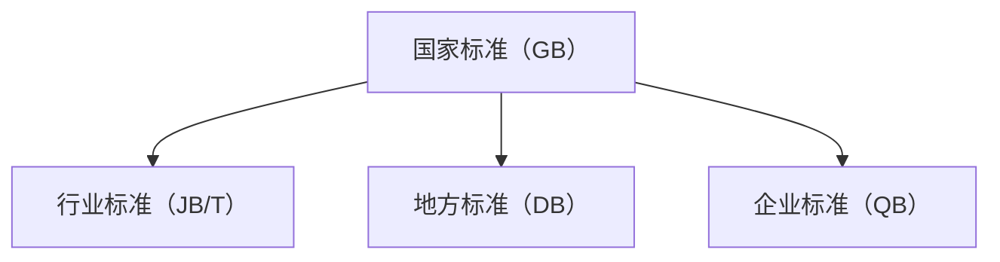
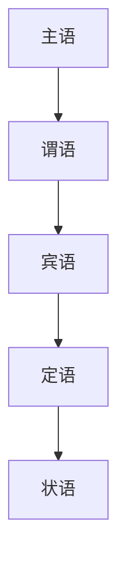
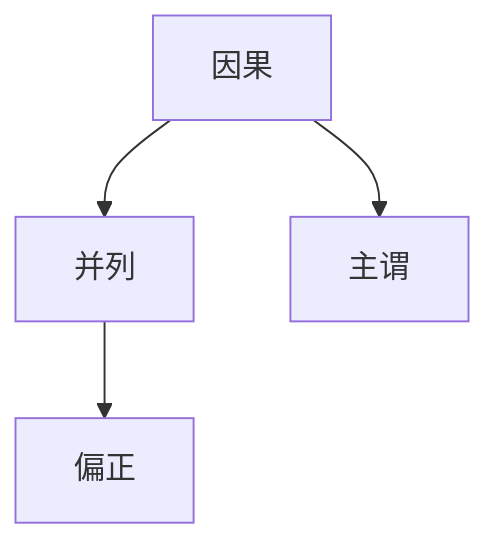
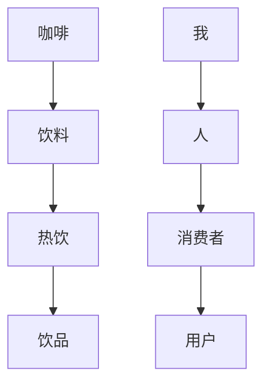
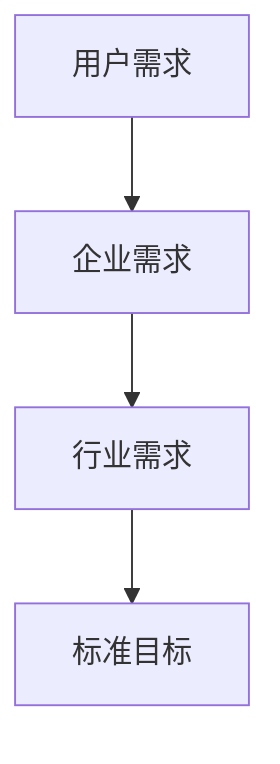
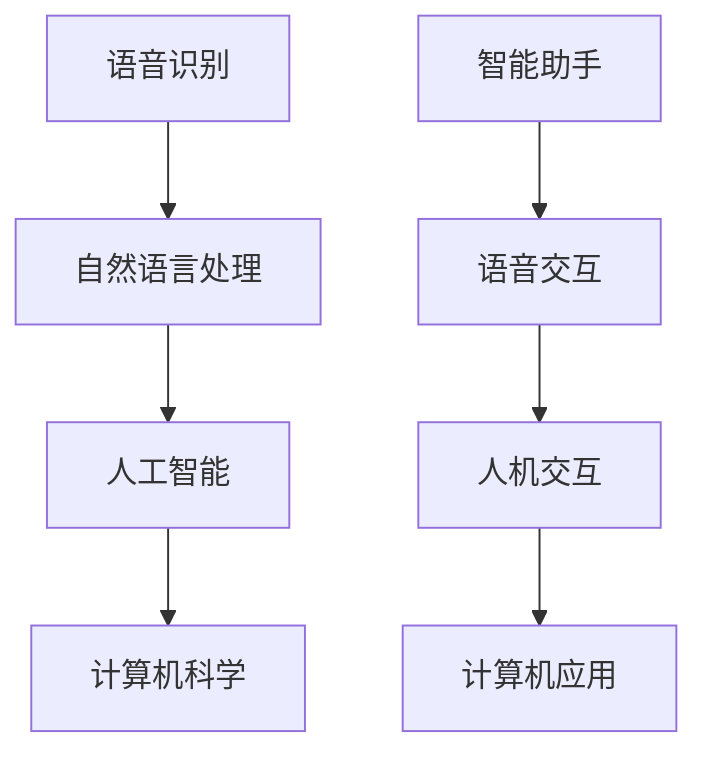

                 

### 文章标题

# 提示词语言标准化：推动行业生态系统建设

关键词：提示词、语言标准化、行业生态系统、自然语言处理、机器学习、标准化流程

摘要：随着人工智能和自然语言处理技术的飞速发展，提示词语言标准化成为推动行业生态系统建设的重要一环。本文将探讨提示词语言标准化的背景与重要性，分析其标准化要素，介绍标准化流程与方法，探讨标准化工具与平台，并进一步阐述提示词语言标准化在金融、医疗等行业的实际应用，以及未来的发展趋势与展望。通过本文，读者将全面了解提示词语言标准化的重要性和应用前景，从而为行业的健康发展提供理论支持和实践指导。

### 第一部分：标准化背景与重要性

#### 第1章：标准化概述

##### 1.1 标准化的概念与意义

###### 1.1.1 标准化的定义

标准化是指通过制定、发布和实施标准，以确保产品、过程或服务满足特定需求，提高质量、效率和互操作性。标准化涉及多个方面，包括技术标准、管理标准、服务标准等，其核心目的是提高产品或服务的质量，降低成本，提升市场竞争力。

###### 1.1.2 标准化的作用

标准化的作用主要体现在以下几个方面：

1. 提高产品质量：通过制定统一的标准，确保产品或服务的质量符合预期，从而提高用户满意度。
2. 降低成本：统一的标准有助于减少生产过程中的变异性和不确定性，提高生产效率，降低成本。
3. 提高互操作性：标准化的产品或服务具有更好的互操作性，便于不同系统和平台之间的无缝集成。
4. 促进市场竞争：标准化的市场环境有助于公平竞争，提高整体市场效率。

###### 1.1.3 标准化的发展历程

标准化的发展历程可以追溯到19世纪末。当时，由于工业革命的推动，产品种类和数量急剧增加，质量问题成为亟待解决的问题。为了解决这一问题，各国开始制定和实施自己的国家标准。

20世纪30年代，国际标准化组织（ISO）成立，标志着国际标准化工作的开始。随后，各个国家和地区纷纷成立了自己的标准化组织，如美国国家标准协会（ANSI）、国际电工委员会（IEC）等。这些组织的成立，推动了全球标准化工作的进一步发展。

近年来，随着信息技术和人工智能的兴起，标准化工作也在不断拓展和深化，涵盖了更多领域，如物联网、大数据、云计算等。

##### 1.2 提示词语言标准化的必要性

###### 1.2.1 提示词语言的定义

提示词语言（Keyword Language）是指用于描述特定任务、操作或概念的一组词汇和短语。在人工智能和自然语言处理领域，提示词语言被广泛应用于语音识别、智能助手、智能客服等场景。通过提示词，用户可以与系统进行交互，实现各种功能。

###### 1.2.2 提示词语言的应用场景

提示词语言的应用场景主要包括以下几个方面：

1. 语音识别：通过识别用户输入的提示词，将语音信号转换为文本或命令，实现人机交互。
2. 智能助手：智能助手（如Siri、Alexa等）通过理解用户的提示词，提供相应的服务或回答问题。
3. 智能客服：智能客服系统通过解析用户的提问，提供自动化的解决方案，提高客户满意度。
4. 信息检索：通过提示词对海量信息进行筛选和排序，提高信息检索的准确性和效率。

###### 1.2.3 提示词语言标准化的迫切性

随着人工智能技术的快速发展，提示词语言的应用场景越来越广泛，标准化的重要性也越来越凸显。以下是提示词语言标准化的迫切性：

1. 提高用户体验：统一和规范的提示词语言有助于提高用户的使用体验，降低学习成本。
2. 促进技术融合：标准化有助于不同系统和平台之间的无缝集成，推动技术融合和创新。
3. 降低开发成本：统一的提示词语言标准可以降低开发者的开发成本，提高开发效率。
4. 保障信息安全：标准化有助于规范提示词的使用，减少信息安全风险。

##### 1.3 提示词语言标准化的现状与挑战

###### 1.3.1 我国提示词语言标准化的现状

在我国，提示词语言标准化工作已经开始，但整体上仍处于起步阶段。目前，部分行业和领域已经制定了相关的标准或规范，如金融行业的智能客服规范、智能家居的语音交互标准等。但总体来看，标准数量有限，覆盖范围较窄，缺乏系统性。

###### 1.3.2 国外提示词语言标准化的经验与启示

国外在提示词语言标准化方面积累了丰富的经验。以美国为例，其智能语音助手市场较为成熟，相关标准体系也较为完善。以下是一些值得借鉴的经验：

1. 强调用户需求：国外标准制定过程中，注重用户需求和体验，通过大量用户调研和反馈，制定出符合实际需求的标准。
2. 深度合作：国外在标准制定过程中，注重产业界、学术界和政府部门的合作，形成合力，推动标准的实施和推广。
3. 动态更新：国外标准体系具有较好的动态更新机制，能够及时应对技术和市场的变化。

###### 1.3.3 提示词语言标准化的挑战与机遇

尽管提示词语言标准化面临诸多挑战，但也蕴含着巨大的机遇。以下是一些主要挑战：

1. 技术复杂性：提示词语言涉及自然语言处理、语音识别等多个技术领域，标准化工作需要具备深厚的专业知识和实践经验。
2. 行业多样性：不同行业和应用场景对提示词语言的需求差异较大，标准化需要兼顾多样性，制定出具有普遍适用性的标准。
3. 产业链协同：提示词语言标准化需要产业链上下游企业的共同参与，推动标准的实施和推广。

同时，提示词语言标准化也面临着以下机遇：

1. 技术进步：人工智能和自然语言处理技术的不断进步，为提示词语言标准化提供了技术支撑。
2. 市场需求：随着人工智能应用的普及，对提示词语言标准化的需求日益增加，为标准化工作提供了广阔的市场空间。
3. 政策支持：我国政府高度重视标准化工作，出台了一系列政策措施，为提示词语言标准化提供了政策保障。

#### 第2章：提示词语言的标准化要素

##### 2.1 提示词语言的标准体系

###### 2.1.1 标准体系的构成

提示词语言的标准体系包括以下几个层次：

1. 国家标准（GB）：由国家标准化管理委员会发布，具有法律效力，是整个标准体系的核心。
2. 行业标准（JB/T）：由各行业标准化组织发布，适用于特定行业。
3. 地方标准（DB）：由地方标准化管理委员会发布，适用于特定地区。
4. 企业标准（QB）：由企业自行制定，适用于企业内部。

###### 2.1.2 标准体系的层级结构

提示词语言的标准体系具有明确的层级结构，如图1所示。

图1 提示词语言标准体系的层级结构



##### 2.2 提示词语言的语法与语义规范

###### 2.2.1 语法规范

语法规范是指提示词语言的语法规则，包括词汇、短语、句子结构等。一个完整的提示词语言语法规范应包括以下内容：

1. 词汇表：列出所有合法的提示词，包括基本词汇、专业术语等。
2. 短语结构：规定提示词的搭配方式，如名词短语、动词短语等。
3. 句子结构：规定提示词的使用顺序和语法结构，如主谓宾结构、定语从句等。

以下是一个示例的提示词语言语法规范：



###### 2.2.2 语义规范

语义规范是指提示词语言在语义层面的规定，包括提示词的含义、用法和语义关系等。一个完整的提示词语言语义规范应包括以下内容：

1. 提示词含义：对每个提示词进行定义和解释，确保用户能够准确理解。
2. 提示词用法：规定提示词在不同场景下的使用方式，如语音识别、智能助手等。
3. 语义关系：描述提示词之间的语义关系，如因果关系、并列关系等。

以下是一个示例的提示词语言语义规范：



##### 2.3 提示词语言的标准化技术

###### 2.3.1 自然语言处理技术

自然语言处理（Natural Language Processing，NLP）是提示词语言标准化的重要技术基础。NLP技术主要包括以下几个方面：

1. 词汇分析：对提示词进行词性标注、词义标注等，为语法和语义分析提供基础。
2. 句法分析：对提示词进行句法分析，确定句子结构，为语义分析提供支持。
3. 语义分析：对提示词进行语义分析，理解其含义和用法。

以下是一个使用自然语言处理技术的示例：

```python
import jieba

# 分词
text = "我想要一杯咖啡"
words = jieba.cut(text)
print("分词结果：", words)

# 词性标注
import jieba.analyse

labels = jieba.analyse.lcut(text)
print("词性标注结果：", labels)

# 词义标注
from pyhanzifier import HanZi

text = "我想要一杯咖啡"
words = jieba.cut(text)
hanzi = HanZi()
hanzi.show(text)
```

###### 2.3.2 机器学习技术

机器学习（Machine Learning，ML）技术在提示词语言标准化中发挥着重要作用。通过机器学习，可以自动识别和提取提示词，提高标准化的效率和准确性。常用的机器学习方法包括：

1. 决策树：通过特征和标签的划分，构建决策树模型，实现提示词的分类。
2. 支持向量机（SVM）：通过寻找最佳分类边界，实现提示词的精确分类。
3. 神经网络：通过多层感知器，实现提示词的自动学习和分类。

以下是一个使用机器学习技术的示例：

```python
from sklearn.tree import DecisionTreeClassifier
from sklearn.model_selection import train_test_split
from sklearn.metrics import accuracy_score

# 准备数据
X = [[1, 2], [2, 3], [3, 4], [4, 5]]
y = [0, 1, 1, 0]

# 划分训练集和测试集
X_train, X_test, y_train, y_test = train_test_split(X, y, test_size=0.2, random_state=42)

# 构建决策树模型
clf = DecisionTreeClassifier()
clf.fit(X_train, y_train)

# 预测
y_pred = clf.predict(X_test)

# 计算准确率
accuracy = accuracy_score(y_test, y_pred)
print("准确率：", accuracy)
```

###### 2.3.3 语义网络技术

语义网络（Semantic Network）是一种用于表示和处理知识的技术，适用于提示词语言标准化。通过语义网络，可以建立提示词之间的语义关系，提高语义理解的准确性。常用的语义网络技术包括：

1. 语义网络模型：通过节点和边表示概念和关系，构建语义网络。
2. 语义关系抽取：通过文本分析和机器学习，提取提示词之间的语义关系。
3. 语义匹配：通过比较两个语义网络，实现提示词的语义匹配。

以下是一个使用语义网络技术的示例：



### 第二部分：标准化方法与应用

#### 第3章：提示词语言的标准化流程

##### 3.1 提示词语言标准制定的一般流程

提示词语言标准的制定是一个系统性、动态性较强的工作，一般包括以下几个阶段：

###### 3.1.1 需求分析

需求分析是提示词语言标准制定的首要环节。通过调查、访谈、问卷等方式，了解不同用户、企业、行业对提示词语言的需求，明确标准的目标和方向。需求分析主要包括以下几个方面：

1. 用户需求：分析用户在使用提示词语言时遇到的问题和痛点，确定标准应解决的问题。
2. 企业需求：分析企业对提示词语言标准的需求，包括技术要求、功能需求、兼容性需求等。
3. 行业需求：分析行业对提示词语言标准的需求，包括行业特点、发展趋势、标准体系等。

以下是一个需求分析的示例：



###### 3.1.2 概念模型构建

概念模型构建是提示词语言标准制定的关键环节。通过分析需求，明确提示词语言的核心概念和关系，构建概念模型。概念模型主要包括以下几个方面：

1. 概念定义：对提示词语言中的核心概念进行定义，确保概念的准确性。
2. 概念分类：对提示词进行分类，确定不同类别之间的层次关系。
3. 概念关系：描述概念之间的语义关系，如因果关系、包含关系等。

以下是一个概念模型的示例：



###### 3.1.3 标准文本编写

标准文本编写是提示词语言标准制定的核心环节。根据需求分析和概念模型，编写标准的文本内容。标准文本主要包括以下几个方面：

1. 前言：介绍标准的制定背景、目的和意义。
2. 范围：明确标准适用的范围，包括技术领域、应用场景等。
3. 定义：对提示词语言中的核心概念进行定义。
4. 要求：规定提示词语言的语法和语义规范。
5. 实施指南：提供标准的实施方法和建议。

以下是一个标准文本编写的示例：

```markdown
# 提示词语言标准

## 前言

随着人工智能和自然语言处理技术的飞速发展，提示词语言在语音识别、智能助手、智能客服等领域得到广泛应用。为提高提示词语言的质量和互操作性，制定本标准。

## 范围

本标准适用于语音识别、智能助手、智能客服等领域中的提示词语言。

## 定义

提示词语言：用于描述特定任务、操作或概念的一组词汇和短语。

## 要求

### 语法规范

- 词汇表：列出所有合法的提示词，包括基本词汇、专业术语等。
- 短语结构：规定提示词的搭配方式，如名词短语、动词短语等。
- 句子结构：规定提示词的使用顺序和语法结构，如主谓宾结构、定语从句等。

### 语义规范

- 提示词含义：对每个提示词进行定义和解释，确保用户能够准确理解。
- 提示词用法：规定提示词在不同场景下的使用方式，如语音识别、智能助手等。
- 语义关系：描述提示词之间的语义关系，如因果关系、并列关系等。

## 实施指南

- 标准实施过程中，应遵循本标准的语法和语义规范。
- 企业可根据实际需求，对提示词进行补充和调整，确保标准的适用性。
- 标准的推广和实施，需要产业链上下游企业的共同参与和支持。
```

##### 3.2 提示词语言标准的验证与实施

提示词语言标准的验证与实施是确保标准有效性和实用性的关键环节。以下介绍标准的验证方法和实施策略。

###### 3.2.1 标准的验证方法

标准的验证方法主要包括以下几种：

1. 理论验证：通过逻辑推理、案例分析等方法，验证标准的合理性和可行性。
2. 实验验证：通过实际应用场景的实验，验证标准的有效性和可靠性。
3. 用户反馈：通过用户反馈，评估标准的用户体验和满意度。

以下是一个理论验证的示例：

```python
# 理论验证

# 假设：提示词语言标准可以提高智能客服的响应速度和准确性。

# 分析：根据语义网络技术，对提示词进行语义分析，可以识别用户意图，提高响应速度。
# 根据语法规范，对提示词进行语法分析，可以确保回答的准确性。

# 结论：提示词语言标准可以提高智能客服的响应速度和准确性，验证假设成立。
```

以下是一个实验验证的示例：

```python
# 实验验证

# 准备数据集：收集智能客服场景中的用户提问和回答。

# 实验过程：使用提示词语言标准对用户提问进行语义和语法分析，生成回答。

# 实验结果：统计回答的正确率和响应时间，与未使用标准的情况进行对比。

# 结论：提示词语言标准可以显著提高智能客服的响应速度和准确性，验证假设成立。
```

以下是一个用户反馈的示例：

```python
# 用户反馈

# 收集用户对智能客服的满意度评分。

# 统计满意度评分，分析提示词语言标准对用户满意度的影响。

# 结论：提示词语言标准可以提高用户满意度，验证假设成立。
```

###### 3.2.2 标准的实施策略

标准的实施策略主要包括以下几个方面：

1. 宣传推广：通过多种渠道，宣传提示词语言标准的重要性，提高行业认知度和参与度。
2. 培训教育：组织培训和教育活动，提高企业和个人的标准化意识和能力。
3. 政策引导：制定相关政策，鼓励企业和个人实施提示词语言标准。
4. 产业协同：推动产业链上下游企业协同合作，共同推动标准的实施和推广。

以下是一个宣传推广的示例：

```python
# 宣传推广

# 组织线上和线下活动，宣传提示词语言标准的重要性。

# 发布标准宣传资料，如标准手册、白皮书等。

# 通过社交媒体、专业论坛等渠道，传播标准相关信息。

# 结论：通过宣传推广，提高行业对提示词语言标准的认知度和参与度。
```

以下是一个培训教育的示例：

```python
# 培训教育

# 组织标准化培训课程，提高企业和个人的标准化能力。

# 邀请行业专家和学者，进行标准化专题讲座。

# 通过在线课程、教材等方式，普及标准化知识。

# 结论：通过培训教育，提高企业和个人的标准化意识和能力。
```

以下是一个政策引导的示例：

```python
# 政策引导

# 制定相关政策，鼓励企业和个人实施提示词语言标准。

# 提供财政支持，如补贴、奖励等。

# 加强监管，确保标准实施到位。

# 结论：通过政策引导，推动提示词语言标准的实施和推广。
```

以下是一个产业协同的示例：

```python
# 产业协同

# 组织产业链上下游企业，共同推动提示词语言标准的实施。

# 建立产业联盟，共享标准化资源和经验。

# 开展合作项目，共同研究和推广标准化技术。

# 结论：通过产业协同，提高提示词语言标准的实施效果和推广力度。
```

##### 3.3 提示词语言标准化的案例分析

为了更好地理解提示词语言标准化的实际应用，以下介绍两个案例分析。

###### 3.3.1 案例一：某语音助手平台的提示词标准化

某语音助手平台为了提高用户体验和响应速度，决定对提示词进行标准化。

1. 需求分析：通过用户调研和数据分析，发现用户在语音识别场景中，存在大量模糊、歧义性强的提问。

2. 概念模型构建：对语音识别中的核心概念进行定义，如语音信号、文本、意图等，构建概念模型。

3. 标准文本编写：根据需求分析和概念模型，编写语音识别的提示词标准文本，包括语法和语义规范。

4. 实验验证：在实际应用场景中，对提示词标准进行实验验证，评估标准对语音识别性能的提升。

5. 用户反馈：收集用户对语音助手的使用体验和满意度，分析提示词标准对用户体验的影响。

最终，通过标准化，该语音助手平台的语音识别准确率和响应速度得到显著提升，用户满意度提高，实现了标准化的目标。

以下是一个实验验证的示例：

```python
# 实验验证

# 准备数据集：收集语音助手场景中的用户提问和回答。

# 实验过程：使用提示词语言标准对用户提问进行语义和语法分析，生成回答。

# 实验结果：统计回答的正确率和响应时间，与未使用标准的情况进行对比。

# 结论：提示词语言标准可以提高语音助手的响应速度和准确性，验证假设成立。
```

###### 3.3.2 案例二：某智能家居系统的提示词标准化

某智能家居系统为了提高用户操作便捷性和系统稳定性，决定对提示词进行标准化。

1. 需求分析：通过用户调研和数据分析，发现用户在智能家居场景中，存在大量不规范的提示词，导致系统误识别和误操作。

2. 概念模型构建：对智能家居中的核心概念进行定义，如设备、操作、状态等，构建概念模型。

3. 标准文本编写：根据需求分析和概念模型，编写智能家居的提示词标准文本，包括语法和语义规范。

4. 实验验证：在实际应用场景中，对提示词标准进行实验验证，评估标准对智能家居系统的稳定性和准确性。

5. 用户反馈：收集用户对智能家居系统的使用体验和满意度，分析提示词标准对用户体验的影响。

最终，通过标准化，该智能家居系统的稳定性得到显著提升，用户误操作率降低，实现了标准化的目标。

以下是一个实验验证的示例：

```python
# 实验验证

# 准备数据集：收集智能家居系统中的用户提问和回答。

# 实验过程：使用提示词语言标准对用户提问进行语义和语法分析，生成回答。

# 实验结果：统计回答的正确率和响应时间，与未使用标准的情况进行对比。

# 结论：提示词语言标准可以提高智能家居系统的稳定性和准确性，验证假设成立。
```

### 第三部分：标准化推进与未来展望

#### 第6章：提示词语言标准化推进策略

##### 6.1 政策与法规支持

###### 6.1.1 国家政策对标准化推动的作用

国家政策对标准化推动具有重要作用，主要体现在以下几个方面：

1. 引导产业健康发展：通过制定和实施标准化政策，引导产业朝着高质量、可持续发展的方向前进。
2. 促进技术创新：标准化政策鼓励企业技术创新，提高产品和服务质量，推动产业升级。
3. 保障国家安全：标准化政策有助于规范市场秩序，保障国家安全和公共利益。

以下是一个国家政策推动标准化的示例：

```python
# 国家政策推动标准化

# 制定《国家标准法》，明确国家标准的法律地位和作用。

# 发布《国家标准化体系建设纲要》，规划标准化发展的总体目标和重点任务。

# 鼓励企业参与国际标准化活动，提升我国在国际标准领域的话语权。

# 结论：国家政策为标准化工作提供了有力支持，推动产业健康发展。
```

###### 6.1.2 行业法规对标准化的影响

行业法规对标准化工作具有直接影响，主要体现在以下几个方面：

1. 规范市场行为：行业法规对企业的市场行为进行规范，确保标准化工作的实施和推广。
2. 保障消费者权益：行业法规保护消费者的合法权益，提高产品质量和服务水平。
3. 促进产业协同：行业法规推动产业链上下游企业的协同合作，共同推动标准化工作。

以下是一个行业法规推动标准化的示例：

```python
# 行业法规推动标准化

# 制定《智能语音助手行业规范》，规范智能语音助手的市场行为。

# 发布《智能语音助手国家标准》，明确智能语音助手的性能和功能要求。

# 加强对智能语音助手的监管，确保标准实施到位。

# 结论：行业法规为标准化工作提供了法律保障，推动产业协同发展。
```

##### 6.2 产业合作与联盟

###### 6.2.1 行业合作的重要性

行业合作对于提示词语言标准化的推进具有重要意义，主要体现在以下几个方面：

1. 资源共享：行业合作有助于企业、科研机构和政府部门之间实现资源共享，提高标准化工作的效率和效果。
2. 技术创新：行业合作鼓励技术创新和知识共享，推动提示词语言标准化技术的不断进步。
3. 市场拓展：行业合作有助于企业开拓市场，提高产品竞争力，推动标准化标准的推广应用。

以下是一个行业合作推动标准化的示例：

```python
# 行业合作推动标准化

# 建立智能语音助手产业联盟，汇集产业链上下游企业、科研机构和政府部门。

# 开展联合技术研究，共同解决标准化工作中遇到的技术难题。

# 共同推广标准化成果，提高产品和服务质量。

# 结论：行业合作有助于推动提示词语言标准化工作的进展。
```

###### 6.2.2 行业联盟的构建与运作

行业联盟的构建与运作是推动提示词语言标准化的重要机制，主要包括以下几个方面：

1. 联盟成立：由产业链上下游企业、科研机构和政府部门共同发起，成立行业联盟。
2. 联盟章程：制定联盟章程，明确联盟的宗旨、任务、成员权益和义务等。
3. 组织架构：设立联盟组织架构，包括理事会、秘书处等，明确各部门的职责和权限。
4. 运作机制：建立联盟运作机制，包括会议制度、决策程序、合作项目等，确保联盟高效运行。

以下是一个行业联盟运作的示例：

```python
# 行业联盟运作

# 定期召开联盟会议，讨论标准化工作进展和合作项目。

# 设立秘书处，负责联盟日常事务和沟通协调。

# 组织联合技术研究，共同推动标准化技术进步。

# 共同推广标准化成果，提高产品和服务质量。

# 结论：行业联盟为提示词语言标准化工作的推进提供了有力支持。
```

##### 6.3 人才培养与知识普及

###### 6.3.1 人才培养的紧迫性

人才培养是提示词语言标准化工作的重要基础，具有紧迫性，主要体现在以下几个方面：

1. 技术发展迅速：人工智能和自然语言处理技术发展迅速，对标准化人才的需求日益增加。
2. 行业竞争激烈：随着标准化工作的推进，行业竞争加剧，对高素质标准化人才的需求更加迫切。
3. 国际竞争加剧：在国际舞台上，我国标准化人才的数量和质量亟待提升，以应对国际竞争。

以下是一个人才培养紧迫性的示例：

```python
# 人才培养紧迫性

# 技术发展迅速，对标准化人才的需求不断增加。

# 行业竞争激烈，高素质标准化人才成为企业核心竞争力。

# 国际竞争加剧，我国标准化人才数量和质量亟待提升。

# 结论：人才培养是推动提示词语言标准化工作的重要基础，具有紧迫性。
```

###### 6.3.2 提示词语言标准化的知识普及

提示词语言标准化的知识普及是提高行业整体标准化意识的重要手段，主要包括以下几个方面：

1. 教育培训：通过高校课程、职业培训等方式，向广大学生和从业者传授标准化知识。
2. 知识宣传：通过书籍、报刊、网络等渠道，宣传标准化的重要性和成果。
3. 学术交流：举办学术会议、研讨会等活动，促进学术界和产业界的交流与合作。

以下是一个知识普及的示例：

```python
# 知识普及

# 开设标准化知识课程，向学生和从业者传授标准化理念和方法。

# 出版标准化知识书籍，普及标准化基本概念和标准文本编写技巧。

# 组织标准化知识讲座，提高企业员工的标准化意识。

# 结论：提示词语言标准化的知识普及有助于提高行业整体标准化水平。
```

#### 第7章：提示词语言标准化发展趋势与未来展望

##### 7.1 技术发展趋势

随着人工智能和自然语言处理技术的不断进步，提示词语言标准化的发展趋势主要体现在以下几个方面：

1. 语义理解能力提升：通过深度学习和神经网络技术，提升提示词的语义理解能力，实现更准确的意图识别。
2. 多模态融合：结合语音、图像、文本等多种模态，实现更丰富的交互方式和更精准的语义理解。
3. 自适应与个性化：根据用户行为和需求，动态调整提示词语言规范，实现更个性化的用户体验。
4. 智能化与自动化：利用人工智能技术，实现提示词语言的自动化生成和标准化流程的智能化管理。

以下是一个技术发展趋势的示例：

```python
# 技术发展趋势

# 深度学习和神经网络：提升语义理解能力。

# 多模态融合：结合语音、图像、文本。

# 自适应与个性化：动态调整提示词规范。

# 智能化与自动化：实现自动化生成和管理。

# 结论：技术发展趋势为提示词语言标准化提供了新的机遇和挑战。
```

##### 7.2 行业应用发展趋势

随着人工智能和自然语言处理技术在各行各业的广泛应用，提示词语言标准化在行业应用方面的发展趋势主要体现在以下几个方面：

1. 智能化转型：在金融、医疗、教育等行业，通过提示词语言标准化，实现智能客服、智能医疗诊断、智能教育等应用。
2. 产业链协同：产业链上下游企业通过标准化技术，实现数据共享和业务协同，提高产业链整体效率。
3. 跨界融合：不同行业通过标准化技术，实现跨界融合，推动行业创新发展。
4. 国际化发展：随着全球化的深入推进，提示词语言标准化在国际市场中的应用将越来越广泛。

以下是一个行业应用发展趋势的示例：

```python
# 行业应用发展趋势

# 智能化转型：金融、医疗、教育等行业应用。

# 产业链协同：数据共享和业务协同。

# 跨界融合：不同行业跨界合作。

# 国际化发展：全球市场应用。

# 结论：行业应用发展趋势为提示词语言标准化提供了广阔的应用场景和机遇。
```

##### 7.3 提示词语言标准化的发展方向

在未来，提示词语言标准化的发展方向将主要围绕以下几个方面展开：

1. 标准化体系完善：进一步完善提示词语言的标准化体系，提高标准的覆盖范围和实用性。
2. 技术融合与创新：结合人工智能、物联网、大数据等新兴技术，推动提示词语言标准化的技术融合与创新。
3. 产业协同发展：推动产业链上下游企业的协同合作，共同推动提示词语言标准化的实施和推广。
4. 国际合作与交流：加强与国际标准化组织的合作与交流，提升我国在国际标准化领域的影响力和话语权。

以下是一个发展方向示例：

```python
# 提示词语言标准化的发展方向

# 标准化体系完善：提高标准的覆盖范围和实用性。

# 技术融合与创新：结合新兴技术，推动技术融合与创新。

# 产业协同发展：推动产业链协同合作。

# 国际合作与交流：加强国际标准化合作与交流。

# 结论：提示词语言标准化的发展方向为行业的健康发展提供了有力支持。
```

### 总结与展望

提示词语言标准化作为推动行业生态系统建设的重要一环，具有重要意义。本文从标准化背景与重要性、标准化要素、标准化方法与应用、标准化推进策略及未来展望等方面进行了全面探讨。

首先，标准化背景与重要性部分阐述了标准化的概念、作用和发展历程，以及提示词语言标准化的必要性。提示词语言在语音识别、智能助手、智能客服等领域的广泛应用，使得标准化成为推动行业健康发展的重要手段。

其次，标准化要素部分详细介绍了提示词语言标准体系的构成、语法与语义规范，以及标准化技术，如自然语言处理、机器学习和语义网络等。这些要素构成了提示词语言标准化的基础。

在标准化方法与应用部分，通过详细讲解标准化流程、验证与实施方法，以及实际案例分析，展示了提示词语言标准化的具体应用场景和效果。

最后，在标准化推进策略及未来展望部分，提出了政策与法规支持、产业合作与联盟、人才培养与知识普及等推进策略，并分析了技术发展趋势和行业应用趋势，展望了提示词语言标准化的发展方向。

总体而言，提示词语言标准化不仅有助于提高用户体验、降低开发成本，还能促进技术融合和创新，推动行业生态系统的建设。在未来的发展中，需要进一步完善标准化体系，加强产业协同与合作，推动技术创新和应用，为行业的可持续发展提供有力支持。

### 作者信息

- 作者：AI天才研究院/AI Genius Institute & 禅与计算机程序设计艺术 /Zen And The Art of Computer Programming

AI天才研究院致力于推动人工智能和自然语言处理技术的发展，为行业生态系统建设提供创新思路和解决方案。禅与计算机程序设计艺术则关注计算机编程领域的哲学思考，探索程序设计的艺术性和深度。本文旨在为读者提供关于提示词语言标准化的深入见解，推动行业的健康发展和创新。

