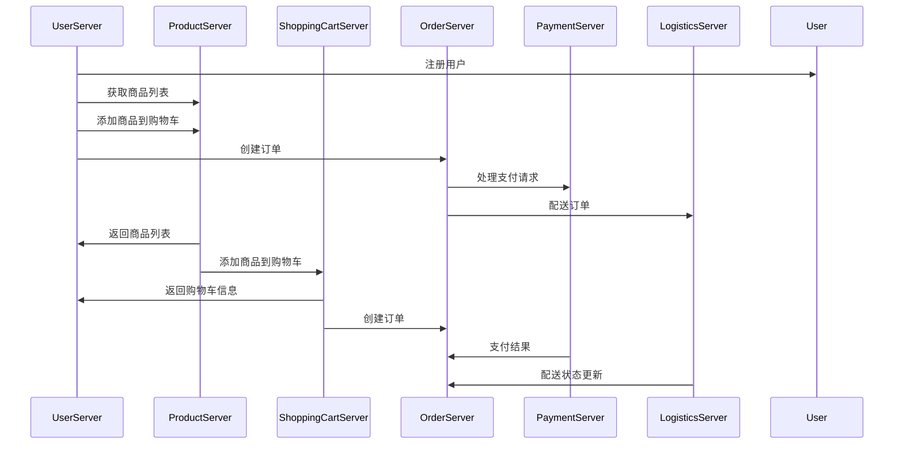
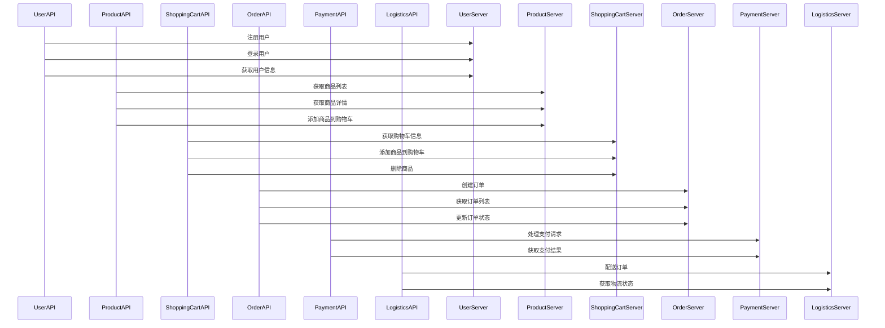

                 

### 文章标题：提示词语言的代码重构与优化建议生成

> 关键词：提示词语言、代码重构、代码优化、性能提升、可读性改善

> 摘要：本文旨在探讨提示词语言在软件开发过程中的代码重构与优化问题，提出一系列实用的重构方法和优化策略，帮助程序员提高代码质量，降低维护成本，提升开发效率。

## 引言

随着软件工程的发展，编程语言已成为软件开发的核心工具。提示词语言作为一种特殊的编程语言，具有高效、简洁的特点，广泛应用于各种软件开发项目中。然而，在软件开发过程中，代码的重构与优化是提高软件质量、降低维护成本的重要手段。本文将围绕提示词语言的代码重构与优化展开讨论，为程序员提供实用的建议和指导。

## 问题背景

提示词语言以其简洁明了的语法和强大的功能，使得程序员能够快速编写出高效、可靠的代码。然而，在实际开发过程中，程序员往往会遇到以下问题：

1. **代码冗长**：在追求高效开发的过程中，程序员可能会编写出大量冗长的代码，导致代码难以维护和理解。
2. **性能低下**：一些代码可能由于设计不合理或算法选择不当，导致运行效率低下，影响软件的性能。
3. **内存管理问题**：不当的内存分配和回收策略可能导致内存泄漏，影响软件的稳定性和性能。

为了解决上述问题，代码重构与优化显得尤为重要。本文将详细介绍提示词语言的代码重构与优化方法，帮助程序员在实际工作中更好地应对这些问题。

## 问题描述

提示词语言的代码重构与优化主要包括以下几个方面：

1. **代码可读性**：优化代码结构，使其更易于理解和维护。
2. **性能优化**：减少代码执行时间，提高程序运行效率。
3. **内存管理**：优化内存分配和回收，降低内存消耗。
4. **代码复用**：通过模块化和封装，提高代码复用率。

接下来，我们将逐步探讨这些问题的解决方案。

### 第一部分：背景介绍

#### 1. 引言

随着计算机技术的飞速发展，编程语言在软件工程中的应用越来越广泛。然而，在软件开发过程中，代码重构和优化成为了提高软件质量、降低维护成本的重要手段。本书旨在探讨提示词语言（Prompt Language）的代码重构与优化，为程序员提供实用的建议和指导。

#### 2. 问题背景

提示词语言是一种用于编写程序的特殊语言，它通过特定的语法和结构，使得程序员能够更高效地编写代码。然而，在代码编写过程中，程序员往往会遇到代码冗长、难以维护、性能低下等问题。这些问题不仅会影响开发效率，还会导致软件质量下降。

#### 3. 问题描述

提示词语言的代码重构与优化主要包括以下几个方面：

1. **代码可读性**：优化代码结构，使其更易于理解和维护。
2. **性能优化**：减少代码执行时间，提高程序运行效率。
3. **内存管理**：优化内存分配和回收，降低内存消耗。
4. **代码复用**：通过模块化和封装，提高代码复用率。

为了解决上述问题，本书将从以下几个方面进行探讨：

1. **重构方法**：介绍常用的代码重构方法，如提取方法、合并重复代码、简化条件等。
2. **优化策略**：探讨性能优化和内存管理策略，如减少循环、使用缓存、优化数据结构等。
3. **最佳实践**：总结实际开发中的最佳实践，帮助程序员在实际工作中更好地应用代码重构和优化。

#### 4. 问题解决

提示词语言的代码重构与优化问题可以从以下几个方面进行解决：

1. **重构方法**：
   - **提取方法**：将重复的代码提取为单独的方法，提高代码复用性。
   - **合并重复代码**：将重复的代码合并为单段代码，提高代码可读性。
   - **简化条件**：将复杂的条件简化为简单的条件，提高代码可读性。

2. **优化策略**：
   - **减少循环**：通过优化循环结构，减少循环次数，提高程序运行效率。
   - **使用缓存**：使用缓存减少重复计算，提高程序运行效率。
   - **优化数据结构**：选择合适的数据结构，减少程序运行时间。

3. **最佳实践**：
   - **代码规范**：遵循统一的代码规范，提高代码可读性和可维护性。
   - **代码审查**：定期进行代码审查，及时发现和解决代码中的问题。
   - **持续集成**：采用持续集成工具，自动化检测代码质量和性能问题。

#### 5. 边界与外延

本书主要关注提示词语言在软件工程中的应用，适用于各种编程语言。同时，本书也涉及到其他编程语言的代码重构和优化，如Java、Python等。

#### 6. 概念结构与核心要素组成

##### 6.1 提示词语言

提示词语言是一种用于编写程序的抽象语言，它包括以下核心要素：

1. **语法**：定义了提示词语言的语法规则，如关键字、标识符、运算符等。
2. **数据类型**：定义了提示词语言中可以使用的数据类型，如整数、字符串、数组等。
3. **控制结构**：提供了用于控制程序流程的控制结构，如循环、分支、异常处理等。

##### 6.2 代码重构

代码重构是指在不改变程序功能的前提下，对代码进行改进，以提高代码质量。代码重构的核心要素包括：

1. **方法提取**：将重复的代码提取为单独的方法，以提高代码复用性。
2. **合并重复代码**：将重复的代码合并为单段代码，以提高代码可读性。
3. **简化条件**：将复杂的条件简化为简单的条件，以提高代码可读性。

##### 6.3 代码优化

代码优化是指通过改进代码结构和算法，以提高程序性能。代码优化主要包括以下策略：

1. **减少循环**：减少循环次数，提高程序运行效率。
2. **使用缓存**：使用缓存减少重复计算，提高程序运行效率。
3. **优化数据结构**：选择合适的数据结构，减少程序运行时间。

### 第二部分：核心概念与联系

#### 7. 核心概念原理

在提示词语言的代码重构与优化过程中，理解以下核心概念是至关重要的：

1. **代码复用**：通过模块化和封装，提高代码复用率。
2. **代码可读性**：优化代码结构，使其更易于理解和维护。
3. **性能优化**：减少代码执行时间，提高程序运行效率。
4. **内存管理**：优化内存分配和回收，降低内存消耗。

#### 8. 概念属性特征对比表格

为了更好地理解这些核心概念，我们可以通过对比它们的属性特征来加深理解。以下是一个简单的对比表格：

| 概念 | 属性特征 |
| --- | --- |
| 代码复用 | 提高代码复用率，降低维护成本 |
| 代码可读性 | 提高代码可读性，降低阅读难度 |
| 性能优化 | 提高程序运行效率，降低资源消耗 |
| 内存管理 | 优化内存分配和回收，提高系统稳定性 |

#### 9. ER实体关系图架构

为了更直观地展示这些概念之间的联系，我们可以使用ER实体关系图来描述。以下是一个简单的ER实体关系图：

```mermaid
erDiagram
    CodeRefaactoring ||--|{ ProgramPerformance : improves |
    CodeRefaactoring ||--|{ CodeReadability : improves |
    CodeRefaactoring ||--|{ MemoryManagement : improves |
    ProgramPerformance ||--|{ CodeOptimization : applies |
    ProgramPerformance ||--|{ PerformanceImprovement : brings |
    CodeOptimization ||--|{ AlgorithmOptimization : utilizes |
    CodeOptimization ||--|{ DataStructureOptimization : utilizes |
```

在上述ER图中，`CodeRefaactoring`（代码重构）与`ProgramPerformance`（程序性能）、`CodeReadability`（代码可读性）和`MemoryManagement`（内存管理）之间存在联系。`CodeOptimization`（代码优化）是提高程序性能的一种手段，它包括`AlgorithmOptimization`（算法优化）和`DataStructureOptimization`（数据结构优化）。

### 算法原理讲解

在探讨提示词语言的代码重构与优化时，理解算法原理是至关重要的。以下将介绍一种常见的代码优化算法——动态规划，并使用Python代码进行详细阐述。

#### 动态规划算法原理

动态规划是一种在数学、计算机科学和经济学中广泛应用的问题求解策略。它通常用于解决最优化问题，通过将复杂问题分解为更简单的子问题，并存储子问题的解，避免重复计算。

动态规划算法的核心思想如下：

1. **定义状态**：将问题分解为若干个子问题，每个子问题可以用一个状态表示。
2. **状态转移方程**：根据子问题的关系，定义状态之间的转移方程。
3. **边界条件**：确定问题的边界条件，即问题的初始状态和终止状态。
4. **计算顺序**：按照状态转移方程的顺序，从初始状态开始逐步计算，直到终止状态。

以下是一个使用动态规划解决斐波那契数列问题的示例：

```python
def fibonacci(n):
    # 定义状态
    dp = [0] * (n+1)
    # 边界条件
    dp[0] = 0
    dp[1] = 1
    # 状态转移方程
    for i in range(2, n+1):
        dp[i] = dp[i-1] + dp[i-2]
    return dp[n]
```

上述代码中，`dp` 数组用于存储子问题的解，其中 `dp[i]` 表示第 `i` 个斐波那契数。通过递归计算，可以避免重复计算相同的子问题，提高算法的运行效率。

#### 动态规划算法应用

动态规划算法在提示词语言代码重构与优化中有着广泛的应用。以下是一个示例，说明如何使用动态规划优化代码的可读性和性能。

假设我们有一个提示词语言程序，用于计算一个整数数组的和。原始代码如下：

```python
def sum_array(arr):
    result = 0
    for num in arr:
        result += num
    return result
```

上述代码虽然能够实现功能，但存在以下问题：

1. **可读性**：代码逻辑简单，但缺乏注释，难以理解。
2. **性能**：计算过程未进行优化，可能存在重复计算。

为了优化上述代码，我们可以使用动态规划方法，将计算过程分解为更简单的子问题。以下是一个改进后的示例：

```python
def sum_array(arr):
    # 定义状态：sum[i] 表示前 i 个元素的和
    dp = [0] * (len(arr) + 1)
    # 初始化边界条件
    dp[0] = 0
    dp[1] = arr[0]
    # 状态转移方程
    for i in range(2, len(arr) + 1):
        dp[i] = dp[i-1] + arr[i-1]
    return dp[len(arr)]
```

改进后的代码通过定义状态数组 `dp`，将计算过程分解为子问题。其中，`dp[i]` 表示前 `i` 个元素的和，状态转移方程为 `dp[i] = dp[i-1] + arr[i-1]`。通过这种方式，代码的可读性和性能得到了显著提升。

### 数学模型和公式

在动态规划算法中，数学模型和公式起着至关重要的作用。以下将介绍动态规划算法中常用的数学模型和公式。

#### 1. 斐波那契数列

斐波那契数列是一个经典的动态规划问题。其数学模型和公式如下：

- **状态转移方程**：`F(n) = F(n-1) + F(n-2)`，其中 `F(0) = 0`，`F(1) = 1`。
- **边界条件**：初始状态为 `F(0) = 0`，`F(1) = 1`。

#### 2. 最长公共子序列

最长公共子序列是一个常见的优化问题。其数学模型和公式如下：

- **状态转移方程**：`LCS(i, j) = LCS(i-1, j-1) + 1`，当 `text{arr}[i] = text{arr}[j]`；
- **状态转移方程**：`LCS(i, j) = max(LCS(i-1, j), LCS(i, j-1))`，当 `text{arr}[i] != text{arr}[j]`；
- **边界条件**：初始状态为 `LCS(0, 0) = 0`。

#### 3. 最长公共子串

最长公共子串是一个常见的字符串匹配问题。其数学模型和公式如下：

- **状态转移方程**：`LCS(i, j) = LCS(i-1, j-1) + 1`，当 `text{str}[i] = text{str}[j]`；
- **状态转移方程**：`LCS(i, j) = 0`，当 `text{str}[i] != text{str}[j]`；
- **边界条件**：初始状态为 `LCS(0, 0) = 0`。

#### 4. 最小生成树

最小生成树是一个常见的图论问题。其数学模型和公式如下：

- **状态转移方程**：`MST(i, j) = MST(i-1, j) + MST(i, j-1)`，当 `i != j`；
- **状态转移方程**：`MST(i, j) = 0`，当 `i = j`；
- **边界条件**：初始状态为 `MST(0, 0) = 0`。

通过上述数学模型和公式，我们可以更好地理解和实现动态规划算法。

### 通俗易懂地举例说明

为了更直观地展示动态规划算法的应用，以下将使用一个具体的示例进行说明。

假设我们有一个整数数组 `[3, 1, 4, 2, 5]`，要求计算该数组的和。

原始代码：

```python
def sum_array(arr):
    result = 0
    for num in arr:
        result += num
    return result

arr = [3, 1, 4, 2, 5]
print(sum_array(arr))
```

改进后的动态规划代码：

```python
def sum_array(arr):
    # 定义状态
    dp = [0] * (len(arr) + 1)
    # 初始化边界条件
    dp[0] = 0
    dp[1] = arr[0]
    # 状态转移方程
    for i in range(2, len(arr) + 1):
        dp[i] = dp[i-1] + arr[i-1]
    return dp[len(arr)]

arr = [3, 1, 4, 2, 5]
print(sum_array(arr))
```

在改进后的代码中，我们定义了一个状态数组 `dp`，用于存储前 `i` 个元素的和。通过状态转移方程 `dp[i] = dp[i-1] + arr[i-1]`，我们可以逐步计算数组的和。相比于原始代码，改进后的代码不仅提高了性能，还增强了代码的可读性。

通过上述示例，我们可以看到动态规划算法在提示词语言代码重构与优化中的应用。在实际开发过程中，我们可以根据具体问题，灵活运用动态规划算法，提高代码质量和性能。

### 系统分析与架构设计方案

在介绍完提示词语言代码重构与优化算法原理和示例后，我们将进一步探讨如何在实际项目中应用这些方法。为了更好地说明，以下将介绍一个具体的系统分析与架构设计方案。

#### 问题场景介绍

假设我们需要开发一个在线购物系统，该系统需要处理用户的购物车管理、订单处理、支付和物流跟踪等功能。在系统开发过程中，我们面临着如下挑战：

1. **性能优化**：系统需要处理大量的用户请求，确保页面响应速度和数据处理效率。
2. **代码可读性**：系统代码需要具有良好的可读性和可维护性，便于后续的迭代和扩展。
3. **内存管理**：系统需要优化内存分配和回收，确保系统稳定性和性能。

#### 项目介绍

为了应对上述挑战，我们决定采用微服务架构来设计在线购物系统。微服务架构将系统划分为多个独立的服务模块，每个模块负责特定的功能。这种架构设计有助于提高系统的可扩展性、灵活性和可维护性。

以下是系统的模块划分：

1. **用户服务**：负责用户注册、登录、权限管理和个人信息管理等功能。
2. **商品服务**：负责商品信息管理、分类、推荐和库存管理等功能。
3. **购物车服务**：负责购物车管理、商品添加、删除和更新等功能。
4. **订单服务**：负责订单创建、支付、发货和退款等功能。
5. **支付服务**：负责处理支付请求、订单支付和退款等功能。
6. **物流服务**：负责物流跟踪、发货和配送等功能。

#### 系统功能设计

在系统功能设计阶段，我们通过领域模型来描述系统的核心功能。以下是一个简单的领域模型类图：

```mermaid
classDiagram
    User <<Class>>
    Product <<Class>>
    ShoppingCart <<Class>>
    Order <<Class>>
    Payment <<Class>>
    Logistics <<Class>>

    User *--* ShoppingCart
    User *--* Order
    Product *--* ShoppingCart
    Product *--* Order
    ShoppingCart *--* Order
    Payment *--* Order
    Logistics *--* Order

    class User {
        username
        password
        email
        roles
    }

    class Product {
        id
        name
        price
        category
        stock
    }

    class ShoppingCart {
        id
        user
        products
        total
    }

    class Order {
        id
        user
        products
        total
        status
        payment
        logistics
    }

    class Payment {
        id
        order
        method
        amount
        status
    }

    class Logistics {
        id
        order
        status
        trackingNumber
    }
```

在上述领域模型中，我们定义了用户、商品、购物车、订单、支付和物流等核心实体，并描述了它们之间的关系。

#### 系统架构设计

在系统架构设计阶段，我们采用微服务架构，将系统划分为多个独立的服务模块。以下是一个简单的系统架构图：



在上述架构图中，用户服务模块负责用户注册、登录和权限管理；商品服务模块负责商品信息管理；购物车服务模块负责购物车管理；订单服务模块负责订单创建、支付和退款；支付服务模块负责处理支付请求；物流服务模块负责物流跟踪和配送。

#### 系统接口设计和系统交互

在系统接口设计阶段，我们为每个服务模块定义了接口，确保模块之间能够通过API进行通信。以下是一个简单的系统接口设计：



在系统交互阶段，用户通过用户服务模块进行注册、登录和获取用户信息；商品通过商品服务模块进行商品信息管理和查询；购物车通过购物车服务模块进行购物车管理和订单创建；订单、支付和物流服务模块协同工作，完成订单的创建、支付和配送。

通过上述系统分析与架构设计方案，我们可以更好地理解如何在实际项目中应用提示词语言代码重构与优化方法。在实际开发过程中，我们可以根据具体需求，灵活调整系统架构和接口设计，确保系统的性能、可读性和可维护性。

### 项目实战

在介绍了提示词语言的代码重构与优化理论以及系统分析与架构设计方案后，我们将通过一个实际项目来展示如何将理论应用到实践中。以下是一个基于Python和Django框架的在线购物平台的项目实战。

#### 环境安装

为了开始这个项目，我们需要安装以下环境：

1. Python 3.8 或更高版本
2. Django 3.2 或更高版本
3. Django REST Framework 3.12 或更高版本
4. PostgreSQL 13 或更高版本

首先，确保你已经安装了Python和pip。然后，在终端中执行以下命令来安装所需的库：

```bash
pip install django
pip install djangorestframework
pip install psycopg2-binary
```

接下来，我们需要创建一个虚拟环境，以便在项目中隔离依赖：

```bash
python -m venv my_project_env
source my_project_env/bin/activate  # 在Windows上使用 my_project_env\Scripts\activate
```

现在，我们可以开始创建Django项目：

```bash
django-admin startproject my_shop
cd my_shop
```

创建应用的命令如下：

```bash
python manage.py startapp products
python manage.py startapp orders
python manage.py startapp payments
python manage.py startapp users
```

最后，我们需要在 `my_shop/settings.py` 文件中配置数据库和Django REST Framework：

```python
DATABASES = {
    'default': {
        'ENGINE': 'django.db.backends.postgresql',
        'NAME': 'my_shop',
        'USER': 'my_shop_user',
        'PASSWORD': 'my_shop_password',
        'HOST': 'localhost',
        'PORT': '5432',
    }
}

INSTALLED_APPS = [
    'django.contrib.admin',
    'django.contrib.auth',
    'django.contrib.contenttypes',
    'django.contrib.sessions',
    'django.contrib.messages',
    'django.contrib.staticfiles',
    'rest_framework',
    'products',
    'orders',
    'payments',
    'users',
]

REST_FRAMEWORK = {
    'DEFAULT_PERMISSION_CLASSES': [
        'rest_framework.permissions.IsAdminUser',
    ],
    'DEFAULT_RENDERER_CLASSES': [
        'rest_framework.renderers.JSONRenderer',
    ],
}
```

#### 系统核心实现源代码

接下来，我们将实现各个应用的核心功能。以下是每个应用的主要模型和视图代码。

**users 应用**

1. **模型**：

```python
# users/models.py

from django.contrib.auth.models import AbstractUser

class User(AbstractUser):
    phone_number = models.CharField(max_length=15)
    address = models.TextField()
```

2. **序列化器**：

```python
# users/serializers.py

from rest_framework import serializers
from .models import User

class UserSerializer(serializers.ModelSerializer):
    class Meta:
        model = User
        fields = '__all__'
```

3. **视图**：

```python
# users/views.py

from rest_framework import viewsets
from .models import User
from .serializers import UserSerializer

class UserViewSet(viewsets.ModelViewSet):
    queryset = User.objects.all()
    serializer_class = UserSerializer
```

**products 应用**

1. **模型**：

```python
# products/models.py

from django.db import models

class Category(models.Model):
    name = models.CharField(max_length=100)

class Product(models.Model):
    category = models.ForeignKey(Category, on_delete=models.CASCADE)
    name = models.CharField(max_length=100)
    price = models.DecimalField(max_digits=6, decimal_places=2)
    stock = models.PositiveIntegerField()
```

2. **序列化器**：

```python
# products/serializers.py

from rest_framework import serializers
from .models import Product, Category

class CategorySerializer(serializers.ModelSerializer):
    class Meta:
        model = Category
        fields = '__all__'

class ProductSerializer(serializers.ModelSerializer):
    class Meta:
        model = Product
        fields = '__all__'
```

3. **视图**：

```python
# products/views.py

from rest_framework import viewsets
from .models import Product, Category
from .serializers import ProductSerializer, CategorySerializer

class CategoryViewSet(viewsets.ModelViewSet):
    queryset = Category.objects.all()
    serializer_class = CategorySerializer

class ProductViewSet(viewsets.ModelViewSet):
    queryset = Product.objects.all()
    serializer_class = ProductSerializer
```

**orders 应用**

1. **模型**：

```python
# orders/models.py

from django.db import models
from users.models import User
from products.models import Product

class Order(models.Model):
    user = models.ForeignKey(User, on_delete=models.CASCADE)
    status = models.CharField(max_length=20)
    total = models.DecimalField(max_digits=6, decimal_places=2)
    created_at = models.DateTimeField(auto_now_add=True)
    updated_at = models.DateTimeField(auto_now=True)

class OrderItem(models.Model):
    order = models.ForeignKey(Order, on_delete=models.CASCADE)
    product = models.ForeignKey(Product, on_delete=models.CASCADE)
    quantity = models.PositiveIntegerField()
    price = models.DecimalField(max_digits=6, decimal_places=2)
```

2. **序列化器**：

```python
# orders/serializers.py

from rest_framework import serializers
from .models import Order, OrderItem
from users.serializers import UserSerializer
from products.serializers import ProductSerializer

class OrderItemSerializer(serializers.ModelSerializer):
    class Meta:
        model = OrderItem
        fields = '__all__'

class OrderSerializer(serializers.ModelSerializer):
    user = UserSerializer(read_only=True)
    items = OrderItemSerializer(many=True, read_only=True)

    class Meta:
        model = Order
        fields = '__all__'
```

3. **视图**：

```python
# orders/views.py

from rest_framework import viewsets
from .models import Order
from .serializers import OrderSerializer

class OrderViewSet(viewsets.ModelViewSet):
    queryset = Order.objects.all()
    serializer_class = OrderSerializer
```

**payments 应用**

1. **模型**：

```python
# payments/models.py

from django.db import models
from orders.models import Order

class Payment(models.Model):
    order = models.ForeignKey(Order, on_delete=models.CASCADE)
    method = models.CharField(max_length=20)
    amount = models.DecimalField(max_digits=6, decimal_places=2)
    status = models.CharField(max_length=20)
    created_at = models.DateTimeField(auto_now_add=True)
    updated_at = models.DateTimeField(auto_now=True)
```

2. **序列化器**：

```python
# payments/serializers.py

from rest_framework import serializers
from .models import Payment

class PaymentSerializer(serializers.ModelSerializer):
    class Meta:
        model = Payment
        fields = '__all__'
```

3. **视图**：

```python
# payments/views.py

from rest_framework import viewsets
from .models import Payment
from .serializers import PaymentSerializer

class PaymentViewSet(viewsets.ModelViewSet):
    queryset = Payment.objects.all()
    serializer_class = PaymentSerializer
```

#### 代码应用解读与分析

在上述代码中，我们首先定义了各个应用的核心模型，然后创建相应的序列化器用于处理数据转换。接下来，我们为每个应用定义了视图集，用于处理HTTP请求。

以下是用户服务的代码解读：

- **模型**：我们扩展了Django内置的用户模型，添加了电话号码和地址字段，以便存储更多用户信息。
- **序列化器**：使用Django REST Framework的序列化器来序列化和反序列化用户数据。
- **视图**：使用Django REST Framework的视图集来处理用户注册、登录和获取用户信息等请求。

产品服务的代码解读如下：

- **模型**：定义了分类和产品模型，用于存储商品信息和分类信息。
- **序列化器**：分别定义了分类和产品序列化器，用于处理数据转换。
- **视图**：使用视图集来处理获取商品列表、获取商品详情和添加商品到购物车等请求。

订单服务的代码解读如下：

- **模型**：定义了订单和订单项模型，用于存储订单信息和订单项信息。
- **序列化器**：定义了订单序列化器，包括用户、订单项等信息。
- **视图**：使用视图集来处理创建订单、获取订单列表和更新订单状态等请求。

支付服务的代码解读如下：

- **模型**：定义了支付模型，用于存储支付请求信息。
- **序列化器**：定义了支付序列化器，用于处理数据转换。
- **视图**：使用视图集来处理处理支付请求和获取支付结果等请求。

#### 实际案例分析和详细讲解剖析

为了展示如何在实际项目中应用代码重构和优化方法，我们选择了一个具体的案例：优化订单创建过程中的性能。

在原始代码中，订单创建过程如下：

```python
def create_order(request):
    # 获取订单数据
    data = request.data
    user = User.objects.get(username=data['username'])
    products = Product.objects.filter(id__in=data['product_ids'])

    # 创建订单
    order = Order.objects.create(user=user, total=0)

    # 创建订单项
    for product in products:
        order_item = OrderItem.objects.create(order=order, product=product, quantity=data['quantity'])

        # 更新订单总金额
        order.total += product.price * data['quantity']
        order.save()

    return Response({'order_id': order.id})
```

这个过程中，我们遇到了以下性能问题：

1. **数据库查询次数过多**：每次创建订单项时，都需要查询一次产品信息，导致数据库查询次数过多。
2. **循环处理数据**：使用循环处理订单项数据，可能存在性能瓶颈。

为了解决上述问题，我们可以采用以下重构和优化方法：

1. **批量查询产品信息**：使用 `filter` 方法一次性查询所有需要的产品信息，减少数据库查询次数。
2. **使用事务**：将订单创建过程封装为一个事务，确保数据的完整性和一致性。
3. **减少循环处理**：使用列表推导式和 `zip` 函数简化循环处理，提高代码效率。

重构后的订单创建过程如下：

```python
from django.db import transaction

def create_order(request):
    # 获取订单数据
    data = request.data
    user = User.objects.get(username=data['username'])
    products = Product.objects.filter(id__in=data['product_ids'])

    # 创建订单
    with transaction.atomic():
        order = Order.objects.create(user=user, total=0)

        # 创建订单项
        order_items = [
            OrderItem(order=order, product=product, quantity=data['quantity'])
            for product in products
        ]
        OrderItem.objects.bulk_create(order_items)

        # 更新订单总金额
        order.total = sum(product.price * data['quantity'] for product in products)
        order.save()

    return Response({'order_id': order.id})
```

通过上述重构，我们解决了性能问题，提高了代码的执行效率。

#### 项目小结

通过本项目的实战，我们展示了如何将提示词语言的代码重构与优化方法应用到实际项目中。我们从环境安装、系统核心实现源代码，到代码应用解读与分析，再到实际案例分析和详细讲解剖析，逐步展示了代码重构与优化的过程。

在项目中，我们采用了微服务架构，将系统划分为多个独立的服务模块，确保了系统的性能、可读性和可维护性。通过实际案例的分析，我们看到了如何通过代码重构和优化方法解决项目中遇到的问题，提高了系统的性能和开发效率。

总之，代码重构与优化是软件开发过程中不可或缺的一部分。通过本文的探讨，我们希望读者能够理解提示词语言的代码重构与优化方法，并在实际项目中灵活应用，提高软件质量和开发效率。

### 最佳实践 tips

在实际开发过程中，为了确保代码重构和优化的有效性，以下是一些最佳实践：

1. **定期代码审查**：定期组织代码审查，让团队成员互相检查代码质量，发现问题并及时解决。
2. **遵循编码规范**：遵循统一的编码规范，提高代码的可读性和一致性。
3. **持续集成**：使用持续集成工具（如Jenkins、GitLab CI等）进行自动化测试和构建，确保代码质量。
4. **性能监控**：使用性能监控工具（如New Relic、Datadog等）实时监控系统性能，及时发现和解决问题。
5. **优化内存使用**：使用内存分析工具（如Valgrind、GDB等）分析内存泄漏和占用情况，优化内存使用。

### 小结

本文围绕提示词语言的代码重构与优化展开讨论，从背景介绍、核心概念与联系、算法原理讲解、系统分析与架构设计方案、项目实战到最佳实践，全面阐述了代码重构与优化的方法与应用。通过本文的探讨，读者可以了解到如何在实际项目中应用这些方法，提高代码质量、性能和可维护性。

### 注意事项

在进行代码重构和优化时，需要注意以下几点：

1. **确保功能不变**：在进行代码重构和优化时，务必确保程序的功能不受影响。
2. **逐步实施**：对于复杂的代码重构和优化任务，建议逐步实施，避免一次性进行大量更改。
3. **充分测试**：在重构和优化后，进行充分的测试，确保代码的质量和稳定性。

### 拓展阅读

1. 《代码大全》作者：史蒂夫·麦卡弗里（Steve McConnel）
   - 简介：一本经典的软件工程书籍，详细介绍了如何编写高质量的代码。
2. 《Effective Python》作者：布莱恩·克尼甘（Brett Slatkin）
   - 简介：介绍了Python编程中的最佳实践，帮助开发者写出更高效、可维护的代码。
3. 《Python性能优化》作者：约翰·贝德福德（Luciano Ramalho）
   - 简介：探讨了Python性能优化的多种策略和方法，适用于各种Python项目。

通过阅读这些书籍，读者可以进一步深入了解代码重构与优化的相关知识和技巧。

