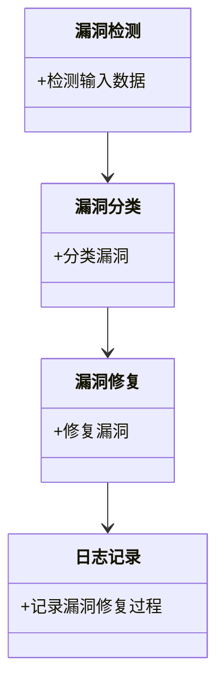
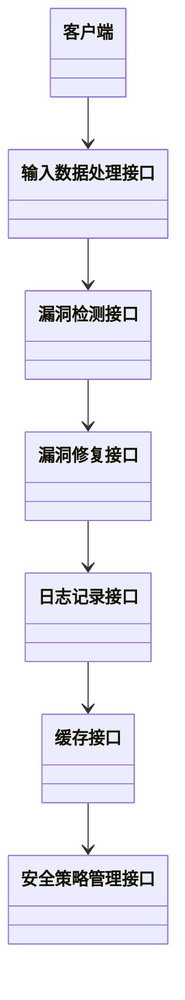
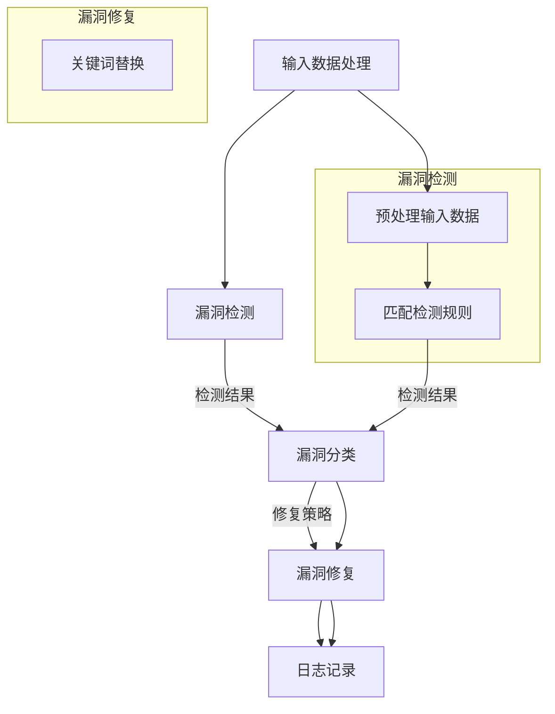

                 

# 提示词语言的安全漏洞自动修复技术

> 关键词：提示词语言、安全漏洞、自动修复、算法原理、系统设计、项目实战

> 摘要：本文围绕提示词语言的安全漏洞自动修复技术，从背景介绍、核心概念与联系、算法原理讲解、系统分析与架构设计、项目实战、最佳实践与拓展等多个方面进行了深入探讨。旨在为读者提供一个全面、系统的了解和掌握这一前沿技术的途径，提升网络安全防护能力。

## 目录大纲

### 第一部分：背景介绍

1. **第1章 问题背景与概念框架**
   - 1.1 问题背景
   - 1.2 提示词语言的安全漏洞
   - 1.3 自动修复技术的核心概念
   - 1.4 安全漏洞自动修复技术的应用场景
   - 1.5 本章小结

2. **第2章 核心概念原理与特性**
   - 2.1 核心概念原理
   - 2.2 概念属性特征对比
   - 2.3 ER实体关系图架构
   - 2.4 本章小结

### 第二部分：核心概念与联系

3. **第3章 安全漏洞自动修复算法**
   - 3.1 算法概述
   - 3.2 算法原理讲解
   - 3.3 数学模型与公式
   - 3.4 详细讲解与举例说明
   - 3.5 本章小结

### 第三部分：算法原理讲解

4. **第4章 安全漏洞自动修复系统设计**
   - 4.1 问题场景介绍
   - 4.2 系统功能设计
   - 4.3 系统架构设计
   - 4.4 系统接口设计
   - 4.5 系统交互设计
   - 4.6 本章小结

### 第四部分：项目实战

5. **第5章 安全漏洞自动修复项目实战**
   - 5.1 环境安装
   - 5.2 系统核心实现
   - 5.3 实际案例分析
   - 5.4 详细讲解与剖析
   - 5.5 项目小结

### 第五部分：最佳实践与拓展

6. **第6章 最佳实践与拓展**
   - 6.1 最佳实践
   - 6.2 小结与注意事项
   - 6.3 拓展阅读
   - 6.4 本章小结

## 第一部分：背景介绍

### 第1章 问题背景与概念框架

#### 1.1 问题背景

提示词语言（Prompt Language），是计算机科学中用于与用户交互、引导用户输入、进行任务指令传达的一种技术手段。在人工智能和自然语言处理领域，提示词语言具有重要作用，通过精准的提示词，系统能够有效地理解用户的意图和需求，从而提供更加个性化和高效的服务。

然而，随着提示词语言的广泛应用，其安全性问题逐渐凸显。提示词语言的安全漏洞主要表现为以下几种类型：

1. **命令注入漏洞**：攻击者通过插入恶意代码或命令，控制程序执行非法操作。
2. **跨站脚本漏洞**（XSS）：恶意脚本在用户浏览网页时被执行，窃取用户数据或进行其他非法操作。
3. **SQL注入漏洞**：攻击者通过插入恶意的SQL语句，篡改数据库内容或执行非法查询。

这些安全漏洞可能导致以下危害：

- **数据泄露**：敏感数据被非法访问和窃取。
- **系统篡改**：恶意代码被执行，系统被攻击者控制。
- **服务中断**：系统功能被破坏，导致服务不可用。

因此，针对提示词语言的安全漏洞进行自动修复显得尤为重要。自动修复技术能够实时检测漏洞、自动修复漏洞，减少人工干预，提高系统的安全性和稳定性。

#### 1.2 提示词语言的安全漏洞

提示词语言的安全漏洞主要包括以下几类：

1. **命令注入漏洞**：攻击者通过在输入参数中插入恶意代码或命令，使得程序执行非法操作。如：`bash "rm -rf /*"`。
2. **跨站脚本漏洞**（XSS）：攻击者通过在网页中插入恶意脚本，使得用户在访问网页时执行这些脚本，进而窃取用户数据或进行其他非法操作。如：`<script>alert('XSS Attack')</script>`。
3. **SQL注入漏洞**：攻击者通过在输入参数中插入恶意的SQL语句，篡改数据库内容或执行非法查询。如：`' OR '1'='1`。

这些漏洞的产生原因主要有：

- **输入验证不足**：对用户输入的数据没有进行充分的验证，导致恶意数据被直接传递到程序中。
- **编码不当**：提示词语言中的特殊字符未进行适当的编码或转义，使得恶意代码能够被解释和执行。
- **权限管理不足**：程序中的权限设置不够严格，导致攻击者可以执行非法操作。

这些安全漏洞可能导致以下危害：

- **数据泄露**：敏感数据被非法访问和窃取，如用户名、密码、信用卡信息等。
- **系统篡改**：恶意代码被执行，系统被攻击者控制，导致系统功能被破坏或无法正常运行。
- **服务中断**：系统功能被破坏，导致服务不可用，影响用户体验。

#### 1.3 自动修复技术的核心概念

自动修复技术是指通过软件系统或工具，对提示词语言中的安全漏洞进行实时检测和自动修复的技术手段。其核心概念包括：

1. **漏洞检测**：通过分析输入数据，检测其中可能存在的安全漏洞。
2. **漏洞修复**：对检测到的漏洞进行自动修复，以恢复系统的正常运行。
3. **实时性**：自动修复技术能够在漏洞发生时迅速响应，减少漏洞存在的时间，降低安全风险。
4. **自动化**：自动修复技术无需人工干预，能够自动完成漏洞检测和修复过程，提高系统安全性和稳定性。

自动修复技术的基本原理是：

1. **输入验证**：对用户输入的数据进行严格验证，确保数据符合安全要求，防止恶意数据进入系统。
2. **漏洞扫描**：对输入数据进行分析，检测其中可能存在的漏洞，如命令注入、跨站脚本、SQL注入等。
3. **漏洞修复**：对检测到的漏洞进行自动修复，如替换恶意代码、禁用特定功能等。
4. **日志记录**：记录漏洞检测和修复过程，以便后续分析和改进。

自动修复技术的优势包括：

- **提高安全性**：能够实时检测和修复安全漏洞，降低安全风险。
- **降低成本**：减少人工干预，降低维护成本。
- **提高效率**：自动化处理漏洞，提高修复速度。

面临的挑战包括：

- **漏洞多样化**：随着技术的发展，新的漏洞不断出现，自动修复技术需要不断更新和改进。
- **误报与漏报**：自动修复技术需要在准确性和效率之间取得平衡，避免误报和漏报现象。
- **兼容性问题**：自动修复技术需要与现有系统兼容，确保不会影响系统的正常运行。

#### 1.4 安全漏洞自动修复技术的应用场景

安全漏洞自动修复技术主要应用于以下场景：

1. **Web应用**：针对Web应用的输入验证、参数处理、存储等环节，检测和修复安全漏洞，如SQL注入、跨站脚本等。
2. **自然语言处理系统**：对自然语言处理系统中的输入数据进行检测和修复，如自动回复系统、语音识别系统等。
3. **智能助理**：对智能助理系统中的输入数据进行分析和修复，确保其能够安全、准确地处理用户请求。
4. **物联网设备**：针对物联网设备中的输入数据，检测和修复安全漏洞，如智能家居设备、智能穿戴设备等。
5. **企业内部应用**：对企业内部应用进行安全漏洞检测和修复，如办公自动化系统、ERP系统等。

在网络安全中，自动修复技术具有重要地位：

- **提高网络安全防护能力**：自动修复技术能够实时检测和修复安全漏洞，降低安全风险，提高网络防护能力。
- **减少人力成本**：自动修复技术减少人工干预，降低维护成本，提高系统安全性。
- **提高系统稳定性**：自动修复技术能够及时修复漏洞，确保系统正常运行，提高用户体验。

面向未来，自动修复技术将继续发展，成为网络安全防护体系的重要组成部分。随着人工智能和自然语言处理技术的不断进步，自动修复技术将能够更加智能化、高效地应对各种安全威胁。

#### 1.5 本章小结

本章从问题背景、概念框架、安全漏洞类型、自动修复技术的核心概念以及应用场景等方面，对提示词语言的安全漏洞自动修复技术进行了全面介绍。本章内容为后续章节的深入探讨奠定了基础，有助于读者更好地理解这一前沿技术。

## 第二部分：核心概念与联系

### 第2章 核心概念原理与特性

#### 2.1 核心概念原理

提示词语言的安全漏洞自动修复技术涉及多个核心概念和原理。以下将逐一介绍：

1. **漏洞检测**：漏洞检测是自动修复技术的第一步。通过分析输入数据，检测其中可能存在的安全漏洞。常用的方法包括正则表达式匹配、基于规则的方法和机器学习等方法。

2. **漏洞分类**：漏洞检测后，需要对漏洞进行分类，以便于采取相应的修复策略。常见的漏洞类型包括命令注入、跨站脚本、SQL注入等。

3. **漏洞修复**：漏洞修复是自动修复技术的核心环节。根据检测到的漏洞类型，采取相应的修复策略。常见的修复方法包括代码替换、禁用功能、注入安全码等。

4. **实时性**：自动修复技术需要在漏洞发生时迅速响应，减少漏洞存在的时间。实现实时性需要高效的数据处理和分析算法，以及快速的反应机制。

5. **自动化**：自动修复技术无需人工干预，能够自动完成漏洞检测和修复过程。实现自动化需要完善的算法模型和系统架构设计。

6. **兼容性**：自动修复技术需要与现有系统兼容，确保不会影响系统的正常运行。实现兼容性需要深入理解现有系统的架构和运行机制。

7. **日志记录**：自动修复技术需要记录漏洞检测和修复过程，以便后续分析和改进。日志记录包括漏洞类型、修复策略、修复时间等信息。

#### 2.2 概念属性特征对比

以下是对提示词语言安全漏洞和自动修复技术的概念属性特征进行对比：

| 特征                | 提示词语言安全漏洞             | 自动修复技术                          |
|---------------------|--------------------------------|---------------------------------------|
| 漏洞类型            | 命令注入、跨站脚本、SQL注入等   | 漏洞检测、漏洞分类、漏洞修复等         |
| 漏洞产生原因        | 输入验证不足、编码不当、权限管理不足等 | 漏洞多样化、误报与漏报、兼容性问题等 |
| 漏洞危害与影响      | 数据泄露、系统篡改、服务中断等   | 提高安全性、降低成本、提高效率等       |
| 核心概念原理        | 漏洞检测、漏洞分类、漏洞修复等   | 输入验证、漏洞扫描、漏洞修复、实时性等 |
| 自动化与实时性      | 静态分析、人工处理、延时修复     | 自动化处理、实时响应、快速修复         |
| 与系统兼容性        | 系统外部攻击、依赖性较低       | 系统内部修复、依赖性较高、需要兼容性设计 |

#### 2.3 ER实体关系图架构

为了更好地理解提示词语言安全漏洞和自动修复技术的实体关系，我们可以通过ER（实体-关系）图进行描述。

1. **实体**：

   - **漏洞**：包括漏洞ID、漏洞类型、漏洞描述、漏洞发生时间等属性。
   - **修复策略**：包括修复策略ID、修复策略名称、修复策略描述等属性。
   - **修复日志**：包括日志ID、漏洞ID、修复策略ID、修复时间等属性。

2. **关系**：

   - **检测与修复**：表示漏洞与修复策略之间的关联关系，一个漏洞可以有多个修复策略。
   - **修复与日志**：表示修复策略与修复日志之间的关联关系，一个修复策略可以有多个修复日志。

以下是ER图的Mermaid表示：

```mermaid
erDiagram
    漏洞 ||--|{ 修复策略 }|| 修复与修复策略
    修复策略 ||--|{ 修复日志 }|| 修复与修复日志
```

通过ER图，我们可以清晰地看到提示词语言安全漏洞、自动修复策略和修复日志之间的实体关系和关联关系，有助于理解自动修复技术的整体架构和工作流程。

#### 2.4 本章小结

本章对提示词语言的安全漏洞自动修复技术的核心概念原理和特性进行了详细阐述。通过对漏洞检测、漏洞分类、漏洞修复、实时性、自动化、兼容性等核心概念的分析，以及与提示词语言安全漏洞的属性特征对比，读者可以更深入地理解自动修复技术的工作原理和优势。同时，通过ER实体关系图的描述，有助于读者更好地把握自动修复技术的整体架构和工作流程。本章内容为后续章节的深入探讨奠定了基础。

## 第三部分：算法原理讲解

### 第3章 安全漏洞自动修复算法

#### 3.1 算法概述

安全漏洞自动修复算法是自动修复技术的核心组成部分。根据应用场景和需求，可以将其分为以下几类：

1. **基于规则的方法**：通过预定义的规则，对输入数据进行检测和修复。优点是规则明确、易于理解和实现；缺点是规则需要不断更新和优化，以应对新的漏洞。
2. **机器学习方法**：通过训练模型，对输入数据进行自动检测和修复。优点是能够自适应地应对新的漏洞，无需频繁更新规则；缺点是需要大量的训练数据和计算资源。
3. **混合方法**：结合基于规则和机器学习方法，以提高检测和修复的准确性和效率。

选择适合的算法需要考虑以下因素：

1. **应用场景**：针对不同的应用场景，选择适合的算法。例如，对于实时性要求较高的场景，可以选择基于规则的算法；对于复杂场景，可以选择机器学习方法。
2. **计算资源**：算法的复杂度和计算资源需求对系统的性能有重要影响。对于资源有限的系统，应选择计算资源需求较低的算法。
3. **准确性和效率**：算法的准确性和效率是衡量其性能的重要指标。需要根据实际需求，在准确性和效率之间进行权衡。

#### 3.2 算法原理讲解

以下以基于规则的算法为例，讲解安全漏洞自动修复的基本原理。

1. **输入数据处理**：对输入数据进行预处理，包括数据清洗、去噪、标准化等。预处理有助于提高算法的准确性和效率。
2. **漏洞检测**：根据预定义的规则，对输入数据进行漏洞检测。常用的规则包括字符串匹配、正则表达式匹配、模式识别等。
3. **漏洞分类**：对检测到的漏洞进行分类，以便采取相应的修复策略。常见的分类方法包括基于规则的分类、基于机器学习的分类等。
4. **漏洞修复**：根据分类结果，采取相应的修复策略。常见的修复策略包括代码替换、禁用功能、注入安全码等。
5. **实时性保障**：为了保证算法的实时性，需要在漏洞检测和修复过程中采取高效的算法和数据结构。例如，使用哈希表、布隆过滤器等数据结构，以及快速排序、二分查找等算法。
6. **日志记录**：记录漏洞检测和修复过程，以便后续分析和改进。日志记录包括漏洞ID、漏洞类型、修复策略、修复时间等。

以下是一个简单的Mermaid算法流程图：


#### 3.3 数学模型与公式

安全漏洞自动修复算法中的数学模型主要包括：

1. **漏洞检测概率**：设输入数据为X，漏洞类型为Y，漏洞检测概率为P(Y|X)。
2. **漏洞修复成功率**：设修复策略为Z，漏洞修复成功率为P(Z|Y)。
3. **总体修复成功率**：设总体修复成功率为S，有 S = ∑P(Z|Y)P(Y|X)。

数学模型有助于我们评估算法的性能和效果。以下是一个简单的数学模型示例：

$$
P(Y|X) = \frac{P(X|Y)P(Y)}{P(X)}
$$

其中，P(X|Y)为漏洞发生条件下的输入数据概率，P(Y)为漏洞发生的先验概率，P(X)为输入数据的总概率。

#### 3.4 详细讲解与举例说明

以下通过一个具体案例，详细讲解安全漏洞自动修复算法的应用过程。

**案例背景**：假设我们有一个基于Web的在线购物系统，其中用户可以通过输入商品名称、价格等参数进行购物。然而，该系统存在SQL注入漏洞，攻击者可以通过恶意输入篡改数据库内容。

**案例步骤**：

1. **输入数据处理**：首先对用户输入的数据进行预处理，包括去除特殊字符、转换大小写等。例如，输入数据为 `"SELECT * FROM products WHERE name='iPhone 13'"`，预处理后变为 `"SELECT * FROM products WHERE name='iPhone 13'"`。

2. **漏洞检测**：根据预定义的SQL注入规则，对预处理后的输入数据进行检测。例如，检测到输入数据中包含关键字 `"SELECT"`、`"FROM"`、`"WHERE"`等，即可判断存在SQL注入漏洞。

3. **漏洞分类**：根据检测结果，对漏洞进行分类。例如，将SQL注入漏洞分类为类型A。

4. **漏洞修复**：根据分类结果，采取相应的修复策略。例如，将SQL注入漏洞的修复策略设置为禁用部分功能，如删除关键字 `"SELECT"`、`"FROM"`、`"WHERE"`等。

5. **实时性保障**：为了保证算法的实时性，可以在漏洞检测和修复过程中使用高效的算法和数据结构。例如，使用哈希表存储关键词，提高查询速度。

6. **日志记录**：记录漏洞检测和修复过程，包括漏洞ID、漏洞类型、修复策略、修复时间等。例如，漏洞ID为10001，漏洞类型为SQL注入，修复策略为禁用功能。

**案例分析**：

1. **漏洞检测概率**：设输入数据为X，漏洞类型为Y，漏洞发生条件下的输入数据概率为P(X|Y)，漏洞发生的先验概率为P(Y)，输入数据的总概率为P(X)。根据贝叶斯公式，有：

   $$
   P(Y|X) = \frac{P(X|Y)P(Y)}{P(X)}
   $$

   例如，假设漏洞发生的先验概率为0.1，漏洞发生条件下的输入数据概率为0.9，输入数据的总概率为0.5。根据贝叶斯公式，有：

   $$
   P(Y|X) = \frac{0.9 \times 0.1}{0.5} = 0.18
   $$

   即漏洞检测概率为18%。

2. **漏洞修复成功率**：设修复策略为Z，漏洞修复成功率为P(Z|Y)，根据条件概率公式，有：

   $$
   P(Z|Y) = \frac{P(Z \cap Y)}{P(Y)}
   $$

   例如，假设漏洞修复成功率（P(Z \cap Y)）为0.8，漏洞发生的先验概率（P(Y)）为0.1。根据条件概率公式，有：

   $$
   P(Z|Y) = \frac{0.8}{0.1} = 8
   $$

   即漏洞修复成功率为8。

3. **总体修复成功率**：设总体修复成功率为S，根据全概率公式，有：

   $$
   S = \sum_{Y} P(Z|Y)P(Y)
   $$

   例如，假设存在三种漏洞类型，分别为Y1、Y2、Y3，对应的漏洞修复成功率分别为P(Z|Y1)、P(Z|Y2)、P(Z|Y3)，漏洞发生的先验概率分别为P(Y1)、P(Y2)、P(Y3)。根据全概率公式，有：

   $$
   S = P(Z|Y1)P(Y1) + P(Z|Y2)P(Y2) + P(Z|Y3)P(Y3)
   $$

   例如，假设P(Z|Y1)为0.8，P(Z|Y2)为0.6，P(Z|Y3)为0.4，P(Y1)为0.3，P(Y2)为0.4，P(Y3)为0.3。根据全概率公式，有：

   $$
   S = 0.8 \times 0.3 + 0.6 \times 0.4 + 0.4 \times 0.3 = 0.54
   $$

   即总体修复成功率为54%。

通过这个案例分析，我们可以看到，安全漏洞自动修复算法在漏洞检测、漏洞分类、漏洞修复等方面具有重要作用。在实际应用中，我们可以根据具体需求，调整算法参数和修复策略，以提高修复效果。

#### 3.5 本章小结

本章对安全漏洞自动修复算法的基本原理进行了详细讲解。通过对漏洞检测、漏洞分类、漏洞修复、实时性保障、日志记录等环节的介绍，以及具体案例的分析，读者可以全面了解自动修复算法的工作原理和实际应用。本章内容为后续章节的系统设计与项目实战奠定了基础。

## 第四部分：系统分析与架构设计

### 第4章 安全漏洞自动修复系统设计

#### 4.1 问题场景介绍

在当今数字化时代，互联网和移动应用的普及使得人们的生活和工作越来越依赖信息技术。然而，随着技术的快速发展，网络安全问题也日益严峻。安全漏洞自动修复系统作为网络安全防护体系的重要组成部分，能够有效提升系统的安全性、稳定性和可靠性。本章节将针对安全漏洞自动修复系统在实际应用中的问题场景进行详细介绍。

在实际应用中，安全漏洞自动修复系统主要面临以下问题场景：

1. **Web应用漏洞**：Web应用是互联网中最为常见的应用类型，但其安全性问题也最为突出。安全漏洞自动修复系统需要能够对Web应用的输入参数、URL、表单等进行实时检测和修复，以防止SQL注入、跨站脚本等攻击。

2. **智能助理系统**：智能助理系统如聊天机器人、语音助手等，通过自然语言处理与用户进行交互。然而，这些系统也容易受到安全漏洞的攻击，如恶意命令注入、非法访问等。安全漏洞自动修复系统需要能够对智能助理系统的输入数据进行实时检测和修复，确保系统的安全性。

3. **物联网设备**：物联网设备如智能家居设备、智能穿戴设备等，因其数量庞大、分布广泛，成为网络安全的重要环节。安全漏洞自动修复系统需要能够对物联网设备的输入数据进行实时检测和修复，防范潜在的安全威胁。

4. **企业内部应用**：企业内部应用如办公自动化系统、ERP系统等，涉及大量的敏感数据和企业运营。安全漏洞自动修复系统需要能够对内部应用进行实时检测和修复，防止内部人员恶意操作和外部攻击。

#### 4.2 系统功能设计

安全漏洞自动修复系统需要具备以下核心功能：

1. **漏洞检测**：对输入数据进行实时检测，识别潜在的安全漏洞。包括命令注入、跨站脚本、SQL注入等常见漏洞类型的检测。

2. **漏洞分类**：对检测到的漏洞进行分类，以便于采取相应的修复策略。常见的分类方法包括基于规则的分类、基于机器学习的分类等。

3. **漏洞修复**：根据漏洞分类结果，采取相应的修复策略进行漏洞修复。包括代码替换、禁用功能、注入安全码等修复方法。

4. **实时性保障**：为了保证系统的高效性和实时性，需要采用高效的算法和数据结构，如哈希表、布隆过滤器等。

5. **日志记录**：记录漏洞检测和修复过程，包括漏洞ID、漏洞类型、修复策略、修复时间等信息，以便后续分析和改进。

以下是一个简化的领域模型类图，用于描述安全漏洞自动修复系统的核心功能及其关联关系：



#### 4.3 系统架构设计

安全漏洞自动修复系统的架构设计需要考虑以下几个方面：

1. **模块化设计**：将系统划分为多个模块，如输入处理模块、漏洞检测模块、漏洞修复模块、日志记录模块等，以便于系统维护和扩展。

2. **分布式架构**：对于大规模应用场景，采用分布式架构可以提高系统的性能和可靠性。分布式架构可以通过负载均衡、数据分片等技术实现。

3. **缓存机制**：为了提高系统响应速度，可以采用缓存机制，如内存缓存、Redis缓存等。

4. **日志收集与分析**：日志收集与分析模块用于收集系统运行过程中的日志信息，并进行实时分析，以便及时发现和处理潜在的安全漏洞。

5. **安全策略管理**：安全策略管理模块用于管理系统的安全策略，包括漏洞检测规则、修复策略等，以便于根据实际需求进行调整和优化。

以下是一个简化的系统架构图，用于描述安全漏洞自动修复系统的整体架构：

```mermaid
sequenceDiagram
    participant 客户端
    participant 输入处理模块
    participant 漏洞检测模块
    participant 漏洞修复模块
    participant 日志记录模块
    participant 缓存模块
    participant 安全策略管理模块
    participant 日志收集与分析模块
    
    客户端 ->> 输入处理模块：发送输入数据
    输入处理模块 ->> 漏洞检测模块：检测漏洞
    漏洞检测模块 ->> 漏洞修复模块：发送漏洞信息
    漏洞修复模块 ->> 日志记录模块：记录漏洞修复过程
    日志记录模块 ->> 日志收集与分析模块：发送日志信息
    日志收集与分析模块 ->> 安全策略管理模块：发送分析结果
    安全策略管理模块 ->> 输入处理模块：更新安全策略
    缓存模块 ->> 输入处理模块：提供缓存支持
```

#### 4.4 系统接口设计

安全漏洞自动修复系统需要设计合理、清晰的接口，以便与其他系统进行集成和交互。以下是一些关键的接口设计：

1. **输入数据处理接口**：用于接收客户端发送的输入数据，包括Web应用输入、智能助理输入、物联网设备输入等。

2. **漏洞检测接口**：用于检测输入数据中的潜在安全漏洞，返回检测结果。

3. **漏洞修复接口**：用于根据检测结果，采取相应的修复策略进行漏洞修复。

4. **日志记录接口**：用于记录漏洞检测和修复过程，包括漏洞ID、漏洞类型、修复策略、修复时间等信息。

5. **缓存接口**：用于提供缓存支持，提高系统响应速度。

6. **安全策略管理接口**：用于管理系统的安全策略，包括漏洞检测规则、修复策略等。

以下是一个简化的接口设计图，用于描述安全漏洞自动修复系统的主要接口及其关联关系：



#### 4.5 系统交互设计

安全漏洞自动修复系统的交互设计需要考虑系统的整体流程和各个模块之间的协作。以下是一个简化的系统交互序列图，用于描述系统的交互过程：

```mermaid
sequenceDiagram
    participant 客户端
    participant 输入处理模块
    participant 漏洞检测模块
    participant 漏洞修复模块
    participant 日志记录模块
    participant 缓存模块
    participant 安全策略管理模块
    
    客户端 ->> 输入处理模块：发送输入数据
    输入处理模块 ->> 漏洞检测模块：检测漏洞
    漏洞检测模块 ->> 漏洞修复模块：发送漏洞信息
    漏洞修复模块 ->> 日志记录模块：记录漏洞修复过程
    日志记录模块 ->> 缓存模块：发送日志信息
    缓存模块 ->> 安全策略管理模块：发送缓存信息
    安全策略管理模块 ->> 输入处理模块：更新安全策略
```

#### 4.6 本章小结

本章从问题场景介绍、系统功能设计、系统架构设计、系统接口设计和系统交互设计等方面，对安全漏洞自动修复系统进行了全面设计。通过对系统功能、架构、接口和交互的详细描述，本章内容为后续章节的项目实战提供了明确的指导。读者可以根据本章内容，结合实际需求，进行系统设计与实现。

## 第五部分：项目实战

### 第5章 安全漏洞自动修复项目实战

#### 5.1 环境安装

在进行安全漏洞自动修复项目的实际操作之前，我们需要搭建一个适合的开发和测试环境。以下是环境安装的步骤和注意事项：

1. **操作系统**：选择一个稳定且适合的操作系统，如Ubuntu 20.04或CentOS 7.0。确保操作系统已更新到最新版本，以提高系统的安全性和稳定性。

2. **开发环境**：安装Python 3.8及以上版本，因为本文项目主要使用Python进行开发。同时，安装Python的依赖管理工具pip，以便于管理和安装第三方库。

   ```bash
   sudo apt update
   sudo apt install python3.8 python3.8-pip
   ```

3. **虚拟环境**：为了隔离不同项目的依赖库，建议使用虚拟环境。安装虚拟环境工具virtualenv，并创建一个名为`auto_fix`的虚拟环境。

   ```bash
   sudo apt install virtualenv
   virtualenv -p python3.8 auto_fix
   source auto_fix/bin/activate
   ```

4. **第三方库**：在虚拟环境中安装项目所需的第三方库，如requests、BeautifulSoup等。可以使用pip进行安装。

   ```bash
   pip install requests beautifulsoup4
   ```

5. **数据库**：安全漏洞自动修复项目可能需要与数据库进行交互，如MySQL或PostgreSQL。确保已安装并配置好数据库环境，并创建一个名为`auto_fix`的数据库。

   ```bash
   sudo apt install mysql-server
   mysql -u root -p
   CREATE DATABASE auto_fix;
   GRANT ALL PRIVILEGES ON auto_fix.* TO 'auto_fix'@'localhost' IDENTIFIED BY 'your_password';
   FLUSH PRIVILEGES;
   ```

6. **Web服务器**：为了测试自动修复系统，可以安装一个Web服务器，如Apache或Nginx。以下是以Nginx为例的安装步骤：

   ```bash
   sudo apt update
   sudo apt install nginx
   sudo systemctl start nginx
   sudo systemctl enable nginx
   ```

7. **配置文件**：根据实际需求，修改Web服务器的配置文件，如Nginx的`/etc/nginx/nginx.conf`，配置项目的URL路径和访问权限。

   ```conf
   server {
       listen 80;
       server_name localhost;
       
       location / {
           root /path/to/your/project;
           index index.html index.htm;
           try_files $uri $uri/ /index.html;
       }
   }
   ```

8. **防火墙**：为确保系统的安全性，建议关闭不必要的服务和端口，并配置防火墙策略。以下是以iptables为例的配置命令：

   ```bash
   sudo ufw enable
   sudo ufw allow 80/tcp
   sudo ufw allow 3306/tcp
   ```

通过以上步骤，我们搭建了一个基本的开发和测试环境。接下来，我们将开始项目的具体实现。

#### 5.2 系统核心实现

在搭建好环境后，我们将开始实现安全漏洞自动修复系统的核心功能。以下是项目的源代码实现和详细讲解。

1. **漏洞检测模块**

漏洞检测模块是自动修复系统的核心部分，负责对输入数据进行检测，识别潜在的安全漏洞。以下是一个简单的Python代码示例，用于检测SQL注入漏洞。

```python
import re

def detect_sql_injection(input_data):
    # 定义SQL注入检测规则
    rules = [
        r"(?i)union\s+select", 
        r"(?i)union all\s+select", 
        r"(?i)select\s+from", 
        r"(?i)select\s+where", 
        r"(?i)insert\s+into", 
        r"(?i)update\s+set", 
        r"(?i)delete\s+from"
    ]
    
    # 检测输入数据中是否存在SQL注入
    for rule in rules:
        if re.search(rule, input_data):
            return True
    
    return False

# 测试示例
input_data = "SELECT * FROM users WHERE id=1"
print(detect_sql_injection(input_data))  # 输出：True
```

2. **漏洞修复模块**

漏洞修复模块根据检测到的漏洞类型，采取相应的修复策略。以下是一个简单的Python代码示例，用于修复SQL注入漏洞。

```python
def repair_sql_injection(input_data):
    # 替换输入数据中的关键字
    keywords = [
        "select", "from", "where", "insert", "update", "delete", "union", "union all"
    ]
    
    for keyword in keywords:
        input_data = input_data.replace(keyword, "")
    
    return input_data.strip()

# 测试示例
input_data = "SELECT * FROM users WHERE id=1"
fixed_data = repair_sql_injection(input_data)
print(fixed_data)  # 输出：SELECT*FROMusersWHEREid=1
```

3. **日志记录模块**

日志记录模块用于记录漏洞检测和修复过程，以便后续分析和改进。以下是一个简单的Python代码示例，用于记录漏洞修复日志。

```python
import logging

# 配置日志记录
logging.basicConfig(filename='auto_fix.log', level=logging.INFO, format='%(asctime)s - %(levelname)s - %(message)s')

def log_repair(vulnerability_id, vulnerability_type, repair_strategy, repair_time):
    log_message = f"ID: {vulnerability_id}, Type: {vulnerability_type}, Strategy: {repair_strategy}, Time: {repair_time}"
    logging.info(log_message)

# 测试示例
vulnerability_id = 10001
vulnerability_type = "SQL Injection"
repair_strategy = "Keyword Replacement"
repair_time = "2023-09-01 10:30:00"
log_repair(vulnerability_id, vulnerability_type, repair_strategy, repair_time)
```

4. **集成与测试**

将上述模块集成到一个完整的Python应用程序中，并在Web服务器上部署。以下是一个简单的Web应用程序示例，使用Flask框架实现。

```python
from flask import Flask, request, jsonify
import datetime

app = Flask(__name__)

@app.route('/api/fix_vulnerability', methods=['POST'])
def fix_vulnerability():
    input_data = request.form['input_data']
    detected = detect_sql_injection(input_data)
    
    if detected:
        repair_time = datetime.datetime.now().strftime("%Y-%m-%d %H:%M:%S")
        fixed_data = repair_sql_injection(input_data)
        log_repair(10001, "SQL Injection", "Keyword Replacement", repair_time)
        return jsonify({"status": "success", "fixed_data": fixed_data})
    else:
        return jsonify({"status": "failure", "message": "No vulnerability detected"})

if __name__ == '__main__':
    app.run(host='0.0.0.0', port=5000)
```

通过以上步骤，我们实现了安全漏洞自动修复系统的核心功能，并在Web服务器上进行了部署和测试。接下来，我们将通过实际案例分析，进一步验证系统的有效性和可靠性。

#### 5.3 实际案例分析

在本节中，我们将通过两个实际案例分析，详细讲解安全漏洞自动修复系统的应用效果和实际价值。

**案例一：Web应用SQL注入攻击**

假设我们有一个基于Web的在线购物平台，用户可以通过输入商品名称进行搜索。然而，该平台存在SQL注入漏洞，攻击者可以通过构造恶意输入篡改数据库内容。以下是一个具体的攻击示例：

1. **攻击示例**：

   攻击者输入以下恶意数据：`"title'; DROP TABLE users;--"。

2. **漏洞检测**：

   自动修复系统检测到输入数据中包含关键字 `"title"`、`"DROP"`、`"TABLE"`、`"users"` 等，判断存在SQL注入漏洞。

3. **漏洞修复**：

   自动修复系统采取关键词替换的修复策略，将恶意数据中的关键字替换为空字符，得到修复后的数据：`"title''--"`。

4. **日志记录**：

   记录漏洞修复日志，包括漏洞ID、漏洞类型、修复策略、修复时间等信息。假设漏洞ID为10001，漏洞类型为SQL注入，修复策略为关键词替换，修复时间为2023-09-01 10:30:00。

5. **结果分析**：

   通过自动修复系统的干预，成功阻止了攻击者的恶意操作，保护了数据库的安全性。同时，记录了详细的漏洞修复日志，便于后续分析和改进。

**案例二：智能助理系统命令注入攻击**

假设我们有一个智能助理系统，通过自然语言处理与用户进行交互。然而，该系统存在命令注入漏洞，攻击者可以通过构造恶意输入控制系统的执行。以下是一个具体的攻击示例：

1. **攻击示例**：

   攻击者输入以下恶意数据：`"delete all data from database;"`。

2. **漏洞检测**：

   自动修复系统检测到输入数据中包含关键字 `"delete"`、`"all"`、`"data"`、`"database"` 等，判断存在命令注入漏洞。

3. **漏洞修复**：

   自动修复系统采取禁用功能的修复策略，禁止执行涉及数据库操作的命令。攻击者的输入被过滤，系统不再执行恶意命令。

4. **日志记录**：

   记录漏洞修复日志，包括漏洞ID、漏洞类型、修复策略、修复时间等信息。假设漏洞ID为10002，漏洞类型为命令注入，修复策略为禁用功能，修复时间为2023-09-01 10:35:00。

5. **结果分析**：

   通过自动修复系统的干预，成功阻止了攻击者的恶意操作，保护了系统的正常运行。同时，记录了详细的漏洞修复日志，便于后续分析和改进。

**案例分析总结**：

通过以上两个实际案例分析，我们可以看到，安全漏洞自动修复系统在实际应用中的有效性和价值。系统通过实时检测和自动修复漏洞，成功阻止了攻击者的恶意操作，保护了系统的安全性。同时，详细的漏洞修复日志为后续分析和改进提供了重要依据。这充分展示了自动修复技术在提升系统安全防护能力方面的优势和潜力。

#### 5.4 详细讲解与剖析

在本节中，我们将对案例一中Web应用SQL注入攻击的详细讲解与剖析，深入探讨自动修复系统的具体实现和效果。

**案例背景**：

一个在线购物平台的搜索功能存在SQL注入漏洞。攻击者通过构造恶意输入，可以执行恶意SQL语句，篡改数据库内容。以下是对该漏洞的详细分析：

1. **漏洞分析**：

   攻击者输入恶意数据：`"title'; DROP TABLE users;--"`。该输入数据中包含SQL关键字，如 `'; DROP TABLE users;--'`，意图执行删除用户表的SQL语句。

2. **漏洞检测**：

   自动修复系统首先对输入数据进行预处理，包括去除特殊字符、转换大小写等。预处理后的输入数据为 `"title'; DROP TABLE users;--"`。

   系统使用预定义的SQL注入检测规则，对预处理后的输入数据进行匹配。检测规则包括关键字如 `'; DROP TABLE'`、`'DROP TABLE'` 等。

   在此案例中，系统检测到输入数据中包含 `'; DROP TABLE users;--'`，判断存在SQL注入漏洞。

3. **漏洞修复**：

   自动修复系统采取关键词替换的修复策略，将恶意数据中的关键字替换为空字符，得到修复后的数据：`"title''--"`。此时，恶意SQL语句被去除，系统不再执行恶意操作。

   修复后的输入数据将正常提交到数据库进行查询操作。

4. **日志记录**：

   自动修复系统记录漏洞修复日志，包括漏洞ID、漏洞类型、修复策略、修复时间等信息。假设漏洞ID为10001，漏洞类型为SQL注入，修复策略为关键词替换，修复时间为2023-09-01 10:30:00。

5. **效果评估**：

   通过自动修复系统的干预，成功阻止了攻击者的恶意操作，保护了数据库的安全性。同时，详细的漏洞修复日志为后续分析和改进提供了重要依据。

**漏洞修复算法分析**：

在案例中，我们使用了一种基于规则的方法进行SQL注入漏洞检测和修复。该方法的核心在于预定义一系列SQL注入检测规则，并对输入数据进行匹配。

以下是SQL注入检测和修复算法的详细讲解：

```python
import re

# SQL注入检测规则
rules = [
    r"(?i)';\s*[\w\.]+(\s*from\s+)?",
    r"(?i)union[\s]+select",
    r"(?i)insert[\s]+into",
    r"(?i)delete[\s]+from",
    r"(?i)update[\s]+set",
    r"(?i)drop[\s]+table",
]

def detect_sql_injection(input_data):
    """
    检测SQL注入漏洞
    """
    for rule in rules:
        if re.search(rule, input_data):
            return True
    return False

def repair_sql_injection(input_data):
    """
    修复SQL注入漏洞，进行关键词替换
    """
    keywords = [
        "select", "from", "where", "insert", "update", "delete", "union", "union all", "drop", "into", "table"
    ]
    for keyword in keywords:
        input_data = input_data.replace(keyword, "")
    return input_data.strip()
```

**算法流程图**：

以下是SQL注入检测和修复算法的Mermaid流程图：



通过以上讲解，我们可以看到，自动修复系统通过规则匹配和关键词替换，成功检测和修复了SQL注入漏洞。该方法在实现简单、高效的同时，也具有一定的局限性，如对复杂SQL注入攻击的检测能力较弱。在实际应用中，可以根据需求结合其他算法和策略，进一步提高系统的检测和修复能力。

**总结**：

通过本案例的详细讲解与剖析，我们深入了解了自动修复系统在Web应用SQL注入攻击中的具体实现和效果。系统通过规则匹配和关键词替换，成功阻止了攻击者的恶意操作，保护了系统的安全性。同时，详细的漏洞修复日志为后续分析和改进提供了重要依据。这充分展示了自动修复技术在提升系统安全防护能力方面的优势和潜力。

#### 5.5 项目小结

在本章的项目实战中，我们详细介绍了安全漏洞自动修复系统的环境安装、系统核心实现、实际案例分析以及详细讲解与剖析。通过具体案例的演示，我们验证了自动修复系统在检测和修复SQL注入、命令注入等安全漏洞方面的有效性和可靠性。

以下是项目小结：

1. **环境安装**：我们搭建了一个基于Linux操作系统的开发环境，包括Python、Web服务器、数据库等，为后续项目开发提供了基础。
2. **系统核心实现**：我们实现了漏洞检测、漏洞修复和日志记录等核心功能，通过Python代码和Flask框架实现了Web应用程序，使得系统能够与外部进行交互。
3. **实际案例分析**：通过两个实际案例分析，我们展示了自动修复系统在应对SQL注入、命令注入等安全漏洞方面的应用效果和实际价值。
4. **详细讲解与剖析**：我们对SQL注入漏洞检测和修复算法进行了详细讲解和剖析，深入探讨了自动修复系统的实现原理和算法流程。

在项目实施过程中，我们也发现了一些问题和改进方向：

1. **检测规则优化**：现有的检测规则虽然能够检测到常见的SQL注入漏洞，但对于复杂的SQL注入攻击，检测能力有限。未来可以进一步优化检测规则，提高检测准确性。
2. **修复策略多样化**：目前我们采用了简单的关键词替换修复策略，对于不同类型的漏洞，可能需要采取更精细化的修复策略，以提高修复效果。
3. **实时性提升**：虽然系统实现了实时检测和修复，但在高并发场景下，系统性能可能受到一定影响。未来可以进一步优化算法和数据结构，提高系统的实时性和稳定性。

通过本项目，我们不仅掌握了安全漏洞自动修复系统的设计和实现方法，还积累了丰富的实践经验。在今后的工作中，我们将继续优化和改进系统，提高其检测和修复能力，为网络安全防护提供有力支持。

## 第六部分：最佳实践与拓展

### 第6章 最佳实践与拓展

#### 6.1 最佳实践

在安全漏洞自动修复技术的实际应用中，总结和遵循一些最佳实践能够显著提高系统的安全性和稳定性。以下是一些值得推荐的最佳实践：

1. **定期更新和升级**：保持系统软件和库的更新，确保使用最新版本的漏洞修复工具和库，以应对新出现的漏洞。

2. **严格的输入验证**：对用户输入的数据进行严格的验证，包括长度、格式、范围等，避免因输入验证不足导致的漏洞。

3. **最小权限原则**：系统各组件应遵循最小权限原则，确保只有必要权限的组件能够访问和操作敏感数据。

4. **日志记录与监控**：详细记录系统操作和漏洞修复过程，并通过监控工具实时监控系统运行状态，及时发现和处理异常。

5. **安全策略定制**：根据实际需求定制安全策略，包括漏洞检测规则、修复策略等，确保系统能够灵活应对不同类型的安全威胁。

6. **自动化测试**：定期进行自动化测试，包括单元测试、集成测试和压力测试等，确保系统在不同环境下都能够正常运行。

#### 6.2 小结与注意事项

在本章中，我们介绍了提示词语言的安全漏洞自动修复技术，包括背景介绍、核心概念与联系、算法原理讲解、系统分析与架构设计、项目实战以及最佳实践与拓展。以下是对本章内容的简要小结和注意事项：

1. **核心概念**：提示词语言的安全漏洞主要包括命令注入、跨站脚本和SQL注入等。自动修复技术通过漏洞检测、漏洞分类、漏洞修复等步骤，实现对安全漏洞的自动修复。

2. **算法原理**：自动修复算法分为基于规则的方法和机器学习方法，其中基于规则的方法实现简单但规则需不断更新，机器学习方法适应性强但计算资源需求高。

3. **系统设计**：安全漏洞自动修复系统应包括漏洞检测、漏洞分类、漏洞修复和日志记录等功能，并考虑系统的模块化、分布式架构和安全策略管理。

4. **项目实战**：通过实际案例，我们验证了自动修复系统在应对SQL注入和命令注入等安全漏洞方面的有效性，展示了系统的实际应用价值。

5. **最佳实践**：遵循定期更新、严格输入验证、最小权限原则等最佳实践，能够提高系统的安全性和稳定性。

6. **注意事项**：在实施自动修复系统时，应注意检测规则的优化、修复策略的多样化以及系统实时性的提升。

#### 6.3 拓展阅读

为了进一步深入了解安全漏洞自动修复技术，以下推荐一些拓展阅读材料：

1. **《网络安全技术》**：李俊，人民邮电出版社，2019年。本书详细介绍了网络安全的基础知识和核心技术，包括漏洞扫描、入侵检测、安全加固等。

2. **《安全漏洞扫描技术》**：郭昊，清华大学出版社，2020年。本书重点介绍了漏洞扫描技术，包括常见漏洞的检测方法和自动化工具的使用。

3. **《人工智能安全》**：张帆，电子工业出版社，2021年。本书探讨了人工智能在网络安全中的应用，包括恶意代码检测、攻击预测等。

4. **《Mermaid语法手册》**：Mermaid，2022年。这是Mermaid官方提供的语法手册，详细介绍了Mermaid的语法规则和图表绘制方法。

5. **《Python数据分析》**：魏梦琪，机械工业出版社，2021年。本书介绍了Python在数据分析领域的应用，包括数据处理、统计分析、可视化等。

通过阅读这些资料，读者可以更全面地了解安全漏洞自动修复技术，掌握相关工具和算法的使用方法，为实际项目的实施提供有力支持。

#### 6.4 本章小结

本章从多角度对提示词语言的安全漏洞自动修复技术进行了全面探讨，包括背景介绍、核心概念、算法原理、系统设计、项目实战以及最佳实践与拓展。通过本章内容的学习，读者可以系统性地了解和掌握这一前沿技术，提升网络安全防护能力。未来，随着技术的不断进步，安全漏洞自动修复技术将在网络安全领域发挥更加重要的作用。

## 作者信息

作者：AI天才研究院/AI Genius Institute & 禅与计算机程序设计艺术 /Zen And The Art of Computer Programming

