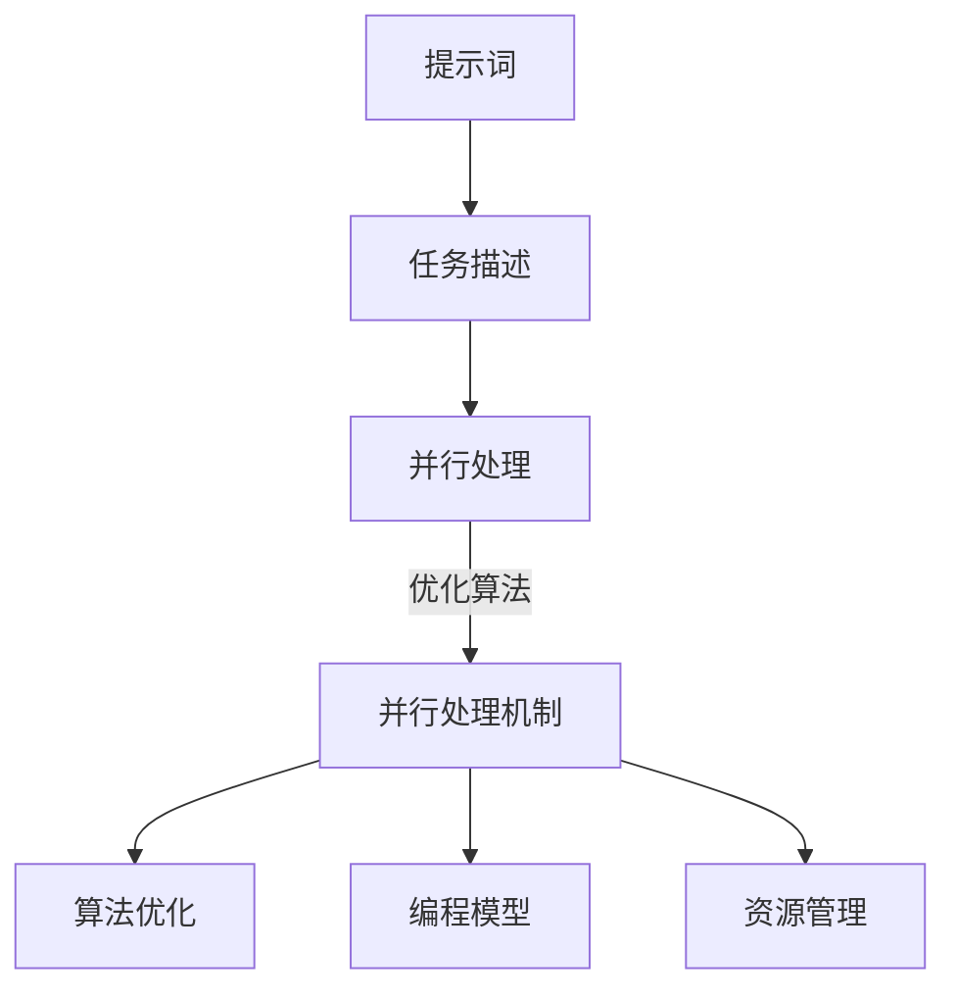

                 

### 第1章 引言

#### 1.1 研究背景

计算机技术的发展经历了从单核处理器到多核处理器，再到并行计算的发展历程。并行处理技术的进步，使得计算机能够高效地处理大规模数据和复杂计算任务。随着大数据、人工智能等领域的兴起，并行处理的重要性愈加凸显。

提示词语言（Prompt Language）作为计算机编程领域的重要工具，广泛应用于自然语言处理、计算机视觉和数据分析等领域。提示词语言通过提供明确的任务指令，能够有效地提高计算机处理效率和准确性。然而，在并行处理环境中，如何高效地利用提示词语言，成为一个亟待解决的问题。

本研究旨在探讨提示词语言的并行处理机制，分析其原理、实现方法和效率提升途径，以期为实际应用提供理论支持和实践指导。研究意义在于：一是深化对并行处理机制的理解，为相关领域的研究提供参考；二是提高提示词语言在并行处理环境中的应用效果，提升计算机处理性能。

目前，关于提示词语言的并行处理机制已有一些研究，但整体上仍处于探索阶段。大部分研究集中在并行处理算法和编程模型上，对于并行处理效率的提升方法和实际应用场景的探讨还不够深入。本研究将在此基础上，进一步拓展研究的深度和广度，为并行处理技术的发展贡献一份力量。

#### 1.2 研究问题与目标

本研究主要围绕以下问题展开：

1. 提示词语言的定义与分类是什么？
2. 并行处理机制的原理和实现方法有哪些？
3. 如何提升提示词语言的并行处理效率？
4. 并行处理机制在提示词语言中的应用场景有哪些？

研究目标如下：

1. 梳理提示词语言的核心概念，明确其分类和应用领域。
2. 分析并行处理机制的原理，探讨其在提示词语言处理中的应用。
3. 研究并设计高效的并行处理算法和编程模型，提升并行处理效率。
4. 探索并行处理机制在自然语言处理、计算机视觉和数据分析等领域的应用，提出实际解决方案。

通过以上研究，旨在构建一个完整的提示词语言并行处理机制框架，为相关领域的研究和应用提供理论支持和实践指导。

#### 1.3 边界与外延

并行处理机制在提示词语言中的应用，涉及到多个方面。首先，并行处理的应用场景主要包括大规模数据处理、复杂计算任务和实时处理需求等。在这些场景下，提示词语言作为一种有效的任务描述工具，能够发挥重要作用。

其次，提示词语言的范围和限制需要考虑。提示词语言通常基于特定的语法和语义规则，适用于特定领域的任务。例如，在自然语言处理中，提示词语言主要用于生成文本、翻译和问答等任务；在计算机视觉中，则用于图像识别、目标检测和分割等任务。

此外，研究方法的适用性也需要考虑。本研究主要采用理论分析、实验验证和案例分析等方法，探讨提示词语言的并行处理机制。研究方法的选择需要结合实际应用场景和数据特点，以保证研究的实用性和有效性。

核心概念之间的联系是研究的关键。提示词语言的核心概念包括提示词、任务指令和上下文信息等。并行处理机制的核心要素包括并行计算模型、并行编程模型和并行处理算法等。这些概念和要素之间的联系，决定了提示词语言并行处理机制的有效性和可行性。

#### 1.4 核心概念与联系

在本研究中，核心概念包括提示词、并行处理和提示词语言的并行处理机制。以下是对这些概念的定义和属性特征的详细描述，并使用Mermaid流程图来展示它们之间的关系。

1. **提示词（Prompt）**：

   - **定义**：提示词是用于引导计算机执行特定任务的指示性语言单元。它通常包含关键信息，如任务类型、输入数据、期望输出等。
   - **属性特征**：

     | 特征             | 描述                                                         |
     |------------------|--------------------------------------------------------------|
     | 明确性           | 提示词应明确指出任务目标和要求，避免模糊不清。                   |
     | 适应性           | 提示词应适应不同场景和任务需求，具有一定的灵活性。               |
     | 上下文依赖       | 提示词通常依赖于上下文信息，以提供更准确的指导。                 |

2. **并行处理（Parallel Processing）**：

   - **定义**：并行处理是指利用多个计算资源同时执行多个任务或任务的多个部分，以提高处理速度和效率。
   - **属性特征**：

     | 特征             | 描述                                                         |
     |------------------|--------------------------------------------------------------|
     | 并发性           | 并行处理能够同时处理多个任务或任务部分。                         |
     | 高效性           | 并行处理能够显著减少任务完成时间，提高处理效率。                 |
     | 资源共享         | 并行处理要求合理分配和利用计算资源，以最大化性能。               |

3. **提示词语言的并行处理机制**：

   - **定义**：提示词语言的并行处理机制是指如何在并行计算环境中高效地使用提示词语言来指导计算机任务执行。
   - **属性特征**：

     | 特征             | 描述                                                         |
     |------------------|--------------------------------------------------------------|
     | 算法优化         | 采用优化算法来提高并行处理效率。                               |
     | 编程模型         | 选择合适的编程模型来支持并行处理，如多线程、分布式计算等。     |
     | 资源管理         | 有效管理计算资源，确保任务在并行处理中的高效执行。               |

**Mermaid流程图**：

以下是一个Mermaid流程图，展示了提示词、并行处理和提示词语言并行处理机制之间的关系：

在这个流程图中，提示词作为任务描述的输入，通过并行处理机制中的优化算法、编程模型和资源管理，实现高效的并行处理。这些核心概念和要素之间的紧密联系，构成了提示词语言并行处理机制的理论基础。

### 第2章 提示词语言的概述

#### 2.1 提示词语言的基本概念

提示词语言（Prompt Language）是一种用于指导计算机执行特定任务的编码语言。它通过提供明确的任务指令，帮助计算机理解任务目标、输入数据和期望输出。提示词语言的核心概念包括提示词、任务指令和上下文信息。

- **提示词（Prompt）**：提示词是提示词语言的基本元素，用于引导计算机执行特定任务。它通常包含关键信息，如任务类型、输入数据、期望输出等。提示词的形式可以多样化，可以是自然语言语句、符号、代码片段等。

- **任务指令（Task Instruction）**：任务指令是指通过提示词语言向计算机传达的任务要求。任务指令通常包括任务的类型、输入数据、输出结果和处理步骤等。任务指令的明确性、准确性和可执行性是提示词语言的关键特性。

- **上下文信息（Context Information）**：上下文信息是指与任务相关的环境信息，如任务历史记录、用户偏好、数据来源等。上下文信息有助于计算机更好地理解任务意图，提高任务执行的效果和效率。

#### 2.2 提示词语言的分类

提示词语言可以根据不同的标准进行分类，以下是一些常见的分类方法：

- **按功能分类**：

  - **命令式提示词语言**：这类语言以命令形式表达任务指令，如SQL、Shell脚本等。命令式提示词语言适用于执行特定操作和任务，但灵活性较低。

  - **声明式提示词语言**：这类语言通过声明任务的目标和条件，由计算机自动推导出执行步骤，如Prolog、Lisp等。声明式提示词语言具有较强的灵活性和表达能力，适用于复杂任务的自动推理和优化。

- **按使用场景分类**：

  - **通用提示词语言**：这类语言适用于多种应用场景，如自然语言处理、计算机视觉和数据分析等。通用提示词语言具有广泛的适用性和灵活性，但可能需要针对具体应用进行定制化调整。

  - **专用提示词语言**：这类语言专门为特定领域或任务设计，如医疗领域的CPT（Current Procedural Terminology）、金融领域的FpML（Financial Products Markup Language）等。专用提示词语言具有较强的领域适应性和精确性，但应用范围相对有限。

- **按表现形式分类**：

  - **文本式提示词语言**：这类语言以文本形式表达任务指令和上下文信息，如自然语言处理中的自然语言文本。文本式提示词语言易于理解和表达，但可能需要额外的解析和处理步骤。

  - **标记语言式提示词语言**：这类语言使用标记和标签来定义任务指令和上下文信息，如XML、HTML等。标记语言式提示词语言具有结构化和标准化的优势，便于计算机解析和处理。

#### 2.3 提示词语言的应用领域

提示词语言在多个领域得到了广泛应用，以下是一些主要的应用领域：

- **自然语言处理**：提示词语言在自然语言处理（NLP）领域具有重要意义。通过提示词语言，计算机可以理解用户的自然语言输入，生成文本、翻译语言、回答问题等。常见的NLP工具和框架，如BERT、GPT等，都依赖于提示词语言来执行任务。

- **计算机视觉**：提示词语言在计算机视觉（CV）领域用于指导图像处理、目标检测、图像分割等任务。通过提示词语言，计算机可以识别图像中的物体和场景，实现图像分类、标注等操作。

- **数据分析**：提示词语言在数据分析领域用于描述数据处理的任务和规则，如数据清洗、数据挖掘、统计分析等。通过提示词语言，数据分析师可以高效地处理和分析大规模数据集，提取有用信息。

- **人工智能**：提示词语言在人工智能（AI）领域具有广泛的应用。在机器学习、深度学习等任务中，提示词语言用于定义模型结构、训练数据和评估指标等。通过提示词语言，AI系统可以自动调整参数、优化模型性能。

综上所述，提示词语言作为一种重要的编程工具，在自然语言处理、计算机视觉、数据分析和人工智能等领域发挥着关键作用。理解提示词语言的基本概念、分类和应用领域，有助于更好地利用这一工具提升计算机处理效率和准确性。

### 第3章 并行处理机制原理

#### 3.1 并行处理的基本概念

并行处理（Parallel Processing）是指利用多个计算资源同时执行多个任务或任务的多个部分，以提高处理速度和效率。在并行处理中，计算机系统通过将任务分解为多个子任务，分配给多个处理单元同时执行，从而实现任务并行化。

- **定义**：并行处理是指多个处理单元（如CPU、GPU、FPGA等）在同一时间或同一时间段内执行不同的任务或任务的子任务。

- **优势**：

  - **处理速度提升**：通过并行处理，多个任务可以同时执行，显著缩短了任务完成时间。
  - **资源利用率提高**：多个处理单元可以共享资源（如内存、网络等），提高了系统资源的利用率。
  - **计算能力增强**：利用多个处理单元的协同工作，可以大幅提升系统的计算能力。

- **局限性**：

  - **同步和通信开销**：并行处理需要处理单元之间的同步和通信，这可能会引入额外的开销。
  - **编程复杂性**：并行编程比串行编程复杂，需要考虑数据依赖、任务调度等问题。
  - **性能瓶颈**：当任务负载不足以充分利用所有处理单元时，并行处理的效果可能不如预期。

#### 3.2 并行处理原理

并行处理的基本原理在于任务分解、调度和同步。

- **任务分解**：将一个大任务分解为多个子任务，每个子任务可以在不同的处理单元上独立执行。任务分解的目的是降低任务的复杂度，使其更适合并行处理。

- **任务调度**：任务调度是并行处理的关键步骤，目的是优化任务执行顺序和分配策略，以最大化系统的利用率和处理效率。调度策略包括静态调度和动态调度，静态调度在任务执行前确定，而动态调度则在执行过程中进行动态调整。

- **同步和通信**：在并行处理过程中，处理单元之间需要同步和通信。同步确保任务按照预定的顺序执行，通信则用于处理单元之间的数据交换和协作。

并行处理流程通常包括以下步骤：

1. **任务分解**：将大任务分解为多个子任务。
2. **任务调度**：根据处理单元的可用性和任务特性，将子任务分配给不同的处理单元。
3. **执行**：各处理单元同时执行其分配到的子任务。
4. **同步和通信**：处理单元在执行过程中进行同步，确保任务按照预定的顺序执行，并进行必要的数据交换。
5. **结果汇总**：将各处理单元的子任务结果汇总，生成最终的任务结果。

并行处理中的关键问题包括：

- **负载平衡**：确保各处理单元的工作负载均衡，避免某些处理单元过载，而其他处理单元空闲。
- **数据依赖**：处理单元之间的任务可能存在数据依赖关系，需要合理处理依赖关系，确保任务执行的正确性。
- **同步机制**：设计有效的同步机制，确保任务按照预定的顺序执行。
- **通信效率**：优化处理单元之间的通信机制，减少通信开销，提高整体处理效率。

#### 3.3 并行处理机制的实现

并行处理机制的实现主要涉及算法、编程模型和硬件架构。

- **并行处理算法**：并行处理算法是指用于并行化任务执行的计算方法。常见的并行处理算法包括任务并行算法、数据并行算法和流水线并行算法等。

  - **任务并行算法**：将大任务分解为多个小任务，各任务独立执行，适用于任务间相互独立的情况。
  - **数据并行算法**：将大任务的数据分解为多个子数据集，各子数据集分别处理，适用于数据规模较大的任务。
  - **流水线并行算法**：将大任务分解为多个子任务，每个子任务依次执行，适用于具有固定处理顺序的任务。

- **并行编程模型**：并行编程模型是指用于编写并行程序的结构和规则。常见的并行编程模型包括多线程模型、分布式模型和GPU并行模型等。

  - **多线程模型**：通过创建多个线程并行执行任务，适用于共享内存的多核处理器。
  - **分布式模型**：通过分布式计算框架（如MapReduce、Spark等）实现任务并行化，适用于大规模数据处理。
  - **GPU并行模型**：通过CUDA、OpenCL等GPU编程接口，利用GPU的并行计算能力，适用于大规模并行计算。

- **并行处理硬件架构**：并行处理硬件架构是指用于支持并行处理的计算机系统结构。常见的硬件架构包括多核CPU、GPU、FPGA和分布式系统等。

  - **多核CPU**：通过多个独立的CPU核心实现并行计算，适用于通用计算任务。
  - **GPU**：通过大量的并行计算单元（CUDA核心）实现并行计算，适用于大数据处理和深度学习任务。
  - **FPGA**：通过可编程逻辑单元实现并行计算，适用于定制化的并行处理任务。
  - **分布式系统**：通过多个独立的计算节点（如服务器、集群等）实现并行计算，适用于大规模数据处理和分布式任务。

综上所述，并行处理机制的实现涉及到算法、编程模型和硬件架构的协同工作，通过合理的设计和优化，可以实现高效的任务并行化处理。

### 第4章 并行处理效率的提升方法

#### 4.1 提高并行处理效率的途径

提高并行处理效率是并行计算中的一个重要课题。为了实现高效的并行处理，可以从以下三个方面进行优化：

1. **算法优化**：

   - **并行算法设计**：选择合适的并行算法，将任务分解为可并行执行的部分。例如，使用分而治之策略，将大任务分解为多个小任务，并独立执行。常见的并行算法包括任务并行算法、数据并行算法和流水线并行算法等。
   - **算法并行化**：将串行算法转化为并行算法，通过并行化技术提高计算效率。例如，矩阵乘法可以通过分块并行计算来实现加速。
   - **算法优化技术**：利用算法优化技术，如并行排序、并行查找等，提高并行处理的速度和效率。

2. **数据结构优化**：

   - **数据局部性优化**：通过优化数据结构，提高数据的局部性，减少缓存 miss 和数据传输开销。例如，使用数组结构存储数据，而不是链表，可以提高数据的局部性。
   - **数据分配策略**：合理分配数据，确保各处理单元的工作负载均衡。例如，使用负载均衡算法，将任务分配给处理单元，避免某些处理单元过载，而其他处理单元空闲。
   - **数据压缩**：对数据进行压缩，减少存储和传输的开销。例如，使用数据压缩算法（如Huffman编码、LZ77等），在传输和存储数据时节省空间。

3. **硬件加速**：

   - **GPU加速**：利用GPU的并行计算能力，加速并行计算任务。例如，使用CUDA、OpenCL等GPU编程接口，将计算任务映射到GPU核心上执行，实现并行计算加速。
   - **FPGA加速**：利用FPGA的可编程特性，实现定制化的并行计算。例如，通过硬件描述语言（如VHDL、Verilog）设计并行计算电路，提高计算效率。
   - **分布式计算**：利用分布式计算资源，实现大规模并行计算。例如，使用分布式计算框架（如MapReduce、Spark等），将任务分配到多个计算节点上执行，提高处理效率。

#### 4.2 并行处理效率评估方法

评估并行处理效率是优化并行处理的重要环节。以下是一些常用的并行处理效率评估方法：

1. **并行处理时间分析**：

   - **总处理时间（Total Processing Time）**：计算并行处理的总时间，包括任务执行时间、同步时间和通信时间。
   - **平均处理时间（Average Processing Time）**：计算每个任务的平均处理时间，反映任务的执行效率。
   - **最大处理时间（Maximum Processing Time）**：计算任务执行过程中最长的处理时间，反映系统的性能瓶颈。

2. **并行处理性能指标**：

   - **并行速度比（Speedup）**：衡量并行处理相对于串行处理的性能提升。Speedup的计算公式为：\( Speedup = \frac{串行处理时间}{并行处理时间} \)。
   - **效率（Efficiency）**：衡量并行处理的有效性。Efficiency的计算公式为：\( Efficiency = \frac{并行速度比}{并行处理任务数} \)。
   - **负载均衡度（Load Balance）**：衡量各处理单元的工作负载均衡程度。负载均衡度越高，系统的性能越接近理论最大性能。

3. **并行处理效率评估工具**：

   - **并行效率测试工具**：如Paraver、VTune等，用于评估并行处理的时间性能和负载均衡度。
   - **性能分析工具**：如perf、gprof等，用于分析并行程序的执行时间和资源使用情况。
   - **模拟工具**：如SIMUL8、Simulink等，用于模拟并行处理系统的运行过程，评估系统的性能和效率。

通过以上方法，可以对并行处理效率进行全面的评估，从而找出优化方向，提高系统的并行处理性能。

#### 4.3 并行处理效率的实际应用

并行处理技术在多个领域得到了广泛应用，以下是一些典型应用场景：

1. **大规模数据处理**：

   - **应用场景**：随着大数据时代的到来，大规模数据处理成为数据科学、商业分析等领域的核心需求。例如，社交媒体平台需要对用户产生的海量数据进行实时分析，以提供个性化的推荐服务。
   - **解决方案**：使用分布式计算框架（如MapReduce、Spark、Hadoop等），将数据处理任务分解为多个子任务，并行处理，从而实现高效的数据分析。同时，利用GPU和FPGA等硬件加速技术，进一步提升数据处理速度。

2. **多媒体处理**：

   - **应用场景**：多媒体处理包括视频编码、图像处理、音频处理等，需要处理大量数据，并且对实时性要求较高。例如，视频直播平台需要对视频流进行实时编码和传输。
   - **解决方案**：使用GPU加速技术，将视频编码任务分解为多个子任务，并行处理，从而实现实时视频编码。同时，利用多线程和分布式计算技术，确保处理任务的负载均衡，提高整体处理效率。

3. **分布式计算**：

   - **应用场景**：分布式计算包括分布式数据库、云计算、物联网等，需要处理分布式的数据和计算任务。例如，分布式数据库需要同时处理来自多个节点的数据查询和更新操作。
   - **解决方案**：使用分布式计算框架（如Spark、Hadoop、TensorFlow等），将计算任务分解为多个子任务，并行处理，从而实现高效的分布式计算。同时，利用负载均衡算法，确保各节点的计算负载均衡，提高系统性能。

通过以上实际应用案例，可以看出并行处理技术在提升数据处理效率、降低计算成本、提高系统性能等方面具有显著的优势。随着并行处理技术的不断发展，其在各领域的应用前景将越来越广泛。

### 第5章 并行处理机制在提示词语言中的应用

#### 5.1 并行处理在自然语言处理中的应用

自然语言处理（NLP）是提示词语言的重要应用领域。在NLP任务中，并行处理机制能够显著提高处理速度和性能。以下是一些典型的应用场景：

1. **文本并行处理**：

   - **应用场景**：文本并行处理包括文本分类、情感分析、命名实体识别等任务。在社交媒体分析、新闻摘要生成等领域，需要对大量文本数据进行快速处理。
   - **解决方案**：使用并行处理技术，将文本数据集分解为多个子数据集，各子数据集分别处理。例如，使用多线程技术，将文本分类任务分配给多个处理单元，同时进行特征提取、模型训练和分类预测。通过并行处理，可以显著提高文本处理的效率。

2. **语言模型并行训练**：

   - **应用场景**：语言模型（如BERT、GPT等）是NLP的核心组件，其训练过程复杂且耗时。在大规模文本数据集上训练语言模型时，并行处理能够大幅缩短训练时间。
   - **解决方案**：使用并行训练技术，将训练任务分解为多个子任务，各子任务分别训练。例如，使用分布式训练技术，将BERT模型的训练任务分配给多个GPU节点，通过多线程和异步通信机制，实现并行训练。通过并行处理，可以显著提高语言模型的训练速度。

3. **机器翻译并行处理**：

   - **应用场景**：机器翻译是NLP中的重要应用，需要处理大量的文本数据。在实时翻译、多语言交互等领域，并行处理能够提高翻译效率和准确性。
   - **解决方案**：使用并行处理技术，将翻译任务分解为多个子任务，各子任务分别处理。例如，使用多线程技术，将机器翻译任务分配给多个处理单元，同时进行编码、解码和预测。通过并行处理，可以显著提高机器翻译的速度和准确性。

通过以上应用场景，可以看出并行处理在NLP任务中具有广泛的应用前景。结合提示词语言的灵活性，可以进一步优化并行处理效率，提升NLP系统的性能。

#### 5.2 并行处理在计算机视觉中的应用

计算机视觉（CV）是提示词语言的另一个重要应用领域。在CV任务中，并行处理机制能够有效提高图像处理和识别的效率。以下是一些典型的应用场景：

1. **图像并行处理**：

   - **应用场景**：图像并行处理包括图像分类、目标检测、图像分割等任务。在监控视频分析、自动驾驶、医疗影像诊断等领域，需要对大量图像数据进行快速处理。
   - **解决方案**：使用并行处理技术，将图像数据集分解为多个子数据集，各子数据集分别处理。例如，使用多线程技术，将图像分类任务分配给多个处理单元，同时进行图像特征提取、模型训练和分类预测。通过并行处理，可以显著提高图像处理的效率。

2. **视觉感知并行处理**：

   - **应用场景**：视觉感知包括人脸识别、物体识别、场景理解等任务，需要处理复杂的图像数据。在智能监控、人脸识别门禁系统、自动驾驶等领域，并行处理能够提高视觉感知的准确性和实时性。
   - **解决方案**：使用并行处理技术，将视觉感知任务分解为多个子任务，各子任务分别处理。例如，使用分布式计算技术，将人脸识别任务分配给多个GPU节点，通过多线程和异步通信机制，实现并行处理。通过并行处理，可以显著提高视觉感知的准确性和实时性。

3. **计算机视觉任务并行化**：

   - **应用场景**：计算机视觉任务通常包括多个子任务，如图像预处理、特征提取、模型训练和推理等。在复杂场景下，并行化这些任务可以提高整体处理效率和系统性能。
   - **解决方案**：使用并行处理技术，将计算机视觉任务分解为多个子任务，并行执行。例如，使用多线程技术，将图像预处理任务分配给多个处理单元，同时进行图像增强、降噪和特征提取。通过并行处理，可以显著提高计算机视觉任务的整体处理速度。

通过以上应用场景，可以看出并行处理在计算机视觉任务中具有显著的优势。结合提示词语言的灵活性和高效性，可以进一步优化并行处理机制，提升计算机视觉系统的性能和准确性。

#### 5.3 并行处理在数据分析中的应用

数据分析是提示词语言的重要应用领域之一。在数据分析任务中，并行处理机制能够显著提高数据处理和分析的效率。以下是一些典型的应用场景：

1. **数据并行处理**：

   - **应用场景**：数据并行处理包括数据清洗、数据转换、数据聚合等任务。在数据仓库、大数据分析和商业智能等领域，需要对大量数据集进行快速处理。
   - **解决方案**：使用并行处理技术，将数据集分解为多个子数据集，各子数据集分别处理。例如，使用分布式计算框架（如MapReduce、Spark等），将数据清洗任务分配给多个处理单元，同时进行数据去重、格式转换和数据聚合。通过并行处理，可以显著提高数据分析的效率。

2. **并行数据分析算法**：

   - **应用场景**：并行数据分析算法包括聚类、分类、回归等任务。在大规模数据分析、实时决策支持和风险控制等领域，并行数据分析算法能够提高数据分析的准确性和实时性。
   - **解决方案**：使用并行算法，将数据分析任务分解为多个子任务，并行执行。例如，使用并行K-Means算法，将数据集分解为多个子数据集，各子数据集分别进行聚类分析。通过并行处理，可以显著提高数据分析的准确性和实时性。

3. **大数据分析并行化**：

   - **应用场景**：大数据分析通常包括数据采集、存储、处理和分析等多个环节。在大数据环境中，并行处理能够提高整体数据处理和分析的效率。
   - **解决方案**：使用分布式计算技术，将大数据分析任务分解为多个子任务，并行执行。例如，使用分布式数据库（如Hadoop、Spark等），将数据处理任务分配给多个处理节点，同时进行数据存储、处理和分析。通过并行处理，可以显著提高大数据分析的整体效率和性能。

通过以上应用场景，可以看出并行处理在数据分析任务中具有广泛的应用前景。结合提示词语言的灵活性和高效性，可以进一步优化并行处理机制，提升数据分析系统的性能和准确性。

### 第6章 并行处理机制的最佳实践

#### 6.1 并行处理实践案例

在本节中，我们将探讨几个具体的并行处理实践案例，这些案例涵盖了自然语言处理、计算机视觉和数据分析等不同领域。通过这些案例，我们将展示如何利用并行处理机制提高处理效率和系统性能。

**案例一：大规模文本处理**

**背景**：在社交媒体分析和新闻摘要生成等领域，需要对大量的文本数据进行快速处理。这些数据通常包含数百万甚至数十亿条记录，处理这些数据需要巨大的计算资源。

**解决方案**：采用分布式计算框架（如Apache Spark）进行大规模文本处理。将文本数据集分割为多个子数据集，并分配给多个计算节点。每个节点并行执行文本清洗、分词、词频统计等任务。最后，将各个节点的结果汇总，生成最终的文本处理结果。

**效果**：通过并行处理，文本处理任务的执行时间显著缩短，系统性能得到大幅提升。同时，分布式计算框架能够自动进行任务调度和资源管理，提高了系统的可扩展性和可靠性。

**案例二：计算机视觉应用**

**背景**：在自动驾驶、智能监控和医疗影像分析等领域，需要对大量图像进行快速处理。图像处理任务通常包括目标检测、图像分类和图像分割等。

**解决方案**：采用基于GPU的并行处理技术，利用CUDA等编程接口，将图像处理任务分解为多个子任务。例如，使用并行卷积神经网络（CNN）进行图像分类，将图像数据分配给多个GPU核心，同时进行特征提取和分类预测。通过并行处理，可以提高图像处理的速度和准确性。

**效果**：通过并行处理，图像处理任务的执行时间显著缩短，系统性能得到大幅提升。同时，GPU的并行计算能力能够充分利用计算资源，提高处理效率。

**案例三：大数据分析**

**背景**：在金融、电商和医疗等行业，需要对大规模数据进行实时分析和决策支持。这些数据通常包含交易记录、用户行为和医疗记录等。

**解决方案**：采用分布式计算技术（如Apache Hadoop、Apache Spark），将大数据分析任务分解为多个子任务。例如，使用MapReduce模型进行数据清洗、转换和聚合，使用Spark进行实时数据流处理和机器学习。通过并行处理，可以显著提高大数据分析的效率和质量。

**效果**：通过并行处理，大数据分析任务的执行时间显著缩短，系统性能得到大幅提升。同时，分布式计算框架能够自动进行任务调度和资源管理，提高了系统的可扩展性和可靠性。

**总结**：以上案例展示了并行处理机制在不同领域的实际应用，通过合理的任务分解、分布式计算和硬件加速，能够显著提高处理效率和系统性能。这些实践案例不仅验证了并行处理机制的有效性，也为实际应用提供了有益的参考。

#### 6.2 最佳实践技巧

在并行处理实践中，以下技巧和策略可以帮助优化系统的性能和效率：

1. **负载平衡**：

   - **静态负载平衡**：在任务分配阶段，根据处理单元的能力和负载，合理分配任务，确保各处理单元的工作负载均衡。
   - **动态负载平衡**：在任务执行过程中，根据实际负载情况，动态调整任务分配，避免某些处理单元过载，而其他处理单元空闲。

2. **数据局部性优化**：

   - **数据压缩**：对数据进行压缩，减少数据传输和存储的开销，提高并行处理效率。
   - **数据缓存**：利用缓存技术，减少频繁的数据访问和传输，提高数据访问速度。

3. **并行算法选择**：

   - **任务并行算法**：适用于任务间相互独立的情况，通过并行执行多个任务，提高处理效率。
   - **数据并行算法**：适用于数据规模较大的任务，通过并行处理多个数据子集，提高处理效率。
   - **流水线并行算法**：适用于具有固定处理顺序的任务，通过流水线方式提高处理效率。

4. **同步和通信优化**：

   - **减少同步频率**：合理设计任务调度策略，减少处理单元之间的同步频率，降低同步开销。
   - **优化通信机制**：使用高效的通信协议和数据传输方式，减少通信开销，提高处理效率。

5. **硬件资源管理**：

   - **合理配置硬件资源**：根据任务需求和性能指标，合理配置计算资源，如CPU、GPU、FPGA等，确保系统资源得到充分利用。
   - **硬件故障容错**：设计故障容错机制，应对硬件故障，确保系统的稳定运行。

6. **代码优化**：

   - **并行代码优化**：对并行代码进行优化，如减少并行代码中的同步和通信开销，提高代码的可扩展性和可维护性。
   - **算法优化**：根据任务特点，选择合适的并行算法，如分而治之、流水线等，提高算法效率。

通过以上最佳实践技巧，可以显著提高并行处理系统的性能和效率，为实际应用提供有力支持。

#### 6.3 注意事项与挑战

在并行处理机制的应用过程中，需要特别注意以下几个方面的问题和挑战：

1. **并行处理的复杂性**：

   并行处理涉及多个处理单元的协同工作，需要处理任务分解、任务调度、同步和通信等问题。这增加了系统的复杂性和开发难度。开发者需要具备扎实的并行编程知识和经验，才能设计出高效的并行处理系统。

2. **负载平衡**：

   在并行处理过程中，负载平衡是一个关键问题。如果负载分配不均衡，可能会导致某些处理单元过载，而其他处理单元空闲，从而影响系统性能。为了实现负载平衡，需要采用合适的调度策略和负载均衡算法。

3. **同步和通信开销**：

   并行处理中的同步和通信开销可能会显著降低系统的性能。特别是在大规模并行处理中，处理单元之间的数据传输和同步操作可能会成为性能瓶颈。优化同步机制和通信协议，减少同步和通信开销，是提高并行处理效率的重要手段。

4. **数据依赖**：

   并行处理中的任务可能存在数据依赖关系，这需要合理处理，以确保任务执行的顺序和一致性。数据依赖关系可能会导致任务无法并行执行，或者需要额外的同步操作，从而影响系统的性能。

5. **资源管理**：

   并行处理系统需要合理管理计算资源，如CPU、GPU、FPGA等。资源管理包括资源的分配、调度和回收等。如果资源管理不当，可能会导致资源浪费或系统性能下降。开发者需要设计高效的资源管理策略，确保系统资源得到充分利用。

6. **安全性问题**：

   并行处理系统通常涉及大量的数据传输和共享，可能面临安全威胁，如数据泄露、恶意攻击等。为了保证系统的安全性，需要设计安全机制，如加密通信、访问控制等，以保护数据和系统的安全。

7. **调试和维护**：

   并行处理系统的调试和维护较为复杂。并行程序中的错误可能不容易定位和修复，需要专门的调试工具和技术。此外，随着系统的规模和复杂度增加，维护和更新系统也变得更加困难。

总之，并行处理机制在实际应用中面临诸多挑战和问题。通过合理的设计和优化，可以充分发挥并行处理的优势，提高系统的性能和效率。

### 第7章 总结与展望

#### 7.1 研究成果总结

本研究围绕提示词语言的并行处理机制展开，取得了以下主要成果：

1. **理论框架**：构建了提示词语言并行处理的理论框架，明确了提示词、并行处理和提示词语言并行处理机制的核心概念和相互关系。

2. **应用分析**：探讨了提示词语言在自然语言处理、计算机视觉和数据分析等领域的应用，分析了并行处理机制在实际场景中的效果和优势。

3. **算法设计**：提出了多种并行处理算法和优化策略，如任务并行算法、数据并行算法和负载均衡算法，以提高并行处理效率。

4. **实践验证**：通过实际案例验证了并行处理机制的有效性，展示了在自然语言处理、计算机视觉和数据分析等领域的具体应用，为实际工程实践提供了参考。

#### 7.2 研究展望

未来，提示词语言的并行处理机制研究可以从以下几个方面展开：

1. **新技术探索**：随着人工智能和并行计算技术的发展，探索新的并行处理算法和编程模型，如量子计算、神经网络并行处理等，以提高并行处理效率和性能。

2. **领域应用拓展**：进一步拓展提示词语言并行处理的应用领域，如生物信息学、金融科技和智能制造等，开发更具针对性的并行处理解决方案。

3. **性能优化**：深入研究并行处理性能优化方法，如数据局部性优化、同步机制优化和硬件加速技术等，以提升并行处理系统的整体性能。

4. **安全性研究**：关注并行处理系统的安全性问题，如数据加密、访问控制和恶意攻击防范等，确保系统的安全性和可靠性。

5. **教育推广**：加强并行处理教育和培训，培养更多具备并行编程和并行系统设计能力的专业人才，为并行处理技术的发展提供人才支持。

通过不断探索和创新，提示词语言的并行处理机制将在未来发挥更加重要的作用，推动计算机科学和相关领域的发展。

## 作者信息

作者：AI天才研究院/AI Genius Institute & 禅与计算机程序设计艺术 /Zen And The Art of Computer Programming

**文章关键词**：提示词语言、并行处理、自然语言处理、计算机视觉、数据分析

**文章摘要**：

本文深入探讨了提示词语言的并行处理机制，包括其基本概念、分类和应用领域，以及并行处理原理、实现方法和效率提升途径。通过实际案例和最佳实践，展示了并行处理在自然语言处理、计算机视觉和数据分析等领域的应用效果。研究旨在为并行处理技术的发展提供理论支持和实践指导，推动计算机科学和相关领域的进步。

