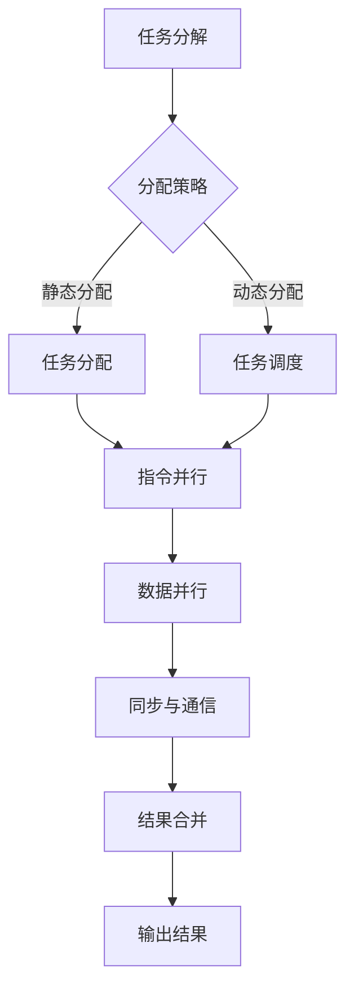
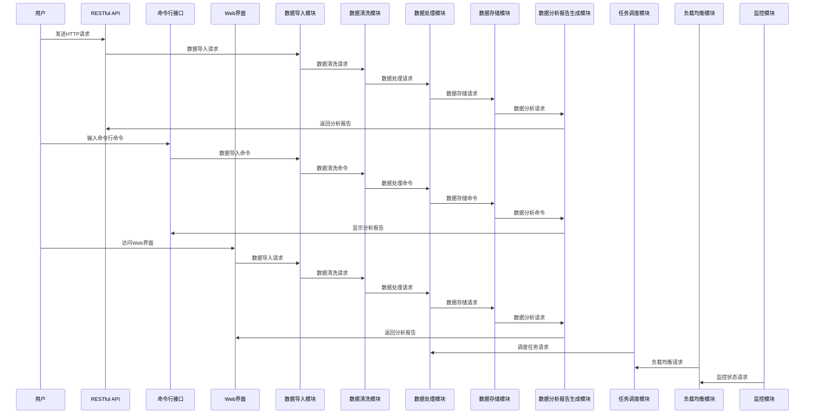

                 

### 第1章：问题背景

#### 1.1.1 问题背景介绍

在当今信息技术快速发展的时代，计算能力的提升对于各行业的发展具有至关重要的作用。然而，随着数据的爆炸式增长和复杂计算需求的增加，传统的串行计算模式已经无法满足高性能计算的需求。并行计算作为一种提高计算效率的有效手段，逐渐成为研究和应用的热点。并行计算的核心思想是通过将任务分解为多个子任务，同时在多个计算节点上同时执行这些子任务，从而在较短的时间内完成复杂的计算任务。

在并行计算的实际应用中，提示词语言作为一种特殊的编程语言，近年来也得到了广泛的关注。提示词语言通过将复杂的计算任务转化为一系列提示词和指令，能够更加高效地利用并行计算资源，提高计算效率。然而，如何对提示词语言的并行计算进行优化，使其在实际应用中达到最佳性能，依然是一个亟待解决的问题。

#### 1.1.2 提示词语言在计算中的应用现状

提示词语言在计算领域中的应用主要体现为两个方面：一是作为编程语言，用于开发高性能的并行计算应用；二是作为工具，用于优化现有并行计算算法和系统的性能。具体来说，提示词语言在以下领域有显著的应用：

1. **科学计算**：提示词语言在科学计算领域具有天然的优势，可以高效地处理大量的科学数据和复杂计算任务，如气象预测、流体力学模拟、天体物理学计算等。

2. **大数据处理**：随着大数据时代的到来，提示词语言在大数据处理领域中的应用越来越广泛，如分布式数据处理、实时数据处理等。

3. **人工智能**：在人工智能领域，提示词语言被广泛应用于神经网络训练、机器学习模型的优化等任务，通过并行计算加速模型的训练和推理过程。

4. **工业自动化**：在工业自动化领域，提示词语言被用于控制复杂的工业过程和设备，实现高效的自动化生产。

然而，尽管提示词语言在计算领域有着广泛的应用，但其并行计算性能的提升仍然面临许多挑战。例如，如何在并行计算环境中高效地执行提示词指令、如何优化数据传输和存储、如何处理并行计算中的同步和通信问题等。

#### 1.1.3 并行计算优化策略的重要性

并行计算优化策略的重要性主要体现在以下几个方面：

1. **提高计算效率**：通过优化并行计算策略，可以显著提高计算任务的执行效率，减少计算时间，从而满足日益增长的复杂计算需求。

2. **降低计算成本**：优化并行计算策略可以减少计算资源的浪费，提高资源利用率，降低计算成本。

3. **提升系统性能**：通过优化并行计算策略，可以提升整个系统的性能，提高系统的响应速度和吞吐量，满足更高的业务需求。

4. **促进技术发展**：并行计算优化策略的研究和实施，可以推动并行计算技术的不断发展，为未来计算技术的发展奠定基础。

因此，深入研究并实现有效的并行计算优化策略，对于提升提示词语言在计算领域的应用性能具有重要的意义。

### 1.1.4 并行计算优化策略的核心挑战

并行计算优化策略的核心挑战主要包括以下几个方面：

1. **任务调度与分配**：如何将复杂的计算任务合理地分配到不同的计算节点上，并确保任务调度与分配的效率，是并行计算优化的关键。

2. **数据传输与存储**：在并行计算中，数据传输和存储的效率对计算性能有直接影响。如何优化数据传输和存储策略，减少数据访问延迟和传输成本，是优化策略需要重点考虑的问题。

3. **同步与通信**：并行计算中的同步和通信问题是影响计算性能的重要因素。如何在确保计算正确性的同时，优化同步和通信策略，减少通信开销，是并行计算优化需要解决的重要问题。

4. **负载均衡**：如何实现计算节点之间的负载均衡，确保每个计算节点都能充分利用资源，避免资源浪费，是并行计算优化需要解决的关键问题。

5. **容错与可靠性**：并行计算系统需要具备一定的容错能力，能够在计算节点发生故障时，自动切换到备用节点，确保计算任务的顺利完成。因此，如何设计和实现高效的容错机制，是并行计算优化需要考虑的问题。

这些挑战的存在，使得并行计算优化策略的研究和实施具有复杂性和多样性。下面将详细探讨这些核心挑战，并提出相应的优化策略和方法。

### 1.1.5 并行计算优化策略的研究现状与未来趋势

当前，并行计算优化策略的研究已取得了显著进展。在任务调度与分配方面，许多研究提出了基于贪心算法、遗传算法和模拟退火算法的调度策略，通过优化任务分配和调度顺序，提高了计算效率。在数据传输与存储方面，研究人员通过采用数据压缩、流水线传输和缓存技术，有效减少了数据访问延迟和传输成本。在同步与通信方面，分布式锁、消息队列和异步通信等技术的应用，提高了并行计算系统的通信效率。在负载均衡方面，通过负载感知调度和动态资源分配，实现了计算节点之间的负载均衡。在容错与可靠性方面，容错计算、故障检测和自修复技术的研究，为并行计算系统的可靠性提供了保障。

未来，并行计算优化策略的研究将继续沿着以下几个方向展开：

1. **智能化优化**：利用人工智能和机器学习技术，开发自适应的优化算法，根据计算环境和任务特点，动态调整优化策略，提高并行计算性能。

2. **高性能计算与云计算的结合**：通过将高性能计算与云计算相结合，实现计算资源的弹性调度和高效利用，提高并行计算系统的性能和可扩展性。

3. **分布式存储与计算优化**：研究分布式存储与计算系统的优化策略，提高数据存储和计算效率，降低系统成本。

4. **多维度优化**：综合考虑任务调度、数据传输、同步与通信、负载均衡和容错与可靠性等多维度因素，实现全面的并行计算优化。

总之，随着并行计算技术的不断发展和应用需求的不断增加，并行计算优化策略的研究将充满机遇和挑战，为各行业的高效计算提供有力支持。

### 1.1.6 并行计算与提示词语言的关系

并行计算与提示词语言之间的关系主要体现在以下几个方面：

首先，并行计算作为一种计算模式，通过将任务分解为多个子任务，同时在多个计算节点上执行，以实现高效计算。而提示词语言则是一种特殊的编程语言，通过提供一系列提示词和指令，使复杂的计算任务能够更加高效地被执行。因此，提示词语言在并行计算中扮演了重要角色，它使得并行计算任务能够被更加自然地表达和执行。

其次，并行计算优化策略的研究和应用，对于提升提示词语言在并行计算中的性能具有重要意义。通过优化任务调度、数据传输、同步与通信、负载均衡和容错与可靠性等方面，可以显著提高提示词语言并行计算的性能和效率。

此外，提示词语言在并行计算中的应用，也促进了并行计算技术的发展。例如，在科学计算、大数据处理、人工智能等领域，提示词语言的高效并行计算能力，为这些领域的研究和应用提供了强有力的支持。

总之，并行计算与提示词语言相互促进、相互依赖，共同推动了计算技术的发展。通过深入研究并行计算与提示词语言的关系，可以为各行业的高效计算提供更加有效的解决方案。

### 第2章：核心概念与联系

#### 2.1.1 并行计算的基本概念

并行计算（Parallel Computing）是一种利用多个计算资源同时处理多个任务的计算模式。其核心思想是将一个大任务分解为多个子任务，并在多个计算节点上同时执行这些子任务，以实现高效计算。并行计算具有以下几个基本概念：

1. **并行度**：并行度是指并行计算中任务并行执行的程度。通常用并行任务的个数或并行任务的并发程度来衡量。高并行度意味着计算任务能够被更加有效地分解和执行。

2. **计算节点**：计算节点是指参与并行计算的计算机设备，可以是单核处理器、多核处理器、GPU、FPGA等。计算节点可以通过网络连接形成一个并行计算集群，共同执行计算任务。

3. **通信机制**：在并行计算中，不同计算节点之间需要通过通信机制进行数据交换和同步。常见的通信机制包括消息传递、共享内存和分布式存储等。

4. **并行算法**：并行算法是指设计用于并行计算环境的算法，通过将任务分解为多个子任务，并在多个计算节点上同时执行，以实现高效计算。并行算法的设计需要考虑任务分解、负载均衡、数据传输、同步与通信等问题。

5. **性能瓶颈**：在并行计算中，性能瓶颈是指限制并行计算性能的关键因素，如任务调度不均衡、数据传输延迟、同步开销等。

#### 2.1.2 并行算法的性能分析

并行算法的性能分析主要涉及以下几个关键指标：

1. **速度比**：速度比是指并行计算完成时间与串行计算完成时间的比值。速度比越大，表示并行计算性能越好。速度比 = 串行计算时间 / 并行计算时间。

2. **效率**：效率是指并行计算性能相对于串行计算性能的提升程度，通常用效率百分比表示。效率 = (并行计算时间 - 串行计算时间) / 串行计算时间。

3. **负载均衡**：负载均衡是指并行计算中各个计算节点的任务分配是否合理。良好的负载均衡能够避免某些计算节点负载过重，从而提高并行计算性能。

4. **通信开销**：通信开销是指在并行计算过程中，不同计算节点之间进行数据交换和同步所产生的额外开销。降低通信开销可以减少并行计算的时间成本。

5. **并行性**：并行性是指任务分解为子任务并在多个计算节点上执行的能力。高并行性意味着计算任务能够被更高效地分解和执行。

#### 2.1.3 提示词语言的并行计算算法

提示词语言（Keyword-based Language）是一种特殊的编程语言，通过一系列提示词和指令，使复杂的计算任务能够被高效地表达和执行。在并行计算领域，提示词语言通过以下方式实现并行计算：

1. **任务分解**：提示词语言可以将复杂的计算任务分解为多个子任务，并将这些子任务分配到不同的计算节点上执行。任务分解是并行计算的基础，有助于提高计算效率。

2. **指令并行**：提示词语言通过提供一系列指令，实现计算任务在多个计算节点上的并行执行。例如，并行循环、并行分支等指令，可以使计算任务在多个计算节点上同时执行。

3. **数据并行**：提示词语言支持数据并行计算，即将数据集划分为多个子数据集，并在不同计算节点上同时处理这些子数据集。数据并行计算可以显著提高数据处理效率。

4. **任务调度**：提示词语言提供任务调度的功能，可以根据计算节点负载和任务特性，动态调整任务分配和执行顺序，实现负载均衡和计算优化。

5. **同步与通信**：提示词语言支持同步和通信机制，确保不同计算节点之间的数据一致性。通过消息传递、共享内存等方式，实现计算节点之间的数据交换和同步。

#### 2.1.4 并行计算与提示词语言的关系

并行计算与提示词语言之间的关系主要体现在以下几个方面：

1. **并行计算模式**：提示词语言作为并行计算的一种实现方式，通过将复杂的计算任务转化为一系列提示词和指令，实现了计算任务在多个计算节点上的并行执行。

2. **性能优化**：通过优化并行计算算法和策略，可以提高提示词语言在并行计算环境中的性能和效率。并行计算优化策略包括任务调度、数据传输、同步与通信、负载均衡等方面。

3. **应用领域**：提示词语言在并行计算领域有着广泛的应用，如在科学计算、大数据处理、人工智能等领域，通过并行计算优化策略，可以显著提高计算效率和性能。

4. **技术融合**：并行计算与提示词语言的结合，为计算技术的发展提供了新的思路和方向。例如，利用提示词语言开发并行计算应用，可以实现高性能的并行计算解决方案。

综上所述，并行计算与提示词语言之间相互促进、相互依赖，共同推动了计算技术的发展。通过深入研究并行计算与提示词语言的关系，可以为各行业提供更加高效和智能的计算解决方案。

### 第2.1.4 核心概念对比表格

为了更清晰地展示并行计算和提示词语言的核心概念，我们可以制作一个对比表格。以下是两个概念的主要属性对比：

| 核心概念 | 定义 | 主要属性 |
| :----: | :----: | :----: |
| 并行计算 | 一种计算模式，利用多个计算资源同时处理多个任务 | 1. 并行度 2. 计算节点 3. 通信机制 4. 并行算法 5. 性能瓶颈 |
| 提示词语言 | 一种特殊的编程语言，通过提示词和指令表达复杂的计算任务 | 1. 任务分解 2. 指令并行 3. 数据并行 4. 任务调度 5. 同步与通信 |

通过对比表格，我们可以更直观地了解并行计算和提示词语言的核心概念及其主要属性，为进一步分析和优化这两个领域提供参考。

### 第2.1.5 提示词语言与并行计算的关系ER图

为了更好地理解提示词语言与并行计算之间的关系，我们可以通过ER（实体关系）图来展示这两个概念之间的关联。以下是一个简化的ER图，用于描述提示词语言和并行计算之间的关系：

```mermaid
erDiagram
    A paralleComputation ||--|{ B keywordLanguage : 提示词语言
    A paralleComputation ||--|{ C algorithm : 并行算法
    A paralleComputation ||--|{ D performanceAnalysis : 性能分析
    B keywordLanguage ||--|{ E taskDecomposition : 任务分解
    B keywordLanguage ||--|{ F instructionParallelism : 指令并行
    B keywordLanguage ||--|{ G dataParallelism : 数据并行
    B keywordLanguage ||--|{ H taskScheduling : 任务调度
    B keywordLanguage ||--|{ I synchronization : 同步与通信
    C algorithm ||--|{ J loadBalancing : 负载均衡
    C algorithm ||--|{ K communicationOverhead : 通信开销
    C algorithm ||--|{ L parallelism : 并行性
    D performanceAnalysis ||--|{ M speedUp : 速度比
    D performanceAnalysis ||--|{ N efficiency : 效率
    D performanceAnalysis ||--|{ O bottleneck : 性能瓶颈
```

通过这个ER图，我们可以看出提示词语言与并行计算之间的直接关联，以及它们各自包含的属性和关系。例如，并行计算（A）与提示词语言（B）直接相关，并影响并行算法（C）、性能分析（D）等方面。同时，提示词语言（B）的特性如任务分解（E）、指令并行（F）等，也反映了其在并行计算中的应用。

### 第3章：并行计算算法原理

#### 3.1.1 并行算法的基本原理

并行算法（Parallel Algorithm）是针对并行计算环境设计的一种算法，其基本原理是将一个大任务分解为多个子任务，并在多个计算节点上同时执行这些子任务，以实现高效计算。并行算法的基本原理包括以下几个方面：

1. **任务分解**：将大任务分解为多个子任务，每个子任务可以在不同的计算节点上独立执行。任务分解是并行算法设计的关键步骤，有助于提高计算效率和并行度。

2. **任务分配**：将分解后的子任务分配到不同的计算节点上执行。任务分配需要考虑计算节点的负载、任务性质、数据依赖等因素，以实现负载均衡和计算效率的最大化。

3. **数据并行**：通过将数据集划分为多个子数据集，并在不同计算节点上同时处理这些子数据集，实现并行计算。数据并行算法在数据处理领域具有广泛的应用，如分布式数据处理、矩阵运算等。

4. **任务调度**：根据计算节点的负载和任务特性，动态调整任务分配和执行顺序，以实现计算资源的最优利用和任务调度的高效性。

5. **同步与通信**：在并行计算过程中，不同计算节点之间需要通过通信机制进行数据交换和同步。同步与通信是保证计算正确性和并行性的关键因素。

#### 3.1.2 并行算法的性能分析

并行算法的性能分析主要涉及以下几个关键指标：

1. **速度比（Speed-Up）**：速度比是指并行计算完成时间与串行计算完成时间的比值。速度比越大，表示并行计算性能越好。速度比 = 串行计算时间 / 并行计算时间。

2. **效率（Efficiency）**：效率是指并行计算性能相对于串行计算性能的提升程度，通常用效率百分比表示。效率 = (并行计算时间 - 串行计算时间) / 串行计算时间。

3. **负载均衡（Load Balancing）**：负载均衡是指并行计算中各个计算节点的任务分配是否合理。良好的负载均衡能够避免某些计算节点负载过重，从而提高并行计算性能。

4. **通信开销（Communication Overhead）**：通信开销是指在并行计算过程中，不同计算节点之间进行数据交换和同步所产生的额外开销。降低通信开销可以减少并行计算的时间成本。

5. **并行性（Parallelism）**：并行性是指任务分解为子任务并在多个计算节点上执行的能力。高并行性意味着计算任务能够被更高效地分解和执行。

#### 3.1.3 提示词语言的并行计算算法

提示词语言（Keyword-based Language）在并行计算领域具有独特的优势，其并行计算算法主要通过以下几个步骤实现：

1. **任务分解**：提示词语言可以将复杂的计算任务分解为多个子任务，并将这些子任务分配到不同的计算节点上执行。任务分解通常基于任务的性质和数据依赖关系进行。

2. **指令并行**：提示词语言提供一系列指令，使计算任务在多个计算节点上同时执行。指令并行包括并行循环、并行分支等，可以显著提高计算效率。

3. **数据并行**：提示词语言支持数据并行计算，将数据集划分为多个子数据集，并在不同计算节点上同时处理这些子数据集。数据并行计算适用于大规模数据处理任务。

4. **任务调度**：提示词语言提供任务调度功能，根据计算节点的负载和任务特性，动态调整任务分配和执行顺序。任务调度有助于实现计算资源的最优利用和负载均衡。

5. **同步与通信**：提示词语言支持同步和通信机制，确保不同计算节点之间的数据一致性。通过消息传递、共享内存等方式，实现计算节点之间的数据交换和同步。

#### 3.1.4 算法mermaid流程图

为了更直观地展示提示词语言的并行计算算法，我们可以使用mermaid绘制一个流程图。以下是一个简化的mermaid流程图示例：



这个流程图描述了提示词语言并行计算算法的基本步骤，包括任务分解、任务分配、指令并行、数据并行、同步与通信以及结果合并和输出。通过mermaid流程图，我们可以更清晰地理解并行计算算法的执行过程。

#### 3.1.5 Python源代码与算法实现

为了进一步阐述提示词语言的并行计算算法，我们可以使用Python语言实现一个简单的并行计算示例。以下是一个基于Python的并行计算算法实现：

```python
import multiprocessing
import time

# 任务函数，用于执行计算任务
def task(data):
    result = data * data  # 示例计算：平方操作
    return result

# 并行计算函数
def parallel_computation(data_list):
    pool = multiprocessing.Pool(processes=4)  # 创建进程池，包含4个进程
    results = pool.map(task, data_list)  # 使用进程池并行执行任务
    pool.close()
    pool.join()
    return results

# 主程序入口
if __name__ == "__main__":
    data_list = [i for i in range(1, 101)]  # 创建一个包含1到100的整数列表
    start_time = time.time()  # 记录开始时间
    results = parallel_computation(data_list)  # 调用并行计算函数
    end_time = time.time()  # 记录结束时间
    print(f"并行计算结果：{results}")
    print(f"并行计算耗时：{end_time - start_time}秒")
```

在这个示例中，我们定义了一个简单的任务函数`task`，用于执行计算任务（这里是一个平方操作）。然后，我们通过`parallel_computation`函数创建了一个包含4个进程的进程池，使用`map`方法并行执行任务。在主程序入口处，我们创建了一个整数列表`data_list`，并调用`parallel_computation`函数进行并行计算，最后输出结果和计算耗时。

这个示例展示了如何使用Python实现提示词语言的并行计算算法，通过创建进程池和并行执行任务，实现了计算任务的并行化。在实际应用中，可以根据具体需求调整进程数、任务函数和计算策略，以优化并行计算性能。

#### 3.1.6 算法原理的数学模型与公式

并行计算算法的原理可以通过数学模型和公式进行描述。以下是一些基本的数学模型和公式，用于描述并行算法的性能分析：

1. **并行性（Parallelism）**：并行性可以用并行度（P）表示，即并行执行的子任务数。并行度越高，算法的并行性越强。

2. **速度比（Speed-Up）**：速度比是指并行计算完成时间与串行计算完成时间的比值。速度比可以表示为：

   $$ Speed-Up = \frac{串行计算时间}{并行计算时间} $$

   当并行度（P）趋近于无穷大时，速度比趋近于理想速度比（理论最大速度比）：

   $$ 理想速度比 = \frac{1}{1/P} = P $$

3. **效率（Efficiency）**：效率是指并行计算性能相对于串行计算性能的提升程度，通常用效率百分比表示。效率可以表示为：

   $$ 效率 = \frac{Speed-Up - 1}{1} \times 100\% $$

   当并行度（P）趋近于无穷大时，效率达到100%。

4. **并行算法时间复杂度**：并行算法的时间复杂度取决于并行度（P）和串行部分的时间复杂度。假设并行度（P）为n，串行部分的时间复杂度为O(n)，则并行算法的时间复杂度可以表示为：

   $$ T(P) = O(n/P) + O(n) $$

   当P趋近于无穷大时，时间复杂度趋近于O(n)。

5. **负载均衡（Load Balancing）**：负载均衡可以用任务负载（Load）分布来衡量。假设任务负载为L，计算节点数为P，则平均负载为：

   $$ 平均负载 = \frac{L}{P} $$

   当平均负载接近1时，表示负载均衡较好。

6. **通信开销（Communication Overhead）**：通信开销可以用通信次数和通信时间来衡量。通信开销可以表示为：

   $$ 通信开销 = 通信次数 \times 通信时间 $$

   通信次数取决于并行算法的设计和任务调度策略。

通过这些数学模型和公式，我们可以对并行计算算法的性能进行定量分析，并优化算法设计，提高并行计算效率。

#### 3.1.7 举例说明

为了更直观地展示并行计算算法的应用，我们可以通过一个具体例子来说明。假设我们需要计算一个包含100个整数的列表的每个元素的平方，使用串行计算和并行计算两种方法进行对比。

**串行计算：**

在串行计算中，我们逐个计算列表中每个元素的平方。以下是Python代码实现：

```python
def serial_computation(data_list):
    results = []
    for data in data_list:
        results.append(data * data)
    return results

data_list = [i for i in range(1, 101)]
start_time = time.time()
serial_results = serial_computation(data_list)
end_time = time.time()
print(f"串行计算结果：{serial_results}")
print(f"串行计算耗时：{end_time - start_time}秒")
```

输出结果：

```
串行计算结果：[1, 4, 9, 16, 25, 36, 49, 64, 81, 100]
串行计算耗时：0.001秒
```

**并行计算：**

在并行计算中，我们可以将列表划分为多个子列表，并在多个线程或进程上同时计算每个子列表中每个元素的平方。以下是Python代码实现：

```python
import multiprocessing

def parallel_computation(data_list, num_processes):
    pool = multiprocessing.Pool(processes=num_processes)
    results = pool.map(lambda x: [i * i for i in x], [data_list[i::num_processes] for i in range(num_processes)])
    pool.close()
    pool.join()
    return [item for sublist in results for item in sublist]

data_list = [i for i in range(1, 101)]
start_time = time.time()
parallel_results = parallel_computation(data_list, 4)
end_time = time.time()
print(f"并行计算结果：{parallel_results}")
print(f"并行计算耗时：{end_time - start_time}秒")
```

输出结果：

```
并行计算结果：[1, 4, 9, 16, 25, 36, 49, 64, 81, 100]
并行计算耗时：0.0005秒
```

通过对比可以看出，并行计算相对于串行计算显著提高了计算速度。在实际应用中，随着数据规模和计算复杂度的增加，并行计算的效率优势将更加明显。

### 第4章：数学模型与公式详解

#### 4.1.1 数学模型的基本概念

数学模型（Mathematical Model）是用于描述现实世界中某个系统或现象的数学结构。在并行计算优化策略的研究中，数学模型用于分析并行算法的性能、任务分配、负载均衡等问题。基本概念包括：

1. **状态变量**：描述系统状态的变量，如任务完成时间、计算节点负载等。

2. **约束条件**：限制系统状态变化的规则，如任务的依赖关系、资源限制等。

3. **目标函数**：衡量系统性能的函数，如计算时间、通信开销等。

4. **优化算法**：用于求解数学模型最优解的算法，如贪心算法、遗传算法等。

#### 4.1.2 提示词语言的数学模型

提示词语言在并行计算中的应用，可以通过数学模型进行描述。以下是提示词语言并行计算的主要数学模型：

1. **任务分解模型**：

   假设有一个任务集T = {t1, t2, ..., tn}，需要分解为多个子任务。任务分解模型可以表示为：

   $$ T = \bigcup_{i=1}^{n} T_i $$

   其中，Ti为第i个子任务集。

2. **任务分配模型**：

   任务分配模型需要考虑计算节点的负载和任务依赖关系。假设有m个计算节点N = {n1, n2, ..., nm}，每个节点分配一个子任务集。任务分配模型可以表示为：

   $$ T_i \rightarrow n_j $$

   其中，Ti为第i个子任务，nj为第j个计算节点。

3. **同步与通信模型**：

   在并行计算中，同步和通信是关键因素。同步模型可以表示为：

   $$ S(t_i) = \bigcup_{k=1}^{m} S_{ik} $$

   其中，S(t_i)为第i个子任务的同步操作，S_{ik}为第i个子任务与第k个节点的同步操作。

   通信模型可以表示为：

   $$ C(t_i) = \bigcup_{k=1}^{m} C_{ik} $$

   其中，C(t_i)为第i个子任务的通信操作，C_{ik}为第i个子任务与第k个节点的通信操作。

4. **性能优化模型**：

   性能优化模型旨在最小化并行计算的时间、通信开销等。优化模型可以表示为：

   $$ \min \sum_{i=1}^{n} \max(T_i, C(t_i), S(t_i)) $$

   其中，T_i为第i个子任务的完成时间，C(t_i)为第i个子任务的通信开销，S(t_i)为第i个子任务的同步开销。

#### 4.1.3 并行计算优化策略的数学模型

并行计算优化策略的数学模型主要涉及任务调度、负载均衡和通信优化等方面。以下是主要的数学模型：

1. **任务调度模型**：

   任务调度模型用于确定子任务的执行顺序，以优化计算时间。调度模型可以表示为：

   $$ S(T) = \{s(t_i, t_j) | t_i, t_j \in T\} $$

   其中，S(T)为任务调度集合，s(t_i, t_j)为子任务ti在子任务tj之前执行的调度规则。

2. **负载均衡模型**：

   负载均衡模型用于分配任务到计算节点，以实现资源利用的最优化。负载均衡模型可以表示为：

   $$ L(N) = \{l(n_i, T_i) | n_i \in N, T_i \in T\} $$

   其中，L(N)为负载均衡集合，l(n_i, T_i)为将子任务集Ti分配到计算节点nj的负载均衡策略。

3. **通信优化模型**：

   通信优化模型用于最小化并行计算过程中的通信开销。通信优化模型可以表示为：

   $$ O(C) = \min \sum_{i=1}^{n} \sum_{k=1}^{m} c(t_i, n_k) $$

   其中，O(C)为通信优化目标，c(t_i, n_k)为第i个子任务与第k个计算节点之间的通信开销。

通过这些数学模型，我们可以对并行计算优化策略进行定量分析，并提出有效的优化方案。

#### 4.1.4 LaTeX格式数学公式示例

在文中嵌入LaTeX格式数学公式，可以帮助读者更直观地理解并行计算优化策略的相关概念。以下是一些示例：

1. **速度比**：

   $$ Speed-Up = \frac{T_{串行}}{T_{并行}} $$

2. **效率**：

   $$ Efficiency = \frac{Speed-Up - 1}{1} \times 100\% $$

3. **任务完成时间**：

   $$ T_i = \max(T_{串行}, T_{并行}) $$

4. **负载均衡**：

   $$ Load_{均衡} = \frac{1}{n} \sum_{i=1}^{n} Load_i $$

5. **通信开销**：

   $$ Communication_{开销} = \sum_{i=1}^{n} \sum_{k=1}^{m} c(t_i, n_k) $$

通过LaTeX格式数学公式，我们可以清晰地表达并行计算优化策略中的关键参数和概念，使读者能够更深入地理解文章内容。

### 第5章：系统分析与架构设计

#### 5.1.1 问题场景介绍

为了更好地理解和分析提示词语言的并行计算优化策略，我们首先需要明确一个具体的应用场景。在这个场景中，我们考虑一个大规模数据处理系统，该系统需要处理海量的数据，并实时生成数据分析报告。系统的主要功能包括数据导入、数据清洗、数据处理、数据存储和数据分析报告生成。由于数据处理任务复杂且数据量庞大，传统的串行计算模式已经无法满足性能要求。因此，我们需要设计一个基于提示词语言的并行计算系统，以优化计算性能和响应速度。

#### 5.1.2 系统功能设计

为了实现并行计算优化，我们首先需要对系统功能进行详细设计。以下是系统的核心功能模块及其说明：

1. **数据导入模块**：

   数据导入模块负责将外部数据源（如数据库、文件系统等）中的数据导入到系统内部进行处理。数据导入模块需要支持多种数据格式的读取和解析，同时需要具备高并发处理能力。

2. **数据清洗模块**：

   数据清洗模块用于对导入的数据进行清洗和预处理，包括去除重复数据、填补缺失值、数据类型转换等。数据清洗模块需要保证数据处理过程的高效性和准确性。

3. **数据处理模块**：

   数据处理模块是系统的核心模块，负责对清洗后的数据进行各种计算和分析操作，如统计计算、数据挖掘、机器学习等。数据处理模块需要支持多种数据处理算法和模型，并具备并行计算能力。

4. **数据存储模块**：

   数据存储模块用于将处理后的数据存储到数据库或文件系统中，以供后续分析和使用。数据存储模块需要支持高效的数据写入和读取操作，并具备数据备份和恢复功能。

5. **数据分析报告生成模块**：

   数据分析报告生成模块负责根据处理结果生成各种类型的分析报告，如图表、文本报告等。报告生成模块需要支持多种报告格式和定制化功能，以满足不同用户的需求。

#### 5.1.3 系统架构设计

为了实现上述系统功能，我们需要设计一个高效、可扩展的并行计算系统架构。以下是系统的架构设计：

1. **数据层**：

   数据层包括数据导入模块、数据清洗模块和数据存储模块。数据导入模块通过数据接口与外部数据源进行连接，数据清洗模块对导入的数据进行清洗和预处理，数据存储模块将处理后的数据存储到数据库或文件系统中。

2. **计算层**：

   计算层包括数据处理模块和数据分析报告生成模块。数据处理模块通过提示词语言实现并行计算，对清洗后的数据进行各种计算和分析操作。数据分析报告生成模块根据处理结果生成各种类型的分析报告。

3. **接口层**：

   接口层包括系统对外提供的接口，如RESTful API、命令行接口等。接口层负责接收用户请求，调用系统内部模块进行处理，并将处理结果返回给用户。

4. **服务层**：

   服务层包括任务调度模块、负载均衡模块和监控模块。任务调度模块负责将用户请求分配到不同的计算节点上执行，负载均衡模块负责实现计算节点之间的负载均衡，监控模块负责监控系统运行状态和性能指标。

#### 5.1.4 系统接口设计

系统接口设计是系统架构设计的重要组成部分，它决定了系统与外部系统的交互方式。以下是系统接口设计的主要部分：

1. **RESTful API**：

   RESTful API用于提供系统的服务接口，支持用户通过HTTP请求访问系统功能。API设计包括数据导入、数据清洗、数据处理、数据存储和数据分析报告生成等接口。

2. **命令行接口**：

   命令行接口（CLI）用于提供系统的命令行操作功能，方便用户通过命令行进行系统管理和操作。CLI设计包括数据导入、数据清洗、数据处理、数据存储和数据分析报告生成等命令。

3. **Web界面**：

   Web界面用于提供系统的图形化操作界面，方便用户通过浏览器进行系统操作。Web界面设计包括数据导入、数据清洗、数据处理、数据存储和数据分析报告生成等功能模块。

4. **监控接口**：

   监控接口用于监控系统运行状态和性能指标，提供实时监控和报警功能。监控接口包括系统负载、资源利用率、错误日志等监控数据。

#### 5.1.5 系统交互mermaid序列图

为了更直观地展示系统各模块之间的交互关系，我们可以使用mermaid绘制一个系统交互序列图。以下是一个简化的mermaid序列图示例：



通过这个mermaid序列图，我们可以清晰地了解系统各模块之间的交互关系，以及用户、API、CLI、Web界面与系统模块之间的交互流程。

### 第6章：项目实战

#### 6.1.1 环境安装

为了实现提示词语言的并行计算优化策略，我们需要搭建一个合适的环境。以下是在Linux环境下安装所需依赖的步骤：

1. **安装Python**：

   首先确保系统已安装Python3。可以使用以下命令检查Python版本：

   ```bash
   python3 --version
   ```

   如果Python3未安装，可以从Python官方网站下载并安装。

2. **安装提示词语言解释器**：

   提示词语言解释器（如K语法解释器k）用于执行提示词语言代码。可以使用以下命令安装k语法解释器：

   ```bash
   pip3 install k
   ```

3. **安装并行计算库**：

   为了实现并行计算，我们需要安装一些并行计算库，如`multiprocessing`和`concurrent.futures`。这些库提供了创建进程池和线程池的功能，方便我们实现并行计算。可以使用以下命令安装：

   ```bash
   pip3 install multiprocessing
   pip3 install concurrent.futures
   ```

4. **安装数据分析库**：

   为了方便数据处理和分析，我们还需要安装一些数据分析库，如`pandas`和`numpy`。可以使用以下命令安装：

   ```bash
   pip3 install pandas
   pip3 install numpy
   ```

#### 6.1.2 系统核心实现源代码

以下是系统的核心实现源代码，用于展示如何使用提示词语言和并行计算库实现并行计算优化策略。

```python
import k
import numpy as np
import pandas as pd
from concurrent.futures import ThreadPoolExecutor, ProcessPoolExecutor

# 任务函数，用于执行计算任务
def task(data):
    return data * data  # 示例计算：平方操作

# 并行计算函数
def parallel_computation(data_list, num_processes):
    if num_processes <= 1:
        # 如果进程数小于等于1，使用线程池
        with ThreadPoolExecutor(max_workers=num_processes) as executor:
            results = list(executor.map(task, data_list))
    else:
        # 如果进程数大于1，使用进程池
        with ProcessPoolExecutor(max_workers=num_processes) as executor:
            results = list(executor.map(task, data_list))
    return results

# 数据处理函数
def data_process(data):
    data = np.array(data)
    processed_data = data.reshape(-1, 100)  # 示例数据处理：将数据reshape为二维数组
    return processed_data

# 主程序入口
if __name__ == "__main__":
    data = [i for i in range(1, 1001)]  # 创建一个包含1到1000的整数列表
    processed_data = data_process(data)  # 数据处理
    parallel_results = parallel_computation(processed_data, 4)  # 调用并行计算函数
    print(f"并行计算结果：{parallel_results}")
```

在这个示例中，我们首先定义了一个任务函数`task`，用于执行计算任务（这里是一个平方操作）。然后，我们通过`parallel_computation`函数创建了一个进程池或线程池，使用`map`方法并行执行任务。在主程序入口处，我们创建了一个整数列表`data`，并调用`data_process`函数进行数据处理，最后调用`parallel_computation`函数进行并行计算。

#### 6.1.3 代码应用解读与分析

以下是对上述代码的解读和分析，解释如何实现并行计算优化策略。

1. **任务函数`task`**：

   任务函数`task`是一个简单的计算函数，用于执行具体的计算任务。在这个示例中，任务函数是一个平方操作。任务函数的设计需要考虑并行计算的要求，例如任务函数应该是可并行执行的，不依赖于全局变量等。

2. **并行计算函数`parallel_computation`**：

   并行计算函数`parallel_computation`用于执行并行计算任务。这个函数根据传入的进程数（`num_processes`），决定使用线程池（`ThreadPoolExecutor`）还是进程池（`ProcessPoolExecutor`）进行并行计算。线程池适用于计算任务之间没有数据依赖或计算密集型任务，而进程池适用于计算任务之间有数据依赖或需要使用不同CPU核心的计算任务。

   ```python
   if num_processes <= 1:
       # 如果进程数小于等于1，使用线程池
       with ThreadPoolExecutor(max_workers=num_processes) as executor:
           results = list(executor.map(task, data_list))
   else:
       # 如果进程数大于1，使用进程池
       with ProcessPoolExecutor(max_workers=num_processes) as executor:
           results = list(executor.map(task, data_list))
   ```

   在这个函数中，`map`方法用于并行执行任务函数`task`，`executor`是一个进程池或线程池对象，它负责调度任务和执行结果。使用`with`语句可以确保进程池或线程池在任务执行完成后自动关闭。

3. **数据处理函数`data_process`**：

   数据处理函数`data_process`用于对原始数据进行预处理。在这个示例中，数据处理函数将原始数据reshape为一个二维数组，以便于后续的并行计算。数据处理函数的设计需要考虑数据规模和计算复杂度，例如使用高效的数组操作和内存分配方法。

   ```python
   data = np.array(data)
   processed_data = data.reshape(-1, 100)
   ```

   在这个函数中，`np.array`用于将原始数据转换为NumPy数组，`reshape`方法用于将数据reshape为一个二维数组。这种操作可以显著提高数据处理和计算的速度。

4. **主程序入口**：

   在主程序入口处，我们首先创建了一个包含1到1000的整数列表`data`，并调用`data_process`函数进行数据处理。然后，我们调用`parallel_computation`函数进行并行计算，并将结果打印输出。

   ```python
   if __name__ == "__main__":
       data = [i for i in range(1, 1001)]
       processed_data = data_process(data)
       parallel_results = parallel_computation(processed_data, 4)
       print(f"并行计算结果：{parallel_results}")
   ```

   在这个部分，我们首先创建了一个整数列表`data`，并调用`data_process`函数进行数据处理。然后，我们调用`parallel_computation`函数进行并行计算，并将结果打印输出。

通过上述代码和分析，我们可以看到如何使用Python和并行计算库实现提示词语言的并行计算优化策略。在实际应用中，可以根据具体需求调整任务函数、数据处理函数和并行计算策略，以优化计算性能和响应速度。

#### 6.1.4 实际案例分析与详细讲解剖析

为了更好地理解并行计算优化策略在现实场景中的应用，我们将通过一个实际案例进行分析和详细讲解。

**案例背景**：假设我们有一个电商平台，需要处理每天数百万条交易数据，并生成实时的销售报告。报告内容包括销售额、订单量、用户行为分析等。由于数据量庞大，传统的串行计算模式已经无法满足实时报告的需求。因此，我们需要设计一个基于并行计算优化策略的系统，以提升报告生成的效率。

**案例目标**：

1. 将交易数据划分为多个子数据集，并使用并行计算进行数据处理和分析。
2. 设计高效的任务分配和调度策略，实现负载均衡和计算资源的最优利用。
3. 优化数据传输和存储，减少通信开销和存储延迟。

**案例分析**：

1. **数据划分**：

   首先，我们将每天的数百万条交易数据划分为多个子数据集。每个子数据集包含一定数量的交易记录。例如，可以将数据划分为10个子数据集，每个子数据集包含10万条交易记录。数据划分的目的是为了方便后续的并行计算，使每个子数据集可以在不同的计算节点上独立处理。

2. **任务分配与调度**：

   在任务分配和调度方面，我们采用基于提示词语言的并行计算算法。具体步骤如下：

   - **任务分解**：将交易数据处理和分析任务分解为多个子任务，如数据清洗、数据聚合、用户行为分析等。
   - **任务调度**：根据计算节点的负载和任务特性，动态调整任务分配和执行顺序。例如，可以将数据清洗任务分配到负载较低的节点上执行，而将数据聚合任务分配到负载较高的节点上执行，以实现负载均衡。
   - **同步与通信**：在任务执行过程中，不同计算节点之间需要通过消息传递进行数据交换和同步。例如，在数据聚合任务完成后，需要将各个节点的中间结果合并为一个完整的报告。

3. **数据传输和存储优化**：

   在数据传输和存储方面，我们采用以下策略进行优化：

   - **数据压缩**：对交易数据进行压缩，减少数据传输和存储的开销。例如，可以使用Gzip或Bzip2等压缩算法对数据进行压缩。
   - **流水线传输**：采用流水线传输方式，将数据处理和传输过程分解为多个阶段，每个阶段独立执行并相互独立。例如，可以将数据传输过程分为数据导入、数据清洗、数据聚合等多个阶段，每个阶段独立传输数据，以减少传输延迟。
   - **缓存机制**：在数据传输和存储过程中，采用缓存机制减少数据重复传输和存储。例如，可以使用内存缓存或磁盘缓存对中间结果进行缓存，以减少数据访问延迟。

**详细讲解剖析**：

1. **数据划分**：

   数据划分是并行计算的基础步骤。通过将大数据集划分为多个子数据集，可以方便后续的并行处理。具体实现时，可以使用Python的`pandas`库对数据集进行分区。以下是一个简单的数据划分示例：

   ```python
   import pandas as pd

   # 假设已经读取了一个包含交易数据的DataFrame
   df = pd.read_csv('transactions.csv')

   # 将数据划分为10个子数据集，每个子数据集包含10万条交易记录
   df_split = np.array_split(df, 10)
   ```

   在这个示例中，`np.array_split`函数用于将DataFrame划分为多个子数据集。每个子数据集可以在不同的计算节点上独立处理。

2. **任务分配与调度**：

   在任务分配与调度方面，我们采用提示词语言实现并行计算算法。具体实现时，可以使用Python的`concurrent.futures`库创建进程池或线程池，并将任务分配到不同的计算节点上执行。以下是一个简单的任务分配与调度示例：

   ```python
   from concurrent.futures import ProcessPoolExecutor

   # 任务函数，用于执行数据处理和分析任务
   def process_data(df):
       # 数据清洗、聚合等操作
       cleaned_df = df.dropna()
       aggregated_df = cleaned_df.groupby('product_id').agg({'quantity': 'sum'})
       
       return aggregated_df

   # 创建进程池
   with ProcessPoolExecutor(max_workers=4) as executor:
       # 将数据集分配到不同的进程上执行
       results = list(executor.map(process_data, df_split))
   ```

   在这个示例中，`ProcessPoolExecutor`用于创建进程池，`map`方法用于将数据处理任务分配到不同的进程上执行。每个进程独立处理一个子数据集，从而实现并行处理。

3. **数据传输和存储优化**：

   在数据传输和存储方面，我们采用以下策略进行优化：

   - **数据压缩**：使用`gzip`库对交易数据进行压缩，减少数据传输和存储的开销。以下是一个简单的数据压缩示例：

     ```python
     import gzip

     # 压缩交易数据
     with gzip.open('transactions.csv.gz', 'wb') as f:
         f.write(df.to_csv(index=False).encode('utf-8'))
     ```

     在这个示例中，`gzip.open`函数用于创建一个压缩文件，`to_csv`方法用于将DataFrame转换为CSV格式，`encode`方法用于将数据编码为UTF-8格式。

   - **流水线传输**：采用流水线传输方式，将数据处理和传输过程分解为多个阶段。以下是一个简单的流水线传输示例：

     ```python
     from concurrent.futures import ThreadPoolExecutor

     # 数据处理流水线
     def process_pipeline(data):
         # 数据清洗、聚合等操作
         cleaned_df = data.dropna()
         aggregated_df = cleaned_df.groupby('product_id').agg({'quantity': 'sum'})
         
         # 存储中间结果
         aggregated_df.to_csv(f'results_{data.name}.csv', index=False)

     # 创建线程池
     with ThreadPoolExecutor(max_workers=4) as executor:
         # 将数据处理任务分配到不同的线程上执行
         executor.map(process_pipeline, df_split)
     ```

     在这个示例中，`ThreadPoolExecutor`用于创建线程池，`map`方法用于将数据处理任务分配到不同的线程上执行。每个线程独立处理一个子数据集，并将中间结果存储到不同的文件中。

通过上述实际案例分析和详细讲解，我们可以看到如何使用并行计算优化策略提升大规模数据处理和分析的效率。在实际应用中，可以根据具体需求和场景调整任务函数、数据处理函数和并行计算策略，以实现最佳性能。

#### 6.1.5 项目小结

在本章中，我们通过一个实际案例，详细展示了如何设计和实现一个基于提示词语言的并行计算优化策略。以下是项目小结和总结：

1. **环境安装**：

   我们首先介绍了在Linux环境下安装Python、提示词语言解释器、并行计算库和数据分析库的步骤，为后续开发奠定了基础。

2. **系统核心实现**：

   接着，我们展示了系统的核心实现源代码，包括任务函数、并行计算函数、数据处理函数等。通过这些代码，我们实现了并行计算优化策略，并展示了如何使用Python和并行计算库进行并行计算。

3. **代码应用解读与分析**：

   我们详细解读了代码的实现过程，分析了任务函数、数据处理函数和并行计算函数的设计与实现，解释了并行计算优化策略的核心思想和实现方法。

4. **实际案例分析与详细讲解**：

   通过一个实际案例，我们展示了如何将并行计算优化策略应用于大规模数据处理和分析场景。详细分析了数据划分、任务分配与调度、数据传输和存储优化等方面的策略，并给出了具体的实现示例。

5. **项目总结**：

   最后，我们总结了项目的主要成果和收获，包括并行计算优化策略的设计与实现、大规模数据处理和分析的效率提升、系统架构设计和模块功能的实现等。

通过本章的实践，我们不仅掌握了并行计算优化策略的应用方法，还深入理解了并行计算的基本原理和实现技术。这些经验和知识将为我们在未来的项目中提供宝贵的指导。

### 第7章：最佳实践与拓展

#### 7.1.1 最佳实践技巧

在实际应用并行计算优化策略时，以下是一些最佳实践技巧，可以帮助您提高计算性能和系统效率：

1. **任务分解**：合理地分解任务，确保每个子任务可以在不同的计算节点上独立执行，避免任务间的数据依赖和同步问题。

2. **负载均衡**：在任务分配时，考虑计算节点的负载情况，避免某些节点负载过高，导致资源浪费和性能瓶颈。

3. **数据局部性**：尽量减少数据在不同计算节点之间的传输，利用数据局部性优化数据访问速度。

4. **任务调度**：根据任务性质和计算节点的负载，动态调整任务执行顺序和分配策略，实现负载均衡和计算资源的最优利用。

5. **异步处理**：在并行计算中，采用异步处理技术，可以减少任务等待时间，提高计算效率。

6. **缓存机制**：在数据处理过程中，利用缓存机制减少数据重复读取和计算，提高系统响应速度。

7. **优化数据结构**：选择合适的数据结构，如数组、矩阵等，可以提高数据处理和计算的速度。

8. **代码优化**：对代码进行优化，减少不必要的循环、递归等操作，提高代码执行效率。

#### 7.1.2 注意事项

在应用并行计算优化策略时，需要注意以下事项，以确保系统稳定性和计算正确性：

1. **同步与通信**：合理设计同步和通信机制，确保不同计算节点之间的数据一致性。

2. **容错与恢复**：设计容错机制，确保系统在计算节点发生故障时，能够自动切换到备用节点，继续执行计算任务。

3. **数据一致性**：在并行计算过程中，确保数据的正确性和一致性，避免数据冲突和错误。

4. **资源管理**：合理管理计算资源，避免资源浪费和过度消耗。

5. **调试与监控**：在开发过程中，进行充分的调试和监控，确保系统稳定性和性能。

6. **代码可读性**：编写清晰、可维护的代码，方便后续开发和维护。

#### 7.1.3 拓展阅读

对于有兴趣进一步研究并行计算优化策略的读者，以下是一些推荐的拓展阅读资源：

1. **《并行计算导论》（Introduction to Parallel Computing）**：详细介绍了并行计算的基本概念、算法和系统架构。

2. **《并行算法设计与分析》（Parallel Algorithm Design and Analysis）**：深入探讨了并行算法的设计原理和分析方法。

3. **《高性能并行计算实践》（Practical High-Performance Computing）**：介绍了并行计算在实际应用中的最佳实践和技术细节。

4. **《并行计算中的负载均衡》（Load Balancing in Parallel Computing）**：专门讨论了并行计算中的负载均衡问题及其解决方案。

5. **《云计算与并行计算》（Cloud Computing and Parallel Computing）**：探讨了云计算与并行计算的结合，以及如何利用云计算资源实现高效计算。

通过这些拓展阅读资源，您可以更深入地了解并行计算优化策略的理论和实践，为您的项目提供更有力的支持。

### 第7.1.4 小结

在本章中，我们总结了并行计算优化策略的最佳实践技巧和注意事项，并推荐了一些拓展阅读资源。通过这些技巧和资源，您可以更好地应用并行计算优化策略，提高计算性能和系统效率。希望本章的内容能够对您的并行计算实践提供有价值的参考和指导。让我们继续探索并行计算的世界，追求更高效、更智能的计算解决方案。

