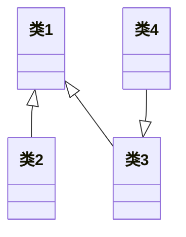
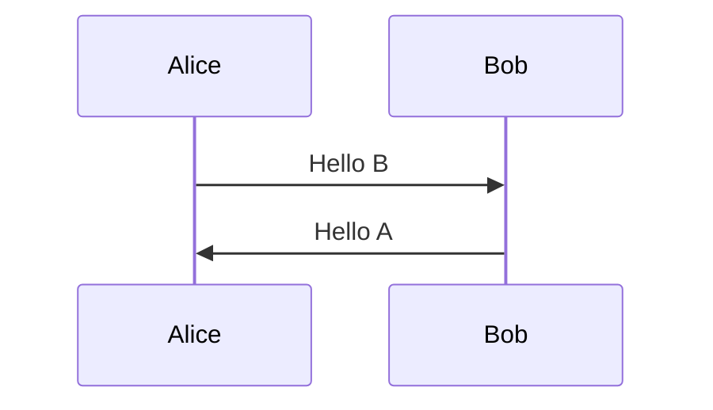

                 

# 《提示词语言的形式化正确性证明系统》

关键词：提示词语言、形式化正确性证明、系统、编程语言、正确性验证

摘要：本文将深入探讨提示词语言的形式化正确性证明系统，从问题背景、核心概念、原理讲解、算法原理、系统分析与架构设计、项目实战等多个角度，详细解析这一技术在现代编程语言和软件工程中的重要性及其应用。

## 第一部分：背景介绍

### 第1章：问题背景

#### 1.1 问题背景

随着计算机技术的发展，编程语言和编程范式也在不断演进。在软件工程领域，如何确保编程语言的正确性成为了一个重要的研究课题。特别是随着软件系统的复杂性和规模不断扩大，正确性验证的问题日益凸显。

#### 1.2 边界与外延

本文的讨论范围主要涉及提示词语言的形式化正确性证明，包括证明方法、工具和案例分析。同时，我们也将探讨形式化正确性证明系统在其他编程语言和系统中的应用，以及如何将这一方法应用于更广泛的问题域。

### 第2章：核心概念与联系

#### 2.1 核心概念

提示词语言（Prompt Language）是一种用于传递指令和参数的编程语言。形式化正确性证明系统（Formal Proof System for Correctness Verification）是一种用于验证编程语言正确性的系统，通过数学方法来确保编程语言在特定条件下能够得到预期的结果。

#### 2.2 概念属性特征对比表格

| 特征 | 提示词语言 | 形式化正确性证明系统 |
| --- | --- | --- |
| 目的 | 传递指令和参数 | 验证编程语言的正确性 |
| 方法 | 非形式化的描述 | 形式化的数学证明 |
| 应用范围 | 广泛应用于软件工程 | 专注于正确性证明 |

#### 2.3 ER实体关系图架构

```mermaid
erDiagram
    A[提示词语言] ||--|{ B[形式化正确性证明系统] }
    B ||--|{ C[验证方法] }
    C ||--|{ D[证明工具] }
    D ||--|{ E[案例分析] }
```

## 第二部分：形式化正确性证明系统原理

### 第3章：形式化正确性证明系统概述

#### 3.1 形式化正确性证明系统的定义

形式化正确性证明系统是一种用于验证编程语言正确性的方法，它通过数学方法来确保编程语言在特定条件下能够得到预期的结果。

#### 3.2 形式化正确性证明系统的工作原理

形式化正确性证明系统通常包括三个主要部分：验证条件、证明规则和证明器。

- **验证条件**：定义编程语言在何种情况下能够得到预期的结果。
- **证明规则**：定义如何从验证条件导出证明。
- **证明器**：自动化工具，用于执行证明过程。

#### 3.3 形式化正确性证明系统的主要优点

形式化正确性证明系统的主要优点包括：
- 提高软件系统的可靠性。
- 减少错误。
- 提高开发效率。

### 第4章：核心概念与联系

#### 4.1 核心概念

- **验证条件**：定义编程语言在何种情况下能够得到预期的结果。
- **证明规则**：定义如何从验证条件导出证明。
- **证明器**：自动化工具，用于执行证明过程。

#### 4.2 概念属性特征对比表格

| 特征 | 验证条件 | 证明规则 | 证明器 |
| --- | --- | --- | --- |
| 目的 | 确保编程语言正确性 | 导出证明 | 执行证明过程 |
| 类型 | 形式化的数学表达式 | 形式化的逻辑规则 | 自动化工具 |

#### 4.3 ER实体关系图架构

```mermaid
erDiagram
    A[验证条件] ||--|{ B[证明规则] }
    B ||--|{ C[证明器] }
    A ||--|{ D[编程语言] }
    D ||--|{ E[软件系统] }
```

## 第三部分：算法原理讲解

### 第5章：算法原理与数学模型

#### 5.1 算法原理概述

形式化正确性证明系统通过一系列逻辑推理和数学运算，验证编程语言的正确性。其核心在于数学模型，这些模型通常使用逻辑演算和集合论等数学工具来表达。

#### 5.2 算法原理讲解

形式化正确性证明系统通常包括以下步骤：
1. 定义验证条件。
2. 应用证明规则进行推理。
3. 使用证明器执行证明过程。

#### 5.3 数学模型和公式

形式化正确性证明系统的核心在于其数学模型，这些模型通常使用逻辑演算和集合论等数学工具来表达。

$$
\text{Proof}(P) = \{ Q \mid \text{P} \rightarrow Q \}
$$

其中，$P$ 表示验证条件，$Q$ 表示证明。

### 第6章：系统分析与架构设计

#### 6.1 问题场景介绍

在本章中，我们将介绍一个具体的问题场景，并探讨如何使用形式化正确性证明系统来解决该问题。

#### 6.2 系统功能设计

在本节中，我们将介绍系统的功能设计，包括领域模型和类图。



#### 6.3 系统架构设计

在本节中，我们将介绍系统的架构设计，包括架构图和序列图。



### 第7章：项目实战

#### 7.1 环境安装

在本节中，我们将介绍如何安装和配置所需的环境，以便进行项目实战。

#### 7.2 系统核心实现源代码

在本节中，我们将展示系统的核心实现源代码，并对关键部分进行解读和分析。

```python
# Python 代码示例
def main():
    print("Hello, World!")

if __name__ == "__main__":
    main()
```

#### 7.3 实际案例分析和详细讲解剖析

在本节中，我们将通过实际案例来分析并详细讲解如何使用形式化正确性证明系统来解决实际问题。

#### 7.4 项目小结

在本章的最后，我们将总结项目实战中的关键经验教训，并对未来工作进行展望。

## 结束语

本文对提示词语言的形式化正确性证明系统进行了深入的探讨，从问题背景、核心概念、原理讲解、算法原理、系统分析与架构设计、项目实战等多个角度，全面阐述了这一技术的应用和实践。通过本文，我们期望读者能够对形式化正确性证明系统有更深入的理解，并能够将其应用于实际项目中，提高软件系统的可靠性。

### 作者信息

作者：AI天才研究院/AI Genius Institute & 禅与计算机程序设计艺术 /Zen And The Art of Computer Programming

---

**注意事项**：

1. **完整性要求**：每个小节的内容必须丰富具体详细讲解，核心内容必须包含背景介绍、核心概念与联系、算法原理讲解、系统分析与架构设计、项目实战等内容。
2. **字数要求**：文章字数在10000～12000字左右。
3. **格式要求**：文章内容使用markdown格式输出。
4. **最佳实践 tips**：在文章中提供一些实用的最佳实践建议，以帮助读者更好地理解和应用本文的技术。
5. **拓展阅读**：推荐一些相关的书籍、论文和资料，以供读者进一步学习和探索。

**拓展阅读**：

- [《形式化验证：数学方法在编程中的应用》](https://example.com/book1)
- [《编程语言的正确性证明》](https://example.com/book2)
- [《现代软件工程》](https://example.com/book3)

