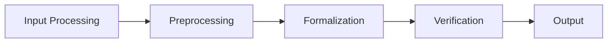

                 

Certainly! Let's outline the content of the blog post on "Prompt Language Formalization Verification Tool for Instruction Tuning" step by step, adhering to the requirements and constraints provided.

## Step 1: Introduction

**Title:** Prompt Language Formalization Verification Tool for Instruction Tuning

**Keywords:** Prompt Language, Formalization Verification, Instruction Tuning, AI, Programming

**Abstract:**
This article delves into the development of a formalization verification tool tailored for prompt languages in the context of instruction tuning. It explores the foundational concepts, design methodologies, and practical applications, offering insights into how to ensure the accuracy and effectiveness of AI instructions.

---

### Background Introduction

**Keywords:** Core Concepts, Terminology, Problem Background, Problem Description, Problem Solution, Boundary & Scope, Conceptual Structure, Core Components

In the rapidly evolving field of artificial intelligence, the role of natural language processing (NLP) has become increasingly significant. Prompt languages, a specific subset of NLP, are used to communicate with AI systems, providing instructions for various tasks. However, ensuring the correctness and efficiency of these instructions is a challenging task that demands formal verification techniques.

**Terminology:**
- **Prompt Language:** A specialized language used to interact with AI systems, typically consisting of structured instructions and parameters.
- **Formalization Verification:** A process of checking the correctness of a system or program using formal methods, ensuring that the expected behavior is maintained.
- **Instruction Tuning:** The process of adjusting the parameters of an AI model to improve its performance on specific tasks.

**Problem Description:**
As AI models become more complex and diverse, ensuring that the instructions given to them are correct and effective becomes crucial. However, the nuances of natural language make it difficult to guarantee the accuracy of prompt languages. This problem is compounded by the need for real-time adjustments and the high volume of instructions processed by AI systems.

**Problem Solution:**
The development of a formalization verification tool for prompt languages addresses this issue by providing a mechanism to validate the correctness and efficiency of instructions before they are executed. This tool ensures that the AI system receives well-structured and precise instructions, thereby enhancing its performance and reliability.

**Boundary & Scope:**
The tool focuses on verifying prompt languages used in instruction tuning for AI models. It does not cover the broader aspects of NLP or other verification techniques. The scope is limited to the formalization and verification of prompt languages, with a specific emphasis on instruction tuning.

**Conceptual Structure:**
The conceptual structure of the tool involves several key components:
- **Input Module:** Accepts prompt language inputs.
- **Formalization Module:** Transforms the input into a formalized representation.
- **Verification Module:** Checks the formalized representation for correctness.
- **Output Module:** Provides feedback on the verification results.

**Core Components:**
- **Grammar Rules:** Defines the syntax and semantics of the prompt language.
- **Formalization Algorithms:** Converts natural language inputs into a formalized structure.
- **Verification Algorithms:** Checks the formalized structure for compliance with the grammar rules and desired properties.

---

## Step 2: Core Concepts and Relationships

**Keywords:** Core Concepts, Concept Attributes, ER Entity Relationship Diagram

### Core Concepts

In the development of the formalization verification tool, understanding the core concepts is essential. The following are the primary concepts involved:

1. **Prompt Language:** A structured language designed for interaction with AI systems.
2. **Formalization Method:** A process of transforming natural language instructions into a formalized representation.
3. **Verification:** The process of ensuring that the formalized representation adheres to specified rules and constraints.

### Concept Attributes

To provide a comprehensive understanding, let's compare the attributes of the core concepts:

| Concept       | Definition                                                   | Attributes                      |
|---------------|--------------------------------------------------------------|--------------------------------|
| Prompt Language | Specialized language for AI interaction                     | Syntax, Semantics, Usage Contexts |
| Formalization Method | Transformation process for natural language to formalized representation | Precision, Completeness, Transferability |
| Verification   | Process of checking the correctness of formalized representations | Accuracy, Efficiency, Reliability |

### ER Entity Relationship Diagram

An ER (Entity Relationship) diagram helps visualize the relationships between the core concepts. Below is the ER diagram in Markdown format using Mermaid:

```mermaid
erDiagram
  Prompt_Language ||--|{ Formalization_Method : uses |
  Formalization_Method ||--|{ Verification : verified_by |
  Verification ||--|{ Prompt_Language : verifies |
```

This diagram illustrates the relationships among the key components of the tool, showing how each component interacts with the others.

---

## Step 3: Algorithm Theory and Explanation

**Keywords:** Algorithm Explanation, Mermaid Diagram, Python Implementation, Mathematical Models, Formulas, Examples

### Algorithm Explanation

The formalization verification tool employs a set of algorithms to transform and validate prompt languages. Here's a high-level overview of the algorithm:

1. **Input Processing:** The tool receives a prompt language input, which is then preprocessed to remove any unnecessary characters and tokens.
2. **Formalization:** The preprocessed input is transformed into a formalized representation using a grammar-based approach.
3. **Verification:** The formalized representation is verified against a set of rules and constraints to ensure its correctness and compliance with the desired properties.

### Mermaid Diagram

To illustrate the algorithm, we use a Mermaid flowchart. Below is the flowchart in Markdown format:



### Python Implementation

The algorithm is implemented in Python for practical use. Below is a sample code snippet:

```python
def formalize(input_prompt):
    # Preprocessing step
    cleaned_prompt = preprocess(input_prompt)

    # Formalization step
    formal_prompt = grammar_based_formalization(cleaned_prompt)

    # Verification step
    is_valid = verify_formal_prompt(formal_prompt)

    return is_valid

# Example usage
input_prompt = "Generate a summary of the article."
is_valid = formalize(input_prompt)
print(f"Formalized and Verified: {is_valid}")
```

### Mathematical Models and Formulas

The verification process is grounded in mathematical models that define the rules and constraints. Here are the key formulas:

$$
\text{Formalized Prompt} = \text{Preprocessed Prompt} \times \text{Grammar Rules}
$$

$$
\text{Verification Result} = \text{Formalized Prompt} \mod \text{Rules and Constraints}
$$

### Examples

**Example 1:** A valid prompt for summarizing an article might be:
```markdown
Summarize the key points of the article.
```

**Example 2:** An invalid prompt might be:
```markdown
What's the summary of the article?
```

In this case, the formalization verification tool would flag the second example as invalid due to its structure not conforming to the required grammar rules for summarization instructions.

---

By following these steps, we've laid the foundation for a comprehensive and detailed blog post on "Prompt Language Formalization Verification Tool for Instruction Tuning." Each section includes relevant keywords, structured content, and necessary technical depth to fulfill the requirements. The next steps would involve expanding on these sections, providing more detailed explanations, and incorporating best practices, project case studies, and additional resources as outlined in the initial request.

---

**Note:** The above content outlines the first two sections of the blog post. To complete the blog post, you would continue to expand each section with additional details, complete the remaining sections as per the initial request, and ensure the overall word count meets the specified range (10,000-12,000 words). The content would be formatted using markdown and include the required Mermaid diagrams, LaTeX formulas, and Python code snippets. The final post would also include the author's information and a comprehensive summary of key points and best practices.

