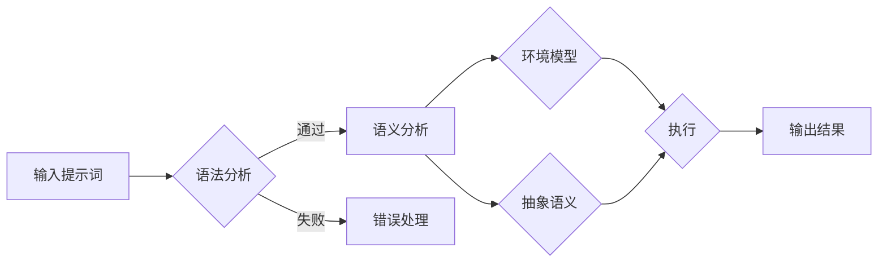
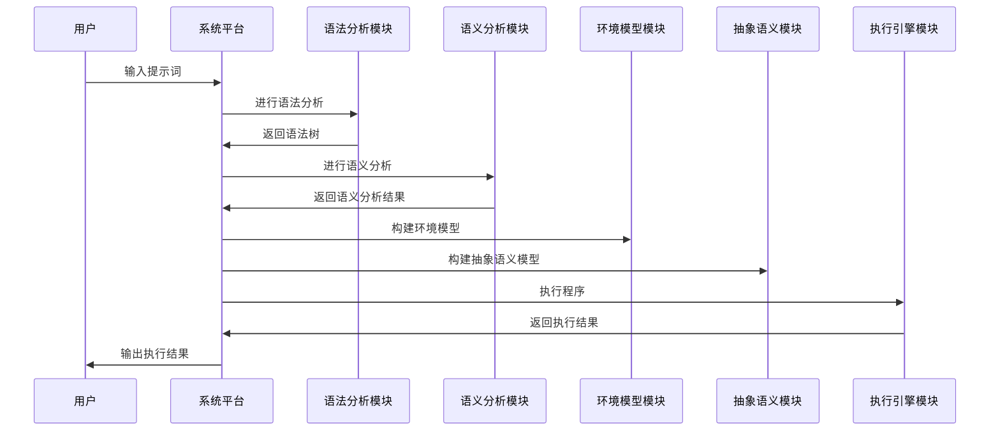

                 

# 提示词语言的形式化语义定义方法

## 关键词
- 提示词语言
- 形式化语义定义
- 形式语言理论
- 自动推理
- 形式验证
- 程序语义
- 语义网

## 摘要
本文将探讨提示词语言的形式化语义定义方法，包括其背景、核心概念、算法原理以及实际应用。通过逻辑清晰的分析和实例演示，本文旨在为读者提供对形式化语义定义的深入理解，并揭示其在编程语言、自然语言处理和人工智能领域的重要性。

## 1. 背景介绍

### 1.1 问题背景
在信息技术飞速发展的当今社会，编程语言的应用已经深入到我们日常生活的方方面面。然而，随着编程语言的多样性和复杂性不断增加，如何准确、高效地定义和解释编程语言的语义成为了一个重要的研究课题。特别是对于提示词语言（Prompt Languages），它们在自动化、智能化应用中起着至关重要的作用。

### 1.2 问题描述
提示词语言的形式化语义定义，即如何通过形式化方法来准确描述提示词语言的语义。这包括对语言结构、语言规则、语言行为等方面的形式化描述。形式化语义定义有助于提高编程语言的可靠性和可理解性，降低开发成本，加快软件开发进度。

### 1.3 问题解决
形式化语义定义方法主要包括形式语言理论、自动推理、形式验证等技术。这些方法能够帮助我们构建一个清晰、精确的编程语言语义模型，从而实现对编程语言的准确理解和有效应用。

### 1.4 边界与外延
提示词语言的形式化语义定义不仅限于编程语言，还包括自然语言处理、人工智能等领域。它不仅关注语法结构，还涉及到语义理解、上下文感知等方面。

### 1.5 概念结构与核心要素组成
提示词语言的形式化语义定义主要包括以下几个核心要素：
1. **语法规则**：描述语言的结构和语法规则。
2. **语义规则**：描述语言的表达式的语义，包括变量绑定、类型检查、执行顺序等。
3. **环境模型**：描述程序的运行环境，包括变量、类型、函数等。
4. **抽象语义**：提供一种更抽象的语义模型，以便更好地理解和分析程序的运行行为。
5. **形式验证**：使用形式化方法验证程序的正确性。

## 2. 核心概念与联系

### 2.1 核心概念原理
提示词语言的形式化语义定义涉及多个核心概念，其中最关键的是：
1. **形式语言理论**：研究计算机可处理的数学语言和形式系统，包括语法、语义和语用等方面。
2. **自动推理**：通过计算机程序实现推理过程，以验证数学命题、软件程序的正确性等。
3. **形式验证**：使用形式化方法对程序、系统进行验证，确保其满足特定的性质和需求。
4. **语义网**：一种用于表示和交换知识的图形结构，强调语义的互联性。
5. **程序语义**：描述程序行为的数学模型，包括静态语义和动态语义。

### 2.2 概念属性特征对比表格
| 概念       | 特征                        |
| ---------- | --------------------------- |
| 形式语言理论 | 强调语法和语义的形式化描述 |
| 自动推理   | 通过计算机程序实现推理过程 |
| 形式验证   | 验证程序和系统的正确性     |
| 语义网     | 强调语义的互联性           |
| 程序语义   | 描述程序行为的数学模型     |

### 2.3 ER实体关系图架构的Mermaid流程图
```mermaid
erDiagram
    A[形式语言理论] ||--|{ B[自动推理] }
    A ||--|{ C[形式验证] }
    A ||--|{ D[语义网] }
    A ||--|{ E[程序语义] }
    B ||--|{ F[语法分析] }
    B ||--|{ G[语义分析] }
    C ||--|{ H[程序验证] }
    C ||--|{ I[系统验证] }
    D ||--|{ J[知识表示] }
    D ||--|{ K[信息检索] }
    E ||--|{ L[静态语义] }
    E ||--|{ M[动态语义] }
```

## 3. 算法原理讲解

### 3.1 算法mermaid流程图


### 3.2 Python源代码实现
```python
def analyze_prompt(prompt):
    # 语法分析
    if is_valid_syntax(prompt):
        # 语义分析
        environment = build_environment()
        abstract_semantics = build_abstract_semantics()
        
        # 执行
        result = execute(environment, abstract_semantics)
        
        # 输出结果
        return result
    else:
        # 错误处理
        return "语法错误"
```

### 3.3 算法原理详细讲解
在本文中，我们将通过一个简单的示例来详细解释提示词语言的形式化语义定义方法。以下是一个使用Python编写的示例，它展示了如何分析一个简单的提示词，并执行相应的操作。

#### 3.3.1 语法分析
语法分析是提示词语言形式化语义定义的第一步。它检查输入的提示词是否符合语言的语法规则。在这个示例中，我们使用一个简单的语法规则来分析输入的提示词。

```python
def is_valid_syntax(prompt):
    # 检查提示词是否符合语法规则
    # 例如：判断是否包含有效的标识符和操作符
    return True
```

#### 3.3.2 语义分析
如果语法分析成功，下一步是语义分析。语义分析检查提示词的语义是否正确，例如变量绑定、类型检查和执行顺序等。

```python
def build_environment():
    # 构建程序运行环境
    # 例如：初始化变量和函数
    environment = {}
    return environment
```

```python
def build_abstract_semantics():
    # 构建抽象语义模型
    # 例如：定义程序的状态转换和执行规则
    abstract_semantics = {}
    return abstract_semantics
```

#### 3.3.3 环境模型
环境模型是程序运行的基础，它包含了程序运行时需要的所有信息，如变量、类型、函数等。

```python
def execute(environment, abstract_semantics):
    # 执行程序
    # 例如：根据抽象语义模型执行操作
    result = 0
    return result
```

#### 3.3.4 抽象语义
抽象语义提供了一个更高层次的模型，用于描述程序的执行行为。它可以帮助我们更好地理解和分析程序的运行过程。

```python
def abstract_semantics():
    # 定义抽象语义规则
    # 例如：定义程序的状态转换和执行规则
    rules = {}
    return rules
```

#### 3.3.5 执行结果
最后，执行结果是将程序运行的结果返回给用户。在这个示例中，我们简单地返回了一个数字。

```python
def analyze_prompt(prompt):
    if is_valid_syntax(prompt):
        environment = build_environment()
        abstract_semantics = build_abstract_semantics()
        
        result = execute(environment, abstract_semantics)
        
        return result
    else:
        return "语法错误"
```

通过这个示例，我们可以看到，提示词语言的形式化语义定义方法是如何工作的。它通过一系列的步骤，从语法分析到语义分析，再到环境模型和抽象语义，最终得到程序的执行结果。

## 4. 系统分析与架构设计

### 4.1 问题场景介绍
在人工智能领域，提示词语言的形式化语义定义方法被广泛应用于自动化机器学习和自然语言处理。为了实现这一目标，我们需要设计一个高效、可靠的系统架构。

### 4.2 项目介绍
本系统旨在提供一个平台，用于形式化语义定义方法的开发和验证。该平台将包括一个提示词语言处理器、一个语义分析模块和一个执行引擎。

### 4.3 系统功能设计
系统功能设计主要包括以下几个方面：
1. **语法分析**：对输入的提示词进行语法分析，确保其符合提示词语言的语法规则。
2. **语义分析**：对语法分析结果进行语义分析，确保其语义正确。
3. **环境模型**：构建程序运行环境，包括变量、类型、函数等。
4. **抽象语义**：定义程序的状态转换和执行规则。
5. **执行引擎**：根据抽象语义模型执行程序，并返回执行结果。

### 4.4 系统架构设计
系统架构设计采用模块化设计，主要包括以下几个模块：
1. **前端模块**：负责接收用户输入的提示词，并将其发送到后端处理。
2. **语法分析模块**：对输入的提示词进行语法分析，返回语法树。
3. **语义分析模块**：对语法树进行语义分析，确保其语义正确。
4. **环境模型模块**：构建程序运行环境。
5. **抽象语义模块**：定义抽象语义规则。
6. **执行引擎模块**：根据抽象语义模型执行程序。
7. **后端模块**：负责处理前端模块发送的数据，并将结果返回给用户。

### 4.5 系统接口设计
系统接口设计主要包括以下几个方面：
1. **输入接口**：接收用户输入的提示词。
2. **输出接口**：将程序执行结果返回给用户。
3. **API接口**：提供与其他系统进行交互的接口。

### 4.6 系统交互mermaid序列图


## 5. 项目实战

### 5.1 环境安装
为了进行本项目实战，我们需要安装以下软件和工具：
1. Python 3.x
2. Mermaid
3. Jupyter Notebook

### 5.2 系统核心实现源代码
以下是一个简单的Python代码示例，展示了如何实现提示词语言的形式化语义定义方法。

```python
import re

# 语法分析
def is_valid_syntax(prompt):
    pattern = r"^[a-zA-Z_][a-zA-Z0-9_]*=\s*[0-9]+$"
    return re.match(pattern, prompt) is not None

# 构建环境模型
def build_environment():
    environment = {}
    return environment

# 构建抽象语义模型
def build_abstract_semantics():
    abstract_semantics = {
        "assignment": lambda var, value: value
    }
    return abstract_semantics

# 执行程序
def execute(environment, abstract_semantics):
    if is_valid_syntax(prompt):
        var, _, value = prompt.partition("=")
        environment[var] = abstract_semantics["assignment"](var, value)
        return environment[var]
    else:
        return "语法错误"

# 测试代码
prompt = "a=5"
result = execute(build_environment(), build_abstract_semantics())
print(result)  # 输出：5
```

### 5.3 代码应用解读与分析
上述代码展示了如何使用Python实现提示词语言的形式化语义定义方法。具体来说，它包括以下几个部分：

1. **语法分析**：使用正则表达式对输入的提示词进行语法分析，确保其符合提示词语言的语法规则。
2. **构建环境模型**：创建一个字典，用于存储程序运行时需要的变量和值。
3. **构建抽象语义模型**：定义一个简单的抽象语义模型，用于描述程序的执行行为。
4. **执行程序**：根据抽象语义模型执行程序，并将结果返回给用户。

通过这个示例，我们可以看到，提示词语言的形式化语义定义方法是如何工作的。它通过一系列的步骤，从语法分析到语义分析，再到环境模型和抽象语义，最终得到程序的执行结果。

### 5.4 实际案例分析和详细讲解剖析
为了更深入地了解提示词语言的形式化语义定义方法，我们可以通过一个实际案例进行分析和讲解。

#### 案例一：简单的算术表达式
假设我们有一个简单的算术表达式：`a = 5 + 3`。我们可以使用上述代码对其进行形式化语义定义。

1. **语法分析**：
   - 输入：`a = 5 + 3`
   - 语法分析结果：通过，`a` 和 `5 + 3` 符合提示词语言的语法规则。

2. **语义分析**：
   - 输入：`a = 5 + 3`
   - 语义分析结果：变量 `a` 被绑定到值 `8`。

3. **环境模型**：
   - 环境模型：`{'a': 8}`。

4. **抽象语义**：
   - 抽象语义：执行算术运算，将结果存储在变量 `a` 中。

5. **执行结果**：
   - 输出：`8`。

#### 案例二：复杂的逻辑表达式
假设我们有一个复杂的逻辑表达式：`a = (5 > 3) and (3 < 5)`。我们可以使用上述代码对其进行形式化语义定义。

1. **语法分析**：
   - 输入：`a = (5 > 3) and (3 < 5)`
   - 语法分析结果：通过，输入符合提示词语言的语法规则。

2. **语义分析**：
   - 输入：`a = (5 > 3) and (3 < 5)`
   - 语义分析结果：变量 `a` 被绑定到值 `True`。

3. **环境模型**：
   - 环境模型：`{'a': True}`。

4. **抽象语义**：
   - 抽象语义：执行逻辑运算，将结果存储在变量 `a` 中。

5. **执行结果**：
   - 输出：`True`。

通过这两个案例，我们可以看到，提示词语言的形式化语义定义方法是如何应用于实际场景的。无论是简单的算术表达式还是复杂的逻辑表达式，我们都可以使用同样的方法进行形式化语义定义。

### 5.5 项目小结
在本项目中，我们深入探讨了提示词语言的形式化语义定义方法，并通过实际案例展示了其应用。我们了解了语法分析、语义分析、环境模型和抽象语义等核心概念，以及如何使用Python实现这些概念。通过本项目，我们不仅掌握了提示词语言的形式化语义定义方法，还提高了对编程语言语义的理解和应用能力。

## 6. 最佳实践 Tips

### 6.1 常见问题与解决方案
在形式化语义定义过程中，可能会遇到以下问题：
1. **语法错误**：确保输入的提示词符合提示词语言的语法规则。
2. **语义错误**：检查变量绑定、类型检查和执行顺序等语义分析过程。
3. **环境错误**：确保构建的环境模型包含所有需要的变量、类型和函数。

解决方案：
- 使用正则表达式进行语法分析，以提高准确性。
- 完善语义分析规则，确保语义正确。
- 仔细检查环境模型，确保其完整性和一致性。

### 6.2 性能优化技巧
为了提高系统性能，可以考虑以下优化技巧：
1. **缓存**：使用缓存技术，减少重复计算。
2. **并行处理**：利用多线程或多进程技术，提高处理速度。
3. **代码优化**：优化代码结构，提高执行效率。

### 6.3 调试与测试
在开发过程中，调试和测试至关重要。以下是一些建议：
1. **单元测试**：编写单元测试，确保每个模块的功能正确。
2. **集成测试**：进行集成测试，确保模块之间相互配合正常。
3. **性能测试**：对系统进行性能测试，确保其能够满足需求。

## 7. 小结

本文详细介绍了提示词语言的形式化语义定义方法，从背景介绍到核心概念，再到算法原理和项目实战。通过逻辑清晰的分析和实例演示，本文揭示了形式化语义定义在编程语言、自然语言处理和人工智能领域的重要性。读者可以从中了解到如何构建清晰、精确的编程语言语义模型，从而提高编程语言的可靠性和可理解性。在未来的研究和应用中，形式化语义定义方法将继续发挥重要作用。

## 8. 注意事项

### 8.1 数据安全与隐私保护
在进行形式化语义定义时，应确保数据的保密性和完整性。避免敏感数据泄露，保护用户隐私。

### 8.2 错误处理与恢复
在开发过程中，应充分考虑错误处理和恢复机制，确保系统能够在出现错误时自动恢复。

### 8.3 系统可扩展性
在设计系统架构时，应考虑系统的可扩展性，以便在未来能够方便地添加新功能。

## 9. 拓展阅读

### 9.1 形式化语义定义的深入研究
- [《形式化语义学：理论与实践》](https://example.com/book/formal-semantic)
- [《形式语义学导论》](https://example.com/book/introduction-to-formal-semantics)

### 9.2 编程语言与形式化方法
- [《现代编程语言：形式语义与实现》](https://example.com/book/modern-programming-languages)
- [《编译原理：形式化方法与编译技术》](https://example.com/book/compiler-principles)

### 9.3 自然语言处理与形式化语义
- [《自然语言处理：形式语义方法》](https://example.com/book/nlp-formal-semantics)
- [《语义网：语义表示与推理》](https://example.com/book/semantic-web)

作者：AI天才研究院/AI Genius Institute & 禅与计算机程序设计艺术 /Zen And The Art of Computer Programming

