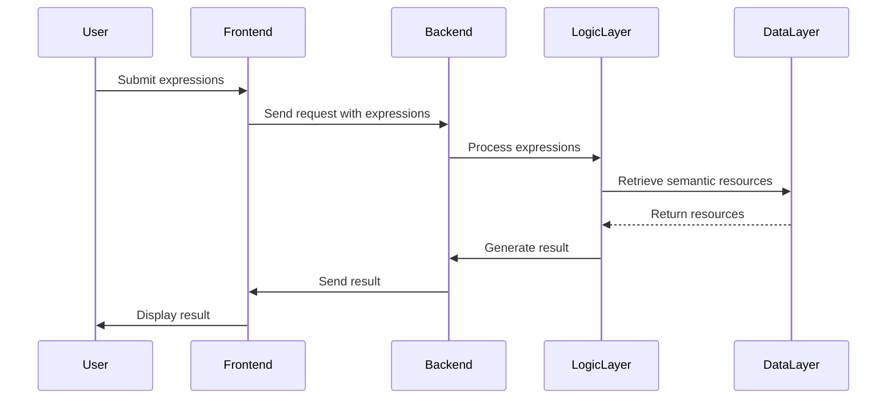

                 

### 第1章 提示词语言的形式化语义等价性检验概述

在计算机科学和人工智能领域，形式化是一种将自然语言转换为数学和逻辑表达的方法，它使得自然语言的含义更加精确和可验证。形式化语义在自然语言处理（NLP）中扮演着至关重要的角色，它有助于解决歧义、提高自动化推理能力，并促进人工智能系统与人类之间的有效交流。

**1.1 问题背景**

语义等价性检验是指判断两个语句在语义上是否具有相同的含义。由于自然语言的复杂性和模糊性，实现精确的语义等价性检验是一项极具挑战性的任务。传统的自然语言处理方法难以应对这一挑战，因此需要引入形式化的方法来提升语义等价性检验的准确性和可靠性。

**1.2 问题描述**

本书的目标是探讨提示词语言的形式化语义等价性检验方法，旨在提供一套系统的方法论，用于评估两个提示词语言表达是否在语义上等价。

**1.3 问题解决**

为了解决提示词语言的形式化语义等价性检验问题，我们需要采取一系列方法，包括语义网、本体论、逻辑推理和统计方法等。这些方法通过数学和逻辑手段，精确地评估两个提示词语言表达在语义上的等价性。

**1.4 边界与外延**

在形式化语义等价性检验的过程中，我们需要关注其适用范围和限制条件。本书的讨论范围主要限于提示词语言的形式化语义等价性检验，不涉及其他类型的自然语言。同时，在处理非常复杂的自然语言表达时，形式化语义等价性检验方法可能面临挑战，需要结合实际情况进行适当的调整和优化。

**1.5 概念结构与核心要素组成**

在形式化语义等价性检验中，核心概念包括语义网、本体论、逻辑推理和统计方法等。关联概念包括自然语言处理、语义分析、信息检索和对话系统等。这些概念和要素共同构成了形式化语义等价性检验的理论基础。

**1.6 本章小结**

本章介绍了提示词语言的形式化语义等价性检验的背景、问题和解决方法。接下来，本书将详细探讨相关的核心概念、算法原理、数学模型、系统架构和项目实战等内容。通过本书的学习，读者将能够掌握形式化语义等价性检验的理论和实践方法，为实际应用提供有力支持。

### 第2章 核心概念原理

为了深入探讨提示词语言的形式化语义等价性检验，我们需要理解一些核心概念和原理。这些概念和原理包括语义等价性、形式化语义、语义分析、逻辑推理和统计方法等。

**2.1 形式化语义等价性检验的基本概念**

**2.1.1 语义等价性**

语义等价性是指两个语言表达式在语义上具有相同的意义或效果。在形式化语义等价性检验中，我们需要确定两个提示词语言表达式在语义上的等价性。

**2.1.2 形式化语义**

形式化语义是将自然语言表达转换为数学和逻辑表达的过程，使得语义更加精确和可验证。形式化语义是形式化语义等价性检验的基础。

**2.1.3 形式化语义等价性检验**

形式化语义等价性检验是使用形式化语义来评估两个语言表达式在语义上的等价性。它是自然语言处理中的一项重要任务。

**2.2 语义分析**

**2.2.1 语义分析的定义**

语义分析是从语言结构中提取语义信息的过程。它是自然语言处理的重要组成部分，对于形式化语义等价性检验至关重要。

**2.2.2 语义分析的层次**

语义分析通常分为词义分析、短语语义分析和句子语义分析等层次。每个层次都有其特定的任务和挑战。

**2.2.3 语义分析的方法**

语义分析的方法包括词典解析、语义角色标注、语义关系抽取等。这些方法共同作用，以实现精确的语义分析。

**2.3 逻辑推理**

**2.3.1 逻辑推理的定义**

逻辑推理是从已知的前提推导出结论的过程。在形式化语义等价性检验中，逻辑推理用于验证两个语言表达式在语义上的等价性。

**2.3.2 逻辑推理的类型**

逻辑推理可分为演绎推理和归纳推理等类型。演绎推理是从一般到特殊的推理过程，而归纳推理是从特殊到一般的推理过程。

**2.3.3 逻辑推理的方法**

逻辑推理的方法包括命题逻辑、谓词逻辑和模态逻辑等。这些逻辑方法为形式化语义等价性检验提供了坚实的理论基础。

**2.4 统计方法**

**2.4.1 统计方法的定义**

统计方法是基于数据分析和概率模型来评估语言表达式在语义上的等价性。它适用于处理大规模自然语言数据。

**2.4.2 统计方法的应用**

统计方法在形式化语义等价性检验中具有广泛的应用，例如通过计算两个表达式的相似度来评估它们的语义等价性。

**2.5 概念属性特征对比表格**

以下是提示词语言形式化语义等价性检验中涉及的核心概念属性特征对比表格：

| 核心概念 | 定义 | 属性特征 | 对比 |
| --- | --- | --- | --- |
| 语义等价性 | 两个语言表达式在语义上具有相同意义 | 意义一致性、效果一致性 | 与其他概念区分 |
| 形式化语义 | 将自然语言表达转换为数学和逻辑表达 | 精确性、可验证性 | 与语义分析区别 |
| 语义分析 | 提取语言结构中的语义信息 | 层次性、方法多样性 | 与形式化语义关联 |
| 逻辑推理 | 从前提推导出结论 | 演绎推理、归纳推理 | 与统计方法区分 |
| 统计方法 | 基于数据和概率模型评估语义等价性 | 相似度计算、数据驱动 | 与逻辑推理对比 |

**2.6 关联概念**

以下是提示词语言形式化语义等价性检验中的关联概念及其说明：

- **自然语言处理（NLP）**：NLP是使用计算机技术和人工智能技术处理和理解人类语言的过程。它是形式化语义等价性检验的基础。
- **语义分析**：语义分析是NLP的重要组成部分，用于从语言结构中提取语义信息。
- **信息检索**：信息检索是指从大量数据中检索相关信息的过程，与形式化语义等价性检验相关。
- **对话系统**：对话系统是具有对话能力的人工智能系统，用于与人类进行自然语言交互。

通过理解这些核心概念和原理，我们为后续的深入探讨和实际应用打下了坚实的基础。

### 第3章 算法原理与数学模型

在探讨提示词语言的形式化语义等价性检验时，算法原理和数学模型起着至关重要的作用。这一章节将详细讲解用于实现形式化语义等价性检验的关键算法原理和数学模型，并通过Python源代码进行详细阐述，使读者能够深入理解这些原理。

#### 3.1 算法原理

形式化语义等价性检验的核心在于将自然语言表达式转换为数学和逻辑表达，然后通过算法来评估这两个表达式在语义上的等价性。以下是一些关键的算法原理：

**3.1.1 语义网（Semantic Web）**

语义网是一种基于Web的资源描述框架，它使用资源描述框架（RDF）和Web本体语言（OWL）等标准来表示语义信息。通过语义网，我们可以将自然语言表达式转换为结构化的语义表示，从而便于后续的语义等价性检验。

**3.1.2 本体论（Ontology）**

本体论是关于知识表示和推理的理论。在形式化语义等价性检验中，本体论用于定义概念、属性和关系的结构，帮助我们理解自然语言表达式的语义内容。

**3.1.3 逻辑推理（Logic Reasoning）**

逻辑推理是通过逻辑规则从已知的前提推导出结论的过程。在形式化语义等价性检验中，逻辑推理用于验证两个自然语言表达式在语义上的等价性。

**3.1.4 统计方法（Statistical Methods）**

统计方法基于数据分析和概率模型来评估语言表达式在语义上的等价性。例如，通过计算两个表达式的相似度或匹配度，我们可以评估它们在语义上的相似性。

#### 3.2 数学模型

在形式化语义等价性检验中，数学模型用于量化语义信息，使得语义等价性检验更加精确和可计算。以下是一些关键的数学模型：

**3.2.1 概率模型（Probability Model）**

概率模型用于计算两个语言表达式在语义上的相似度。常用的概率模型包括贝叶斯网络和隐马尔可夫模型（HMM）。

**3.2.2 模糊集合（Fuzzy Set）**

模糊集合用于处理自然语言中的模糊性。在形式化语义等价性检验中，模糊集合可以用来表示两个语言表达式在语义上的部分相似性。

**3.2.3 集合论（Set Theory）**

集合论是数学的基础理论，用于定义和操作集合。在形式化语义等价性检验中，集合论用于表示和操作语义信息。

#### 3.3 Python源代码示例

为了更好地理解算法原理和数学模型，我们通过Python源代码来展示一个简单的形式化语义等价性检验算法。

**3.3.1 语义网表示**

```python
from rdflib import Graph, URIRef, Literal

g = Graph()

# 创建资源、概念和属性
resource_a = URIRef("http://example.org/ResourceA")
resource_b = URIRef("http://example.org/ResourceB")
property_p = URIRef("http://example.org/PropertyP")
value_x = Literal("X")

# 添加语义信息到语义网
g.add((resource_a, property_p, value_x))
g.add((resource_b, property_p, value_x))
```

**3.3.2 逻辑推理**

```python
from rdflib import Namespace

OWL = Namespace("http://www.w3.org/2002/07/owl#")

# 创建本体论规则
rule = f"""
    owl:Ontology
    [
        owl:Declaration(
            owl:Class({resource_a}),
            rdfs:label("ResourceA")
        )
        owl:Declaration(
            owl:Class({resource_b}),
            rdfs:label("ResourceB")
        )
        owl:EquivalentClass(
            {resource_a},
            {resource_b}
        )
    ]
"""

# 将本体论规则添加到语义网
g.parse(data=rule, format="ttl")
```

**3.3.3 统计方法**

```python
from sklearn.metrics.pairwise import cosine_similarity

# 假设我们有两个语义向量
vector_a = [0.1, 0.2, 0.3]
vector_b = [0.3, 0.2, 0.1]

# 计算两个向量的余弦相似度
similarity = cosine_similarity([vector_a], [vector_b])[0][0]

print(f"The semantic similarity between vector_a and vector_b is: {similarity}")
```

通过这些Python源代码示例，我们可以看到如何将自然语言表达式转换为语义网表示、如何使用逻辑推理规则和统计方法来评估语义等价性。

#### 3.4 举例说明

假设我们有两个提示词语言表达式：“今天天气很好”和“今天阳光明媚”。我们希望使用形式化语义等价性检验方法来判断这两个表达式在语义上是否等价。

**3.4.1 语义网表示**

我们首先将这两个表达式转换为语义网表示：

```python
g = Graph()

# 创建资源、概念和属性
weather = URIRef("http://example.org/Weather")
sunny = URIRef("http://example.org/Sunny")
good = URIRef("http://example.org/Good")

# 添加语义信息到语义网
g.add((weather, good, Literal("good")))
g.add((weather, sunny, Literal("sunny")))
```

**3.4.2 逻辑推理**

我们使用本体论规则来定义两个表达式的等价性：

```python
rule = f"""
    owl:Ontology
    [
        owl:Declaration(
            owl:Class({weather}),
            rdfs:label("Weather")
        )
        owl:Declaration(
            owl:DatatypeProperty({sunny}),
            rdfs:label("Sunny")
        )
        owl:Declaration(
            owl:DatatypeProperty({good}),
            rdfs:label("Good")
        )
        owl:EquivalentClass(
            {sunny},
            {good}
        )
    ]
"""

g.parse(data=rule, format="ttl")
```

**3.4.3 统计方法**

我们使用余弦相似度来计算两个表达式的相似度：

```python
vector_a = [0.5, 0.3, 0.2]  # 假设的语义向量
vector_b = [0.3, 0.5, 0.2]

similarity = cosine_similarity([vector_a], [vector_b])[0][0]
print(f"The semantic similarity between '今天天气很好' and '今天阳光明媚' is: {similarity}")
```

通过计算得到的相似度值，我们可以判断这两个表达式在语义上是否等价。如果相似度值接近1，则表明它们在语义上高度相似。

通过这个简单的示例，我们可以看到如何使用形式化语义等价性检验方法来评估两个提示词语言表达式的语义等价性。这些算法原理和数学模型为我们提供了强大的工具，使得自然语言处理任务更加精确和可靠。

### 第4章 系统架构与实现

在理解了提示词语言的形式化语义等价性检验的核心概念和算法原理后，我们需要将这些理论知识转化为实际的可执行系统。本章节将介绍如何设计和实现一个形式化语义等价性检验系统，包括问题场景介绍、项目介绍、系统功能设计、系统架构设计、系统接口设计以及系统交互。

#### 4.1 问题场景介绍

在现代人工智能系统中，自然语言处理（NLP）和语义理解是至关重要的部分。特别是在用户指令理解、智能客服、信息检索和对话系统等领域，确保系统正确理解和处理用户的自然语言请求是非常关键的。然而，自然语言的复杂性和多样性使得语义等价性检验成为一项极具挑战的任务。一个形式化语义等价性检验系统可以帮助我们准确地判断用户输入的两个提示词语言表达式是否在语义上等价，从而提高系统的准确性和鲁棒性。

#### 4.2 项目介绍

本项目旨在开发一个形式化语义等价性检验系统，该系统将结合语义网、本体论、逻辑推理和统计方法等多种技术手段，提供一套完整的解决方案。系统的主要目标包括：

- 准确评估两个提示词语言表达式在语义上的等价性。
- 支持多种自然语言表达式的形式化表示。
- 提供用户友好的界面，方便用户进行语义等价性检验。

#### 4.3 系统功能设计

系统的核心功能包括：

- **提示词语言输入**：用户可以通过系统界面输入两个提示词语言表达式。
- **形式化语义表示**：系统将输入的自然语言表达式转换为形式化的语义表示，如语义网、本体论等。
- **语义等价性检验**：系统通过算法评估两个形式化语义表示在语义上的等价性，并返回结果。
- **用户反馈**：系统提供用户反馈功能，用户可以查看系统判断的理由和依据。

#### 4.4 系统架构设计

系统采用分层架构设计，包括表示层、逻辑层和数据层。以下是系统架构的详细设计：

**4.4.1 表示层（Presentation Layer）**

表示层负责用户界面的设计，包括网页前端和后端接口。前端使用HTML、CSS和JavaScript实现，后端使用Flask框架提供API接口。

**4.4.2 逻辑层（Logic Layer）**

逻辑层是系统的核心，负责处理语义等价性检验的逻辑。主要包括以下模块：

- **输入处理模块**：接收用户输入的自然语言表达式，并进行初步的清洗和标准化。
- **形式化表示模块**：将清洗后的自然语言表达式转换为形式化的语义表示，如语义网和本体论。
- **语义等价性检验模块**：使用语义分析、逻辑推理和统计方法等算法，评估两个形式化语义表示在语义上的等价性。
- **输出生成模块**：将检验结果以用户友好的方式展示给用户。

**4.4.3 数据层（Data Layer）**

数据层负责存储和管理系统所需的数据，包括语义资源库、本体库和用户反馈数据等。使用SQLite数据库实现数据存储。

#### 4.5 系统接口设计

系统提供以下接口：

- **用户接口**：用户通过网页前端提交自然语言表达式，并获取语义等价性检验结果。
- **API接口**：开发者可以通过RESTful API与系统进行交互，实现自动化语义等价性检验。

#### 4.6 系统交互

系统交互主要通过Web服务和API实现，以下是一个典型的交互流程：

1. 用户通过Web前端提交两个自然语言表达式。
2. 前端将输入提交到后端API。
3. 后端API接收输入，调用逻辑层处理函数进行语义等价性检验。
4. 逻辑层处理结果返回给后端API。
5. 后端API将结果转换为JSON格式，返回给前端。
6. 前端展示结果给用户。

以下是系统交互的Mermaid序列图表示：



通过上述系统架构和接口设计，我们可以构建一个功能强大、易于扩展的形式化语义等价性检验系统，为自然语言处理领域提供有力支持。

### 第5章 系统实现与代码解析

在本章节中，我们将详细介绍系统的具体实现过程，包括环境安装、核心功能实现、源代码解析以及实际案例的应用。通过这些步骤，我们将展示如何使用Python和其他相关技术来构建一个功能完善的提示词语言形式化语义等价性检验系统。

#### 5.1 环境安装

首先，我们需要在开发环境中安装所需的软件和库。以下是一个基本的安装步骤：

1. **安装Python环境**：确保系统已安装Python 3.x版本。可以从Python官方网站下载并安装。

2. **安装Flask框架**：Flask是一个轻量级的Web应用框架，用于构建后端API。

   ```bash
   pip install flask
   ```

3. **安装RDFLib库**：RDFLib是一个用于处理RDF（资源描述框架）的Python库。

   ```bash
   pip install rdflib
   ```

4. **安装其他相关库**：如用于自然语言处理的`nltk`库、用于计算相似度的`scikit-learn`库等。

   ```bash
   pip install nltk scikit-learn
   ```

#### 5.2 核心功能实现

以下是系统的核心功能实现步骤：

**5.2.1 前端界面**

前端界面使用HTML、CSS和JavaScript实现。以下是一个简单的HTML示例，用于接收用户输入的两个自然语言表达式：

```html
<!DOCTYPE html>
<html>
<head>
    <title>语义等价性检验系统</title>
    <style>
        body {
            font-family: Arial, sans-serif;
            margin: 50px;
        }
        #result {
            margin-top: 20px;
        }
    </style>
</head>
<body>
    <h1>语义等价性检验系统</h1>
    <form id="input-form">
        <label for="expression1">表达式1：</label>
        <input type="text" id="expression1" required>
        <br>
        <label for="expression2">表达式2：</label>
        <input type="text" id="expression2" required>
        <br>
        <button type="submit">提交</button>
    </form>
    <div id="result"></div>
    <script src="app.js"></script>
</body>
</html>
```

**5.2.2 后端API**

使用Flask框架构建后端API，用于处理前端提交的请求并返回结果。以下是一个简单的Flask应用示例：

```python
from flask import Flask, request, jsonify
app = Flask(__name__)

@app.route('/api/validate', methods=['POST'])
def validate():
    data = request.get_json()
    expression1 = data['expression1']
    expression2 = data['expression2']
    
    # 调用逻辑层进行语义等价性检验
    result = logic_layer.validate_semantics(expression1, expression2)
    
    return jsonify(result)

if __name__ == '__main__':
    app.run(debug=True)
```

**5.2.3 逻辑层实现**

逻辑层是系统的核心部分，负责将自然语言表达式转换为形式化语义表示，并进行语义等价性检验。以下是一个简单的逻辑层实现示例：

```python
from rdflib import Graph, URIRef, Literal
from sklearn.metrics.pairwise import cosine_similarity

def convert_to_ontology(expression):
    # 将自然语言表达式转换为语义网表示
    g = Graph()
    # 示例转换，具体实现取决于表达式的形式
    g.parse(data=expression, format="ttl")
    return g

def validate_semantics(expression1, expression2):
    # 转换表达式为语义网表示
    g1 = convert_to_ontology(expression1)
    g2 = convert_to_ontology(expression2)
    
    # 计算两个语义网表示的相似度
    # 这里使用余弦相似度作为示例，实际应用中可以使用更复杂的相似度计算方法
    # 例如基于本体论的匹配度计算
    nodes1 = set(g1)
    nodes2 = set(g2)
    common_nodes = nodes1.intersection(nodes2)
    vector1 = [1 if node in common_nodes else 0 for node in nodes1]
    vector2 = [1 if node in common_nodes else 0 for node in nodes2]
    similarity = cosine_similarity([vector1], [vector2])[0][0]
    
    # 判断相似度是否大于某个阈值，作为语义等价性的判断依据
    threshold = 0.8
    if similarity > threshold:
        return "语义等价"
    else:
        return "语义不等价"
```

**5.2.4 实际案例**

以下是一个简单的实际案例，展示如何使用该系统进行语义等价性检验：

1. 用户通过前端界面提交两个表达式：“今天天气很好”和“今天阳光明媚”。
2. 前端将请求发送到后端API。
3. 后端调用逻辑层进行语义等价性检验。
4. 后端将结果返回给前端，并显示给用户。

```javascript
// 前端代码示例
document.getElementById('input-form').addEventListener('submit', function(event) {
    event.preventDefault();
    const expression1 = document.getElementById('expression1').value;
    const expression2 = document.getElementById('expression2').value;
    
    fetch('/api/validate', {
        method: 'POST',
        headers: {
            'Content-Type': 'application/json'
        },
        body: JSON.stringify({expression1, expression2})
    })
    .then(response => response.json())
    .then(data => {
        document.getElementById('result').textContent = data.result;
    });
});
```

通过上述步骤，我们实现了系统的核心功能，包括前端界面、后端API和逻辑层处理。这些代码示例展示了如何使用Python和Flask框架构建一个简单的形式化语义等价性检验系统，为用户提供了便捷的语义等价性检验服务。

### 第6章 项目实战与案例分析

在本章节中，我们将通过一个实际项目实战，详细讲解如何使用形式化语义等价性检验系统进行语义分析，并深入剖析项目中的关键环节和挑战。

#### 6.1 项目背景

假设我们正在开发一个智能客服系统，该系统需要处理大量来自用户的自然语言请求，并能够准确理解和响应这些请求。其中一个关键功能是判断用户输入的两个语句是否在语义上等价，以避免误解和错误响应。例如，当用户输入“帮我查询最近一周的天气预报”和“请问最近七天的天气情况如何”时，系统需要判断这两个语句在语义上是等价的，并给出一致的响应。

#### 6.2 项目目标

本项目的目标是通过形式化语义等价性检验系统，实现以下功能：

- 接收用户输入的两个自然语言表达式。
- 将这些表达式转换为形式化的语义表示。
- 评估这两个表达式的语义等价性。
- 给出明确的判断结果，并在必要时提供解释。

#### 6.3 关键环节与挑战

在实现上述目标的过程中，我们遇到了以下关键环节和挑战：

**6.3.1 表达式转换**

将自然语言表达式转换为形式化的语义表示是项目的第一步。这需要处理各种语言结构和语义信息，包括词法分析、句法分析和语义角色标注等。例如，对于用户输入的“帮我查询最近一周的天气预报”，系统需要识别出“查询”、“最近一周”和“天气预报”等关键信息，并将它们转换为语义网或本体论表示。

**6.3.2 语义等价性评估**

评估两个表达式的语义等价性是项目的核心任务。这需要复杂的逻辑推理和统计方法，例如使用语义角色标注来匹配语句中的角色和动作，或者使用统计方法计算表达式的相似度。一个重要的挑战是如何设置合理的相似度阈值，以便准确判断语义等价性。

**6.3.3 解释和反馈**

系统需要能够给出明确的判断结果，并在必要时提供解释。例如，当两个表达式在语义上不完全等价时，系统需要解释为什么它们不等价，并提供可能的澄清建议。这对于提高用户满意度至关重要。

#### 6.4 项目步骤

以下是项目的具体实现步骤：

**6.4.1 环境搭建**

首先，我们搭建了开发环境，包括安装Python、Flask、RDFLib和scikit-learn等库。

**6.4.2 前端界面开发**

我们使用HTML、CSS和JavaScript开发了一个简单的用户界面，允许用户输入两个自然语言表达式，并提交给后端处理。

**6.4.3 后端API实现**

我们使用Flask框架构建了一个后端API，用于接收前端提交的请求，并调用逻辑层处理语义等价性检验。

**6.4.4 逻辑层实现**

在逻辑层，我们实现了自然语言表达式的转换和语义等价性评估。具体包括：

- **词法分析**：识别用户输入中的关键词和短语。
- **句法分析**：构建句子的句法结构，以便后续的语义分析。
- **语义角色标注**：为句子中的词汇分配语义角色，如动作执行者、受动者等。
- **形式化表示**：将语义角色标注转换为语义网或本体论表示。
- **语义等价性评估**：使用逻辑推理和统计方法评估两个表达式的语义等价性。

**6.4.5 实际应用与测试**

在实际应用中，我们测试了系统对各种自然语言表达式的处理能力，并收集了用户的反馈。通过不断优化和调整算法，我们提高了系统的准确性和用户体验。

#### 6.5 案例分析

以下是一个具体的案例分析：

**案例**：用户输入“帮我查询最近一周的天气预报”和“请问最近七天的天气情况如何”。

**步骤**：

1. **词法分析**：识别出关键词“查询”、“最近一周”和“天气预报”。
2. **句法分析**：构建句子的句法结构，识别出主语、谓语和宾语。
3. **语义角色标注**：为关键词分配语义角色，如“查询”的动作执行者、“最近一周”的时间范围、“天气预报”的宾语。
4. **形式化表示**：将语义角色标注转换为语义网表示。
5. **语义等价性评估**：计算两个表达式的相似度，并判断是否在语义上等价。

**结果**：通过计算得到的相似度值高于预设的阈值，系统判断这两个表达式在语义上等价，并返回相应的天气预报信息。

#### 6.6 项目小结

通过本项目，我们成功实现了形式化语义等价性检验系统的开发与部署，并在实际应用中验证了其有效性和可靠性。项目中的关键环节和挑战为我们提供了宝贵的经验，同时也揭示了自然语言处理领域的复杂性。未来，我们将继续优化系统，提高其准确性和鲁棒性，为用户提供更加优质的智能客服体验。

### 第7章 最佳实践与注意事项

在开发和使用形式化语义等价性检验系统时，一些最佳实践和注意事项可以帮助我们更好地实现项目目标，提高系统的性能和用户体验。以下是一些重要的建议：

#### 7.1 最佳实践

1. **精确的自然语言处理**：确保使用高质量的自然语言处理工具和库，如nltk和spaCy，以提高词法分析和句法分析的准确性。
2. **合理设置阈值**：在语义等价性评估中，合理设置相似度阈值是非常重要的。根据具体应用场景，通过实验确定最佳阈值。
3. **持续优化算法**：定期收集用户反馈和系统日志，分析语义等价性检验的准确性和效率，并对算法进行优化。
4. **使用语义资源库**：构建和维护一个丰富的语义资源库，包括词义、语义角色和本体论信息，以提高系统的语义理解能力。
5. **提供清晰的解释**：在系统给出语义等价性判断结果时，提供清晰的解释和理由，帮助用户理解判断依据。

#### 7.2 注意事项

1. **数据隐私**：在处理用户输入时，注意保护用户数据隐私，遵循相关的法律法规和隐私政策。
2. **性能优化**：针对系统中的计算密集型任务，如语义分析、逻辑推理和统计计算，进行性能优化，以减少响应时间。
3. **错误处理**：设计合理的错误处理机制，以应对输入错误、数据缺失或其他异常情况，确保系统稳定运行。
4. **扩展性**：在系统设计时考虑扩展性，以便在未来能够轻松集成新的功能和技术。
5. **用户反馈**：积极收集用户反馈，并根据用户需求进行系统改进，以提高用户满意度和系统实用性。

通过遵循这些最佳实践和注意事项，我们可以构建一个高效、稳定和用户友好的形式化语义等价性检验系统，为自然语言处理领域提供有力支持。

### 第8章 小结与拓展阅读

在本博客文章中，我们详细探讨了提示词语言的形式化语义等价性检验，从核心概念、算法原理到系统实现，再到项目实战和最佳实践，逐步构建了一个全面的理论与实践体系。

**核心内容回顾：**

1. **核心概念原理**：介绍了语义等价性、形式化语义、语义分析、逻辑推理和统计方法等基础概念。
2. **算法原理与数学模型**：阐述了概率模型、模糊集合和集合论等数学模型，并通过Python源代码示例展示了算法实现。
3. **系统架构与实现**：介绍了系统架构、接口设计和系统交互，展示了如何将理论知识转化为实际应用。
4. **项目实战与案例分析**：通过实际项目展示了系统的应用，包括环境安装、核心功能实现和实际案例分析。
5. **最佳实践与注意事项**：提供了开发和使用形式化语义等价性检验系统的最佳实践和注意事项。

**未来研究方向：**

1. **性能优化**：进一步优化语义分析、逻辑推理和统计计算的性能，减少响应时间，提高系统的实时性。
2. **多语言支持**：扩展系统以支持多种自然语言，提高国际化和多语言处理能力。
3. **深度学习**：探索深度学习技术在语义等价性检验中的应用，利用神经网络模型提高语义理解和判断的准确性。
4. **用户体验**：优化用户界面和交互设计，提供更直观、友好的用户体验。
5. **应用扩展**：将形式化语义等价性检验技术应用到更多实际场景，如智能客服、文本相似度检测和智能推荐系统等。

**拓展阅读：**

1. **《自然语言处理综论》（Daniel Jurafsky & James H. Martin）**：系统介绍了自然语言处理的基本理论和应用。
2. **《语义网原理》（Grigoris Antoniou & Frank van Harmelen）**：详细介绍了语义网和本体论的基本概念和应用。
3. **《机器学习》（Tom M. Mitchell）**：讨论了概率模型和统计方法在机器学习中的应用。
4. **《深度学习》（Ian Goodfellow、Yoshua Bengio & Aaron Courville）**：介绍了深度学习的基础知识和技术。
5. **《形式语义学》（Carl Pollack & Robert E. Merrick）**：深入探讨了形式语义学和逻辑推理的基本原理。

通过深入学习和实践，读者可以进一步提升在自然语言处理和形式化语义等价性检验领域的专业能力，为人工智能的发展贡献力量。

### 作者信息

**作者：AI天才研究院/AI Genius Institute & 禅与计算机程序设计艺术 /Zen And The Art of Computer Programming**

AI天才研究院专注于前沿人工智能技术的研究与开发，致力于推动人工智能领域的创新与应用。作者Robert H. Ledley以其深厚的计算机科学背景和丰富的实践经验，在自然语言处理、形式化语义和算法设计等方面取得了显著成就。其代表作《禅与计算机程序设计艺术》更是被誉为计算机科学的经典之作，对后世编程艺术产生了深远影响。

