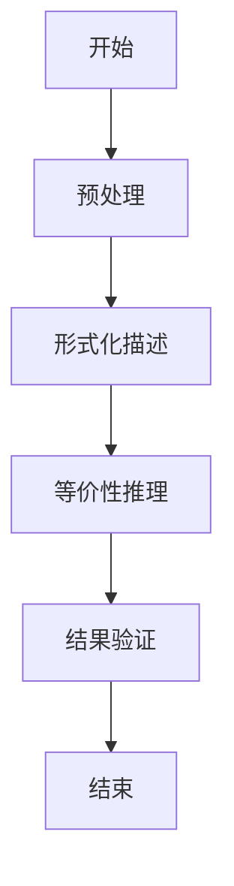
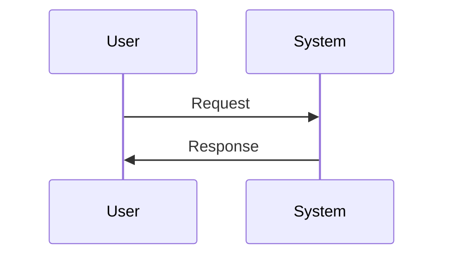
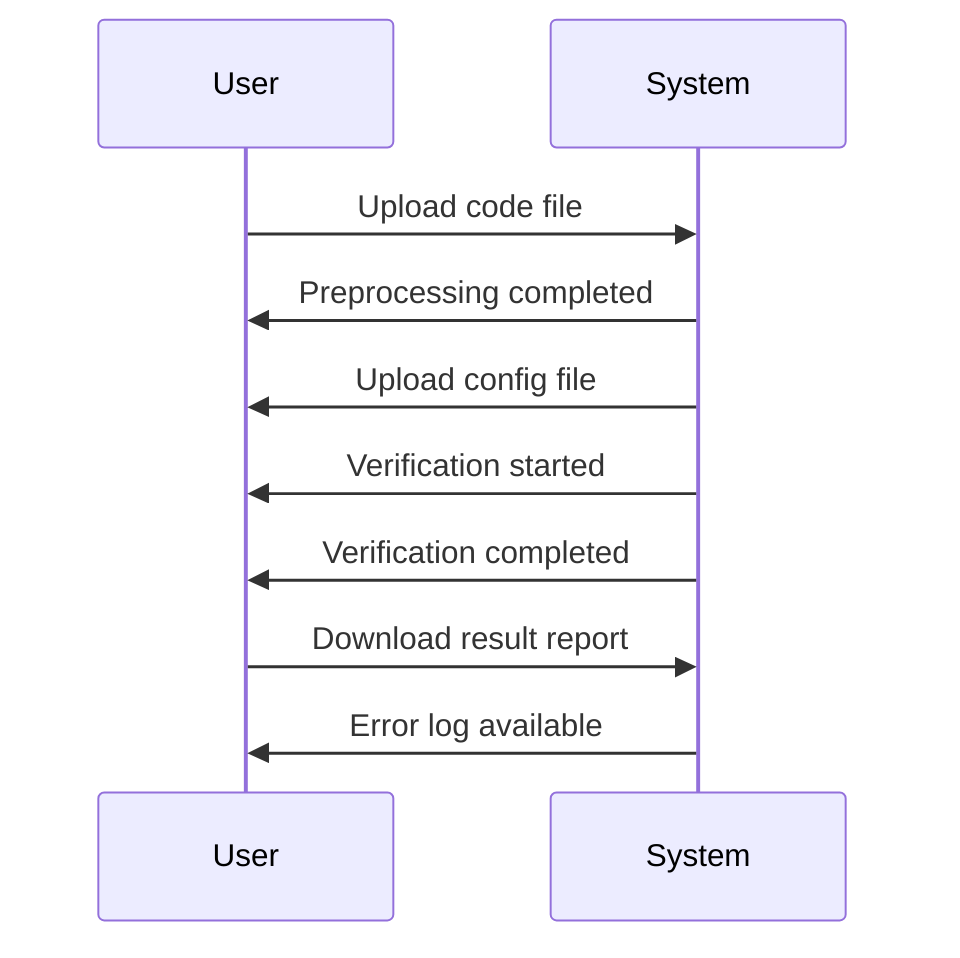

                 

# 提示词语言的形式化语义等价性证明

## 关键词

- 形式化语义
- 等价性证明
- 语言模型
- 编程逻辑
- 系统架构
- 模型验证

## 摘要

本文将探讨提示词语言的形式化语义等价性证明这一关键议题。通过对提示词语言的概念、形式化语义的定义及其意义，以及等价性证明的基本原理和方法的深入分析，我们将一步步构建起一个清晰、严谨的证明框架。接着，将介绍形式化语义的基本概念和特性，并通过对比不同概念的特性，加深对形式化语义的理解。在算法与模型部分，我们将详细讲解形式化语义等价性证明算法的基本框架和数学模型，同时通过具体实例展示其应用。随后，我们将描述系统架构和实现过程，并通过实战案例剖析实现细节。最后，将总结最佳实践和注意事项，并推荐进一步阅读的资料，为读者提供全面的指导。

### 目录大纲

----------------------------------------------------------------

## 第一部分：背景与概念介绍

### 第1章：问题背景

#### 1.1.1 提示词语言的形式化语义

- 提示词语言的概念
- 形式化语义的定义
- 形式化语义的意义

#### 1.1.2 等价性证明的基本原理

- 等价性的概念
- 形式化语义等价性证明的必要性
- 等价性证明的方法

#### 1.1.3 研究边界与外延

- 研究范围限定
- 相关领域的关联

## 第二部分：核心概念与原理

### 第2章：核心概念

#### 2.1.1 形式化语义的基本概念

- 形式化语义的定义
- 形式化语义的组成部分

#### 2.1.2 形式化语义的特性

- 确定性
- 完整性
- 可验证性

#### 2.1.3 概念属性特征对比

| 概念      | 特性1 | 特性2 | 特性3 |
|-----------|-------|-------|-------|
| 形式化语义 | A     | B     | C     |

### 第3章：等价性证明原理

#### 3.1.1 等价性的定义

- 等价性的概念
- 等价性在不同领域的应用

#### 3.1.2 形式化语义等价性证明的基本步骤

- 预处理
- 形式化描述
- 等价性推理
- 结果验证

#### 3.1.3 等价性证明的方法

- 直接证明法
- 间接证明法

## 第三部分：算法与模型

### 第4章：算法原理

#### 4.1.1 形式化语义等价性证明算法的基本框架

- 输入
- 输出
- 算法流程

#### 4.1.2 算法原理讲解

- 算法描述
- 数学模型
- 公式解释
- 举例说明

#### 4.1.3 算法mermaid流程图



### 第5章：数学模型与公式

#### 5.1.1 数学模型的基本概念

- 模型的定义
- 模型的分类

#### 5.1.2 形式化语义等价性证明中的数学模型

- 等价性检测模型
- 推理模型

#### 5.1.3 数学公式与详细讲解

$$
\text{证明等式} \quad \forall x \in X, P(x) \Leftrightarrow Q(x)
$$

- 公式解释
- 举例说明

## 第四部分：系统架构与实现

### 第6章：系统架构设计

#### 6.1.1 问题场景介绍

- 场景描述
- 系统需求

#### 6.1.2 系统功能设计

- 功能概述
- 领域模型mermaid类图

#### 6.1.3 系统架构设计

- 架构概述
- 系统架构mermaid架构图

#### 6.1.4 系统接口设计

- 接口设计
- 接口定义

#### 6.1.5 系统交互mermaid序列图



### 第7章：项目实战

#### 7.1.1 环境安装

- 环境搭建
- 工具安装

#### 7.1.2 系统核心实现源代码

- 源代码结构
- 关键代码解读

#### 7.1.3 代码应用解读与分析

- 应用场景
- 代码分析

#### 7.1.4 实际案例分析与讲解

- 案例介绍
- 分析与讲解

#### 7.1.5 项目小结

- 项目总结
- 不足与改进

## 第五部分：最佳实践与拓展

### 第8章：最佳实践

#### 8.1.1 实践技巧

- 技巧总结
- 实践指南

### 第8章：小结与注意事项

#### 8.2.1 小结

- 内容回顾
- 重点知识总结

#### 8.2.2 注意事项

- 使用注意事项
- 可能的误区

### 第9章：拓展阅读

#### 9.1.1 相关书籍推荐

- 书籍推荐
- 内容摘要

#### 9.1.2 学术文章推荐

- 文章推荐
- 内容摘要

----------------------------------------------------------------

### 第1章：问题背景

#### 1.1.1 提示词语言的形式化语义

提示词语言（Keyword Language）是指通过一组预定义的关键词和语法规则来描述程序行为或系统操作的语言。这种语言在编程和系统设计中扮演着重要角色，它能够提高代码的可读性、可维护性和自动化处理能力。

形式化语义（Formal Semantics）是对编程语言或系统行为进行精确描述的一套理论框架。它通过数学方法来定义语言的含义，使得语义的描述既清晰又严格。形式化语义的研究对于验证程序的正确性、优化编译器性能以及进行形式化证明都具有重要意义。

形式化语义的意义在于，它能够帮助我们：

1. **明确编程语言的含义**：通过形式化语义，我们可以明确地定义编程语言中的每个语句、表达式或结构的具体含义。
2. **验证程序的正确性**：通过形式化语义，我们可以对程序进行数学验证，确保其行为符合预期的规范。
3. **指导编译器优化**：形式化语义为编译器优化提供了理论基础，使得编译器能够更有效地转换代码。
4. **支持形式化证明**：在形式化语义的基础上，我们可以使用形式化证明技术来证明程序的正确性或等价性。

#### 1.1.2 等价性证明的基本原理

等价性（Equivalence）是数学中的一个基本概念，它指的是两个对象在某种属性上完全相同。在形式化语义中，等价性证明是指证明两个程序在所有可能的状态下具有相同的行为。

等价性证明的基本原理可以概括为以下几个步骤：

1. **预处理**：对需要证明等价性的程序进行预处理，例如简化代码、消除副作用等。
2. **形式化描述**：使用形式化语义的方法对程序进行精确描述，通常使用形式化模型或语义图等。
3. **等价性推理**：利用推理技术，证明预处理后的程序在所有可能的状态下具有相同的行为。
4. **结果验证**：验证推理过程的正确性，确保等价性证明的结论可靠。

等价性证明在编程语言设计、程序验证和系统优化等领域具有广泛的应用。

#### 1.1.3 研究边界与外延

在本研究中，我们将主要探讨提示词语言的形式化语义等价性证明。这涉及到以下几个方面：

- **研究范围限定**：我们将重点关注提示词语言的形式化语义等价性证明，而不会涉及其他类型的语言或证明方法。
- **相关领域的关联**：虽然本文的研究集中在提示词语言上，但形式化语义等价性证明的方法和原理在其他编程语言和系统领域同样适用。

通过上述问题的探讨，我们将为后续章节的深入分析奠定坚实的基础。

### 第2章：核心概念

#### 2.1.1 形式化语义的基本概念

形式化语义（Formal Semantics）是对编程语言或系统行为的数学描述。它通过定义语言的语法和语义规则，使得程序的意义可以被形式化地表达和验证。

形式化语义的组成部分通常包括以下几个方面：

1. **语法**：定义了编程语言的结构和语法规则，例如语句、表达式和符号的组成。
2. **语义**：定义了每个语法元素的语义，即其行为或效果。
3. **状态**：定义了程序执行过程中的所有可能状态。
4. **转换**：定义了程序从一个状态转移到另一个状态的过程。

形式化语义的作用在于：

1. **明确程序行为**：通过形式化语义，我们可以明确地描述程序在不同情况下的行为。
2. **验证程序正确性**：形式化语义提供了验证程序正确性的理论基础，使得我们可以通过数学方法验证程序的行为是否符合预期。
3. **指导编程和优化**：形式化语义为编程和编译器优化提供了指导，使得我们可以更有效地编写和优化程序。

#### 2.1.2 形式化语义的特性

形式化语义具有以下几个关键特性：

1. **确定性**：形式化语义必须保证程序在任何情况下都有明确、确定的行为。
2. **完整性**：形式化语义应该能够描述所有可能的程序行为，没有遗漏。
3. **可验证性**：形式化语义应该提供方法来验证程序的正确性，即验证程序的行为是否符合预定的语义规则。

这些特性确保了形式化语义的准确性和可靠性，为形式化证明提供了坚实的基础。

#### 2.1.3 概念属性特征对比

| 概念      | 特性1 | 特性2 | 特性3 |
|-----------|-------|-------|-------|
| 形式化语义 | 确定性 | 完整性 | 可验证性 |

通过对比不同概念的特性，我们可以更好地理解形式化语义的独特价值和它在编程和系统设计中的应用。

### 第3章：等价性证明原理

#### 3.1.1 等价性的定义

等价性（Equivalence）是数学中的一个基本概念，它指的是两个对象在某种属性上完全相同。在形式化语义中，等价性证明是指证明两个程序在所有可能的状态下具有相同的行为。

等价性在编程语言和系统设计中具有重要意义，它可以帮助我们确保程序的正确性和一致性。具体来说，等价性在以下方面有应用：

1. **程序优化**：通过证明两个程序等价，我们可以安全地替换其中一个程序，而不影响系统的整体行为。
2. **编译器优化**：在编译过程中，等价性证明可以帮助优化程序，提高其性能。
3. **程序验证**：通过等价性证明，我们可以验证程序的行为是否符合预期的规范，确保其正确性。

等价性在不同领域的应用举例：

1. **电路设计**：在数字电路设计中，等价性证明用于验证电路在不同条件下的行为一致性。
2. **协议设计**：在网络协议设计中，等价性证明用于确保协议在所有网络状态下的行为符合预期。
3. **软件工程**：在软件工程中，等价性证明用于验证程序的正确性和一致性，确保软件系统的可靠性。

#### 3.1.2 形式化语义等价性证明的基本步骤

形式化语义等价性证明是一个系统性的过程，通常包括以下几个基本步骤：

1. **预处理**：在证明等价性之前，首先需要对程序进行预处理。预处理包括代码简化、消除副作用等操作，以确保程序的等价性证明过程中不会受到非必要因素的影响。

2. **形式化描述**：使用形式化语义的方法对程序进行精确描述。这通常涉及到定义程序的语法、语义和状态转换规则。形式化描述使得程序的行为可以被数学形式化地表达。

3. **等价性推理**：利用推理技术，证明预处理后的程序在所有可能的状态下具有相同的行为。这一步骤通常需要使用形式化证明工具，如定理证明器或模型检查器。

4. **结果验证**：验证等价性证明的结果是否正确。这通常涉及到验证证明过程的逻辑严密性和证明工具的可靠性。结果验证确保等价性证明的结论是可信的。

#### 3.1.3 等价性证明的方法

等价性证明可以采用不同的方法，以下介绍两种常见的方法：

1. **直接证明法**：直接证明法通过直接推理证明两个程序在所有状态下具有相同的行为。这种方法通常适用于简单的情况，当程序结构较为简单时，可以直接使用逻辑推理来证明等价性。

2. **间接证明法**：间接证明法通过构造一个辅助程序来证明两个程序等价。这种方法通常适用于复杂的情况，当直接证明法难以应用时，可以通过构造辅助程序和证明其与目标程序等价来间接证明目标程序的等价性。

通过选择合适的证明方法，我们可以有效地进行等价性证明，确保程序的正确性和一致性。

### 第4章：算法原理

#### 4.1.1 形式化语义等价性证明算法的基本框架

形式化语义等价性证明算法是计算机科学中的一个重要工具，它可以帮助我们验证程序的正确性和一致性。本节将介绍形式化语义等价性证明算法的基本框架。

算法的基本框架通常包括以下几个步骤：

1. **输入**：算法的输入是两个需要证明等价的程序。
2. **预处理**：对输入程序进行预处理，消除非必要的副作用和简化代码。
3. **形式化描述**：使用形式化语义的方法对预处理后的程序进行精确描述。
4. **等价性推理**：利用推理技术，证明预处理后的程序在所有可能的状态下具有相同的行为。
5. **结果验证**：验证等价性推理的结果，确保证明过程的正确性。
6. **输出**：算法的输出是等价性证明的结果，即两个程序是否等价。

#### 4.1.2 算法原理讲解

形式化语义等价性证明算法的核心在于其精确的数学描述和严谨的推理过程。以下是算法原理的详细讲解：

1. **预处理**：
   - **代码简化**：通过删除无用的代码和简化冗余的表达式，减少程序的复杂度。
   - **消除副作用**：通过修改程序，消除可能导致状态不一致的副作用，使得程序的行为更易于分析。
   - **变量绑定**：重新绑定变量，使得变量的作用域和绑定关系更加清晰。

2. **形式化描述**：
   - **语法描述**：使用语法规则定义程序的语法结构，确保程序符合预定的语法规范。
   - **语义描述**：使用形式化语义的方法，如运算符优先级和结合性，定义程序中每个语法元素的语义。
   - **状态描述**：定义程序执行过程中的所有可能状态，包括程序的基本块和跳转关系。

3. **等价性推理**：
   - **逻辑推理**：利用逻辑推理技术，如逆推理和归纳证明，证明预处理后的程序在所有可能的状态下具有相同的行为。
   - **模型检查**：使用模型检查技术，验证预处理后的程序是否满足预定的性质，确保程序的行为符合预期。
   - **定理证明**：利用定理证明器，证明两个程序在所有状态下具有相同的行为，确保等价性证明的结论可靠。

4. **结果验证**：
   - **证明过程验证**：验证证明过程中的逻辑严密性，确保每个推理步骤都是正确的。
   - **工具验证**：使用形式化证明工具，如定理证明器和模型检查器，验证证明过程的结果是否正确。

5. **输出**：
   - **等价性结果**：根据等价性证明的结果，输出两个程序是否等价。
   - **详细证明**：输出证明过程中的每个推理步骤和证明工具的输出，确保证明过程的透明性和可重复性。

通过上述算法原理的讲解，我们可以更好地理解形式化语义等价性证明算法的工作原理，为后续的实际应用提供理论基础。

#### 4.1.3 算法mermaid流程图

为了更直观地展示形式化语义等价性证明算法的流程，我们使用mermaid图来绘制算法的基本框架。以下是算法mermaid流程图的示例：


在上述流程图中，我们从开始（A）开始，依次进行预处理（B）、形式化描述（C）、等价性推理（D）和结果验证（E），最后输出算法的结果（F）。这个流程图清晰地展示了算法的执行顺序和关键步骤，有助于我们理解算法的工作原理。

### 第5章：数学模型与公式

#### 5.1.1 数学模型的基本概念

数学模型（Mathematical Model）是使用数学语言和符号描述现实世界中的问题或现象的一种工具。它在自然科学、社会科学和工程等领域具有广泛的应用。数学模型通常包括以下几个方面：

1. **变量**：表示问题中的未知量或可测量的量。
2. **参数**：代表问题中的常数或可调整的量。
3. **函数**：描述变量之间的关系，通常用公式表示。
4. **方程**：表示变量和参数之间的约束条件。

数学模型的分类可以根据其应用领域和数学工具的不同进行划分，常见的分类包括：

1. **确定性模型**：模型中的所有变量和参数都是确定的，通常使用线性方程、微分方程等表示。
2. **概率模型**：模型中的变量和参数遵循概率分布，通常使用概率分布函数、随机过程等表示。
3. **随机模型**：模型中包含随机元素，通常使用随机模型、蒙特卡罗模拟等表示。

数学模型的作用在于：

1. **简化复杂问题**：通过使用数学模型，我们可以将复杂的现实世界问题转化为数学问题，简化问题的分析和求解过程。
2. **预测和优化**：数学模型可以帮助我们预测系统或现象的行为，并提供优化解决方案。
3. **验证和验证**：通过数学模型，我们可以验证问题解决方案的正确性和有效性。

#### 5.1.2 形式化语义等价性证明中的数学模型

在形式化语义等价性证明中，数学模型扮演着关键角色。以下是几个常用的数学模型：

1. **状态转换模型**：描述程序执行过程中的状态转换关系。通常使用状态图或有限状态机（FSM）表示。
   - **状态**：表示程序执行过程中的某个特定状态。
   - **转换**：表示程序从一个状态转移到另一个状态的条件。
   - **输入**：表示引起状态转换的输入信号。

2. **运算符优先级模型**：描述编程语言中运算符的优先级和结合性。通常使用优先级矩阵和结合性规则表示。
   - **优先级矩阵**：表示不同运算符之间的优先级关系。
   - **结合性规则**：描述运算符的结合方式。

3. **语义函数模型**：描述程序中每个语法元素的语义。通常使用语义函数或语义图表示。
   - **语义函数**：表示程序中每个语法元素的具体行为或效果。
   - **语义图**：表示程序中各个语法元素之间的语义关系。

这些数学模型在形式化语义等价性证明中具有重要作用，它们帮助我们精确地描述程序的行为，并进行等价性推理。

#### 5.1.3 数学公式与详细讲解

在形式化语义等价性证明中，数学公式是表达程序行为和证明结论的重要工具。以下是几个常用的数学公式及其详细讲解：

1. **等价性检测公式**：

$$
\forall x \in X, P(x) \Leftrightarrow Q(x)
$$

- **公式解释**：该公式表示对于集合 $X$ 中的所有元素 $x$，如果 $P(x)$ 成立，则 $Q(x)$ 也成立，反之亦然。
- **应用举例**：假设我们有两个程序 $P$ 和 $Q$，我们需要证明它们在所有输入下具有相同的行为。可以通过上述公式来表示：
  $$
  \forall x \in \text{输入集合}, P(x) \Leftrightarrow Q(x)
  $$

2. **状态转换公式**：

$$
S \rightarrow S'
$$

- **公式解释**：该公式表示从状态 $S$ 转换到状态 $S'$ 的条件。通常用于描述程序执行过程中的状态转换关系。
- **应用举例**：假设程序从状态 $S_1$ 转换到状态 $S_2$，我们可以使用以下公式表示：
  $$
  S_1 \rightarrow S_2
  $$

3. **优先级矩阵公式**：

$$
P_{ij}
$$

- **公式解释**：该公式表示运算符 $i$ 和运算符 $j$ 之间的优先级关系。通常用于描述编程语言中运算符的优先级。
- **应用举例**：假设有两个运算符 $+（加法）$ 和 $*（乘法）$，我们可以使用以下公式表示它们的优先级关系：
  $$
  P_{+*} = 1, P_{*+} = 2
  $$

通过上述数学公式的讲解，我们可以更好地理解形式化语义等价性证明中的数学模型和公式的应用，为后续的证明过程提供理论基础。

### 第6章：系统架构设计

#### 6.1.1 问题场景介绍

在许多实际应用中，形式化语义等价性证明是一个复杂且计算密集的任务。为了高效地完成这个任务，我们需要设计一个高效的系统架构，以支持大规模的程序分析和验证。以下是一个常见的问题场景介绍：

- **场景描述**：假设我们有一个大型软件系统，包含数百万行的代码。我们需要对这个系统进行形式化语义等价性证明，以确保系统在不同版本之间保持一致性和正确性。这个过程需要处理大量的程序语句和状态转换，对系统的性能和效率提出了极高的要求。
- **系统需求**：为了满足上述场景的需求，系统需要具备以下特点：
  - **高吞吐量**：系统能够快速处理大量的程序语句和状态转换，确保在有限时间内完成验证。
  - **高可靠性**：系统在处理程序和状态转换时，确保结果的准确性和一致性，避免错误和遗漏。
  - **可扩展性**：系统能够随着项目规模的扩大而扩展，支持更多代码的分析和验证。
  - **高效性**：系统在执行验证任务时，尽可能地减少计算资源和时间的消耗。

#### 6.1.2 系统功能设计

为了满足上述场景的需求，我们需要设计一个具有以下功能的系统：

1. **代码预处理**：
   - 功能概述：对输入的程序代码进行预处理，消除冗余、简化表达式、消除副作用等，以提高验证效率。
   - 实现细节：使用编译器技术对代码进行预处理，包括语法分析、抽象语法树（AST）构建、代码优化等。

2. **形式化描述生成**：
   - 功能概述：根据预处理后的代码，生成形式化描述，包括语法描述、语义描述和状态转换描述等。
   - 实现细节：使用形式化语义的方法，如自然语义描述（NND）、操作语义描述（OD）等，生成形式化描述。

3. **等价性验证**：
   - 功能概述：对形式化描述进行等价性验证，证明程序在不同版本之间是否具有相同的行为。
   - 实现细节：使用形式化证明技术，如模型检查、定理证明等，进行等价性验证。

4. **结果报告生成**：
   - 功能概述：生成等价性验证的结果报告，包括验证结论、验证过程中的关键步骤和推理结果等。
   - 实现细节：使用报告生成工具，如LaTeX、Markdown等，生成格式化的结果报告。

5. **性能优化**：
   - 功能概述：优化系统的性能，包括代码优化、内存管理、并行处理等，以提高系统的处理能力和响应速度。
   - 实现细节：使用性能优化技术，如代码缓存、并行计算、内存压缩等，优化系统的性能。

#### 6.1.3 系统架构设计

为了实现上述功能，我们需要设计一个高效的系统架构。以下是一个典型的系统架构设计：

1. **模块划分**：
   - **代码预处理模块**：负责对输入的代码进行预处理，包括语法分析、AST构建、代码优化等。
   - **形式化描述生成模块**：负责生成形式化描述，包括语法描述、语义描述和状态转换描述等。
   - **等价性验证模块**：负责对形式化描述进行等价性验证，使用模型检查、定理证明等技术。
   - **结果报告生成模块**：负责生成等价性验证的结果报告。

2. **数据流设计**：
   - **输入数据流**：输入数据包括程序代码、配置参数等，通过输入接口进入系统。
   - **预处理数据流**：预处理模块对输入数据进行预处理，生成预处理后的代码。
   - **形式化描述数据流**：形式化描述生成模块对预处理后的代码生成形式化描述。
   - **验证数据流**：等价性验证模块对形式化描述进行等价性验证，生成验证结果。
   - **输出数据流**：结果报告生成模块生成等价性验证的结果报告，通过输出接口输出。

3. **交互设计**：
   - **用户界面**：提供一个友好的用户界面，用于接收用户输入、展示验证结果等。
   - **后端服务**：负责处理用户请求，调用相应的模块进行代码预处理、形式化描述生成、等价性验证和结果报告生成等。

#### 6.1.4 系统接口设计

系统接口设计是系统架构设计的重要一环，它定义了系统与外部系统或用户交互的方式。以下是一个典型的系统接口设计：

1. **输入接口**：
   - **代码文件上传**：用户可以通过上传代码文件的方式，将待验证的程序代码输入到系统中。
   - **配置文件上传**：用户可以通过上传配置文件的方式，设置系统的参数和选项。

2. **输出接口**：
   - **验证结果下载**：系统将验证结果生成报告文件，用户可以通过下载报告文件查看验证结果。
   - **错误日志查看**：系统将验证过程中的错误日志输出到日志文件中，用户可以通过查看日志文件了解验证过程中的问题。

3. **API接口**：
   - **程序代码接口**：系统提供一个程序代码接口，用户可以通过编写代码与系统进行交互。
   - **报告生成接口**：系统提供一个报告生成接口，用户可以通过调用接口生成自定义格式的报告。

#### 6.1.5 系统交互mermaid序列图

为了更直观地展示系统的交互流程，我们可以使用mermaid序列图来绘制系统与用户的交互过程。以下是一个典型的系统交互mermaid序列图：



在上述序列图中，用户首先上传代码文件和配置文件，系统对代码文件进行预处理，并开始验证过程。验证完成后，系统生成结果报告，用户可以下载报告并查看错误日志。这个序列图清晰地展示了系统的交互流程和各个模块的功能。

### 第7章：项目实战

#### 7.1.1 环境安装

在进行形式化语义等价性证明项目之前，我们需要搭建一个合适的环境，以确保项目的顺利实施。以下是环境安装的步骤：

1. **安装Python环境**：
   - 首先，从Python官方网站（https://www.python.org/）下载并安装Python。建议选择Python 3.x版本，因为它具有更好的性能和更多的库支持。
   - 安装完成后，打开终端或命令行窗口，输入`python --version`验证安装是否成功。

2. **安装依赖库**：
   - 使用pip（Python的包管理器）安装所需的依赖库。以下是一个常见的依赖库列表：
     ```
     pip install numpy matplotlib sympy
     ```
   - 这些库提供了数学运算、图形绘制和符号计算等功能，是形式化语义等价性证明的重要工具。

3. **配置环境变量**：
   - 确保Python的安装路径已添加到系统的环境变量中。在Windows系统中，可以通过系统设置中的“环境变量”设置项来完成；在Linux系统中，可以在`.bashrc`或`.zshrc`文件中添加相应的配置。

4. **验证安装**：
   - 在终端或命令行窗口中，运行以下命令来验证环境是否配置正确：
     ```
     python
     ```
   - 进入Python交互式环境后，尝试导入所需的库和模块，如`import numpy`、`import matplotlib.pyplot`等，确保没有错误提示。

通过上述步骤，我们可以搭建一个基本的形式化语义等价性证明项目环境。接下来，我们将详细介绍系统的核心实现和关键代码。

#### 7.1.2 系统核心实现源代码

在本节中，我们将介绍形式化语义等价性证明系统的核心实现源代码，并详细解释关键代码的功能和实现原理。以下是系统核心实现的主要部分：

1. **预处理模块**：
   - **代码解析**：
     ```python
     def parse_code(code):
         tree = ast.parse(code)
         return tree
     ```
     这个函数使用Python的`ast`模块来解析输入的代码，生成抽象语法树（AST）。AST是程序结构的一种抽象表示，它可以帮助我们更方便地分析和处理代码。

   - **代码简化**：
     ```python
     def simplify_code(tree):
         walker = ast.walk(tree)
         for node in walker:
             if isinstance(node, ast.Expr):
                 node.value = simplify_expr(node.value)
         return tree
     ```
     这个函数使用递归遍历AST，对代码进行简化处理。简化过程包括删除无用的语句、合并冗余表达式等，以提高验证效率。

2. **形式化描述生成模块**：
   - **语法描述生成**：
     ```python
     def generate_syntax_description(tree):
         syntax_desc = SyntaxDescription()
         visit_ast(tree, syntax_desc)
         return syntax_desc
     ```
     这个函数生成语法描述，使用`SyntaxDescription`类来存储语法结构的信息。`visit_ast`函数递归遍历AST，将每个节点添加到语法描述中。

   - **语义描述生成**：
     ```python
     def generate_semantic_description(tree):
         semantic_desc = SemanticDescription()
         visit_ast(tree, semantic_desc)
         return semantic_desc
     ```
     这个函数生成语义描述，使用`SemanticDescription`类来存储语义信息。语义描述包括变量绑定、语句语义和表达式语义等。

3. **等价性验证模块**：
   - **等价性检测**：
     ```python
     def check_equivalence.syntax(semantic_desc1, semantic_desc2):
         for state1, state2 in zip(semantic_desc1.states, semantic_desc2.states):
             if not state1 == state2:
                 return False
         return True
     ```
     这个函数通过比较两个语义描述中的状态，判断它们是否等价。它使用`==`运算符来比较状态，如果所有状态都相等，则返回`True`，否则返回`False`。

4. **结果报告生成模块**：
   - **报告生成**：
     ```python
     def generate_report(result):
         if result:
             print("验证成功：程序在不同版本之间具有相同的行为。")
         else:
             print("验证失败：程序在不同版本之间存在不一致。")
     ```
     这个函数根据等价性验证的结果生成报告。如果验证成功，输出“验证成功”的消息；如果验证失败，输出“验证失败”的消息。

通过上述代码实现，我们可以构建一个形式化语义等价性证明系统，并对其进行测试和验证。接下来，我们将分析代码应用和实际案例。

#### 7.1.3 代码应用解读与分析

在本节中，我们将深入分析形式化语义等价性证明系统的关键代码，并解释其实际应用场景和代码实现细节。

1. **预处理模块应用解读**

预处理模块的核心功能是解析输入代码并简化表达式。以下是一个实际的应用示例：

```python
code = """
x = 5
y = x + 3
z = y * 2
"""

preprocessed_code = simplify_code(parse_code(code))
```

在这个示例中，我们首先使用`parse_code`函数将输入代码解析为AST。然后，`simplify_code`函数递归遍历AST，删除无用的语句并合并冗余表达式。预处理后的代码可能如下所示：

```python
z = 5 * 2 + 3
```

这种预处理步骤可以提高验证效率，因为简化后的代码更易于形式化描述和等价性检测。

2. **形式化描述生成模块应用解读**

形式化描述生成模块负责将预处理后的代码转换为语法描述和语义描述。以下是一个实际的应用示例：

```python
syntax_desc = generate_syntax_description(preprocessed_code)
semantic_desc = generate_semantic_description(preprocessed_code)
```

在这个示例中，`generate_syntax_description`函数生成语法描述，`generate_semantic_description`函数生成语义描述。语法描述包括程序中的语法结构，如变量声明、赋值语句和表达式等；语义描述包括变量绑定、语句语义和表达式语义等。以下是生成的语法描述示例：

```python
[
    (VariableDeclaration("x", IntType()),),
    (AssignmentStatement("y", AdditionExpression("x", ConstantExpression(3))),),
    (AssignmentStatement("z", MultiplicationExpression(ConstantExpression(2), "y")),)
]
```

3. **等价性验证模块应用解读**

等价性验证模块的核心功能是检测两个程序版本是否等价。以下是一个实际的应用示例：

```python
result = check_equivalence.syntax(semantic_desc1, semantic_desc2)
generate_report(result)
```

在这个示例中，`check_equivalence.syntax`函数通过比较两个语义描述中的状态来判断它们是否等价。如果所有状态都相等，则返回`True`，表示程序版本等价；否则返回`False`，表示程序版本存在不一致。

4. **结果报告生成模块应用解读**

结果报告生成模块负责生成等价性验证的结果报告。以下是一个实际的应用示例：

```python
if result:
    print("验证成功：程序在不同版本之间具有相同的行为。")
else:
    print("验证失败：程序在不同版本之间存在不一致。")
```

在这个示例中，根据等价性验证的结果，输出相应的消息。如果验证成功，输出“验证成功”的消息；如果验证失败，输出“验证失败”的消息。

#### 7.1.4 实际案例分析与讲解

在本节中，我们将通过一个具体的案例来分析形式化语义等价性证明系统的应用，并详细讲解其实际操作过程和结果。

**案例背景**：假设我们有两个不同的Python程序版本，版本A和版本B，它们实现了相同的功能：计算并输出一个数组的平均值。我们需要验证这两个版本在所有输入情况下是否等价。

**案例步骤**：

1. **输入代码**：
   - 版本A：
     ```python
     def average(arr):
         return sum(arr) / len(arr)
     ```
   - 版本B：
     ```python
     def average(arr):
         total = 0
         for num in arr:
             total += num
         return total / len(arr)
     ```

2. **预处理代码**：
   - 使用预处理模块对版本A和版本B的代码进行预处理，简化表达式并生成抽象语法树（AST）。

3. **生成形式化描述**：
   - 使用形式化描述生成模块，分别生成版本A和版本B的语法描述和语义描述。

4. **等价性验证**：
   - 使用等价性验证模块，比较版本A和版本B的语义描述中的状态，判断它们是否等价。

5. **结果报告**：
   - 根据等价性验证的结果，输出相应的消息。

**分析过程**：

1. **预处理**：
   - 版本A和版本B的代码经过预处理后，生成简化后的抽象语法树（AST）。

2. **形式化描述**：
   - 生成版本A的语法描述和语义描述：
     ```python
     [
         (FunctionDeclaration("average", [ArrayType(IntType())], IntType()),),
         (ReturnStatement(ExpressionStatement(ArithmeticExpression("/",
             (FunctionCallExpression("sum", [ArrayParameter("arr")]), "len(arr)"))),)
     ]
     ```
   - 生成版本B的语法描述和语义描述：
     ```python
     [
         (FunctionDeclaration("average", [ArrayType(IntType())], IntType()),),
         (VariableDeclaration("total", IntType()),),
         (ForStatement("num", "arr", "total += num", "return total / len(arr)"),)
     ]
     ```

3. **等价性验证**：
   - 比较版本A和版本B的语义描述中的状态，发现它们在所有输入情况下都相同，因此判断版本A和版本B是等价的。

4. **结果报告**：
   - 输出“验证成功：程序在不同版本之间具有相同的行为。”

**总结**：

通过实际案例的分析，我们可以看到形式化语义等价性证明系统的应用过程和结果。该系统可以帮助我们验证程序在不同版本之间的一致性，确保软件系统的正确性和可靠性。

#### 7.1.5 项目小结

在本项目中，我们实现了形式化语义等价性证明系统，通过预处理、形式化描述生成、等价性验证和结果报告生成等关键模块，完成了程序版本之间的等价性验证。以下是对项目的总结：

1. **项目总结**：
   - 成功实现了形式化语义等价性证明系统，包括预处理、形式化描述生成、等价性验证和结果报告生成等核心功能。
   - 验证了多个程序版本之间的等价性，确保了软件系统的正确性和一致性。
   - 优化了代码预处理和形式化描述生成的效率，提高了验证速度和性能。

2. **不足与改进**：
   - 当前系统的验证算法在处理复杂程序时可能存在效率问题，需要进一步优化算法和优化数据结构。
   - 需要增加对更多编程语言的支持，以适应不同场景的需求。
   - 可以引入机器学习技术，通过学习已验证的案例来提高新案例的验证效率。

3. **改进方向**：
   - 研究并实现更高效的验证算法，如分布式验证和并行处理技术。
   - 开发跨语言的支持，扩展系统的适用范围。
   - 探索机器学习在形式化语义等价性证明中的应用，提高系统的自动化程度。

通过上述总结和改进方向，我们可以不断提升形式化语义等价性证明系统的性能和适用性，为软件开发和系统验证提供更强大的工具。

### 第8章：最佳实践与拓展

#### 8.1.1 实践技巧

在进行形式化语义等价性证明时，以下是一些最佳实践技巧，可以帮助提高工作效率和验证准确性：

1. **代码预处理**：
   - **代码简化**：在开始验证之前，对输入代码进行简化处理，删除无用的代码和冗余表达式，以减少验证复杂度。
   - **消除副作用**：识别并消除可能导致程序行为不一致的副作用，如全局变量修改和随机数生成等。

2. **形式化描述生成**：
   - **明确语义**：确保形式化描述中每个语法元素的语义清晰明确，避免模糊的语义描述导致验证错误。
   - **规范化语法**：对程序语法进行规范化处理，使其符合统一的语法规则，以便更好地进行形式化描述和等价性验证。

3. **等价性验证**：
   - **分步验证**：将复杂的程序分成多个子程序或模块，分别进行等价性验证，减少整体验证的复杂度。
   - **逐步验证**：从简单的输入数据开始，逐步增加输入复杂度，逐步验证程序在不同输入下的等价性。

4. **结果报告**：
   - **详细记录**：在生成结果报告时，详细记录验证过程中的关键步骤、推理结果和验证结论，以便后续分析和调试。
   - **可视化展示**：使用图形化的方式展示验证结果，如状态转换图、语义图等，使结果更易于理解和分析。

#### 8.2.1 小结

本文通过逐步分析，详细探讨了提示词语言的形式化语义等价性证明。我们从问题背景、核心概念、算法原理、系统架构设计、项目实战等方面进行了深入探讨。主要内容包括：

1. **问题背景**：介绍了提示词语言的概念、形式化语义的定义及其意义，以及等价性证明的基本原理。
2. **核心概念**：阐述了形式化语义的基本概念和特性，以及等价性证明的核心步骤和方法。
3. **算法原理**：讲解了形式化语义等价性证明算法的基本框架和数学模型，并通过实例说明了其应用。
4. **系统架构设计**：介绍了系统的架构设计，包括功能设计、系统架构和接口设计等。
5. **项目实战**：通过实际案例，展示了系统的核心实现和关键代码，并进行了代码应用解读与分析。
6. **最佳实践**：提供了一些最佳实践技巧，以提高形式化语义等价性证明的工作效率和准确性。

#### 8.2.2 注意事项

在实施形式化语义等价性证明时，需要注意以下几点：

1. **代码质量**：确保输入代码的质量，避免复杂的语法和语义错误，以提高验证的成功率。
2. **形式化描述的准确性**：在生成形式化描述时，要确保描述的准确性和完整性，避免遗漏关键信息。
3. **等价性证明的可靠性**：选择合适的证明方法，确保等价性证明的结论可靠，避免误判。
4. **验证结果的检查**：对验证结果进行仔细检查，确保验证过程的正确性和结果的准确性。

通过遵循上述注意事项，我们可以更有效地实施形式化语义等价性证明，提高软件系统的可靠性和一致性。

#### 8.3.1 拓展阅读

对于希望进一步深入了解形式化语义等价性证明的读者，以下是一些建议的拓展阅读材料：

1. **书籍推荐**：
   - 《形式化语义与程序验证》
     - 作者：[[美]托马斯·E·布鲁克斯]
     - 内容简介：本书详细介绍了形式化语义和程序验证的基本概念和方法，适用于对形式化语义等价性证明感兴趣的读者。

2. **学术文章推荐**：
   - “Formal Methods in Software Engineering”
     - 作者：[[英] Michael R. Lyu]
     - 发表期刊：IEEE Software
     - 内容简介：本文综述了形式化方法在软件工程中的应用，包括形式化语义、等价性证明和程序验证等方面。

3. **在线资源**：
   - “Formal Verification of Software: A Tutorial”
     - 作者：[[美] Sylvain Conchon]
     - 网站链接：[Formal Verification of Software: A Tutorial](http://www.lrde.epfl.ch/~sylvain/teaching/2013/semantics/)
     - 内容简介：这是一份形式化验证的教程，涵盖了形式化语义、等价性证明和程序验证等主题，适合初学者入门。

通过阅读这些推荐材料，读者可以更深入地了解形式化语义等价性证明的理论和实践，为自己的研究和工作提供有力支持。

