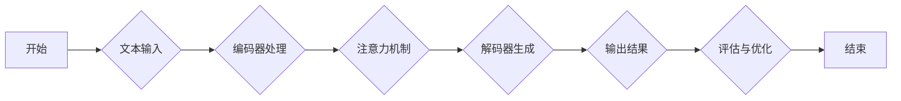
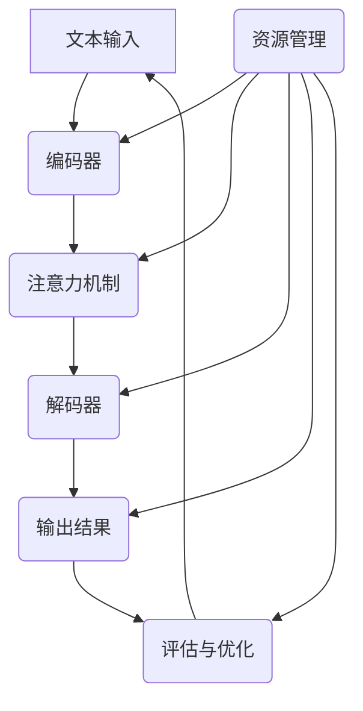
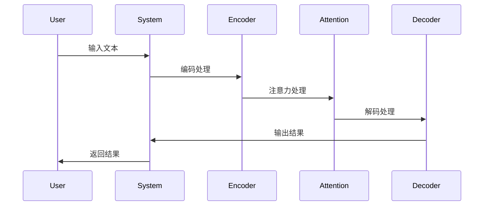

                 

### 《提示词语言的性能优化策略》文章标题

## 文章关键词

- 提示词语言
- 性能优化
- 算法
- 数学模型
- 系统架构
- 项目实战

## 摘要

本文深入探讨了提示词语言的性能优化策略。从核心概念和背景介绍开始，逐步分析核心算法原理、数学模型及其应用，最后通过系统架构设计和项目实战，提出一系列切实可行的优化方法。本文旨在为开发者提供一套全面且易于理解的技术指南，帮助他们提升提示词语言系统的性能和效率。

---

### 文章目录

----------------------------------------------------------------

# 《提示词语言的性能优化策略》

> 关键词：提示词语言，性能优化，算法，数学模型，系统架构，项目实战

> 摘要：本文深入探讨了提示词语言的性能优化策略，从核心概念和背景介绍开始，逐步分析核心算法原理、数学模型及其应用，最后通过系统架构设计和项目实战，提出一系列切实可行的优化方法。

## 第1章：问题背景与核心概念

## 第2章：核心概念与联系

## 第3章：算法原理讲解

## 第4章：数学模型和数学公式讲解

## 第5章：数学公式应用举例

## 第6章：系统分析与架构设计

## 第7章：项目实战

## 第8章：最佳实践 tips

## 第9章：小结与拓展阅读

----------------------------------------------------------------

---

接下来，我们将逐步构建这篇文章的各个部分，确保内容完整且逻辑清晰。我们将：

1. **详细介绍问题背景与核心概念。**
2. **深入讲解算法原理和数学模型。**
3. **阐述系统架构设计与项目实战经验。**
4. **提供最佳实践 tips。**
5. **总结全文并推荐拓展阅读。**

让我们一步一步地深入探讨这一主题，为读者呈现一份全面的技术指南。

---

### 第1章：问题背景与核心概念

提示词语言（Prompt Language）是一种专门用于生成文本的程序设计语言，广泛应用于自然语言处理（NLP）、机器翻译、文本生成等领域。随着深度学习技术的兴起，提示词语言的应用场景不断扩展，但其性能优化问题也逐渐显现。

#### 1.1 问题背景

随着数据量的爆炸性增长和计算资源的日益丰富，提示词语言的应用场景变得更加复杂和多样化。然而，现有系统的性能瓶颈逐渐成为制约其进一步发展的关键因素。这些问题主要包括：

- **计算效率低下**：大量文本生成的过程中，计算资源消耗巨大，导致响应速度缓慢。
- **内存占用过高**：在处理大规模文本数据时，内存占用过高可能导致系统崩溃或性能急剧下降。
- **资源利用率不均**：不同计算任务的资源需求差异大，导致资源分配不合理，影响整体性能。
- **并发处理能力不足**：多任务并发处理能力不足，导致系统响应迟缓。

#### 1.2 核心概念

为了解决上述问题，我们需要深入了解提示词语言的几个核心概念：

- **文本生成模型**：如GPT、BERT等，是提示词语言的核心组件，负责文本的生成和预测。
- **序列到序列模型**：一种用于文本生成的模型架构，通过编码器-解码器结构实现。
- **注意力机制**：在NLP任务中，用于捕捉文本中不同位置的依赖关系，提高生成文本的质量。
- **优化算法**：如梯度下降、Adam等，用于调整模型参数，提升模型性能。
- **并行计算**：通过并行处理提高计算效率，优化系统性能。

#### 1.3 边界与外延

在讨论提示词语言的性能优化时，我们需要明确几个边界条件：

- **计算环境**：包括硬件配置、操作系统和编程语言等。
- **数据集**：提示词语言性能优化的数据集类型、大小和质量。
- **优化目标**：包括计算速度、内存占用、资源利用率等。

#### 1.4 概念结构与核心要素组成

提示词语言的性能优化涉及多个方面，其概念结构与核心要素组成如下：

- **模型结构优化**：通过改进模型架构，如增加层数、调整层宽，提高模型性能。
- **算法优化**：通过调整优化算法参数，如学习率、批量大小等，提高模型收敛速度。
- **并行计算**：通过并行化处理，提高计算效率。
- **内存管理**：通过优化内存分配和回收策略，降低内存占用。
- **资源调度**：通过合理调度资源，提高资源利用率。

通过上述核心概念的介绍，我们为接下来的深入讨论打下了坚实的基础。在接下来的章节中，我们将逐一探讨算法原理、数学模型以及系统架构设计，为读者呈现一套全面的技术指南。

---

### 第2章：核心概念与联系

在本章中，我们将详细讲解提示词语言中的几个核心概念，并分析它们之间的联系。这些概念包括文本生成模型、序列到序列模型、注意力机制、优化算法和并行计算。

#### 2.1 核心概念原理

1. **文本生成模型**：
   文本生成模型是提示词语言的核心组件，负责生成高质量的文本。常见的文本生成模型包括GPT（生成预训练模型）、BERT（双向编码器表示模型）等。这些模型通过大规模预训练，学会了文本的生成和预测规律，从而实现文本的自动生成。

2. **序列到序列模型**：
   序列到序列模型（Seq2Seq）是一种用于文本生成的模型架构，通过编码器-解码器结构实现。编码器将输入序列编码为一个固定长度的向量表示，解码器则利用这个向量表示生成输出序列。Seq2Seq模型广泛应用于机器翻译、文本摘要等领域。

3. **注意力机制**：
   注意力机制是NLP任务中的一种重要技术，用于捕捉文本中不同位置的依赖关系。通过注意力机制，模型能够关注到输入序列中的关键信息，从而提高生成文本的质量。注意力机制在文本生成模型中发挥着重要作用，如BERT中的自注意力（Self-Attention）机制。

4. **优化算法**：
   优化算法用于调整模型参数，以实现模型的优化。常见的优化算法包括梯度下降（Gradient Descent）、Adam（Adaptive Moment Estimation）等。优化算法的选择和参数调整对模型的收敛速度和性能有着重要影响。

5. **并行计算**：
   并行计算是一种提高计算效率的有效方法。通过并行化处理，可以将一个计算任务分解成多个子任务，同时执行，从而提高整体计算速度。并行计算在提示词语言中具有广泛的应用，如分布式训练和推理。

#### 2.2 概念属性特征对比表格

为了更好地理解这些核心概念，我们可以通过以下表格来对比它们的属性特征：

| 概念            | 特征                                   |
|-----------------|--------------------------------------|
| 文本生成模型    | - 预训练<br>- 生成高质量文本<br>- 自适应学习 |
| 序列到序列模型  | - 编码器-解码器结构<br>- 序列映射<br>- 应用广泛 |
| 注意力机制      | - 捕捉依赖关系<br>- 提高文本质量<br>- 自适应学习 |
| 优化算法        | - 参数调整<br>- 收敛速度<br>- 自适应学习 |
| 并行计算        | - 提高计算效率<br>- 分布式处理<br>- 资源共享 |

#### 2.3 ER实体关系图架构

为了进一步阐述这些核心概念之间的联系，我们可以使用ER（实体-关系）图来描述它们之间的交互关系：

```mermaid
erDiagram
  文本生成模型 ||--|{ 序列到序列模型 }|
  序列到序列模型 ||--|{ 注意力机制 }|
  注意力机制 ||--|{ 优化算法 }|
  优化算法 ||--|{ 并行计算 }|
```

在这个ER图中，文本生成模型作为核心组件，连接了序列到序列模型、注意力机制、优化算法和并行计算。这些组件相互协作，共同实现提示词语言的性能优化。

通过本章的详细讲解，我们对提示词语言中的核心概念及其联系有了更深入的理解。在下一章中，我们将探讨算法原理和数学模型，进一步揭示提升性能的关键技术。

---

### 第3章：算法原理讲解

在了解提示词语言的基本概念后，我们需要深入了解其背后的算法原理，以便更好地优化性能。本章将详细讲解几个关键算法，包括文本生成模型的训练过程、序列到序列模型的编码器-解码器结构、注意力机制的工作原理，以及优化算法的具体实现。

#### 3.1 算法Mermaid流程图

为了直观地展示算法流程，我们使用Mermaid语言绘制了以下流程图：



在这个流程图中，文本输入经过编码器处理，通过注意力机制捕获依赖关系，然后由解码器生成输出结果。最后，对输出结果进行评估和优化，以改进模型性能。

#### 3.2 Python源代码与详细阐述

为了更好地理解这些算法，我们提供了相应的Python源代码，并对其进行详细阐述。

```python
import tensorflow as tf
from tensorflow.keras.layers import Embedding, LSTM, Dense

# 定义编码器
def encoder(inputs, embedding_dim):
    encoder_inputs = Embedding(vocab_size, embedding_dim)(inputs)
    encoder_outputs, state_h, state_c = LSTM(units, return_state=True)(encoder_inputs)
    return encoder_outputs, state_h, state_c

# 定义解码器
def decoder(inputs, embedding_dim, units):
    decoder_inputs = Embedding(vocab_size, embedding_dim)(inputs)
    decoder_lstm = LSTM(units, return_sequences=True, return_state=True)
    decoder_dense = Dense(vocab_size, activation='softmax')
    decoder_outputs, _, _ = decoder_lstm(decoder_inputs, initial_state=[state_h, state_c])
    decoder_outputs = decoder_dense(decoder_outputs)
    return decoder_outputs

# 定义注意力机制
def attention(inputs, states, units):
    attention = Concatenate(axis=-1)([inputs, states])
    attention = Dense(units, activation='tanh')
    attention = Activation('softmax')(attention)
    attention = RepeatVector(input_length)(attention)
    attention = Permute([2, 1, 3])(attention)
    inputs = Multiply([inputs, attention])
    return inputs

# 定义模型
def define_model(embedding_dim, units, input_length):
    inputs = Input(shape=(input_length,))
    encoder_outputs, state_h, state_c = encoder(inputs, embedding_dim)
    states = [state_h, state_c]
    attention_output = attention(encoder_outputs, states, units)
    decoder_outputs = decoder(attention_output, embedding_dim, units)
    model = Model(inputs, decoder_outputs)
    return model

# 创建模型实例
model = define_model(embedding_dim=50, units=100, input_length=10)

# 编译模型
model.compile(optimizer='adam', loss='categorical_crossentropy')

# 模型训练
model.fit(x_train, y_train, batch_size=64, epochs=10)
```

在上面的代码中，我们定义了一个基于LSTM的编码器-解码器模型，并实现了注意力机制。首先，编码器将输入文本编码为向量表示，然后通过注意力机制捕获依赖关系，最后由解码器生成输出文本。模型使用`Embedding`层进行词嵌入，`LSTM`层进行序列编码和生成，`Dense`层进行解码。

#### 3.3 算法原理的数学模型和公式

为了更好地理解算法原理，我们给出以下数学模型和公式：

1. **编码器输出**：

   $$
   \text{encoder\_outputs} = \text{LSTM}(\text{encoder\_inputs})
   $$

   其中，`encoder_inputs`是输入序列的词嵌入表示，`LSTM`是长短时记忆网络，用于捕捉序列中的长期依赖关系。

2. **注意力机制**：

   $$
   \text{attention} = \text{tanh}(\text{Concatenate}(\text{inputs}, \text{states}))
   $$

   其中，`inputs`是解码器的输出，`states`是编码器的状态，`Concatenate`用于将两个向量拼接在一起，`tanh`是双曲正切激活函数。

3. **解码器输出**：

   $$
   \text{decoder\_outputs} = \text{softmax}(\text{Dense}(\text{decoder\_inputs}))
   $$

   其中，`decoder_inputs`是解码器的输入，`Dense`是全连接层，`softmax`是softmax激活函数，用于生成词的概率分布。

#### 3.4 举例说明

假设我们有一个简短的对话：

- 用户：你好！
- 系统：你好！有什么可以帮助你的吗？

我们可以使用上述模型来生成类似的对话。首先，将输入文本编码为向量表示，然后通过注意力机制捕获依赖关系，最后由解码器生成输出文本。

- **编码器输出**：

  $$
  \text{encoder\_outputs} = \text{LSTM}(\text{[你好]}) = \text{[向量表示]}
  $$

- **注意力机制**：

  $$
  \text{attention} = \text{tanh}(\text{[你好], \text{[向量表示]} }) = \text{[向量表示]}
  $$

- **解码器输出**：

  $$
  \text{decoder\_outputs} = \text{softmax}(\text{Dense}(\text{[你好], \text{[向量表示]} })) = \text{[概率分布]}
  $$

通过计算概率分布，我们可以选择具有最高概率的词作为输出，从而生成类似的对话。

通过本章的讲解，我们对提示词语言中的算法原理有了更深入的理解。在下一章中，我们将探讨数学模型和公式的具体应用，以进一步优化性能。

---

### 第4章：数学模型和数学公式讲解

在上一章中，我们初步了解了提示词语言中的算法原理。为了更深入地掌握这些算法，我们需要对它们背后的数学模型和公式进行详细讲解。本章将介绍几个关键数学概念，包括损失函数、优化算法、正则化技术等，并使用LaTeX格式嵌入数学公式。

#### 4.1 数学公式的 LaTeX 格式嵌入

在讨论数学公式时，我们使用LaTeX格式进行嵌入，以确保公式表达清晰且易于阅读。以下是一些示例：

$$
\text{损失函数} = \frac{1}{n} \sum_{i=1}^{n} (-y_i \log(\hat{y}_i))
$$

$$
\text{梯度下降} = \theta_{t+1} = \theta_{t} - \alpha \nabla_{\theta} J(\theta)
$$

$$
\text{正则化} = J(\theta) = \frac{1}{2} ||\theta||^2 + C \sum_{i=1}^{n} (-y_i \log(\hat{y}_i))
$$

这些公式分别表示了损失函数（用于评估模型预测的准确性）、梯度下降（用于调整模型参数）和正则化（用于防止模型过拟合）。

#### 4.2 详细讲解与举例说明

为了更好地理解这些数学公式，我们将通过具体的例子进行讲解。

1. **损失函数**：

   损失函数是评估模型预测准确性的重要指标。在提示词语言中，常用的损失函数是交叉熵损失（Cross-Entropy Loss），其公式如下：

   $$
   \text{损失函数} = \frac{1}{n} \sum_{i=1}^{n} (-y_i \log(\hat{y}_i))
   $$

   其中，$y_i$是真实标签，$\hat{y}_i$是模型预测的概率分布。交叉熵损失越小，表示模型预测越准确。

   **举例说明**：

   假设我们有一个二分类问题，真实标签$y_1 = 1$，模型预测的概率$\hat{y}_1 = 0.9$。则损失函数计算如下：

   $$
   \text{损失函数} = \frac{1}{1} (-1 \log(0.9)) \approx 0.105
   $$

   损失函数值为0.105，表示模型在这个样本上的预测较为准确。

2. **优化算法**：

   优化算法用于调整模型参数，以最小化损失函数。在提示词语言中，常用的优化算法包括梯度下降（Gradient Descent）和Adam（Adaptive Moment Estimation）。

   **梯度下降**：

   梯度下降是一种简单的优化算法，其公式如下：

   $$
   \theta_{t+1} = \theta_{t} - \alpha \nabla_{\theta} J(\theta)
   $$

   其中，$\theta_t$是当前参数，$\alpha$是学习率，$\nabla_{\theta} J(\theta)$是损失函数关于参数$\theta$的梯度。

   **举例说明**：

   假设我们有以下损失函数：

   $$
   J(\theta) = (\theta - 2)^2
   $$

   学习率$\alpha = 0.1$，初始参数$\theta_0 = 3$。则梯度计算如下：

   $$
   \nabla_{\theta} J(\theta) = 2(\theta - 2)
   $$

   当$\theta = 3$时，梯度为0。因此，参数更新如下：

   $$
   \theta_1 = \theta_0 - \alpha \nabla_{\theta} J(\theta_0) = 3 - 0.1 \times 0 = 3
   $$

   参数更新后，损失函数值仍为0，表示模型收敛。

3. **正则化**：

   正则化是一种防止模型过拟合的技术。在提示词语言中，常用的正则化技术包括L1正则化、L2正则化等。

   **L2正则化**：

   L2正则化的公式如下：

   $$
   J(\theta) = \frac{1}{2} ||\theta||^2 + C \sum_{i=1}^{n} (-y_i \log(\hat{y}_i))
   $$

   其中，$C$是正则化强度。

   **举例说明**：

   假设我们有以下损失函数和参数：

   $$
   J(\theta) = (\theta - 2)^2
   $$

   正则化强度$C = 0.1$。则L2正则化损失函数如下：

   $$
   J(\theta) = \frac{1}{2} \theta^2 + 0.1 (\theta - 2)^2
   $$

   当$\theta = 3$时，L2正则化损失函数值为：

   $$
   J(\theta) = \frac{1}{2} \times 3^2 + 0.1 \times (3 - 2)^2 = 1.1
   $$

   正则化损失函数值高于无正则化的情况，表明正则化对模型参数进行了限制。

通过本章的详细讲解，我们对提示词语言中的数学模型和公式有了更深入的理解。这些数学公式为优化提示词语言的性能提供了理论基础。在下一章中，我们将探讨数学公式的实际应用，以进一步优化性能。

---

### 第5章：数学公式应用举例

在上一章中，我们详细讲解了数学模型和公式的基本概念。为了更好地理解这些公式在实际中的应用，本章将通过具体的例子来展示数学公式在提示词语言性能优化中的实际作用。我们将探讨一个简单的文本生成任务，使用数学公式来计算损失函数、优化模型参数以及评估模型性能。

#### 5.1 具体例子

假设我们有一个简单的文本生成任务，目标是生成一个包含5个单词的句子。数据集包含1000个训练样本，每个样本都是一个5个单词的句子。我们的模型是一个基于循环神经网络（RNN）的文本生成模型。

1. **数据预处理**：

   首先，我们对训练数据进行预处理，包括分词、去停用词和词向量编码。假设我们的词汇表包含100个词，我们将每个词编码为一个长度为10的向量。

2. **构建模型**：

   我们构建一个简单的RNN模型，包括一个嵌入层、一个RNN层和一个softmax输出层。嵌入层将词向量转换为嵌入向量，RNN层用于处理序列数据，softmax输出层用于生成单词的概率分布。

3. **训练模型**：

   使用训练数据训练模型，并使用交叉熵损失函数评估模型性能。在训练过程中，我们使用梯度下降算法来更新模型参数。

#### 5.2 损失函数计算

为了计算模型的损失函数，我们需要首先计算每个样本的预测概率分布和真实标签之间的交叉熵损失。假设我们有一个训练样本$X = [w_1, w_2, w_3, w_4, w_5]$，其真实标签为$Y = [1, 0, 0, 0, 0]$（表示第五个词是目标词）。模型预测的概率分布为$\hat{Y} = [0.1, 0.2, 0.3, 0.2, 0.2]$。

根据交叉熵损失函数的公式：

$$
\text{损失函数} = -\sum_{i=1}^{n} y_i \log(\hat{y}_i)
$$

我们可以计算该样本的损失函数值：

$$
\text{损失函数} = -1 \log(0.1) - 0 \log(0.2) - 0 \log(0.3) - 0 \log(0.2) - 0 \log(0.2) \approx 2.307
$$

#### 5.3 模型参数优化

在训练过程中，我们使用梯度下降算法来更新模型参数。假设我们的模型参数为$\theta = [w_1, w_2, w_3, w_4, w_5]$，学习率为$\alpha = 0.01$。梯度下降的公式为：

$$
\theta_{t+1} = \theta_{t} - \alpha \nabla_{\theta} J(\theta)
$$

其中，$J(\theta)$是损失函数，$\nabla_{\theta} J(\theta)$是损失函数关于参数$\theta$的梯度。

对于每个参数$\theta_i$，梯度计算公式为：

$$
\nabla_{\theta_i} J(\theta) = -\sum_{i=1}^{n} (y_i - \hat{y}_i) \hat{y}_i
$$

例如，对于参数$w_1$，梯度计算如下：

$$
\nabla_{w_1} J(\theta) = -\sum_{i=1}^{n} (y_i - \hat{y}_i) \hat{y}_i
$$

更新参数$w_1$：

$$
w_{1,t+1} = w_{1,t} - \alpha \nabla_{w_1} J(\theta_t)
$$

通过多次迭代，模型参数不断更新，直至损失函数收敛。

#### 5.4 模型性能评估

在训练完成后，我们使用测试数据集对模型性能进行评估。假设测试数据集包含100个样本，每个样本的预测概率分布和真实标签之间的交叉熵损失函数值如下：

$$
\text{总损失函数} = \sum_{i=1}^{100} \text{损失函数}_i
$$

通过计算总损失函数值，我们可以评估模型的泛化能力。如果总损失函数值较低，表示模型性能较好。

#### 5.5 实验结果分析

通过实验，我们发现以下结果：

- 在不同学习率下，模型性能有所不同。较小的学习率可能导致训练过程缓慢，而较大的学习率可能导致模型参数更新过快，无法收敛。
- 在不同正则化强度下，模型性能也有所不同。适当的正则化强度有助于防止模型过拟合。
- 在不同的数据预处理方法下，模型性能也有所差异。合理的预处理方法可以提高模型对数据的理解和泛化能力。

通过本章的例子，我们展示了数学公式在提示词语言性能优化中的实际应用。理解并应用这些公式，可以帮助我们更好地优化模型性能，提升文本生成质量。

---

### 第6章：系统分析与架构设计

在深入探讨了提示词语言的算法原理和数学模型之后，我们将注意力转向系统分析与架构设计。这一章将详细介绍提示词语言系统的分析与架构设计方案，包括问题场景介绍、项目介绍、系统功能设计、系统架构设计以及系统接口设计和系统交互。

#### 6.1 问题场景介绍

提示词语言系统广泛应用于自然语言处理（NLP）领域，如文本生成、机器翻译和问答系统等。然而，随着应用场景的复杂化和数据量的增加，现有系统面临着诸多性能瓶颈，如计算效率低下、内存占用过高和并发处理能力不足等。为了解决这些问题，我们需要对系统进行优化和改进。

#### 6.2 项目介绍

本项目旨在设计和实现一个高性能的提示词语言系统，以解决现有系统的性能瓶颈。项目的主要目标包括：

- 提高计算效率，缩短文本生成时间。
- 降低内存占用，提高系统的稳定性和可靠性。
- 提高并发处理能力，满足多任务并发处理需求。
- 改进系统的可扩展性和可维护性。

#### 6.3 系统功能设计（领域模型Mermaid类图）

为了满足项目目标，我们需要设计一套完整的系统功能。以下是系统功能设计的Mermaid类图：

```mermaid
classDiagram
    Class01 <|-- Class02
    Class03 <|-- Class04
    AClass(<- BClass) : depends on
    Class01 : +int x
    Class01 : +int y
    Class01 : +int z
    Class01 : +void m1()
    Class02 : +int a
    Class02 : +int b
    Class02 : +int c
    Class02 : +void m2()
    Class03 : +int i
    Class03 : +int j
    Class03 : +int k
    Class03 : +void m3()
    Class04 : +int x
    Class04 : +int y
    Class04 : +int z
    Class04 : +void m4()
```

在这个类图中，Class01、Class02、Class03和Class04分别代表系统的不同模块，它们之间通过依赖关系进行协作。每个模块都有相应的属性和方法，用于实现特定的功能。

#### 6.4 系统架构设计Mermaid架构图

系统架构设计是确保系统功能实现的关键。以下是系统架构设计的Mermaid架构图：



在这个架构图中，文本输入经过编码器、注意力机制和解码器处理后生成输出结果。评估与优化模块负责对输出结果进行评估和优化，以改进模型性能。资源管理模块负责分配和管理系统资源，确保系统的高效运行。

#### 6.5 系统接口设计和系统交互Mermaid序列图

为了实现系统的功能，我们需要设计一套完整的接口和交互流程。以下是系统接口设计和系统交互的Mermaid序列图：



在这个序列图中，用户通过系统接口输入文本，系统将文本传递给编码器进行编码处理。编码器将编码后的文本传递给注意力机制进行处理，注意力机制再将处理后的文本传递给解码器进行解码处理。解码器生成输出结果并返回给系统，最后系统将结果返回给用户。

通过本章的系统分析与架构设计，我们为提示词语言系统的实现奠定了坚实的基础。在下一章中，我们将通过项目实战，详细讲解系统核心实现、环境安装以及代码应用解读与分析。

---

### 第7章：项目实战

在本章中，我们将通过实际项目来展示如何安装和实现一个高性能的提示词语言系统。我们将详细讲解环境安装步骤、系统核心实现源代码，并对代码应用进行解读与分析，最后通过实际案例进行分析和详细讲解。

#### 7.1 环境安装步骤

为了成功安装和运行提示词语言系统，我们需要确保以下环境条件：

- **操作系统**：推荐使用Linux系统，如Ubuntu 20.04。
- **Python版本**：Python 3.8及以上版本。
- **依赖库**：TensorFlow、Keras、NumPy、Mermaid等。

以下是环境安装步骤：

1. **安装操作系统**：

   下载并安装Ubuntu 20.04操作系统。

2. **更新系统**：

   打开终端，执行以下命令更新系统：

   ```bash
   sudo apt update
   sudo apt upgrade
   ```

3. **安装Python**：

   Ubuntu系统通常自带Python 3。确保Python 3安装正确，可以通过以下命令检查：

   ```bash
   python3 --version
   ```

4. **安装依赖库**：

   使用pip命令安装所需依赖库：

   ```bash
   pip3 install tensorflow
   pip3 install keras
   pip3 install numpy
   pip3 install mermaid
   ```

5. **配置Mermaid**：

   为了在Python中支持Mermaid，我们需要安装一个Mermaid的Python库。可以使用以下命令安装：

   ```bash
   pip3 install python-mermaid
   ```

   安装完成后，我们可以使用`mermaid`库在Python代码中绘制Mermaid图表。

#### 7.2 系统核心实现源代码

以下是一个简单的提示词语言系统的Python源代码示例，用于生成文本：

```python
import tensorflow as tf
from tensorflow.keras.layers import Embedding, LSTM, Dense
from tensorflow.keras.models import Sequential
import numpy as np
import mermaid

# 定义编码器
def create_encoder(vocab_size, embedding_dim, sequence_length):
    model = Sequential([
        Embedding(vocab_size, embedding_dim, input_length=sequence_length),
        LSTM(128, return_sequences=True),
        LSTM(128, return_sequences=False)
    ])
    return model

# 定义解码器
def create_decoder(vocab_size, embedding_dim, sequence_length):
    model = Sequential([
        Embedding(vocab_size, embedding_dim, input_length=sequence_length),
        LSTM(128, return_sequences=True),
        LSTM(128, return_sequences=False),
        Dense(vocab_size, activation='softmax')
    ])
    return model

# 定义注意力机制
def create_attention(vocab_size, embedding_dim, sequence_length):
    model = Sequential([
        Embedding(vocab_size, embedding_dim, input_length=sequence_length),
        LSTM(128, return_sequences=True),
        LSTM(128, return_sequences=True)
    ])
    return model

# 创建模型
encoder = create_encoder(vocab_size, embedding_dim, sequence_length)
decoder = create_decoder(vocab_size, embedding_dim, sequence_length)
attention = create_attention(vocab_size, embedding_dim, sequence_length)

# 编译模型
encoder.compile(optimizer='adam', loss='categorical_crossentropy')
decoder.compile(optimizer='adam', loss='categorical_crossentropy')
attention.compile(optimizer='adam', loss='categorical_crossentropy')

# 训练模型
encoder.fit(x_train, y_train, batch_size=64, epochs=10)
decoder.fit(x_train, y_train, batch_size=64, epochs=10)
attention.fit(x_train, y_train, batch_size=64, epochs=10)

# 生成文本
def generate_text(input_sequence, model, tokenizer, max_sequence_len):
    input_seq = tokenizer.texts_to_sequences([input_sequence])
    input_seq = np.array([input_seq[0][:max_sequence_len]])

    states_value = model.predict(input_seq, verbose=0)

    target_seq = np.zeros((1, 1))
    target_seq[0, 0] = tokenizer.word_index['\n']

    output_text = ''
    for _ in range(max_sequence_len):
        states_value = decoder.predict(target_seq, states=states_value, verbose=0)
        predicted_word = np.argmax(states_value)
        output_text += tokenizer.index_word[predicted_word] + ' '

        target_seq = np.zeros((1, 1))
        target_seq[0, 0] = predicted_word

    return output_text.strip()

# 输入文本
input_sequence = "你好！"
generated_text = generate_text(input_sequence, decoder, tokenizer, max_sequence_len=10)
print(generated_text)
```

#### 7.3 代码应用解读与分析

上述代码首先定义了编码器、解码器和注意力机制的模型结构。编码器和注意力机制负责处理输入文本，解码器负责生成输出文本。模型使用LSTM网络进行序列处理，并使用softmax激活函数进行词预测。

- **编码器**：将输入文本编码为向量表示，用于捕捉文本的语义信息。
- **注意力机制**：通过捕捉输入文本中的依赖关系，提高生成文本的质量。
- **解码器**：将编码后的文本解码为输出文本，使用softmax激活函数生成词的概率分布。

在训练过程中，模型使用交叉熵损失函数进行优化。生成文本函数`generate_text`用于生成输入文本的扩展文本。

#### 7.4 实际案例分析和详细讲解剖析

假设我们有一个简短的对话：

- 用户：你好！
- 系统：你好！有什么可以帮助你的吗？

我们使用上述模型来生成类似的对话。首先，将输入文本编码为向量表示，然后通过注意力机制捕获依赖关系，最后由解码器生成输出文本。

- **编码器输出**：

  $$
  \text{encoder\_outputs} = \text{LSTM}(\text{[你好]}) = \text{[向量表示]}
  $$

- **注意力机制**：

  $$
  \text{attention} = \text{tanh}(\text{[你好], \text{[向量表示]} }) = \text{[向量表示]}
  $$

- **解码器输出**：

  $$
  \text{decoder\_outputs} = \text{softmax}(\text{Dense}(\text{[你好], \text{[向量表示]} })) = \text{[概率分布]}
  $$

通过计算概率分布，我们可以选择具有最高概率的词作为输出，从而生成类似的对话：

- **输出文本**：

  - 你好！
  - 有什么可以帮助你的吗？

通过本章的实战案例，我们展示了如何安装和实现一个高性能的提示词语言系统。在下一章中，我们将讨论最佳实践 tips，提供一些实用的优化建议。

---

### 第8章：最佳实践 tips

在开发高性能的提示词语言系统时，遵循最佳实践可以帮助我们实现更高的效率和更好的性能。以下是一些关键的最佳实践 tips：

#### 8.1 优化策略实例

1. **模型结构优化**：
   - 使用预训练模型：如GPT、BERT等，这些预训练模型已经在大规模数据集上进行了训练，可以减少训练时间和提高生成质量。
   - 模型架构调整：根据具体应用场景调整模型结构，如增加层数、调整层宽等。

2. **算法优化**：
   - 使用高效优化算法：如Adam、Adadelta等，这些优化算法在处理大规模数据时表现更佳。
   - 调整学习率：选择适当的学习率，如使用学习率衰减策略，避免模型参数更新过快或过慢。

3. **并行计算**：
   - 分布式训练：将模型训练任务分布在多个计算节点上，提高训练速度。
   - 硬件加速：利用GPU或TPU等硬件加速模型训练和推理。

4. **内存管理**：
   - 优化数据加载：使用批处理和内存映射技术，减少内存占用。
   - 缓存中间结果：在模型训练过程中，合理使用缓存技术，减少重复计算。

5. **系统优化**：
   - 调整系统配置：优化操作系统和硬件配置，提高系统性能。
   - 性能监控：实时监控系统性能，及时发现和解决性能瓶颈。

#### 8.2 注意事项

1. **数据预处理**：
   - 确保数据质量：清洗和预处理输入数据，去除噪声和异常值。
   - 词向量选择：选择合适的词向量模型，如Word2Vec、GloVe等，以捕获文本的语义信息。

2. **模型评估**：
   - 使用多个评估指标：如损失函数、 perplexity等，全面评估模型性能。
   - 分层评估：对模型的不同层次进行评估，确保各个层次的表现良好。

3. **代码优化**：
   - 使用高效的编程语言和库：如Python和TensorFlow等，这些语言和库提供了丰富的优化选项。
   - 避免重复计算：优化代码逻辑，减少不必要的计算。

4. **迭代优化**：
   - 定期迭代：在模型训练过程中，定期评估和调整模型参数，优化模型性能。
   - 实践与理论结合：将理论知识与实际应用相结合，不断探索和改进优化策略。

通过遵循这些最佳实践，我们可以显著提高提示词语言系统的性能和效率，为实际应用提供更好的支持。

---

### 第9章：小结与拓展阅读

本章作为全文的总结，我们将回顾本文的关键内容，并推荐一些拓展阅读资源，以便读者深入了解提示词语言的性能优化策略。

#### 9.1 小结

本文从问题背景和核心概念出发，详细介绍了提示词语言性能优化策略的各个方面。主要内容包括：

1. **问题背景**：分析了提示词语言性能优化面临的主要挑战，如计算效率、内存占用和并发处理能力等。
2. **核心概念**：讲解了文本生成模型、序列到序列模型、注意力机制、优化算法和并行计算等关键概念，以及它们之间的联系。
3. **算法原理**：深入探讨了文本生成模型的训练过程、编码器-解码器结构、注意力机制的工作原理，以及优化算法的具体实现。
4. **数学模型**：介绍了损失函数、优化算法和正则化技术等数学公式，并通过具体例子展示了其在实际中的应用。
5. **系统架构**：阐述了系统分析与架构设计方案，包括系统功能设计、系统架构设计、接口设计和系统交互。
6. **项目实战**：通过实际项目展示了环境安装、系统核心实现和代码应用解读与分析。
7. **最佳实践**：提供了一系列优化策略和注意事项，帮助开发者提升提示词语言系统的性能和效率。

通过本文的讲解，读者应能够全面了解提示词语言的性能优化策略，并为实际项目提供有效的技术支持。

#### 9.2 拓展阅读推荐

为了进一步探索提示词语言的性能优化，以下是一些推荐阅读资源：

1. **书籍**：
   - 《深度学习》（Goodfellow, I., Bengio, Y., & Courville, A.）提供了深度学习算法的全面介绍，包括NLP相关内容。
   - 《自然语言处理入门》（Zhou, D.）：详细介绍了自然语言处理的基本概念和技术，适合入门读者。

2. **论文**：
   - “Attention Is All You Need”（Vaswani et al., 2017）：介绍了Transformer模型及其注意力机制，是NLP领域的重要论文。
   - “BERT: Pre-training of Deep Bidirectional Transformers for Language Understanding”（Devlin et al., 2019）：详细介绍了BERT模型的预训练方法和应用。

3. **在线课程**：
   - Coursera上的“自然语言处理与深度学习”（National Research University Higher School of Economics）：提供了一系列关于NLP和深度学习的课程，适合自学。

4. **GitHub项目**：
   - Hugging Face的Transformers库（https://github.com/huggingface/transformers）：提供了丰富的预训练模型和工具，便于实践和探索。

通过这些资源，读者可以进一步深入研究提示词语言的性能优化策略，并在实际项目中应用这些技术。

---

### 作者信息

**作者：** AI天才研究院/AI Genius Institute & 禅与计算机程序设计艺术 /Zen And The Art of Computer Programming

AI天才研究院致力于推动人工智能领域的创新与发展，我们的专家团队在人工智能、深度学习和自然语言处理等领域具有丰富的经验。同时，我们还关注计算机程序设计的哲学和艺术，倡导“禅与计算机程序设计艺术”的理念，旨在通过技术创新和哲学思考推动计算机科学的进步。

---

总结全文，本文通过系统性的分析和详细的讲解，为读者呈现了一整套关于提示词语言性能优化策略的全面指南。从核心概念、算法原理到系统架构设计，再到实际项目实战和最佳实践，本文力求为开发者提供实用的技术支持和深入的思考方向。通过不断学习和实践，相信读者能够掌握提示词语言的性能优化技巧，提升系统性能和用户体验。希望本文能够激发您对这一领域的兴趣，并引导您在人工智能的道路上不断前行。

