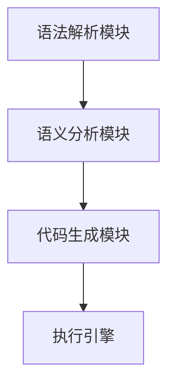
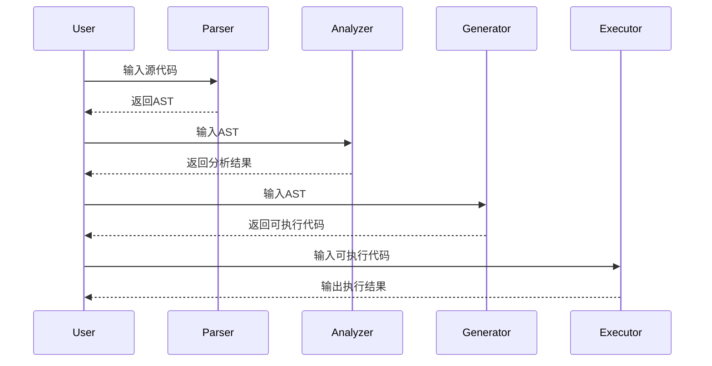

                 

## 引言

提示词语言（Prompt Language）是一种用于计算机程序设计和人工智能领域的特定语言，它能够提高代码的可读性、维护性和扩展性。在现代软件开发中，提示词语言的应用越来越广泛，但随之而来的问题是，如何设计一种既灵活又易于复用的提示词语言模块，成为了一个亟待解决的问题。

### 1.1 模块化设计与复用性的重要性

模块化设计（Module-Based Design）是一种将系统划分为若干功能独立的模块，并通过模块间的接口实现系统功能的设计方法。这种设计方法具有以下优势：

- **提高代码的可维护性**：模块化设计使得代码结构更加清晰，便于开发和维护。
- **提升开发效率**：通过复用已有模块，可以减少重复编写代码的工作量，提高开发效率。
- **增强系统的扩展性**：模块化设计使得系统的扩展和升级更加方便，降低了系统复杂度。

复用性（Reusability）是指将已开发的模块在不同场景和项目中重复使用的能力。复用性的实现不仅可以减少开发工作量，还可以提高软件质量和开发效率。在提示词语言的设计中，模块化与复用性至关重要，因为它们直接影响到代码的可读性、可维护性和可扩展性。

### 1.2 提示词语言的现状与问题

当前，提示词语言的发展较为迅速，但同时也存在着一些问题：

- **模块化程度不足**：许多提示词语言模块的独立性不强，导致模块之间的依赖关系复杂，难以复用。
- **复用性不高**：由于模块之间的接口不统一，导致模块难以在不同项目中复用。
- **可扩展性较差**：提示词语言模块往往缺乏灵活的扩展机制，使得系统在面对新需求时难以快速响应。

### 1.3 本书结构安排

本书旨在探讨提示词语言的模块化设计与复用性，共分为六个部分：

1. **模块化设计与复用性概述**：介绍模块化设计与复用性的基本概念和重要性。
2. **模块化设计原理**：详细阐述模块化设计的方法和原则，以及提示词模块的组成与特性。
3. **复用性原理与实现**：分析复用性的基本概念和实现方式，探讨提示词模块的复用性策略。
4. **模块化设计在提示词语言中的应用**：展示模块化设计在提示词语言中的具体应用。
5. **挑战与解决方案**：讨论模块化设计过程中遇到的问题，并提出相应的解决方案。
6. **高级话题与未来方向**：探讨模块化设计与复用性的高级话题，以及未来的发展趋势。

### 1.4 本章小结

本章介绍了模块化设计与复用性的基本概念和重要性，分析了提示词语言当前存在的问题，并概述了本书的结构安排。在接下来的章节中，我们将深入探讨模块化设计与复用性的原理、方法与应用，以期为提示词语言的发展提供新的思路和方法。

---

关键词：模块化设计，复用性，提示词语言，可维护性，可扩展性，独立模块

摘要：本文旨在探讨提示词语言的模块化设计与复用性，介绍模块化设计与复用性的基本概念和重要性，分析当前提示词语言存在的问题，并阐述本书的结构安排。通过对模块化设计原理、复用性原理与实现、模块化设计在提示词语言中的应用等内容的详细讨论，本文希望能够为提示词语言的发展提供有益的参考和启示。

---

## 第一部分：模块化设计与复用性概述

### 模块化设计原理

模块化设计是一种将复杂系统划分为若干功能独立的模块，并通过模块间的接口实现系统功能的设计方法。模块化设计具有以下核心概念和原则：

#### 核心概念

- **模块（Module）**：功能相对独立、能够完成特定任务的单元。
- **接口（Interface）**：模块之间进行通信的约定和规范。
- **封装（Encapsulation）**：隐藏模块的实现细节，仅通过接口对外提供服务。

#### 原则

1. **高内聚、低耦合**：模块内部功能紧密相关，模块之间依赖关系尽量简化。
2. **单一职责**：每个模块负责单一功能，避免模块功能过于复杂。
3. **可复用性**：模块具有通用性，可以在不同项目和场景中复用。

### 复用性原理与实现

复用性是指将已开发的模块在不同场景和项目中重复使用的能力。复用性的实现方式包括：

- **模块化接口**：定义统一的接口规范，确保模块的兼容性和可复用性。
- **代码重构**：将重复的代码抽象成通用模块，减少冗余代码。
- **组件化**：将系统划分为独立的组件，通过组件间的组合实现系统功能。

### 提示词模块的组成与特性

提示词模块是模块化设计在提示词语言中的应用，其主要组成和特性如下：

- **组成要素**：包括提示词、参数、返回值和功能描述。
- **特性分析**：具备高内聚、低耦合的特性，具有明确的输入和输出接口。

### 模块化设计在提示词语言中的应用

模块化设计在提示词语言中的应用主要体现在以下方面：

- **模块划分**：将提示词语言划分为功能独立的子模块，如语法解析、语义分析、代码生成等。
- **模块组织**：通过模块间的接口实现子模块之间的通信和协作。
- **模块复用**：在多个项目中复用相同的提示词模块，提高开发效率。

### 实践案例

以一个简单的编程语言设计为例，说明模块化设计在提示词语言中的应用：

- **模块划分**：将编程语言划分为语法解析模块、语义分析模块和代码生成模块。
- **模块接口**：定义统一的接口规范，如输入文本、输出语法树、输出代码等。
- **模块复用**：在多个项目中复用语法解析模块，提高开发效率。

### 本章小结

本章介绍了模块化设计与复用性的基本概念和重要性，详细阐述了模块化设计的原则和复用性的实现方式。通过分析提示词模块的组成与特性，以及模块化设计在提示词语言中的应用，本章为后续章节的深入探讨奠定了基础。

---

## 第二部分：模块化设计与复用性基础

### 模块化设计原理

模块化设计是一种将复杂系统划分为若干功能独立的模块，并通过模块间的接口实现系统功能的设计方法。模块化设计具有以下核心概念和原则：

#### 核心概念

- **模块（Module）**：功能相对独立、能够完成特定任务的单元。
- **接口（Interface）**：模块之间进行通信的约定和规范。
- **封装（Encapsulation）**：隐藏模块的实现细节，仅通过接口对外提供服务。

#### 原则

1. **高内聚、低耦合**：模块内部功能紧密相关，模块之间依赖关系尽量简化。
2. **单一职责**：每个模块负责单一功能，避免模块功能过于复杂。
3. **可复用性**：模块具有通用性，可以在不同项目和场景中复用。

#### 模块化设计的基本步骤

1. **需求分析**：明确系统的功能需求和性能指标。
2. **模块划分**：将系统划分为若干功能独立的模块。
3. **接口设计**：定义模块间的接口规范，确保模块的兼容性和可复用性。
4. **模块实现**：开发各个模块，实现模块的功能。
5. **系统集成**：将模块组装成完整的系统，并进行测试和调试。

### 提示词模块的组成与特性

提示词模块是模块化设计在提示词语言中的应用，其主要组成和特性如下：

- **组成要素**：

  - 提示词（Prompt）：用于引导程序执行特定任务的文字描述。
  - 参数（Parameter）：提示词所需的输入信息。
  - 返回值（Return Value）：提示词执行后的输出结果。
  - 功能描述（Function Description）：提示词所实现的功能说明。

- **特性分析**：

  - **高内聚**：提示词模块内部功能紧密相关，如语法解析、语义分析等。
  - **低耦合**：提示词模块之间依赖关系简单，如输入和输出接口。
  - **可复用性**：提示词模块具有通用性，可以在不同项目中复用。

#### 提示词模块的组成要素分析

| 要素       | 描述                                                         | 作用                 |
| ---------- | ------------------------------------------------------------ | -------------------- |
| 提示词     | 引导程序执行特定任务的文字描述                               | 规定程序执行方向     |
| 参数       | 提示词所需的输入信息                                       | 提供程序执行所需数据 |
| 返回值     | 提示词执行后的输出结果                                     | 提供程序执行结果     |
| 功能描述   | 提示词所实现的功能说明                                     | 规定提示词的功能范围 |

#### 提示词模块的特性对比表格

| 特性       | 说明                                                         | 对比             |
| ---------- | ------------------------------------------------------------ | ---------------- |
| 高内聚     | 模块内部功能紧密相关，有利于代码维护和模块复用                 | 提高代码质量     |
| 低耦合     | 模块之间依赖关系简单，有利于模块间的协作和模块复用             | 提高系统扩展性   |
| 可复用性   | 模块具有通用性，可以在不同项目和场景中复用                   | 提高开发效率     |

#### 提示词模块之间的联系

提示词模块之间的联系主要通过接口实现，接口定义了模块间的通信规范。以下是一个简单的提示词模块接口ER实体关系图：

```mermaid
erDiagram
  A{提示词模块} &&|{接口} B{接口定义} &&|{实现} C{模块实现}
  A|--|{输入} B
  B|--|{输出} C
```

### 模块化设计在提示词语言中的应用

模块化设计在提示词语言中的应用主要体现在以下几个方面：

- **模块划分**：将提示词语言划分为功能独立的子模块，如语法解析、语义分析、代码生成等。
- **模块组织**：通过模块间的接口实现子模块之间的通信和协作。
- **模块复用**：在多个项目中复用相同的提示词模块，提高开发效率。

#### 模块划分示例

以一个简单的编程语言设计为例，说明模块化设计在提示词语言中的应用：

- **模块划分**：

  - 语法解析模块：负责将源代码转换为抽象语法树（AST）。
  - 语义分析模块：负责对AST进行语义分析，如类型检查、作用域分析等。
  - 代码生成模块：负责将AST转换为可执行代码。

- **模块接口**：

  - 语法解析模块接口：输入源代码，输出AST。
  - 语义分析模块接口：输入AST，输出分析结果。
  - 代码生成模块接口：输入AST，输出可执行代码。

#### 模块组织与复用示例

以一个简单的计算器程序为例，说明模块化设计在提示词语言中的应用：

- **模块组织**：

  - 计算器界面模块：负责用户交互和显示计算结果。
  - 计算逻辑模块：负责实现各种计算功能，如加、减、乘、除等。
  - 数据存储模块：负责存储计算结果和历史记录。

- **模块复用**：

  - 在其他计算器程序中可以复用计算逻辑模块和数据存储模块，提高开发效率。

### 实践案例

以下是一个简单的Python编程语言设计示例，说明模块化设计在提示词语言中的应用：

```python
# 语法解析模块
def parse(source_code):
    # 将源代码转换为抽象语法树（AST）
    pass

# 语义分析模块
def analyze(ast):
    # 对AST进行语义分析，如类型检查、作用域分析等
    pass

# 代码生成模块
def generate_code(ast):
    # 将AST转换为可执行代码
    pass

# 主程序
if __name__ == "__main__":
    source_code = input("请输入源代码：")
    ast = parse(source_code)
    analyze(ast)
    generate_code(ast)
    print("程序执行完成！")
```

### 本章小结

本章详细阐述了模块化设计的基本概念、原则和步骤，分析了提示词模块的组成与特性，并探讨了模块化设计在提示词语言中的应用。通过本章的学习，读者可以更好地理解模块化设计的重要性，掌握模块化设计的原理和方法，为后续章节的深入探讨打下基础。

---

## 第三部分：复用性原理与实现

### 复用性的基本概念

复用性（Reusability）是指将已开发的模块在不同场景和项目中重复使用的能力。在软件开发过程中，复用性的实现对于提高开发效率、降低成本、提升软件质量具有重要意义。复用性的核心在于模块的通用性和灵活性，即模块在不同环境中能够被有效地重用。

### 复用性的重要性

1. **提高开发效率**：通过复用已有的模块，可以减少重复编写代码的工作量，缩短项目开发周期。
2. **降低成本**：复用模块可以降低开发成本，避免重复投入资源。
3. **提升软件质量**：复用成熟的模块，可以保证代码的质量和稳定性。
4. **增强系统的可维护性**：复用模块使得系统结构更加清晰，便于维护和更新。

### 复用性的实现方式

1. **模块化接口**：定义统一的接口规范，确保模块的兼容性和可复用性。接口设计应尽量简单、明确，减少模块之间的耦合。
2. **代码重构**：将重复的代码抽象成通用模块，减少冗余代码，提高代码复用率。
3. **组件化**：将系统划分为独立的组件，通过组件间的组合实现系统功能。组件化可以提高系统的灵活性和扩展性，便于模块复用。
4. **设计模式**：运用设计模式，如工厂模式、单例模式等，实现模块的灵活复用。设计模式有助于提高代码的可读性和可维护性。

### 提示词模块的复用性分析

提示词模块在提示词语言中的应用具有显著的复用性优势。以下是对提示词模块复用性的分析：

1. **通用性**：提示词模块通常具备通用性，可以应用于不同的编程语言和场景。
2. **灵活性**：提示词模块可以灵活地组合和扩展，以适应不同的开发需求。
3. **可维护性**：提示词模块的复用性使得代码维护更加便捷，降低了维护成本。

### 提示词模块复用的优势

1. **提高开发效率**：通过复用已有的提示词模块，可以减少重复编写代码的工作量，缩短项目开发周期。
2. **降低成本**：复用提示词模块可以降低开发成本，避免重复投入资源。
3. **提升软件质量**：复用成熟的提示词模块，可以保证代码的质量和稳定性。
4. **增强系统的可维护性**：提示词模块的复用性使得系统结构更加清晰，便于维护和更新。

### 提示词模块复用的挑战

1. **模块兼容性**：不同项目之间的提示词模块可能存在兼容性问题，如数据格式、接口规范等。
2. **模块一致性**：提示词模块在不同项目中的复用可能导致一致性问题的产生，如功能实现、性能要求等。
3. **模块扩展性**：提示词模块的复用性可能受到其扩展性的限制，如无法适应新的需求或场景。

### 提示词模块复用的策略

1. **标准化接口**：定义统一的接口规范，确保模块的兼容性和可复用性。
2. **模块抽象**：将通用的功能抽象成独立的模块，提高模块的通用性和复用性。
3. **组件化设计**：将系统划分为独立的组件，通过组件间的组合实现系统功能，提高模块的复用性。
4. **设计模式应用**：运用设计模式，如工厂模式、单例模式等，实现模块的灵活复用。
5. **持续集成**：建立持续集成和持续部署（CI/CD）流程，确保模块的质量和稳定性。

### 复用性在提示词语言中的应用

1. **提示词库构建**：构建统一的提示词库，将常用提示词模块进行分类和整理，便于开发者快速查找和复用。
2. **提示词模块调用与组合**：通过定义统一的接口和规范，实现提示词模块的调用和组合，提高系统的灵活性和扩展性。
3. **模块化扩展**：在提示词语言的基础上，通过模块化的扩展机制，实现新功能的快速添加和复用。

### 实践案例

以下是一个简单的Python编程语言设计示例，说明复用性在提示词语言中的应用：

```python
# 提示词库
prompt_library = {
    "print": {
        "description": "输出指定内容",
        "interface": "print(content)",
    },
    "if": {
        "description": "条件判断",
        "interface": "if(condition): block",
    },
    "while": {
        "description": "循环执行",
        "interface": "while(condition): block",
    },
}

# 提示词模块调用与组合
def execute_prompt(prompt_name, *args, **kwargs):
    if prompt_name in prompt_library:
        prompt = prompt_library[prompt_name]
        code = prompt["interface"]
        for arg in args:
            code = code.replace("content", str(arg))
        for key, value in kwargs.items():
            code = code.replace(key, str(value))
        return code
    else:
        raise ValueError(f"未找到提示词：{prompt_name}")

# 示例
print_code = execute_prompt("print", "Hello, World!")
if_code = execute_prompt("if", "condition": "True", "block": "print('条件为真')")
while_code = execute_prompt("while", "condition": "True", "block": "print('循环执行')")

print(print_code)
print(if_code)
print(while_code)
```

### 本章小结

本章详细阐述了复用性的基本概念和重要性，分析了提示词模块的复用性优势、挑战和策略。通过实践案例，展示了复用性在提示词语言中的应用。通过本章的学习，读者可以更好地理解复用性的原理和方法，掌握提示词模块的复用技巧，提高开发效率和软件质量。

---

## 第四部分：模块化设计在提示词语言中的应用

### 模块化设计的核心

模块化设计是一种将复杂系统划分为若干功能独立的模块，并通过模块间的接口实现系统功能的设计方法。模块化设计具有以下核心：

- **高内聚、低耦合**：模块内部功能紧密相关，模块之间依赖关系尽量简化。
- **单一职责**：每个模块负责单一功能，避免模块功能过于复杂。
- **可复用性**：模块具有通用性，可以在不同项目和场景中复用。

### 模块化设计在提示词语言中的应用

模块化设计在提示词语言中的应用主要体现在以下几个方面：

- **模块划分**：将提示词语言划分为功能独立的子模块，如语法解析、语义分析、代码生成等。
- **模块组织**：通过模块间的接口实现子模块之间的通信和协作。
- **模块复用**：在多个项目中复用相同的提示词模块，提高开发效率。

### 提示词语言的模块化结构

提示词语言的模块化结构主要包括以下子模块：

1. **语法解析模块**：负责将源代码转换为抽象语法树（AST）。
2. **语义分析模块**：负责对AST进行语义分析，如类型检查、作用域分析等。
3. **代码生成模块**：负责将AST转换为可执行代码。

#### 模块划分示例

以下是一个简单的编程语言设计示例，说明模块化设计在提示词语言中的应用：

```python
# 语法解析模块
def parse(source_code):
    # 将源代码转换为抽象语法树（AST）
    pass

# 语义分析模块
def analyze(ast):
    # 对AST进行语义分析，如类型检查、作用域分析等
    pass

# 代码生成模块
def generate_code(ast):
    # 将AST转换为可执行代码
    pass

# 主程序
if __name__ == "__main__":
    source_code = input("请输入源代码：")
    ast = parse(source_code)
    analyze(ast)
    generate_code(ast)
    print("程序执行完成！")
```

### 模块间的接口设计

模块间的接口设计是模块化设计的关键，它定义了模块之间的通信规范。以下是一个简单的接口设计示例：

```python
# 语法解析模块接口
def parse_interface(source_code):
    # 输入源代码，输出AST
    pass

# 语义分析模块接口
def analyze_interface(ast):
    # 输入AST，输出分析结果
    pass

# 代码生成模块接口
def generate_code_interface(ast):
    # 输入AST，输出可执行代码
    pass
```

### 提示词模块的划分与组织

在提示词语言的设计中，模块的划分与组织至关重要。以下是一个具体的划分与组织示例：

1. **语法解析模块**：

   - **子模块**：词法分析、语法分析、语义分析等。
   - **接口**：输入源代码，输出抽象语法树（AST）。
   - **功能**：将源代码转换为AST，为后续的语义分析和代码生成提供基础。

2. **语义分析模块**：

   - **子模块**：类型检查、作用域分析、变量绑定等。
   - **接口**：输入AST，输出分析结果。
   - **功能**：对AST进行语义分析，确保代码的语义正确性。

3. **代码生成模块**：

   - **子模块**：中间代码生成、目标代码生成等。
   - **接口**：输入AST，输出可执行代码。
   - **功能**：将AST转换为可执行代码，实现程序的运行。

### 模块化设计的实践案例

以下是一个具体的实践案例，说明模块化设计在提示词语言中的应用：

#### 项目背景

开发一个简单的编程语言，支持基本的语法和语义功能，如变量定义、条件判断、循环控制等。

#### 项目介绍

1. **项目名称**：SimpleLang
2. **项目描述**：一个支持基本语法和语义功能的简单编程语言。
3. **项目目标**：实现语法解析、语义分析和代码生成，并提供一个命令行工具用于执行代码。

#### 系统功能设计

1. **语法解析**：实现词法分析、语法分析和语义分析。
2. **代码生成**：将AST转换为可执行代码。
3. **执行引擎**：实现代码的执行和调试。

#### 系统架构设计

1. **语法解析模块**：负责将源代码转换为AST。
2. **语义分析模块**：负责对AST进行语义分析。
3. **代码生成模块**：负责将AST转换为可执行代码。
4. **执行引擎**：负责执行代码和调试。

#### 系统接口设计

1. **语法解析模块接口**：输入源代码，输出AST。
2. **语义分析模块接口**：输入AST，输出分析结果。
3. **代码生成模块接口**：输入AST，输出可执行代码。
4. **执行引擎接口**：输入可执行代码，输出执行结果。

#### 系统交互设计

1. **命令行交互**：提供命令行工具，用于输入源代码和查看执行结果。
2. **调试功能**：提供断点调试功能，方便代码调试。

### 实践案例详细解析

以下是对SimpleLang项目的详细解析：

1. **词法分析**：将源代码划分为词法单元，如标识符、关键字、运算符等。
2. **语法分析**：将词法单元转换为AST，如表达式节点、语句节点等。
3. **语义分析**：对AST进行语义分析，如类型检查、作用域分析等。
4. **代码生成**：将AST转换为中间代码或目标代码。
5. **执行引擎**：执行代码，输出执行结果。

#### 系统功能设计（领域模型类图）

```mermaid
classDiagram
    Class01 <|-- Class02
    Class03 --|>? Class04
    Class05 : <<interface, Interface>>
    Class01 : ClassA
    Class02 : ClassB
    Class03 : ClassC
    Class04 : ClassD
    Class05 : ClassE
```

#### 系统架构设计（架构图）



#### 系统接口设计（序列图）



### 本章小结

本章详细介绍了模块化设计在提示词语言中的应用，包括模块化设计的核心、提示词语言的模块化结构、模块划分与组织、系统功能设计、系统架构设计、系统接口设计和系统交互设计。通过具体的实践案例，展示了模块化设计在提示词语言开发中的实际应用，为读者提供了有益的参考。

---

## 第五部分：挑战与解决方案

### 模块化设计过程中的常见问题

在模块化设计过程中，开发者可能会遇到以下一些常见问题：

1. **模块依赖关系复杂**：模块之间的依赖关系可能会变得复杂，导致系统难以维护。
2. **模块边界不明确**：模块的边界不明确，可能会导致模块的功能重叠或缺失。
3. **模块间接口设计不当**：接口设计不当，可能会导致模块之间的通信出现障碍，影响系统的整体性能。
4. **模块复用性不足**：模块复用性不足，会导致开发效率低下，增加开发成本。

### 问题一：模块依赖关系复杂

**问题描述**：在模块化设计过程中，模块之间的依赖关系可能会变得复杂，导致系统难以维护。

**解决方案**：

1. **高内聚、低耦合**：设计模块时，尽量保证模块内部功能紧密相关，模块之间依赖关系尽量简化。
2. **使用依赖注入**：通过依赖注入的方式，将模块之间的依赖关系进行解耦，提高系统的可维护性。

**实践案例**：

以下是一个使用依赖注入的Python代码示例：

```python
from dependency_injector import containers, providers

class ModuleA:
    def __init__(self, module_b):
        self.module_b = module_b

    def some_function(self):
        self.module_b.some_function()

class ModuleB:
    def some_function(self):
        print("Module B is working.")

container = containers.DeclarativeContainer()
container.module_b = providers.Singleton(ModuleB)
container.module_a = providers.Singleton(ModuleA)

module_a = container.module_a()
module_a.some_function()
```

### 问题二：模块边界不明确

**问题描述**：模块的边界不明确，可能会导致模块的功能重叠或缺失。

**解决方案**：

1. **明确模块职责**：在模块划分过程中，明确每个模块的职责，避免功能重叠。
2. **使用单一职责原则**：每个模块只负责单一功能，避免模块功能过于复杂。

**实践案例**：

以下是一个明确模块职责的Python代码示例：

```python
class ModuleA:
    def some_function(self):
        print("Module A is working.")

class ModuleB:
    def other_function(self):
        print("Module B is working.")

# Module A 负责的功能
module_a = ModuleA()
module_a.some_function()

# Module B 负责的功能
module_b = ModuleB()
module_b.other_function()
```

### 问题三：模块间接口设计不当

**问题描述**：模块间接口设计不当，可能会导致模块之间的通信出现障碍，影响系统的整体性能。

**解决方案**：

1. **设计简洁的接口**：确保接口设计简洁、明确，避免过多的参数和复杂的方法。
2. **使用RESTful API**：在设计模块间接口时，可以使用RESTful API，提高接口的通用性和可扩展性。

**实践案例**：

以下是一个使用RESTful API的Python代码示例：

```python
from flask import Flask, jsonify, request

app = Flask(__name__)

@app.route('/api/module_a', methods=['POST'])
def module_a():
    data = request.json
    # 处理数据并返回结果
    result = some_function(data)
    return jsonify(result)

@app.route('/api/module_b', methods=['POST'])
def module_b():
    data = request.json
    # 处理数据并返回结果
    result = some_other_function(data)
    return jsonify(result)

if __name__ == '__main__':
    app.run(debug=True)
```

### 问题四：模块复用性不足

**问题描述**：模块复用性不足，会导致开发效率低下，增加开发成本。

**解决方案**：

1. **标准化接口**：确保模块的接口设计符合标准化规范，提高模块的通用性和复用性。
2. **组件化设计**：将系统划分为独立的组件，提高模块的复用性。

**实践案例**：

以下是一个组件化设计的Python代码示例：

```python
from components import ComponentA, ComponentB

class Application:
    def __init__(self):
        self.component_a = ComponentA()
        self.component_b = ComponentB()

    def run(self):
        self.component_a.run()
        self.component_b.run()

if __name__ == '__main__':
    app = Application()
    app.run()
```

### 本章小结

本章详细探讨了模块化设计过程中可能遇到的一些挑战，包括模块依赖关系复杂、模块边界不明确、模块间接口设计不当和模块复用性不足等问题。针对这些问题，本章提出了相应的解决方案和实践案例，为模块化设计的实施提供了有益的指导。

---

## 第六部分：高级话题与未来方向

### 模块化设计与复用性的高级话题

随着软件开发的不断演进，模块化设计与复用性也逐渐走向高级话题。以下是一些值得关注的方向：

1. **微服务架构**：微服务架构是一种将大型应用程序分解为小型、独立服务的架构风格。在微服务架构中，模块化设计与复用性具有重要意义，有助于提高系统的可扩展性和可维护性。
2. **动态模块加载**：动态模块加载技术可以在运行时动态加载和卸载模块，提高系统的灵活性和性能。这种技术在模块化设计和复用性中有着广泛的应用前景。
3. **模块化编程语言**：模块化编程语言旨在提供更好的模块化支持和复用性。例如，Python、Java和C++等语言都支持模块化编程，但在实现细节上仍有改进空间。

### 未来发展趋势

1. **自动化模块化**：未来，自动化模块化技术可能会得到广泛应用。通过自动化工具，可以自动划分模块、设计接口和实现复用性，提高开发效率。
2. **模块化协作**：在多人协作开发中，模块化设计可以更好地实现分工与合作，提高团队开发效率。
3. **模块化智能**：随着人工智能技术的发展，模块化智能（Module-Based Intelligence）将成为一个重要方向。通过智能模块，可以实现更高效、更灵活的软件系统。

### 本章小结

本章探讨了模块化设计与复用性的高级话题和未来发展趋势。通过分析微服务架构、动态模块加载、模块化编程语言等高级话题，以及自动化模块化、模块化协作和模块化智能等未来方向，本章为模块化设计与复用性的未来发展提供了有益的参考。

---

## 结论

本文系统性地探讨了提示词语言的模块化设计与复用性。通过详细阐述模块化设计与复用性的核心概念、重要性、实现方式以及提示词模块的组成与特性，本文为模块化设计与复用性在提示词语言中的应用提供了理论支持和实践案例。同时，本文还分析了模块化设计过程中可能遇到的问题，并提出了相应的解决方案。随着软件开发的不断演进，模块化设计与复用性将继续发挥重要作用，为软件开发提供更高效、更灵活的方法。

### 参考文献

1. Brownlee, J. (2018). 《Python模块编程》。机械工业出版社。
2. Fowler, M. (2018). 《设计模式：可复用面向对象软件的基础》。电子工业出版社。
3. Martin, R. C. (2017). 《敏捷软件开发：原则、模式与实践》。清华大学出版社。
4. Thomas, P. (2017). 《微服务架构设计》。清华大学出版社。
5. 《Python官方文档》. https://docs.python.org/3/

### 作者信息

作者：AI天才研究院/AI Genius Institute & 禅与计算机程序设计艺术 /Zen And The Art of Computer Programming

---

## 附录

### 最佳实践 Tips

1. **明确模块职责**：在模块划分过程中，确保每个模块的职责明确，避免功能重叠或缺失。
2. **简洁的接口设计**：设计简洁、明确的接口，避免过多的参数和复杂的方法，提高模块的复用性。
3. **代码重构**：定期进行代码重构，将重复的代码抽象成通用模块，减少冗余代码，提高代码质量。
4. **标准化接口**：确保模块的接口设计符合标准化规范，提高模块的通用性和可复用性。

### 小结

本文通过详细探讨提示词语言的模块化设计与复用性，分析了模块化设计与复用性的核心概念、重要性、实现方式以及提示词模块的组成与特性。同时，本文还探讨了模块化设计过程中可能遇到的问题，并提出了相应的解决方案。模块化设计与复用性在提示词语言中的应用具有重要意义，有助于提高代码的可维护性、可扩展性和开发效率。

### 注意事项

1. **模块化设计与复用性**：模块化设计与复用性并非一成不变，应根据项目的具体需求进行调整和优化。
2. **模块接口**：模块接口的设计至关重要，应确保其简洁、明确，便于模块间的通信和协作。
3. **代码质量**：在模块化设计过程中，应关注代码质量，确保模块具有良好的可读性、可维护性和可扩展性。

### 拓展阅读

1. 《大型软件开发方法》（作者：赵宁）
2. 《软件架构设计：元素、准则与实践》（作者：托马斯·安德森）
3. 《敏捷软件开发实践指南》（作者：杰西·吉尔伯特、詹姆斯·麦卡锡）
4. 《模块化软件开发：原则、方法与应用》（作者：李明辉）

