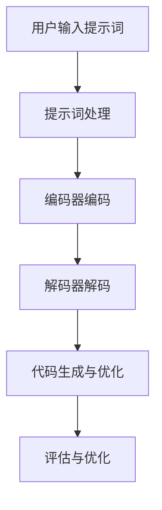
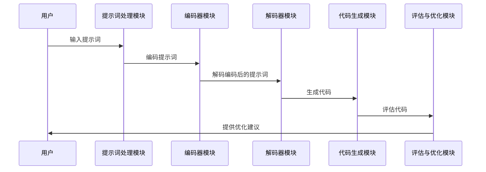

                 

# 《提示词语言的程序综合与自动化生成》

> 关键词：提示词语言、程序综合、自动化生成、人工智能、算法设计、系统架构、Python编程、LaTeX数学公式

> 摘要：本文将探讨提示词语言在程序综合与自动化生成中的应用，详细介绍其核心概念、算法原理、系统设计以及项目实战。通过本文，读者将了解到如何利用提示词语言实现高效、精准的代码生成，为人工智能领域的研究和应用提供新的思路。

## 引言

### 提示词语言的背景

随着人工智能技术的不断发展，代码生成已成为一个备受关注的研究领域。传统的代码生成方法往往依赖于大量的规则和模板，而提示词语言（Prompt-Based Language）则提供了一种全新的解决方案。提示词语言通过自然语言描述任务需求，利用预训练的模型自动生成相应的代码，具有高效、灵活、易于扩展等优点。

### 提示词语言的重要性

提示词语言在程序综合与自动化生成中的应用具有重要意义。首先，它能够显著提高代码生成的效率，降低开发成本；其次，它能够更好地适应复杂多变的需求，提高代码的灵活性和可维护性；最后，提示词语言为人工智能在软件开发中的应用提供了新的思路，有望推动人工智能技术的发展。

## 核心概念

### 背景与问题

在介绍提示词语言的程序综合与自动化生成之前，我们先来了解一下相关背景和问题。

#### 核心概念术语说明

- **提示词语言**：一种用于描述程序需求的自然语言，通常包括关键词、短语和句子等。
- **程序综合**：根据提示词语言生成符合需求的程序代码。
- **自动化生成**：利用算法和工具自动生成程序代码，无需人工干预。

#### 问题背景

在软件开发过程中，代码生成是一个非常重要的环节。传统的代码生成方法存在以下问题：

- **规则依赖**：传统方法依赖于大量的规则和模板，难以应对复杂的需求变化。
- **开发成本高**：编写和调整规则模板需要大量的时间和人力。
- **可维护性差**：随着项目规模的扩大，代码的可维护性逐渐降低。

#### 问题描述

为了解决上述问题，我们需要一种高效、灵活的代码生成方法。提示词语言通过自然语言描述任务需求，结合预训练的模型，能够自动生成符合需求的程序代码。

#### 问题解决

提示词语言的程序综合与自动化生成方法具有以下优势：

- **高效率**：利用预训练的模型，快速生成代码。
- **灵活性**：能够适应复杂多变的需求。
- **低开发成本**：无需编写和调整大量规则和模板。
- **可维护性**：生成的代码结构清晰，易于维护。

### 边界与外延

在研究提示词语言的程序综合与自动化生成时，我们需要关注以下边界和问题：

- **模型选择**：选择合适的预训练模型，如GPT、BERT等。
- **语言理解**：如何准确理解提示词语言描述的任务需求。
- **代码生成**：如何将自然语言描述转化为可执行的代码。
- **性能优化**：如何提高代码生成效率和准确性。

### 概念结构与核心要素组成

提示词语言的程序综合与自动化生成涉及以下核心概念和要素：

- **提示词**：描述程序需求的自然语言。
- **预训练模型**：用于理解提示词并生成代码。
- **编码器与解码器**：编码器将提示词编码为向量，解码器将向量解码为代码。
- **训练数据**：用于训练预训练模型的数据集。
- **评估指标**：用于评估代码生成效果的指标，如BLEU、ROUGE等。

### 核心概念与联系

为了更好地理解提示词语言的程序综合与自动化生成，我们可以通过以下表格和Mermaid ER图来对比和展示核心概念之间的关系。

#### 核心概念属性特征对比表格

| 概念        | 描述                                                       | 属性特征                       |
| ----------- | ---------------------------------------------------------- | ------------------------------ |
| 提示词      | 描述程序需求的自然语言                                     | 语义、结构、长度等             |
| 预训练模型  | 用于理解提示词并生成代码的模型                             | 通用、领域自适应、训练数据集等 |
| 编码器与解码器 | 编码器将提示词编码为向量，解码器将向量解码为代码           | 结构、功能、性能等             |
| 训练数据    | 用于训练预训练模型的数据集                                | 大小、质量、多样性等           |
| 评估指标    | 用于评估代码生成效果的指标                                 | 准确性、效率、用户体验等       |

#### Mermaid ER图

```mermaid
erDiagram
    A[提示词] ||--|{ 预训练模型 } : 用于理解
    B[编码器与解码器] ||--|{ 代码生成 } : 转换
    C[训练数据] ||--|{ 训练 } : 训练模型
    D[评估指标] ||--|{ 评估 } : 评估效果
```

## 算法原理

### 概念概述

提示词语言的程序综合与自动化生成算法主要包括以下几个步骤：

1. **提示词处理**：将自然语言描述的提示词转化为计算机可处理的格式。
2. **编码与解码**：利用预训练模型对提示词进行编码，生成向量表示；再利用解码器将向量表示解码为程序代码。
3. **代码生成**：对解码器生成的代码进行后处理，如语法检查、代码优化等，生成最终的程序代码。
4. **评估与优化**：利用评估指标对生成的代码进行评估，并根据评估结果对算法进行调整和优化。

### Mermaid流程图


### Python代码示例

以下是一个简单的Python代码示例，展示如何利用预训练模型进行编码与解码，生成程序代码。

```python
import openai

# 设定API密钥
openai.api_key = "your-api-key"

# 准备提示词
prompt = "实现一个计算两个数之和的函数"

# 编码与解码
response = openai.Completion.create(
    engine="text-davinci-002",
    prompt=prompt,
    max_tokens=50
)

# 打印生成的代码
print(response.choices[0].text.strip())
```

### 数学模型与公式

在提示词语言的程序综合与自动化生成过程中，一些数学模型和公式起到了关键作用。以下是一个简单的数学模型示例：

$$
C = f(P, D)
$$

其中，$C$ 表示生成的代码，$P$ 表示提示词，$D$ 表示训练数据。函数 $f$ 负责将提示词和训练数据转化为代码。

## 系统设计

### 问题场景描述

假设我们要设计一个用于自动化生成Web应用程序的框架，该框架能够根据提示词生成符合需求的HTML、CSS和JavaScript代码。

### 项目概述

项目目标是开发一个基于提示词语言的Web应用程序自动化生成框架，能够根据用户提供的提示词生成满足需求的代码。项目主要解决的问题包括：

- 提示词处理与理解
- 预训练模型的选择与训练
- 编码器与解码器的构建
- 代码生成与优化
- 评估与优化

### 系统架构

为了实现项目目标，我们需要设计一个完整的系统架构。以下是一个简单的系统架构图：



### 系统接口设计

系统接口主要包括以下部分：

- **提示词输入接口**：用户可以通过该接口输入提示词。
- **代码输出接口**：系统生成的代码将通过该接口输出。
- **评估与优化接口**：用于接收评估结果和优化建议。

### 系统交互

为了实现系统之间的交互，我们需要设计一个序列图。以下是一个简单的序列图示例：



## 项目实战

### 环境安装与配置

在开始项目实战之前，我们需要安装和配置相关的环境。以下是环境安装与配置的步骤：

1. 安装Python：从Python官网下载并安装Python，版本建议为3.8及以上。
2. 安装OpenAI API：在终端执行以下命令：
   ```bash
   pip install openai
   ```
3. 获取API密钥：在OpenAI官网注册并获取API密钥。
4. 配置API密钥：将API密钥添加到Python环境中，例如在`~/.config/openai/openai.yml`文件中添加以下内容：
   ```yaml
   openai:
     api_key: your-api-key
   ```

### 系统核心实现

以下是系统核心实现的Python代码，包括提示词处理、编码器与解码器、代码生成、评估与优化等部分。

```python
import openai
from transformers import AutoTokenizer, AutoModelForSeq2SeqLM

# 配置API密钥
openai.api_key = "your-api-key"

# 加载预训练模型
tokenizer = AutoTokenizer.from_pretrained("t5-small")
model = AutoModelForSeq2SeqLM.from_pretrained("t5-small")

# 提示词处理
def process_prompt(prompt):
    return f"编

