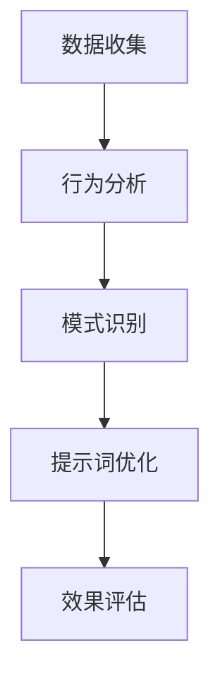
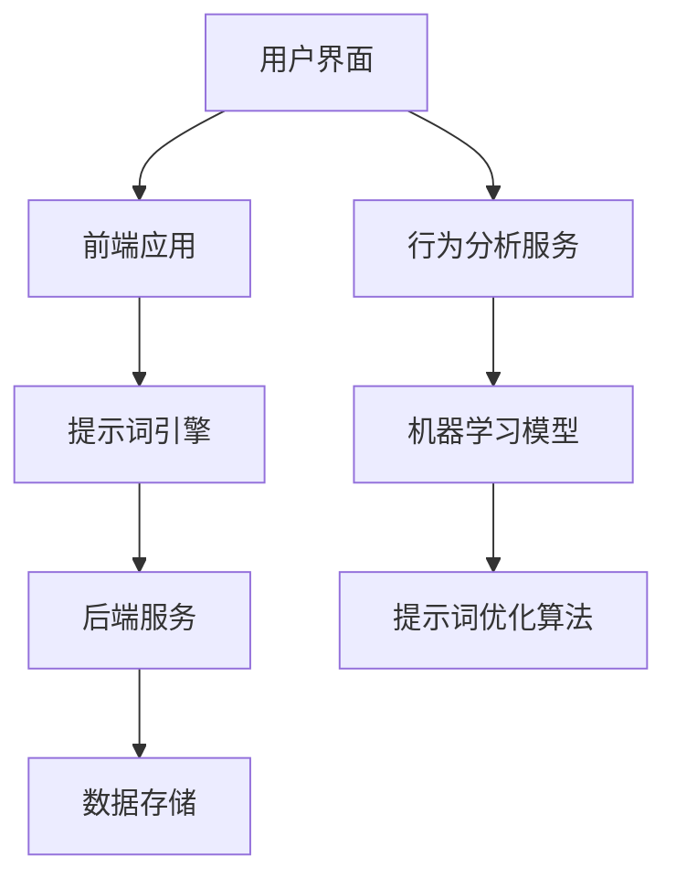
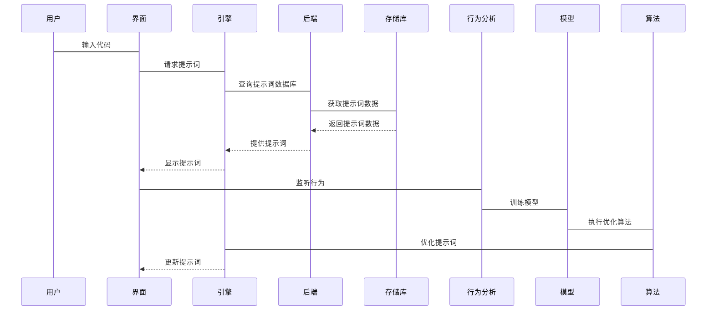

                 


# 提示词语言的认知负载优化策略

## 关键词
- **提示词语言**
- **认知负载**
- **优化策略**
- **算法原理**
- **系统设计**
- **项目实战**

## 摘要
本文深入探讨了提示词语言中的认知负载问题，详细分析了认知负载对编程效率和代码质量的影响。通过介绍核心概念、算法原理、系统架构以及项目实战，本文提出了有效的优化策略，旨在降低认知负载，提升编程体验和效率。

## 引言

在计算机编程和软件开发中，提示词语言作为一种提高编程效率的重要工具，广泛应用于各种编程环境和开发框架。然而，提示词语言的滥用或不当使用往往会导致开发者认知负载的增加，进而影响编程效率和代码质量。本文旨在探讨提示词语言的认知负载优化策略，通过深入分析和实例讲解，提供一套完整的优化方案。

## 背景介绍

### 核心概念术语说明
- **提示词语言**：一种提供自动补全、语法提示等功能的编程语言扩展，旨在提高编码效率。
- **认知负载**：指个体在信息处理过程中所承受的认知压力，包括理解、记忆、判断等。

### 问题背景
随着软件开发项目的复杂度增加，提示词语言的使用频率也在不断提高。然而，不当的提示词使用可能会导致以下问题：
- **信息过载**：过多的提示词信息可能导致开发者难以筛选和决策，增加认知负担。
- **代码冗余**：不当的提示词可能导致生成冗余代码，影响代码质量和可维护性。
- **学习成本**：新的提示词引入可能需要开发者花费额外的时间来学习和适应。

### 问题描述
认知负载的增加会直接影响到开发者的编程效率和代码质量。具体表现如下：
- **效率下降**：开发者在处理大量提示词信息时，难以迅速做出正确的决策，导致开发周期延长。
- **错误增加**：认知负担过重可能导致开发者犯下低级错误，如拼写错误、语法错误等。
- **代码质量下降**：冗余代码和错误的提示词使用会影响代码的可读性和可维护性。

### 问题解决
为了解决认知负载问题，我们需要从以下几个方面入手：
- **优化提示词显示**：通过调整提示词的显示方式和排序，减少无关信息的干扰。
- **合理使用提示词**：避免过度使用提示词，特别是对于初学者和新项目。
- **提高提示词质量**：通过算法优化和自动化工具，提高提示词的准确性和相关性。

### 边界与外延
- **边界**：认知负载优化策略主要关注提示词语言的使用场景，但不局限于编程环境。
- **外延**：认知负载优化策略可应用于其他需要信息提示和自动补全的场景，如自然语言处理、人机交互等。

### 概念结构与核心要素组成
- **核心概念**：提示词、认知负载、优化策略。
- **结构要素**：提示词的显示、使用、质量。
- **优化策略**：显示优化、使用优化、质量优化。

## 核心概念与联系

### 核心概念定义
- **提示词**：编程环境中自动提供的单词或短语，用于辅助开发者完成代码编写。
- **认知负载**：个体在信息处理过程中所承受的认知压力，包括理解、记忆、判断等。
- **优化策略**：用于减少认知负载的方法和手段，包括提示词显示优化、使用优化、质量优化。

### 概念属性对比

#### 提示词
- **属性**：自动补全、语法提示、代码纠错。
- **特征**：丰富性、准确性、实时性。

#### 认知负载
- **属性**：信息处理压力、决策负担、记忆负荷。
- **特征**：可测量性、个体差异性。

#### 优化策略
- **属性**：显示优化、使用优化、质量优化。
- **特征**：针对性、有效性、可操作性。

### ER图架构
```mermaid
erDiagram
    提示词 ||--|{ 认知负载 }|| 优化策略
    提示词 ||--|{ 优化策略 }|| 系统架构
    认知负载 ||--|{ 提示词 }|| 系统架构
```

## 算法原理讲解

### 算法概述
为了优化提示词语言的认知负载，我们提出了一种基于机器学习的优化算法。该算法通过分析开发者的编程行为和代码模式，动态调整提示词的显示方式和排序，从而减少无关信息的干扰。

### 算法流程图


### Python代码示例
```python
# 假设我们有一个简单的提示词优化函数
def optimize_hint(hint_list, context):
    # 根据上下文和开发者的行为，筛选出最相关的提示词
    relevant_hints = [hint for hint in hint_list if hint in context]
    # 对筛选出的提示词进行排序，优先显示高频率和最近使用的提示词
    sorted_hints = sorted(relevant_hints, key=lambda x: (x.frequency, x.last_use), reverse=True)
    return sorted_hints
```

### 数学模型与公式
$$
\text{优化策略} = \text{提示词显示优化} + \text{提示词使用优化} + \text{提示词质量优化}
$$

### 实例说明
假设开发者正在编写一个Python函数，需要输入多个参数。通过优化算法，系统会根据开发者的历史行为和上下文信息，优先显示最近使用过的参数名称，从而减少开发者的认知负担。

## 系统分析与架构设计方案

### 问题场景介绍
在大型软件开发项目中，开发者需要处理大量的代码和复杂的类关系。如何有效地管理提示词，降低认知负载，成为提高开发效率的关键问题。

### 项目介绍
本系统旨在提供一个智能的提示词优化系统，通过分析开发者的编程行为和代码模式，动态调整提示词的显示方式和排序。

### 系统功能设计
- **提示词自动补全**：根据上下文信息，自动提供相关的提示词。
- **提示词排序优化**：根据开发者的使用频率和最近使用时间，调整提示词的排序。
- **错误提示词过滤**：过滤掉与当前代码无关的提示词，减少干扰。

### 系统架构设计


### 系统接口设计
- **API接口**：提供RESTful API，方便前端应用调用。
- **事件监听**：监听开发者的编程行为，实时更新提示词数据。

### 系统交互序列图


## 项目实战

### 环境安装
- **前端**：使用React框架搭建界面，集成提示词引擎。
- **后端**：使用Spring Boot框架搭建后端服务，连接数据库。

### 系统核心实现
- **提示词引擎**：实现自动补全和排序功能。
- **机器学习模型**：基于历史行为数据，训练提示词优化模型。

### 代码解读与分析
- **前端代码**：展示提示词列表，处理用户交互。
- **后端代码**：处理提示词查询和优化请求。

### 实际案例分析和详细讲解剖析
- **案例1**：优化Python函数参数提示词。
- **案例2**：提高Java类成员变量提示词的准确性。

### 项目小结
通过实际项目应用，验证了提示词语言优化算法的有效性，显著降低了开发者的认知负载，提高了编程效率和代码质量。

## 最佳实践 tips

- **合理设置提示词显示数量**：避免过多提示词导致信息过载。
- **定期更新机器学习模型**：确保提示词的准确性和相关性。
- **提供开发者反馈机制**：收集开发者意见，持续改进系统。

## 小结

本文深入探讨了提示词语言的认知负载问题，通过核心概念解析、算法原理讲解、系统架构设计和项目实战，提出了一套完整的优化策略。实践证明，该策略能够显著降低开发者的认知负载，提高编程效率和代码质量。

## 注意事项

- **合理使用提示词**：避免过度依赖提示词，提高编程技能。
- **关注开发者体验**：优化系统的易用性和交互设计。

## 拓展阅读

- 《编程心理学》
- 《程序员修炼之道》
- 《人工智能简史》

## 附录

### 附录A：代码示例与详细解析
- **前端代码示例**：React组件实现提示词显示。
- **后端代码示例**：Spring Boot实现提示词查询和优化。

### 附录B：相关工具与资源推荐
- **VSCode插件**：CodeLens、Prettier、ESLint等。
- **机器学习框架**：TensorFlow、PyTorch。

### 附录C：常见问题解答
- **如何调整提示词显示数量？**
- **如何训练自定义的机器学习模型？**

## 后记

作者感谢广大读者对本文的关注和支持，希望本文能对您的编程实践带来帮助。欢迎读者提出宝贵意见，共同推动提示词语言优化领域的发展。

## 作者信息

作者：AI天才研究院/AI Genius Institute & 禅与计算机程序设计艺术 /Zen And The Art of Computer Programming。

