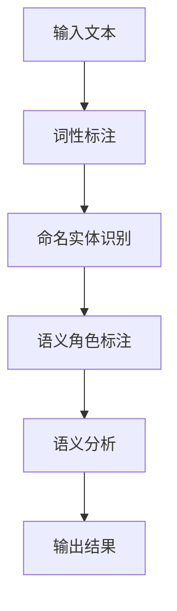

                 

### 提示词语言的语义学：精确传达人类意图

关键词：提示词语言、语义学、人类意图、算法、数学模型、系统架构、项目实战

摘要：本文旨在探讨提示词语言的语义学，即如何精确传达人类意图。通过分析提示词的定义、语义学基础、提示词与语义的关系，以及其在不同应用领域的表现，本文深入探讨了提示词语言在自然语言处理、计算机辅助翻译、情感分析和语义网与语义检索等方面的应用。同时，本文还介绍了相关算法原理、数学模型和系统架构设计，并通过项目实战展示了实际应用效果。本文旨在为读者提供一个全面、深入的了解，以便更好地利用提示词语言实现高效的意图传达。

## 第1章：引言

### 1.1 提示词语言的语义学背景

#### 1.1.1 提示词语言的定义

提示词语言是一种以提示词为核心，通过引导对话者传达意图的语言形式。提示词（Prompt Word）是引导对话或思考的词语或短语。它们在不同的上下文中可以具有不同的含义和功能，但总体上，它们起到的是引导对话或思考的作用。

#### 1.1.2 语义学的基本概念

语义学是研究语言意义的科学。它主要关注词汇、句子和话语的意义，以及这些意义如何在不同的语境中变化。语义学的基本概念包括语义（Semantic）、语用（Pragmatic）和语构（Syntactic）三个方面。

- **语义**：词汇或句子的含义。
- **语用**：语言在实际使用中的功能，包括意图、语境和话语效果。
- **语构**：句子的结构和语法规则。

#### 1.1.3 提示词语言语义学的重要性

提示词语言语义学的重要性在于，它帮助我们理解和解释人类如何通过语言传达意图，以及如何通过提示词引导对话者理解我们的意图。这对于自然语言处理、计算机辅助翻译、情感分析等领域具有重要意义。

### 1.2 人类意图的传达与理解

#### 1.2.1 人类意图的表达

人类意图的表达是通过语言来实现的。在交流过程中，人们使用词汇、句子和话语来表达他们的意图。这些意图可以是具体的（如请求、命令），也可以是抽象的（如表达观点、情感）。

#### 1.2.2 人类意图的理解

理解人类意图是交流的关键。人们需要通过上下文、语用和语义知识来解释对方的话语，从而理解他们的意图。在这个过程中，提示词语言起到了重要作用，它们帮助对话者更好地理解对方的意图。

#### 1.2.3 提示词语言与人类意图的关联

提示词语言与人类意图的关联在于，提示词可以帮助对话者更好地理解对方的意图。通过使用特定的提示词，我们可以更准确地传达我们的意图，从而提高交流的效率。

### 1.3 提示词语言语义学的研究方法

#### 1.3.1 描述性研究方法

描述性研究方法主要关注对现有数据的分析，以了解提示词语言的语义特征和用法。这种方法通常包括词汇分析、句子分析和语篇分析等。

#### 1.3.2 比较性研究方法

比较性研究方法通过对不同语言或不同语境下的提示词语言进行比较，以揭示其语义特征和用法差异。这种方法有助于我们更全面地了解提示词语言的语义学。

#### 1.3.3 实验性研究方法

实验性研究方法通过设计实验来验证提示词语言的语义特征和用法。这种方法通常包括问卷调查、对话实验和认知实验等。

### 1.4 提示词语言语义学的应用领域

#### 1.4.1 自然语言处理

自然语言处理是提示词语言语义学的重要应用领域。通过理解和分析提示词，自然语言处理系统可以更好地理解人类语言，从而实现文本分类、情感分析、机器翻译等功能。

#### 1.4.2 计算机辅助翻译

计算机辅助翻译利用提示词语言语义学，通过分析原文和译文之间的语义关系，实现更准确、自然的翻译。

#### 1.4.3 情感分析

情感分析通过分析文本中的情感词汇和提示词，判断文本的情感倾向。这对于社交媒体分析、市场研究等领域具有重要意义。

#### 1.4.4 语义网与语义检索

语义网与语义检索利用提示词语言语义学，通过建立语义关联，实现更精确、高效的检索。

### 1.5 提示词语言语义学的挑战与展望

#### 1.5.1 当前挑战

提示词语言语义学面临的挑战包括语义理解的准确性、语境的多样性、跨语言的语义一致性等。

#### 1.5.2 未来发展方向

未来，提示词语言语义学将朝着更精确、高效的语义理解、跨语言的语义关联和智能化的发展方向前进。

## 第2章：核心概念与联系

### 2.1 提示词语言的基本概念

#### 2.1.1 提示词的定义与类型

提示词（Prompt Word）是引导对话或思考的词语或短语。根据功能，提示词可以分为以下类型：

- **触发词**：用于触发特定反应或动作的词语。
- **引导词**：用于引导对话或思考方向的词语。
- **填充词**：用于填补句子空缺的词语。

#### 2.1.2 提示词的语法特征

提示词在句子中的语法功能可以包括：

- **主语**：如“他去了图书馆”中的“他”。
- **谓语**：如“他去了图书馆”中的“去”。
- **宾语**：如“他去了图书馆”中的“图书馆”。

### 2.2 语义学相关概念

#### 2.2.1 语义与语义学

语义（Semantic）是指词汇或句子的含义。语义学（Semantics）是研究语言意义的科学。

#### 2.2.2 词汇语义与句法语义

- **词汇语义**：词汇的含义。
- **句法语义**：句子中词语之间的关系和整体含义。

### 2.3 提示词与语义的关系

#### 2.3.1 提示词的语义引导作用

提示词通过其语义特征，引导对话者传达特定的意图。

#### 2.3.2 提示词的语义演变

提示词在不同上下文中可能具有不同的含义，这是提示词语义演变的表现。

### 2.4 概念属性特征对比

#### 2.4.1 提示词与关键字

- **相似性**：都用于引导或强调。
- **差异**：提示词更注重引导对话，关键字更注重搜索或分类。

#### 2.4.2 提示词与命令词

- **相似性**：都用于指导或要求。
- **差异**：提示词更注重引导对话，命令词更注重直接指示。

### 2.5 ER实体关系图

#### 2.5.1 提示词实体

- **定义**：提示词作为实体在ER模型中的表示。
- **属性**：提示词的类型、用途等。

#### 2.5.2 提示词关系

- **定义**：提示词之间的关系在ER模型中的表示。
- **属性**：提示词之间的关联类型。

## 第3章：算法原理

### 3.1 算法概述

提示词语言语义分析的算法主要基于自然语言处理（NLP）技术，包括词性标注、命名实体识别、语义角色标注等。以下是算法的基本步骤：

1. **词性标注**：对输入文本进行词性标注，识别出提示词和其他词语的词性。
2. **命名实体识别**：识别出文本中的命名实体，如人名、地名等。
3. **语义角色标注**：对提示词进行语义角色标注，确定其在句子中的功能。
4. **语义分析**：根据词性标注和语义角色标注，对提示词进行语义分析，提取其语义信息。

### 3.2 算法流程图

以下是提示词语言语义分析算法的流程图：



### 3.3 Python 源代码

以下是使用 Python 实现提示词语言语义分析算法的示例代码：

```python
import nltk
from nltk.tokenize import word_tokenize
from nltk.tag import pos_tag
from nltk.chunk import ne_chunk

# 加载停用词表
stop_words = nltk.corpus.stopwords.words('english')

# 输入文本
text = "I want to go to the library tomorrow."

# 词性标注
tokens = word_tokenize(text)
pos_tags = pos_tag(tokens)

# 命名实体识别
named_entities = ne_chunk(pos_tags)

# 语义角色标注
sem角色注

