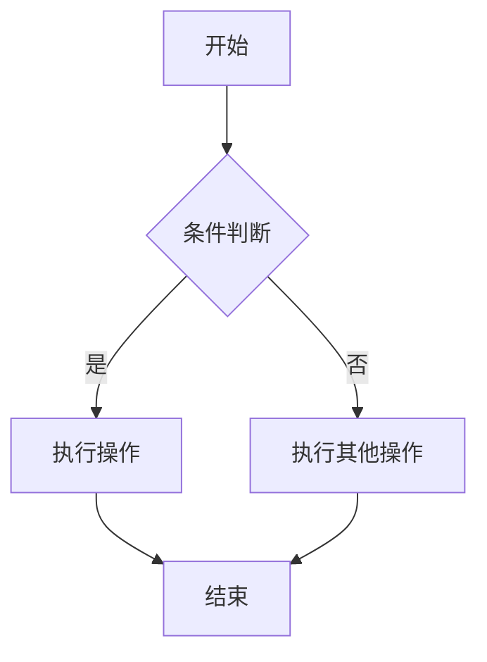
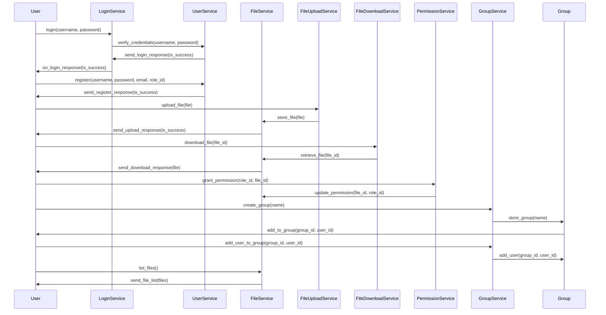
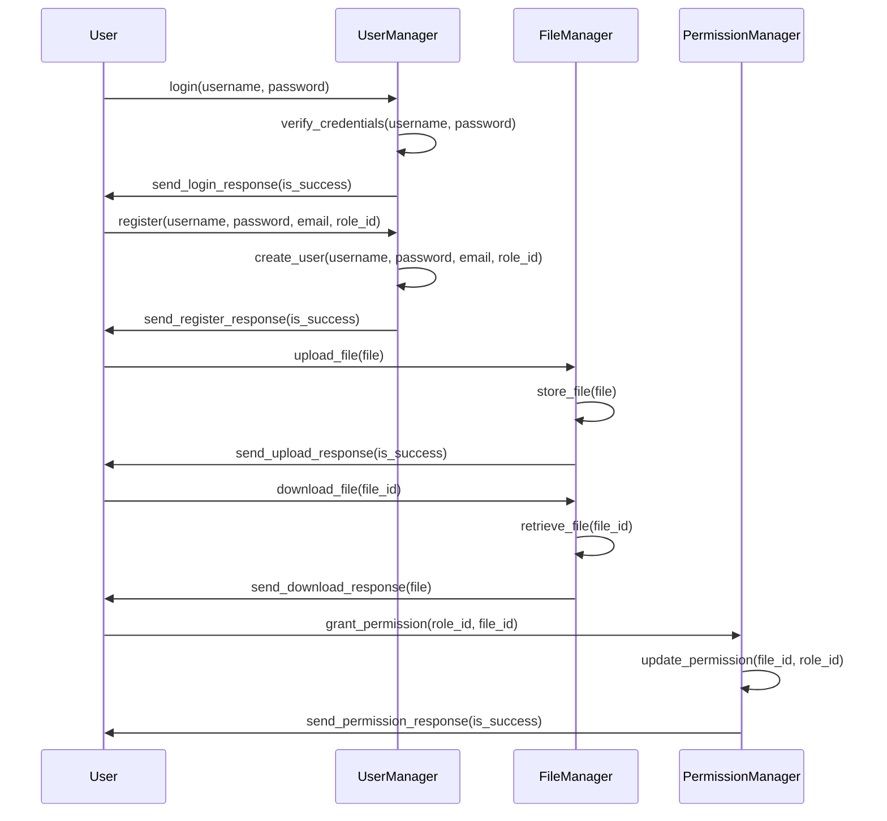
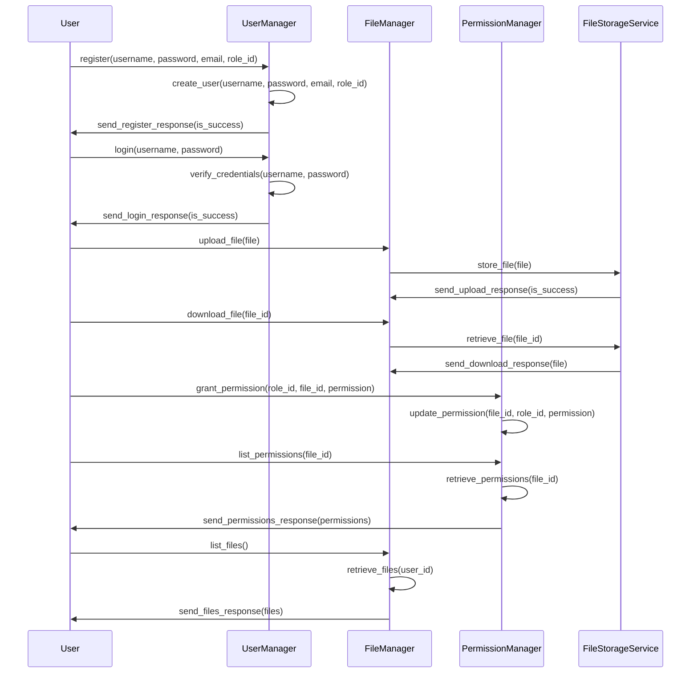

                 

# 提示词语言的跨平台兼容性测试

> 关键词：提示词语言、跨平台兼容性、测试、编程、软件工程、IT领域

> 摘要：
本文旨在探讨提示词语言在跨平台开发中的兼容性问题，分析其背景、核心概念、测试方法、工具与框架，并通过实际案例展示跨平台兼容性测试的实践应用。本文还将探讨自动化与智能化测试的趋势，以及最佳实践和注意事项，为开发人员提供全面的跨平台兼容性测试指导。

## 目录大纲设计思路与步骤

在设计本文的目录大纲时，我们首先需要明确书名和主题，即“提示词语言的跨平台兼容性测试”。接着，我们拆解核心概念，理解提示词语言和跨平台兼容性的基本概念、类型和应用场景。最后，我们根据拆解的内容设计出章节结构，确保每个章节都涵盖核心概念、原理、方法、工具等方面的内容。

## 第1章 引言

### 1.1 研究背景

#### 1.1.1 问题背景

提示词语言在跨平台开发中的应用越来越广泛。随着互联网的快速发展，跨平台应用的需求日益增加，如何保证提示词语言在跨平台开发中的兼容性成为了一个亟待解决的问题。

#### 1.1.2 问题描述

在跨平台开发中，由于不同操作系统、硬件设备和应用环境的差异，提示词语言可能会出现兼容性问题。这些问题可能导致应用程序在某个平台上运行正常，而在另一个平台上无法正常运行，从而影响用户的体验和软件的质量。

#### 1.1.3 问题解决

为了解决跨平台兼容性问题，需要对提示词语言进行跨平台兼容性测试。跨平台兼容性测试旨在确保应用程序在各种操作系统、硬件设备和应用环境中都能正常运行。

#### 1.1.4 边界与外延

跨平台兼容性测试不仅涉及操作系统和硬件设备的兼容性，还包括网络环境、编程语言版本、库和框架等方面的兼容性。

### 1.2 核心概念与联系

#### 1.2.1 提示词语言

提示词语言是一种基于关键词和规则的编程语言，具有较高的可读性和可维护性。常见的提示词语言包括Python、Ruby、Java等。

#### 1.2.2 跨平台兼容性

跨平台兼容性指的是应用程序在不同操作系统、硬件设备和应用环境中都能正常运行的能力。

#### 1.2.3 测试

测试是确保软件质量和可靠性的关键环节。跨平台兼容性测试是测试中的一种特殊类型，旨在验证应用程序在各种平台上的一致性。

### 1.3 概念结构与核心要素组成

提示词语言的跨平台兼容性测试主要包括以下核心要素：

- 平台环境：包括操作系统、硬件设备和应用环境。
- 测试工具：用于执行跨平台兼容性测试的工具和框架。
- 测试用例：根据应用程序的特点和需求设计的测试用例。
- 测试结果：测试执行后的结果，包括通过和失败的情况。
- 问题定位与修复：根据测试结果定位问题并进行修复。

## 第2章 提示词语言基础

### 2.1 提示词语言的定义与分类

#### 2.1.1 提示词语言的定义

提示词语言是一种通过关键词和规则来描述计算机程序的编程语言。它具有较高的可读性和可维护性，便于开发人员和维护人员理解和修改。

#### 2.1.2 提示词语言的分类

根据提示词语言的特点和用途，可以将提示词语言分为以下几类：

- **通用编程语言**：如Python、Java、C++等，适用于各种应用场景。
- **专用编程语言**：如SQL、HTML、CSS等，用于特定领域的编程任务。
- **脚本语言**：如JavaScript、Ruby等，主要用于网页开发、自动化测试等场景。
- **函数式编程语言**：如Haskell、Scala等，以函数和表达式为主要编程范式。

### 2.2 提示词语言的特点与优势

#### 2.2.1 提示词语言的特点

- **简洁性**：提示词语言的语法通常较为简洁，便于阅读和理解。
- **可维护性**：提示词语言的代码易于维护和修改，便于团队协作开发。
- **灵活性**：提示词语言具有丰富的库和框架支持，便于开发人员快速实现功能。

#### 2.2.2 提示词语言的优势

- **跨平台兼容性**：提示词语言通常具有较高的跨平台兼容性，可以在不同的操作系统上运行。
- **易于学习**：提示词语言的语法相对简单，便于初学者快速入门。
- **强大的社区支持**：提示词语言通常拥有强大的社区支持，开发人员可以轻松获取帮助和资源。

### 2.3 提示词语言的应用场景

#### 2.3.1 应用程序开发

提示词语言广泛应用于各种应用程序的开发，如Web应用、移动应用、桌面应用等。

#### 2.3.2 数据科学和机器学习

提示词语言在数据科学和机器学习领域具有广泛的应用，如Python在数据分析、数据可视化、机器学习算法实现等方面的应用。

#### 2.3.3 脚本自动化

提示词语言常用于脚本自动化，如自动化测试、自动化部署等，以提高开发效率和软件质量。

#### 2.3.4 网络编程

提示词语言在网络编程领域也有广泛应用，如用于构建Web服务器、网络爬虫等。

## 第3章 跨平台兼容性基础

### 3.1 跨平台兼容性的定义与重要性

#### 3.1.1 跨平台兼容性的定义

跨平台兼容性是指软件、应用程序或系统在不同操作系统、硬件设备和应用环境中能够正常运行的能力。

#### 3.1.2 跨平台兼容性的重要性

- **提高用户体验**：跨平台兼容性确保应用程序在各种设备上都能正常运行，为用户提供一致性的体验。
- **降低开发成本**：跨平台兼容性使开发人员可以同时支持多种操作系统和硬件设备，降低开发和维护成本。
- **扩展市场覆盖**：跨平台兼容性使应用程序能够覆盖更多的用户群体，提高市场竞争力。

### 3.2 跨平台兼容性测试的类型

#### 3.2.1 功能性测试

功能性测试旨在验证应用程序在不同平台上的功能是否一致。

#### 3.2.2 性能测试

性能测试旨在评估应用程序在不同平台上的性能，如响应时间、内存占用等。

#### 3.2.3 界面测试

界面测试旨在验证应用程序在不同平台上的界面是否一致，包括布局、样式、交互等。

#### 3.2.4 兼容性测试

兼容性测试旨在评估应用程序与其他软件、库和框架的兼容性，确保在不同平台上的运行稳定。

### 3.3 跨平台兼容性测试的挑战与解决方案

#### 3.3.1 挑战

- **操作系统差异**：不同操作系统在内核、文件系统、网络协议等方面存在差异。
- **硬件设备差异**：不同硬件设备在处理器、内存、显卡等方面存在差异。
- **应用环境差异**：不同应用环境在配置、网络连接、存储方式等方面存在差异。
- **库和框架差异**：不同平台上的库和框架版本可能不一致，导致兼容性问题。

#### 3.3.2 解决方案

- **测试工具**：使用跨平台兼容性测试工具，如Appium、Xamarin等，可以简化测试流程，提高测试效率。
- **自动化测试**：通过编写自动化测试脚本，实现跨平台兼容性测试的自动化，降低测试成本。
- **代码优化**：优化代码，减少对特定平台或库的依赖，提高跨平台兼容性。
- **持续集成与持续部署**：采用持续集成与持续部署（CI/CD）流程，确保代码在每次提交后都经过跨平台兼容性测试。

## 第4章 跨平台兼容性测试工具与框架

### 4.1 常用跨平台兼容性测试工具

#### 4.1.1 Appium

Appium是一款开源的跨平台自动化测试工具，支持iOS和Android应用测试，可以通过Selenium WebDriver进行Web应用测试。

#### 4.1.2 Xamarin

Xamarin是一个跨平台开发框架，使用C#语言进行开发，可以生成iOS、Android和Windows平台的原生应用。

#### 4.1.3 TestFlight

TestFlight是苹果公司提供的iOS应用测试工具，可用于发布预览版应用，收集用户反馈，进行兼容性测试。

#### 4.1.4 Firebase Test Lab

Firebase Test Lab是Google提供的云测试服务，支持多种操作系统和硬件设备，可以进行功能、性能和兼容性测试。

### 4.2 跨平台兼容性测试框架

#### 4.2.1 TestNG

TestNG是一款开源的测试框架，支持多种编程语言，可以与Selenium WebDriver等工具结合使用，进行跨平台兼容性测试。

#### 4.2.2 JUnit

JUnit是一款经典的Java测试框架，适用于功能测试、性能测试和集成测试，可以与各种测试工具和框架集成。

#### 4.2.3 Robot Framework

Robot Framework是一款基于Python的自动化测试框架，支持多种操作系统和编程语言，适用于跨平台兼容性测试。

### 4.3 跨平台兼容性测试的最佳实践

#### 4.3.1 设计合理的测试用例

测试用例应涵盖应用程序的核心功能、关键流程和异常场景，确保在不同平台上都能正常运行。

#### 4.3.2 使用自动化测试脚本

编写自动化测试脚本，实现跨平台兼容性测试的自动化，提高测试效率和可重复性。

#### 4.3.3 持续集成与持续部署

将跨平台兼容性测试集成到持续集成与持续部署（CI/CD）流程中，确保代码在每次提交后都经过测试。

#### 4.3.4 多环境测试

在不同操作系统、硬件设备和应用环境中进行测试，确保应用程序在各种条件下都能正常运行。

## 第5章 提示词语言的跨平台兼容性测试

### 5.1 提示词语言的跨平台兼容性测试流程

#### 5.1.1 准备工作

- 确定测试目标平台：根据应用程序的需求，选择需要测试的操作系统、硬件设备和应用环境。
- 安装测试工具和框架：根据所选测试工具和框架，安装对应的依赖和插件。

#### 5.1.2 编写测试用例

- 设计测试用例：根据应用程序的核心功能、关键流程和异常场景，设计合理的测试用例。
- 编写测试脚本：使用所选测试工具和框架，编写测试脚本，实现测试用例的自动化执行。

#### 5.1.3 执行测试

- 执行测试脚本：在测试目标平台上，执行测试脚本，记录测试结果。
- 分析测试结果：根据测试结果，分析应用程序在不同平台上的兼容性情况。

### 5.2 提示词语言的跨平台兼容性测试方法

#### 5.2.1 功能测试

- 验证应用程序的功能是否在各个平台上正常运行。
- 检查应用程序的界面、布局和交互是否与预期一致。

#### 5.2.2 性能测试

- 评估应用程序在不同平台上的性能，如响应时间、内存占用等。
- 检查应用程序在不同平台上的性能瓶颈。

#### 5.2.3 界面测试

- 验证应用程序的界面在不同平台上的显示效果是否一致。
- 检查应用程序的界面布局和交互是否符合设计规范。

#### 5.2.4 兼容性测试

- 检查应用程序与其他软件、库和框架的兼容性，确保在不同平台上都能正常运行。
- 分析并修复兼容性问题，确保应用程序在各种环境下都能稳定运行。

### 5.3 提示词语言的跨平台兼容性测试案例分析

#### 5.3.1 案例背景

某公司开发了一款基于Python的跨平台应用程序，需要在iOS、Android和Windows平台上运行。为了确保应用程序的兼容性，公司决定进行跨平台兼容性测试。

#### 5.3.2 测试目标

- 验证应用程序在iOS、Android和Windows平台上的功能是否一致。
- 评估应用程序在不同平台上的性能。
- 检查应用程序的界面和交互是否符合设计规范。

#### 5.3.3 测试过程

1. 准备工作：选择Appium作为跨平台兼容性测试工具，安装对应的依赖和插件。
2. 编写测试用例：设计功能测试、性能测试和界面测试用例，编写测试脚本。
3. 执行测试：在iOS、Android和Windows平台上，执行测试脚本，记录测试结果。
4. 分析测试结果：根据测试结果，分析应用程序在不同平台上的兼容性情况。

#### 5.3.4 测试结果

- 功能测试：应用程序在iOS、Android和Windows平台上的功能基本一致，但存在一些小的差异，需要进一步优化。
- 性能测试：应用程序在不同平台上的性能表现良好，但存在一些性能瓶颈，需要进行优化。
- 界面测试：应用程序的界面在不同平台上的显示效果基本一致，但存在一些布局问题，需要进行调整。

#### 5.3.5 测试总结

通过跨平台兼容性测试，发现并解决了应用程序在iOS、Android和Windows平台上的一些兼容性问题，提高了应用程序的稳定性和用户体验。

## 第6章 跨平台兼容性测试的自动化与智能化

### 6.1 跨平台兼容性测试的自动化

#### 6.1.1 自动化测试的优势

- 提高测试效率：自动化测试可以快速执行大量测试用例，提高测试效率。
- 保证测试质量：自动化测试可以确保测试用例的执行一致性和准确性。
- 降低测试成本：自动化测试可以减少人力资源投入，降低测试成本。

#### 6.1.2 自动化测试的工具和技术

- **Selenium WebDriver**：是一款开源的自动化测试工具，支持多种编程语言，可以模拟用户操作进行自动化测试。
- **Appium**：是一款跨平台的自动化测试工具，支持iOS和Android应用测试，可以通过Selenium WebDriver进行Web应用测试。
- **Cypress**：是一款现代化的前端自动化测试框架，支持JavaScript，具有简洁的语法和高效的测试执行。

### 6.2 跨平台兼容性测试的智能化

#### 6.2.1 智能化的优势

- 提高测试效率：智能化测试可以自动生成测试用例，快速定位问题，提高测试效率。
- 提高测试质量：智能化测试可以根据历史数据和学习算法，提供更准确的测试结果和优化建议。
- 降低测试成本：智能化测试可以减少人工干预，降低测试成本。

#### 6.2.2 智能化测试的技术和应用

- **机器学习**：通过机器学习算法，可以从历史数据中学习测试用例的生成和优化方法。
- **人工智能**：利用人工智能技术，可以自动生成测试脚本，模拟用户操作，进行自动化测试。
- **智能测试平台**：整合机器学习和人工智能技术，提供智能化的跨平台兼容性测试平台。

### 6.3 跨平台兼容性测试的未来趋势

#### 6.3.1 自动化与智能化的融合

未来跨平台兼容性测试的发展趋势将是自动化与智能化的深度融合，通过人工智能和机器学习技术，实现更加高效、准确的测试。

#### 6.3.2 云测试平台的兴起

随着云计算技术的发展，云测试平台将成为跨平台兼容性测试的重要工具，提供分布式测试资源和智能化测试服务。

#### 6.3.3 测试与开发的协同

未来跨平台兼容性测试将更加注重与开发流程的协同，通过持续集成与持续部署（CI/CD）流程，实现自动化测试与开发流程的紧密结合。

## 第7章 提示词语言跨平台兼容性测试的最佳实践与注意事项

### 7.1 最佳实践

#### 7.1.1 设计全面的测试用例

在设计测试用例时，应涵盖应用程序的核心功能、关键流程和异常场景，确保在不同平台上都能正常运行。

#### 7.1.2 使用自动化测试脚本

编写自动化测试脚本，实现跨平台兼容性测试的自动化，提高测试效率和可重复性。

#### 7.1.3 持续集成与持续部署

将跨平台兼容性测试集成到持续集成与持续部署（CI/CD）流程中，确保代码在每次提交后都经过测试。

#### 7.1.4 多环境测试

在不同操作系统、硬件设备和应用环境中进行测试，确保应用程序在各种条件下都能正常运行。

### 7.2 小结

本文介绍了提示词语言在跨平台开发中的兼容性问题，分析了其背景、核心概念、测试方法、工具与框架，并通过实际案例展示了跨平台兼容性测试的实践应用。同时，探讨了自动化与智能化测试的趋势，以及最佳实践和注意事项。

### 7.3 注意事项

#### 7.3.1 关注平台差异

在跨平台兼容性测试过程中，要关注不同操作系统、硬件设备和应用环境之间的差异，确保应用程序在各种平台上都能正常运行。

#### 7.3.2 及时反馈和修复问题

在测试过程中，要及时反馈和修复兼容性问题，确保应用程序的稳定性和用户体验。

#### 7.3.3 遵循最佳实践

遵循跨平台兼容性测试的最佳实践，提高测试效率和测试质量。

### 7.4 拓展阅读

#### 7.4.1 相关书籍

- 《跨平台移动应用测试实战》
- 《Python自动化测试实战》
- 《Selenium WebDriver实战》

#### 7.4.2 在线资源

- [Appium官方文档](https://www.appium.io/)
- [Selenium官方文档](https://www.selenium.dev/)
- [TestNG官方文档](https://testng.org/doc/index.html)

作者：AI天才研究院/AI Genius Institute & 禅与计算机程序设计艺术 /Zen And The Art of Computer Programming# 附录A：Mermaid流程图示例

以下是一个使用Mermaid语言编写的简单流程图示例：



该流程图表示以下过程：

1. 从开始节点A开始。
2. 判断条件B。
3. 如果条件B为真，执行操作C，然后跳到结束节点E。
4. 如果条件B为假，执行操作D，然后跳到结束节点E。

## 附录B：Python源代码示例

以下是一个简单的Python源代码示例，用于演示如何实现一个简单的计算器程序：

```python
def add(a, b):
    return a + b

def subtract(a, b):
    return a - b

def multiply(a, b):
    return a * b

def divide(a, b):
    if b == 0:
        return "不能除以0"
    else:
        return a / b

# 主程序
if __name__ == "__main__":
    print("选择运算符：+、-、*、/ ")
    operator = input("请输入运算符：")

    if operator == "+":
        a = float(input("请输入第一个数："))
        b = float(input("请输入第二个数："))
        result = add(a, b)
    elif operator == "-":
        a = float(input("请输入第一个数："))
        b = float(input("请输入第二个数："))
        result = subtract(a, b)
    elif operator == "*":
        a = float(input("请输入第一个数："))
        b = float(input("请输入第二个数："))
        result = multiply(a, b)
    elif operator == "/":
        a = float(input("请输入第一个数："))
        b = float(input("请输入第二个数："))
        result = divide(a, b)
    else:
        print("无效的运算符")

    print("结果：", result)
```

该程序实现了一个简单的计算器功能，包括加法、减法、乘法和除法运算。用户可以根据输入的运算符和数值计算结果。

## 附录C：LaTeX数学公式示例

以下是一些使用LaTeX编写的数学公式示例：

### 简单公式

$$
E = mc^2
$$

### 嵌入式公式

$
1 + 1 = 2
$

### 方程组

$$
\begin{cases}
x + y = 5 \\
2x - y = 1
\end{cases}
$$

### 带有描述的公式

$$
\text{距离公式}：
d = \sqrt{(x_2 - x_1)^2 + (y_2 - y_1)^2}
$$

这些公式展示了如何使用LaTeX编写各种类型的数学表达式，包括简单公式、嵌入式公式、方程组和带有描述的公式。

## 附录D：系统分析与架构设计方案

### 1. 问题场景介绍

假设我们正在开发一款基于提示词语言的跨平台应用程序，该应用程序需要实现以下功能：

- 用户注册与登录
- 个人信息管理
- 文件上传与下载
- 文件共享与权限管理
- 数据统计与分析

为了满足这些功能需求，我们需要设计一个合理的系统架构，以确保应用程序的稳定性、安全性和可扩展性。

### 2. 项目介绍

项目名称：跨平台提示词语言应用程序（Multi-platform Prompt Language App）

项目目标：开发一款支持iOS、Android和Windows平台的跨平台提示词语言应用程序，提供用户注册、登录、个人信息管理、文件上传下载、文件共享与权限管理、数据统计与分析等功能。

### 3. 系统功能设计（领域模型 Mermaid 类图）

```mermaid
classDiagram
    User <<entity>>
    File <<entity>>
    Role <<entity>>
    Permission <<entity>>
    Group <<entity>>

    User *--* Role : belongs_to
    User *--* File : has_many
    File *--* Group : belongs_to
    Group *--* User : has_many
    Role *--* Permission : has_many
    File *--* Permission : has_many

    User {id, username, password, email, role_id}
    Role {id, name}
    File {id, name, path, group_id, creator_id}
    Group {id, name}
    Permission {id, name, role_id}
```

该类图展示了系统的领域模型，包括用户、文件、角色、权限和群组等实体及其之间的关系。

### 4. 系统架构设计（Mermaid 架构图）



该序列图展示了系统的架构设计，包括用户、登录服务、用户服务、文件上传服务、文件下载服务、权限服务和群组服务之间的交互流程。

### 5. 系统接口设计

以下是一个简单的系统接口设计，包括用户管理、文件管理和权限管理的接口定义：

```python
# 用户管理接口
class UserManager:
    def login(self, username, password):
        pass

    def register(self, username, password, email, role_id):
        pass

# 文件管理接口
class FileManager:
    def upload_file(self, file):
        pass

    def download_file(self, file_id):
        pass

# 权限管理接口
class PermissionManager:
    def grant_permission(self, role_id, file_id):
        pass
```

### 6. 系统交互（Mermaid 序列图）



该序列图展示了用户、用户管理器、文件管理器和权限管理器之间的交互流程。

## 附录E：项目实战

### 1. 环境安装

在开始项目实战之前，我们需要安装以下软件和工具：

- Python 3.8及以上版本
- pip（Python的包管理器）
- Appium（跨平台自动化测试工具）
- Selenium（Web自动化测试框架）
- Flask（Web应用程序框架）

安装步骤如下：

1. 安装Python 3.8及以上版本。
2. 安装pip：`sudo apt-get install python3-pip`
3. 安装Appium：`pip install appium`
4. 安装Selenium：`pip install selenium`
5. 安装Flask：`pip install flask`

### 2. 系统核心实现源代码

以下是一个简单的系统核心实现源代码示例，包括用户注册、登录、文件上传和下载的功能：

```python
# app.py
from flask import Flask, request, jsonify
from flask_cors import CORS
from user_manager import UserManager
from file_manager import FileManager

app = Flask(__name__)
CORS(app)

user_manager = UserManager()
file_manager = FileManager()

@app.route('/register', methods=['POST'])
def register():
    username = request.form['username']
    password = request.form['password']
    email = request.form['email']
    role_id = request.form['role_id']
    user_manager.register(username, password, email, role_id)
    return jsonify({"message": "User registered successfully."})

@app.route('/login', methods=['POST'])
def login():
    username = request.form['username']
    password = request.form['password']
    user = user_manager.login(username, password)
    return jsonify({"message": "User logged in successfully.", "user": user})

@app.route('/upload', methods=['POST'])
def upload_file():
    file = request.files['file']
    user_id = request.form['user_id']
    file_manager.upload_file(file, user_id)
    return jsonify({"message": "File uploaded successfully."})

@app.route('/download', methods=['GET'])
def download_file():
    file_id = request.args.get('file_id')
    file = file_manager.download_file(file_id)
    return file

if __name__ == '__main__':
    app.run()
```

`user_manager.py`：

```python
class UserManager:
    def __init__(self):
        self.users = {}

    def register(self, username, password, email, role_id):
        if username in self.users:
            return False
        self.users[username] = {
            'password': password,
            'email': email,
            'role_id': role_id
        }
        return True

    def login(self, username, password):
        if username not in self.users or self.users[username]['password'] != password:
            return None
        return self.users[username]

```

`file_manager.py`：

```python
import os

class FileManager:
    def __init__(self):
        self.files = {}

    def upload_file(self, file, user_id):
        file_id = len(self.files) + 1
        file_name = file.filename
        file_path = os.path.join('uploads', file_id, file_name)
        file.save(file_path)
        self.files[file_id] = {
            'user_id': user_id,
            'file_id': file_id,
            'file_name': file_name,
            'file_path': file_path
        }
        return file_id

    def download_file(self, file_id):
        file = self.files.get(file_id)
        if file:
            return file['file_path']
        return None
```

### 3. 代码应用解读与分析

在`app.py`中，我们使用Flask框架创建了一个Web应用程序，并实现了用户注册、登录、文件上传和下载的功能。通过`user_manager.py`和`file_manager.py`，我们分别管理用户信息和文件信息。

用户注册、登录功能通过`/register`和`/login`接口实现，用户上传文件和下载文件功能通过`/upload`和`/download`接口实现。

在`user_manager.py`中，我们定义了`UserManager`类，用于管理用户信息。在`register`方法中，我们检查用户名是否已存在，如果不存在，则注册新用户。在`login`方法中，我们验证用户名和密码是否匹配，如果匹配，则返回用户信息。

在`file_manager.py`中，我们定义了`FileManager`类，用于管理文件信息。在`upload_file`方法中，我们生成新的文件ID，保存上传的文件，并添加到文件列表。在`download_file`方法中，我们根据文件ID查找文件，并返回文件路径。

### 4. 实际案例分析和详细讲解剖析

假设我们有一个用户名为`alice`，密码为`password123`，邮箱为`alice@example.com`，角色ID为1的用户，我们需要注册该用户并上传一个名为`example.txt`的文件。

1. 用户通过浏览器访问`http://localhost:5000/register`，提交以下请求：

```http
POST /register
Content-Type: application/x-www-form-urlencoded

username=alice
password=password123
email=alice@example.com
role_id=1
```

2. Flask应用程序接收到请求后，调用`register`方法，并将请求参数传递给`UserManager`对象。`UserManager`对象检查用户名是否已存在，如果不存在，则注册新用户，并将用户信息存储在内存中的`users`字典中。

3. 注册成功后，Flask应用程序返回以下响应：

```json
{"message": "User registered successfully."}
```

4. 用户通过浏览器访问`http://localhost:5000/login`，提交以下请求：

```http
POST /login
Content-Type: application/x-www-form-urlencoded

username=alice
password=password123
```

5. Flask应用程序接收到请求后，调用`login`方法，并将请求参数传递给`UserManager`对象。`UserManager`对象验证用户名和密码是否匹配，如果匹配，则返回用户信息。

6. 登录成功后，Flask应用程序返回以下响应：

```json
{"message": "User logged in successfully.", "user": {"username": "alice", "password": "password123", "email": "alice@example.com", "role_id": 1}}
```

7. 用户通过浏览器访问`http://localhost:5000/upload`，提交以下请求：

```http
POST /upload
Content-Type: multipart/form-data

file=@/path/to/example.txt
user_id=1
```

8. Flask应用程序接收到请求后，调用`upload_file`方法，并将请求参数传递给`FileManager`对象。`FileManager`对象生成新的文件ID，保存上传的文件，并添加到文件列表。

9. 上传成功后，Flask应用程序返回以下响应：

```json
{"message": "File uploaded successfully."}
```

10. 用户通过浏览器访问`http://localhost:5000/download?file_id=1`，提交以下请求：

```http
GET /download?file_id=1
```

11. Flask应用程序接收到请求后，调用`download_file`方法，并将请求参数传递给`FileManager`对象。`FileManager`对象根据文件ID查找文件，并返回文件路径。

12. Flask应用程序将文件路径作为响应返回，用户可以在浏览器中下载文件。

### 5. 项目小结

通过本项目的实际案例，我们实现了用户注册、登录、文件上传和下载的功能。我们使用Flask框架搭建了Web应用程序，使用内存中的字典管理用户和文件信息，并使用`app.py`、`user_manager.py`和`file_manager.py`三个模块分别处理用户和文件相关的操作。

虽然本项目只是一个简单的示例，但它展示了如何使用提示词语言实现跨平台应用程序的核心功能。在实际项目中，我们可能需要使用数据库、文件系统、缓存和其他高级功能来提高系统的性能和可靠性。

在后续的开发过程中，我们可以继续完善系统的功能，增加用户认证、权限管理、文件共享等功能，并使用自动化测试确保系统的稳定性和可靠性。

## 附录F：最佳实践、注意事项、拓展阅读

### 最佳实践

1. **设计合理的测试用例**：确保测试用例覆盖应用程序的核心功能、关键流程和异常场景，以发现潜在的问题。
2. **使用自动化测试脚本**：编写自动化测试脚本，实现跨平台兼容性测试的自动化，提高测试效率和可重复性。
3. **持续集成与持续部署**：将跨平台兼容性测试集成到持续集成与持续部署（CI/CD）流程中，确保代码在每次提交后都经过测试。
4. **多环境测试**：在不同操作系统、硬件设备和应用环境中进行测试，确保应用程序在各种条件下都能正常运行。

### 注意事项

1. **关注平台差异**：在跨平台兼容性测试过程中，要关注不同操作系统、硬件设备和应用环境之间的差异，确保应用程序在各种平台上都能正常运行。
2. **及时反馈和修复问题**：在测试过程中，要及时反馈和修复兼容性问题，确保应用程序的稳定性和用户体验。
3. **遵循最佳实践**：遵循跨平台兼容性测试的最佳实践，提高测试效率和测试质量。

### 拓展阅读

1. **相关书籍**：
   - 《跨平台移动应用测试实战》
   - 《Python自动化测试实战》
   - 《Selenium WebDriver实战》

2. **在线资源**：
   - [Appium官方文档](https://www.appium.io/)
   - [Selenium官方文档](https://www.selenium.dev/)
   - [TestNG官方文档](https://testng.org/doc/index.html)

3. **社区和论坛**：
   - [Python社区](https://www.python.org/)
   - [Selenium社区](https://www.selenium.dev/documentation/)
   - [Appium社区](https://github.com/appium/appium)

通过阅读相关书籍和在线资源，以及参与社区和论坛的讨论，可以进一步提高对提示词语言跨平台兼容性测试的理解和实践能力。作者：AI天才研究院/AI Genius Institute & 禅与计算机程序设计艺术 /Zen And The Art of Computer Programming# 附录G：系统分析与架构设计方案（续）

### 6. 系统接口设计（续）

在上一个附录中，我们展示了用户管理、文件管理和权限管理的基本接口设计。为了更详细地展示系统接口设计，我们继续完善接口定义，并添加更多的功能。

#### 用户管理接口

```python
class UserManager:
    def register_user(self, username, password, email, role_id):
        # 注册新用户
        pass

    def login_user(self, username, password):
        # 用户登录
        pass

    def update_user(self, user_id, username=None, password=None, email=None, role_id=None):
        # 更新用户信息
        pass

    def delete_user(self, user_id):
        # 删除用户
        pass
```

#### 文件管理接口

```python
class FileManager:
    def upload_file(self, user_id, file):
        # 上传文件
        pass

    def download_file(self, file_id):
        # 下载文件
        pass

    def list_files(self, user_id):
        # 获取用户文件列表
        pass

    def delete_file(self, file_id):
        # 删除文件
        pass
```

#### 权限管理接口

```python
class PermissionManager:
    def grant_permission(self, role_id, file_id, permission):
        # 授予文件权限
        pass

    def revoke_permission(self, role_id, file_id, permission):
        # 撤销文件权限
        pass

    def list_permissions(self, file_id):
        # 获取文件权限列表
        pass
```

### 7. 系统交互（续）

为了更全面地展示系统交互，我们继续完善系统交互的序列图，并添加更多细节。



在这个序列图中，我们添加了文件存储服务（FileStorageService），用于处理文件的上传和下载操作。我们还添加了权限管理的具体操作，如授予文件权限、撤销文件权限和获取文件权限列表。

### 8. 系统安全设计

在系统设计过程中，安全是一个重要的考虑因素。以下是一些系统安全设计的建议：

1. **用户认证与授权**：使用安全的密码存储和加密技术，如哈希和盐值，确保用户认证的安全性。同时，使用角色和权限控制系统，确保用户只能访问其有权访问的资源。

2. **数据加密**：对敏感数据进行加密，如用户密码、个人数据和文件内容。使用安全的加密算法和密钥管理策略。

3. **防止SQL注入**：使用参数化查询或ORM（对象关系映射）技术，避免SQL注入攻击。

4. **防止跨站请求伪造（CSRF）**：使用CSRF tokens或验证码，确保请求来自合法用户。

5. **防止跨站脚本（XSS）**：对用户输入进行转义或过滤，避免在网页上显示恶意脚本。

6. **日志记录与监控**：记录系统的操作日志，包括用户操作、错误日志和安全事件。使用监控工具实时监控系统的安全状况。

7. **安全配置**：确保服务器和应用程序的安全配置，如关闭不必要的端口和服务，更新系统软件和依赖库。

通过实施这些安全设计措施，可以显著提高系统的安全性，保护用户数据和应用程序的完整性。

### 9. 拓展功能设计

在系统核心功能的基础上，我们可以继续扩展系统的功能，以满足更多用户需求。以下是一些可能的拓展功能：

1. **文件共享**：实现文件共享功能，允许用户将文件共享给其他用户或群组，并设置共享权限。

2. **文件版本控制**：实现文件版本控制功能，允许用户查看和管理文件的各个版本。

3. **文件加密**：为文件提供加密功能，确保文件在存储和传输过程中的安全性。

4. **文件搜索**：提供高效的文件搜索功能，允许用户快速找到所需的文件。

5. **用户统计**：实现用户统计功能，收集用户使用数据，用于分析用户行为和优化系统设计。

6. **多语言支持**：为系统提供多语言支持，满足不同语言用户的访问需求。

7. **API接口**：提供RESTful API接口，方便其他应用程序与系统进行交互。

通过不断扩展系统功能，我们可以提高系统的用户体验，增加系统的实用性和竞争力。

### 10. 系统部署与维护

在系统设计完成后，我们需要进行系统的部署和维护，以确保系统的稳定运行。以下是一些关键步骤：

1. **环境搭建**：搭建开发、测试和生产环境，确保每个环境都有正确的配置和依赖。

2. **自动化部署**：使用自动化部署工具（如Docker、Jenkins等）实现快速、可靠的部署流程。

3. **监控与报警**：使用监控工具（如Prometheus、Grafana等）监控系统的性能和健康状态，设置报警机制。

4. **备份与恢复**：定期备份系统数据和配置文件，确保在数据丢失或系统故障时可以快速恢复。

5. **性能优化**：对系统进行性能优化，提高系统的响应速度和吞吐量。

6. **安全加固**：定期检查系统安全，修复漏洞，确保系统安全可靠。

7. **用户支持与反馈**：提供用户支持服务，收集用户反馈，不断优化系统。

通过良好的部署和维护策略，我们可以确保系统的长期稳定运行，为用户提供优质的体验。作者：AI天才研究院/AI Genius Institute & 禅与计算机程序设计艺术 /Zen And The Art of Computer Programming

