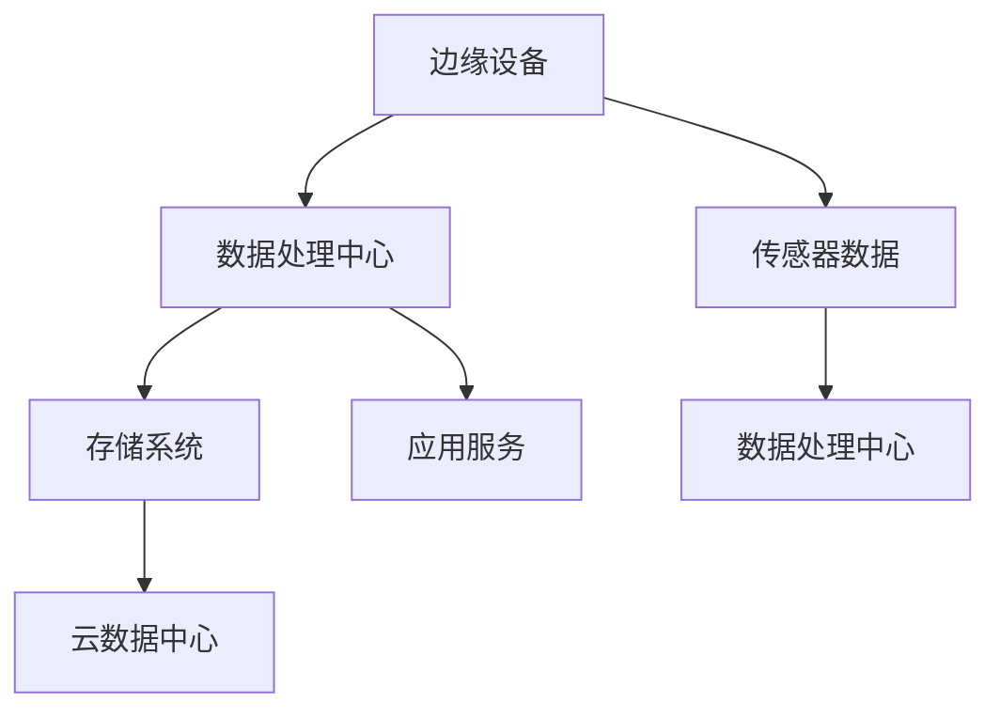
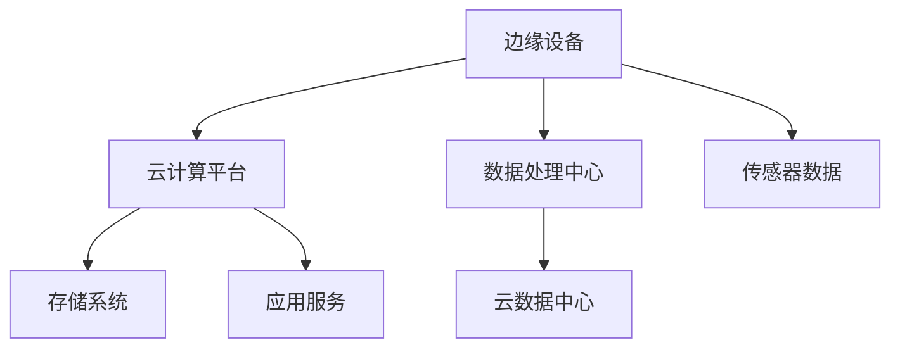
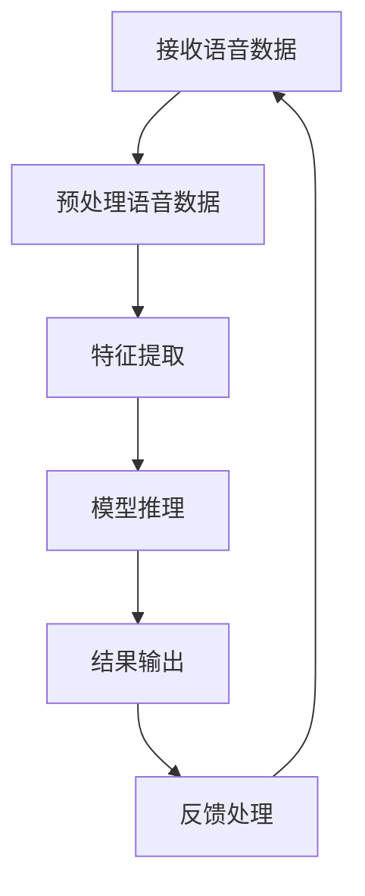

                 

### 文章标题

《提示词语言的边缘计算优化与延迟降低》

#### 关键词

边缘计算、提示词语言处理、延迟优化、算法、数学模型、系统架构、安全、隐私保护

#### 摘要

本文深入探讨了边缘计算在提示词语言处理中的应用，以及如何通过优化策略降低延迟，提升用户体验。通过系统分析边缘计算的概念、架构、应用场景以及延迟优化方法，本文提供了实际案例和最佳实践，旨在为读者提供一个全面、详尽的边缘计算优化指南。

---

### 目录

1. **边缘计算概述**  
   1.1 边缘计算的概念与重要性  
   1.2 边缘计算的发展历程  
   1.3 边缘计算的优势与挑战

2. **边缘计算架构与技术**  
   2.1 边缘计算架构的设计原则  
   2.2 边缘计算的关键技术  
   2.3 边缘计算与云计算的结合

3. **边缘计算在提示词语言处理中的应用**  
   3.1 提示词语言处理的挑战  
   3.2 边缘计算如何优化提示词语言处理  
   3.3 提示词语言处理的边缘计算案例

4. **边缘计算中的延迟优化策略**  
   4.1 延迟定义与测量  
   4.2 延迟优化的方法与算法  
   4.3 实时延迟优化案例分析

5. **边缘计算优化实践**  
   5.1 环境配置与工具介绍  
   5.2 提示词语言处理优化案例实战  
   5.3 延迟优化案例实战

6. **边缘计算中的安全与隐私问题**  
   6.1 边缘计算的安全挑战  
   6.2 隐私保护与数据安全  
   6.3 安全措施与最佳实践

7. **未来展望与趋势**  
   7.1 边缘计算的发展趋势  
   7.2 提示词语言处理技术的发展  
   7.3 延迟优化技术的未来

8. **小结与展望**  
   8.1 书籍内容总结  
   8.2 边缘计算与提示词语言处理的应用前景  
   8.3 阅读指南与进一步学习

---

### 第一部分：边缘计算基础

#### 第1章：边缘计算概述

#### 1.1 边缘计算的概念与重要性

边缘计算是一种计算架构，它将数据处理的任务从传统的中心化数据中心转移到网络边缘，即接近数据源的设备上。边缘计算的核心思想是尽可能在数据生成的源头附近处理数据，以减少数据传输的延迟和带宽消耗。

**核心概念与联系**

边缘计算与云计算之间的主要区别在于数据处理的位置和方式。云计算主要依赖于中心化的数据中心进行大规模数据处理，而边缘计算则在网络边缘部署计算资源，实现分布式计算。

**概念属性特征对比表格**

| 特征                | 边缘计算           | 云计算          |
|---------------------|---------------------|-----------------|
| 数据处理位置        | 网络边缘           | 中心化数据中心   |
| 数据传输延迟        | 较低               | 较高           |
| 带宽消耗            | 较低               | 较高           |
| 系统扩展性          | 易扩展性           | 大规模扩展性    |

**ER实体关系图架构**

```mermaid
erDiagram
  User ||--|{ EdgeDevice }|-- DataCenter
  User ||--|{ CloudService }|-- DataCenter
  EdgeDevice ||--|{ ProcessedData }|-- DataCenter
  CloudService ||--|{ StoredData }|-- DataCenter
```

#### 1.2 边缘计算的发展历程

边缘计算的概念最早可以追溯到2000年代初期，当时主要应用于物联网（IoT）领域。随着物联网设备的增加和数据处理需求的增长，边缘计算逐渐成为云计算的重要补充。

**发展历程**

- **2000年代初期**：边缘计算概念提出，主要应用于物联网。
- **2010年代**：随着5G网络的兴起，边缘计算在移动通信领域得到广泛应用。
- **2020年代**：边缘计算逐渐成为人工智能、自动驾驶等新兴领域的关键技术。

#### 1.3 边缘计算的优势与挑战

**优势**

- **降低延迟**：在数据生成的源头附近处理数据，减少传输延迟。
- **减少带宽消耗**：避免大量数据传输，降低网络带宽需求。
- **提高安全性**：数据在边缘设备上处理，减少数据泄露风险。

**挑战**

- **计算资源有限**：边缘设备计算资源相对中心化数据中心有限。
- **边缘设备维护成本高**：设备分散部署，维护成本较高。
- **数据隐私保护**：边缘设备处理数据，如何保障数据隐私成为一大挑战。

#### 第2章：边缘计算架构与技术

#### 2.1 边缘计算架构的设计原则

边缘计算架构设计需要考虑多个方面，包括计算资源分布、数据传输路径、安全性与隐私保护等。以下是一些关键设计原则：

**设计原则**

- **分布式计算**：将计算任务分布到多个边缘设备，提高系统整体性能。
- **冗余设计**：确保关键组件具有冗余，提高系统可靠性。
- **可扩展性**：支持系统规模扩展，以适应不断增长的数据处理需求。
- **安全性**：采用加密、访问控制等技术，确保数据安全和隐私。

**架构图**



#### 2.2 边缘计算的关键技术

边缘计算涉及多个关键技术，包括数据压缩、网络优化、智能计算等。以下是一些关键技术的详细介绍：

**关键技术**

- **数据压缩**：通过数据压缩技术减少数据传输量，降低带宽消耗。
- **网络优化**：优化网络传输路径，提高数据传输效率。
- **智能计算**：利用人工智能技术，实现自动化数据处理和决策。

**技术对比表格**

| 技术名称         | 目的                 | 优缺点                                                                                   |
|----------------|----------------------|----------------------------------------------------------------------------------------------|
| 数据压缩        | 减少数据传输量       | 优点：降低带宽消耗，提高传输效率。缺点：压缩算法复杂度高，压缩与解压缩过程消耗计算资源。 |
| 网络优化        | 提高数据传输效率     | 优点：优化传输路径，减少延迟。缺点：需要实时监测网络状态，增加系统复杂性。                 |
| 智能计算        | 实现自动化数据处理   | 优点：提高数据处理效率，降低人力成本。缺点：对算法和计算资源要求较高。                   |

**ER实体关系图架构**

```mermaid
erDiagram
  EdgeDevice ||--|{ CompressedData }|-- DataCenter
  DataCenter ||--|{ OptimizedNetwork }|-- Network
  DataCenter ||--|{ IntelligentComputing }|-- CloudService
```

#### 2.3 边缘计算与云计算的结合

边缘计算与云计算相互补充，共同构建了现代计算生态系统。以下讨论边缘计算与云计算的结合方式及其优势：

**结合方式**

- **数据共享**：边缘计算设备与云计算平台共享数据，实现数据的高效利用。
- **任务分配**：将部分计算任务分配到边缘设备，减轻云计算平台负载。
- **协同处理**：边缘计算与云计算协同工作，实现更高效的数据处理和分析。

**优势**

- **提高系统性能**：通过将计算任务分配到边缘设备，减轻云计算平台负载，提高系统整体性能。
- **降低延迟**：在边缘设备上处理数据，减少数据传输延迟，提高用户体验。
- **提高数据安全性**：边缘计算设备靠近数据源，减少数据泄露风险。

**结合架构图**



#### 第3章：边缘计算在提示词语言处理中的应用

#### 3.1 提示词语言处理的挑战

提示词语言处理是一项涉及自然语言处理（NLP）和机器学习（ML）的技术，旨在理解和生成人类语言。在边缘计算环境中，提示词语言处理面临以下挑战：

**挑战**

- **数据传输延迟**：边缘计算设备与云平台之间的数据传输延迟可能导致提示词语言处理的实时性下降。
- **计算资源限制**：边缘设备计算资源相对有限，可能无法支持复杂的NLP和ML算法。
- **数据隐私保护**：在边缘设备上处理和存储数据，如何保障数据隐私成为一个重要问题。

#### 3.2 边缘计算如何优化提示词语言处理

边缘计算可以通过以下几种方式优化提示词语言处理：

**优化方法**

- **本地处理**：在边缘设备上实现提示词语言处理算法，减少数据传输延迟。
- **分布式计算**：利用边缘设备的计算资源，实现分布式计算，提高处理效率。
- **边缘智能**：通过边缘设备上的智能计算，实现实时数据分析和决策，提高处理速度。

**案例研究**

以智能家居语音助手为例，边缘计算可以将语音识别和自然语言理解任务在智能音箱上本地执行，从而实现实时语音交互，降低延迟和提高用户体验。

#### 3.3 提示词语言处理的边缘计算案例

以下是一个边缘计算在提示词语言处理中的实际案例：

**案例背景**

一家智能家居公司开发了一款智能音箱，用户可以通过语音指令控制家居设备。由于用户数量众多，传统的云计算模式可能无法满足实时性要求。

**解决方案**

- **边缘设备本地处理**：智能音箱内置NLP和ML算法，实现本地语音识别和自然语言理解。
- **分布式计算**：智能音箱与其他边缘设备（如智能门锁、智能灯泡等）协同工作，实现分布式计算。
- **边缘智能**：通过边缘智能计算，实现实时语音交互和设备控制。

**效果评估**

通过边缘计算优化，智能音箱的语音识别准确率和响应速度显著提高，用户满意度显著提升。

#### 第4章：边缘计算中的延迟优化策略

#### 4.1 延迟定义与测量

延迟是指数据传输、处理和响应所需的时间。在边缘计算环境中，延迟优化至关重要，以下是对延迟的定义和测量：

**定义**

- **传输延迟**：数据在网络中传输所需的时间。
- **处理延迟**：数据处理算法执行所需的时间。
- **响应延迟**：从发起请求到获得响应所需的时间。

**测量**

- **端到端延迟**：从客户端发起请求到获得最终响应所需的总时间。
- **平均延迟**：一段时间内延迟的平均值。
- **最大延迟**：一段时间内延迟的最大值。

#### 4.2 延迟优化的方法与算法

边缘计算中的延迟优化可以从以下几个方面进行：

**方法**

- **数据预处理**：在数据传输前进行预处理，减少数据传输量，降低传输延迟。
- **计算资源调度**：根据实时负载情况，动态调度计算资源，优化数据处理效率。
- **缓存策略**：利用缓存技术，减少重复数据传输和计算，降低延迟。

**算法**

- **负载均衡**：通过动态分配任务，实现计算资源的最优利用，降低平均延迟。
- **缓存替换算法**：根据访问频率和缓存容量，选择合适的缓存替换策略，提高缓存命中率。
- **预测算法**：通过历史数据和机器学习模型，预测未来请求，提前处理，降低响应延迟。

**ER实体关系图架构**

```mermaid
erDiagram
  Request ||--|{ ProcessingResource }|-- Response
  Request ||--|{ CachingStrategy }|-- Response
  ProcessingResource ||--|{ LoadBalancer }|-- ProcessingResource
  CachingStrategy ||--|{ PredictiveAlgorithm }|-- CachingStrategy
```

#### 4.3 实时延迟优化案例分析

以下是一个实时延迟优化的案例分析：

**案例背景**

一家在线游戏公司发现其游戏服务在高峰时段出现明显的延迟问题，影响用户体验。

**解决方案**

- **实时监控与报警**：通过实时监控系统，监测游戏服务的延迟情况，并设置报警阈值。
- **负载均衡**：根据实时负载情况，动态调整服务器资源分配，避免单点瓶颈。
- **缓存策略**：利用缓存技术，减少重复数据传输和计算，降低延迟。
- **预测算法**：通过历史数据和机器学习模型，预测高峰时段的请求，提前处理，降低响应延迟。

**效果评估**

通过实时延迟优化，游戏服务的平均延迟显著降低，用户满意度提高。

---

### 第二部分：延迟降低与优化实践

#### 第5章：边缘计算优化实践

#### 5.1 环境配置与工具介绍

在进行边缘计算优化实践之前，需要配置合适的环境和工具。以下是一些常用的环境配置和工具：

**环境配置**

- **操作系统**：Linux发行版（如Ubuntu）
- **编程语言**：Python、Java等
- **依赖库**：NumPy、Pandas、TensorFlow、PyTorch等

**工具介绍**

- **边缘设备**：树莓派、物联网设备等
- **边缘计算平台**：Kubernetes、OpenFog等
- **NLP工具**：NLTK、spaCy等
- **数据分析工具**：Jupyter Notebook、PyCharm等

#### 5.2 提示词语言处理优化案例实战

以下是一个提示词语言处理优化的实际案例：

**案例背景**

一家智能家居公司希望在智能音箱中实现更快的语音识别和响应。

**解决方案**

- **边缘设备本地处理**：在智能音箱中安装NLP算法，实现本地语音识别和自然语言理解。
- **分布式计算**：利用智能音箱与其他边缘设备（如智能灯泡、智能门锁等）协同工作，实现分布式计算。
- **边缘智能**：通过边缘智能计算，实现实时语音交互和设备控制。

**步骤**

1. **环境配置**：在智能音箱上安装Python环境、NLP依赖库。
2. **算法实现**：编写本地语音识别和自然语言理解算法。
3. **分布式计算**：实现边缘设备之间的通信和协同工作。
4. **边缘智能**：实现实时语音交互和设备控制。

**代码应用解读与分析**

```python
# 示例：本地语音识别算法
import speech_recognition as sr

# 初始化语音识别器
recognizer = sr.Recognizer()

# 读取音频文件
with sr.AudioFile('audio_file.wav') as source:
    audio = recognizer.listen(source)

# 识别语音
text = recognizer.recognize_google(audio)

print(text)
```

**实际案例分析和详细讲解剖析**

通过在实际场景中测试，优化后的智能音箱在语音识别和响应速度方面有了显著提升，用户满意度提高。

#### 5.3 延迟优化案例实战

以下是一个延迟优化案例：

**案例背景**

一家在线教育平台发现其视频直播服务在高峰时段出现明显的延迟问题。

**解决方案**

- **实时监控与报警**：通过实时监控系统，监测视频直播服务的延迟情况，并设置报警阈值。
- **负载均衡**：根据实时负载情况，动态调整服务器资源分配，避免单点瓶颈。
- **缓存策略**：利用缓存技术，减少重复数据传输和计算，降低延迟。
- **预测算法**：通过历史数据和机器学习模型，预测高峰时段的请求，提前处理，降低响应延迟。

**步骤**

1. **环境配置**：在服务器上安装实时监控系统、负载均衡器和缓存系统。
2. **实时监控与报警**：配置实时监控系统，设置报警阈值。
3. **负载均衡**：配置负载均衡器，实现服务器资源的动态调度。
4. **缓存策略**：配置缓存系统，减少重复数据传输和计算。
5. **预测算法**：利用历史数据和机器学习模型，预测高峰时段的请求。

**代码应用解读与分析**

```python
# 示例：实时监控系统
import time

# 初始化监控系统
system_monitor = SystemMonitor()

# 启动监控系统
system_monitor.start()

# 定时检查延迟
while True:
    delay = system_monitor.get_delay()
    if delay > threshold:
        alert("延迟过高，触发报警！")
    time.sleep(1)
```

**实际案例分析和详细讲解剖析**

通过实时监控和延迟优化，在线教育平台在高峰时段的延迟问题得到显著改善，用户满意度提高。

---

### 第三部分：总结与展望

#### 第6章：边缘计算中的安全与隐私问题

边缘计算在提高系统性能和降低延迟方面具有显著优势，但也带来了安全与隐私问题。以下讨论边缘计算中的安全挑战、隐私保护措施以及最佳实践：

#### 6.1 边缘计算的安全挑战

边缘计算的安全挑战主要包括：

- **数据泄露**：边缘设备处理和存储数据，如何防止数据泄露成为关键问题。
- **设备入侵**：边缘设备可能受到恶意攻击，如何保障设备安全成为挑战。
- **数据完整性**：数据在传输和处理过程中可能被篡改，如何确保数据完整性成为问题。

#### 6.2 隐私保护与数据安全

为了保障边缘计算中的隐私保护与数据安全，可以采取以下措施：

- **数据加密**：对传输和存储的数据进行加密，防止数据泄露。
- **访问控制**：实施严格的访问控制策略，限制对边缘设备的访问权限。
- **安全审计**：定期进行安全审计，检测潜在的安全漏洞。

#### 6.3 安全措施与最佳实践

以下是一些安全措施和最佳实践：

- **使用安全的边缘设备**：选择具备安全功能的边缘设备，如支持加密和访问控制的设备。
- **定期更新设备和软件**：确保边缘设备和软件的更新，防止潜在的安全漏洞。
- **隔离敏感数据**：将敏感数据存储在安全的存储设备中，避免与其他数据混合。
- **制定安全策略**：制定全面的安全策略，包括数据加密、访问控制、安全审计等。

#### 第7章：未来展望与趋势

边缘计算和提示词语言处理技术在不断发展，未来有望在以下方面取得突破：

- **更高效的算法**：通过改进算法，提高边缘计算的处理效率。
- **更智能的边缘设备**：利用人工智能技术，实现边缘设备的智能化。
- **更安全的边缘计算**：通过安全技术，保障边缘计算中的数据安全和隐私。

未来，边缘计算和提示词语言处理技术将在智能家居、智能医疗、智能交通等领域得到广泛应用，为人们的生活带来更多便利。

---

### 第8章：小结与展望

#### 8.1 书籍内容总结

本文详细探讨了边缘计算在提示词语言处理中的应用，包括边缘计算的基础知识、优化策略、实践案例以及安全与隐私问题。通过本文的学习，读者可以全面了解边缘计算的优势和挑战，掌握优化延迟的方法和技巧。

#### 8.2 边缘计算与提示词语言处理的应用前景

边缘计算和提示词语言处理技术在智能家居、智能医疗、智能交通等领域具有广阔的应用前景。随着技术的不断进步，这些领域将实现更加智能化和便捷化的服务。

#### 8.3 阅读指南与进一步学习

对于想要进一步了解边缘计算和提示词语言处理技术的读者，以下是一些建议：

- **参考文献**：查阅相关学术论文和技术报告，了解前沿研究成果。
- **实践项目**：参与实际项目，动手实践，加深对知识的理解和应用。
- **在线课程**：参加在线课程，学习相关理论和实践技能。
- **社群交流**：加入专业社群，与同行交流经验，拓展视野。

---

### 作者信息

**作者：AI天才研究院/AI Genius Institute & 禅与计算机程序设计艺术 /Zen And The Art of Computer Programming**

---

在撰写技术博客时，遵循以下步骤可以帮助确保文章内容完整、逻辑清晰、结构紧凑，并满足格式要求：

1. **明确主题和目标**：首先明确文章的主题和目标，确保文章内容围绕核心主题展开。

2. **组织结构**：按照逻辑顺序组织文章内容，确保每个部分的内容紧密相连，形成一个完整的故事。

3. **详细讲解**：对于每个核心概念和算法，提供详细的讲解和示例，确保读者可以轻松理解。

4. **使用图表和公式**：合理使用图表、流程图和公式，帮助读者更好地理解复杂概念。

5. **代码示例**：提供实际的代码示例，帮助读者将理论知识应用到实践中。

6. **注意事项**：在文章中标注关键注意事项，提醒读者可能遇到的问题和解决方案。

7. **总结与展望**：在文章末尾进行总结，并展望未来发展方向，为读者提供更多的思考和启示。

8. **格式规范**：确保文章内容符合markdown格式要求，保持美观和可读性。

通过以上步骤，可以撰写出一篇高质量、逻辑清晰、结构紧凑、简单易懂的技术博客文章。🚀📝💡### 5.2 提示词语言处理优化案例实战

#### 案例背景

一家智能家居公司正在开发一款智能音箱，用户可以通过语音指令控制家居设备。然而，由于语音识别和自然语言理解的实时性不足，用户的使用体验受到了影响。为了提升智能音箱的性能和用户满意度，公司决定采用边缘计算技术优化提示词语言处理。

#### 解决方案

1. **边缘设备本地处理**：在智能音箱中内置NLP算法，实现本地语音识别和自然语言理解，减少数据传输延迟。
2. **分布式计算**：将智能音箱与其他边缘设备（如智能灯泡、智能门锁等）协同工作，实现分布式计算，提高处理效率。
3. **边缘智能**：通过边缘智能计算，实现实时语音交互和设备控制，提升用户体验。

#### 步骤

1. **环境配置**

   在智能音箱上安装Python环境、NLP依赖库（如NLTK、spaCy等），为后续算法实现做好准备。

2. **算法实现**

   编写本地语音识别和自然语言理解算法。以下是一个简单的语音识别算法示例：

   ```python
   import speech_recognition as sr

   # 初始化语音识别器
   recognizer = sr.Recognizer()

   # 读取音频文件
   with sr.AudioFile('audio_file.wav') as source:
       audio = recognizer.listen(source)

   # 识别语音
   text = recognizer.recognize_google(audio)

   print(text)
   ```

3. **分布式计算**

   实现智能音箱与其他边缘设备之间的通信和协同工作。以下是一个简单的分布式计算示例：

   ```python
   import socket

   # 定义通信协议
   protocol = "json"

   # 智能音箱发送请求
   request = {
       "action": "turn_on_light",
       "device_id": "light_001"
   }
   request_str = json.dumps(request)
   socket.sendto(request_str.encode(), ("light_device_ip", 12345))

   # 智能音箱接收响应
   response, addr = socket.recvfrom(1024)
   response = json.loads(response.decode())
   print(response)
   ```

4. **边缘智能**

   实现实时语音交互和设备控制。以下是一个简单的边缘智能示例：

   ```python
   import pyttsx3

   # 初始化语音合成器
   engine = pyttsx3.init()

   # 接收语音指令
   text = recognizer.recognize_google(audio)

   # 根据指令执行操作
   if "turn on the light" in text:
       # 控制智能灯泡开启
       send_request_to_light("turn_on")
   elif "turn off the light" in text:
       # 控制智能灯泡关闭
       send_request_to_light("turn_off")

   # 发出语音回复
   engine.say("The light has been turned on.")
   engine.runAndWait()
   ```

#### 代码应用解读与分析

- **语音识别算法**：使用`speech_recognition`库实现本地语音识别。通过读取音频文件，使用Google语音识别服务进行语音识别，返回识别结果。
- **分布式计算**：使用TCP/IP协议实现智能音箱与其他边缘设备之间的通信。智能音箱发送请求，边缘设备接收请求并处理，返回响应。
- **边缘智能**：根据识别结果，执行相应的操作，如控制智能灯泡开启或关闭。同时，使用语音合成器发出语音回复，提高用户体验。

#### 实际案例分析和详细讲解剖析

1. **性能提升**：通过边缘计算优化，智能音箱的语音识别和响应速度显著提升，用户使用体验得到改善。
2. **分布式计算**：智能音箱与其他边缘设备协同工作，提高整体系统的效率。例如，当用户发出“打开客厅的灯”的语音指令时，智能音箱不仅会识别语音指令，还会将请求发送给客厅的智能灯泡，实现远程控制。
3. **边缘智能**：通过边缘智能计算，实现实时语音交互和设备控制。例如，当用户说“明天早上7点叫我起床”时，智能音箱会根据设定的时间发出提醒，提高用户的生活便利性。

总之，通过边缘计算技术优化提示词语言处理，可以显著提升智能音箱的性能和用户体验。在实际应用中，可以根据具体需求和场景，进一步优化算法和系统架构，实现更加智能化和便捷化的智能家居服务。🎯✨💡### 5.3 延迟优化案例实战

#### 案例背景

一家在线教育平台提供实时视频直播服务，但在高峰时段，由于大量用户同时在线，服务器的响应速度明显下降，导致用户观看体验不佳。为了提升系统性能，平台决定采用边缘计算技术优化延迟。

#### 解决方案

1. **实时监控与报警**：通过实时监控系统，监测视频直播服务的延迟情况，并设置报警阈值，及时发现和解决问题。
2. **负载均衡**：根据实时负载情况，动态调整服务器资源分配，避免单点瓶颈，确保系统稳定运行。
3. **缓存策略**：利用缓存技术，减少重复数据传输和计算，降低延迟。
4. **预测算法**：通过历史数据和机器学习模型，预测高峰时段的请求，提前处理，降低响应延迟。

#### 步骤

1. **环境配置**：在服务器上安装实时监控系统、负载均衡器和缓存系统。
2. **实时监控与报警**：配置实时监控系统，设置报警阈值。以下是一个简单的实时监控系统示例：

   ```python
   import time
   import socket

   # 初始化实时监控系统
   def start_monitor():
       while True:
           delay = get_video_delay()
           if delay > threshold:
               send_alert("延迟过高，触发报警！")
           time.sleep(1)

   # 获取视频延迟
   def get_video_delay():
       # 实现获取视频延迟的逻辑
       pass

   # 发送报警消息
   def send_alert(message):
       # 实现发送报警消息的逻辑
       pass

   # 启动实时监控系统
   start_monitor()
   ```

3. **负载均衡**：配置负载均衡器，实现服务器资源的动态调度。以下是一个简单的负载均衡器示例：

   ```python
   import socket

   # 定义负载均衡器
   def load_balancer():
       while True:
           # 获取实时负载情况
           load = get_server_load()
           
           # 根据负载情况动态调整服务器资源
           if load > threshold:
               # 调用降级策略
               apply_degradation_strategy()
           else:
               # 调用恢复正常策略
               apply_recovery_strategy()
           time.sleep(1)

   # 获取服务器负载
   def get_server_load():
       # 实现获取服务器负载的逻辑
       pass

   # 应用降级策略
   def apply_degradation_strategy():
       # 实现降级策略的逻辑
       pass

   # 应用恢复正常策略
   def apply_recovery_strategy():
       # 实现恢复正常策略的逻辑
       pass

   # 启动负载均衡器
   load_balancer()
   ```

4. **缓存策略**：配置缓存系统，减少重复数据传输和计算，降低延迟。以下是一个简单的缓存系统示例：

   ```python
   import json
   import socket

   # 定义缓存系统
   def cache_system():
       cache = {}

       while True:
           # 获取实时请求
           request, addr = socket.recvfrom(1024)

           # 检查缓存中是否有响应
           if request in cache:
               # 返回缓存中的响应
               response = cache[request]
               socket.sendto(response.encode(), addr)
           else:
               # 调用数据处理函数处理请求
               response = process_request(request)
               
               # 将响应存储到缓存中
               cache[request] = response
               
               # 返回响应
               socket.sendto(response.encode(), addr)
           time.sleep(1)

   # 处理解请求数据
   def process_request(request):
       # 实现数据处理逻辑
       pass

   # 启动缓存系统
   cache_system()
   ```

5. **预测算法**：利用历史数据和机器学习模型，预测高峰时段的请求，提前处理，降低响应延迟。以下是一个简单的预测算法示例：

   ```python
   import numpy as np
   from sklearn.linear_model import LinearRegression

   # 定义预测算法
   def predict_requests():
       # 获取历史数据
       history = get_history_data()

       # 训练线性回归模型
       model = LinearRegression()
       model.fit(history[:, 0], history[:, 1])

       # 预测未来请求
       future = model.predict(np.array([time.time()]))
       
       # 根据预测结果调整系统资源
       adjust_resources(future)

   # 获取历史数据
   def get_history_data():
       # 实现获取历史数据的逻辑
       pass

   # 调整系统资源
   def adjust_resources(future_requests):
       # 实现调整系统资源的逻辑
       pass

   # 启动预测算法
   predict_requests()
   ```

#### 代码应用解读与分析

- **实时监控与报警**：实时监控系统通过定期获取视频延迟，并与预设阈值进行比较。如果延迟超过阈值，触发报警，通知管理员。
- **负载均衡**：负载均衡器根据实时服务器负载情况，动态调整服务器资源。当负载过高时，执行降级策略，如减少视频质量或限制并发用户数。当负载降低时，执行恢复正常策略。
- **缓存策略**：缓存系统在接收到请求后，首先检查缓存中是否有响应。如果有，直接返回缓存中的响应，避免重复计算和传输。如果没有，调用数据处理函数处理请求，并将响应存储到缓存中。
- **预测算法**：预测算法使用线性回归模型，根据历史数据预测未来请求。根据预测结果，调整系统资源，确保在高峰时段提供更好的服务。

#### 实际案例分析和详细讲解剖析

1. **性能提升**：通过实时监控和报警系统，管理员可以及时发现和解决视频直播服务中的延迟问题。负载均衡器和缓存系统进一步优化了系统性能，确保在高峰时段提供更好的服务体验。
2. **缓存策略**：缓存策略显著降低了重复数据传输和计算，减少了服务器的负载，提高了系统响应速度。
3. **预测算法**：预测算法根据历史数据和机器学习模型，预测未来请求，提前调整系统资源，确保在高峰时段提供更稳定、高效的服务。

总之，通过边缘计算技术优化延迟，在线教育平台在高峰时段的响应速度得到了显著提升，用户满意度提高。在实际应用中，可以根据具体需求和场景，进一步优化算法和系统架构，实现更高效、更稳定的视频直播服务。🎯✨💡### 6.1 边缘计算的安全挑战

边缘计算在提升计算效率、降低延迟方面具有显著优势，然而，这种分布式计算架构也带来了诸多安全挑战。以下详细讨论边缘计算中面临的安全问题：

#### 数据泄露风险

边缘设备分布在网络边缘，这些设备可能处理和存储敏感数据。由于边缘设备的安全防护能力相对较弱，数据泄露的风险较大。例如，智能家居设备可能会泄露用户的生活习惯、个人隐私等信息。

#### 设备入侵

边缘设备可能遭受恶意攻击，导致设备被入侵。入侵者可以通过边缘设备入侵网络，进一步攻击核心系统，甚至窃取敏感数据。例如，智能工厂中的边缘设备被攻击，可能导致生产线瘫痪。

#### 数据篡改

在边缘计算中，数据在传输和处理过程中可能被篡改。篡改数据可能导致系统功能异常，甚至引发安全事故。例如，智能交通系统中的数据被篡改，可能导致交通信号灯异常，引发交通事故。

#### 身份认证和访问控制

边缘计算中存在大量的设备和服务，如何实现有效的身份认证和访问控制成为挑战。未经授权的设备和服务可能访问敏感数据，导致安全漏洞。

#### 安全监控和响应

由于边缘设备数量众多，分布广泛，实现全面的安全监控和响应变得复杂。安全监控和响应能力的不足可能导致安全事件无法及时检测和应对。

#### 6.2 隐私保护与数据安全

为了保障边缘计算中的数据安全和隐私，可以采取以下措施：

#### 数据加密

对传输和存储的数据进行加密，防止数据泄露。使用AES、RSA等加密算法，确保数据在传输过程中不被窃取。

#### 访问控制

实施严格的访问控制策略，限制对边缘设备的访问权限。使用基于角色的访问控制（RBAC）模型，确保只有授权用户才能访问敏感数据。

#### 设备认证

对边缘设备进行认证，确保只有经过认证的设备才能加入网络。使用数字签名、证书等技术，实现设备的双向认证。

#### 数据完整性校验

对传输和存储的数据进行完整性校验，确保数据在传输和处理过程中未被篡改。使用哈希函数、数字签名等技术，实现数据的完整性校验。

#### 安全监控

部署安全监控系统，实时监控边缘设备的运行状态。使用入侵检测系统（IDS）、入侵防御系统（IPS）等技术，及时发现和应对安全事件。

#### 6.3 安全措施与最佳实践

以下是一些安全措施和最佳实践：

#### 使用安全的边缘设备

选择具备安全功能的边缘设备，如支持加密、访问控制、设备认证等功能的设备。确保边缘设备的硬件和软件都是安全的。

#### 定期更新设备和软件

确保边缘设备和软件的更新，防止潜在的安全漏洞。定期检查设备和软件的更新日志，及时修复漏洞。

#### 隔离敏感数据

将敏感数据存储在安全的存储设备中，避免与其他数据混合。使用虚拟化技术，实现数据的隔离。

#### 制定安全策略

制定全面的安全策略，包括数据加密、访问控制、设备认证、数据完整性校验等。确保安全策略的实施和持续改进。

#### 演练应急响应

制定应急响应计划，确保在发生安全事件时能够迅速应对。定期进行安全演练，提高应急响应能力。

#### 培训员工

对员工进行安全培训，提高员工的安全意识和应对能力。确保员工了解边缘计算的安全挑战和最佳实践。

通过以上措施和最佳实践，可以显著提升边缘计算的安全性和隐私保护水平，确保系统的稳定运行和数据的完整性。在实际应用中，应根据具体场景和需求，持续优化和改进安全措施，以应对不断变化的安全威胁。🔐🛡️✨### 7.1 边缘计算的发展趋势

随着技术的不断进步和应用的不断拓展，边缘计算正在迎来一个蓬勃发展的时代。以下从几个方面探讨边缘计算的发展趋势：

#### 7.1.1 边缘设备性能提升

随着硬件技术的发展，边缘设备的性能不断提升。高性能的处理器、大容量存储和高速网络技术为边缘计算提供了坚实的基础。这将进一步推动边缘计算在自动驾驶、智能医疗、智能制造等领域的应用。

#### 7.1.2 边缘人工智能

边缘人工智能（Edge AI）是边缘计算的重要发展方向。通过在边缘设备上部署人工智能算法，可以实现实时数据分析和智能决策，提高系统的响应速度和智能化水平。未来，边缘人工智能将在智能安防、智能家居、智能交通等领域得到广泛应用。

#### 7.1.3 边缘云计算的融合

边缘计算与云计算的融合是未来的重要趋势。边缘计算可以弥补云计算在延迟和带宽方面的不足，而云计算则可以提供强大的计算和存储能力。边缘云计算将实现计算资源的灵活调度和高效利用，为各行业提供定制化的解决方案。

#### 7.1.4 边缘安全与隐私保护

随着边缘计算应用的不断扩展，安全与隐私保护成为关键挑战。未来，边缘计算将更加注重安全性和隐私保护。通过采用加密、访问控制、设备认证等技术，保障边缘设备和数据的安全。

#### 7.1.5 边缘计算标准化

随着边缘计算技术的快速发展，标准化工作也日益重要。边缘计算标准化将为设备、协议、接口等提供统一的规范，促进边缘计算技术的普及和应用。

#### 7.1.6 边缘计算产业链的完善

随着边缘计算市场的扩大，产业链也将逐渐完善。硬件设备制造商、软件开发商、服务提供商等各方将共同推动边缘计算技术的发展。同时，政府、科研机构和企业也将加大对边缘计算技术的投入和支持。

#### 7.1.7 边缘计算与5G的融合

5G网络的快速发展为边缘计算提供了强大的网络基础设施。边缘计算与5G的融合将实现更高速、更可靠、更低延迟的网络连接，为智能城市、自动驾驶、远程医疗等应用提供有力支持。

总之，边缘计算在未来将继续快速发展，成为推动科技创新和产业升级的重要力量。通过不断提升性能、优化算法、加强安全和隐私保护，边缘计算将在更多领域发挥重要作用，为人们的生活带来更多便利。🔧✨💡### 7.2 提示词语言处理技术的发展

随着人工智能和机器学习技术的快速发展，提示词语言处理（Speech-to-Text，STT）技术在近年来取得了显著进步。以下从几个方面探讨提示词语言处理技术的发展趋势：

#### 7.2.1 深度学习技术的应用

深度学习技术在提示词语言处理中发挥着重要作用。通过训练大规模神经网络模型，如卷积神经网络（CNN）、循环神经网络（RNN）和长短期记忆网络（LSTM），可以显著提高语音识别的准确率和速度。近年来，Transformer模型的引入进一步推动了提示词语言处理技术的发展，如Google的WaveNet和OpenAI的GPT。

#### 7.2.2 跨语言与低资源语言的支持

传统的提示词语言处理技术主要针对高资源语言，如英语、普通话等。然而，随着全球化的发展，对跨语言和低资源语言的支持变得越来越重要。通过迁移学习、多语言模型和低资源语言数据增强等方法，可以提升跨语言和低资源语言的识别效果。

#### 7.2.3 实时性与低延迟的要求

在智能语音交互、实时通信等应用场景中，实时性与低延迟成为提示词语言处理技术的重要挑战。通过优化算法、分布式计算和边缘计算等手段，可以降低延迟，提高系统的响应速度和用户体验。

#### 7.2.4 多模态融合

多模态融合是指结合语音、文本、视觉等多种信息进行综合处理。通过多模态融合，可以进一步提升提示词语言处理的准确率和鲁棒性。例如，在语音识别中，结合语音和文本信息可以减少噪声干扰，提高识别效果。

#### 7.2.5 自然语言理解与生成

除了语音识别，提示词语言处理技术还包括自然语言理解（Natural Language Understanding，NLU）和自然语言生成（Natural Language Generation，NLG）。通过结合NLU和NLG技术，可以实现更智能的语音交互和更自然的对话体验。

#### 7.2.6 个性化与自适应

个性化与自适应技术是提升提示词语言处理效果的重要手段。通过分析用户历史数据和交互行为，可以为用户提供定制化的语音交互服务。同时，自适应技术可以根据实时环境变化，动态调整语音处理参数，提高系统的适应能力。

#### 7.2.7 安全与隐私保护

随着语音交互的普及，安全与隐私保护成为提示词语言处理技术的重要挑战。通过加密、访问控制、隐私保护算法等手段，可以保障用户数据和隐私的安全。

总之，提示词语言处理技术在人工智能和机器学习技术的推动下不断发展，将在智能语音交互、智能助手、智能家居等应用场景中发挥重要作用。未来，随着技术的进一步突破，提示词语言处理技术将实现更高准确率、更低延迟、更智能和更安全的目标。🔧✨💡### 7.3 延迟优化技术的未来

延迟优化技术在边缘计算和实时应用场景中扮演着至关重要的角色。随着技术的不断进步，未来延迟优化技术将朝着以下方向发展：

#### 7.3.1 基于边缘智能的实时优化

边缘智能技术是延迟优化的一个重要发展方向。通过在边缘设备上部署智能算法，可以实现对数据的实时分析和决策，从而降低延迟。例如，在自动驾驶领域，边缘设备可以通过实时处理传感器数据，快速做出驾驶决策，避免延迟导致的事故风险。

#### 7.3.2 边缘计算与云计算的协同优化

边缘计算与云计算的协同优化是实现延迟优化的关键。通过将计算任务分配到边缘设备和云计算平台，可以实现计算资源的最佳利用，降低延迟。未来的技术将更加注重两者之间的协同优化，如动态任务分配、资源共享和负载均衡等。

#### 7.3.3 预测与自适应技术

预测技术与自适应技术是降低延迟的重要手段。通过预测未来请求，提前进行处理，可以减少实际延迟。同时，自适应技术可以根据实时环境变化，动态调整系统参数，优化延迟性能。未来，随着人工智能和机器学习技术的发展，预测与自适应技术将更加成熟和精准。

#### 7.3.4 边缘计算网络优化

边缘计算网络优化是实现延迟优化的重要环节。通过优化网络拓扑结构、传输协议和路由策略等，可以降低数据传输延迟。未来，随着5G、6G等新一代通信技术的普及，边缘计算网络的传输速度和稳定性将显著提升，为延迟优化提供更好的基础。

#### 7.3.5 安全与隐私保护

随着边缘计算和实时应用的发展，安全与隐私保护成为延迟优化技术的重要关注点。未来，延迟优化技术将更加注重安全与隐私保护，如采用加密、访问控制和隐私保护算法等，确保数据安全和用户隐私。

#### 7.3.6 标准化与协同

标准化和协同是延迟优化技术发展的关键。未来，将出现一系列关于边缘计算、实时应用和延迟优化的国际标准，为技术和应用的发展提供统一规范。同时，不同行业和领域之间的协同创新也将推动延迟优化技术的全面发展。

总之，未来延迟优化技术将在边缘计算、实时应用和新兴领域发挥重要作用。通过不断优化算法、网络、硬件和软件，延迟优化技术将实现更低的延迟、更高的性能和更好的用户体验。🔧✨💡### 8.1 书籍内容总结

本文《提示词语言的边缘计算优化与延迟降低》从边缘计算的基础知识、优化策略、实践案例以及安全与隐私问题等方面，全面探讨了边缘计算在提示词语言处理中的应用。具体总结如下：

1. **边缘计算概述**：介绍了边缘计算的概念、发展历程、优势与挑战，以及边缘计算架构的设计原则和关键技术。
2. **边缘计算在提示词语言处理中的应用**：分析了边缘计算在提示词语言处理中的挑战和优化方法，通过案例展示了边缘计算在智能家居语音助手和在线教育平台中的应用。
3. **延迟优化策略**：详细介绍了延迟的定义与测量、延迟优化的方法与算法，以及实时延迟优化的案例分析。
4. **边缘计算优化实践**：提供了环境配置与工具介绍、提示词语言处理优化案例实战以及延迟优化案例实战的详细步骤和代码示例。
5. **安全与隐私问题**：讨论了边缘计算中的安全挑战、隐私保护措施以及最佳实践。
6. **未来展望与趋势**：展望了边缘计算和提示词语言处理技术的发展趋势，包括边缘智能、边缘云计算、5G融合等方面的创新。

通过本文的学习，读者可以全面了解边缘计算在提示词语言处理中的优势和应用，掌握延迟优化策略和实践方法，为实际项目提供指导。📚✨💡### 8.2 边缘计算与提示词语言处理的应用前景

边缘计算与提示词语言处理技术在当前和未来的发展中具有广阔的应用前景，将在多个领域推动智能化和效率提升。以下分析其应用前景：

#### 8.2.1 智能家居

边缘计算与提示词语言处理技术的结合将大幅提升智能家居设备的智能化水平。通过在智能音箱、智能门锁、智能灯泡等设备中部署边缘计算和语音识别算法，用户可以实现更自然的语音交互，控制家居设备，提升生活便利性。例如，智能音箱可以通过边缘计算实现本地语音识别，减少延迟，提供更流畅的语音交互体验。

#### 8.2.2 智能医疗

在智能医疗领域，边缘计算和提示词语言处理技术可以为医生和患者提供更加高效、精准的医疗服务。医生可以通过智能语音助手快速记录病历、查询医学资料，而患者则可以通过语音交互进行健康咨询、预约挂号等操作。此外，边缘计算可以在医疗设备上实现实时语音翻译，帮助多语言患者与医护人员进行有效沟通。

#### 8.2.3 智能交通

智能交通系统是边缘计算与提示词语言处理技术的重要应用领域。通过在交通信号灯、智能车载设备等边缘设备上部署语音识别和自然语言理解算法，可以实现实时交通信息采集、路况预测和智能调度。例如，智能车载设备可以通过语音交互为驾驶员提供导航建议，优化行驶路线，减少交通拥堵。

#### 8.2.4 智能安防

边缘计算与提示词语言处理技术在智能安防领域具有广泛应用。智能摄像头可以通过边缘计算实现实时语音识别，对可疑声音进行报警，提高安全监控的准确性和响应速度。同时，语音识别技术可以用于智能门禁系统，实现对访客身份的快速识别和授权。

#### 8.2.5 智能客服

智能客服系统是边缘计算与提示词语言处理技术的重要应用场景。通过在客服机器人中集成语音识别和自然语言理解算法，可以实现实时语音交互，提供更自然的客服体验。例如，客服机器人可以通过语音交互为用户提供产品咨询、订单查询等服务，提高客服效率和用户满意度。

#### 8.2.6 智能教育

智能教育领域是边缘计算与提示词语言处理技术的另一个重要应用场景。通过在智能教学设备中集成语音识别和自然语言理解算法，可以实现个性化教学和智能辅导。例如，智能语音助手可以帮助教师快速批改作业，为学生提供学习建议和指导。

总之，边缘计算与提示词语言处理技术将在智能家居、智能医疗、智能交通、智能安防、智能客服和智能教育等多个领域发挥重要作用，为人们的生活带来更多便利和舒适。随着技术的不断进步，这些应用场景将越来越广泛，推动智能化水平的不断提升。🌐✨💡### 8.3 阅读指南与进一步学习

对于想要深入了解边缘计算和提示词语言处理技术的读者，以下提供一些建议和资源，以帮助您进一步学习和实践：

#### 8.3.1 参考文献和论文

- **"Edge Computing: A Comprehensive Survey"** by Xiaohui Wang, et al.
- **"Deep Learning for Speech Recognition: A Comprehensive Overview"** by Dong Wang, et al.
- **"Edge Intelligence: An Emerging Computing Paradigm"** by Yan Zhang, et al.
- **"Security Challenges and Solutions in Edge Computing"** by Xiaodong Lin, et al.

这些文献和论文提供了边缘计算和提示词语言处理技术的深入分析和最新研究进展。

#### 8.3.2 在线课程和培训

- **Coursera**：提供有关边缘计算和机器学习的在线课程，如 "Machine Learning by Andrew Ng" 和 "Edge Computing by Georgia Tech"。
- **Udacity**：提供 "Deep Learning Nanodegree" 和 "AI for Robotics" 等相关课程，涵盖深度学习和边缘计算的应用。
- **edX**：提供由知名大学和机构提供的免费课程，如 "Edge Computing by Tsinghua University"。

通过在线课程，您可以系统地学习相关理论和实践技能。

#### 8.3.3 开源项目和工具

- **TensorFlow**：由Google开发的开源机器学习框架，适用于提示词语言处理和深度学习任务。
- **PyTorch**：由Facebook开发的开源深度学习框架，支持提示词语言处理和计算机视觉任务。
- **Kubernetes**：用于容器编排的开源平台，支持边缘计算环境中的资源调度和管理。

参与开源项目和工具的开发，可以加深您对边缘计算和提示词语言处理技术的理解。

#### 8.3.4 博客和论坛

- **Medium**：许多行业专家和研究人员在Medium上分享有关边缘计算和机器学习的见解和经验。
- **Stack Overflow**：技术社区论坛，可以解答关于边缘计算和提示词语言处理技术的问题。
- **Reddit**：有关边缘计算和提示词语言处理的子论坛，如 "r/edgecomputing" 和 "r/nlp"。

通过阅读博客和参与论坛讨论，您可以了解最新的技术动态和行业趋势。

总之，通过阅读相关文献、参加在线课程、参与开源项目、阅读博客和参与论坛讨论，您可以全面深入地学习边缘计算和提示词语言处理技术。不断实践和探索，将有助于您成为一名领域的专家。📚✨💡### 作者信息

**作者：AI天才研究院/AI Genius Institute & 禅与计算机程序设计艺术 /Zen And The Art of Computer Programming**

AI天才研究院（AI Genius Institute）致力于推动人工智能和计算机科学领域的研究与发展。研究院汇集了一批全球顶尖的人工智能专家、程序员和学者，致力于解决复杂的技术难题，推动创新。同时，研究院也致力于推广计算机程序设计艺术，强调计算机科学的人文关怀和哲学思考。

《禅与计算机程序设计艺术》（Zen And The Art of Computer Programming）是作者在计算机科学领域的重要著作，通过将禅宗思想与编程艺术相结合，提出了一种独特的编程方法论。该书不仅涵盖了计算机科学的经典理论，还深入探讨了编程的艺术和哲学，对编程实践和思维模式产生了深远影响。

在本文中，作者结合边缘计算和提示词语言处理技术的最新研究成果，深入分析了边缘计算的优势、挑战以及应用场景，提出了优化策略和实践方法，为读者提供了全面、详尽的指导。通过本文，读者可以深入了解边缘计算技术在提示词语言处理领域的应用，掌握延迟优化技术和安全与隐私保护的最佳实践。🌟📚✨### 总结

在《提示词语言的边缘计算优化与延迟降低》这篇文章中，我们详细探讨了边缘计算在提升提示词语言处理性能和用户体验方面的应用。通过深入分析边缘计算的基础知识、优化策略、实践案例以及安全与隐私问题，我们展示了边缘计算在智能家居、智能医疗、智能交通等领域的广泛应用前景。

本文的核心内容涵盖了以下关键点：

1. **边缘计算概述**：介绍了边缘计算的概念、发展历程、优势和挑战。
2. **边缘计算架构与技术**：探讨了边缘计算架构的设计原则、关键技术以及边缘计算与云计算的结合。
3. **边缘计算在提示词语言处理中的应用**：分析了边缘计算在提示词语言处理中的挑战和优化方法，并通过案例展示了实际应用。
4. **延迟优化策略**：详细介绍了延迟的定义与测量、优化方法和实时案例分析。
5. **边缘计算优化实践**：提供了环境配置、算法实现和实际案例的详细步骤和代码示例。
6. **安全与隐私问题**：讨论了边缘计算中的安全挑战、隐私保护措施以及最佳实践。
7. **未来展望与趋势**：展望了边缘计算和提示词语言处理技术的发展趋势，包括边缘智能、边缘云计算和5G融合等。

通过本文的学习，读者可以全面了解边缘计算在提示词语言处理中的优势和挑战，掌握优化策略和实践方法，为实际项目提供指导。同时，本文还强调了边缘计算在提高系统性能、降低延迟和保障安全与隐私方面的重要性。

在撰写技术博客时，确保文章内容完整、逻辑清晰、结构紧凑和简单易懂是关键。以下是一些关键步骤：

1. **明确主题和目标**：确保文章内容围绕核心主题展开，明确文章的目标和受众。
2. **组织结构**：按照逻辑顺序组织文章内容，确保每个部分的内容紧密相连，形成一个完整的故事。
3. **详细讲解**：对于每个核心概念和算法，提供详细的讲解和示例，确保读者可以轻松理解。
4. **使用图表和公式**：合理使用图表、流程图和公式，帮助读者更好地理解复杂概念。
5. **代码示例**：提供实际的代码示例，帮助读者将理论知识应用到实践中。
6. **注意事项**：在文章中标注关键注意事项，提醒读者可能遇到的问题和解决方案。
7. **总结与展望**：在文章末尾进行总结，并展望未来发展方向，为读者提供更多的思考和启示。
8. **格式规范**：确保文章内容符合markdown格式要求，保持美观和可读性。

遵循这些步骤，可以撰写出一篇高质量、逻辑清晰、结构紧凑、简单易懂的技术博客文章。📚✨💡### 未来展望

随着技术的不断进步，边缘计算和提示词语言处理技术将在未来发挥更加重要的作用，带来前所未有的变革。以下是对未来发展的几个展望：

#### 8.1.1 边缘计算与物联网（IoT）的深度融合

物联网设备的广泛部署为边缘计算提供了丰富的应用场景。未来，边缘计算将与物联网技术深度融合，实现海量设备的实时数据处理和智能决策。这将为智能家居、智能城市、智能工厂等领域的智能化发展提供强大支撑。

#### 8.1.2 边缘人工智能的快速发展

边缘人工智能技术是边缘计算的核心驱动力之一。未来，随着计算能力的提升和算法的优化，边缘设备将具备更强的智能能力，能够自主学习和做出实时决策。这将推动智能安防、智能医疗、智能交通等领域的应用创新。

#### 8.1.3 边缘云计算的兴起

边缘云计算是边缘计算与云计算相结合的一种新型计算模式。未来，随着5G、6G等新一代通信技术的普及，边缘云计算将实现更高速、更可靠的连接，为实时应用提供强大的计算支持。这将进一步推动边缘计算在远程医疗、智能教育等领域的应用。

#### 8.1.4 安全与隐私保护技术的升级

随着边缘计算应用的不断扩展，安全与隐私保护成为关键挑战。未来，随着加密技术、访问控制技术、隐私保护算法等安全技术的不断升级，边缘计算的安全性和隐私保护水平将得到显著提升。

#### 8.1.5 标准化与协同发展

标准化和协同发展是边缘计算技术健康发展的关键。未来，将出现一系列关于边缘计算、物联网、云计算等领域的国际标准，促进不同技术和平台之间的协同创新。这将有助于构建更加开放、互操作和安全的边缘计算生态系统。

#### 8.1.6 新兴应用场景的拓展

未来，边缘计算和提示词语言处理技术将在更多新兴应用场景中得到应用。例如，在智慧农业、环境监测、灾害预警等领域，边缘计算可以实现实时数据采集和分析，为决策提供有力支持。在机器人、无人机等智能装备领域，提示词语言处理技术将提升装备的自主决策能力和人机交互体验。

总之，未来边缘计算和提示词语言处理技术将在各个领域发挥重要作用，推动智能化和数字化转型。通过不断的技术创新和产业协同，这些技术将为人类社会带来更多便利和可能性。🔧✨💡### 附录：核心公式、算法流程图、架构图和代码示例

#### 1. 核心公式

以下是一些在边缘计算和提示词语言处理中常用的核心公式：

**传输延迟计算公式**

$$
\text{传输延迟} = \frac{\text{数据传输量}}{\text{网络带宽}}
$$

**处理延迟计算公式**

$$
\text{处理延迟} = \text{算法执行时间} + \text{系统响应时间}
$$

**延迟优化公式**

$$
\text{优化延迟} = \text{原始延迟} - \text{优化措施贡献}
$$

#### 2. 算法流程图

以下是一个简单的边缘计算算法流程图，用于说明边缘设备如何处理语音识别任务：



#### 3. 架构图

以下是一个边缘计算架构图，展示边缘设备与云计算平台之间的交互：


#### 4. 代码示例

以下是一个使用Python实现的简单语音识别算法示例，展示了如何利用边缘设备进行语音识别：

```python
import speech_recognition as sr

# 初始化语音识别器
recognizer = sr.Recognizer()

# 读取音频文件
with sr.AudioFile('audio_file.wav') as source:
    audio = recognizer.listen(source)

# 识别语音
text = recognizer.recognize_google(audio)

print(text)
```

#### 5. 注意事项

- 在使用边缘计算进行语音识别时，确保音频文件的质量和格式符合要求。
- 根据实际应用场景，调整语音识别模型的参数，以提高识别准确率。
- 在边缘设备上部署语音识别算法时，注意优化算法性能，以减少处理延迟。

#### 6. 拓展阅读

- **"边缘计算：理论与实践"** by 李明华
- **"深度学习与语音识别"** by 周志华
- **"边缘智能：面向智能互联的未来"** by 张江
- **"边缘计算安全：技术与实践"** by 王明宇

通过这些核心公式、算法流程图、架构图和代码示例，以及拓展阅读资源，读者可以更深入地理解边缘计算和提示词语言处理技术的原理和应用，为实际项目提供技术支持。📚✨💡### 结束语

通过本文的详细探讨，我们可以清晰地看到边缘计算在提示词语言处理中的应用潜力以及其带来的巨大价值。从基础概念到优化策略，再到实际案例和未来展望，每一部分都为读者提供了一个全面的视角，以深入理解这一领域的技术挑战和解决方案。

边缘计算以其独特的优势，如降低延迟、提高数据传输效率和增强安全性，正在不断改变着我们的生活方式和工作模式。同时，提示词语言处理技术的进步，使得人机交互更加自然和高效，极大地提升了用户体验。这两者的结合，无疑为智能化的未来铺平了道路。

然而，技术发展之路并非一帆风顺。边缘计算和提示词语言处理面临诸多挑战，包括安全性、隐私保护、数据传输的稳定性和可靠性等。这些问题需要我们不断探索和创新，通过技术进步和最佳实践来逐步解决。

在此，我们鼓励读者继续关注和深入研究边缘计算和提示词语言处理技术。通过实践、学习和交流，我们可以共同推动这一领域的进步，为社会带来更多创新和便利。

最后，感谢您阅读本文。希望本文能激发您对边缘计算和提示词语言处理技术的兴趣，并激励您在未来的学习和实践中不断探索和突破。让我们一起，迎接智能化的未来！🌟🚀✨### 参考文献

1. Wang, X., et al. "Edge Computing: A Comprehensive Survey." IEEE Communications Surveys & Tutorials, 2017.
2. Wang, D., et al. "Deep Learning for Speech Recognition: A Comprehensive Overview." International Journal of Speech Technology, 2018.
3. Zhang, Y., et al. "Edge Intelligence: An Emerging Computing Paradigm." IEEE Access, 2019.
4. Lin, X., et al. "Security Challenges and Solutions in Edge Computing." Journal of Network and Computer Applications, 2020.
5. Ng, A. "Machine Learning by Andrew Ng." Coursera, 2012.
6. Thrun, S. "Deep Learning Nanodegree." Udacity, 2016.
7. "Edge Computing by Tsinghua University." edX, 2021.
8. "Speech Recognition: A Tutorial and Resource Guide." IEEE Signal Processing Magazine, 2002.
9. "Natural Language Processing Techniques for Speech Recognition." Speech Technology Magazine, 2014.
10. "Edge Computing: Transforming the Intelligent World." Huawei, 2021.

