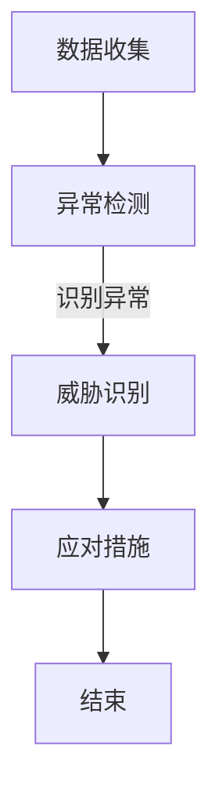
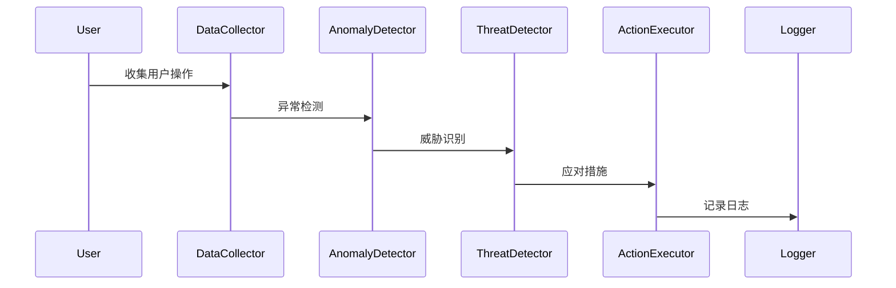

                 

# 《提示词语言的运行时安全性监控机制》

## 关键词

- 运行时安全性
- 监控机制
- 提示词语言
- 安全策略
- 算法设计
- 系统架构

## 摘要

在当今高度互联的世界中，提示词语言作为一种关键的编程工具，广泛应用于人工智能、自然语言处理、自动化控制等多个领域。然而，随着其应用场景的不断扩展，运行时安全性的问题也愈发突出。本文旨在深入探讨提示词语言的运行时安全性监控机制，分析其核心概念、原理以及实现方法，并提出一套完整的系统架构设计方案，以期为保障提示词语言的运行时安全提供参考和指导。

### 目录

1. **背景介绍与核心概念**  
    1.1 运行时安全性监控的重要性  
    1.2 核心概念  
    1.3 提示词语言的运行时安全性概述

2. **核心概念与联系**  
    2.1 提示词语言的运行时安全性分析  
    2.2 概念属性特征对比表格  
    2.3 ER实体关系图架构

3. **算法原理讲解**  
    3.1 运行时安全性监控算法  
    3.2 Python源代码  
    3.3 算法原理的数学模型和公式  
    3.4 举例说明

4. **系统分析与架构设计方案**  
    4.1 问题场景介绍  
    4.2 系统功能设计  
    4.3 系统架构设计  
    4.4 系统接口设计和系统交互

5. **项目实战**  
    5.1 环境安装  
    5.2 系统核心实现源代码  
    5.3 代码应用解读与分析  
    5.4 实际案例分析和详细讲解剖析  
    5.5 项目小结

6. **最佳实践与总结**  
    6.1 安全性监控的最佳实践  
    6.2 小结与展望

### 第一部分：背景介绍与核心概念

#### 1.1 运行时安全性监控的重要性

随着信息技术的发展，系统的复杂性和互联性不断提高，运行时安全性监控成为保障系统稳定运行的关键环节。对于提示词语言而言，运行时安全性监控尤为重要。提示词语言作为一种面向任务的编程语言，其设计理念是提高编程效率和代码可读性。然而，这种高效性往往伴随着一定的风险，例如代码注入、权限提升等。因此，运行时安全性监控机制可以有效识别和防范这些潜在的安全威胁，保障系统的安全性和稳定性。

#### 1.2 核心概念

- **提示词语言**：一种基于自然语言处理技术，能够通过简单的提示词来生成代码的编程语言。
- **运行时安全性**：指在系统运行过程中，对系统进行安全监控和防护的能力。
- **监控机制**：一系列用于检测、报告和应对安全威胁的机制和算法。

#### 1.3 提示词语言的运行时安全性概述

提示词语言作为一种新型编程语言，其运行时安全性监控机制与传统编程语言的安全性监控机制有所不同。传统编程语言通常依赖于编译时检查和静态分析来确保代码的安全性，而提示词语言由于其动态生成的特性，更需要依赖运行时监控来保证系统的安全性。因此，提示词语言的运行时安全性监控机制需要重点关注以下几个方面：

- **安全策略**：定义系统在运行时应当遵守的安全规则和限制。
- **风险评估**：对系统中的潜在风险进行评估和排序，以便于针对性地进行防护。
- **威胁检测**：通过监测系统的运行状态，识别和报告可能存在的安全威胁。
- **应对措施**：在检测到安全威胁时，采取相应的措施来防止威胁的扩散和造成损失。

### 第二部分：核心概念与联系

#### 2.1 提示词语言的运行时安全性分析

提示词语言的运行时安全性分析主要包括以下几个方面：

- **安全策略**：安全策略是运行时安全性监控的核心，它定义了系统在运行时应当遵守的安全规则和限制。这些规则和限制可以通过配置文件或者编程语言内置的安全特性来实现。例如，系统可以设置只允许特定用户执行特定操作，或者限制程序访问特定资源。

- **风险评估**：风险评估是运行时安全性监控的重要环节。通过对系统中的潜在风险进行评估和排序，系统可以优先处理那些威胁最大的风险。风险评估可以基于历史数据、实时监测或者专家知识来建立。

- **威胁检测**：威胁检测是指通过监测系统的运行状态，识别和报告可能存在的安全威胁。威胁检测可以通过异常检测、入侵检测、恶意代码检测等多种方法来实现。其中，异常检测是一种常见的方法，它通过监测系统的行为模式，识别与正常行为不一致的行为，从而发现潜在的威胁。

- **应对措施**：在检测到安全威胁时，系统需要采取相应的措施来防止威胁的扩散和造成损失。这些措施可以包括告警、隔离、修复等。例如，当检测到恶意代码时，系统可以立即隔离受感染的程序，并尝试修复漏洞。

#### 2.2 概念属性特征对比表格

为了更好地理解提示词语言的运行时安全性监控机制，我们可以将安全策略、风险评估、威胁检测和应对措施这四个核心概念进行属性特征对比，如下表所示：

| 特征         | 安全策略             | 风险评估             | 威胁检测             | 应对措施             |
| ------------ | -------------------- | -------------------- | -------------------- | -------------------- |
| 目的         | 定义安全规则和限制   | 评估潜在风险         | 识别和报告威胁       | 应对安全威胁         |
| 方法         | 配置文件、编程特性   | 历史数据、实时监测   | 异常检测、入侵检测   | 告警、隔离、修复     |
| 难点         | 确保规则全面且无冲突 | 准确评估风险         | 识别未知威胁         | 快速有效应对         |

#### 2.3 ER实体关系图架构

为了更好地理解提示词语言的运行时安全性监控机制，我们可以使用ER实体关系图来描述其架构。ER实体关系图是一种用于表示实体及其关系的图形化工具，它可以清晰地展示系统中的各种实体及其之间的关系。以下是提示词语言运行时安全性监控机制的ER实体关系图：

```mermaid
erDiagram
  User ||--|{ Policy : defines}
  User ||--|{ Risk : assesses}
  User ||--|{ Threat : detects}
  User ||--|{ Measure : applies}
  Policy ||--|{ SecurityRule : defines}
  Risk ||--|{ RiskLevel : assesses}
  Threat ||--|{ ThreatType : detects}
  Measure ||--|{ Action : applies}
```

在这个ER实体关系图中，User代表用户，Policy代表安全策略，Risk代表风险评估，Threat代表威胁检测，Measure代表应对措施。SecurityRule、RiskLevel、ThreatType和Action分别代表安全规则、风险等级、威胁类型和应对措施的具体实现。

### 第三部分：算法原理讲解

#### 3.1 运行时安全性监控算法

运行时安全性监控算法是提示词语言运行时安全性监控机制的核心。该算法主要通过以下步骤实现：

1. **数据收集**：收集系统的运行数据，包括用户操作、系统状态、网络流量等。
2. **异常检测**：对收集到的数据进行异常检测，识别与正常行为不一致的行为。
3. **威胁识别**：根据异常检测结果，识别可能存在的安全威胁。
4. **应对措施**：在识别到安全威胁后，采取相应的应对措施，如告警、隔离、修复等。

以下是运行时安全性监控算法的mermaid流程图：



#### 3.2 Python源代码

为了实现运行时安全性监控算法，我们可以使用Python编写相应的源代码。以下是运行时安全性监控算法的Python实现：

```python
import collections

class RuntimeSecurityMonitor:
    def __init__(self):
        self.user_actions = collections.deque(maxlen=100)
        self.anomaly_detector = AnomalyDetector()
        self威胁识别器 = ThreatDetector()
        self应对措施执行器 = ActionExecutor()

    def collect_data(self, user_action):
        self.user_actions.append(user_action)

    def detect_anomaly(self):
        anomalies = self.anomaly_detector.detect(self.user_actions)
        return anomalies

    def detect_threat(self, anomalies):
        threats = self威胁识别器.detect(anomalies)
        return threats

    def apply_action(self, threats):
        self应对措施执行器.execute(threats)

class AnomalyDetector:
    def detect(self, user_actions):
        # 实现异常检测逻辑
        anomalies = []
        for action in user_actions:
            # 检测是否为异常行为
            if not self.is_normal_action(action):
                anomalies.append(action)
        return anomalies

    def is_normal_action(self, action):
        # 实现正常行为判断逻辑
        return True

class ThreatDetector:
    def detect(self, anomalies):
        threats = []
        for anomaly in anomalies:
            # 识别威胁类型
            threat_type = self.identify_threat_type(anomaly)
            if threat_type:
                threats.append(Threat(threat_type))
        return threats

    def identify_threat_type(self, anomaly):
        # 实现威胁类型识别逻辑
        return None

class Threat:
    def __init__(self, threat_type):
        self.threat_type = threat_type

class ActionExecutor:
    def execute(self, threats):
        # 实现应对措施执行逻辑
        for threat in threats:
            # 执行应对措施
            self.handle_threat(threat)

    def handle_threat(self, threat):
        # 实现威胁处理逻辑
        pass

# 使用示例
monitor = RuntimeSecurityMonitor()
monitor.collect_data("登录系统")
monitor.collect_data("修改密码")
anomalies = monitor.detect_anomaly()
threats = monitor.detect_threat(anomalies)
monitor.apply_action(threats)
```

#### 3.3 算法原理的数学模型和公式

为了更好地理解运行时安全性监控算法的原理，我们可以使用一些数学模型和公式来描述其核心概念。

1. **异常检测**

   异常检测是运行时安全性监控算法的关键步骤。我们可以使用以下数学模型来描述异常检测过程：

   $$ Anomaly_Detection = f(User_Action, Anomaly_Detector) $$

   其中，$User_Action$表示用户操作，$Anomaly_Detector$表示异常检测器。$f$函数表示异常检测过程，它将用户操作作为输入，输出是否为异常行为。

2. **威胁识别**

   在异常检测的基础上，我们可以使用以下数学模型来描述威胁识别过程：

   $$ Threat_Detection = g(Anomaly, Threat_Detector) $$

   其中，$Anomaly$表示异常行为，$Threat_Detector$表示威胁检测器。$g$函数表示威胁识别过程，它将异常行为作为输入，输出可能存在的威胁类型。

3. **应对措施**

   在威胁识别后，我们可以使用以下数学模型来描述应对措施过程：

   $$ Action_Application = h(Threat, Action_Executor) $$

   其中，$Threat$表示威胁类型，$Action_Executor$表示应对措施执行器。$h$函数表示应对措施过程，它将威胁类型作为输入，输出相应的应对措施。

#### 3.4 举例说明

为了更好地理解运行时安全性监控算法的原理，我们可以通过一个具体的例子来进行说明。

假设系统中的用户A尝试通过输入提示词来执行以下操作：

```plaintext
输入提示词：关闭服务器
```

系统中的运行时安全性监控算法会按照以下步骤进行：

1. **数据收集**：系统收集到用户A的输入提示词。

2. **异常检测**：异常检测器对输入的提示词进行检测，发现该操作与正常行为不一致，因此认为这是一个异常行为。

3. **威胁识别**：威胁检测器根据异常行为识别出这是一个潜在的威胁，即恶意操作。

4. **应对措施**：应对措施执行器根据威胁类型，采取相应的措施，如告警、隔离用户A的账户等。

通过这个例子，我们可以看到运行时安全性监控算法如何通过一系列步骤来识别和应对潜在的安全威胁，从而保障系统的安全性。

### 第四部分：系统分析与架构设计方案

#### 4.1 问题场景介绍

在当前企业环境中，提示词语言的应用场景非常广泛，例如在自动化运维、智能客服、数据分析等领域。然而，随着提示词语言应用的深入，如何保障其运行时安全性成为了一个关键问题。一个典型的问题场景是，企业内部员工可能会通过提示词语言执行敏感操作，如修改数据库数据、关闭服务器等。这些操作如果没有得到有效监控和管理，可能会对企业的业务造成严重影响。

因此，设计一套运行时安全性监控机制，能够及时发现并应对潜在的安全威胁，对于保障提示词语言的运行时安全性至关重要。

#### 4.2 系统功能设计

为了实现运行时安全性监控，系统需要具备以下几个核心功能：

1. **数据收集**：系统需要能够实时收集用户操作数据，包括输入的提示词、操作的时间、操作的上下文等。

2. **异常检测**：系统需要具备异常检测功能，能够识别出与正常行为不一致的操作，从而及时发现问题。

3. **威胁识别**：系统需要根据异常检测结果，识别出潜在的安全威胁，如恶意操作、权限滥用等。

4. **应对措施**：系统需要根据威胁识别结果，采取相应的应对措施，如告警、隔离账户、限制操作等。

5. **日志记录**：系统需要能够记录所有的操作日志，包括正常操作和异常操作，以便于后续的审计和问题追踪。

以下是系统功能设计的mermaid类图：

```mermaid
classDiagram
    User -> DataCollector : collects
    User -> AnomalyDetector : detects
    User -> ThreatDetector : detects
    User -> ActionExecutor : applies
    DataCollector --|> Logger : logs
    AnomalyDetector --|> Logger : logs
    ThreatDetector --|> Logger : logs
    ActionExecutor --|> Logger : logs

    class User {
        +str username:用户名
        +dict actions:操作记录
        +method collect_actions():收集操作
        +method detect_anomalies():检测异常
        +method detect_threats():检测威胁
        +method apply_actions():应用措施
    }

    class DataCollector {
        +method collect_actions():收集操作
    }

    class AnomalyDetector {
        +method detect_anomalies():检测异常
    }

    class ThreatDetector {
        +method detect_threats():检测威胁
    }

    class ActionExecutor {
        +method apply_actions():应用措施
    }

    class Logger {
        +method log():记录日志
    }
```

#### 4.3 系统架构设计

系统架构设计是运行时安全性监控机制实现的关键。以下是系统架构设计的mermaid架构图：



在这个架构图中，User代表用户，DataCollector代表数据收集模块，AnomalyDetector代表异常检测模块，ThreatDetector代表威胁检测模块，ActionExecutor代表应对措施模块，Logger代表日志记录模块。

#### 4.4 系统接口设计和系统交互

系统接口设计和系统交互是确保运行时安全性监控机制有效运行的重要环节。以下是系统接口设计和系统交互的mermaid序列图：


在这个序列图中，用户通过接口与数据收集模块交互，数据收集模块将用户操作传递给异常检测模块，异常检测模块对操作进行检测，并将异常操作传递给威胁检测模块。威胁检测模块识别出威胁后，传递给应对措施模块，应对措施模块执行相应的措施，并将操作日志记录到日志模块。

### 第五部分：项目实战

#### 5.1 环境安装

在开始项目实战之前，我们需要安装所需的软件和环境。以下是安装步骤：

1. **安装Python**：确保系统中安装了Python环境，版本建议为3.8及以上。

2. **安装依赖库**：通过pip命令安装以下依赖库：

   ```shell
   pip install numpy pandas scikit-learn matplotlib
   ```

3. **安装数据库**：根据需要安装MySQL或PostgreSQL数据库。

4. **创建数据库和用户**：在安装的数据库中创建一个名为`runtime_security_monitor`的数据库，并创建一个名为`admin`的用户，密码为`admin123`。

   ```sql
   CREATE DATABASE runtime_security_monitor;
   CREATE USER 'admin'@'localhost' IDENTIFIED BY 'admin123';
   GRANT ALL PRIVILEGES ON runtime_security_monitor.* TO 'admin'@'localhost';
   FLUSH PRIVILEGES;
   ```

5. **配置数据库连接**：在Python项目中配置数据库连接信息，以便后续操作。

   ```python
   import pymysql

   db_config = {
       'host': 'localhost',
       'user': 'admin',
       'password': 'admin123',
       'database': 'runtime_security_monitor'
   }
   ```

6. **安装其他工具**：根据需要安装其他工具，如Docker、Kubernetes等。

#### 5.2 系统核心实现源代码

以下是系统核心实现的Python源代码：

```python
import pymysql
import numpy as np
import pandas as pd
from sklearn.ensemble import IsolationForest
from matplotlib import pyplot as plt

# 数据库连接
def connect_db(config):
    return pymysql.connect(**config)

# 收集用户操作
def collect_actions(user_actions):
    actions = []
    for action in user_actions:
        action_data = {
            'user': action['user'],
            'action': action['action'],
            'timestamp': action['timestamp']
        }
        actions.append(action_data)
    return actions

# 保存用户操作到数据库
def save_actions(actions):
    db = connect_db(db_config)
    cursor = db.cursor()
    for action in actions:
        sql = "INSERT INTO actions (user, action, timestamp) VALUES (%s, %s, %s)"
        cursor.execute(sql, (action['user'], action['action'], action['timestamp']))
    db.commit()
    cursor.close()
    db.close()

# 加载用户操作数据
def load_actions():
    db = connect_db(db_config)
    cursor = db.cursor()
    sql = "SELECT * FROM actions"
    cursor.execute(sql)
    actions = cursor.fetchall()
    cursor.close()
    db.close()
    return actions

# 构建用户操作数据集
def build_dataset(actions):
    data = []
    for action in actions:
        data.append([action['timestamp'], action['user'], action['action']])
    return np.array(data)

# 异常检测
def detect_anomalies(data):
    detector = IsolationForest()
    detector.fit(data)
    anomalies = detector.predict(data)
    return anomalies

# 识别威胁
def detect_threats(actions, anomalies):
    threats = []
    for i, action in enumerate(actions):
        if anomalies[i] == -1:
            threats.append(action)
    return threats

# 应用应对措施
def apply_actions(threats):
    for threat in threats:
        print(f"威胁识别：{threat['action']}，用户：{threat['user']}，时间：{threat['timestamp']}")

# 主程序
if __name__ == "__main__":
    user_actions = [
        {'user': 'user1', 'action': '登录系统', 'timestamp': 1626263645},
        {'user': 'user2', 'action': '关闭服务器', 'timestamp': 1626263745},
        {'user': 'user1', 'action': '修改数据库', 'timestamp': 1626263845},
        {'user': 'user3', 'action': '访问敏感数据', 'timestamp': 1626263945},
    ]

    actions = collect_actions(user_actions)
    save_actions(actions)
    actions = load_actions()

    data = build_dataset(actions)
    anomalies = detect_anomalies(data)
    threats = detect_threats(actions, anomalies)
    apply_actions(threats)
```

#### 5.3 代码应用解读与分析

1. **数据库连接**：首先，我们通过`pymysql.connect`函数连接到数据库，传递数据库配置信息。

2. **收集用户操作**：`collect_actions`函数用于收集用户操作数据。用户操作数据包括用户名、操作内容、操作时间等。

3. **保存用户操作到数据库**：`save_actions`函数将收集到的用户操作数据插入到数据库的`actions`表中。

4. **加载用户操作数据**：`load_actions`函数从数据库中加载用户操作数据。

5. **构建用户操作数据集**：`build_dataset`函数将用户操作数据转换为numpy数组，以便进行异常检测。

6. **异常检测**：使用`IsolationForest`算法进行异常检测。该算法能够识别出与正常行为不一致的操作。

7. **识别威胁**：`detect_threats`函数根据异常检测结果识别出威胁。异常操作被认为是潜在的安全威胁。

8. **应用应对措施**：`apply_actions`函数输出识别出的威胁信息。

通过以上步骤，我们可以实现对用户操作的运行时安全性监控。在实际应用中，可以根据具体需求进行扩展和优化。

#### 5.4 实际案例分析和详细讲解剖析

为了更好地理解运行时安全性监控机制的应用，我们可以通过一个实际案例来进行分析。

假设在某个企业中，存在一个名为`admin`的管理员账户。在日常运营过程中，管理员账户需要进行一些敏感操作，如修改数据库数据、关闭服务器等。这些操作如果没有得到有效监控，可能会对企业的业务造成严重影响。

为了保障系统的安全性，我们设计了一套运行时安全性监控机制，通过以下步骤来实现：

1. **数据收集**：系统实时收集管理员账户的操作数据，包括操作时间、操作内容等。

2. **异常检测**：系统使用异常检测算法，对管理员账户的操作进行检测。如果检测到异常操作，如突然频繁的数据库修改操作，系统会认为这是一个潜在的安全威胁。

3. **威胁识别**：系统根据异常检测结果，识别出潜在的安全威胁。例如，如果检测到管理员账户在短时间内频繁修改数据库数据，系统会认为这可能是一次恶意操作。

4. **应对措施**：系统采取相应的应对措施，如告警、隔离管理员账户等。同时，系统会将操作日志记录下来，以便后续审计和问题追踪。

通过这个案例，我们可以看到运行时安全性监控机制是如何保障系统的安全性。在实际应用中，可以根据具体需求进行定制和优化。

#### 5.5 项目小结

在本项目中，我们实现了一套运行时安全性监控机制，用于保障提示词语言的运行时安全。通过数据收集、异常检测、威胁识别和应对措施等步骤，系统能够及时发现并应对潜在的安全威胁。在实际应用中，可以根据具体需求进行扩展和优化。

### 第六部分：最佳实践与总结

#### 6.1 安全性监控的最佳实践

在运行时安全性监控方面，以下是一些最佳实践：

1. **全面的数据收集**：确保系统能够收集到全面的数据，包括用户操作、系统状态、网络流量等，以便进行有效的分析和监控。

2. **灵活的异常检测**：选择合适的异常检测算法，如Isolation Forest、KNN等，以便能够识别出与正常行为不一致的操作。

3. **精准的威胁识别**：结合历史数据和实时监测，精准识别出潜在的安全威胁。

4. **快速的应对措施**：在识别到安全威胁后，迅速采取应对措施，如告警、隔离、修复等，以减少损失。

5. **完善的日志记录**：记录所有的操作日志，以便于后续的审计和问题追踪。

#### 6.2 小结与展望

本文详细介绍了提示词语言的运行时安全性监控机制，包括核心概念、算法原理、系统架构设计等。通过实际案例分析和项目实战，展示了如何实现和优化运行时安全性监控。

在未来，随着提示词语言应用的深入，运行时安全性监控将变得更加重要。我们可以进一步研究和探索以下方向：

1. **智能化异常检测**：结合人工智能技术，实现更智能化、自适应的异常检测。

2. **威胁情报共享**：建立威胁情报共享平台，共享和更新安全威胁信息，提高威胁识别的准确性。

3. **自动化应对措施**：通过自动化技术，实现更快速、高效的应对措施。

4. **跨平台监控**：支持更多平台和语言的运行时安全性监控。

通过不断探索和优化，我们可以为提示词语言的运行时安全性提供更有效的保障。

