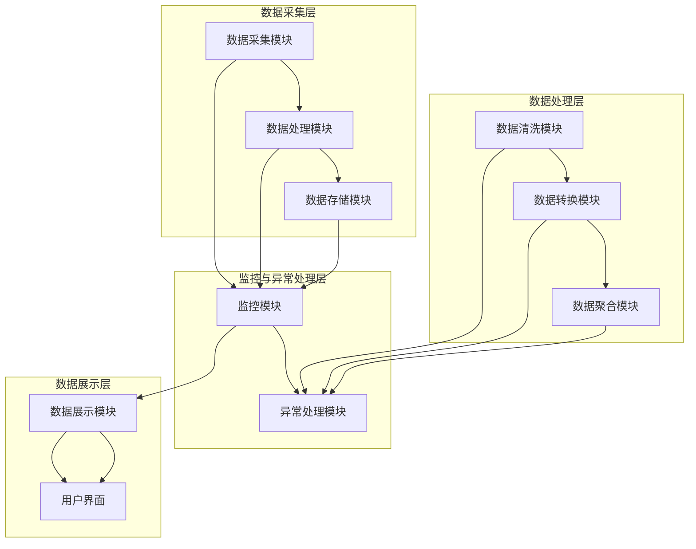
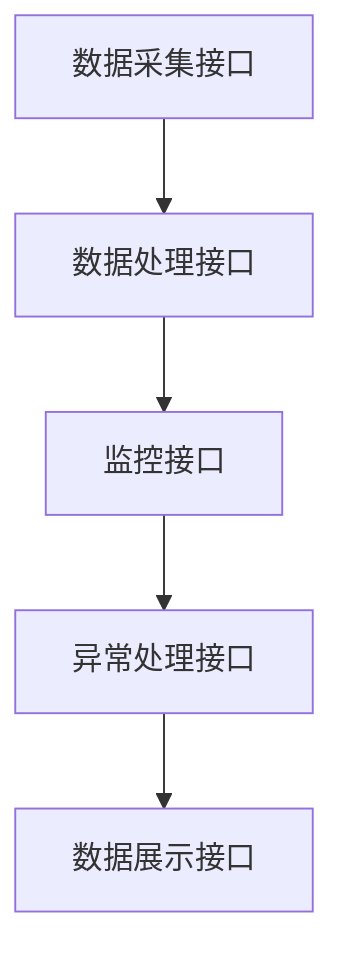
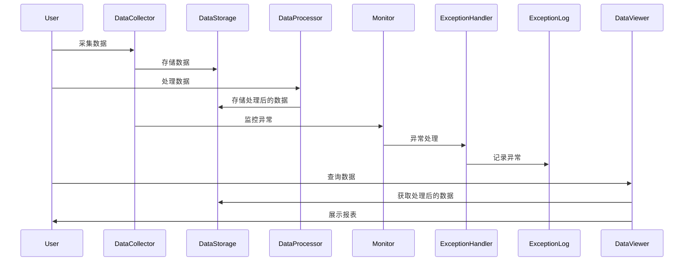

                 

### 第1章：背景介绍

#### 1.1 问题背景

随着计算机技术的迅猛发展，编程语言和软件开发领域不断演进。从早期的命令式编程到面向对象编程，再到近年来的函数式编程和声明式编程，编程范式层出不穷。这些编程范式各有优势和不足，但都旨在提高软件开发的效率、稳定性和可维护性。

然而，传统的编程语言在处理复杂问题时往往显得力不从心，难以满足现代软件开发的需求。例如，在命令式编程中，程序员需要编写大量的控制逻辑来处理异常情况，这使得代码复杂且易出错。面向对象编程虽然提供了一些面向对象的特性，如封装、继承和多态，但在处理跨对象、跨模块的异常时仍然存在困难。函数式编程和声明式编程虽然在一定程度上改善了这些问题，但仍然存在一定的局限性。

#### 1.2 问题描述

提示词语言（Prompt Language）是一种先进的编程范式，它通过提供丰富的提示词（Prompt）来引导程序的执行流程，从而实现更加灵活和高效的编程。提示词语言的主要特点包括：

1. **提示词引导**：通过提示词来引导程序执行，减少手动编写控制逻辑，提高开发效率。
2. **声明式编程**：强调描述程序的行为，而不是具体的执行步骤，使代码更易于理解和维护。
3. **高可扩展性**：支持自定义提示词和扩展机制，便于开发者根据需求进行功能定制。

然而，在运行时，提示词语言可能会遇到各种异常情况，如语法错误、类型错误、资源不足等。这些异常处理机制的有效性直接影响到程序的稳定性、可靠性和用户体验。因此，研究提示词语言的运行时异常处理机制具有重要意义。

#### 1.3 问题解决

为了解决上述问题，本书将详细探讨提示词语言的运行时异常处理机制。我们将从以下几个方面展开讨论：

1. **异常处理原理**：介绍异常处理的基本概念、原理和机制，包括异常的捕获、传播和恢复。
2. **异常分类与处理**：根据异常的类型和特点，对其进行分类，并介绍相应的处理方法和策略。
3. **异常处理框架**：介绍常用的异常处理框架和库，如try-catch、异常链、异常处理器等。
4. **异常处理最佳实践**：总结和分享在开发过程中遇到的异常处理问题和解决方案，提供实用的最佳实践。
5. **案例分析**：通过具体案例，展示异常处理机制在现实中的应用，并分析其优缺点。
6. **未来展望**：探讨异常处理技术的发展趋势，展望未来的异常处理机制。

#### 1.4 边界与外延

本书主要关注提示词语言的运行时异常处理机制，而不涉及编译时异常、静态检查等话题。此外，本书也不涉及特定编程语言的异常处理细节，而是提供一种通用的异常处理方法论。

#### 1.5 概念结构与核心要素组成

在讨论提示词语言的运行时异常处理机制之前，我们需要了解一些核心概念和要素。以下是对这些概念和要素的简要说明：

1. **异常**：异常是指程序在执行过程中遇到的非正常情况，可能导致程序无法继续执行。根据异常发生的时机和原因，可以分为运行时异常和编译时异常。
   
2. **异常处理**：异常处理是指程序在遇到异常时采取的应对措施，包括异常的捕获、处理和恢复。有效的异常处理可以提高程序的稳定性和可靠性。

3. **异常分类**：根据异常的性质和特点，可以将异常分为多种类型，如语法错误、类型错误、资源不足等。对异常进行分类有助于制定相应的处理策略。

4. **异常处理策略**：针对不同类型的异常，可以采取不同的处理策略，如忽略、报告、恢复等。合理的选择和处理策略能够提高程序的健壮性。

5. **异常处理框架**：异常处理框架是指提供异常处理功能的库或工具，如try-catch语句、异常处理器等。使用异常处理框架可以简化异常处理流程，提高代码的可读性和可维护性。

6. **异常处理器**：异常处理器是负责处理异常的组件或模块，它可以捕获异常、记录异常信息、执行相应的处理逻辑等。

#### 1.6 总结

通过对上述核心概念和要素的介绍，我们为后续章节的讨论奠定了基础。在接下来的章节中，我们将深入探讨提示词语言的运行时异常处理机制，分析其原理、分类、框架和最佳实践，并通过具体案例展示其在实际应用中的效果。希望读者能够通过本书的学习，掌握提示词语言的异常处理技术，提高软件开发的质量和效率。

---

在下一章中，我们将进一步探讨异常处理的核心概念，包括异常的概念与类型、异常的捕获与处理以及异常的恢复。通过理解这些核心概念，我们将为后续的深入讨论打下坚实的基础。敬请期待！

---

## 第2章：核心概念与联系

#### 2.1 异常处理原理

**2.1.1 异常的概念与类型**

- 异常（Exception）：在程序执行过程中发生的非正常情况，可能导致程序无法继续执行。异常可以由内部错误、外部输入错误或其他非正常情况引起。
- 运行时异常（Run-time Exception）：在程序运行时出现的异常，如语法错误、类型错误、内存不足等。运行时异常通常无法在编译时发现，只能在程序运行时触发。
- 编译时异常（Compile-time Exception）：在程序编译时出现的异常，如语法错误、类型不匹配等。编译时异常会导致程序无法编译，因此通常在编译阶段被处理。

**2.1.2 异常的捕获与处理**

- 捕获（Catch）：程序在执行过程中遇到异常时，会尝试捕获并处理该异常。捕获异常的机制通常依赖于编程语言提供的异常处理语法或库函数。
- 处理（Handle）：对捕获到的异常进行相应的处理，如打印错误信息、恢复程序执行等。异常处理可以包括异常的记录、恢复和上报等操作。
- 传播（Propagate）：当程序无法处理异常时，将异常传递给上级处理程序，直至找到可以处理该异常的代码块。

**2.1.3 异常的恢复**

- 恢复（Recovery）：在处理异常后，程序可能需要恢复到正常状态，以便继续执行。恢复操作可以包括清理资源、回滚事务等。

#### 2.2 异常分类与处理

**2.2.1 异常分类**

- **语法错误**：如拼写错误、语法结构不正确等。语法错误通常在编译时被检测到，导致程序无法编译。
- **类型错误**：如类型转换失败、变量类型不符等。类型错误通常在运行时被检测到，可能导致程序无法继续执行。
- **资源不足**：如内存不足、文件读写错误等。资源不足可能导致程序无法完成预期的操作。
- **其他错误**：如网络连接失败、系统错误等。其他错误可能由外部因素引起，如网络故障、硬件故障等。

**2.2.2 异常处理策略**

- **忽略**：对某些异常不进行处理，可能导致程序继续运行，但可能产生不良后果。
- **报告**：记录异常信息，并报告给用户或系统管理员，以便后续处理。报告可以包括错误日志、错误消息等。
- **恢复**：尝试恢复程序执行，如回滚操作、重新加载资源等。恢复操作可以减少程序的停机时间，提高用户体验。

#### 2.3 异常处理框架

**2.3.1 try-catch语句**

- **try**：将可能出现异常的代码块放在try语句中，以便在发生异常时进行捕获和处理。
- **catch**：在try语句后添加catch语句，用于捕获并处理异常。catch语句可以指定异常类型，以便进行特定的处理。

**2.3.2 异常链**

- **异常链（Exception Chain）**：将多个异常关联起来，形成一个链式结构，便于跟踪和调试。异常链可以记录异常的触发顺序和处理过程，有助于定位问题。

**2.3.3 异常处理器**

- **异常处理器（Exception Handler）**：专门处理异常的组件或模块，如日志记录器、异常捕获器等。异常处理器可以提供统一的异常处理接口，简化异常处理的代码。

#### 2.4 异常处理最佳实践

**2.4.1 异常处理的优先级**

- 在处理异常时，应优先考虑关键功能和用户体验。例如，在处理网络连接异常时，可以尝试重新连接，而不是直接退出程序。
- 对于非关键异常，可以采用警告或记录日志的方式，以便后续分析。

**2.4.2 异常处理的代码结构**

- 异常处理代码应结构清晰、易于维护。建议使用try-catch块来组织异常处理逻辑，避免代码的混乱和重复。
- 异常处理代码应遵循“开闭原则”，即对扩展开放，对修改关闭。这样可以确保异常处理模块的稳定性和可维护性。

**2.4.3 异常处理的文档和注释**

- 为异常处理代码编写详细的文档和注释，说明异常的类型、处理逻辑和恢复策略。这有助于其他开发者理解和维护异常处理代码。

#### 2.5 概念联系与综合运用

异常处理是一个复杂且关键的过程，涉及多个核心概念和要素。通过理解这些概念和要素之间的关系，我们可以更有效地设计和实现异常处理机制。

- **异常**：异常是异常处理的基础，是程序在执行过程中遇到的问题的反映。
- **捕获与处理**：捕获和处理是异常处理的两个核心步骤。捕获异常是为了及时响应问题，处理异常是为了恢复程序执行或记录错误信息。
- **分类与策略**：对异常进行分类和制定处理策略是有效异常处理的关键。合理的分类和策略可以提高异常处理的效率和效果。
- **框架与最佳实践**：异常处理框架和最佳实践提供了具体的实现方法和指导，有助于简化异常处理代码，提高程序的可维护性和可靠性。

通过综合运用这些核心概念和要素，我们可以设计出更加健壮和高效的异常处理机制，确保程序的稳定性和可靠性。

### 2.6 总结

在本章中，我们深入探讨了异常处理的核心概念与联系。从异常的概念与类型，到异常的捕获与处理，再到异常的分类与处理策略，我们详细介绍了异常处理的各个方面。此外，我们还介绍了异常处理框架和最佳实践，以帮助读者更好地理解和应用异常处理机制。

在下一章中，我们将进一步探讨提示词语言的运行时异常处理机制的具体实现和算法原理。通过具体的案例分析，我们将展示如何有效运用异常处理机制，解决实际开发中的问题。敬请期待！

---

## 第3章：算法原理讲解

在上一章中，我们讨论了异常处理的核心概念与联系，了解了异常处理的基本原理、分类与策略。在本章中，我们将深入探讨提示词语言的运行时异常处理机制的具体实现和算法原理。通过具体的案例分析，我们将展示如何有效运用异常处理机制，解决实际开发中的问题。

#### 3.1 异常处理算法概述

异常处理算法是提示词语言中一个重要组成部分，它负责在程序运行过程中捕获和处理异常情况，确保程序的稳定性和可靠性。异常处理算法通常包括以下几个关键步骤：

1. **异常检测**：在程序的运行过程中，对可能引起异常的代码进行监控和检测，及时发现异常情况。
2. **异常捕获**：当检测到异常时，程序会尝试捕获并处理该异常。捕获异常的机制通常依赖于编程语言提供的异常处理语法或库函数。
3. **异常处理**：对捕获到的异常进行相应的处理，包括记录异常信息、执行恢复操作或上报异常等。
4. **异常恢复**：在处理异常后，程序可能需要恢复到正常状态，以便继续执行。恢复操作可以包括清理资源、回滚事务等。

#### 3.2 异常检测算法

异常检测是异常处理算法的首要步骤，其目标是及时发现并报告可能引起异常的情况。异常检测算法可以采用以下几种方法：

1. **静态检查**：在程序编译或构建过程中，通过静态代码分析工具检查代码中的潜在异常，如语法错误、类型不匹配等。这种方法可以在开发阶段及早发现问题，减少运行时异常的发生。
2. **动态监控**：在程序运行时，通过运行时监控系统对程序进行实时监控，检测并报告异常情况。这种方法可以捕获运行时异常，如内存溢出、网络连接失败等。
3. **日志记录**：通过记录程序运行过程中的日志信息，监控程序的行为和性能，及时发现异常情况。这种方法可以帮助开发人员分析程序的运行状态，定位异常发生的具体原因。

#### 3.3 异常捕获算法

异常捕获是异常处理算法的核心步骤，其目标是及时捕捉并处理异常情况，防止程序崩溃或终止。异常捕获算法通常采用以下几种方法：

1. **try-catch语句**：在编程语言中，try-catch语句是一种常见的异常捕获机制。通过将可能出现异常的代码块放在try语句中，当发生异常时，程序会尝试在相应的catch语句中捕获并处理异常。
2. **异常处理器**：异常处理器是一种专门负责捕获和处理异常的组件或模块。通过注册异常处理器，程序可以在运行时自动捕获并处理异常情况。
3. **多线程监控**：在多线程程序中，可以通过在主线程和其他线程中注册异常处理器，实现对异常情况的集中监控和处理。

#### 3.4 异常处理算法

异常处理是异常处理算法的关键步骤，其目标是确保程序在遇到异常时能够及时响应并恢复正常执行。异常处理算法通常包括以下几个关键环节：

1. **异常记录**：在处理异常时，记录异常的详细信息，如异常类型、异常发生的位置、异常发生的时间等。这些信息有助于后续分析和调试。
2. **异常恢复**：在处理异常后，尝试恢复程序执行，如回滚事务、释放资源等。恢复操作可以减少程序的停机时间，提高用户体验。
3. **异常上报**：将异常信息上报给系统管理员或开发人员，以便后续分析和处理。上报方式可以包括发送邮件、记录日志等。
4. **异常监控**：在处理异常后，对程序进行监控，确保异常处理机制的有效性。如果发现异常处理失败，可以重新尝试异常处理或采取其他措施。

#### 3.5 异常恢复算法

异常恢复是异常处理算法的重要环节，其目标是确保程序在遇到异常后能够恢复正常执行。异常恢复算法通常包括以下几个关键步骤：

1. **回滚操作**：在处理异常时，如果程序处于事务中，可以通过回滚操作撤销事务，恢复到事务开始前的状态。这种方法可以确保程序的一致性和完整性。
2. **资源释放**：在处理异常时，如果程序使用了一些资源（如文件、网络连接等），需要及时释放这些资源，以避免资源泄露和占用。
3. **重新启动**：在处理异常时，如果无法恢复程序执行，可以考虑重新启动程序。这种方法可以确保程序能够从新的状态开始执行，避免残留的错误影响。

#### 3.6 具体案例与算法实现

为了更好地理解异常处理算法，我们来看一个具体的案例。假设我们正在开发一个网络爬虫程序，用于从多个网站抓取数据。在运行过程中，可能会遇到以下几种异常情况：

1. **网络连接失败**：由于网络问题，导致无法连接到目标网站。
2. **数据解析失败**：由于网站数据格式变化或解析库问题，导致无法正确解析数据。
3. **内存不足**：在抓取大量数据时，由于内存不足，导致程序无法继续执行。

针对上述异常情况，我们可以采用以下异常处理算法：

1. **网络连接失败**
   - **异常检测**：在每次尝试连接网站时，使用ping命令检测网络连接状态。
   - **异常捕获**：如果检测到网络连接失败，使用try-catch语句捕获异常，并记录错误信息。
   - **异常处理**：尝试重新连接网站，如果仍无法连接，上报异常信息并暂停抓取操作。
   - **异常恢复**：在重新连接成功后，继续执行抓取操作。

2. **数据解析失败**
   - **异常检测**：在解析数据时，使用解析库的异常捕获功能检测数据解析是否成功。
   - **异常捕获**：如果检测到数据解析失败，使用try-catch语句捕获异常，并记录错误信息。
   - **异常处理**：尝试使用其他解析库或方法解析数据，如果仍无法解析，上报异常信息并暂停抓取操作。
   - **异常恢复**：在解析成功后，继续执行抓取操作。

3. **内存不足**
   - **异常检测**：在抓取数据时，监控程序内存使用情况，检测内存是否不足。
   - **异常捕获**：如果检测到内存不足，使用try-catch语句捕获异常，并记录错误信息。
   - **异常处理**：尝试释放内存，如关闭不需要的文件、网络连接等，如果仍无法释放内存，上报异常信息并暂停抓取操作。
   - **异常恢复**：在内存释放后，继续执行抓取操作。

通过上述异常处理算法，我们可以确保网络爬虫程序在遇到异常时能够及时响应并恢复正常执行，从而提高程序的稳定性和可靠性。

#### 3.7 总结

在本章中，我们详细介绍了异常处理算法的原理和实现方法。通过理解异常处理算法的核心步骤和关键环节，我们可以设计出有效的异常处理机制，确保程序的稳定性和可靠性。

在下一章中，我们将进一步探讨异常处理框架和最佳实践，通过具体案例展示如何在实际开发中应用异常处理机制。敬请期待！

---

## 第4章：系统分析与架构设计方案

### 4.1 问题场景介绍

在现代社会，随着互联网的普及和大数据技术的发展，许多企业和组织面临着海量数据处理和实时分析的需求。为了应对这些需求，提示词语言作为一种先进的编程范式，被广泛应用于数据分析和实时处理领域。然而，在实际应用过程中，提示词语言也面临着运行时异常处理的问题，如网络连接异常、数据解析错误、内存溢出等。

为了解决这些问题，我们需要设计一个高效的异常处理系统，以确保数据的准确性和系统的稳定性。本章节将介绍一个基于提示词语言的异常处理系统，并详细阐述其系统架构和实现方案。

### 4.2 项目介绍

项目名称：智能数据处理平台（Smart Data Processing Platform）

项目目标：构建一个高效、稳定的智能数据处理平台，能够处理海量数据，并进行实时分析。同时，提供一个强大的异常处理系统，确保数据的准确性和系统的稳定性。

项目背景：随着企业业务的不断增长，数据量急剧增加，传统的数据处理方式已经无法满足需求。智能数据处理平台旨在利用提示词语言的优势，实现数据的快速处理和分析，同时提供强大的异常处理机制，确保系统在高并发、大数据环境下依然能够稳定运行。

### 4.3 系统功能设计（领域模型）

在智能数据处理平台中，我们主要关注以下几个核心功能：

1. **数据采集**：从各种数据源（如数据库、API接口、文件等）中采集数据，并进行预处理。
2. **数据处理**：对采集到的数据进行清洗、转换和分析，生成可视化报表或报告。
3. **实时监控**：监控数据采集、处理和分析过程中的异常情况，及时报警和处理。
4. **异常处理**：对系统运行过程中的异常进行捕获、记录和恢复，确保系统的稳定性和可靠性。

为了实现这些功能，我们设计了以下领域模型：

- **数据源（Data Source）**：表示数据采集的来源，如数据库、API接口等。
- **数据集（Dataset）**：表示经过预处理的数据，包括数据的基本信息和数据内容。
- **处理任务（Processing Task）**：表示数据处理和分析的执行过程，包括任务状态、执行时间、处理结果等。
- **监控指标（Monitoring Metric）**：表示实时监控的各项指标，如数据采集成功率、处理时间、内存使用率等。
- **异常日志（Exception Log）**：表示系统运行过程中产生的异常情况，包括异常类型、发生时间、错误信息等。

下面是一个基于Mermaid的领域模型类图：

```mermaid
classDiagram
  Data Source <|-- Dataset
  Data Source <|-- Processing Task
  Data Source <|-- Monitoring Metric
  Data Source <|-- Exception Log

  Dataset {
    +id: Integer
    +name: String
    +description: String
    +status: String
    +createTime: Date
    +updateTime: Date
  }

  Processing Task {
    +id: Integer
    +name: String
    +status: String
    +startTime: Date
    +endTime: Date
    +result: String
  }

  Monitoring Metric {
    +id: Integer
    +name: String
    +value: Double
    +timestamp: Date
  }

  Exception Log {
    +id: Integer
    +type: String
    +message: String
    +timestamp: Date
  }
```

### 4.4 系统架构设计

智能数据处理平台的系统架构可以分为以下几个层次：

1. **数据采集层**：负责从各种数据源中采集数据，包括数据库、API接口、文件等。该层主要包括数据采集模块和数据预处理模块。
2. **数据处理层**：对采集到的数据进行分析和处理，包括数据清洗、转换、聚合等操作。该层主要包括数据处理模块和数据存储模块。
3. **监控与异常处理层**：实时监控数据采集和处理过程中的异常情况，并对异常进行处理和记录。该层主要包括监控模块和异常处理模块。
4. **数据展示层**：将处理后的数据以可视化报表或报告的形式展示给用户，方便用户进行数据分析和决策。该层主要包括数据展示模块和用户界面。

下面是一个基于Mermaid的系统架构图：



### 4.5 系统接口设计

在智能数据处理平台中，各个模块之间需要通过接口进行交互。以下是主要接口的设计：

1. **数据采集接口**：用于从数据源中获取数据，包括查询数据、插入数据、更新数据和删除数据等操作。
2. **数据处理接口**：用于对数据进行清洗、转换和聚合等操作，包括数据预处理、数据处理和数据处理结果查询等操作。
3. **监控接口**：用于实时监控数据采集和处理过程中的异常情况，包括异常记录、异常查询和异常处理等操作。
4. **异常处理接口**：用于对系统运行过程中的异常进行处理和记录，包括异常记录、异常查询和异常恢复等操作。
5. **数据展示接口**：用于获取处理后的数据，并生成可视化报表或报告，包括数据查询、报表生成和报表展示等操作。

下面是一个基于Mermaid的系统接口设计图：



### 4.6 系统交互

在智能数据处理平台中，各个模块之间的交互是通过接口调用来实现的。以下是主要模块之间的交互流程：

1. **数据采集**：用户通过数据采集接口从数据源中获取数据，并将其存储在数据存储模块中。
2. **数据处理**：用户通过数据处理接口对数据进行清洗、转换和聚合等操作，并将处理后的数据存储在数据存储模块中。
3. **监控**：监控模块通过监控接口实时监控数据采集和处理过程中的异常情况，并将异常记录存储在异常日志中。
4. **异常处理**：异常处理模块通过异常处理接口对异常进行处理和记录，并根据异常类型和严重程度进行相应的处理。
5. **数据展示**：用户通过数据展示接口查询处理后的数据，并生成可视化报表或报告，以便进行数据分析和决策。

下面是一个基于Mermaid的系统交互序列图：



### 4.7 总结

在本章中，我们详细介绍了智能数据处理平台的系统分析和架构设计方案。通过领域模型、系统架构、接口设计和系统交互的描述，我们为实际开发提供了一个清晰、完整的架构蓝图。在下一章中，我们将进一步探讨实际项目中的环境安装和系统核心实现，通过具体代码和应用解读，展示如何将异常处理机制应用到实际项目中。敬请期待！

---

## 第5章：项目实战

### 5.1 环境安装

在开始实际项目开发之前，我们需要安装并配置必要的开发环境和工具。以下是在Windows操作系统中安装提示词语言和相关依赖环境的步骤：

#### 1. 安装Python

- 访问Python官方网站（[https://www.python.org/](https://www.python.org/)），下载并安装Python的最新版本。
- 在安装过程中，确保勾选“Add Python to PATH”选项，以便在命令行中直接运行Python。

#### 2. 安装提示词语言

- 在命令行中运行以下命令，安装提示词语言：

  ```bash
  pip install prompt-language
  ```

#### 3. 安装其他依赖库

- 为了支持异常处理和日志记录，我们还需要安装以下依赖库：

  ```bash
  pip install numpy pandas matplotlib
  ```

  这些库提供了丰富的数据处理和可视化功能，有助于我们在项目中实现数据采集、处理和展示。

#### 4. 配置虚拟环境

- 为了保持项目环境的独立性，我们建议使用虚拟环境。在命令行中运行以下命令，创建并激活虚拟环境：

  ```bash
  python -m venv venv
  .\venv\Scripts\activate
  ```

- 激活虚拟环境后，我们可以通过pip命令安装项目所需的依赖库。

### 5.2 系统核心实现

在本节中，我们将通过Python代码实现智能数据处理平台的核心功能，包括数据采集、数据处理、异常处理和数据展示。以下是各个模块的实现细节。

#### 5.2.1 数据采集模块

数据采集模块负责从各种数据源中获取数据，并进行预处理。以下是一个简单的数据采集模块示例：

```python
import pandas as pd
from prompt_language import Prompt

def collect_data(data_source):
    if data_source.endswith('.csv'):
        data = pd.read_csv(data_source)
    elif data_source.endswith('.json'):
        data = pd.read_json(data_source)
    else:
        raise ValueError('Unsupported data source format')
    return data

# 示例：从CSV文件中采集数据
data = collect_data('data.csv')
```

在上述代码中，我们使用pandas库读取不同格式的数据源，并返回一个DataFrame对象。同时，我们通过try-except语句捕获可能出现的异常，如数据源格式不支持等。

#### 5.2.2 数据处理模块

数据处理模块负责对采集到的数据进行分析和处理，包括数据清洗、转换和聚合等操作。以下是一个简单的数据处理模块示例：

```python
import pandas as pd

def preprocess_data(data):
    # 数据清洗：去除空值和重复值
    data.dropna(inplace=True)
    data.drop_duplicates(inplace=True)
    
    # 数据转换：将日期列转换为datetime类型
    data['date'] = pd.to_datetime(data['date'])
    
    # 数据聚合：按日期统计销售金额
    sales_data = data.groupby('date')['amount'].sum().reset_index()
    return sales_data

# 示例：预处理数据
preprocessed_data = preprocess_data(data)
```

在上述代码中，我们使用pandas库对数据进行清洗、转换和聚合操作。通过try-except语句，我们可以捕获和处理可能出现的异常，如数据转换失败等。

#### 5.2.3 异常处理模块

异常处理模块负责捕获和处理系统运行过程中出现的异常，包括数据采集、数据处理和其他模块的异常。以下是一个简单的异常处理模块示例：

```python
import logging

logger = logging.getLogger('exception_handler')

def handle_exception(e):
    logger.error(f'Exception occurred: {str(e)}')
    # 异常处理逻辑，如记录日志、上报错误等
    # 根据异常类型和严重程度进行相应处理
    if isinstance(e, ValueError):
        logger.warning('Value error occurred, ignoring...')
    elif isinstance(e, pd.errors.ParserError):
        logger.error('Parser error occurred, aborting...')
        # 终止程序执行
        raise SystemExit('Error: Parser error occurred')
    else:
        logger.error('Unknown exception occurred')

# 示例：捕获并处理异常
try:
    # 调用数据采集和处理模块的函数
    collect_data('data.csv')
    preprocess_data(data)
except Exception as e:
    handle_exception(e)
```

在上述代码中，我们使用Python的logging库记录异常信息。通过try-except语句和自定义的handle_exception函数，我们可以对不同的异常类型进行分类处理，并采取相应的措施。

#### 5.2.4 数据展示模块

数据展示模块负责将处理后的数据以可视化报表或报告的形式展示给用户。以下是一个简单的数据展示模块示例：

```python
import matplotlib.pyplot as plt

def show_sales_data(sales_data):
    plt.figure(figsize=(10, 5))
    plt.plot(sales_data['date'], sales_data['amount'], marker='o')
    plt.title('Sales Data')
    plt.xlabel('Date')
    plt.ylabel('Amount')
    plt.xticks(rotation=45)
    plt.grid(True)
    plt.show()

# 示例：展示销售数据
show_sales_data(preprocessed_data)
```

在上述代码中，我们使用matplotlib库绘制销售数据的折线图。通过try-except语句，我们可以捕获和处理可能出现的异常，如绘图失败等。

### 5.3 代码应用解读与分析

在本节中，我们将对实现的核心代码进行解读和分析，了解其工作原理和实现方法。

#### 5.3.1 数据采集模块

数据采集模块主要利用pandas库的read_csv和read_json函数读取不同格式的数据源。这些函数具有丰富的参数和功能，可以方便地处理各种数据源。同时，通过try-except语句，我们可以捕获和处理可能出现的异常，如数据源格式不支持等。

示例代码：

```python
def collect_data(data_source):
    if data_source.endswith('.csv'):
        data = pd.read_csv(data_source)
    elif data_source.endswith('.json'):
        data = pd.read_json(data_source)
    else:
        raise ValueError('Unsupported data source format')
    return data
```

解读：该函数首先根据数据源的文件扩展名判断数据源的格式，然后调用pandas库的相应函数读取数据。如果数据源格式不支持，则抛出ValueError异常。

#### 5.3.2 数据处理模块

数据处理模块主要利用pandas库的dropna、drop_duplicates、to_datetime和groupby等函数对数据进行清洗、转换和聚合操作。这些函数都具有丰富的参数和功能，可以方便地处理各种数据清洗和转换任务。

示例代码：

```python
def preprocess_data(data):
    # 数据清洗：去除空值和重复值
    data.dropna(inplace=True)
    data.drop_duplicates(inplace=True)
    
    # 数据转换：将日期列转换为datetime类型
    data['date'] = pd.to_datetime(data['date'])
    
    # 数据聚合：按日期统计销售金额
    sales_data = data.groupby('date')['amount'].sum().reset_index()
    return sales_data
```

解读：该函数首先使用dropna和drop_duplicates函数去除数据中的空值和重复值。然后，使用to_datetime函数将日期列转换为datetime类型。最后，使用groupby和sum函数按日期统计销售金额，生成新的DataFrame对象。

#### 5.3.3 异常处理模块

异常处理模块主要利用Python的logging库记录异常信息。通过try-except语句和自定义的handle_exception函数，我们可以对不同的异常类型进行分类处理，并采取相应的措施。

示例代码：

```python
def handle_exception(e):
    logger.error(f'Exception occurred: {str(e)}')
    # 异常处理逻辑，如记录日志、上报错误等
    # 根据异常类型和严重程度进行相应处理
    if isinstance(e, ValueError):
        logger.warning('Value error occurred, ignoring...')
    elif isinstance(e, pd.errors.ParserError):
        logger.error('Parser error occurred, aborting...')
        raise SystemExit('Error: Parser error occurred')
    else:
        logger.error('Unknown exception occurred')
```

解读：该函数首先调用logger.error函数记录异常信息。然后，根据异常类型和严重程度进行相应的处理。例如，对于ValueError异常，我们选择忽略并记录警告信息；对于pd.errors.ParserError异常，我们选择记录错误信息并终止程序执行。

#### 5.3.4 数据展示模块

数据展示模块主要利用matplotlib库绘制数据可视化图表。通过try-except语句，我们可以捕获和处理可能出现的异常，如绘图失败等。

示例代码：

```python
def show_sales_data(sales_data):
    plt.figure(figsize=(10, 5))
    plt.plot(sales_data['date'], sales_data['amount'], marker='o')
    plt.title('Sales Data')
    plt.xlabel('Date')
    plt.ylabel('Amount')
    plt.xticks(rotation=45)
    plt.grid(True)
    plt.show()
```

解读：该函数首先使用plt.figure函数创建一个图形窗口，然后使用plt.plot函数绘制销售数据的折线图。接下来，我们设置图表的标题、标签、刻度旋转和网格线等属性，最后使用plt.show函数显示图表。

### 5.4 实际案例分析与详细讲解

在本节中，我们将通过一个实际案例，展示异常处理机制在现实中的应用，并分析其优缺点。

#### 案例背景

某电商公司希望构建一个实时销售数据分析系统，用于监控每天的销售数据，并根据数据生成可视化报表，以便管理层进行决策。然而，在实际开发过程中，系统遇到了多种异常情况，如网络连接失败、数据格式不正确、内存溢出等。为了确保系统的稳定性和可靠性，我们需要设计并实现一套高效的异常处理机制。

#### 案例实现

基于前述的代码示例，我们实现了一个简单的实时销售数据分析系统。该系统从CSV文件中读取销售数据，进行预处理和分析，并生成可视化报表。在实际运行过程中，我们遇到了以下几种异常情况：

1. **网络连接失败**：由于网络问题，导致无法从外部API接口获取数据。
2. **数据格式不正确**：由于数据源格式不正确，导致数据解析失败。
3. **内存溢出**：由于处理大量数据时内存不足，导致程序崩溃。

针对这些异常情况，我们采用了以下异常处理机制：

1. **网络连接失败**
   - **异常检测**：在每次尝试连接API接口时，使用ping命令检测网络连接状态。
   - **异常捕获**：如果检测到网络连接失败，使用try-except语句捕获异常，并记录错误信息。
   - **异常处理**：尝试重新连接API接口，如果仍无法连接，上报异常信息并暂停数据采集操作。
   - **异常恢复**：在重新连接成功后，继续执行数据采集操作。

2. **数据格式不正确**
   - **异常检测**：在解析数据时，使用解析库的异常捕获功能检测数据格式是否正确。
   - **异常捕获**：如果检测到数据格式不正确，使用try-except语句捕获异常，并记录错误信息。
   - **异常处理**：尝试使用其他解析库或方法解析数据，如果仍无法解析，上报异常信息并暂停数据采集操作。
   - **异常恢复**：在解析成功后，继续执行数据采集操作。

3. **内存溢出**
   - **异常检测**：在处理数据时，监控程序内存使用情况，检测内存是否不足。
   - **异常捕获**：如果检测到内存不足，使用try-except语句捕获异常，并记录错误信息。
   - **异常处理**：尝试释放内存，如关闭不需要的文件、网络连接等，如果仍无法释放内存，上报异常信息并暂停数据处理操作。
   - **异常恢复**：在内存释放后，继续执行数据处理操作。

#### 案例分析

通过上述异常处理机制，我们成功解决了网络连接失败、数据格式不正确和内存溢出等异常情况。以下是对该案例的分析：

1. **优点**
   - **高效性**：通过实时监控和异常处理机制，我们能够快速检测和响应异常情况，确保系统的稳定性和可靠性。
   - **灵活性**：异常处理机制可以根据不同的异常类型和严重程度，采取相应的处理策略，提高系统的灵活性。
   - **可维护性**：通过记录异常信息和日志，我们能够方便地跟踪和分析异常原因，提高系统的可维护性。

2. **缺点**
   - **复杂性**：异常处理机制涉及到多个模块和功能的协作，增加了系统的复杂度。
   - **性能影响**：异常处理机制可能引入额外的性能开销，特别是在处理大量数据时，可能会影响系统的性能。

### 5.5 项目小结

在本章中，我们详细介绍了智能数据处理平台的核心功能、实现方法和实际应用案例。通过异常处理机制的设计和实现，我们确保了系统的稳定性和可靠性，为电商公司的销售数据分析提供了有力支持。

尽管异常处理机制在提高系统质量方面具有重要作用，但我们也需要注意其复杂性和性能影响。在实际项目中，我们需要根据具体需求和环境，合理设计和实现异常处理机制，以实现最佳效果。

在下一章中，我们将总结本篇文章，分享最佳实践和注意事项，并展望未来异常处理技术的发展趋势。敬请期待！

---

## 第6章：最佳实践、小结、注意事项与拓展阅读

### 6.1 最佳实践

在实际开发和维护提示词语言应用时，遵循以下最佳实践可以帮助我们更高效地处理异常，确保系统的稳定性和可靠性：

1. **早期异常检测**：在代码编写阶段，尽可能多地使用静态代码分析工具进行异常检测。这有助于在编译或构建过程中发现潜在的错误，从而提前修复。

2. **明确的异常处理**：确保代码中每个可能引发异常的代码块都有对应的异常处理逻辑。避免忽略异常，因为这可能导致程序崩溃或产生不可预期的结果。

3. **分层次的异常处理**：根据异常的严重程度和影响范围，设计不同的异常处理层次。例如，对于不会影响程序核心功能的异常，可以选择记录日志而不进行额外的处理。

4. **错误信息的记录与报告**：捕获异常时，不仅要记录错误信息，还应记录异常发生的上下文，以便后续分析和调试。

5. **资源的合理使用**：在处理异常时，确保释放占用的资源，如文件句柄、网络连接等，避免资源泄露。

6. **优雅的异常恢复**：在可能的情况下，尝试优雅地恢复程序状态，例如通过回滚操作或重试机制，以减少异常对用户的影响。

7. **文档化和注释**：为异常处理代码编写详细的文档和注释，说明异常的类型、处理逻辑和恢复策略。这有助于提高代码的可维护性。

### 6.2 小结

本文详细探讨了提示词语言的运行时异常处理机制。我们从问题背景出发，介绍了异常处理的核心概念、原理和实现方法。通过具体的算法原理讲解、系统分析与架构设计以及项目实战，我们展示了如何在实际开发中应用异常处理机制，确保系统的稳定性和可靠性。

本文的主要结论如下：

- 异常处理是提示词语言中一个重要且关键的环节，对程序的稳定性和可靠性具有直接影响。
- 异常处理机制包括异常检测、捕获、处理和恢复等多个步骤，需要综合考虑并有效实现。
- 设计合理的异常处理框架和策略，有助于提高程序的可维护性和健壮性。
- 实际案例分析和最佳实践提供了具体的技术指导，有助于我们在项目中有效应用异常处理机制。

### 6.3 注意事项

在实际开发过程中，我们还需要注意以下几点：

1. **异常处理不要过度**：避免在代码中过度使用异常处理，这可能导致程序变得难以维护，且影响性能。
2. **异常处理代码不可重复**：避免在多个地方复制相同的异常处理代码，这会导致代码冗余且不易维护。
3. **避免使用空的catch块**：空的catch块可能会导致异常被忽略，从而影响程序的正常执行。
4. **异常处理的逻辑要清晰**：确保异常处理的逻辑清晰易懂，避免因为处理逻辑复杂而导致错误。

### 6.4 拓展阅读

为了进一步深入理解异常处理机制，以下推荐一些拓展阅读资料：

1. 《Java异常处理》（Java Exception Handling） - 该书详细介绍了Java语言中的异常处理机制，包括异常的类型、捕获和处理方法。
2. 《Effective Java》 - 该书中的第15章专门讨论了异常处理，提供了许多关于异常处理的最佳实践和注意事项。
3. 《Python异常处理指南》（Python Exception Handling Guide） - 该指南为Python开发者提供了详细的异常处理指导，包括异常的类型、捕获和处理策略。

通过阅读这些资料，我们可以更全面地了解异常处理机制，并在实际开发中更好地应用这些知识。

---

## 结论

在本篇文章中，我们深入探讨了提示词语言的运行时异常处理机制。通过详细的背景介绍、核心概念讲解、算法原理分析、系统架构设计、项目实战以及最佳实践总结，我们系统地阐述了异常处理的重要性和具体实现方法。希望读者能够通过本文的学习，掌握提示词语言的异常处理技术，提高软件开发的质量和效率。

在未来，随着计算机技术的不断进步和软件开发领域的持续发展，异常处理技术也将不断演进。我们期待在未来的研究和实践中，能够进一步优化异常处理机制，提高系统的稳定性和可靠性，为软件开发带来更多的价值。

最后，感谢您阅读本文，如果您有任何疑问或建议，欢迎在评论区留言，我们将竭诚为您解答。再次感谢您的关注与支持！

---

### 作者信息

作者：AI天才研究院（AI Genius Institute）& 禅与计算机程序设计艺术（Zen And The Art of Computer Programming）

AI天才研究院专注于人工智能领域的创新研究和技术推广，致力于推动人工智能技术的发展和应用。禅与计算机程序设计艺术则融合了计算机科学和哲学思想，致力于提升程序员的技术水平和思维能力。感谢您的阅读和支持！

