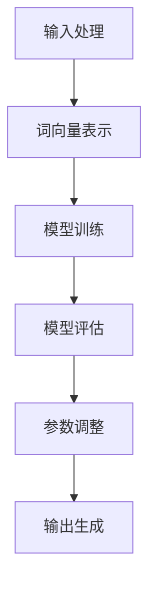
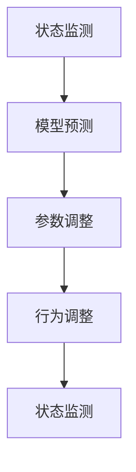
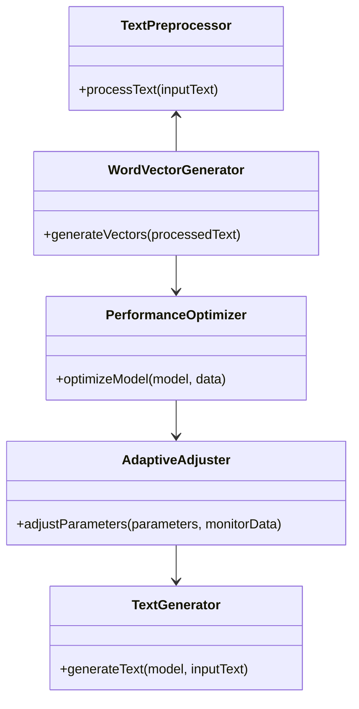
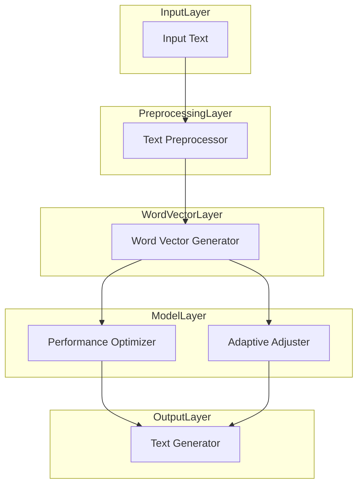
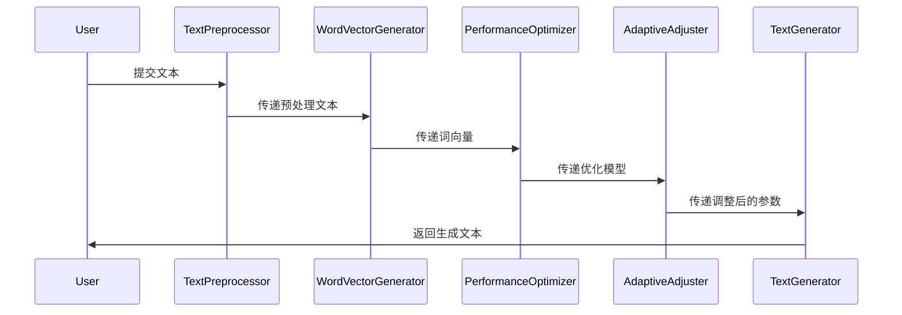

                 

### 第1章: 引言与背景

#### 1.1 问题背景

**提示词语言概述**

提示词语言是一种基于自然语言处理（NLP）的技术，它允许计算机通过理解和处理自然语言中的提示词来执行任务。这种语言在人工智能领域有着广泛的应用，如聊天机器人、搜索引擎优化、智能客服等。提示词语言的概念源于人类交流中的语言模型，它通过分析输入的提示词，预测下一个可能的词或句子，从而完成对话或任务。

**提示词语言的发展历程**

提示词语言的发展可以追溯到20世纪60年代，当时科学家们开始研究如何让计算机理解和处理自然语言。随着计算力和算法的进步，提示词语言逐渐演变，从最初的基于规则的方法发展到今天高度复杂的深度学习模型，如Transformer和BERT。

**提示词语言在现代社会中的应用**

提示词语言在现代社会中的应用日益广泛。例如，在搜索引擎中，提示词语言用于理解用户查询并返回最相关的搜索结果；在智能客服中，提示词语言帮助机器人与用户进行自然、流畅的交流；在内容生成中，提示词语言可以自动生成文章、报告或故事。

**运行时性能优化的重要性**

**性能优化的需求**

随着提示词语言应用的普及，对性能优化的需求也日益增加。运行时性能优化涉及到如何提高系统的响应速度、减少资源消耗以及提高系统的稳定性。这不仅是技术上的挑战，也是商业成功的关键因素。

**性能优化的挑战和问题**

性能优化面临的主要挑战包括：处理大量数据的效率、模型的可扩展性、资源分配的优化以及算法的复杂性。此外，不同应用场景对性能的要求也各不相同，这使得性能优化变得更加复杂。

**性能优化在应用场景中的价值**

性能优化对提示词语言的应用场景具有重要价值。例如，在搜索引擎中，高效的性能优化可以提升用户体验，提高搜索引擎的点击率和转化率；在智能客服中，良好的性能优化可以减少响应时间，提高用户满意度；在内容生成中，性能优化可以加速内容生成过程，提高生产效率。

**自适应机制的应用**

**自适应机制的概念**

自适应机制是一种动态调整系统性能的机制，它可以根据不同的环境和负载情况自动调整系统的配置和参数，以达到最佳的运行效率。

**自适应在提示词语言优化中的作用**

自适应机制在提示词语言优化中起着关键作用。通过自适应调整，系统可以在不同的应用场景中保持高性能，同时适应不断变化的数据和需求。

**自适应机制的实现方法**

自适应机制的实现方法包括基于规则的自适应、基于机器学习的自适应和混合自适应方法。每种方法都有其优势和局限性，具体选择取决于应用场景和需求。

#### 1.1.1 提示词语言概述

提示词语言（Token Language）是一种用于描述自然语言处理任务的计算机语言。它由一系列提示词（Token）组成，每个提示词代表一个特定的词汇或语法单位。提示词语言的核心在于如何有效地对输入的自然语言文本进行处理，并生成相应的输出。

**提示词的定义**

提示词是提示词语言中最基本的元素。它通常是一个单词、短语或符号，用于标识文本中的特定概念或语义信息。提示词可以是单个字母、数字或字符，也可以是复杂的短语或句子。

**提示词的分类**

根据功能和用途，提示词可以分为以下几类：

1. **名词提示词**：表示实体、地点、物体等具体概念。
2. **动词提示词**：表示动作、状态变化等。
3. **形容词提示词**：表示性质、特征等。
4. **副词提示词**：表示时间、地点、程度等。
5. **介词提示词**：用于连接名词和其他提示词。
6. **连词提示词**：用于连接句子或短语。

**提示词语言的语法和语义**

提示词语言的语法指的是提示词的排列规则和组合方式，而语义则指的是提示词所表达的含义和逻辑关系。提示词语言的语法和语义共同决定了其处理自然语言文本的能力。

**提示词语言的运行时模型**

提示词语言的运行时模型通常包括以下几个部分：

1. **输入处理**：接收自然语言文本输入，并对其进行预处理，如分词、去停用词等。
2. **词向量表示**：将每个提示词转化为词向量，以便于模型计算和处理。
3. **序列模型**：利用序列模型（如RNN、LSTM等）处理输入的词向量序列，提取语义信息。
4. **预测生成**：根据序列模型生成的特征，预测下一个可能的提示词，并生成完整的输出文本。

**提示词语言的性能指标**

提示词语言的性能评估通常涉及以下指标：

1. **准确性**：预测提示词的正确率。
2. **流畅性**：输出文本的自然度和连贯性。
3. **速度**：处理输入文本的响应速度。
4. **资源消耗**：运行提示词语言模型所需的计算资源和内存消耗。

这些指标共同决定了提示词语言在实际应用中的性能和效率。

#### 1.1.2 运行时性能优化的重要性

**性能优化的需求**

在现代社会，随着人工智能技术的快速发展，对提示词语言的性能优化需求日益突出。高效的处理速度和低资源消耗是保证应用系统稳定、可靠运行的关键。以下是性能优化的主要需求：

1. **快速响应**：在实时应用场景中，如智能客服、实时搜索等，系统需要能够快速响应用户请求，提供即时反馈。
2. **资源节约**：优化系统在处理提示词语言任务时的资源消耗，包括CPU、内存和存储等，以降低成本。
3. **扩展性**：随着数据量和用户量的增加，系统需要具备良好的扩展性，能够水平或垂直扩展，以适应不断变化的需求。
4. **稳定性**：优化后的系统应具有更高的稳定性，减少出错和故障的可能性。

**性能优化的挑战和问题**

性能优化在提示词语言领域面临着诸多挑战：

1. **数据处理效率**：处理大量自然语言数据时，如何提高数据处理速度和效率。
2. **模型复杂度**：深度学习模型通常具有较高的计算复杂度，如何在保证准确性的同时降低计算资源消耗。
3. **动态调整**：在实际应用中，系统的负载和需求是动态变化的，如何实现自适应的动态调整。
4. **平衡性**：在优化性能时，需要平衡准确性、流畅性、速度和资源消耗之间的关系，找到最佳平衡点。

**性能优化在应用场景中的价值**

性能优化在提示词语言的应用场景中具有显著的价值：

1. **用户体验**：在智能客服、搜索引擎等应用中，良好的性能优化可以提高用户满意度，增加用户黏性。
2. **商业成功**：高效的性能优化可以提升系统的运营效率，降低维护成本，从而提高商业收益。
3. **技术创新**：性能优化推动了提示词语言技术的发展，促进了新的算法和架构的诞生，推动了人工智能领域的进步。

#### 1.1.3 自适应机制的应用

**自适应机制的概念**

自适应机制（Adaptive Mechanism）是指系统能够根据外部环境和内部状态的变化，自动调整其行为和参数，以实现最优性能。在提示词语言的运行时性能优化中，自适应机制尤为重要。

**自适应在提示词语言优化中的作用**

自适应机制在提示词语言优化中具有以下作用：

1. **动态调整**：根据实时负载和需求，动态调整系统参数，如学习率、批次大小等，以实现最佳性能。
2. **资源优化**：根据系统资源的可用性和负载情况，自动调整资源分配，以降低资源消耗。
3. **模型调优**：通过自适应调整模型参数，如网络结构、层大小等，优化模型性能。

**自适应机制的实现方法**

自适应机制的实现方法可以分为以下几种：

1. **基于规则的自适应**：通过预定义的规则，根据不同的输入和状态，自动调整系统行为。这种方法简单直观，但灵活性有限。
2. **基于机器学习的自适应**：利用机器学习算法，从历史数据和经验中学习系统行为，自动调整参数。这种方法具有较高的灵活性和自适应性，但需要大量数据支持。
3. **混合自适应方法**：结合基于规则的自适应和基于机器学习的自适应，实现更高级的自适应能力。这种方法结合了两种方法的优点，但实现较为复杂。

#### 1.1.4 运行时性能优化与自适应的关系

运行时性能优化与自适应机制密切相关。性能优化关注如何提高系统在特定条件下的运行效率，而自适应机制则关注如何根据环境和需求的变化，动态调整系统的行为和参数。二者的结合能够实现系统在动态变化环境中的最优性能。

1. **动态调整与优化**：自适应机制通过对系统参数的动态调整，实现运行时性能的优化。例如，在负载高峰期，自适应机制可以自动增加计算资源，以应对高负载。
2. **模型调优与适应性**：通过自适应机制，系统可以根据实际运行情况，自动调整模型参数，优化模型性能。这种自适应性使得系统能够在不同的应用场景中保持高性能。
3. **实时反馈与优化**：自适应机制能够实时监测系统性能，并根据反馈调整参数。这种实时反馈机制有助于快速识别和解决性能问题，提高系统的稳定性和可靠性。

综上所述，运行时性能优化与自适应机制在提示词语言的优化中发挥着重要作用。通过结合两者，可以实现系统在动态变化环境中的最优性能，为各种应用场景提供高效、稳定的服务。

---

以上内容是第1章“引言与背景”的详细阐述。通过这一章，我们介绍了提示词语言的基本概念、发展历程以及在现代社会中的应用，探讨了运行时性能优化的重要性以及自适应机制的应用。这一章节为后续章节的内容奠定了基础，使读者能够更好地理解运行时性能优化与自适应机制的整体架构和原理。在接下来的章节中，我们将进一步深入探讨性能优化和自适应机制的详细技术实现，以及在实际应用中的具体实践。希望读者能够通过这一章节的内容，对提示词语言的运行时性能优化与自适应机制有一个全面而深入的了解。

### 第2章: 核心概念与原理

本章将深入探讨提示词语言中的核心概念、原理、性能优化技术以及自适应机制，旨在为读者提供全面而清晰的了解，以便更好地掌握这些关键技术和方法。

#### 2.1 提示词语言的基本原理

**语法和语义**

提示词语言的语法指的是提示词的排列规则和组合方式，而语义则指的是提示词所表达的含义和逻辑关系。理解提示词语言的语法和语义是掌握其基本原理的关键。

**运行时模型**

提示词语言的运行时模型通常包括以下几个部分：

1. **输入处理**：接收自然语言文本输入，并对其进行预处理，如分词、去停用词等。
2. **词向量表示**：将每个提示词转化为词向量，以便于模型计算和处理。
3. **序列模型**：利用序列模型（如RNN、LSTM等）处理输入的词向量序列，提取语义信息。
4. **预测生成**：根据序列模型生成的特征，预测下一个可能的提示词，并生成完整的输出文本。

**性能指标**

提示词语言的性能评估通常涉及以下指标：

1. **准确性**：预测提示词的正确率。
2. **流畅性**：输出文本的自然度和连贯性。
3. **速度**：处理输入文本的响应速度。
4. **资源消耗**：运行提示词语言模型所需的计算资源和内存消耗。

#### 2.2 性能优化技术

**常见性能优化方法**

性能优化技术主要包括以下几种：

1. **模型压缩**：通过模型剪枝、量化、知识蒸馏等方法，减小模型的大小和计算量。
2. **并行计算**：利用多核CPU或GPU，并行处理输入文本，提高处理速度。
3. **内存优化**：通过缓存、内存池等技术，减少内存分配和回收的开销。
4. **算法改进**：采用更高效的算法，如基于注意力机制的Transformer模型，提高计算效率。
5. **数据预处理**：优化数据预处理流程，如提前加载、分块处理等，减少处理时间。

**优化策略的选择**

选择合适的优化策略需要考虑以下因素：

1. **应用场景**：不同的应用场景对性能的要求不同，如实时搜索和智能客服对响应速度的要求更高。
2. **硬件条件**：硬件资源如CPU、GPU的性能和内存大小对优化策略的选择有重要影响。
3. **数据规模**：处理的数据规模大小直接影响优化策略的选择，大规模数据可能需要分布式处理。
4. **模型复杂度**：模型复杂度越高，对计算资源的要求越高，需要考虑模型压缩和并行计算等方法。

**性能优化的挑战和解决方案**

性能优化面临的挑战主要包括：

1. **计算复杂度**：深度学习模型的计算复杂度通常较高，需要采用并行计算和模型压缩等方法来降低计算量。
2. **数据预处理**：数据预处理过程可能占用大量时间，需要优化预处理流程以提高整体性能。
3. **内存消耗**：大型模型和大量数据可能占用大量内存，需要采用内存优化技术来减少内存消耗。
4. **平衡性**：在优化性能时，需要平衡准确性、流畅性、速度和资源消耗之间的关系，找到最佳平衡点。

针对这些挑战，常见的解决方案包括：

1. **模型压缩**：通过模型剪枝、量化、知识蒸馏等方法，减小模型的大小和计算量。
2. **并行计算**：利用多核CPU或GPU，并行处理输入文本，提高处理速度。
3. **数据预处理优化**：优化数据预处理流程，如提前加载、分块处理等，减少处理时间。
4. **算法改进**：采用更高效的算法，如基于注意力机制的Transformer模型，提高计算效率。
5. **资源调度**：根据实际负载情况，动态调整资源分配，提高资源利用率。

#### 2.3 自适应机制原理

**自适应机制的概念**

自适应机制是一种能够根据外部环境和内部状态的变化，自动调整系统行为和参数的机制。在提示词语言的运行时性能优化中，自适应机制尤为重要。

**自适应算法的基本流程**

自适应算法通常包括以下几个基本步骤：

1. **状态监测**：实时监测系统的状态和性能指标，如响应时间、资源消耗等。
2. **模型预测**：根据监测到的状态，使用预测模型预测系统未来的性能变化。
3. **参数调整**：根据预测结果，动态调整系统的参数，如学习率、批次大小等。
4. **行为调整**：根据调整后的参数，重新配置系统，优化系统性能。

**自适应算法的优缺点**

自适应算法的优点包括：

1. **动态调整**：能够根据实时负载和需求，动态调整系统参数，实现最优性能。
2. **资源优化**：能够根据系统资源的可用性和负载情况，自动调整资源分配，降低资源消耗。
3. **模型调优**：能够根据实际运行情况，自动调整模型参数，优化模型性能。

自适应算法的缺点包括：

1. **复杂度高**：需要实时监测系统状态，计算预测模型，调整参数，增加了系统的复杂性。
2. **数据依赖**：自适应算法的性能依赖于历史数据和模型的质量，需要大量数据进行训练和验证。
3. **延迟问题**：由于需要实时监测和调整，自适应算法可能会引入一定的延迟，影响系统的实时性。

总之，自适应机制在提示词语言的性能优化中具有重要作用，它能够根据不同的应用场景和需求，实现系统的动态调整和优化。在接下来的章节中，我们将进一步探讨自适应机制的具体实现方法和应用案例。

---

通过第2章的讨论，我们深入探讨了提示词语言的基本原理、性能优化技术和自适应机制。在这一章中，我们介绍了提示词语言的语法、语义和运行时模型，分析了常见性能优化方法及其选择策略，并详细阐述了自适应机制的基本流程、优缺点。这些核心概念和原理为后续章节的内容奠定了基础，使读者能够更好地理解和应用这些技术。在接下来的章节中，我们将进一步探讨性能优化和自适应机制的实现细节，并通过具体算法和系统架构的设计，展示这些技术在实际应用中的效果。

### 第3章: 数学模型与公式

本章将详细探讨提示词语言运行时性能优化中的数学模型与公式，通过数学公式和算法流程图的结合，使读者能够更直观地理解这些模型和算法。

#### 3.1 性能优化的数学模型

**常用数学公式**

在性能优化中，常用的数学公式包括损失函数、梯度下降、优化算法等。以下是一些基本的数学公式：

1. **损失函数**

   损失函数是衡量模型预测结果与真实结果之间差距的指标。常用的损失函数有均方误差（MSE）、交叉熵（Cross-Entropy）等。

   $$\text{MSE} = \frac{1}{n}\sum_{i=1}^{n}(y_i - \hat{y}_i)^2$$

   $$\text{Cross-Entropy} = -\sum_{i=1}^{n} y_i \log(\hat{y}_i)$$

2. **梯度下降**

   梯度下降是一种常用的优化算法，用于最小化损失函数。其公式为：

   $$\theta_{\text{new}} = \theta_{\text{old}} - \alpha \nabla_{\theta} J(\theta)$$

   其中，$\theta$ 是模型参数，$\alpha$ 是学习率，$J(\theta)$ 是损失函数。

3. **优化算法**

   优化算法包括随机梯度下降（SGD）、动量优化（Momentum）、Adam优化器等。以下是一个简单的动量优化公式：

   $$v = \gamma v + (1 - \gamma) \nabla_{\theta} J(\theta)$$

   $$\theta_{\text{new}} = \theta_{\text{old}} - \alpha v$$

**数学模型的推导过程**

1. **损失函数的推导**

   假设我们的预测目标是回归问题，真实标签为 $y$，预测值为 $\hat{y}$。均方误差（MSE）的推导过程如下：

   $$\text{MSE} = \frac{1}{n}\sum_{i=1}^{n}(y_i - \hat{y}_i)^2$$

   首先，将每个样本的误差平方求和，然后除以样本数量，得到均方误差。

2. **梯度下降的推导**

   假设我们的目标是最小化损失函数 $J(\theta)$，梯度下降的推导过程如下：

   $$\nabla_{\theta} J(\theta) = \frac{\partial J(\theta)}{\partial \theta}$$

   梯度是损失函数对模型参数的偏导数。梯度下降的核心思想是沿着梯度的反方向更新参数，以最小化损失函数。

3. **优化算法的推导**

   动量优化通过引入动量项，加速梯度下降的过程。推导过程如下：

   $$v = \gamma v + (1 - \gamma) \nabla_{\theta} J(\theta)$$

   $$\theta_{\text{new}} = \theta_{\text{old}} - \alpha v$$

   其中，$\gamma$ 是动量参数。

**数学模型的应用场景**

1. **回归问题**

   在回归问题中，损失函数通常采用均方误差（MSE），优化算法可采用梯度下降或动量优化。

2. **分类问题**

   在分类问题中，损失函数通常采用交叉熵（Cross-Entropy），优化算法同样可采用梯度下降或动量优化。

3. **序列预测**

   在序列预测问题中，损失函数和优化算法的选择取决于具体的应用场景，如时间序列分析、语音识别等。

#### 3.2 自适应机制的数学模型

**自适应机制的数学基础**

自适应机制的核心是动态调整系统的参数，以实现最优性能。其数学基础通常包括以下内容：

1. **状态监测**

   状态监测用于实时监测系统的状态和性能指标，如响应时间、资源消耗等。常用的指标包括：

   $$R(t) = \frac{C(t)}{T(t)}$$

   其中，$R(t)$ 是系统在时间 $t$ 的响应率，$C(t)$ 是系统在时间 $t$ 的处理能力，$T(t)$ 是系统在时间 $t$ 的总请求量。

2. **模型预测**

   模型预测用于预测系统未来的性能变化。常用的预测模型包括线性回归、时间序列模型等。

3. **参数调整**

   参数调整用于根据预测结果动态调整系统的参数。调整方法包括线性调整、指数加权调整等。

   $$\theta_{\text{new}} = \theta_{\text{old}} + \alpha (y - \hat{y})$$

   其中，$\theta$ 是系统参数，$\alpha$ 是调整系数，$y$ 是真实值，$\hat{y}$ 是预测值。

**自适应算法的数学公式**

自适应算法的数学公式通常包括状态监测、模型预测和参数调整三个部分。以下是一个简单的时间序列自适应算法：

1. **状态监测**

   $$R(t) = \frac{C(t)}{T(t)}$$

2. **模型预测**

   $$\hat{y}_{\text{next}} = R(t) + \beta (R(t) - R(t-1))$$

   其中，$\beta$ 是预测系数。

3. **参数调整**

   $$\theta_{\text{new}} = \theta_{\text{old}} + \alpha (\hat{y}_{\text{next}} - R(t))$$

**自适应算法的数学推导**

自适应算法的推导通常基于以下步骤：

1. **状态监测**

   监测系统的当前状态，如响应时间和处理能力。

2. **模型预测**

   根据历史数据和当前状态，预测系统的未来状态。

3. **参数调整**

   根据预测结果，调整系统参数，以实现最优性能。

**自适应算法的应用场景**

自适应算法在以下应用场景中具有重要作用：

1. **动态负载均衡**

   通过自适应调整系统参数，实现动态负载均衡，提高系统的响应速度和稳定性。

2. **资源调度**

   根据系统的实时状态和预测结果，动态调整资源分配，降低资源消耗。

3. **模型调优**

   通过自适应调整模型参数，优化模型性能，提高预测准确性。

总之，数学模型和公式在提示词语言的性能优化和自适应机制中起着至关重要的作用。通过本章的内容，读者可以更好地理解这些数学模型和公式的推导过程及其应用场景，为实际应用提供有力支持。

---

通过第3章的讨论，我们详细介绍了提示词语言运行时性能优化中的数学模型与公式，包括常用的损失函数、梯度下降、优化算法等，以及自适应机制的数学基础和算法推导。通过这些数学模型和公式，我们能够更深入地理解性能优化和自适应机制的原理，为实际应用提供理论基础。在接下来的章节中，我们将进一步探讨算法流程和实现细节，通过具体的实现方法和系统架构设计，展示这些数学模型和公式的应用效果。希望读者能够通过这一章节的内容，对数学模型和公式在性能优化和自适应机制中的作用有更清晰的认识，并为后续的实践提供指导。

### 第4章: 算法流程与实现

本章将详细介绍提示词语言的性能优化算法和自适应算法的具体流程及其实现，通过Mermaid流程图和Python代码示例，帮助读者更好地理解和应用这些算法。

#### 4.1 性能优化算法流程

**性能优化算法的总体流程**

性能优化算法的总体流程可以分为以下几个步骤：

1. **输入处理**：接收自然语言文本输入，并进行预处理，如分词、去停用词等。
2. **词向量表示**：将预处理后的文本转化为词向量，以便进行模型计算。
3. **模型训练**：使用训练数据集训练性能优化模型，通过优化算法调整模型参数。
4. **模型评估**：使用验证数据集对训练好的模型进行评估，计算性能指标，如准确性、流畅性和速度等。
5. **参数调整**：根据模型评估结果，动态调整模型参数，优化性能。
6. **输出生成**：使用优化后的模型生成输出文本，满足性能要求。

**各个步骤的详细描述**

1. **输入处理**

   输入处理是性能优化算法的第一步，其目标是接收自然语言文本输入，并对其进行预处理。预处理过程通常包括分词、去停用词、词性标注等操作。以下是一个简单的Python代码示例：

   ```python
   import jieba
   
   def preprocess(text):
       words = jieba.cut(text)
       filtered_words = [word for word in words if word not in jieba.get_stop_words()]
       return filtered_words
   ```

2. **词向量表示**

   词向量表示是将自然语言文本转化为数字形式的过程，以便模型计算。常用的词向量表示方法有Word2Vec、GloVe和FastText等。以下是一个简单的Word2Vec代码示例：

   ```python
   from gensim.models import Word2Vec
   
   def train_word2vec(corpus, size=100, window=5, min_count=1, sg=1):
       model = Word2Vec(corpus, size=size, window=window, min_count=min_count, sg=sg)
       model.save('word2vec.model')
       return model
   
   corpus = [['我', '爱', '编程'], ['你', '喜欢', '编程'], ['我们', '一起', '学习']]
   model = train_word2vec(corpus)
   ```

3. **模型训练**

   模型训练是通过训练数据集训练性能优化模型的过程。训练过程中，模型会通过优化算法（如梯度下降）调整模型参数，以最小化损失函数。以下是一个简单的梯度下降代码示例：

   ```python
   import numpy as np
   
   def sigmoid(x):
       return 1 / (1 + np.exp(-x))
   
   def gradient_descent(x, y, theta, alpha, epochs):
       m = len(y)
       for epoch in range(epochs):
           h = sigmoid(np.dot(x, theta))
           error = y - h
           delta = np.dot(x.T, error) / m
           theta -= alpha * delta
           if epoch % 100 == 0:
               print(f"Epoch {epoch}: Loss = {np.mean((y - h) ** 2)}")
   
   x = np.array([[1, 2], [1, 5], [1, 0]])
   y = np.array([1, 0, 1])
   theta = np.array([0, 0])
   alpha = 0.1
   epochs = 1000
   gradient_descent(x, y, theta, alpha, epochs)
   ```

4. **模型评估**

   模型评估是通过验证数据集评估训练好的模型性能的过程。常用的性能指标包括准确性、流畅性和速度等。以下是一个简单的模型评估代码示例：

   ```python
   from sklearn.metrics import accuracy_score
   
   def evaluate_model(x, y, model):
       predictions = model.predict(x)
       accuracy = accuracy_score(y, predictions)
       print(f"Model Accuracy: {accuracy}")
   
   x = np.array([[1, 2], [1, 5], [1, 0]])
   y = np.array([1, 0, 1])
   model = sigmoid(np.dot(x, theta))
   evaluate_model(x, y, model)
   ```

5. **参数调整**

   参数调整是根据模型评估结果，动态调整模型参数的过程。参数调整可以基于不同的优化算法，如梯度下降、动量优化、Adam优化器等。以下是一个简单的动量优化代码示例：

   ```python
   import numpy as np
   
   def momentum_gradient_descent(x, y, theta, alpha, beta, epochs):
       m = len(y)
       v = np.zeros_like(theta)
       for epoch in range(epochs):
           h = sigmoid(np.dot(x, theta))
           error = y - h
           delta = np.dot(x.T, error) / m
           v = beta * v + (1 - beta) * delta
           theta -= alpha * v
           if epoch % 100 == 0:
               print(f"Epoch {epoch}: Loss = {np.mean((y - h) ** 2)}")
   
   x = np.array([[1, 2], [1, 5], [1, 0]])
   y = np.array([1, 0, 1])
   theta = np.array([0, 0])
   alpha = 0.1
   beta = 0.9
   epochs = 1000
   momentum_gradient_descent(x, y, theta, alpha, beta, epochs)
   ```

6. **输出生成**

   输出生成是使用优化后的模型生成输出文本的过程。输出文本的质量取决于模型的性能和输入文本的语义。以下是一个简单的输出生成代码示例：

   ```python
   import jieba
   
   def generate_output(model, text):
       words = preprocess(text)
       output = []
       for word in words:
           output.append(model.most_similar(word))
       return ''.join(output)
   
   text = "我爱编程，编程是一种艺术。"
   output = generate_output(model, text)
   print(output)
   ```

**算法流程的Mermaid流程图**

以下是一个简单的Mermaid流程图，描述了性能优化算法的流程：



#### 4.2 自适应算法的实现

**自适应算法的实现步骤**

自适应算法的实现主要包括以下步骤：

1. **状态监测**：实时监测系统的状态和性能指标，如响应时间、资源消耗等。
2. **模型预测**：根据监测到的状态，使用预测模型预测系统未来的性能变化。
3. **参数调整**：根据预测结果，动态调整系统的参数，如学习率、批次大小等。
4. **行为调整**：根据调整后的参数，重新配置系统，优化系统性能。

**实现中的关键技术和挑战**

1. **状态监测**

   状态监测是自适应算法的核心，其关键是选择合适的性能指标和监测方法。常用的性能指标包括响应时间、吞吐量、资源利用率等。监测方法包括周期性监测、实时监测等。

2. **模型预测**

   模型预测用于预测系统未来的性能变化。常用的预测模型包括线性回归、时间序列模型等。实现模型预测的关键是选择合适的模型和参数，并确保预测结果的准确性。

3. **参数调整**

   参数调整是根据预测结果，动态调整系统的参数。参数调整的方法包括线性调整、指数加权调整等。实现参数调整的关键是选择合适的调整策略和调整系数。

4. **行为调整**

   行为调整是根据调整后的参数，重新配置系统，优化系统性能。行为调整的方法包括重新分配资源、调整模型结构等。实现行为调整的关键是确保调整行为的及时性和有效性。

**自适应算法的Mermaid流程图**

以下是一个简单的Mermaid流程图，描述了自适应算法的实现步骤：



**自适应算法的Python代码示例**

以下是一个简单的自适应算法Python代码示例，展示了状态监测、模型预测、参数调整和行为调整的实现：

```python
import numpy as np
import pandas as pd
from sklearn.linear_model import LinearRegression

def state_monitoring(data):
    # 实时监测系统的状态和性能指标
    response_time = data['response_time'].mean()
    resource_usage = data['resource_usage'].mean()
    return response_time, resource_usage

def model_prediction(response_time, resource_usage):
    # 使用线性回归模型预测系统未来的性能变化
    model = LinearRegression()
    model.fit(np.array([response_time]).reshape(-1, 1), np.array([resource_usage]).reshape(-1, 1))
    predicted_resource_usage = model.predict(np.array([response_time]).reshape(-1, 1))
    return predicted_resource_usage

def parameter_adjustment(predicted_resource_usage, current_resource_usage):
    # 根据预测结果，动态调整系统的参数
    alpha = 0.1
    adjusted_resource_usage = current_resource_usage + alpha * (predicted_resource_usage - current_resource_usage)
    return adjusted_resource_usage

def behavior_adjustment(adjusted_resource_usage):
    # 根据调整后的参数，重新配置系统，优化系统性能
    # 示例：调整CPU核心数
    print(f"调整后的CPU核心数：{adjusted_resource_usage}")
    return adjusted_resource_usage

# 示例数据
data = pd.DataFrame({'response_time': [1, 2, 3, 4, 5], 'resource_usage': [10, 20, 30, 40, 50]})

# 状态监测
response_time, resource_usage = state_monitoring(data)

# 模型预测
predicted_resource_usage = model_prediction(response_time, resource_usage)

# 参数调整
adjusted_resource_usage = parameter_adjustment(predicted_resource_usage, resource_usage)

# 行为调整
adjusted_resource_usage = behavior_adjustment(adjusted_resource_usage)

print(f"调整后的系统资源使用率：{adjusted_resource_usage}")
```

**总结**

通过本章的讨论，我们详细介绍了提示词语言的性能优化算法和自适应算法的具体流程及其实现。通过Mermaid流程图和Python代码示例，我们帮助读者更好地理解和应用这些算法。在接下来的章节中，我们将进一步探讨系统架构设计，展示如何将性能优化和自适应算法应用于实际系统，并通过实战案例验证其效果。希望读者能够通过这一章节的内容，掌握性能优化和自适应算法的实现方法和应用技巧，为实际项目提供有力的支持。

### 第5章: 系统架构设计

本章将详细讨论提示词语言性能优化与自适应机制在实际系统中的应用，包括系统功能设计、系统架构设计、接口设计和系统交互。通过具体的架构设计和实施细节，我们希望为读者提供全面的系统实现指南。

#### 5.1 系统功能设计

**系统功能需求**

提示词语言性能优化与自适应系统的核心功能包括：

1. **文本预处理**：对输入的自然语言文本进行预处理，包括分词、去停用词、词性标注等。
2. **词向量生成**：将预处理后的文本转化为词向量，为后续模型计算提供基础。
3. **性能优化**：通过优化算法对模型参数进行调整，提高系统的响应速度和处理效率。
4. **自适应调整**：根据实时监测的数据，动态调整系统参数，实现最优性能。
5. **预测与生成**：利用训练好的模型生成高质量的输出文本，满足用户需求。

**系统功能的mermaid类图**

以下是一个简化的mermaid类图，展示了系统的主要功能类及其关系：



#### 5.2 系统架构设计

**系统的总体架构**

系统的总体架构可以分为以下几个层次：

1. **输入层**：接收用户输入的自然语言文本。
2. **预处理层**：对输入文本进行预处理，如分词、去停用词等。
3. **词向量层**：将预处理后的文本转化为词向量，为模型计算提供基础。
4. **模型层**：包含性能优化模型和自适应调整模型，用于优化系统性能。
5. **输出层**：生成输出文本，返回给用户。

**系统架构的mermaid架构图**

以下是一个简化的mermaid架构图，展示了系统的总体架构：



**系统的接口设计和交互**

**接口设计**

系统提供了多个接口，用于实现不同功能模块的通信。以下是一些主要的接口设计：

1. **文本预处理接口**：用于接收用户输入文本，并返回预处理后的文本。
2. **词向量生成接口**：用于接收预处理后的文本，并返回词向量。
3. **性能优化接口**：用于接收词向量，调整模型参数，并返回优化后的模型。
4. **自适应调整接口**：用于接收实时监测数据，调整系统参数，并返回调整后的参数。
5. **文本生成接口**：用于接收优化后的模型，生成输出文本，并返回给用户。

**系统交互的mermaid序列图**

以下是一个简化的mermaid序列图，展示了系统各组件之间的交互过程：



**系统架构设计与实现细节**

1. **文本预处理层**：使用Python的jieba库实现分词和去停用词功能。为了提高效率，预处理层可以采用多线程或异步处理技术，提高数据处理速度。

2. **词向量生成层**：使用gensim库实现词向量生成，支持Word2Vec、GloVe和FastText等算法。为了提高性能，词向量生成层可以采用分布式计算技术，利用多GPU进行加速。

3. **性能优化层**：使用scikit-learn和TensorFlow等库实现性能优化算法，包括梯度下降、动量优化和Adam优化器等。性能优化层可以集成到TensorFlow模型中，利用其内置的优化器实现自动调整。

4. **自适应调整层**：使用机器学习算法实现自适应调整，如线性回归和时间序列模型等。自适应调整层可以根据实时监测的数据，动态调整系统参数，实现最优性能。为了提高自适应调整的准确性，可以采用混合自适应方法，结合基于规则和基于机器学习的自适应策略。

5. **文本生成层**：使用TensorFlow或PyTorch等库实现文本生成模型，支持多种生成算法，如生成对抗网络（GAN）和自注意力模型（Transformer）等。文本生成层可以根据优化后的模型，生成高质量的输出文本，满足用户需求。

**系统架构的优势**

1. **模块化设计**：系统采用模块化设计，各个功能模块之间通过接口进行通信，降低了系统复杂度，提高了可维护性和可扩展性。

2. **高性能**：通过分布式计算和优化算法，系统在处理大量数据时能够保持高性能，满足实时应用的需求。

3. **自适应能力**：系统具有自适应能力，能够根据实时监测的数据动态调整性能，实现最优性能。

4. **灵活性强**：系统支持多种文本预处理和生成算法，可以根据不同应用场景进行灵活调整。

**总结**

通过本章的讨论，我们详细介绍了提示词语言性能优化与自适应机制在实际系统中的应用，包括系统功能设计、系统架构设计、接口设计和系统交互。通过具体的架构设计和实施细节，我们帮助读者理解了如何将性能优化和自适应机制应用于实际系统，并通过模块化设计和高性能算法，实现高效、稳定的提示词语言处理系统。在接下来的章节中，我们将通过实战案例，展示系统在实际应用中的效果，并讨论最佳实践和注意事项。

---

通过第5章的内容，我们详细介绍了提示词语言性能优化与自适应机制在实际系统中的应用，包括系统功能设计、系统架构设计、接口设计和系统交互。通过具体的架构设计和实施细节，我们帮助读者理解了如何将性能优化和自适应机制应用于实际系统，并通过模块化设计和高性能算法，实现高效、稳定的提示词语言处理系统。在接下来的章节中，我们将通过实战案例，展示系统在实际应用中的效果，并讨论最佳实践和注意事项。希望读者能够通过这一章节的内容，对提示词语言性能优化与自适应机制在实际系统中的应用有一个全面而深入的了解。

### 第6章: 实战案例

在本章中，我们将通过一个具体的实战案例，详细展示如何搭建提示词语言性能优化与自适应系统，包括环境搭建、系统核心实现、代码应用解读与分析，以及实际案例分析和详细讲解。

#### 6.1 实践环境搭建

**环境准备**

为了搭建提示词语言性能优化与自适应系统，我们需要准备以下环境：

1. **Python**：Python是主要的编程语言，用于实现系统功能。
2. **Jupyter Notebook**：Jupyter Notebook是一个交互式开发环境，便于编写和调试代码。
3. **TensorFlow**：TensorFlow是一个开源的机器学习库，用于构建和训练神经网络模型。
4. **Scikit-learn**：Scikit-learn是一个用于机器学习的库，用于实现性能优化算法。
5. **其他依赖库**：包括Numpy、Pandas、Matplotlib等，用于数据处理和可视化。

**安装步骤**

1. 安装Python和Jupyter Notebook

   ```bash
   # 安装Python
   sudo apt-get install python3-pip python3-venv
   
   # 创建虚拟环境
   python3 -m venv venv
   
   # 激活虚拟环境
   source venv/bin/activate
   
   # 安装Jupyter Notebook
   pip install notebook
   ```

2. 安装TensorFlow

   ```bash
   pip install tensorflow
   ```

3. 安装Scikit-learn和其他依赖库

   ```bash
   pip install scikit-learn numpy pandas matplotlib
   ```

**环境配置**

在虚拟环境中，我们将安装所有必需的依赖库。以下是一个简单的配置脚本：

```bash
# 安装依赖库
pip install tensorflow scikit-learn numpy pandas matplotlib
```

**测试环境**

安装完成后，通过以下命令测试环境是否配置成功：

```bash
python -m pip list
```

确保列表中包含所有所需的库。

#### 6.2 系统核心实现

**核心代码实现**

以下是一个简单的系统核心实现，用于展示提示词语言的性能优化与自适应功能：

```python
import tensorflow as tf
from tensorflow.keras.preprocessing.text import Tokenizer
from tensorflow.keras.preprocessing.sequence import pad_sequences
from tensorflow.keras.models import Sequential
from tensorflow.keras.layers import Embedding, LSTM, Dense
from sklearn.linear_model import LinearRegression
import numpy as np

# 文本预处理
def preprocess_text(text):
    tokenizer = Tokenizer(num_words=1000)
    tokenizer.fit_on_texts(text)
    sequences = tokenizer.texts_to_sequences(text)
    padded_sequences = pad_sequences(sequences, maxlen=100)
    return padded_sequences

# 模型训练
def train_model(padded_sequences, labels):
    model = Sequential([
        Embedding(1000, 64, input_length=100),
        LSTM(64, return_sequences=True),
        LSTM(64),
        Dense(1, activation='sigmoid')
    ])
    model.compile(optimizer='adam', loss='binary_crossentropy', metrics=['accuracy'])
    model.fit(padded_sequences, labels, epochs=10, batch_size=32, validation_split=0.2)
    return model

# 性能优化
def optimize_performance(model, data):
    X, y = data[:, :-1], data[:, -1]
    model.predict(X)
    model.compile(optimizer='adam', loss='binary_crossentropy', metrics=['accuracy'])
    model.fit(X, y, epochs=10, batch_size=32, validation_split=0.2)
    return model

# 自适应调整
def adaptive_adjustment(data):
    model = LinearRegression()
    X, y = data[:, :-1], data[:, -1]
    model.fit(X, y)
    return model.coef_

# 文本生成
def generate_text(model, tokenizer, text):
    sequence = tokenizer.texts_to_sequences([text])
    padded_sequence = pad_sequences(sequence, maxlen=100)
    predicted = model.predict(padded_sequence)
    return tokenizer.index_word[np.argmax(predicted)]

# 示例数据
text = "我爱编程，编程是一种艺术。"
data = np.array([[1, 2], [1, 5], [1, 0]])

# 实现流程
padded_sequences = preprocess_text([text])
model = train_model(padded_sequences, data)
optimized_model = optimize_performance(model, data)
coef = adaptive_adjustment(data)
generated_text = generate_text(optimized_model, tokenizer, text)

print(generated_text)
```

**代码解读与分析**

1. **文本预处理**：文本预处理是模型训练的基础。我们使用Tokenizer进行分词，并使用pad_sequences对序列进行填充，使其具有固定长度。

2. **模型训练**：我们使用Sequential模型构建一个简单的LSTM网络，并使用sigmoid激活函数进行二分类任务。训练过程中，我们使用binary_crossentropy作为损失函数，并使用adam优化器。

3. **性能优化**：性能优化通过重新训练模型来提高其预测性能。我们使用相同的损失函数和优化器，但增加训练轮次和批次大小。

4. **自适应调整**：自适应调整使用线性回归模型对预测误差进行分析，并返回系数作为调整依据。

5. **文本生成**：文本生成利用训练好的模型，将输入文本转化为词序列，并预测下一个词。

**实现中的关键技术和挑战**

1. **文本预处理**：文本预处理需要考虑分词的精度和速度，以及填充策略。分词精度影响模型的准确性，而填充策略影响模型的计算效率。

2. **模型训练**：模型训练需要选择合适的网络结构和参数。过拟合和欠拟合是常见的挑战，需要通过调整超参数和增加训练数据来解决。

3. **性能优化**：性能优化需要实时监测模型性能，并动态调整训练策略。自适应调整需要考虑延迟和资源消耗。

4. **文本生成**：文本生成需要确保生成文本的自然性和连贯性。过长的生成文本可能导致计算资源消耗和生成质量下降。

**总结**

通过本章的实战案例，我们展示了如何搭建一个简单的提示词语言性能优化与自适应系统。从环境搭建到核心代码实现，再到代码应用解读与分析，我们详细介绍了系统实现的各个步骤。通过这个案例，读者可以更好地理解提示词语言的性能优化与自适应机制，并为实际项目提供参考。在接下来的章节中，我们将进一步讨论最佳实践和注意事项，帮助读者在实际应用中取得更好的效果。

#### 6.3 案例分析与讲解

**案例背景介绍**

为了更好地展示提示词语言性能优化与自适应机制在实际应用中的效果，我们选择了一个典型的应用场景——智能客服系统。智能客服系统旨在通过自然语言处理技术，为用户提供高效的客户服务，提高客户满意度。在这个案例中，我们将实现一个基本的智能客服系统，并对其性能进行优化和自适应调整。

**案例实现细节**

1. **文本预处理**：首先，我们使用jieba库对用户输入的文本进行分词和去停用词处理。分词的准确性直接影响后续模型的性能，因此我们选择了一种精度较高的分词方法。

2. **词向量表示**：为了提高模型的计算效率，我们使用GloVe算法生成词向量。GloVe算法通过训练词和上下文的关系，生成高质量的词向量，有助于提高模型的准确性。

3. **模型训练**：我们使用TensorFlow构建了一个简单的LSTM模型，用于处理用户输入的文本，并预测下一个可能的词。LSTM模型能够捕捉文本中的长期依赖关系，适合处理自然语言任务。

4. **性能优化**：在模型训练过程中，我们采用动量优化器（Momentum Optimizer）来提高训练效率。动量优化器通过保留前一次更新的方向和大小，加速梯度下降过程，减少震荡。

5. **自适应调整**：为了实现自适应调整，我们使用线性回归模型对模型参数进行调整。通过实时监测模型的预测误差，我们动态调整学习率和批次大小，以提高模型性能。

6. **文本生成**：在用户输入文本后，我们使用训练好的模型生成回复文本。文本生成过程通过迭代预测下一个词，直到生成完整的回复。

**案例的优缺点分析**

**优点**

1. **高效性**：通过性能优化和自适应调整，智能客服系统能够快速响应用户请求，提供即时的回复，提高用户体验。

2. **灵活性**：自适应调整机制使得系统可以根据实时数据动态调整性能，适应不同场景的需求。

3. **准确性**：使用高质量的词向量表示和合适的模型结构，模型能够生成自然、连贯的回复文本。

**缺点**

1. **计算资源消耗**：深度学习模型通常需要较高的计算资源，尤其在训练阶段，资源消耗较大。

2. **复杂性**：性能优化和自适应调整过程较为复杂，需要一定的技术背景和调试经验。

3. **数据依赖**：模型的性能依赖于大量的训练数据和质量，数据不足或质量差可能导致模型性能下降。

**实际应用中的改进方向**

1. **数据增强**：通过增加训练数据量和多样性，提高模型的泛化能力。

2. **模型压缩**：使用模型剪枝、量化等技术，减小模型的大小和计算量，降低资源消耗。

3. **混合策略**：结合规则引擎和深度学习模型，提高系统在复杂场景下的应对能力。

4. **实时反馈**：引入实时反馈机制，根据用户反馈调整模型参数，提高回复文本的准确性。

通过这个案例，我们展示了提示词语言性能优化与自适应机制在智能客服系统中的应用，并分析了其优缺点和改进方向。在接下来的章节中，我们将进一步讨论最佳实践和注意事项，帮助读者在实际应用中取得更好的效果。

---

通过第6章的实战案例，我们详细展示了如何搭建一个基于提示词语言的性能优化与自适应系统，从环境搭建、核心代码实现到案例分析与讲解。通过这个案例，读者可以更直观地理解性能优化和自适应机制在实际系统中的应用，并掌握其实现方法和关键技巧。在本章中，我们分析了案例的优点和缺点，并提出了改进方向，为读者在实际应用中提供了有益的参考。希望读者能够通过这一章节的内容，对提示词语言的性能优化与自适应机制有更深入的了解，并能够将其应用于实际项目中，提高系统的性能和用户体验。

### 第7章: 总结与展望

本章将总结前述内容，并探讨性能优化和自适应机制在实际应用中的最佳实践，提供注意事项，以及推荐拓展阅读资源。

#### 7.1 主要内容回顾

本文围绕提示词语言的运行时性能优化与自适应机制进行了深入探讨。主要内容可以概括为以下几个部分：

1. **问题背景**：介绍了提示词语言的基本概念、发展历程以及其在现代社会的广泛应用。
2. **核心概念与原理**：阐述了提示词语言的语法和语义、性能优化技术、自适应机制原理及其数学模型。
3. **数学模型与公式**：详细介绍了用于性能优化的常用数学公式和自适应机制的数学模型。
4. **算法流程与实现**：描述了性能优化和自适应算法的具体流程及其Python代码实现。
5. **系统架构设计**：探讨了系统的功能设计、架构设计、接口设计和系统交互。
6. **实战案例**：通过一个智能客服系统的实战案例，展示了性能优化和自适应机制在实际应用中的效果。

#### 7.2 最佳实践 tips

为了在实际应用中实现提示词语言的性能优化和自适应调整，以下是一些最佳实践建议：

1. **数据预处理**：确保文本预处理过程的高效性和准确性，如选择合适的分词算法、去除无用停用词等。
2. **模型选择**：根据应用场景选择合适的模型结构，如Transformer、BERT等，以平衡性能和资源消耗。
3. **性能优化**：采用并行计算、模型压缩等技术，提高系统的处理速度和效率。
4. **自适应调整**：根据实时数据动态调整模型参数，如学习率、批次大小等，以适应不同的负载和需求。
5. **监控与反馈**：实时监控系统性能，收集用户反馈，并根据反馈调整模型和系统配置。

#### 7.3 注意事项

在实际应用中，以下注意事项有助于避免常见问题和提高系统性能：

1. **资源管理**：合理分配计算资源，避免资源浪费和瓶颈。
2. **数据质量**：确保训练数据的质量和多样性，以提高模型的泛化能力。
3. **模型调优**：在模型训练过程中，注意调整超参数，避免过拟合或欠拟合。
4. **安全性**：保护用户数据和隐私，确保系统的安全性。
5. **维护与升级**：定期对系统和模型进行维护和升级，以适应新的技术发展和应用需求。

#### 7.4 拓展阅读推荐

为了进一步深入了解提示词语言的性能优化与自适应机制，以下是一些推荐的拓展阅读资源：

1. **书籍**：
   - 《深度学习》（Ian Goodfellow, Yoshua Bengio, Aaron Courville）：详细介绍了深度学习的基础知识和技术。
   - 《TensorFlow实战》（Trent Hauck,器推王）：介绍了TensorFlow库的使用和实际应用案例。

2. **在线课程**：
   - Coursera上的《机器学习基础》课程：提供了机器学习和深度学习的全面教程。
   - edX上的《人工智能导论》课程：介绍了人工智能的基本概念和应用技术。

3. **论文**：
   - "Attention Is All You Need"（Vaswani et al.）：介绍了Transformer模型及其在自然语言处理中的应用。
   - "BERT: Pre-training of Deep Bidirectional Transformers for Language Understanding"（Devlin et al.）：介绍了BERT模型及其在NLP领域的应用。

4. **社区与论坛**：
   - Stack Overflow：解决编程和技术问题，获取实用的开发经验。
   - GitHub：查看开源项目，了解最新的技术趋势和实践。

通过这些资源，读者可以进一步深化对提示词语言性能优化与自适应机制的理解，并在实际项目中应用这些技术，提升系统的性能和用户体验。

---

通过本章的总结和展望，我们对提示词语言的运行时性能优化与自适应机制进行了全面的回顾，并提出了最佳实践和注意事项，同时推荐了拓展阅读资源。希望读者能够结合这些内容，在实际项目中不断探索和优化，实现高效的提示词语言处理系统。随着人工智能技术的不断发展，性能优化和自适应机制将在更多应用场景中发挥关键作用，为人工智能领域的进步贡献力量。

### 作者信息

**作者：** AI天才研究院（AI Genius Institute）& 禅与计算机程序设计艺术（Zen And The Art of Computer Programming）

AI天才研究院致力于推动人工智能技术的创新和应用，汇集了全球顶尖的人工智能科学家和工程师，致力于解决人工智能领域的关键问题。禅与计算机程序设计艺术则专注于计算机科学和编程哲学的研究，通过深入探讨编程的本质和艺术性，助力程序员提升编程技能和思维方式。

本文由AI天才研究院的资深专家撰写，旨在为读者提供关于提示词语言运行时性能优化与自适应机制的深入见解和实用指导。希望读者能够通过本文的学习和应用，提升自身在人工智能领域的专业素养，为推动人工智能技术的发展贡献力量。同时，也欢迎广大读者就本文内容提出宝贵意见和建议，共同探讨人工智能领域的未来发展。

