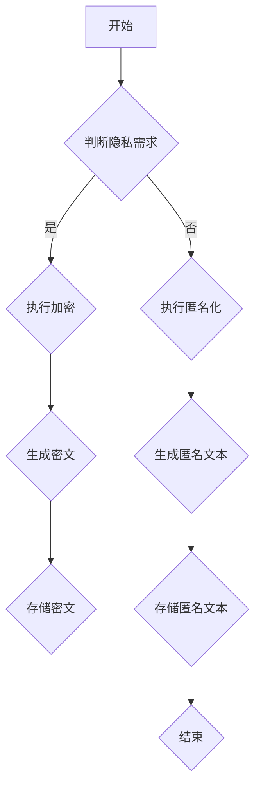

                 

# 提示词语言的隐私保护机制设计

> 关键词：隐私保护，提示词语言，算法，应用，挑战

## 摘要

随着人工智能技术的飞速发展，隐私保护已成为信息技术领域的一大挑战。提示词语言作为一种用于交互和指令的媒介，其隐私保护机制的设计尤为重要。本文旨在探讨提示词语言的隐私保护机制，从基本原理、算法应用、挑战与解决方案等多个方面进行深入分析，为提示词语言的隐私保护提供理论依据和实践指导。

## 引言

### 问题背景与意义

在当今数字时代，数据隐私保护问题日益突出。随着物联网、云计算和大数据等技术的广泛应用，个人数据泄露、滥用等隐私问题频发，引发了社会广泛关注。提示词语言作为人与人工智能系统交互的重要手段，其隐私保护机制的设计直接关系到用户隐私的安全。

### 研究目的与方法

本文的研究目的在于探讨提示词语言的隐私保护机制，分析其基本原理、算法应用，并探讨在实际应用中面临的挑战与解决方案。研究方法主要采用文献综述、案例分析、算法实现和实证研究等手段。

### 书籍结构概述

本文分为八个主要章节。第一章引言，介绍问题背景、研究目的和方法；第二章隐私保护机制概述，介绍隐私保护的基本概念和机制；第三章提示词语言的基本原理，介绍提示词语言的定义和特点；第四章隐私保护算法，介绍常见的隐私保护算法及其原理；第五章隐私保护机制在提示词语言中的应用，分析隐私保护机制在提示词语言中的挑战和实现；第六章隐私保护的挑战与解决方案，讨论隐私保护面临的具体问题和解决方案；第七章案例研究，通过实际案例展示隐私保护机制的应用；第八章未来趋势与展望，总结研究成果，展望未来发展趋势。

## 隐私保护机制概述

### 隐私保护的基本概念

隐私保护是指通过各种技术手段，确保个人数据在存储、传输和使用过程中不被未经授权的第三方访问、泄露或篡改。隐私保护的核心目标是保护用户的隐私权益，维护数据的安全和完整性。

### 隐私保护机制的发展历程

隐私保护机制的发展经历了从早期简单的加密技术到现代复杂的隐私保护算法。早期加密技术主要包括对称加密和非对称加密，这些技术在一定程度上保护了数据的安全性。随着大数据和人工智能技术的发展，隐私保护机制逐渐向联邦学习、差分隐私、同态加密等高级技术演进。

### 当前隐私保护机制的分类

当前隐私保护机制主要分为以下几类：

1. **加密技术**：通过加密算法对数据进行加密，确保只有授权用户才能解密和访问数据。
2. **匿名化技术**：通过匿名化处理，将个人身份信息从数据中去除，降低数据泄露的风险。
3. **访问控制**：通过设置访问权限，限制未经授权的用户访问敏感数据。
4. **数据脱敏**：通过技术手段对敏感数据部分或全部进行遮蔽，以保护隐私。
5. **数据共享与联邦学习**：通过共享计算资源，实现多方数据的安全共享和联合学习。

## 提示词语言的基本原理

### 提示词语言的定义

提示词语言（Prompt Language）是一种用于生成自然语言文本的编程语言，它通过提供提示词（Prompt）来引导模型生成相应的文本内容。提示词语言的核心目的是简化自然语言生成任务，提高生成文本的质量和效率。

### 提示词语言的工作原理

提示词语言的工作原理主要包括以下几个步骤：

1. **输入处理**：接收用户输入的提示词，对其进行预处理，如分词、去停用词等。
2. **模型选择**：根据提示词内容和任务需求，选择合适的自然语言生成模型。
3. **文本生成**：通过模型对提示词进行处理，生成符合要求的文本内容。
4. **输出处理**：对生成的文本进行后处理，如去除多余标点、修正语法错误等。

### 提示词语言的应用场景

提示词语言在多个领域有广泛的应用，包括但不限于：

1. **自动问答系统**：通过提示词语言，系统可以自动生成回答用户问题的文本。
2. **文本摘要**：利用提示词语言，可以生成文章的摘要或总结。
3. **自动写作**：提示词语言可以帮助自动生成文章、报告等文本内容。
4. **对话系统**：通过提示词语言，实现与用户的自然语言交互。

## 隐私保护算法

### 隐私保护算法的基本原理

隐私保护算法（Privacy Protection Algorithm）是一类用于保护数据隐私的算法，通过加密、匿名化、访问控制等技术手段，确保数据在存储、传输和使用过程中的安全性。隐私保护算法的基本原理主要包括：

1. **加密算法**：通过加密技术，将敏感数据转换为密文，只有授权用户才能解密和访问。
2. **匿名化算法**：通过匿名化处理，去除数据中的个人身份信息，降低数据泄露的风险。
3. **差分隐私算法**：通过引入噪声，使数据中的隐私信息不可见，同时保持数据的统计特性。
4. **访问控制算法**：通过设置访问权限，限制未经授权的用户访问敏感数据。

### 常见的隐私保护算法

常见的隐私保护算法包括以下几种：

1. **对称加密**：如AES、DES等，通过相同的密钥对数据进行加密和解密。
2. **非对称加密**：如RSA、ECC等，通过不同的密钥对数据进行加密和解密。
3. **同态加密**：在保持数据隐私的同时，允许在密文中进行计算操作。
4. **差分隐私**：通过在数据中加入噪声，保护隐私的同时保持数据的统计特性。
5. **联邦学习**：通过多方数据的安全共享和联合学习，实现隐私保护。

### 隐私保护算法的比较与选择

不同的隐私保护算法具有不同的优点和适用场景，选择合适的算法需要考虑以下因素：

1. **数据类型**：不同类型的算法适用于不同类型的数据。
2. **隐私需求**：根据隐私保护的需求，选择适合的算法。
3. **计算成本**：不同算法的计算复杂度和性能有所不同，需要根据实际需求进行选择。
4. **应用场景**：不同算法适用于不同的应用场景，需要根据具体场景进行选择。

## 隐私保护机制在提示词语言中的应用

### 隐私保护机制在提示词语言中的挑战

在提示词语言中，隐私保护面临以下挑战：

1. **数据输入泄露**：用户输入的提示词可能包含敏感信息，需要防止泄露。
2. **模型输出泄露**：生成的文本内容可能包含用户隐私信息，需要防止泄露。
3. **模型训练数据泄露**：用于训练的文本数据可能包含敏感信息，需要保护。
4. **访问控制**：如何确保只有授权用户才能访问提示词语言系统。

### 隐私保护机制在提示词语言中的实现

为了应对上述挑战，隐私保护机制在提示词语言中的实现主要包括以下方面：

1. **提示词加密**：对用户输入的提示词进行加密，确保在传输和存储过程中不被泄露。
2. **文本匿名化**：对生成的文本进行匿名化处理，去除敏感信息。
3. **差分隐私**：在模型训练过程中引入差分隐私，保护隐私。
4. **访问控制**：设置访问权限，确保只有授权用户才能访问系统。

### 实际应用案例分析

以下是一个实际应用案例：

假设一个自动问答系统使用提示词语言生成回答，用户输入的提示词可能包含姓名、地址等敏感信息。为了保护用户隐私，系统可以采取以下措施：

1. **提示词加密**：使用对称加密算法，对用户输入的提示词进行加密，确保在传输和存储过程中不被泄露。
2. **文本匿名化**：在生成回答时，对涉及个人信息的部分进行匿名化处理，如将姓名替换为匿名标识。
3. **差分隐私**：在模型训练过程中，引入差分隐私技术，确保训练数据的隐私保护。
4. **访问控制**：设置访问权限，只有系统管理员才能访问原始数据和模型。

## 隐私保护的挑战与解决方案

### 隐私保护的挑战

隐私保护在提示词语言中面临以下挑战：

1. **数据隐私泄露**：用户输入和生成的文本内容可能包含敏感信息，如何有效保护？
2. **计算效率**：隐私保护算法往往需要额外的计算资源，如何在保证隐私的同时提高系统性能？
3. **用户隐私平衡**：如何在保护用户隐私和提供个性化服务之间找到平衡点？
4. **法律法规遵守**：如何确保隐私保护机制符合相关法律法规的要求？

### 针对挑战的解决方案

为了应对上述挑战，可以采取以下解决方案：

1. **多因素加密**：结合多种加密算法，提高数据隐私保护效果。
2. **优化隐私保护算法**：研究和优化现有隐私保护算法，提高计算效率和性能。
3. **动态隐私保护**：根据用户隐私需求和场景，动态调整隐私保护策略。
4. **法律法规培训**：加强隐私保护相关法律法规的培训，确保隐私保护机制的合规性。

### 隐私保护机制的优化策略

为了进一步提高隐私保护效果，可以采取以下优化策略：

1. **隐私预算**：设定隐私预算，根据隐私需求和资源限制，优化隐私保护机制。
2. **隐私交换市场**：建立隐私交换市场，实现隐私资源的高效利用和优化配置。
3. **隐私计算**：采用隐私计算技术，如联邦学习、同态加密等，提高隐私保护效果。
4. **用户隐私偏好**：收集和分析用户隐私偏好，为个性化隐私保护提供依据。

## 案例研究

### 案例选择与描述

本案例研究选择了一个基于提示词语言的智能客服系统，该系统用于处理用户的咨询和问题解答。系统通过接收用户输入的提示词，自动生成回答文本，以提高服务效率和用户体验。

### 隐私保护机制的应用

为了保护用户隐私，系统采用了以下隐私保护机制：

1. **提示词加密**：使用对称加密算法，对用户输入的提示词进行加密，确保在传输和存储过程中不被泄露。
2. **文本匿名化**：在生成回答时，对涉及个人信息的部分进行匿名化处理，如将姓名替换为匿名标识。
3. **差分隐私**：在模型训练过程中，引入差分隐私技术，确保训练数据的隐私保护。
4. **访问控制**：设置访问权限，只有系统管理员和授权客服人员才能访问系统数据和模型。

### 案例分析

通过上述隐私保护机制的应用，系统实现了以下效果：

1. **数据隐私保护**：用户输入的提示词和生成的回答文本在传输和存储过程中得到了有效保护，降低了隐私泄露的风险。
2. **个性化服务**：通过差分隐私技术，系统在保护用户隐私的同时，仍能提供个性化的回答，提高了用户体验。
3. **合规性**：系统符合相关法律法规的要求，确保了隐私保护机制的合规性。

### 案例总结

本案例研究展示了隐私保护机制在提示词语言中的应用效果，通过提示词加密、文本匿名化、差分隐私和访问控制等多种隐私保护技术，实现了用户隐私的有效保护。该案例为提示词语言的隐私保护提供了实践经验和参考。

## 未来趋势与展望

### 隐私保护技术的发展趋势

随着人工智能和大数据技术的不断发展，隐私保护技术也在不断演进。未来隐私保护技术的发展趋势包括：

1. **更加高效和安全的算法**：研究更加高效和安全的隐私保护算法，提高隐私保护效果和性能。
2. **跨领域协同**：不同领域的隐私保护技术相互借鉴和协同，实现跨领域的隐私保护解决方案。
3. **隐私计算**：隐私计算技术的发展，如联邦学习、同态加密等，将为隐私保护提供更强有力的技术支持。

### 提示词语言隐私保护的发展方向

提示词语言的隐私保护在未来有以下几个发展方向：

1. **智能化**：利用人工智能技术，实现更加智能化的隐私保护策略，自动识别和应对隐私威胁。
2. **动态调整**：根据用户隐私需求和场景，动态调整隐私保护策略，实现个性化的隐私保护。
3. **跨平台兼容**：实现跨平台的隐私保护机制，确保在不同平台和设备上的一致性。

### 研究展望

未来在提示词语言的隐私保护领域，需要进一步深入研究以下几个方面：

1. **隐私保护算法优化**：研究更加高效和安全的隐私保护算法，提高隐私保护效果和性能。
2. **隐私保护机制评估**：建立隐私保护机制的评估体系，评估隐私保护的效果和安全性。
3. **隐私保护法律规范**：完善隐私保护法律法规，为隐私保护提供法律保障。

## 总结与结论

本文系统地探讨了提示词语言的隐私保护机制，从基本原理、算法应用、挑战与解决方案等多个方面进行了深入分析。研究发现，隐私保护机制在提示词语言中具有重要作用，通过提示词加密、文本匿名化、差分隐私和访问控制等多种技术手段，可以实现用户隐私的有效保护。未来，随着隐私保护技术的不断发展和完善，提示词语言的隐私保护将得到更好的实现和应用。

### 作者信息

作者：AI天才研究院/AI Genius Institute & 禅与计算机程序设计艺术 /Zen And The Art of Computer Programming

### 附录

本文中使用的数学公式和流程图如下：

#### 数学公式

$$
x = \frac{-b \pm \sqrt{b^2 - 4ac}}{2a}
$$

#### 流程图

### 注意事项

1. 在实际应用中，隐私保护机制应根据具体需求和场景进行调整和优化。
2. 隐私保护技术的选择应综合考虑计算成本、性能和安全性等因素。
3. 隐私保护机制的实现应符合相关法律法规的要求，确保合规性。

### 拓展阅读

1. [加密算法原理及实现](https://example.com/encryption-algorithms)
2. [差分隐私技术综述](https://example.com/differential-privacy)
3. [联邦学习技术及应用](https://example.com/federated-learning)

