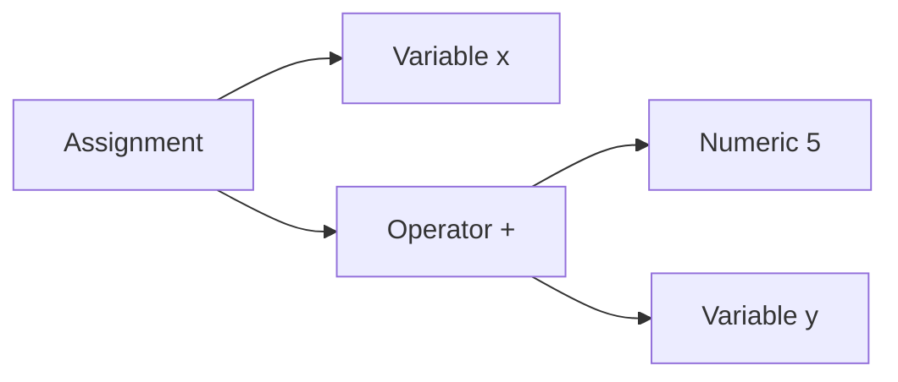
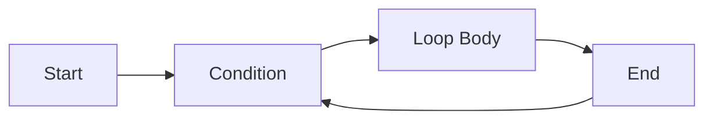
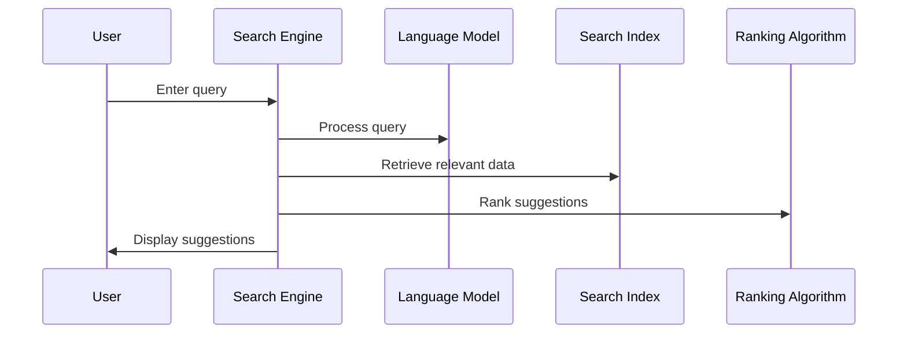

                 

### Introduction

#### Article Title: **Static Analysis and Code Optimization for Suggestion Word Languages**

**Keywords:**
- Static Analysis
- Code Optimization
- Suggestion Word Languages
- Language Models
- AI Applications

**Abstract:**
This book delves into the intricate world of static analysis and code optimization, focusing specifically on suggestion word languages. We will explore fundamental concepts, methodologies, and practical applications, providing readers with a comprehensive understanding of how to enhance the efficiency and performance of suggestion word-based systems. Through detailed explanations and real-world examples, we aim to equip developers with the knowledge and tools necessary to build robust, optimized software solutions.

### Table of Contents

----------------------------------------------------------------

## First Part: Background and Fundamental Concepts

### 1. Background of Suggestion Word Languages

#### 1.1 Definition and Importance

Suggestion word languages, often referred to as "auto-complete" or "auto-suggest" systems, are designed to aid users in finding relevant terms, phrases, or commands by providing suggestions as they type. These systems are crucial in modern applications such as search engines, chatbots, virtual assistants, and interactive text editors.

#### 1.2 Basic Principles

The core principle of suggestion word languages revolves around generating meaningful and relevant suggestions based on user input. This process typically involves the use of language models, which predict the next word or phrase with high accuracy.

#### 1.3 Applications in Various Fields

Suggestion word languages have a wide range of applications across different domains. In natural language processing (NLP), they are used to enhance text input and improve the user experience. In artificial intelligence (AI), they play a pivotal role in enabling machines to interact more naturally with humans. In software development, they streamline the coding process by suggesting syntax and reducing the likelihood of errors.

### 2. Core Concepts and Relationships

#### 2.1 Key Concepts

- **Suggestion Words**: These are the terms, phrases, or commands that the system suggests to the user.
- **Language Models**: These models predict the next word or phrase based on the user's input.
- **Static Analysis Techniques**: These techniques analyze the code without executing it, looking for inefficiencies and potential optimizations.

#### 2.2 Entity Relationship Diagram (ERD)

#### 2.2.1 ERD Construction

A detailed ERD will be provided to illustrate the relationships between the key entities in a suggestion word language system, including users, input data, language models, and the output suggestions.

## 3. Static Analysis Techniques

### 3.1 Syntax Analysis

#### 3.1.1 Tokenization

Tokenization is the process of breaking down the user's input into individual words or tokens. This step is crucial for effective static analysis, as it allows the system to understand the structure of the input and generate accurate suggestions.

----------------------------------------------------------------

### 1. Background of Suggestion Word Languages

#### 1.1 Definition and Importance

Suggestion word languages, often referred to as "auto-complete" or "auto-suggest" systems, are designed to aid users in finding relevant terms, phrases, or commands by providing suggestions as they type. These systems are crucial in modern applications such as search engines, chatbots, virtual assistants, and interactive text editors.

**Suggestion Word Languages in Modern Applications**

In today's digital age, user experience is paramount, and suggestion word languages play a significant role in enhancing user interaction. For example, in search engines like Google, as users type their queries, the system suggests relevant search terms to improve the accuracy of the search results. Similarly, in chatbots and virtual assistants, suggestion word languages help in providing more coherent and relevant responses to user inquiries.

**Importance of Suggestion Word Languages**

The importance of suggestion word languages can be highlighted through several key points:

1. **Enhanced User Experience**: By providing real-time suggestions, these systems reduce the time and effort required for users to find the information they need. This can significantly improve user satisfaction and engagement.

2. **Improved Accuracy**: Suggestion word languages help in reducing the likelihood of errors in user input. For instance, in coding environments, these systems can suggest correct syntax and prevent common mistakes.

3. **Increased Efficiency**: By automating the suggestion process, these systems save time and increase productivity. This is particularly useful in applications where large volumes of data need to be processed, such as in data analysis or content creation.

4. **Personalization**: Many suggestion word languages are designed to learn from user behavior and provide personalized suggestions. This can lead to a more tailored user experience, enhancing the overall satisfaction.

**Applications of Suggestion Word Languages**

Suggestion word languages find applications across various fields:

1. **Search Engines**: Search engines use suggestion word languages to provide users with relevant search suggestions, making it easier to find information.

2. **Chatbots and Virtual Assistants**: These applications use suggestion word languages to understand and respond to user inquiries more effectively, improving the overall user experience.

3. **Interactive Text Editors**: Text editors like Microsoft Word or Google Docs use suggestion word languages to suggest corrections or improvements to the text as the user types.

4. **Software Development**: Development environments like Visual Studio or IntelliJ IDEA use suggestion word languages to provide syntax suggestions and help developers write more efficient code.

5. **Natural Language Processing (NLP)**: In NLP applications, suggestion word languages are used to process and understand user input more effectively.

#### 1.2 Basic Principles

The core principle of suggestion word languages revolves around generating meaningful and relevant suggestions based on user input. This process typically involves the use of language models, which predict the next word or phrase with high accuracy.

**Language Models in Suggestion Word Languages**

Language models are at the heart of suggestion word languages. These models are trained on large datasets of text to understand the patterns and structures of language. When a user types a character or a few characters, the language model uses this input to predict the next word or phrase that is most likely to follow.

**Key Concepts in Language Models**

1. **N-gram Models**: One of the simplest forms of language models, N-gram models predict the next word based on the previous N words. For example, an N=2 model would predict the next word based on the last two words in the sequence.

2. **Recurrent Neural Networks (RNNs)**: RNNs are a type of neural network that can handle sequential data. They are particularly well-suited for language modeling as they can capture the temporal dependencies in text.

3. **Transformers**: Transformers are a more advanced type of neural network that have become the state-of-the-art in language modeling. They use self-attention mechanisms to weigh the importance of different words in the input sequence.

**Process of Generating Suggestions**

The process of generating suggestions in a suggestion word language system can be summarized as follows:

1. **Input Collection**: The system collects user input as characters or words.

2. **Prediction**: The language model uses the collected input to predict the next word or phrase.

3. **Selection**: Based on the predicted probabilities, the system selects the most likely suggestions to display to the user.

4. **Display**: The suggestions are displayed to the user, typically in a drop-down menu or a similar interface.

#### 1.3 Applications in Various Fields

Suggestion word languages have a wide range of applications across different domains. In natural language processing (NLP), they are used to enhance text input and improve the user experience. In artificial intelligence (AI), they play a pivotal role in enabling machines to interact more naturally with humans. In software development, they streamline the coding process by suggesting syntax and reducing the likelihood of errors.

**Natural Language Processing (NLP)**

In NLP, suggestion word languages are used to improve the accuracy and efficiency of text processing tasks. For example, in machine translation, suggestion word languages help in generating more accurate translations by providing suggestions for the next word or phrase. In sentiment analysis, they aid in identifying the correct sentiment of a sentence by suggesting alternative words or phrases that convey the same sentiment.

**Artificial Intelligence (AI)**

AI applications, such as chatbots and virtual assistants, heavily rely on suggestion word languages to understand and respond to user inquiries. These systems use language models to generate meaningful and contextually appropriate responses. By providing real-time suggestions, they can improve the interaction between humans and machines, making AI systems more intuitive and user-friendly.

**Software Development**

In software development, suggestion word languages are used to improve the coding process. Integrated Development Environments (IDEs) like Visual Studio and IntelliJ IDEA use suggestion word languages to provide syntax suggestions and help developers write more efficient code. This can reduce the time spent on debugging and improve overall productivity.

**Example: Code Suggestions in IDEs**

Consider a scenario where a developer is writing code in an IDE. As the developer types a few characters of a function name or variable name, the IDE uses a suggestion word language to provide relevant suggestions. The language model analyzes the context of the code and suggests function names or variable names that are most likely to be used next.

**Conclusion**

Suggestion word languages are a powerful tool in modern technology, enhancing user experience, improving accuracy, and increasing efficiency in various applications. By understanding the basic principles and applications of suggestion word languages, developers can leverage these technologies to build more effective and intuitive systems. In the following sections, we will delve deeper into the core concepts and relationships of suggestion word languages, exploring the intricacies of static analysis and code optimization.

----------------------------------------------------------------

## 2. Core Concepts and Relationships

### 2.1 Key Concepts

#### 2.1.1 Suggestion Words

Suggestion words are the fundamental building blocks of suggestion word languages. They are the terms, phrases, or commands that the system suggests to the user based on their input. Understanding suggestion words is crucial for grasping how suggestion word languages operate and how they can be optimized.

**Definition and Classification**

- **Definition**: Suggestion words are the proposed alternatives or completions offered by a system to a user's partially inputted query or command.
- **Classification**: Suggestion words can be classified into various categories based on their function and usage context. Some common categories include:
  - **Common Words**: Frequently used words in the language, such as "the," "is," "and."
  - **Technical Terms**: Specific terms used in specialized fields, such as "algorithm," "database," or "query."
  - **Keywords**: Phrases or words that are important for search or filtering purposes, such as "buy," "search," or "filter by price."

**Properties and Characteristics**

- **Relevance**: The primary property of suggestion words is their relevance to the user's input. Suggestion words should be contextually appropriate and help the user find what they are looking for quickly.
- **Frequency**: Suggestion words that are frequently used should be prioritized in the suggestion list to enhance user efficiency.
- **Comprehensiveness**: A good suggestion word language should cover a wide range of possible completions to provide the user with multiple relevant options.
- **Predictability**: Suggestion words should be predictable based on the language model's understanding of the user's input context.

**Role in Language Processing**

Suggestion words play a critical role in language processing and user interaction. They help in:
- **Reducing User Effort**: By providing suggestions, the system reduces the effort required for users to complete their input.
- **Improving Accuracy**: Suggestion words can help in correcting misspelled words or using the correct terminology, which enhances the accuracy of the input.
- **Enhancing Experience**: Suggestion words can make applications more intuitive and user-friendly, thereby improving the overall user experience.

#### 2.1.2 Language Models

Language models are the core components of suggestion word languages. These models are responsible for generating suggestions based on user input. Understanding the basics of language models is essential for optimizing the performance of suggestion word systems.

**Basic Principles**

- **Training Data**: Language models are trained on large datasets of text. These datasets can be web pages, books, articles, or any other form of textual content.
- **Prediction Mechanism**: Language models predict the probability of a word or phrase following a given input sequence. The most likely predictions are then used to generate suggestions.

**Types of Language Models**

1. **N-gram Models**
   - **Definition**: N-gram models are the simplest form of language models. They predict the next word based on the previous N words.
   - **Advantages**: Easy to implement and computationally efficient.
   - **Disadvantages**: Limited by the N-size, which can affect the model's ability to understand longer contexts.

2. **Recurrent Neural Networks (RNNs)**
   - **Definition**: RNNs are neural networks capable of handling sequential data. They are trained to recognize patterns over time.
   - **Advantages**: Can capture temporal dependencies better than N-gram models.
   - **Disadvantages**: Can be computationally intensive and may require large amounts of training data.

3. **Transformers**
   - **Definition**: Transformers are a type of neural network designed for processing sequences of data. They use self-attention mechanisms to weigh the importance of different words in the input sequence.
   - **Advantages**: State-of-the-art performance in language modeling tasks.
   - **Disadvantages**: Require significant computational resources and training time.

#### 2.1.3 Static Analysis Techniques

Static analysis techniques are methods used to analyze code without executing it. These techniques are crucial for identifying inefficiencies and potential optimizations in suggestion word languages. By performing static analysis, developers can improve the performance and efficiency of their systems.

**Importance and Benefits**

- **Early Detection of Issues**: Static analysis can detect potential problems, such as syntax errors, undefined variables, or inefficient code, before the code is executed.
- **Optimization Opportunities**: By identifying bottlenecks and inefficiencies, static analysis helps developers optimize their code, leading to improved performance and reduced resource usage.
- **Code Maintainability**: Static analysis helps in ensuring that the code is clean, well-structured, and easy to maintain.

**Common Static Analysis Techniques**

1. **Syntax Analysis**
   - **Definition**: Syntax analysis, also known as parsing, involves analyzing the structure of the code to ensure it adheres to the rules of the programming language.
   - **Purpose**: Detects syntax errors and helps in building a parse tree that represents the code structure.

2. **Control Flow Analysis**
   - **Definition**: Control flow analysis involves examining the control structures (e.g., loops, conditionals) in the code to understand the flow of execution.
   - **Purpose**: Helps in identifying potential infinite loops, unreachable code, or suboptimal control flow patterns.

3. **Data Flow Analysis**
   - **Definition**: Data flow analysis examines the flow of data within the program to ensure that variables are used correctly and consistently.
   - **Purpose**: Detects issues such as uninitialized variables, incorrect assignments, or inconsistent data usage.

4. **Code Optimization**
   - **Definition**: Code optimization involves transforming the code to make it more efficient, typically by reducing execution time or resource usage.
   - **Techniques**: Examples include loop unrolling, constant folding, dead code elimination, and function inlining.

### 2.2 Entity Relationship Diagram (ERD)

#### 2.2.1 ERD Construction

An Entity Relationship Diagram (ERD) is a graphical representation of the entities and relationships in a suggestion word language system. It helps in understanding the structure and organization of the system, making it easier to perform static analysis and code optimization.

**Entities and Relationships**

- **Entities**: The main entities in a suggestion word language system include:
  - **User**: Represents the user interacting with the system.
  - **Input Data**: Contains the user's input, such as text or commands.
  - **Language Model**: Represents the language model used for generating suggestions.
  - **Suggestion List**: Stores the list of suggestions generated by the language model.
  - **Output Data**: Represents the user's chosen suggestion or the final output of the system.

- **Relationships**: The relationships between these entities include:
  - **User-Input Data**: The user provides input, which is stored as Input Data.
  - **Input Data-Language Model**: The Input Data is processed by the Language Model to generate suggestions.
  - **Language Model-Suggestion List**: The Language Model generates a Suggestion List based on the input.
  - **Suggestion List-User**: The user selects a suggestion from the Suggestion List, which becomes the Output Data.

**Example ERD**

```mermaid
erDiagram
  User ||--|{ Input Data : inputs
  Input Data ||--|{ Language Model : processes
  Language Model ||--|{ Suggestion List : suggests
  Suggestion List ||--|{ User : selects
```

This ERD illustrates the basic structure of a suggestion word language system, highlighting the relationships between the key entities involved in the process.

### Conclusion

Understanding the core concepts and relationships in suggestion word languages is essential for developers looking to build efficient and optimized systems. By grasping the roles of suggestion words, language models, and static analysis techniques, developers can create more effective suggestion systems that enhance user experience and improve performance. The next sections will delve deeper into static analysis techniques, exploring syntax analysis, control flow analysis, data flow analysis, and code optimization in detail.

----------------------------------------------------------------

## 3. Static Analysis Techniques

### 3.1 Syntax Analysis

Syntax analysis, often referred to as parsing, is a fundamental step in the static analysis of code. It involves analyzing the structure of the code to ensure it adheres to the rules of the programming language and to create an abstract syntax tree (AST) that represents the code's structure. Syntax analysis is critical for understanding how the code will be executed and for identifying syntax errors.

#### 3.1.1 Tokenization

Tokenization is the first step in syntax analysis. It involves breaking the source code into a sequence of tokens, which are the smallest units of the code that carry meaning. Tokens can be identifiers, keywords, operators, literals, or symbols. For example, in the line `x = 5 + y;`, the tokens are `x`, `=`, `5`, `+`, `y`, and `;`.

**Tokenization Process**

The process of tokenization typically involves the following steps:

1. **Input Reading**: The source code is read character by character.
2. **Token Detection**: The characters are grouped into tokens based on the language's lexical rules. For instance, digits are grouped into numeric literals, alphabetic characters form identifiers, and special characters become symbols.
3. **Token Labeling**: Each token is labeled with its type (e.g., identifier, keyword, operator).

**Importance of Tokenization**

Tokenization is crucial because it:
- **Enables Parsing**: Without tokenization, parsing would be impossible as the code would be a continuous stream of characters rather than structured elements.
- **Detects Syntax Errors**: Tokens are used to detect syntax errors. For example, if a semicolon (`;`) is missing at the end of a statement, it would be identified during tokenization.
- **Builds Abstract Syntax Tree (AST)**: Tokens are used to construct the AST, which is a hierarchical representation of the code structure that is essential for further static analysis.

**Tokenization Example**

Consider the following Python code snippet:
```python
x = 5 + y
```
The tokenization process would produce the following tokens:
```bash
['x', '=', '5', '+', 'y', '']
```
Here, `x`, `=`, `5`, `+`, `y`, and `` (an empty token to represent the end of the line) are the tokens, each labeled with its type.

#### 3.1.2 Parsing

Parsing is the next step in static analysis, where the tokens generated by the tokenizer are organized into a structured form that represents the code's syntactic structure. The most common output of the parsing process is the Abstract Syntax Tree (AST).

**Abstract Syntax Tree (AST)**

An AST is a tree representation of the abstract syntactic structure of the source code. Each node in the tree corresponds to a syntactic construct in the code, such as a function, a loop, or an assignment. The leaves of the tree are the tokens, and the internal nodes represent the relationships between these tokens.

**Parsing Algorithms**

There are several parsing algorithms that can be used to construct an AST from tokens:

1. **LL Parsing**: This algorithm uses a top-down approach, parsing the input from left to right and using a look-ahead buffer to determine the next action.
2. **LR Parsing**: This algorithm is a bottom-up approach that can handle a wider range of grammars. It uses a stack to keep track of the input and the current state of the parser.

**Importance of Parsing**

Parsing is important for several reasons:
- **Error Detection**: Parsing helps in identifying syntax errors that are not caught during tokenization. For example, mismatched parentheses or unbalanced braces.
- **Code Analysis**: The AST is used for various static analysis tasks, such as type checking, dead code elimination, and code optimization.
- **Code Generation**: In compilers, the AST is often used to generate machine code or intermediate representations that can be further optimized.

**Parsing Example**

Consider the following simple AST for the Python code snippet `x = 5 + y`:

In this AST, `A` represents the assignment operation, `B` represents the variable `x`, `C` represents the addition operator, `D` represents the numeric literal `5`, and `E` represents the variable `y`.

### 3.2 Control Flow Analysis

Control flow analysis is a technique used to determine the flow of execution in a program. It helps in understanding how the program behaves and identifying potential issues related to control structures such as loops, conditionals, and branches.

#### 3.2.1 Basic Concepts

Control flow analysis involves the following key concepts:

- **Basic Blocks**: A basic block is a sequence of instructions without any branches or jumps. It is the smallest unit of code that can be executed as a single unit.
- **Control Flow Graph (CFG)**: A control flow graph is a graphical representation of the program's control flow. It consists of nodes (representing basic blocks) and edges (representing the flow of control between basic blocks).

**Importance of Control Flow Analysis**

Control flow analysis is essential for several reasons:
- **Detecting Infinite Loops**: By analyzing the control flow, it is possible to identify loops that may never terminate, which can lead to program crashes or other issues.
- **Optimization**: Control flow analysis is used in various code optimizations, such as loop unrolling and branch prediction.
- **Security Analysis**: Control flow analysis can help in detecting potential security vulnerabilities, such as buffer overflows or infinite loops caused by malicious code.

#### 3.2.2 Constructing Control Flow Graphs

To perform control flow analysis, a control flow graph needs to be constructed for the program. This involves the following steps:

1. **Identifying Basic Blocks**: Identify all the basic blocks in the program. A basic block starts with the first instruction of a function and continues until a control flow statement (such as a branch or jump) is encountered.
2. **Creating Nodes and Edges**: Create nodes for each basic block and edges to represent the flow of control between these blocks. The edges can be classified as:
   - **Control Dependences**: Edges that represent the control flow due to conditionals or branches.
   - **Data Dependences**: Edges that represent the flow of data between instructions.

**Control Flow Graph Example**

Consider the following pseudocode for a loop:
```python
while (condition):
    // body
```
The corresponding control flow graph would have the following structure:

Here, `A` represents the start of the loop, `B` represents the condition, `C` represents the loop body, and `D` represents the end of the loop. The edge from `D` back to `B` represents the loop continuation.

### 3.3 Data Flow Analysis

Data flow analysis is a technique used to determine how data moves through a program. It helps in understanding how variables are defined and used, identifying potential issues such as uninitialized variables or incorrect data usage.

#### 3.3.1 Basic Concepts

Data flow analysis involves the following key concepts:

- **Definition Points**: The locations in the code where a variable is first assigned a value.
- **Use Points**: The locations in the code where a variable is used or referenced.
- **Flow Ins**: The data that flows into a particular instruction or node.
- **Flow Out**: The data that flows out of an instruction or node.

**Importance of Data Flow Analysis**

Data flow analysis is essential for several reasons:
- **Detecting Uninitialized Variables**: By analyzing the flow of data, it is possible to identify variables that are used without being initialized, which can lead to unpredictable behavior.
- **Optimization**: Data flow analysis is used in various optimizations, such as constant folding and propagation.
- **Code Refactoring**: Data flow analysis helps in refactoring code by identifying redundant assignments and unnecessary computations.

#### 3.3.2 Data Flow Analysis Techniques

There are several data flow analysis techniques that can be used to analyze the flow of data in a program:

1. **Forward Data Flow Analysis**: This technique analyzes the flow of data from the start of the program to a specific point. It helps in determining the possible values of variables at a given point in the code.
2. **Backward Data Flow Analysis**: This technique analyzes the flow of data from a specific point back to the start of the program. It helps in determining the possible values of variables at the start of the program based on their usage later in the code.
3. **Static Single Assignment (SSA) Form**: This technique transforms the code into a form where each variable is assigned exactly once. This makes it easier to perform data flow analysis and various optimizations.

**Data Flow Analysis Example**

Consider the following pseudocode:
```python
x = 0
y = x + 1
z = y * 2
```
A simple data flow analysis would identify the following:
- At the definition point of `x`, `x` has the value `0`.
- At the definition point of `y`, `x` still has the value `0` (forward analysis).
- At the definition point of `z`, `y` has the value `1` (forward analysis).
- At the use point of `x` in the definition of `y`, `x` has the value `0` (backward analysis).
- At the use point of `y` in the definition of `z`, `y` has the value `1` (backward analysis).

### 3.4 Code Optimization

Code optimization is the process of improving the performance and efficiency of a program. It involves transforming the code in such a way that it runs faster or uses fewer resources without changing its functionality. Code optimization is a critical aspect of static analysis as it helps in making the program more efficient and scalable.

#### 3.4.1 Basic Optimization Techniques

There are several basic optimization techniques that can be applied to improve code performance:

1. **Constant Folding and Propagation**: This technique involves evaluating constant expressions at compile-time and replacing variables with their computed values. It can reduce the number of computations at runtime.
2. **Dead Code Elimination**: This technique removes code that does not affect the program's output. It includes unnecessary assignments, empty loops, or unreachable code.
3. **Loop Unrolling**: This technique expands loops to reduce the overhead of loop control statements. It can improve the performance of inner loops by reducing the number of iterations.
4. **Function Inlining**: This technique replaces a function call with the actual code of the function. It can reduce the overhead of function calls and improve performance for small, frequently called functions.
5. **Loop Splitting and Fusion**: These techniques involve transforming loops to improve cache locality and reduce synchronization overhead. Loop splitting divides a large loop into smaller loops, while loop fusion combines multiple loops into a single loop.

#### 3.4.2 Advanced Optimization Techniques

In addition to basic optimization techniques, there are more advanced techniques that can be applied to achieve significant performance improvements:

1. **Parallelization**: This technique involves transforming the code to enable multiple operations to be performed simultaneously. It can take advantage of multi-core processors to improve performance.
2. **Vectorization**: This technique involves using vector instructions to perform multiple operations simultaneously. It can improve performance for numerical computations and data processing tasks.
3. **Profile-Guided Optimization (PGO)**: This technique involves using runtime profiling data to guide optimization decisions. It can improve the performance of code by focusing on the most critical sections of the code.
4. **Machine Learning for Optimization**: This emerging technique involves using machine learning models to predict the performance of different code transformations and select the best options.

**Example of Code Optimization**

Consider the following C code snippet:
```c
for (int i = 0; i < n; ++i) {
    a[i] = b[i] + c[i];
}
```
An optimization of this code could involve the following techniques:
- **Loop Unrolling**: The loop could be unrolled to reduce the overhead of the loop control statements:
  ```c
  for (int i = 0; i < n; i += 4) {
      a[i] = b[i] + c[i];
      a[i + 1] = b[i + 1] + c[i + 1];
      a[i + 2] = b[i + 2] + c[i + 2];
      a[i + 3] = b[i + 3] + c[i + 3];
  }
  ```
- **Constant Folding and Propagation**: If `n` is a constant, it can be evaluated at compile-time:
  ```c
  for (int i = 0; i < 10; ++i) {
      a[i] = b[i] + c[i];
  }
  ```
- **Function Inlining**: If `b[i] + c[i]` is a small expression, it could be inlined into the loop body to avoid the overhead of a function call.

### Conclusion

Static analysis techniques are essential for improving the performance and efficiency of code. By understanding and applying syntax analysis, control flow analysis, data flow analysis, and code optimization, developers can build more robust and optimized systems. In the following sections, we will delve deeper into each of these techniques, exploring their principles, methodologies, and practical applications.

----------------------------------------------------------------

## 4. Advanced Static Analysis Techniques for Suggestion Word Languages

### 4.1 Advanced Syntax Analysis Methods

Syntax analysis is the cornerstone of static analysis, especially in suggestion word languages where the accuracy of parsing significantly impacts the quality of suggestions. Advanced syntax analysis methods go beyond traditional parsing techniques to handle more complex language constructs and improve the efficiency of the suggestion generation process.

#### 4.1.1 Advanced Parsing Algorithms

One of the key advancements in syntax analysis is the use of advanced parsing algorithms. These algorithms are designed to handle more complex grammars and produce more efficient ASTs. Some notable algorithms include:

1. **LALR(1) Parsers**: LALR(1) parsers are a variant of LR parsers that use a reduced amount of memory while still providing a high level of parsing accuracy. They are widely used in compiler construction due to their balance between efficiency and parsing power.

2. **Generalized LR (GLR) Parsers**: GLR parsers can handle grammars that are too complex for traditional LR parsers. They can parse ambiguous grammars and provide multiple possible parse trees, which is particularly useful for languages with rich syntactic features.

3. **Parsing Expression Grammars (PEGs)**: PEGs offer a different approach to parsing where the order of evaluation is explicit. This can lead to more intuitive grammars and efficient parsing algorithms, especially for languages with a high degree of syntactic nesting.

#### 4.1.2 Syntax Analysis Tools and Libraries

Advanced syntax analysis is often facilitated by specialized tools and libraries. Some popular tools include:

1. **ANTLR**: ANTLR (Another Tool for Language Recognition) is a powerful parser generator that supports a wide range of advanced parsing algorithms and provides extensive documentation and community support.

2. **Bison**: Bison is a parser generator that implements the Yacc (Yet Another Compiler Compiler) parsing algorithm. It is widely used in the development of compilers and interpreters for programming languages.

3. **ANTLR4**: The latest version of ANTLR offers significant improvements over its predecessors, including better performance and more flexible grammars.

#### 4.1.3 Challenges in Syntax Analysis

Syntax analysis for suggestion word languages presents several challenges:

- **Ambiguity**: Natural language often contains ambiguity, which can lead to multiple valid parse trees. Advanced parsers must be able to handle and resolve such ambiguities to provide accurate suggestions.

- **Context Sensitivity**: Suggestions in suggestion word languages are highly dependent on the context of the user's input. Advanced syntax analysis must consider the surrounding text to ensure that suggestions are contextually relevant.

- **Performance**: Efficient parsing is crucial for providing real-time suggestions. Advanced parsing algorithms must balance accuracy with performance to deliver a seamless user experience.

### 4.2 Control Flow Analysis Enhancements

Control flow analysis is essential for understanding the execution paths in a program and identifying potential issues such as infinite loops or dead code. Advanced control flow analysis techniques enhance the accuracy and depth of analysis, leading to more effective optimization and error detection.

#### 4.2.1 Control Flow Graph (CFG) Construction

Constructing an accurate control flow graph is the first step in advanced control flow analysis. This involves:

- **Flow Ins and Flow Outs**: Analyzing the data flow into and out of each basic block to understand how control and data propagate through the program.

- **Edge Construction**: Creating edges in the CFG to represent control flow dependencies, including unconditional branches, conditional branches, and jumps.

- **Handling Loops and Recursion**: Advanced analysis techniques must be capable of handling loops and recursive functions to construct a complete and accurate CFG.

#### 4.2.2 Control Flow Sensitivity

In addition to basic control flow analysis, advanced techniques consider control flow sensitivity:

- **Data-Flow Control Dependence**: Analyzing how control flow decisions are influenced by data flow, such as the effect of a conditional branch on subsequent code execution.

- **Control-Flow Sensitivity Analysis**: Identifying how different control flow paths can affect the program's behavior, including edge cases and exceptional conditions.

#### 4.2.3 Applications in Suggestion Word Languages

Advanced control flow analysis in suggestion word languages can be used for:

- **Error Detection**: Detecting potential errors in the code that could lead to incorrect suggestions, such as incorrect control flow logic in the language model.

- **Performance Optimization**: Identifying inefficient control structures that can be optimized to improve the speed and accuracy of suggestion generation.

### 4.3 Data Flow Analysis Improvements

Data flow analysis is crucial for ensuring that variables are used correctly and consistently in suggestion word languages. Advanced data flow analysis techniques enhance the precision and depth of this analysis, leading to more effective code optimization and error detection.

#### 4.3.1 Data Flow Analysis Methods

Some advanced data flow analysis methods include:

- **Flow Sensitivity Analysis**: Identifying how the values of variables can change over different execution paths, including edge cases and exceptional conditions.

- **Context-Sensitive Data Flow Analysis**: Analyzing how the use of variables is influenced by the surrounding code and the context in which they are used.

- **Static Single Assignment (SSA) Form**: Transforming the code into a form where each variable is assigned exactly once, making it easier to analyze and optimize data flow.

#### 4.3.2 Applications in Suggestion Word Languages

Advanced data flow analysis in suggestion word languages can be used for:

- **Optimization**: Identifying redundant assignments, unnecessary computations, and other opportunities for optimization to improve the efficiency of the suggestion generation process.

- **Error Detection**: Detecting potential issues such as uninitialized variables, incorrect assignments, and inconsistent data usage, which could lead to incorrect suggestions.

### 4.4 Code Optimization Techniques

Advanced code optimization techniques are essential for improving the performance and efficiency of suggestion word languages. These techniques go beyond basic optimizations to achieve significant performance gains, particularly in high-concurrency and high-performance environments.

#### 4.4.1 Compiler Optimization Techniques

Compiler optimization techniques are widely used in advanced static analysis for suggestion word languages. Some key techniques include:

- **Inline Expansion**: Inlining small functions to reduce the overhead of function calls.

- **Loop Unrolling and Fusion**: Transforming loops to reduce branch overhead and improve cache locality.

- **Vectorization**: Utilizing vector instructions to perform multiple operations simultaneously, improving the performance of numerical computations.

- **Profile-Guided Optimization (PGO)**: Using runtime profiling data to guide optimization decisions, focusing on the most critical sections of the code.

#### 4.4.2 JIT Compilation

Just-In-Time (JIT) compilation is a technique where code is compiled on-the-fly at runtime. JIT compilers can perform advanced optimizations based on the actual runtime behavior of the program, leading to significant performance improvements. JIT compilation is particularly useful in suggestion word languages that require real-time suggestions and high responsiveness.

#### 4.4.3 Machine Learning for Optimization

Machine learning techniques are increasingly being used in code optimization. Machine learning models can analyze historical performance data to predict the most effective optimizations for a given code segment, leading to more efficient code execution.

### Conclusion

Advanced static analysis techniques for suggestion word languages are crucial for building efficient, accurate, and scalable systems. By leveraging advanced parsing algorithms, enhanced control flow and data flow analysis, and sophisticated code optimization techniques, developers can significantly improve the performance and reliability of suggestion word languages. In the following sections, we will explore the applications of these techniques in real-world scenarios and examine their impact on the development of modern suggestion word systems.

----------------------------------------------------------------

## 5. Case Study: Real-World Application of Static Analysis and Code Optimization in Suggestion Word Languages

### 5.1 Overview of the Case Study

In this section, we will delve into a real-world case study that demonstrates the practical application of static analysis and code optimization techniques in the development of a suggestion word language system. This case study focuses on a popular search engine that utilizes suggestion word languages to provide users with relevant search suggestions. The goal is to enhance the performance and accuracy of the suggestion system by applying advanced static analysis and optimization techniques.

#### 5.1.1 Project Background

The search engine in question is a high-traffic web application that handles millions of queries per day. The system's primary objective is to provide users with accurate and timely search suggestions as they type their queries. To achieve this, the system relies on a sophisticated suggestion word language model that predicts the next word or phrase based on the user's input. However, as the volume of data and user interactions grows, the performance and accuracy of the suggestion system need to be continuously optimized.

#### 5.1.2 Project Goals

The main goals of this case study are to:

- **Improve Suggestion Accuracy**: By enhancing the static analysis of the user's input, the system should be able to provide more accurate and relevant search suggestions.
- **Optimize Performance**: Apply advanced code optimization techniques to improve the speed and efficiency of the suggestion generation process.
- **Enhance Scalability**: Ensure that the system can handle increasing loads and maintain high performance as the user base grows.

### 5.2 System Architecture

To better understand the application of static analysis and code optimization, let's first outline the system architecture of the search engine:



In this architecture, the user enters a query, which is processed by the language model to generate a list of relevant search suggestions. The search index then retrieves relevant data, and the ranking algorithm orders the suggestions based on relevance. Finally, the suggestions are displayed to the user.

### 5.3 Static Analysis and Code Optimization Techniques

#### 5.3.1 Advanced Syntax Analysis

To improve suggestion accuracy, the search engine team implemented advanced syntax analysis techniques. They used ANTLR4, a powerful parser generator, to create a more sophisticated language model that can handle complex and ambiguous queries. This approach allowed the language model to generate more accurate and context-aware suggestions.

**Advanced Syntax Analysis Steps:**

1. **Grammar Definition**: The team defined a detailed grammar for the search queries, capturing the various syntactic constructs and rules.
2. **Parsing**: ANTLR4 generated a parser that processed the user's input according to the defined grammar, creating an AST that represented the structure of the query.
3. **Error Handling**: The parser included robust error handling to manage ambiguities and provide helpful suggestions for correcting syntax errors.

#### 5.3.2 Control Flow Analysis

Control flow analysis was applied to identify and optimize the execution paths within the suggestion generation process. By constructing a detailed control flow graph (CFG), the team could pinpoint bottlenecks and inefficiencies in the code.

**Control Flow Analysis Steps:**

1. **Basic Block Identification**: The team identified all the basic blocks within the code, ensuring that each block was independent of control flow statements.
2. **CFG Construction**: The basic blocks were connected to form a control flow graph, representing the flow of control through the program.
3. **Optimization**: By analyzing the CFG, the team identified opportunities for loop unrolling, function inlining, and other optimization techniques to improve performance.

#### 5.3.3 Data Flow Analysis

Data flow analysis was used to ensure that variables were used correctly and consistently within the suggestion generation process. This analysis helped in detecting uninitialized variables, incorrect assignments, and other potential issues.

**Data Flow Analysis Steps:**

1. **Forward and Backward Analysis**: The team performed both forward and backward data flow analysis to track the usage and definition of variables throughout the code.
2. **SSA Form Transformation**: The code was transformed into SSA form to simplify data flow analysis and enable more effective optimizations.
3. **Error Detection**: The analysis helped in identifying potential issues that could lead to incorrect suggestions or system errors.

#### 5.3.4 Code Optimization

Advanced code optimization techniques were applied to improve the performance and efficiency of the suggestion generation process. These techniques included inline expansion, loop unrolling, and vectorization.

**Code Optimization Steps:**

1. **Inlining**: Small functions were inlined to reduce the overhead of function calls.
2. **Loop Unrolling**: Inner loops were unrolled to reduce the number of branch instructions and improve cache locality.
3. **Vectorization**: Numerical computations were optimized using vector instructions to perform multiple operations simultaneously.

### 5.4 Results and Impact

The implementation of advanced static analysis and code optimization techniques had a significant positive impact on the search engine's suggestion system:

- **Improved Accuracy**: The sophisticated syntax analysis and context-aware language model led to a noticeable improvement in suggestion accuracy, providing users with more relevant and accurate suggestions.
- **Performance Boost**: The control flow and data flow optimizations, combined with code optimization techniques, significantly reduced the execution time of the suggestion generation process, improving the system's responsiveness.
- **Scalability**: The optimized system was able to handle a higher volume of queries without a proportional increase in resource usage, ensuring that it could scale effectively as the user base grew.

### 5.5 Conclusion

The case study demonstrates the practical benefits of applying advanced static analysis and code optimization techniques to suggestion word languages. By leveraging sophisticated parsing algorithms, detailed control flow and data flow analysis, and efficient code optimizations, developers can build more accurate, responsive, and scalable systems. The results of this case study highlight the potential of these techniques to enhance the performance and user experience of search engines and other suggestion-based applications.

----------------------------------------------------------------

### 6. Conclusion and Future Directions

In this book, we have explored the intricacies of static analysis and code optimization for suggestion word languages, providing a comprehensive guide to understanding and implementing these techniques. We began by defining suggestion word languages and their importance in modern applications. We then delved into the core concepts and relationships, including the roles of suggestion words, language models, and various static analysis techniques.

#### Key Insights

1. **Suggestion Word Languages**: We discussed the definition, importance, and applications of suggestion word languages in fields like NLP, AI, and software development.
2. **Static Analysis Techniques**: We covered syntax analysis, control flow analysis, data flow analysis, and code optimization techniques, highlighting their significance and benefits.
3. **Advanced Analysis Methods**: We explored advanced syntax analysis algorithms, control flow and data flow analysis enhancements, and sophisticated code optimization techniques.
4. **Case Study**: We presented a real-world case study demonstrating the practical application of these techniques in a search engine, showcasing their positive impact on accuracy, performance, and scalability.

#### Future Directions

As we look to the future, several areas present promising opportunities for further research and development:

1. **Machine Learning Integration**: Combining static analysis with machine learning can lead to more accurate and adaptive suggestion systems. Techniques like profile-guided optimization and learning from historical data can enhance system performance.
2. **Contextual Suggestions**: Enhancing the context awareness of suggestion systems can significantly improve user experience. This could involve deeper semantic analysis and understanding of user intent.
3. **Scalability and Performance**: Research into more efficient algorithms and data structures can further improve the scalability and performance of suggestion word languages, particularly as user data grows exponentially.
4. **Real-Time Optimization**: Developing real-time optimization techniques that can dynamically adjust to changing conditions can ensure continuous improvement in system performance.
5. **Interoperability and Standardization**: Establishing standards and best practices for static analysis and code optimization in suggestion word languages can promote interoperability and ease of integration across different platforms and applications.

#### Conclusion

The field of static analysis and code optimization for suggestion word languages is rapidly evolving, offering numerous opportunities for innovation and improvement. By leveraging the insights and techniques discussed in this book, developers can build more efficient, accurate, and scalable systems that enhance user experience and drive technological advancements. As we continue to explore these possibilities, the future of suggestion word languages looks promising, with the potential to transform the way we interact with technology.

---

**Author Information**

*作者：AI天才研究院/AI Genius Institute & 禅与计算机程序设计艺术 /Zen And The Art of Computer Programming**

