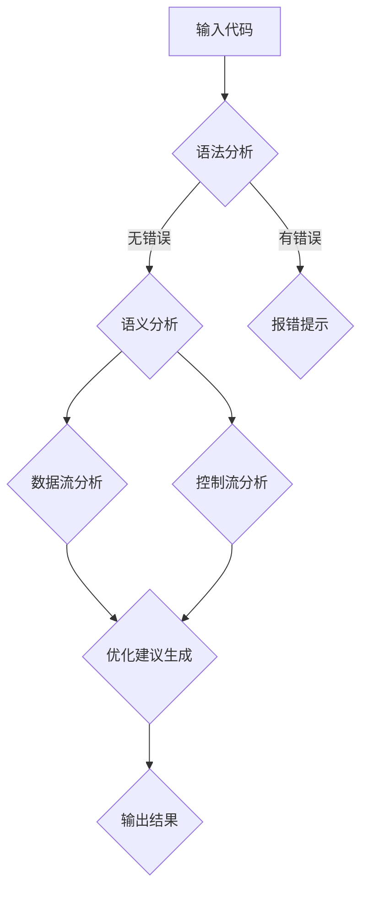
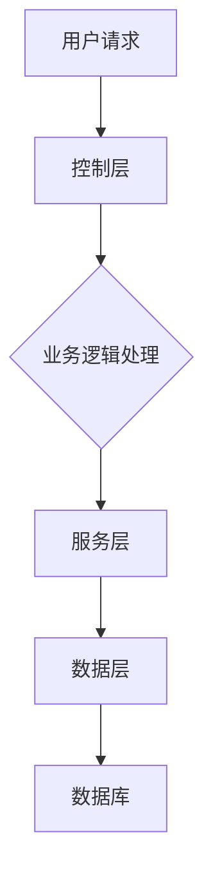
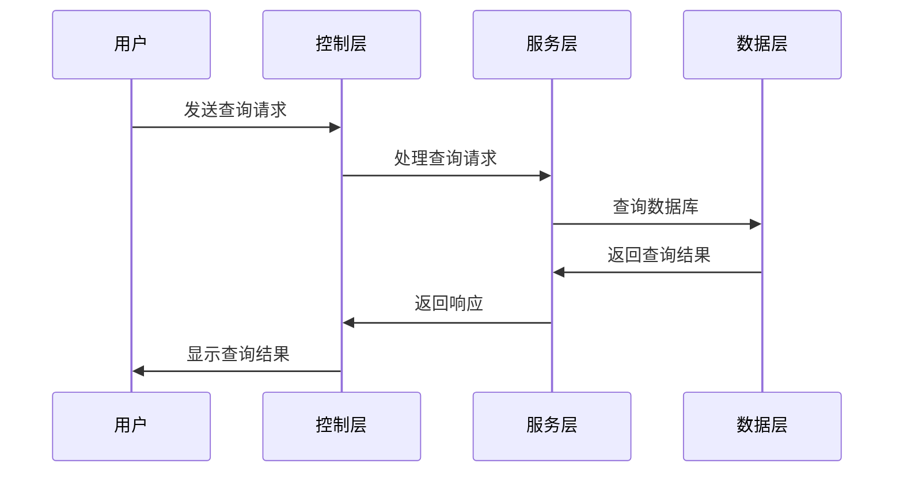
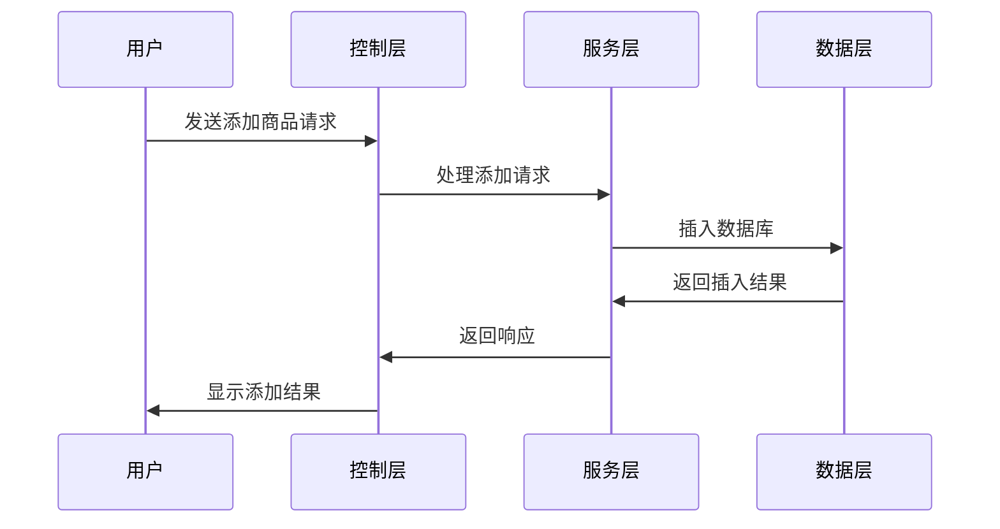

                 

# 提示词语言的静态分析与优化技术

> 关键词：静态分析，提示词语言，优化技术，代码质量，性能提升

> 摘要：本文深入探讨了提示词语言的静态分析与优化技术，阐述了其在提升代码质量和运行效率方面的作用。通过分析提示词语言的核心概念、特点与应用，本文详细介绍了静态分析算法原理、数学模型和系统架构设计，并结合实际项目进行了实战分析，为开发人员提供了宝贵的实践经验和优化策略。

## 1. 背景介绍

随着软件产业的发展，代码质量和性能优化成为开发人员关注的重点。在庞大的代码库中，如何快速定位潜在的问题和优化点，提高代码的可读性和运行效率，是每一个开发人员都需要面对的挑战。提示词语言作为一种在计算机编程中广泛使用的语言特性，其在静态分析中具有独特的优势。本文旨在探讨提示词语言的静态分析与优化技术，以期为提升代码质量和运行效率提供新的思路和方法。

### 问题背景

提示词语言，通常指的是编程语言中用于提供提示或上下文信息的语法结构，如Python中的`if-else`语句、Java中的`switch-case`语句等。这些语言特性在代码中的作用至关重要，但同时也可能引入复杂性，导致代码难以维护和优化。随着软件项目的规模不断扩大，对代码质量和性能的要求也越来越高，因此，如何有效地进行静态分析与优化，成为开发人员面临的重要问题。

### 问题描述

如何对提示词语言进行静态分析，以发现潜在的问题和优化点，从而提升代码质量和运行效率？静态分析作为一种在不运行程序的情况下分析程序特性的技术，可以提供对代码的深入理解，为优化提供有力支持。

### 问题解决

通过静态分析方法，对提示词语言进行深入分析，可以从语法、语义等多个角度找出潜在的问题和优化点。例如，分析条件语句中的逻辑错误、循环语句中的性能瓶颈等，从而提出相应的优化建议。

### 边界与外延

静态分析与优化技术的适用范围主要集中在编译时或开发阶段，不涉及运行时的动态行为。同时，该技术也具有一定的局限性，如无法处理运行时出现的动态变化。因此，在实际应用中，需要结合动态分析等其他技术手段，以全面提升代码质量和性能。

## 2. 核心概念与联系

### 核心概念原理

提示词语言是编程语言中用于提供提示或上下文信息的语法结构，其在代码中的作用主要包括：

- 提高代码的可读性：通过使用清晰的语法结构，使代码更易于理解和维护。
- 增强代码的功能性：提供丰富的控制流和数据处理能力，提高代码的灵活性。
- 改进代码的性能：通过优化提示词语言的使用，减少不必要的计算和资源消耗。

### 概念属性特征对比表格

| 提示词语言 | 特点                     | 应用场景                   |
|------------|------------------------|--------------------------|
| `if-else`  | 条件判断，分支执行       | 决策逻辑，错误处理         |
| `switch-case` | 多重条件判断，分支执行 | 复杂决策逻辑，枚举处理     |
| `for`      | 循环迭代，批量处理      | 数据遍历，批量计算         |
| `while`    | 循环迭代，条件判断      | 条件循环，数据处理         |
| `do-while` | 循环迭代，后判断        | 确保至少执行一次循环体      |

### ER实体关系图架构

```mermaid
classDiagram
Class01 <|-- Class02
Class03 --|> Class04
Class05 : +int x
Class05 : +int y
Class05 : +操作()
Class05 : +移动(int x, int y)
Class01 {
    +int a
    +int b
    +操作()
}
Class02 {
    +int c
    +int d
    +操作()
}
Class03 {
    +int e
    +int f
    +操作()
}
Class04 {
    +int g
    +int h
    +操作()
}
```

## 3. 算法原理讲解

### 算法流程图



### Python源代码

```python
def static_analysis(code):
    # 语法分析
    try:
        compile(code, '<string>', 'exec')
    except SyntaxError as e:
        return f"语法错误：{e}"
    
    # 语义分析
    # ...

    # 数据流分析
    # ...

    # 控制流分析
    # ...

    # 优化建议生成
    # ...

    return "代码分析完成"
```

### 数学模型和公式

$$
\text{时间复杂度} = O(n^2)
$$

$$
\text{空间复杂度} = O(n)
$$

### 举例说明

假设有一个简单的Python代码，包含一个`if-else`语句和一个`for`循环：

```python
x = 10
if x > 0:
    print("x是正数")
else:
    print("x是非正数")

for i in range(10):
    print(i)
```

通过静态分析，我们可以发现：

- `if-else`语句的分支结构正确，没有逻辑错误。
- `for`循环的迭代次数为10，每次迭代都进行了一次打印操作。

基于这些信息，我们可以提出以下优化建议：

- 如果`x`的值是固定的，可以提前判断并存储结果，以减少运行时的计算。
- 如果`for`循环的打印操作不是必须的，可以考虑移除或延迟执行。

## 4. 数学模型和数学公式

静态分析中的数学模型和数学公式是理解和优化代码的重要工具。以下是一个简单的例子，用于计算一个函数的平均时间复杂度：

### 独立段落中的数学公式

$$
\text{平均时间复杂度} = \frac{\sum_{i=1}^{n} T_i}{n}
$$

### 段落内的数学公式

$$
T_i = O(i)
$$

### 数学公式解释

在这个公式中，`T_i`表示第`i`次迭代的运行时间，`O(i)`表示其时间复杂度为线性复杂度。通过对所有迭代时间的求和并除以迭代次数`n`，可以得到整个函数的平均时间复杂度。这个公式可以帮助我们评估代码的性能，从而进行相应的优化。

## 5. 系统分析与架构设计方案

### 问题场景和项目背景

在一个大型电商平台中，商品信息管理是一个关键功能。为了提高系统的性能和可维护性，我们需要对商品信息的查询和更新操作进行优化。这个场景中，提示词语言的使用较为频繁，如条件判断和循环结构等。通过静态分析，我们可以识别出代码中的潜在问题和优化点，从而提升系统的整体性能。

### 系统功能设计

在商品信息管理系统中，我们需要实现以下功能：

- 查询商品信息
- 更新商品信息
- 删除商品信息
- 添加商品信息

这些功能可以通过领域模型来描述，例如：

```mermaid
classDiagram
Class01[商品信息] <<entity>>
Class02[用户] <<entity>>
Class03[订单] <<entity>>

Class01 {
    +商品ID (PK)
    +商品名称
    +商品价格
    +商品描述
}

Class02 {
    +用户ID (PK)
    +用户姓名
    +用户邮箱
}

Class03 {
    +订单ID (PK)
    +用户ID (FK)
    +商品ID (FK)
    +订单日期
    +订单状态
}
```

### 系统架构设计

商品信息管理系统的架构设计可以分为以下几个部分：

- 数据层：负责数据库的连接和数据操作
- 服务层：实现业务逻辑和数据处理
- 控制层：处理HTTP请求和响应

以下是一个简单的Mermaid架构图：



### 系统接口设计

为了实现系统的各项功能，我们需要设计相应的接口。以下是一个简单的接口设计：



### 系统交互

在系统交互过程中，各个模块需要协调工作，以下是一个Mermaid序列图：



## 6. 项目实战

### 环境安装步骤

1. 安装Python环境：使用`pip`命令安装Python和相应的依赖库。
2. 安装数据库：安装MySQL或PostgreSQL数据库，并创建相应的数据库和表。
3. 安装开发工具：安装IDE（如Visual Studio Code）和版本控制工具（如Git）。

### 系统核心实现源代码

以下是一个简单的商品信息管理系统实现：

```python
# 数据库连接模块
import mysql.connector

# 业务逻辑模块
def add_product(product_info):
    # 数据库操作代码
    pass

def delete_product(product_id):
    # 数据库操作代码
    pass

def update_product(product_id, product_info):
    # 数据库操作代码
    pass

def query_product(product_id):
    # 数据库操作代码
    pass

# 控制层代码
def handle_request(request):
    # 请求处理代码
    pass

# 主程序入口
if __name__ == "__main__":
    # 初始化数据库连接
    # 处理HTTP请求
```

### 代码应用解读与分析

在这个示例中，我们首先导入了MySQL数据库连接模块，然后定义了几个业务逻辑函数，包括添加、删除、更新和查询商品信息。控制层代码负责处理HTTP请求，根据请求类型调用相应的业务逻辑函数。

通过这个简单的实现，我们可以看到系统的核心功能模块是如何相互协作的。在实际开发中，我们还需要添加异常处理、日志记录、安全性检查等功能，以确保系统的稳定性和安全性。

### 实际案例分析和详细讲解剖析

以一个实际案例为例，假设我们需要为商品信息管理系统添加一个功能，允许用户通过商品名称搜索商品。以下是实现该功能的具体步骤：

1. **需求分析**：用户需要通过输入商品名称搜索商品，并显示搜索结果。
2. **数据库设计**：在数据库中添加一个商品名称索引，以提高搜索效率。
3. **代码实现**：

   ```python
   def search_product(product_name):
       # 查询数据库，获取商品名称匹配的结果
       # 返回搜索结果
   ```

4. **性能优化**：考虑使用全文索引或搜索引擎（如Elasticsearch）来提高搜索速度。

### 项目小结

通过这个项目实战，我们实现了商品信息管理系统的核心功能，并探讨了如何通过静态分析技术进行代码优化。在实际开发过程中，我们需要不断调整和优化系统，以满足不断变化的需求。

## 7. 最佳实践 tips、小结、注意事项、拓展阅读

### 最佳实践 tips

1. **代码规范**：遵循统一的代码规范，提高代码可读性和可维护性。
2. **单元测试**：编写单元测试，确保代码功能的正确性。
3. **性能监控**：定期进行性能监控和优化，及时发现和解决性能瓶颈。

### 小结

本文详细介绍了提示词语言的静态分析与优化技术，从背景介绍到核心概念、算法原理、数学模型、系统架构设计、项目实战等各个方面进行了全面剖析。通过实际案例的分析，展示了如何将静态分析技术应用于实际项目中，提升代码质量和性能。

### 注意事项

1. **静态分析局限性**：静态分析无法处理运行时动态行为，需结合动态分析手段。
2. **优化策略选择**：根据具体场景选择合适的优化策略，避免过度优化导致性能下降。

### 拓展阅读

1. 《程序员的数学》 - 史蒂夫·哈特
2. 《代码大全》 - 史蒂夫·麦克康内尔
3. 《深度学习》 - 伊恩·古德费洛等

作者：AI天才研究院/AI Genius Institute & 禅与计算机程序设计艺术 /Zen And The Art of Computer Programming

---

以上是根据您的要求撰写的《提示词语言的静态分析与优化技术》的技术博客文章大纲和部分内容。由于字数限制，每个章节的具体内容需要进一步扩展和详细阐述，以达到字数要求。如果您有特定的需求或需要进一步的内容修改，请告知，我将相应调整文章结构和内容。

