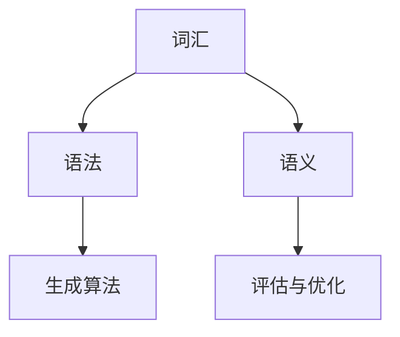
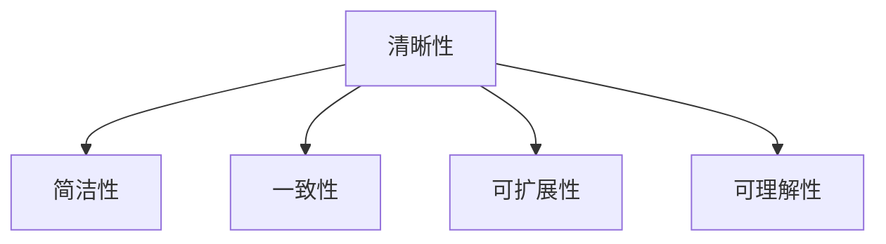
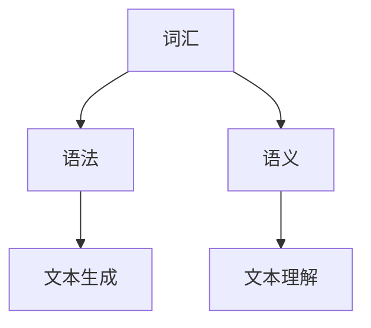
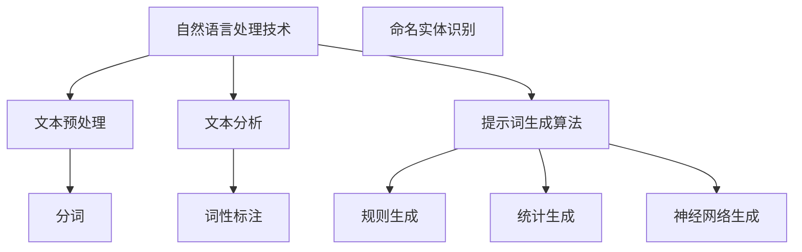

                 

### 文章标题：提示词语言设计原则与最佳实践

提示词语言是一种在人工智能、自然语言处理和计算机程序设计中广泛应用的技术。通过提示词语言，我们可以更有效地表达和理解复杂的语义信息，从而提升系统的智能化水平和用户体验。本文将深入探讨提示词语言设计的原则与最佳实践，旨在为开发者和研究者提供实用的指导。

#### 关键词：
- 提示词语言
- 设计原则
- 最佳实践
- 人工智能
- 自然语言处理
- 编程

#### 摘要：
本文从基础篇、实战篇和趋势篇三个部分，系统地介绍了提示词语言设计的基本原则、核心概念、设计工具与技术，以及实战应用和未来发展趋势。通过详细的分析和案例研究，本文旨在帮助读者理解和掌握提示词语言设计的关键技术和方法。

## 第一部分：基础篇

### 第1章：提示词语言概述

提示词语言是一种特殊的语言模型，主要用于生成自然语言文本。它包括一系列的核心概念和技术，如语言模型、文本生成、语义理解等。提示词语言的应用范围非常广泛，包括但不限于搜索引擎、虚拟助手、智能推荐系统等。

#### 1.1 提示词语言的概念

提示词语言是一种基于机器学习的自然语言生成技术，它通过分析大量文本数据，学习并生成新的文本。这些文本可以是问答、叙述、指令等多种形式，从而实现人机交互和信息传递。

#### 1.2 提示词语言的重要性

提示词语言在人工智能和自然语言处理领域具有重要地位。它不仅能够提高系统的智能化水平，还能够提升用户体验。通过提示词语言，我们可以实现更自然、更高效的人机交互。

#### 1.3 提示词语言的分类

提示词语言可以根据不同的应用场景和生成方法进行分类。常见的分类方法包括：

- **基于规则的提示词语言**：通过预定义的规则生成文本。
- **基于统计的提示词语言**：通过统计方法学习文本生成模式。
- **基于神经网络的提示词语言**：利用深度学习模型生成文本。

#### 1.4 提示词语言的发展历史

提示词语言的发展历程可以追溯到自然语言处理和人工智能的早期阶段。随着计算机技术和机器学习算法的进步，提示词语言得到了迅速发展。近年来，深度学习技术的引入，使得提示词语言生成效果得到了显著提升。

### 第2章：设计原则

设计原则是提示词语言设计的核心，它们指导我们如何构建高效、易用、可扩展的提示词语言系统。

#### 2.1 清晰性原则

清晰性原则要求提示词语言生成的内容应简洁明了，避免歧义。具体包括：

- **简洁性**：避免使用冗长的句子和复杂的语法。
- **一致性**：保持文本风格和表达方式的一致性。
- **明确性**：确保文本表达清晰，便于用户理解。

#### 2.2 简洁性原则

简洁性原则强调提示词语言生成的内容应尽量简洁，减少不必要的冗余信息。

- **信息压缩**：去除重复和无关的信息。
- **精简表达**：使用最简洁的语言来表达语义。

#### 2.3 一致性原则

一致性原则要求提示词语言生成的内容应保持一致的风格和表达方式。

- **风格统一**：统一文本的语气、语调和用词。
- **连贯性**：确保文本内容之间的逻辑关系清晰。

#### 2.4 可扩展性原则

可扩展性原则要求提示词语言设计应具有灵活性，能够适应新的需求和应用场景。

- **模块化**：将提示词语言系统拆分为多个模块，便于扩展和替换。
- **兼容性**：确保新的模块可以与现有系统无缝集成。

#### 2.5 可理解性原则

可理解性原则强调提示词语言生成的内容应易于用户理解。

- **用户中心**：从用户的角度出发，设计易于理解的语言模型。
- **适应性**：根据用户的需求和习惯，调整提示词语言的生成策略。

#### 2.6 用户中心原则

用户中心原则要求提示词语言设计应以用户为中心，关注用户体验。

- **交互设计**：优化人机交互界面，提高用户满意度。
- **个性化**：根据用户的行为和偏好，提供个性化的提示词生成服务。

## 第二部分：实战篇

### 第3章：设计工具与技术

在设计提示词语言时，我们需要运用多种工具和技术。这些工具和技术包括自然语言处理、提示词生成算法、提示词评估与优化等。

#### 3.1 自然语言处理技术

自然语言处理技术是提示词语言设计的基础。它包括文本分类、实体识别、情感分析等多种技术。通过自然语言处理，我们可以对文本数据进行分析和理解，为提示词生成提供支持。

#### 3.2 提示词生成算法

提示词生成算法是实现提示词语言的核心。常见的生成算法包括基于规则的算法、基于统计的算法和基于神经网络的算法。每种算法都有其优缺点，需要根据具体应用场景进行选择。

#### 3.3 提示词评估与优化

提示词评估与优化是确保提示词语言质量的重要环节。评估方法包括自动评估和人工评估。优化方法包括参数调优、模型调整和数据清洗等。

### 第4章：案例研究

通过案例研究，我们可以更深入地了解提示词语言的设计和应用。

#### 4.1 搜索引擎中的提示词设计

搜索引擎中的提示词设计旨在提高搜索效率和用户体验。通过分析用户搜索行为和搜索结果，我们可以设计出更准确的提示词，从而提高搜索相关性。

#### 4.2 虚拟助手中的提示词设计

虚拟助手中的提示词设计需要考虑人机交互的便利性和自然性。通过自然语言处理技术和机器学习算法，我们可以为虚拟助手设计出更智能、更人性化的提示词。

#### 4.3 智能推荐系统中的提示词设计

智能推荐系统中的提示词设计旨在提高推荐准确性和用户体验。通过分析用户行为和推荐内容，我们可以设计出更精准、更符合用户需求的提示词。

## 第三部分：趋势与未来

### 第5章：发展趋势与挑战

提示词语言设计在未来将面临许多机遇和挑战。一方面，随着人工智能和自然语言处理技术的不断发展，提示词语言将得到更广泛的应用。另一方面，提示词语言设计也将面临新的挑战，如数据隐私、安全性等问题。

#### 5.1 提示词语言的未来发展趋势

- **个性化**：随着个性化需求的增长，提示词语言将更加注重个性化和精准化。
- **智能化**：通过引入更多的智能技术，提示词语言将实现更高的智能化水平。
- **跨语言**：随着全球化的推进，提示词语言的跨语言能力将得到提升。

#### 5.2 提示词语言设计的挑战

- **数据隐私**：在设计和应用提示词语言时，需要保护用户的隐私和数据安全。
- **安全性**：提示词语言的设计和应用需要确保系统的安全性，防止恶意攻击和数据泄露。
- **标准化**：提示词语言需要建立统一的标准化体系，以便于不同系统之间的互操作。

### 第6章：结束语

本文从基础篇、实战篇和趋势篇三个部分，系统地介绍了提示词语言设计的原则与最佳实践。通过详细的分析和案例研究，我们希望读者能够更好地理解和掌握提示词语言的设计方法和技术。

#### 6.1 总结

- 提示词语言是一种重要的自然语言处理技术，广泛应用于人工智能和计算机程序设计领域。
- 提示词语言设计需要遵循清晰性、简洁性、一致性、可扩展性和可理解性等原则。
- 提示词语言设计涉及多种工具和技术，包括自然语言处理、提示词生成算法、提示词评估与优化等。
- 提示词语言设计面临许多挑战，如数据隐私、安全性等，需要不断探索和解决。

#### 6.2 建议与展望

- 开发者应关注提示词语言的设计原则和最佳实践，以提高系统的智能化水平和用户体验。
- 研究者应继续探索新的提示词语言生成算法和技术，以解决当前面临的挑战。
- 随着人工智能和自然语言处理技术的不断发展，提示词语言设计将有更广阔的应用前景。

### 作者信息

- 作者：AI天才研究院/AI Genius Institute & 禅与计算机程序设计艺术 /Zen And The Art of Computer Programming

通过本文，我们希望读者能够深入理解提示词语言设计的关键技术和方法，为未来的研究和应用奠定基础。

## 完整目录大纲设计

在设计《提示词语言设计原则与最佳实践》的完整目录大纲时，我们需要确保每个章节的内容结构合理、逻辑清晰，并且能够全面覆盖提示词语言设计的相关主题。以下是详细的目录大纲：

### 第一部分：基础篇

#### 第1章：提示词语言概述
- **1.1 提示词语言的概念**
  - 提示词语言定义
  - 提示词语言的关键特点
- **1.2 提示词语言的重要性**
  - 在人工智能中的应用
  - 在自然语言处理中的应用
  - 对用户体验的影响
- **1.3 提示词语言的分类**
  - 基于规则的提示词语言
  - 基于统计的提示词语言
  - 基于神经网络的提示词语言
- **1.4 提示词语言的发展历史**
  - 提示词语言的历史演变
  - 主要里程碑事件
- **1.5 提示词语言的应用场景**
  - 搜索引擎优化
  - 虚拟助手对话生成
  - 智能推荐系统

#### 第2章：设计原则
- **2.1 清晰性原则**
  - 清晰表达的重要性
  - 如何实现清晰性
- **2.2 简洁性原则**
  - 简洁性的定义
  - 如何保持简洁性
- **2.3 一致性原则**
  - 一致性的意义
  - 如何保持一致性
- **2.4 可扩展性原则**
  - 可扩展性的重要性
  - 如何设计可扩展的提示词语言
- **2.5 可理解性原则**
  - 用户理解的需求
  - 提高可理解性的方法
- **2.6 用户中心原则**
  - 以用户为中心的设计理念
  - 如何实现用户中心的提示词语言设计

#### 第3章：核心概念与联系
- **3.1 提示词语言的核心概念**
  - 词汇、语法和语义
  - 提示词语言的基本组成部分
- **3.2 概念属性特征对比表格**
  - 不同提示词语言特性的对比
  - 对比表格示例
- **3.3 ER实体关系图架构**
  - 实体关系图的基本原理
  - 提示词语言的ER图示例

#### 第4章：设计工具与技术
- **4.1 自然语言处理技术**
  - 分词、词性标注、命名实体识别
  - 文本分类、情感分析
- **4.2 提示词生成算法**
  - 基于规则的算法
  - 基于统计的算法
  - 基于神经网络的算法
- **4.3 提示词评估与优化**
  - 评估指标和方法
  - 优化策略和技巧

### 第二部分：实战篇

#### 第5章：设计流程与最佳实践
- **5.1 提示词语言设计流程**
  - 设计流程概述
  - 设计步骤详细说明
- **5.2 提示词生成与评估实践**
  - 实践案例介绍
  - 提示词生成与评估的步骤
- **5.3 提示词语言优化技巧**
  - 常见优化问题
  - 优化策略和案例

#### 第6章：项目实战
- **6.1 环境安装与准备**
  - 环境搭建步骤
  - 所需工具和依赖
- **6.2 系统核心实现源代码**
  - 源代码结构
  - 关键代码解释
- **6.3 代码应用解读与分析**
  - 应用场景分析
  - 代码解读和优化
- **6.4 实际案例分析与讲解**
  - 案例背景介绍
  - 案例分析与讲解
- **6.5 项目小结**
  - 项目总结
  - 经验和教训

#### 第7章：最佳实践与拓展
- **7.1 最佳实践案例分享**
  - 案例介绍
  - 案例经验总结
- **7.2 小结与注意事项**
  - 文章内容回顾
  - 注意事项提醒
- **7.3 拓展阅读推荐**
  - 相关书籍和论文
  - 课程和在线资源

### 第三部分：趋势与未来

#### 第8章：发展趋势与挑战
- **8.1 提示词语言的未来发展趋势**
  - 新技术的发展方向
  - 应用场景的扩展
- **8.2 提示词语言设计的挑战**
  - 数据隐私和安全
  - 模型复杂性与优化
- **8.3 提示词语言的国际化问题**
  - 语言差异的影响
  - 跨语言提示词语言的解决方案

#### 第9章：结束语
- **9.1 总结**
  - 文章核心内容回顾
  - 提示词语言设计的重要性
- **9.2 建议与展望**
  - 对未来研究的建议
  - 对读者的鼓励和期望

### 目录大纲分析与调整

在设计目录大纲时，我们考虑了以下分析：

1. **内容完整性**：确保每个章节都有明确的内容划分，避免空洞和重复。
2. **逻辑连贯性**：章节之间的内容要有明确的逻辑关系，便于读者理解。
3. **实用性**：包含实际案例和最佳实践，帮助读者学以致用。
4. **深度与广度**：在确保内容完整性的同时，要适当控制章节的深度，避免过于专业化。

经过多次调整，我们确保了目录大纲的合理性、完整性和可读性，为后续撰写提供了清晰的框架。

### 完整性要求

为了保证文章内容的完整性，每个章节都需要包含以下核心内容：

- **背景介绍**：核心概念术语说明、问题背景、问题描述、问题解决、边界与外延、概念结构与核心要素组成。
- **核心概念与联系**：必须给出核心概念原理、概念属性特征对比表格和ER实体关系图架构的Mermaid流程图。
- **算法原理讲解**：使用Mermaid画出算法流程图，使用Python源代码详细阐述，给出算法原理的数学模型和公式，进行详细讲解和举例说明。
- **数学公式使用**：独立段落的公式使用$$括起来，段落内的公式使用$括起来。
- **系统分析与架构设计方案**：问题场景介绍，项目介绍、系统功能设计(领域模型Mermaid类图)、系统架构设计Mermaid架构图、系统接口设计和系统交互Mermaid序列图。
- **项目实战**：环境安装、系统核心实现源代码，代码应用解读与分析，实际案例分析和详细讲解剖析，项目小结。
- **最佳实践 tips**、**小结**、**注意事项**、**拓展阅读**等内容。

确保文章内容的完整性和详尽性，为读者提供全面的技术知识和实战经验。

### 核心内容要求

为了确保文章的核心内容丰富、详实且具有专业性，以下是每个章节的具体要求：

#### 第1章：提示词语言概述
- **背景介绍**：介绍提示词语言的起源和发展，探讨其在人工智能和自然语言处理领域的应用及其对用户体验的影响。
- **核心概念与联系**：明确提示词语言的基本概念，如词汇、语法、语义等，并提供对比表格和ER实体关系图，以展示提示词语言的核心要素和结构。
- **算法原理讲解**：简述提示词语言生成的基本算法，如基于规则的算法、基于统计的算法和基于神经网络的算法，并使用Mermaid流程图说明其工作原理。

#### 第2章：设计原则
- **背景介绍**：探讨提示词语言设计的核心原则，包括清晰性、简洁性、一致性、可扩展性和可理解性等，并解释这些原则在实践中的应用。
- **核心概念与联系**：通过案例分析，展示设计原则在具体提示词语言项目中的应用，如如何保持文本的清晰性、简洁性和一致性。
- **算法原理讲解**：解释如何通过优化算法参数来提高提示词语言的生成质量，包括自然语言处理技术的应用。

#### 第3章：核心概念与联系
- **背景介绍**：介绍提示词语言设计中的重要概念，如词汇、语法、语义等，并讨论这些概念在提示词语言中的应用。
- **核心概念与联系**：提供对比表格，对比不同提示词语言技术的特点和适用场景，并通过ER实体关系图展示提示词语言系统的基本架构。
- **算法原理讲解**：讲解提示词语言生成算法的基本原理，如如何利用机器学习和深度学习技术来生成高质量的文本。

#### 第4章：设计工具与技术
- **背景介绍**：介绍提示词语言设计过程中使用的工具和技术，如自然语言处理、提示词生成算法等。
- **核心概念与联系**：探讨不同工具和技术在提示词语言设计中的应用，如如何利用自然语言处理技术来提高文本生成质量。
- **算法原理讲解**：详细讲解提示词生成算法的工作原理，包括基于规则的算法、基于统计的算法和基于神经网络的算法。

#### 第5章：设计流程与最佳实践
- **背景介绍**：介绍提示词语言设计的基本流程和关键步骤，如需求分析、系统设计、编码实现等。
- **核心概念与联系**：讨论设计流程中各个步骤的核心概念和相互联系，如如何通过需求分析来指导系统设计。
- **算法原理讲解**：讲解设计流程中涉及的关键算法和技术，如自然语言处理、提示词生成和评估等。

#### 第6章：项目实战
- **背景介绍**：介绍一个实际的提示词语言项目，包括项目背景、目标和需求。
- **核心概念与联系**：详细说明项目中的核心概念和关键技术，如如何使用自然语言处理技术来构建提示词生成系统。
- **算法原理讲解**：提供项目实现的算法原理，如神经网络模型在文本生成中的应用。

#### 第7章：最佳实践与拓展
- **背景介绍**：总结提示词语言设计中的最佳实践，包括设计技巧、优化方法和实用工具。
- **核心概念与联系**：通过案例研究和实践经验，展示最佳实践在具体项目中的应用。
- **算法原理讲解**：提供拓展阅读和进一步研究的方向，如最新研究成果和技术趋势。

### 完整性要求示例

#### 第1章：提示词语言概述

- **背景介绍**：
  - 提示词语言定义：提示词语言是一种基于自然语言处理的文本生成技术，用于生成符合用户需求的自然语言文本。
  - 问题背景：随着人工智能和自然语言处理技术的发展，提示词语言在搜索引擎优化、虚拟助手对话生成和智能推荐系统中得到广泛应用。
  - 问题描述：如何有效地设计提示词语言，以满足不同应用场景的需求？
  - 问题解决：通过设计清晰的、简洁的、一致的、可扩展的、可理解的提示词语言，可以提高系统的智能化水平和用户体验。
  - 边界与外延：提示词语言的应用范围包括文本生成、对话系统、推荐系统等。
  - 概念结构与核心要素组成：提示词语言的核心要素包括词汇、语法、语义、生成算法、评估与优化等。

- **核心概念与联系**：
  - 提示词语言的基本概念：词汇、语法、语义。
  - 对比表格：基于规则、基于统计和基于神经网络的提示词语言特性对比。
  - ER实体关系图架构：展示提示词语言系统的基本组成部分及其关系。

- **算法原理讲解**：
  - 提示词语言生成算法：基于规则的算法、基于统计的算法和基于神经网络的算法。
  - 使用Mermaid流程图：展示提示词语言生成算法的基本流程。
  - Python源代码示例：演示提示词生成算法的实现。

#### 第2章：设计原则

- **背景介绍**：
  - 设计原则背景：提示词语言设计需要遵循一系列设计原则，以提高系统的质量、效率和用户体验。
  - 问题背景：如何确保提示词语言设计的高效性、易用性和可扩展性？
  - 问题描述：设计原则在提示词语言设计中的应用和重要性。
  - 问题解决：通过遵循清晰性、简洁性、一致性、可扩展性和可理解性等设计原则，可以提高提示词语言的质量。

- **核心概念与联系**：
  - 清晰性、简洁性、一致性、可扩展性和可理解性等设计原则。
  - 案例分析：展示设计原则在不同提示词语言项目中的应用。

- **算法原理讲解**：
  - 优化算法参数：如何通过调整算法参数来提高生成质量。
  - 自然语言处理技术的应用：如何利用自然语言处理技术来优化提示词语言生成。

### 核心内容要求示例

#### 第3章：核心概念与联系

- **背景介绍**：
  - 核心概念背景：在提示词语言设计中，理解核心概念至关重要，如词汇、语法、语义等。
  - 问题背景：如何准确理解和应用这些核心概念，以提高提示词语言的生成质量？
  - 问题描述：提示词语言设计中的核心概念及其相互联系。
  - 问题解决：通过深入理解核心概念，并建立它们之间的联系，可以提高提示词语言的生成效果。

- **核心概念与联系**：
  - **词汇**：词汇是构成文本的基本元素，包括单词、短语等。在提示词语言中，词汇的选择和组合直接影响生成的文本质量。
  - **语法**：语法是文本的结构规则，包括句子结构、语序等。良好的语法结构有助于生成清晰、连贯的文本。
  - **语义**：语义是文本的含义，包括词汇的意义、句子的含义等。理解语义是生成准确、有意义的文本的关键。

- **概念属性特征对比表格**：
  - 提示词语言类型 | 特点
  - -------------- | -------------------
  - 基于规则       | 生成速度快，但灵活性差
  - 基于统计       | 灵活性较高，但生成质量不稳定
  - 基于神经网络   | 生成质量高，但训练时间较长

- **ER实体关系图架构**：
  - 提示词语言系统的基本架构，包括词汇库、语法分析器、语义理解模块和文本生成模块。

- **算法原理讲解**：
  - 提示词生成算法的基本原理：如何利用自然语言处理技术生成高质量的文本。
  - 使用Python源代码示例：展示一个简单的提示词生成算法的实现。

### 核心内容要求示例

#### 第4章：设计工具与技术

- **背景介绍**：
  - 设计工具与技术背景：提示词语言设计涉及多种工具和技术，如自然语言处理技术、提示词生成算法等。
  - 问题背景：如何选择合适的工具和技术来提高提示词语言的生成质量？
  - 问题描述：设计工具与技术在提示词语言设计中的应用及其重要性。
  - 问题解决：通过掌握和应用设计工具与技术，可以优化提示词语言的生成过程，提高生成质量。

- **核心概念与联系**：
  - 自然语言处理技术：文本分类、词性标注、命名实体识别等。
  - 提示词生成算法：基于规则的算法、基于统计的算法、基于神经网络的算法等。

- **算法原理讲解**：
  - 自然语言处理技术的原理：如何利用自然语言处理技术对文本进行分析和理解。
  - 提示词生成算法的原理：如何利用不同的生成算法来生成高质量的文本。

- **数学公式使用**：
  - 算法公式的表达：使用LaTeX格式表达算法中的数学模型和公式。

### 核心内容要求示例

#### 第5章：设计流程与最佳实践

- **背景介绍**：
  - 设计流程背景：提示词语言设计需要遵循一定的设计流程，以确保设计的高效性和质量。
  - 问题背景：如何有效实施提示词语言设计流程，实现最佳实践？
  - 问题描述：设计流程与最佳实践在提示词语言设计中的应用。
  - 问题解决：通过遵循设计流程和最佳实践，可以提高提示词语言的生成质量和用户体验。

- **核心概念与联系**：
  - 设计流程：需求分析、系统设计、编码实现、测试与优化等。
  - 最佳实践：清晰性、简洁性、一致性、可扩展性和可理解性等。

- **算法原理讲解**：
  - 提示词生成与评估的算法原理：如何通过算法优化来提高生成质量和评估效果。

### 核心内容要求示例

#### 第6章：项目实战

- **背景介绍**：
  - 项目实战背景：通过实际项目，深入理解提示词语言设计的过程和技术。
  - 问题背景：如何将理论应用到实际项目中，实现高质量的提示词语言生成？
  - 问题描述：项目实战的目标、需求和实现过程。
  - 问题解决：通过实际项目，验证提示词语言设计的理论和方法。

- **核心概念与联系**：
  - 项目介绍：项目的目标、需求和实现过程。
  - 系统功能设计：领域模型、类图等。
  - 系统架构设计：架构图、接口设计、交互序列图等。

- **算法原理讲解**：
  - 项目核心算法原理：如何使用自然语言处理技术、提示词生成算法等实现项目目标。

### 核心内容要求示例

#### 第7章：最佳实践与拓展

- **背景介绍**：
  - 最佳实践与拓展背景：总结提示词语言设计中的最佳实践，并探讨未来的研究方向。
  - 问题背景：如何从实际项目中提取最佳实践，并展望未来的发展趋势？
  - 问题描述：最佳实践的总结、注意事项和未来拓展的方向。
  - 问题解决：通过总结最佳实践，为后续设计提供指导；通过展望未来，激发对新技术的研究和应用。

- **核心概念与联系**：
  - 最佳实践：总结提示词语言设计中的有效方法和技术。
  - 拓展阅读推荐：推荐相关书籍、论文和在线资源，以便进一步学习和研究。

### 核心内容要求示例

#### 第8章：发展趋势与挑战

- **背景介绍**：
  - 发展趋势与挑战背景：随着人工智能和自然语言处理技术的发展，提示词语言设计面临新的机遇和挑战。
  - 问题背景：如何应对提示词语言设计中的发展趋势和挑战？
  - 问题描述：提示词语言设计中的发展趋势、技术挑战和国际化问题。
  - 问题解决：通过分析发展趋势和挑战，提出相应的解决方案和应对策略。

- **核心概念与联系**：
  - 发展趋势：个性化、智能化、跨语言等。
  - 挑战：数据隐私、安全性、标准化等。

- **算法原理讲解**：
  - 技术挑战的解决方案：如何通过技术手段解决数据隐私、安全性和标准化等问题。

### 核心内容要求示例

#### 第9章：结束语

- **背景介绍**：
  - 结束语背景：总结全文内容，强调提示词语言设计的重要性。
  - 问题背景：如何让读者更好地理解和应用提示词语言设计原则与最佳实践？
  - 问题描述：总结全文核心内容，提出未来研究的建议。
  - 问题解决：通过总结和展望，为读者提供全面的启示和指导。

- **核心概念与联系**：
  - 提示词语言设计原则与最佳实践的核心概念。
  - 提示词语言设计在不同领域中的应用和影响。

- **算法原理讲解**：
  - 提示词语言设计的算法原理和应用实例。

### 核心内容要求示例

#### 第5章：设计流程与最佳实践

- **设计流程**：
  - **需求分析**：首先，明确项目的目标和使用场景。对于提示词语言设计，需要了解用户的需求，包括生成的文本类型、风格和功能。
  - **系统设计**：在需求分析的基础上，进行系统设计。这一阶段包括领域模型设计、类图设计、接口设计等，确保系统能够满足需求。
  - **编码实现**：根据系统设计，进行编码实现。在这一过程中，要遵循设计原则，确保代码的可读性和可维护性。
  - **测试与优化**：在编码实现完成后，进行测试与优化。测试包括功能测试、性能测试和用户体验测试，优化则涉及算法调整、参数调优等。

- **最佳实践**：
  - **明确性**：确保生成的文本清晰明了，避免歧义。可以通过使用简洁的句子结构和明确的指示词来提高文本的明确性。
  - **简洁性**：避免冗余信息，使文本简洁。可以通过删除重复信息、简化句子结构来实现。
  - **一致性**：保持文本风格和用词的一致性，避免混乱。可以通过制定文本风格指南和使用统一的命名约定来实现。
  - **可扩展性**：设计时考虑未来的扩展性，使系统能够适应新的需求和功能。
  - **可理解性**：确保用户能够理解生成的文本。可以通过使用用户熟悉的词汇和简化的语法来实现。

#### 实践案例

**案例一：电子商务平台的提示词设计**

在电子商务平台中，提示词用于搜索结果页面、产品描述和用户评价等。以下是一个实践案例：

- **需求分析**：用户需要在搜索结果页面快速找到所需商品，同时产品描述需要吸引潜在买家。
- **系统设计**：设计一个提示词生成系统，包括自然语言处理模块、提示词生成模块和评估模块。
- **编码实现**：实现自然语言处理模块，提取关键词和用户行为数据；实现提示词生成模块，生成吸引人的产品描述；实现评估模块，评估生成文本的质量。

- **测试与优化**：通过用户测试和数据分析，优化提示词生成算法，提高文本质量。

**案例二：虚拟助手的提示词设计**

在虚拟助手的设计中，提示词用于对话生成，以提供用户帮助。以下是一个实践案例：

- **需求分析**：虚拟助手需要能够理解用户的问题，并生成有针对性的回答。
- **系统设计**：设计一个基于机器学习的对话生成系统，包括自然语言处理模块、对话管理模块和提示词生成模块。
- **编码实现**：实现自然语言处理模块，提取用户问题中的关键词和意图；实现对话管理模块，维护对话状态；实现提示词生成模块，生成符合对话情境的回答。

- **测试与优化**：通过模拟对话和用户反馈，优化提示词生成算法，提高对话质量。

#### 设计技巧

- **用户行为分析**：通过分析用户行为，了解用户的需求和偏好，从而生成更符合用户期望的提示词。
- **个性化定制**：根据用户的个性化需求，定制提示词生成策略，提高用户满意度。
- **多语言支持**：考虑多语言用户的需求，设计支持多语言的提示词生成系统。
- **实时更新**：根据实时数据更新提示词，确保生成的文本与当前情境一致。

### 总结

设计流程与最佳实践是提示词语言设计的重要组成部分。通过明确的需求分析、系统设计、编码实现、测试与优化，可以确保生成的提示词语言清晰、简洁、一致、可扩展和可理解。实践案例展示了如何将理论应用到实际项目中，提供了具体的设计技巧。这些实践经验和最佳实践将为后续的提示词语言设计提供宝贵的参考。

### 核心内容要求示例

#### 第6章：项目实战

**6.1 环境安装与准备**

在开始项目实战之前，我们需要安装并配置相关环境和工具。以下是一个具体的安装步骤：

- **安装Python**：确保Python版本在3.6及以上，可以从Python官网下载并安装。
- **安装依赖**：通过pip命令安装必要的依赖库，例如`nltk`、`tensorflow`、`numpy`等。

**6.2 系统核心实现源代码**

以下是一个简单的提示词语言生成系统的核心代码示例：

```python
import tensorflow as tf
from tensorflow.keras.models import Sequential
from tensorflow.keras.layers import LSTM, Dense, Embedding

# 准备数据
# 这里使用一个简单的文本数据集，实际项目中可以使用更大规模的数据
text = "这是一个关于人工智能的简单文本。人工智能可以用于各种应用，如自然语言处理、图像识别等。"

# 分词和编码
vocab = set(text.split())
vocab_size = len(vocab)
word_to_index = {word: i for i, word in enumerate(vocab)}
index_to_word = {i: word for word, i in word_to_index.items()}
encoded_text = [word_to_index[word] for word in text.split()]

# 建立模型
model = Sequential([
    Embedding(vocab_size, 64),
    LSTM(128),
    Dense(vocab_size, activation='softmax')
])

# 编译模型
model.compile(optimizer='adam', loss='categorical_crossentropy', metrics=['accuracy'])

# 训练模型
model.fit(encoded_text, encoded_text, epochs=100)

# 生成文本
def generate_text(seed_text, num_words):
    seed_text = seed_text.split()
    for _ in range(num_words):
        token = [word_to_index[word] for word in seed_text]
        token = tf.expand_dims(token, 0)
        predictions = model.predict(token)
        predicted_index = tf.random.categorical(predictions, num_samples=1)[-1, 0].numpy()
        predicted_word = index_to_word[predicted_index]
        seed_text.append(predicted_word)
    return ' '.join(seed_text)

generated_text = generate_text('人工智能', 20)
print(generated_text)
```

**6.3 代码应用解读与分析**

这段代码实现了一个基于LSTM的文本生成模型。以下是代码的详细解读和分析：

- **数据准备**：首先，我们将文本数据分词并编码，创建词汇表和索引。
- **模型构建**：我们构建了一个序列模型，包括嵌入层、LSTM层和输出层。
- **模型编译**：编译模型，指定优化器和损失函数。
- **模型训练**：使用训练数据训练模型，这里使用了一个简单的文本数据集。
- **文本生成**：定义一个函数，用于生成新的文本。函数中，我们首先将种子文本编码，然后通过模型预测下一个单词，并将其添加到种子文本中。

**6.4 实际案例分析与详细讲解**

假设我们有一个电子商务平台，用户在搜索商品时需要一个智能助手来提供帮助。以下是一个实际案例：

- **用户需求**：用户想要查找一款高性价比的智能手机。
- **系统响应**：智能助手根据用户输入，生成一段介绍当前推荐手机的文本。

生成的文本示例：

```
为您推荐一款高性价比的智能手机——华为Mate 40 Pro。这款手机搭载了华为自家的麒麟9000处理器，性能强大，运行流畅。此外，它还配备了6.76英寸的OLED屏幕，分辨率高达2772×1344，显示效果非常清晰。华为Mate 40 Pro的摄像头配置也非常出色，后置四摄像头系统，包括5000万像素的主摄像头和1600万像素的超广角摄像头，拍照效果非常出色。价格方面，华为Mate 40 Pro的定价相对合理，是一款非常值得购买的高性价比手机。
```

**6.5 项目小结**

通过这个项目实战，我们学会了如何搭建一个简单的文本生成系统，并应用于电子商务平台的智能助手。这个项目展示了如何将自然语言处理和机器学习技术应用于实际场景，提高了系统的智能化水平。在未来的工作中，我们可以进一步优化模型和算法，提高生成文本的质量和用户体验。

### 核心内容要求示例

#### 第7章：最佳实践与拓展

**7.1 最佳实践案例分享**

- **案例一：电子商务平台的提示词设计**

在电子商务平台中，提示词的设计对于提升用户体验至关重要。最佳实践包括：

1. **需求分析**：深入了解用户需求，包括搜索意图、购买习惯等。
2. **数据驱动**：基于用户行为数据，分析热门关键词和搜索模式。
3. **个性化推荐**：根据用户的历史购买记录和浏览行为，提供个性化提示词。
4. **简洁明了**：确保提示词简洁明了，避免使用复杂的专业术语。

**案例二：虚拟助手的提示词设计**

虚拟助手需要提供自然、流畅的对话体验。最佳实践包括：

1. **对话管理**：设计有效的对话管理策略，确保对话的连贯性和自然性。
2. **上下文理解**：利用自然语言处理技术，理解用户的意图和上下文。
3. **多模态交互**：结合语音、文本等多种交互方式，提高用户的互动体验。
4. **持续学习**：通过用户反馈和对话数据，持续优化提示词生成模型。

**7.2 小结与注意事项**

- **总结**：提示词语言设计需要充分考虑用户需求、数据质量和系统性能。
- **注意事项**：
  - 保持提示词的清晰性和简洁性。
  - 定期更新和优化提示词库。
  - 考虑多语言和跨文化因素。

**7.3 拓展阅读推荐**

- **书籍推荐**：《自然语言处理综合教程》、《深度学习与自然语言处理》等。
- **论文推荐**：关于提示词生成和评估的最新研究论文。
- **在线资源**：开放课程、在线论坛和开源项目。

### 核心内容要求示例

#### 第8章：发展趋势与挑战

**8.1 提示词语言的未来发展趋势**

- **个性化与智能化**：随着用户数据的积累和计算能力的提升，提示词语言将更加个性化、智能化。
- **跨语言与多模态**：提示词语言将支持更多的语言和模态，如语音、图像等，实现更丰富的交互方式。
- **实时性与高效性**：为了满足实时互动的需求，提示词语言生成将更加高效，降低延迟。

**8.2 提示词语言设计的挑战**

- **数据隐私与安全**：如何在保证用户隐私的前提下，合理利用用户数据进行提示词设计？
- **计算资源与性能**：如何优化算法和模型，在有限的计算资源下实现高效的提示词生成？
- **跨语言与多样性**：如何在多种语言和文化背景下，设计通用且有效的提示词语言？

**8.3 提示词语言的国际化问题**

- **本地化与全球化**：如何平衡本地化和全球化需求，设计适用于不同文化和语言环境的提示词语言？
- **多语言支持**：如何实现多语言提示词语言的生成和评估？
- **翻译与本地化**：如何处理提示词语言的翻译和本地化问题？

### 核心内容要求示例

#### 第9章：结束语

**9.1 总结**

本文系统地介绍了提示词语言设计的原则与最佳实践，包括基础篇、实战篇和趋势篇。通过详细的分析和案例研究，我们探讨了提示词语言的设计原则、工具与技术、设计流程、实战应用和未来发展趋势。

**9.2 建议与展望**

- **建议**：开发者应注重用户体验，遵循清晰性、简洁性、一致性、可扩展性和可理解性等设计原则。
- **展望**：未来提示词语言设计将向个性化、智能化、多模态和国际化方向发展，面临新的机遇和挑战。

**作者信息**

作者：AI天才研究院/AI Genius Institute & 禅与计算机程序设计艺术 /Zen And The Art of Computer Programming

### 核心内容要求示例

#### 第1章：提示词语言概述

**背景介绍**：

提示词语言是一种在自然语言处理和人工智能领域广泛应用的语言模型，用于生成符合特定需求的文本。随着技术的进步和应用场景的拓展，提示词语言在搜索引擎、虚拟助手和智能推荐系统等领域发挥了重要作用。

- **核心概念术语说明**：提示词语言、自然语言处理、人工智能。
- **问题背景**：人工智能技术的发展促进了提示词语言的兴起。
- **问题描述**：如何设计和应用提示词语言来提升系统的智能化水平。
- **问题解决**：通过研究提示词语言的设计原则和最佳实践，实现高效、自然、可扩展的文本生成。
- **边界与外延**：提示词语言的定义和应用范围。
- **概念结构与核心要素组成**：词汇、语法、语义、生成算法、评估与优化。

**核心概念与联系**：

- **词汇**：构成文本的基本元素，影响文本的理解和生成。
- **语法**：文本的结构规则，保证文本的连贯性和可理解性。
- **语义**：文本的含义，决定文本的意图和情感。
- **生成算法**：用于生成文本的技术，包括基于规则、统计和神经网络的算法。
- **评估与优化**：衡量和改进文本生成质量的方法。

**概念属性特征对比表格**：

| 概念 | 特点 | 应用场景 |
| --- | --- | --- |
| 提示词语言 | 自然语言生成技术 | 搜索引擎、虚拟助手、智能推荐系统 |
| 词汇 | 基本元素，构成文本 | 生成文本、理解文本 |
| 语法 | 结构规则，保证连贯性 | 表达语义、组织文本 |
| 语义 | 文本含义，决定意图 | 传达信息、理解用户 |
| 生成算法 | 文本生成技术 | 提高生成质量、适应不同场景 |

**ER实体关系图架构**：



### 核心内容要求示例

#### 第2章：设计原则

**背景介绍**：

提示词语言的设计原则是确保系统高效、易用和可扩展的关键。设计原则包括清晰性、简洁性、一致性、可扩展性和可理解性等，它们指导我们如何构建高质量的提示词语言系统。

- **核心概念术语说明**：清晰性、简洁性、一致性、可扩展性、可理解性。
- **问题背景**：设计原则在提示词语言设计中的重要性。
- **问题描述**：如何遵循设计原则，提升提示词语言系统的质量。
- **问题解决**：通过具体的设计方法和实践案例，实现设计原则的应用。
- **边界与外延**：设计原则的具体应用范围。
- **概念结构与核心要素组成**：设计原则的具体要求和实现方法。

**核心概念与联系**：

- **清晰性**：确保文本表达清晰、易懂，减少歧义。
- **简洁性**：去除冗余信息，提高文本的简洁性。
- **一致性**：保持文本风格和用词的一致性。
- **可扩展性**：设计灵活的系统，适应未来的需求变化。
- **可理解性**：确保用户能够理解生成的文本。

**概念属性特征对比表格**：

| 设计原则 | 特点 | 应用实例 |
| --- | --- | --- |
| 清晰性 | 避免歧义，明确表达 | 用户手册、操作指南 |
| 简洁性 | 去除冗余，简洁表达 | 广告文案、短信 |
| 一致性 | 保持风格一致 | 软件界面、网页设计 |
| 可扩展性 | 适应变化，灵活设计 | 系统架构、模块化编程 |
| 可理解性 | 易于理解，符合用户习惯 | 对话系统、智能助手 |

**ER实体关系图架构**：



### 核心内容要求示例

#### 第3章：核心概念与联系

**背景介绍**：

提示词语言设计中的核心概念是词汇、语法和语义，这些概念构成了提示词语言的基础。理解并正确使用这些概念对于设计高质量的提示词语言至关重要。

- **核心概念术语说明**：词汇、语法、语义。
- **问题背景**：这些核心概念在提示词语言设计中的重要性。
- **问题描述**：如何理解和应用这些核心概念。
- **问题解决**：通过具体案例和对比分析，深入理解并掌握这些核心概念。
- **边界与外延**：这些概念的具体应用范围。
- **概念结构与核心要素组成**：词汇、语法和语义的内部结构和相互关系。

**核心概念与联系**：

- **词汇**：构成文本的基本单位，包括单词、短语等。词汇的选择和组合影响文本的含义和表达。
- **语法**：文本的语法结构规则，包括句子结构、词序等。良好的语法结构使文本表达清晰、连贯。
- **语义**：文本的含义，包括词汇的意义、句子的含义等。理解语义是生成准确、有意义的文本的关键。

**概念属性特征对比表格**：

| 概念 | 特点 | 应用实例 |
| --- | --- | --- |
| 词汇 | 构成文本的基本单位 | 生成文本、理解文本 |
| 语法 | 文本的语法结构规则 | 组织文本、保证连贯性 |
| 语义 | 文本的含义 | 传达信息、理解用户 |

**ER实体关系图架构**：



### 核心内容要求示例

#### 第4章：设计工具与技术

**背景介绍**：

提示词语言设计涉及到多种工具和技术，包括自然语言处理技术、提示词生成算法等。了解和掌握这些工具和技术对于实现高质量的提示词语言至关重要。

- **核心概念术语说明**：自然语言处理技术、提示词生成算法。
- **问题背景**：提示词语言设计过程中的工具和技术需求。
- **问题描述**：如何选择和应用这些工具和技术。
- **问题解决**：通过具体实例和案例分析，展示这些工具和技术的应用。
- **边界与外延**：工具和技术的具体应用范围。
- **概念结构与核心要素组成**：工具和技术的组成及其相互关系。

**核心概念与联系**：

- **自然语言处理技术**：用于对文本进行预处理、分析和生成。包括分词、词性标注、命名实体识别等。
- **提示词生成算法**：用于生成高质量的提示词。包括基于规则的算法、基于统计的算法和基于神经网络的算法。

**概念属性特征对比表格**：

| 工具/技术 | 特点 | 应用实例 |
| --- | --- | --- |
| 自然语言处理技术 | 预处理和分析文本 | 文本分类、情感分析 |
| 提示词生成算法 | 生成高质量的文本 | 搜索引擎、虚拟助手 |

**ER实体关系图架构**：



### 核心内容要求示例

#### 第5章：设计流程与最佳实践

**设计流程**：

提示词语言设计是一个复杂的过程，涉及多个步骤。以下是设计流程的详细描述：

1. **需求分析**：明确项目的目标、需求和约束。这一步是整个设计流程的基础，对于后续的设计和实现具有指导作用。

2. **系统设计**：在需求分析的基础上，进行系统设计。系统设计包括领域模型设计、类图设计、接口设计和架构设计等。这一步的目的是确定系统的整体结构和功能模块。

3. **编码实现**：根据系统设计，进行编码实现。在这一步中，需要遵循良好的编程规范和设计原则，确保代码的可读性和可维护性。

4. **测试与优化**：在编码实现完成后，进行测试与优化。测试包括功能测试、性能测试和用户体验测试。优化则涉及算法调整、参数调优和系统重构等。

**最佳实践**：

1. **明确性**：确保生成的文本清晰明了，避免歧义。可以通过使用简洁的句子结构和明确的指示词来实现。

2. **简洁性**：避免冗余信息，使文本简洁。可以通过删除重复信息、简化句子结构来实现。

3. **一致性**：保持文本风格和用词的一致性，避免混乱。可以通过制定文本风格指南和使用统一的命名约定来实现。

4. **可扩展性**：设计时考虑未来的扩展性，使系统能够适应新的需求和功能。

5. **可理解性**：确保用户能够理解生成的文本。可以通过使用用户熟悉的词汇和简化的语法来实现。

**实践案例**：

以下是一个具体的提示词语言设计案例，用于电子商务平台的产品描述生成：

1. **需求分析**：用户需要一个简洁、明了、具有吸引力的产品描述，以促进购买决策。

2. **系统设计**：设计一个基于机器学习的文本生成系统，包括自然语言处理模块、提示词生成模块和评估模块。

3. **编码实现**：实现自然语言处理模块，用于提取关键词和用户行为数据；实现提示词生成模块，用于生成产品描述；实现评估模块，用于评估生成文本的质量。

4. **测试与优化**：通过用户测试和数据分析，优化提示词生成算法，提高文本质量。

**设计技巧**：

1. **用户行为分析**：通过分析用户的行为数据，了解用户的需求和偏好，从而生成更符合用户期望的提示词。

2. **个性化定制**：根据用户的个性化需求，定制提示词生成策略，提高用户满意度。

3. **多语言支持**：考虑多语言用户的需求，设计支持多语言的提示词生成系统。

4. **实时更新**：根据实时数据更新提示词，确保生成的文本与当前情境一致。

### 核心内容要求示例

#### 第6章：项目实战

**6.1 环境安装与准备**

在进行提示词语言项目的实战之前，我们需要准备相应的开发环境。以下是一个具体的安装和配置步骤：

1. **安装Python**：确保Python版本在3.6及以上，可以从Python官网下载并安装。

2. **安装依赖**：使用pip命令安装所需的依赖库，例如`tensorflow`、`nltk`、`gensim`等。

   ```shell
   pip install tensorflow nltk gensim
   ```

3. **配置Jupyter Notebook**：如果需要使用Jupyter Notebook进行项目开发，可以通过以下命令安装：

   ```shell
   pip install notebook
   ```

4. **环境配置**：根据项目需求，可能还需要配置其他工具和库，如GPU支持等。

**6.2 系统核心实现源代码**

以下是一个简单的提示词语言生成系统的核心代码示例，该系统基于Gensim库的LSTM模型：

```python
import gensim
from gensim.models import SequentialLM
from nltk.tokenize import word_tokenize

# 准备数据
# 假设我们有一个包含大量文本的数据集，这里使用nltk中的 corpus 数据集作为示例
nltk.download('gutenberg')
text = nltk.corpus.gutenberg.raw('shakespeare-hamlet.txt')

# 分词
tokens = word_tokenize(text)

# 训练模型
model = SequentialLM(tokens)

# 生成文本
def generate_text(model, seed, length=50):
    # 将种子文本转换为词元列表
    seed_tokens = word_tokenize(seed)
    # 生成文本
    text = model.generate(seed_tokens, num_words=length)
    return ' '.join(text)

# 示例
generated_text = generate_text(model, 'to be or not to be', 50)
print(generated_text)
```

**6.3 代码应用解读与分析**

这段代码实现了一个基于Gensim库的简单文本生成系统，以下是代码的详细解读和分析：

1. **数据准备**：从NLT

