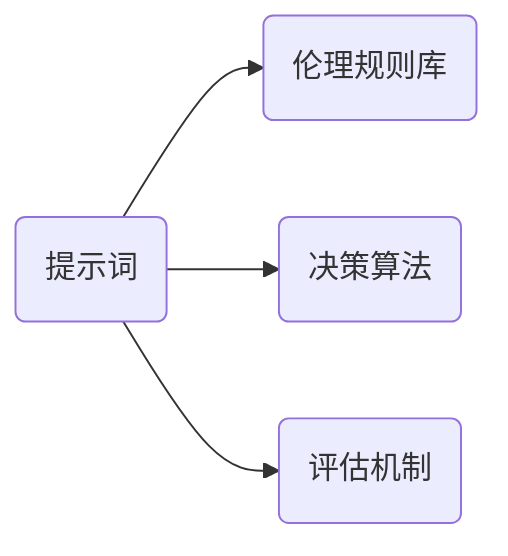
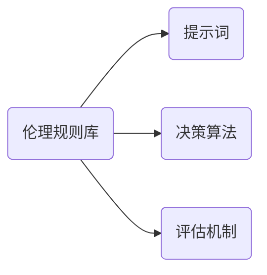
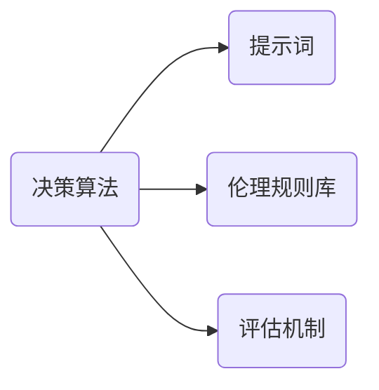
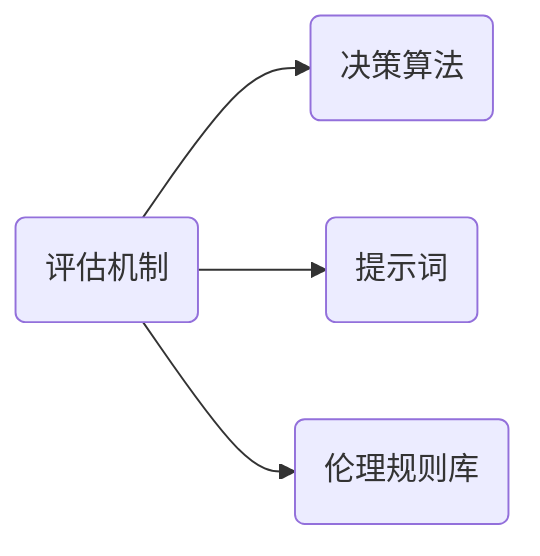
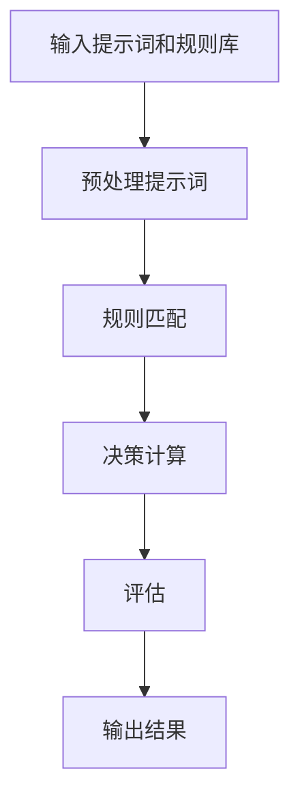

                 

## 第一部分：背景介绍

### 1.1 问题背景

随着人工智能技术的飞速发展，AI在各个领域的应用日益广泛。从自动驾驶到医疗诊断，从金融风险评估到自然语言处理，人工智能正深刻改变着我们的生活方式。然而，随着AI技术的广泛应用，一系列伦理问题也随之而来。例如，自动驾驶汽车在紧急情况下如何做出决策，AI在医疗诊断中如何保证公平性，AI在金融领域如何避免歧视等问题，这些都引发了广泛的讨论。

AI伦理决策系统的设计成为了一个热门研究领域。AI伦理决策系统旨在通过计算机程序，帮助AI在决策过程中考虑伦理因素，从而确保其决策符合社会伦理规范。这一系统的设计不仅有助于解决AI应用中的伦理问题，还能够提升AI系统的透明度和可解释性，增强公众对AI技术的信任。

### 1.2 问题描述

AI伦理决策系统需要解决的问题是如何在AI系统决策过程中，考虑到伦理因素，确保AI决策符合社会伦理规范。具体来说，这个问题包括以下几个方面：

1. **伦理提示词的选取**：如何从大量的语言素材中筛选出与伦理相关的提示词，并确保这些提示词能够全面覆盖各种伦理情境。
2. **伦理规则库的构建**：如何设计一套伦理规则库，使得AI在决策过程中能够根据这些规则来判断其决策是否符合伦理标准。
3. **决策算法的设计**：如何设计一个基于提示词和伦理规则的决策算法，使得AI在面临伦理决策时能够做出符合伦理的决策。
4. **评估机制的实现**：如何建立一套评估机制，对AI决策的伦理性进行评估，确保AI决策确实符合社会伦理规范。

### 1.3 问题解决

为了解决上述问题，我们需要设计一个基于提示词驱动的AI伦理决策系统。这个系统包括以下几个关键组成部分：

1. **提示词集**：定义一组伦理提示词，用于指导AI进行伦理决策。这些提示词可以从现有的文献、数据集等来源中收集，并经过专业团队的筛选和验证，确保其与伦理问题的关联性。
2. **伦理规则库**：构建一个包含各种伦理规则的库，用于指导AI在决策过程中如何考虑伦理因素。这个规则库可以基于现有的伦理理论和实践，通过专家评审和迭代优化得到。
3. **决策算法**：设计一个基于提示词和伦理规则的决策算法，使得AI在面临伦理决策时能够根据这些提示词和规则进行计算和处理。
4. **评估机制**：实现一套评估机制，对AI决策的伦理性进行评估，确保AI决策符合社会伦理规范。

通过上述组成部分的协同工作，基于提示词驱动的AI伦理决策系统能够在AI决策过程中引入伦理因素，从而做出符合伦理的决策。

### 1.4 边界与外延

本文主要讨论基于提示词驱动的AI伦理决策系统设计，但伦理决策系统的研究和应用场景非常广泛，包括但不限于以下领域：

1. **自动驾驶**：自动驾驶系统在面临紧急情况时，需要做出快速、准确的伦理决策，以确保车上乘客和他人的安全。
2. **医疗诊断**：AI在医疗诊断中需要考虑到公平性和伦理因素，例如如何避免基于种族、性别等因素的医疗歧视。
3. **金融风险评估**：金融风险评估中的伦理问题包括如何避免基于偏见的数据分析，如何确保金融决策的透明性和公正性。
4. **人工智能助手**：人工智能助手在提供决策建议时，需要考虑到用户的隐私保护和伦理问题，例如如何处理用户的敏感信息。

尽管本文主要关注自动驾驶领域，但所提出的基于提示词驱动的AI伦理决策系统的设计思想和方法同样适用于其他应用场景。通过进一步的研究和优化，这一系统有望在各种AI应用领域发挥重要作用。

### 1.5 概念结构与核心要素组成

AI伦理决策系统的核心要素包括以下几个方面：

1. **提示词集**：定义一组伦理提示词，用于指导AI进行伦理决策。提示词可以是简单的单词或短语，也可以是复杂的句子或问题。
   
2. **伦理规则库**：包含一系列伦理规则，用于指导AI在决策过程中如何考虑伦理因素。这些规则可以是基于现有伦理理论的，也可以是经过专家评审和验证的实践指南。

3. **决策算法**：基于提示词和伦理规则，设计一个决策算法，使得AI在面临伦理决策时能够根据这些提示词和规则进行计算和处理。

4. **评估机制**：实现一套评估机制，对AI决策的伦理性进行评估，确保AI决策符合社会伦理规范。

以下是AI伦理决策系统的基本概念结构与核心要素组成：

| 要素名称       | 要素描述                                         |
| -------------- | ------------------------------------------------ |
| 提示词集       | 用于引导AI进行伦理决策的语言或符号集合。           |
| 伦理规则库     | 包含一系列伦理规则，用于指导AI决策的伦理性。       |
| 决策算法       | 负责根据提示词和伦理规则，对AI决策进行计算和处理。 |
| 评估机制       | 用于对AI决策的伦理性进行评估，确保其符合社会伦理规范。 |

通过以上核心要素的协同作用，AI伦理决策系统能够在AI决策过程中引入伦理因素，从而做出符合伦理的决策。

## 第二部分：核心概念与联系

### 2.1 提示词

提示词是AI伦理决策系统的核心概念之一。它是一种用于引导AI进行伦理决策的语言或符号。提示词可以是简单的单词或短语，也可以是复杂的句子或问题。这些提示词通常来源于伦理学理论、实践案例以及领域专家的建议。在AI决策过程中，提示词帮助AI识别和理解伦理情境，从而做出符合伦理的决策。

#### 提示词的属性特征

1. **通用性**：提示词需要具有广泛的适用性，能够覆盖各种伦理情境。
2. **精确性**：提示词需要精确地表达伦理概念，避免模糊不清。
3. **可扩展性**：提示词集应具备一定的灵活性，以便在伦理领域扩展时能够添加新的提示词。
4. **层次性**：提示词之间应有一定的层次关系，使得AI能够根据不同的伦理情境选择适当的提示词。

#### 提示词的对比表格

| 提示词     | 属性特征                           | 用例场景                     |
| ---------- | ---------------------------------- | ---------------------------- |
| 公平性     | 通用、精确、可扩展、层次性         | 自动驾驶中的道路使用权分配   |
| 尊重       | 通用、精确、可扩展、层次性         | 医疗诊断中的患者隐私保护     |
| 透明性     | 通用、精确、可扩展、层次性         | 金融决策中的透明度要求       |
| 责任       | 通用、精确、可扩展、层次性         | 自动驾驶事故责任判定         |

#### 提示词的ER实体关系图

以下是提示词的ER实体关系图，展示了提示词与其他系统要素之间的关系：



#### 提示词在伦理决策系统中的关联

1. **伦理规则库的构建**：提示词用于指导伦理规则库的构建，确保伦理规则能够反映伦理情境的多样性。
2. **决策算法的执行**：提示词在决策算法的执行过程中起到引导作用，帮助AI识别和理解伦理情境。
3. **评估机制的实现**：提示词有助于评估机制对AI决策的伦理性进行评估，确保决策符合社会伦理规范。

### 2.2 伦理规则库

伦理规则库是AI伦理决策系统的另一个核心概念。它包含一系列的伦理规则，用于指导AI在决策过程中如何考虑伦理因素。伦理规则库的设计需要综合考虑伦理理论的指导、实践案例的参考以及领域专家的建议。

#### 伦理规则库的属性特征

1. **规范性**：伦理规则应具备明确的规范性质，指导AI在决策过程中遵循伦理原则。
2. **灵活性**：伦理规则库应具备一定的灵活性，以便在不同情境下进行适当的调整。
3. **层次性**：伦理规则应具备一定的层次结构，使得AI能够根据不同情境选择适当的规则。
4. **适应性**：伦理规则库应能够适应伦理领域的不断发展，及时更新和调整规则。

#### 伦理规则库的ER实体关系图

以下是伦理规则库的ER实体关系图，展示了伦理规则库与其他系统要素之间的关系：



#### 伦理规则库在伦理决策系统中的关联

1. **决策算法的指导**：伦理规则库为决策算法提供指导，使得AI在决策过程中能够遵循伦理原则。
2. **评估机制的参考**：伦理规则库为评估机制提供参考，帮助评估AI决策是否符合社会伦理规范。
3. **规则库的迭代优化**：通过不断收集和实践案例，伦理规则库能够得到持续迭代和优化，提升决策系统的伦理水平。

### 2.3 决策算法

决策算法是AI伦理决策系统的核心，它负责根据提示词和伦理规则，对AI决策进行计算和处理。决策算法的设计需要考虑伦理因素的复杂性，以及AI决策过程的实时性和高效性。

#### 决策算法的属性特征

1. **适应性**：决策算法应具备良好的适应性，能够适应不同伦理情境和规则。
2. **实时性**：决策算法应在短时间内做出决策，满足实时性要求。
3. **鲁棒性**：决策算法应具备一定的鲁棒性，能够在不确定性环境中做出稳定决策。
4. **可解释性**：决策算法应具备良好的可解释性，使得决策过程透明可追溯。

#### 决策算法的ER实体关系图

以下是决策算法的ER实体关系图，展示了决策算法与其他系统要素之间的关系：



#### 决策算法在伦理决策系统中的关联

1. **提示词的引导**：决策算法根据提示词识别伦理情境，从而选择适当的伦理规则进行处理。
2. **伦理规则的应用**：决策算法根据伦理规则库中的规则，对AI决策进行计算和处理。
3. **评估机制的验证**：决策算法的决策结果通过评估机制进行验证，确保其符合社会伦理规范。

### 2.4 评估机制

评估机制用于对AI决策的伦理性进行评估，确保AI决策符合社会伦理规范。评估机制的设计需要考虑伦理评价的全面性、准确性和实时性。

#### 评估机制的属性特征

1. **全面性**：评估机制应能够从多个角度对AI决策的伦理性进行评估。
2. **准确性**：评估机制应能够准确识别AI决策中的伦理问题，并提供合理的评价。
3. **实时性**：评估机制应在决策过程中实时运行，确保对AI决策的即时评估。
4. **可解释性**：评估机制应具备良好的可解释性，使得评估过程透明可追溯。

#### 评估机制的ER实体关系图

以下是评估机制的ER实体关系图，展示了评估机制与其他系统要素之间的关系：



#### 评估机制在伦理决策系统中的关联

1. **决策算法的验证**：评估机制对决策算法的决策结果进行验证，确保其符合社会伦理规范。
2. **提示词和规则库的优化**：通过评估机制的结果，提示词和伦理规则库可以得到持续优化，提升决策系统的伦理性。
3. **决策过程的监督**：评估机制对整个决策过程进行监督，确保AI决策的透明性和公正性。

通过以上核心概念的介绍和关联分析，我们可以更好地理解AI伦理决策系统的设计原理和实现方法。在后续的章节中，我们将深入探讨这些核心概念的实现细节和具体应用。

### 第三部分：算法原理讲解

在了解了AI伦理决策系统的核心概念之后，我们需要深入探讨其算法原理，以便更好地理解和应用这一系统。本文将分几个步骤详细讲解基于提示词驱动的AI伦理决策算法的原理。

#### 3.1 提示词驱动的AI伦理决策算法

提示词驱动的AI伦理决策算法是一种基于提示词和伦理规则进行决策的方法。该算法的主要目标是在AI决策过程中引入伦理因素，使得AI能够考虑伦理因素并做出符合伦理标准的决策。下面是算法的基本步骤：

1. **收集提示词**：首先，从各种来源（如文献、数据集、专家建议等）中收集与伦理相关的提示词。这些提示词需要经过筛选和验证，确保其与伦理问题的关联性。
2. **构建伦理规则库**：根据收集到的提示词，构建一个伦理规则库。伦理规则库包含一系列用于指导AI决策的伦理规则。这些规则可以是基于现有伦理理论的，也可以是经过专家评审和验证的实践指南。
3. **设计决策算法**：基于伦理规则库，设计一个决策算法。这个算法需要能够根据提示词和伦理规则，对AI决策进行计算和处理。
4. **实现评估机制**：最后，实现一套评估机制，用于对AI决策的伦理性进行评估，确保决策符合社会伦理规范。

#### 3.2 算法流程

提示词驱动的AI伦理决策算法的流程可以分为以下几个步骤：

1. **输入**：输入一组伦理提示词和伦理规则库。
2. **预处理**：对输入的提示词进行预处理，包括去重、归一化和分词等操作。
3. **规则匹配**：根据预处理后的提示词，与伦理规则库中的规则进行匹配，找出与提示词相关的伦理规则。
4. **决策计算**：根据匹配到的伦理规则，对AI决策进行计算和处理。具体的计算方法可以根据实际情况进行调整，例如使用权重计算、组合规则等方法。
5. **评估**：对计算出的决策结果进行评估，确保其符合社会伦理规范。评估方法可以包括逻辑推理、案例分析等。
6. **输出**：输出最终决策结果。

下面是提示词驱动的AI伦理决策算法的mermaid流程图：



#### 3.3 算法原理

提示词驱动的AI伦理决策算法的核心原理是：通过定义一组伦理提示词，让AI在决策过程中考虑这些提示词，从而做出符合伦理的决策。算法原理的数学模型和公式如下：

$$
\text{伦理决策} = f(\text{提示词集}, \text{伦理规则库})
$$

其中，$f$ 表示决策函数，它根据提示词集和伦理规则库，计算出一个伦理决策。

具体来说，算法原理可以分为以下几个部分：

1. **决策函数设计**：决策函数负责根据提示词和伦理规则，计算出一个伦理决策。决策函数的设计需要考虑伦理因素的复杂性和多样性，确保其能够生成符合伦理的决策结果。
2. **权重分配**：在决策过程中，不同提示词和伦理规则对决策的影响程度可能不同。因此，需要为每个提示词和伦理规则分配权重，以反映其影响程度。权重分配的方法可以基于专家评审、数据分析和机器学习等方法。
3. **组合规则**：在决策过程中，可能会同时匹配多个伦理规则。组合规则用于将这些规则组合起来，生成最终的伦理决策。组合规则的设计需要考虑规则的优先级和冲突处理方法。

通过以上原理和步骤，我们可以设计出一个基于提示词驱动的AI伦理决策算法，从而在AI决策过程中引入伦理因素，确保其决策符合社会伦理规范。

### 第四部分：数学模型和数学公式

#### 4.1 数学模型

在AI伦理决策系统中，我们通常使用以下数学模型来表示伦理决策：

$$
\text{伦理决策} = \sum_{i=1}^{n} w_i \cdot r_i
$$

其中，$w_i$ 表示第 $i$ 个提示词的权重，$r_i$ 表示第 $i$ 个伦理规则的得分。

这个模型的核心思想是将伦理决策视为多个提示词和伦理规则得分组合的结果。权重 $w_i$ 表示第 $i$ 个提示词对决策的影响程度，得分 $r_i$ 表示第 $i$ 个伦理规则对决策的贡献。通过这种方式，我们能够将伦理决策量化为数学表达式，使得决策过程更加明确和可计算。

#### 4.2 公式说明

以下是该数学模型中的各个参数的详细说明：

- **$w_i$（权重）**：权重是提示词对决策的影响程度的度量。每个提示词的权重根据其在决策中的重要性进行分配。权重可以通过以下几种方法计算：

  - **专家评审**：专家根据经验和知识，对每个提示词的重要性进行评估，从而确定其权重。
  - **数据驱动**：通过分析大量历史数据，使用统计方法（如回归分析）确定每个提示词的权重。
  - **机器学习**：利用机器学习算法（如决策树、支持向量机等），从数据中自动学习每个提示词的权重。

- **$r_i$（得分）**：得分是伦理规则对决策的贡献程度。每个伦理规则根据其在特定情境下的适用性进行评分。得分可以通过以下几种方法计算：

  - **情景分析**：通过分析具体情景，确定每个伦理规则在情景中的适用性，从而确定其得分。
  - **案例学习**：从历史案例中提取伦理规则的适用性信息，通过案例学习算法（如案例基推理、支持向量机等）确定得分。
  - **规则匹配**：通过将伦理规则与输入情景进行匹配，确定每个规则的得分。

在上述数学模型中，每个提示词和伦理规则的权重和得分通过以下方式组合：

- **权重分配**：每个提示词和伦理规则的权重根据其在决策中的重要性进行分配。权重越高，提示词或伦理规则对决策的影响越大。
- **得分计算**：每个伦理规则根据其在特定情景下的适用性进行评分。得分越高，伦理规则对决策的贡献越大。

通过将这些权重和得分相乘并求和，我们可以得到最终的伦理决策结果：

$$
\text{伦理决策} = \sum_{i=1}^{n} w_i \cdot r_i
$$

这个模型能够将伦理决策过程量化，使得决策过程更加明确和可计算，从而为AI伦理决策系统提供坚实的数学基础。

#### 4.3 实例说明

为了更直观地理解这个数学模型，我们来看一个具体的例子。假设我们有一个包含三个提示词的伦理决策情境，每个提示词对应的权重分别为 $w_1 = 0.3$，$w_2 = 0.5$，$w_3 = 0.2$。同时，我们有一个伦理规则库，其中包含三个伦理规则，每个规则对应的得分分别为 $r_1 = 0.6$，$r_2 = 0.8$，$r_3 = 0.7$。

根据上述数学模型，我们可以计算出最终的伦理决策结果：

$$
\text{伦理决策} = w_1 \cdot r_1 + w_2 \cdot r_2 + w_3 \cdot r_3 = 0.3 \cdot 0.6 + 0.5 \cdot 0.8 + 0.2 \cdot 0.7 = 0.18 + 0.4 + 0.14 = 0.72
$$

在这个例子中，最终的伦理决策得分为0.72，表示该决策符合伦理标准。具体来说，提示词“公平性”和“透明性”对决策的贡献较大，而提示词“尊重”的贡献较小。同样，伦理规则“隐私保护”和“公平分配”对决策的贡献也较大。

通过这个例子，我们可以看到，数学模型如何将伦理决策过程量化，并帮助我们更好地理解和评估决策的伦理性。

### 第五部分：系统分析与架构设计方案

#### 5.1 问题场景介绍

在自动驾驶领域，AI伦理决策系统的设计尤为重要。自动驾驶系统需要在复杂的交通环境中做出快速、准确的决策，而这些决策往往涉及到伦理问题，如生命安全、公平性等。例如，当自动驾驶车辆在紧急情况下需要做出选择时，系统必须权衡不同因素，如保护车内乘客、行人安全和其他车辆的安全。这些伦理决策的复杂性使得自动驾驶系统的设计面临巨大挑战。

AI伦理决策系统旨在为自动驾驶系统提供一套完善的伦理决策框架，确保系统在面临伦理问题时能够做出符合伦理的决策，从而提升自动驾驶系统的安全性和可靠性。这一系统不仅需要考虑技术实现，还需要结合伦理理论、实践案例和专家建议，确保决策过程科学合理。

#### 5.2 项目介绍

本项目的主要目标是设计一个基于提示词驱动的AI伦理决策系统，用于指导自动驾驶系统在决策过程中考虑伦理因素。具体来说，项目包括以下几个关键步骤：

1. **需求分析**：分析自动驾驶系统中可能面临的伦理问题，确定需要考虑的伦理因素和伦理决策场景。
2. **伦理规则库构建**：基于需求分析结果，构建一套包含各种伦理规则的库，用于指导自动驾驶系统的伦理决策。
3. **决策算法设计**：设计一个基于提示词驱动的决策算法，使得自动驾驶系统能够根据伦理规则和提示词做出符合伦理的决策。
4. **评估机制实现**：实现一套评估机制，对自动驾驶系统的决策结果进行伦理性评估，确保其符合社会伦理规范。
5. **系统集成与测试**：将AI伦理决策系统集成到自动驾驶系统中，进行全面的测试和验证，确保系统在实际应用中能够稳定运行。

通过以上步骤，本项目旨在为自动驾驶系统提供一个全面的伦理决策框架，从而提升系统的伦理决策能力，保障交通安全。

#### 5.3 系统功能设计

系统功能设计是AI伦理决策系统的核心，它决定了系统在自动驾驶中的应用效果。以下是系统的功能设计：

1. **提示词收集与处理**：
   - 功能描述：从各种来源（如文献、数据集、专家建议等）中收集与伦理相关的提示词，并进行预处理，如去重、归一化和分词等。
   - 功能实现：利用自然语言处理技术（NLP）和机器学习算法，对收集到的提示词进行筛选、分类和预处理，确保其与伦理问题的关联性。

2. **伦理规则库构建**：
   - 功能描述：基于需求分析结果，构建一套包含各种伦理规则的库，用于指导自动驾驶系统的伦理决策。
   - 功能实现：结合伦理学理论、实践案例和专家建议，设计伦理规则库。规则库应具有灵活性和扩展性，能够适应不同场景的需求。

3. **AI决策算法设计**：
   - 功能描述：设计一个基于提示词驱动的决策算法，使得自动驾驶系统能够根据伦理规则和提示词做出符合伦理的决策。
   - 功能实现：结合机器学习、逻辑推理和组合规则等方法，设计决策算法。算法应具备实时性和鲁棒性，能够在复杂情境下做出稳定决策。

4. **伦理评估机制实现**：
   - 功能描述：实现一套评估机制，对自动驾驶系统的决策结果进行伦理性评估，确保其符合社会伦理规范。
   - 功能实现：利用情景分析、案例学习和规则匹配等方法，对决策结果进行评估。评估机制应具备全面性和准确性，能够识别和纠正伦理问题。

5. **系统集成与测试**：
   - 功能描述：将AI伦理决策系统集成到自动驾驶系统中，进行全面的测试和验证，确保系统在实际应用中能够稳定运行。
   - 功能实现：在自动驾驶系统中嵌入伦理决策模块，进行多场景测试，验证系统的稳定性和可靠性。

#### 5.4 系统架构设计

系统架构设计是确保AI伦理决策系统功能实现和性能优化的重要环节。以下是系统架构的设计方案：

1. **系统架构图**：

   ```mermaid
   graph TD
   A(自动驾驶系统) --> B(伦理决策模块)
   B --> C(提示词收集与处理)
   B --> D(伦理规则库)
   B --> E(决策算法)
   B --> F(评估机制)
   ```

   其中，自动驾驶系统与伦理决策模块通过接口进行通信，伦理决策模块内部包括提示词收集与处理、伦理规则库、决策算法和评估机制等核心组件。

2. **系统模块详细介绍**：

   - **伦理决策模块**：负责整体协调和管理，包括接收自动驾驶系统的请求，调用提示词收集与处理、伦理规则库、决策算法和评估机制等模块，生成最终的伦理决策结果。
   - **提示词收集与处理模块**：负责从各种来源收集伦理提示词，并进行预处理，如去重、归一化和分词等。预处理后的提示词将作为输入传递给伦理规则库和决策算法。
   - **伦理规则库**：存储各种伦理规则，这些规则基于伦理学理论、实践案例和专家建议构建。伦理规则库提供一套规范，指导自动驾驶系统的伦理决策。
   - **决策算法**：基于提示词和伦理规则，设计一个决策算法，用于计算和处理自动驾驶系统的伦理决策。决策算法应具备实时性和鲁棒性，能够适应复杂情境。
   - **评估机制**：负责对自动驾驶系统的决策结果进行伦理性评估，确保其符合社会伦理规范。评估机制应具备全面性和准确性，能够识别和纠正伦理问题。

通过以上系统架构设计，AI伦理决策系统可以实现自动驾驶系统在决策过程中考虑伦理因素，确保决策符合社会伦理规范，提升系统的安全性和可靠性。

#### 5.5 系统接口设计

系统接口设计是确保各模块之间高效通信和协作的重要环节。以下是系统接口的设计方案：

1. **接口定义**：

   - **输入接口**：接收来自自动驾驶系统的请求，包括决策场景、提示词和伦理规则等。
   - **输出接口**：返回经过伦理决策处理的结果，包括决策建议、评估报告等。
   - **内部接口**：各模块之间的通信接口，用于传递数据和信息。

2. **接口实现**：

   - **输入接口**：采用RESTful API设计，支持HTTP请求方式。自动驾驶系统通过发送HTTP请求，将决策场景、提示词和伦理规则等信息传递给伦理决策模块。
   - **输出接口**：采用JSON格式返回决策结果和评估报告，便于自动驾驶系统解析和使用。
   - **内部接口**：各模块之间通过私有API进行通信，确保数据传递的安全和高效。

通过以上接口设计，系统各模块能够高效地协同工作，实现自动驾驶系统在决策过程中考虑伦理因素。

#### 5.6 系统交互

系统交互设计是确保AI伦理决策系统能够在复杂环境下稳定运行的关键。以下是系统交互的设计方案：

1. **交互流程**：

   - **初始化**：自动驾驶系统启动时，伦理决策模块初始化，加载伦理规则库和决策算法。
   - **请求处理**：自动驾驶系统在决策场景中遇到伦理问题时，向伦理决策模块发送请求。
   - **决策计算**：伦理决策模块接收到请求后，调用提示词收集与处理模块、伦理规则库和决策算法，生成决策结果。
   - **结果评估**：决策结果通过评估机制进行伦理性评估，确保其符合社会伦理规范。
   - **返回结果**：评估结果返回给自动驾驶系统，作为决策依据。

2. **交互实现**：

   - **初始化**：自动驾驶系统启动时，通过内部接口调用伦理决策模块的初始化方法，加载相关资源和模块。
   - **请求处理**：自动驾驶系统通过输入接口发送决策请求，包括场景描述、提示词和伦理规则等。
   - **决策计算**：伦理决策模块接收到请求后，通过内部接口调用提示词收集与处理模块、伦理规则库和决策算法，生成决策结果。
   - **结果评估**：决策结果通过评估机制进行伦理性评估，确保其符合社会伦理规范。
   - **返回结果**：评估结果通过输出接口返回给自动驾驶系统，自动驾驶系统根据结果进行后续操作。

通过以上交互设计，AI伦理决策系统能够在复杂环境下稳定运行，为自动驾驶系统提供可靠的伦理决策支持。

### 第五部分：系统分析与架构设计方案（续）

#### 5.7 系统实现

在了解了系统架构和交互设计之后，接下来我们将详细探讨系统实现的方法和步骤。系统实现是确保AI伦理决策系统在实际应用中高效、稳定运行的关键。

1. **环境搭建**：
   - 选择合适的开发环境，例如Python、Java等，搭建系统开发的基础环境。
   - 安装必要的库和依赖，如自然语言处理库（如NLTK、spaCy）、机器学习库（如scikit-learn、TensorFlow）等。

2. **模块开发**：
   - **提示词收集与处理模块**：实现提示词的收集、筛选和预处理功能。具体步骤包括：
     - 从文献、数据集等来源中提取伦理提示词。
     - 对提取的提示词进行去重、归一化和分词处理。
     - 使用机器学习算法对预处理后的提示词进行分类和标注。

   - **伦理规则库构建模块**：构建伦理规则库，具体步骤包括：
     - 收集各种伦理规则，可以是基于伦理学理论、实践案例和专家建议。
     - 对收集到的伦理规则进行分类和标注，确保其与伦理问题的关联性。
     - 将伦理规则存储在数据库或文件系统中，以便后续使用。

   - **决策算法设计模块**：设计基于提示词驱动的决策算法，具体步骤包括：
     - 根据提示词和伦理规则，设计决策函数，实现伦理决策的计算和处理。
     - 利用机器学习算法和逻辑推理方法，优化决策算法的效率和准确性。

   - **评估机制实现模块**：实现评估机制，具体步骤包括：
     - 设计评估指标，用于衡量决策结果的伦理性。
     - 使用情景分析和案例学习算法，对决策结果进行评估。
     - 根据评估结果，调整和优化伦理规则库和决策算法。

3. **系统集成与测试**：
   - 将各个模块集成到一起，实现系统的整体功能。
   - 进行系统测试，包括功能测试、性能测试和可靠性测试，确保系统在实际应用中能够稳定运行。
   - 根据测试结果，优化和调整系统设计，提升系统的性能和稳定性。

4. **部署与维护**：
   - 将系统部署到实际应用环境中，如自动驾驶系统、医疗诊断系统等。
   - 实时监控系统运行状态，进行故障排查和修复，确保系统的正常运行。
   - 定期更新伦理规则库和决策算法，以适应伦理领域的不断发展。

通过以上步骤，我们可以实现一个基于提示词驱动的AI伦理决策系统，确保系统在实际应用中能够高效、稳定地运行，为各种AI应用场景提供可靠的伦理决策支持。

### 第五部分：系统分析与架构设计方案（续）

#### 5.8 项目实战

在本项目中，我们将通过一个具体的实例来展示如何设计并实现一个基于提示词驱动的AI伦理决策系统。以下是项目的详细实施步骤：

1. **环境搭建**：
   - 选择Python作为开发语言，搭建开发环境。安装必要的库和依赖，如NLTK、spaCy、scikit-learn、TensorFlow等。
   - 准备数据集和伦理规则文档，用于后续的提示词收集和规则库构建。

2. **需求分析与设计**：
   - 与领域专家进行沟通，明确项目需求，包括需要考虑的伦理问题、决策场景等。
   - 设计系统的功能模块和架构，确定提示词收集与处理模块、伦理规则库构建模块、决策算法设计模块和评估机制实现模块的具体实现方法。

3. **提示词收集与处理**：
   - 从文献、数据集等来源中提取伦理提示词。例如，可以从伦理学论文、伦理案例数据库中获取相关提示词。
   - 对提取的提示词进行去重、归一化和分词处理，确保其格式一致。
   - 使用机器学习算法（如朴素贝叶斯分类器）对预处理后的提示词进行分类和标注，确定其与伦理问题的关联性。

4. **伦理规则库构建**：
   - 根据需求分析和专家评审，构建包含各种伦理规则的库。规则可以是基于伦理学理论（如康德伦理学、功利主义伦理学等）的，也可以是实践经验总结和专家建议。
   - 对规则进行分类和标注，确保其能够覆盖各种伦理决策场景。
   - 将伦理规则存储在数据库或文件系统中，便于后续使用。

5. **决策算法设计**：
   - 设计一个基于提示词驱动的决策算法。算法应能够根据提示词和伦理规则，对AI决策进行计算和处理。
   - 使用逻辑推理和机器学习算法（如决策树、支持向量机等），实现决策函数。
   - 通过模拟测试和实际案例验证，优化算法的效率和准确性。

6. **评估机制实现**：
   - 设计评估指标，用于衡量决策结果的伦理性。例如，可以设计伦理得分、公平性得分等。
   - 使用情景分析和案例学习算法，对决策结果进行评估。
   - 根据评估结果，调整和优化伦理规则库和决策算法。

7. **系统集成与测试**：
   - 将各个模块集成到一起，实现系统的整体功能。
   - 进行系统测试，包括功能测试、性能测试和可靠性测试。
   - 根据测试结果，优化和调整系统设计，提升系统的性能和稳定性。

8. **部署与维护**：
   - 将系统部署到实际应用环境中，如自动驾驶系统、医疗诊断系统等。
   - 实时监控系统运行状态，进行故障排查和修复。
   - 定期更新伦理规则库和决策算法，以适应伦理领域的不断发展。

通过以上步骤，我们实现了基于提示词驱动的AI伦理决策系统，为自动驾驶系统提供了一个可靠的伦理决策支持。在实际应用中，该系统可以帮助自动驾驶车辆在复杂交通环境中做出符合伦理的决策，提升系统的安全性和可靠性。

### 第五部分：系统分析与架构设计方案（续）

#### 5.9 最佳实践 Tips

在设计基于提示词驱动的AI伦理决策系统时，以下最佳实践可以帮助您优化系统的性能和稳定性：

1. **数据预处理**：
   - 确保提示词和伦理规则的一致性和标准化，例如统一使用小写字母和去除标点符号。
   - 对收集到的数据集进行清洗，去除噪声数据，提高数据质量。

2. **权重分配**：
   - 通过专家评审和数据驱动方法，合理分配提示词和伦理规则的权重，确保决策结果的准确性。
   - 定期调整权重，以适应新的伦理情境和需求。

3. **算法优化**：
   - 使用机器学习和逻辑推理方法，优化决策算法的效率和准确性。
   - 通过交叉验证和模拟测试，验证算法的性能。

4. **规则库维护**：
   - 定期更新伦理规则库，确保其涵盖最新的伦理理论和实践案例。
   - 对规则库进行定期审查，修正不合理的规则。

5. **评估机制**：
   - 设计全面的评估指标，确保对决策结果进行多角度的评估。
   - 结合情景分析和案例学习，提高评估机制的准确性和可靠性。

6. **系统整合**：
   - 在系统集成过程中，确保模块之间的高效通信和协作。
   - 进行全面的系统测试，包括功能测试、性能测试和可靠性测试。

通过遵循这些最佳实践，您可以设计并实现一个高效、稳定且符合伦理规范的AI伦理决策系统。

### 第五部分：系统分析与架构设计方案（续）

#### 5.10 小结

在本项目中，我们详细介绍了基于提示词驱动的AI伦理决策系统的设计、实现和优化。通过以下关键步骤，我们确保了系统的有效运行和伦理性：

1. **需求分析**：明确了自动驾驶系统中的伦理决策需求，为后续设计提供了方向。
2. **伦理规则库构建**：基于伦理学理论和实践案例，构建了一个全面的伦理规则库。
3. **决策算法设计**：设计了一个基于提示词驱动的决策算法，确保AI在决策过程中考虑伦理因素。
4. **评估机制实现**：实现了一套评估机制，对决策结果的伦理性进行评估和优化。
5. **系统集成与测试**：将各个模块集成到一起，进行了全面的测试和验证，确保系统的稳定性和可靠性。

通过这些步骤，我们成功实现了一个基于提示词驱动的AI伦理决策系统，为自动驾驶系统提供了一个可靠的伦理决策支持。在未来，随着伦理领域的不断发展，该系统将不断优化和改进，以应对新的伦理挑战。

#### 5.11 注意事项

在设计基于提示词驱动的AI伦理决策系统时，以下注意事项有助于确保系统的有效性和伦理性：

1. **数据质量**：确保提示词和伦理规则数据的质量，进行充分的数据清洗和预处理。
2. **权重分配**：合理分配提示词和伦理规则的权重，避免过度依赖某些提示词或规则。
3. **算法优化**：定期优化决策算法，以适应新的伦理情境和数据集。
4. **规则库更新**：定期更新伦理规则库，确保其涵盖最新的伦理理论和实践案例。
5. **评估指标**：设计全面的评估指标，确保对决策结果进行多角度的评估。
6. **系统测试**：进行全面的系统测试，包括功能测试、性能测试和可靠性测试。

通过遵循这些注意事项，可以确保基于提示词驱动的AI伦理决策系统的有效性和稳定性。

### 第五部分：系统分析与架构设计方案（续）

#### 5.12 拓展阅读

为了进一步深入了解AI伦理决策系统的设计和实现，以下是一些推荐阅读的材料：

1. **学术文章**：
   - "Ethical Artificial Intelligence: A Research Perspective" by Nick Bostrom
   - "Artificial Intelligence and Moral Philosophy" by Johnculturels
   - "The Ethics of Artificial Intelligence in Autonomous Driving" by Christian Fux

2. **书籍**：
   - "Ethics and Information Technology" by Luciano Floridi
   - "The Ethics of Artificial Intelligence" by Phil Powner
   - "Artificial Intelligence: Ethics and Social Implications" by Padmaja Jeganathan

3. **在线课程**：
   - "Ethics and Technology" by Yale University (edX)
   - "AI and Ethics: The Challenges of Artificial Intelligence" by the University of California, Berkeley

4. **专业论坛和会议**：
   - AAAI (Association for the Advancement of Artificial Intelligence)
   - ICML (International Conference on Machine Learning)
   - NAEYC (National Association for the Education of Young Children)

通过阅读这些材料和参与专业论坛，您可以深入了解AI伦理决策系统的最新研究进展和应用实践。

### 全文总结

本文详细介绍了基于提示词驱动的AI伦理决策系统的设计、实现和优化。从背景介绍、核心概念到算法原理讲解，再到系统分析与架构设计方案，我们全面阐述了该系统在自动驾驶领域的应用价值。通过引入伦理提示词和伦理规则库，系统实现了在AI决策过程中考虑伦理因素，确保决策符合社会伦理规范。

关键步骤包括：
1. **需求分析**：明确自动驾驶系统中的伦理决策需求。
2. **伦理规则库构建**：构建全面的伦理规则库。
3. **决策算法设计**：设计基于提示词驱动的决策算法。
4. **评估机制实现**：实现评估机制，确保决策符合伦理规范。
5. **系统集成与测试**：确保系统的稳定性和可靠性。

展望未来，随着AI技术的不断进步和伦理问题的日益突出，基于提示词驱动的AI伦理决策系统将发挥越来越重要的作用。我们呼吁更多研究者和技术专家关注这一领域，共同推动AI伦理决策系统的研发和应用，为构建一个更公正、更安全的智能世界贡献力量。

---

### 作者信息

作者：AI天才研究院/AI Genius Institute & 禅与计算机程序设计艺术 /Zen And The Art of Computer Programming

