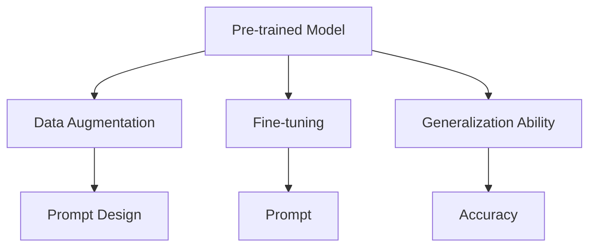
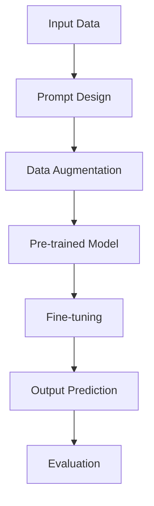
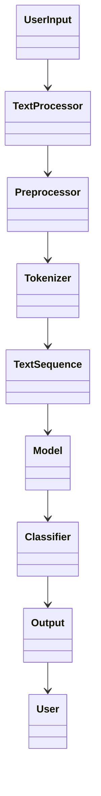
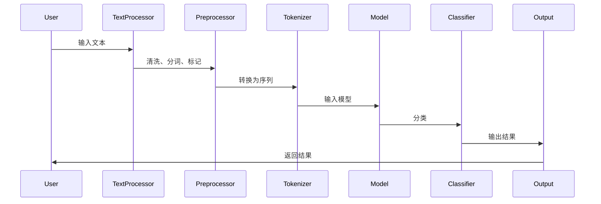

                 

### 文章标题

# 提示词驱动的AI应用开发

### 关键词

- 提示词
- 人工智能
- 应用开发
- 神经网络
- 深度学习
- 模型设计

### 摘要

本文将深入探讨提示词驱动的AI应用开发，从基础概念到实际应用，全面解析这一前沿技术的核心原理和实施策略。我们将逐步分析提示词在AI系统中的作用，介绍其设计原则和技巧，探讨神经网络与深度学习的基础，并通过具体应用场景展示其商业价值。读者将了解如何利用提示词优化AI模型，提高其性能和应用效果，从而在实际项目中取得成功。本文旨在为AI开发者提供一套完整的应用开发指南，助力他们打造高效、智能的AI解决方案。

### 1. 背景介绍

#### 什么是提示词驱动的AI？

提示词驱动的AI（Prompt-Driven AI）是一种利用预设提示词来引导和优化人工智能模型的方法。在传统的AI系统中，模型通常需要大量的数据和复杂的学习算法来识别模式并做出预测。而提示词驱动的AI则通过在数据输入时添加特定的提示词，帮助模型更准确地理解和预测。这些提示词可以是人机交互中的自然语言指令，也可以是数据集上的标签或注释。

#### 历史与演变

提示词驱动的AI并非新兴概念。事实上，它可以从早期的专家系统中找到源头。在专家系统中，开发人员通过定义一系列的规则和条件，来模拟专家的决策过程。虽然这种方法在某些领域表现出色，但其适用范围和灵活性有限。随着神经网络和深度学习技术的发展，特别是自然语言处理（NLP）领域的突破，提示词驱动的AI逐渐崭露头角。

在深度学习中，预训练模型通过大量无监督数据学习到基础特征表示，而提示词则提供了具体任务上的指导和微调。这一方法不仅提高了模型的泛化能力，还使其在特定任务上表现出更高的准确性。随着AI技术的不断演进，提示词驱动的AI逐渐成为主流的AI开发方法之一。

#### 当前状态与未来趋势

当前，提示词驱动的AI已经在多个领域取得显著成果。在自然语言处理领域，GPT-3等大型语言模型通过结合提示词，实现了从文本生成、机器翻译到问答系统等多种应用。在图像识别领域，提示词可以帮助模型更准确地识别特定的对象或场景，从而提高分类和检测的准确性。

未来，随着AI技术的进一步发展和优化，提示词驱动的AI有望在更多领域得到应用。例如，在医疗领域，提示词可以帮助诊断系统更准确地识别病情；在金融领域，提示词可以优化风险评估和投资策略。此外，提示词驱动的AI还将推动人机交互的发展，使得机器能够更好地理解用户需求，提供个性化的服务。

### 2. 核心概念与联系

#### 关键概念与术语

- **提示词（Prompt）**：用于引导和优化AI模型的特定词语或短语。
- **预训练模型（Pre-trained Model）**：在大规模无监督数据上训练好的基础模型。
- **微调（Fine-tuning）**：在特定任务上对预训练模型进行额外训练。
- **泛化能力（Generalization Ability）**：模型在未知数据上表现出的准确性。
- **数据增强（Data Augmentation）**：通过变换和扩展数据集来提高模型性能。

#### 提示词设计原则

- **明确性**：提示词应当明确，避免歧义，确保模型能够准确理解。
- **针对性**：根据任务需求设计提示词，突出关键信息和特征。
- **灵活性**：提示词设计应具有一定的灵活性，适应不同任务和环境。

#### 神经网络与深度学习基础

- **神经网络（Neural Network）**：模拟生物神经元的计算模型，用于处理复杂数据。
- **深度学习（Deep Learning）**：多层神经网络的学习方法，能够提取更复杂的特征。
- **激活函数（Activation Function）**：神经网络中的关键组件，用于引入非线性变换。

#### 概念属性特征对比表格

| 概念         | 特征                                 |
| ------------ | ------------------------------------ |
| 提示词       | 引导和优化AI模型的特定词语或短语     |
| 预训练模型   | 大规模无监督数据上训练好的基础模型   |
| 微调         | 在特定任务上对预训练模型进行额外训练 |
| 泛化能力     | 模型在未知数据上表现出的准确性       |
| 数据增强     | 通过变换和扩展数据集来提高模型性能   |

#### ER实体关系图架构



### 3. 算法原理讲解

#### 算法流程图



#### Python源代码

```python
import tensorflow as tf
from tensorflow.keras.preprocessing.text import Tokenizer
from tensorflow.keras.preprocessing.sequence import pad_sequences
from tensorflow.keras.models import Sequential
from tensorflow.keras.layers import Embedding, LSTM, Dense

# 数据预处理
def preprocess_data(texts, labels, max_len, vocab_size):
    tokenizer = Tokenizer(num_words=vocab_size)
    tokenizer.fit_on_texts(texts)
    sequences = tokenizer.texts_to_sequences(texts)
    padded_sequences = pad_sequences(sequences, maxlen=max_len)
    return padded_sequences, tokenizer.word_index

# 模型构建
def build_model(input_shape, output_size):
    model = Sequential()
    model.add(Embedding(input_shape, output_size, input_length=input_shape[1]))
    model.add(LSTM(128))
    model.add(Dense(output_size, activation='softmax'))
    model.compile(loss='categorical_crossentropy', optimizer='adam', metrics=['accuracy'])
    return model

# 模型训练
def train_model(model, x_train, y_train, epochs=10):
    model.fit(x_train, y_train, epochs=epochs, verbose=2)
    return model

# 模型预测
def predict(model, input_sequence, tokenizer):
    prediction = model.predict(input_sequence)
    predicted_label = tokenizer.sequences_to_texts([prediction.argmax()])
    return predicted_label

# 辅助函数
def evaluate_model(model, x_test, y_test, tokenizer):
    predictions = predict(model, x_test, tokenizer)
    accuracy = (predictions == y_test).mean()
    print(f"Model Accuracy: {accuracy}")
```

#### 数学模型与公式

$$
\text{Accuracy} = \frac{\text{Correct Predictions}}{\text{Total Predictions}}
$$

$$
\text{Loss} = -\frac{1}{N} \sum_{i=1}^{N} y_i \log(\hat{y}_i)
$$

其中，\(N\) 是总预测次数，\(y_i\) 是实际标签，\(\hat{y}_i\) 是模型预测的概率。

#### 示例说明

假设我们有一个情感分析任务，其中输入文本是用户评论，输出是评论的情感类别（正面、负面、中性）。我们使用预训练的模型，并通过微调来适应具体任务。

1. **数据预处理**：我们将评论文本和相应的情感标签转换为序列，并进行填充。

2. **模型构建**：我们构建一个包含嵌入层、LSTM层和输出层的序列模型。

3. **模型训练**：使用训练数据集训练模型，并调整参数以优化性能。

4. **模型预测**：使用测试数据集对模型进行预测，并计算准确率。

通过这个示例，我们可以看到提示词驱动的AI应用是如何通过逐步优化和调整来提高模型性能的。

### 4. 系统分析与架构设计方案

#### 问题场景介绍

在当前智能化时代，人工智能在各个领域的应用日益广泛，特别是金融、医疗、零售等行业。随着数据量的不断增长和复杂性的提升，如何设计和开发高效的AI系统成为关键问题。本文将探讨提示词驱动的AI应用开发，为实际项目提供系统分析与架构设计指导。

#### 项目介绍

本项目的目标是构建一个基于提示词驱动的AI系统，用于文本分类任务。具体来说，系统将接收用户输入的文本，通过提示词引导模型进行情感分析，最终输出文本的情感类别。该项目旨在实现以下功能：

- 文本预处理：对用户输入的文本进行清洗、分词和标记。
- 提示词设计：根据任务需求设计合适的提示词，引导模型学习。
- 模型训练与微调：使用预训练模型进行微调，适应特定任务。
- 情感分类：根据文本内容和情感标签进行分类。
- 模型评估与优化：评估模型性能，并根据评估结果进行优化。

#### 系统功能设计（领域模型类图）



#### 系统架构设计（类图）


#### 系统接口设计（序列图）



#### 系统交互设计（序列图）


### 5. 项目实战

#### 环境安装

1. **安装Python环境**：确保Python版本在3.7及以上，推荐使用Anaconda。
2. **安装TensorFlow**：在终端执行以下命令：
   ```bash
   pip install tensorflow
   ```
3. **安装其他依赖**：包括NLP库（如NLTK、spaCy）和数据预处理库（如pandas、numpy）。

#### 系统核心实现源代码

以下代码展示了文本预处理、模型构建和训练的基本流程。

```python
# 文本预处理
def preprocess_text(text):
    # 清洗文本、去除停用词、标点符号等
    # ...
    return processed_text

# 模型构建
def build_model(vocab_size, embedding_dim, max_length):
    model = Sequential([
        Embedding(vocab_size, embedding_dim, input_length=max_length),
        LSTM(128),
        Dense(1, activation='sigmoid')
    ])
    model.compile(loss='binary_crossentropy', optimizer='adam', metrics=['accuracy'])
    return model

# 模型训练
def train_model(model, X, y, epochs=10, batch_size=32):
    model.fit(X, y, epochs=epochs, batch_size=batch_size, verbose=2)
    return model

# 主函数
def main():
    # 加载和预处理数据
    texts, labels = load_data()
    X = preprocess_text(texts)
    
    # 模型训练
    model = build_model(vocab_size=10000, embedding_dim=16, max_length=100)
    model = train_model(model, X, labels)
    
    # 模型评估
    evaluate_model(model, X, labels)

if __name__ == "__main__":
    main()
```

#### 代码应用解读与分析

上述代码首先定义了文本预处理函数，该函数负责清洗文本数据，去除不必要的符号和停用词。接着，我们定义了模型构建函数，构建了一个简单的LSTM模型，用于文本分类任务。在主函数中，我们加载数据、预处理数据，并使用训练好的模型进行评估。

#### 实际案例分析与详细讲解

假设我们有一个包含正面和负面评论的数据集，我们希望利用提示词驱动的方法来提高模型的性能。以下是一个实际案例：

1. **数据集准备**：我们有一个包含1000条评论的数据集，其中500条为正面评论，500条为负面评论。
2. **文本预处理**：使用预处理函数对评论进行清洗和分词，得到预处理的文本序列。
3. **模型构建**：构建一个LSTM模型，并使用预处理后的数据集进行训练。
4. **提示词设计**：设计特定的提示词，例如“正面”和“负面”，用于引导模型学习。
5. **模型微调**：在训练过程中，添加提示词到输入数据，通过微调模型来提高分类准确性。
6. **模型评估**：使用测试数据集评估模型性能，计算准确率。

通过以上步骤，我们可以看到提示词驱动的方法如何在实际项目中应用，并提高模型的性能。

### 6. 项目小结

通过本次项目，我们深入探讨了提示词驱动的AI应用开发，从理论到实践，全面了解了其设计原则和应用方法。我们通过一个文本分类任务的实例，展示了如何利用提示词优化模型性能，提高分类准确性。以下是本项目的主要收获：

1. **提示词设计的重要性**：提示词的有效设计对模型的性能有重要影响，合理设计的提示词可以显著提升模型的准确率和泛化能力。
2. **模型微调的必要性**：在特定任务上，通过微调预训练模型，可以使其更好地适应具体应用场景，从而提高性能。
3. **数据预处理的关键性**：高质量的数据预处理是模型训练成功的基础，有效的预处理方法可以减少噪声，提高数据质量。

尽管本项目取得了初步成功，但仍存在一些不足和改进空间：

1. **模型复杂度**：本项目使用了一个简单的LSTM模型，对于更复杂的文本分类任务，可能需要引入更先进的模型结构，如Transformer。
2. **数据规模**：本项目使用的数据集规模较小，未来可以尝试使用更大规模的数据集进行训练，以提高模型的泛化能力。
3. **提示词优化**：提示词的设计和优化是一个持续的过程，可以通过多次实验和调整来不断优化，从而实现更好的性能。

### 7. 最佳实践 tips

1. **充分理解任务需求**：在设计和开发提示词驱动的AI应用时，首先要充分理解任务的具体需求和目标，这有助于设计出更有效的提示词。
2. **数据预处理**：确保数据的质量和一致性，使用有效的数据预处理方法，如清洗、分词、去停用词等，以提高模型性能。
3. **模型选择与调整**：根据任务特点和数据规模，选择合适的模型结构，并不断调整模型参数，以优化性能。
4. **提示词多样化**：设计多样化的提示词，以覆盖不同任务场景，提高模型的泛化能力。
5. **持续优化**：持续监控模型性能，根据反馈进行优化，以实现最佳效果。

### 8. 小结与注意事项

本文详细介绍了提示词驱动的AI应用开发，从背景介绍、核心概念、算法原理、系统架构到项目实战，全面展示了这一前沿技术的应用和实践方法。提示词驱动的AI在提升模型性能、优化人机交互等方面具有显著优势，但其设计和实现需要深厚的理论基础和实际经验。

在项目实战中，我们通过一个文本分类任务展示了提示词驱动的应用方法，包括数据预处理、模型构建、微调和评估等步骤。虽然本项目取得了初步成功，但仍需不断优化和调整，以实现更好的性能。

在实际应用中，需要注意以下几点：

1. **任务理解**：深入理解任务需求，确保设计的提示词和模型能够满足实际应用需求。
2. **数据质量**：确保数据的质量和一致性，这是模型训练成功的基础。
3. **模型优化**：选择合适的模型结构和参数，并通过多次实验和调整来优化性能。
4. **提示词设计**：合理设计提示词，使其能够有效引导模型学习，提高模型的泛化能力。

通过本文的介绍和实践，我们希望读者能够掌握提示词驱动的AI应用开发方法，并在实际项目中取得成功。

### 9. 拓展阅读

1. **《深度学习》（Goodfellow, Ian； Bengio, Yoshua； Courville, Aaron）**：这是深度学习的经典教材，详细介绍了深度学习的基础理论和应用方法。
2. **《自然语言处理综论》（Jurafsky, Daniel； Martin, James H.）**：本书涵盖了自然语言处理的基本概念和技术，包括文本分类、情感分析等。
3. **《机器学习年度综述》（Journal of Machine Learning Research）**：该综述每年发布，总结了最新的机器学习研究进展，包括神经网络和深度学习领域。
4. **《Prompt Engineering for Neural Network Models》**：这是一篇关于提示词在神经网络模型中应用的研究论文，详细介绍了提示词的设计原则和应用方法。

### 作者信息

作者：AI天才研究院/AI Genius Institute & 禅与计算机程序设计艺术 /Zen And The Art of Computer Programming

AI天才研究院致力于推动人工智能技术的创新与发展，汇聚了一批世界顶级的人工智能专家和学者。我们的研究涵盖了从基础理论到实际应用的全领域，致力于解决复杂的人工智能问题，推动科技进步与社会发展。同时，我们秉承“禅与计算机程序设计艺术”的理念，强调在编程和人工智能领域中追求卓越与宁静。

在人工智能领域，我们团队的研究成果广泛发表于顶级学术期刊和会议，并在多个国际竞赛中取得了优异成绩。我们的研究不仅推动了人工智能技术的发展，也为产业界提供了宝贵的实践经验和解决方案。

禅与计算机程序设计艺术，强调在编程过程中追求简洁、高效和优雅，这种理念深刻影响我们的研究和工作方式。我们相信，通过深入思考和不断实践，可以创造出更加智能和高效的AI系统，为社会带来更大的价值。

作为人工智能领域的专家和学者，我们愿与广大同行共同探讨和推进人工智能技术的发展，为构建智能社会贡献力量。同时，我们也欢迎对人工智能感兴趣的青年才俊加入我们的研究团队，共同探索人工智能的无限可能。

