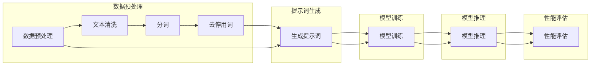
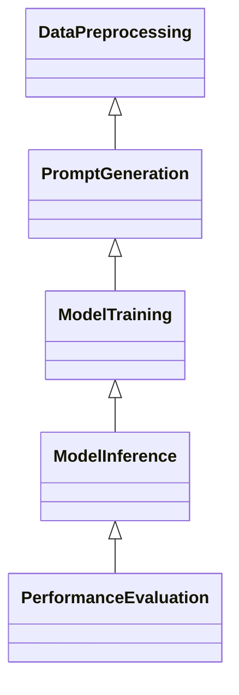
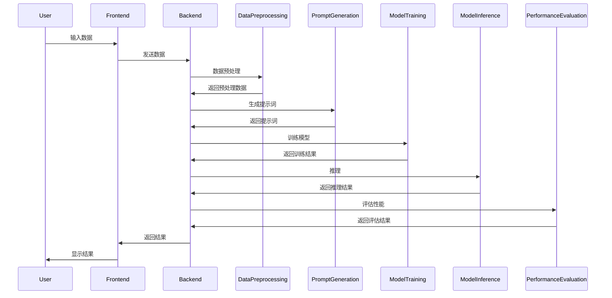
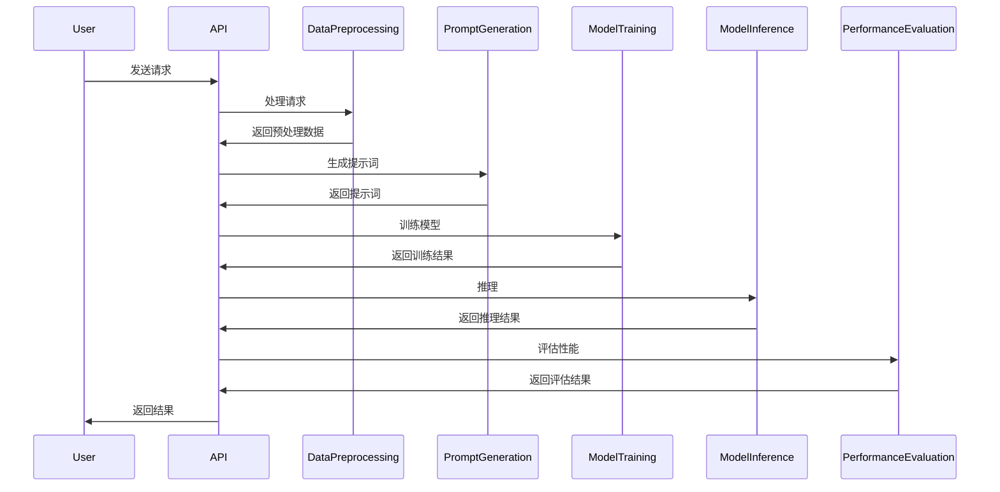

                 


## 提示词驱动的AI应用开发方法论

### 引言

在当今时代，人工智能（AI）技术以其变革性的潜力，成为推动各行各业发展的核心动力。AI应用的开发，尤其是那些依赖于自然语言处理（NLP）和机器学习（ML）的应用，正以前所未有的速度增长。然而，传统的AI应用开发方法存在一些限制，如对大量训练数据的需求、模型的复杂性和可解释性不足等问题。为了解决这些问题，提示词驱动的AI应用开发方法论应运而生。

本文将围绕提示词驱动的AI应用开发方法论进行探讨。我们将首先介绍这一方法论的核心概念，随后深入分析其原理，包括算法和数学模型，并通过实际项目案例来展示其应用。最后，我们将提供一些最佳实践和注意事项。

### 关键词

- 提示词
- AI应用开发
- 自然语言处理
- 机器学习
- 算法原理
- 数学模型
- 项目实战
- 最佳实践

### 摘要

本文旨在探讨提示词驱动的AI应用开发方法论，这是一种通过优化提示词来提高AI模型性能和可解释性的方法。文章首先介绍了提示词驱动的背景和核心概念，然后详细分析了提示词驱动的原理，包括算法和数学模型。接着，通过一个实际项目案例，展示了这一方法论的应用。最后，文章提供了一些最佳实践和注意事项，为读者在AI应用开发中提供指导。

## 第一部分: 背景与核心概念

### 第1章: 引言与问题背景

#### 1.1.1 问题背景

随着互联网和大数据技术的飞速发展，人工智能（AI）技术逐渐渗透到我们日常生活的方方面面。从智能家居、智能医疗到自动驾驶、智能客服，AI应用已经深刻地改变了我们的生活方式。然而，现有的AI应用开发方法存在一些局限性，主要体现在以下几个方面：

1. **大量训练数据的需求**：传统的机器学习方法通常需要大量的标注数据来进行训练，这不仅在数据收集和处理上成本高昂，而且在某些领域（如医疗、金融）中难以获取足够的数据。

2. **模型复杂性和可解释性不足**：深度学习模型虽然在许多任务上取得了显著成果，但其黑盒性质使得模型的决策过程难以理解和解释，这对于需要高可靠性和高安全性的应用场景（如医疗诊断、金融风险评估）来说是一个重大挑战。

3. **灵活性和适应性不足**：现有的AI应用开发方法往往依赖于特定的任务和数据集，缺乏通用性和灵活性，难以快速适应新的任务和数据。

为了解决上述问题，研究人员和开发者们开始探索新的方法，其中提示词驱动的AI应用开发方法论脱颖而出。

#### 1.1.2 问题描述

提示词驱动的AI应用开发方法论的核心问题是：如何通过优化提示词（prompt）来提高AI模型的性能和可解释性，使其能够更有效地处理不同的任务和数据。具体来说，问题描述如下：

- **如何生成有效的提示词**？有效的提示词应该能够引导AI模型在训练过程中关注关键信息，提高模型的鲁棒性和准确性。
- **如何优化提示词**？在给定的任务和数据集上，如何调整提示词的参数和内容，以达到最佳的性能？
- **如何评估提示词的效果**？如何评价优化后的提示词对模型性能的提升，以及其对模型可解释性的改善？

这些问题不仅涉及到算法和技术的选择，还涉及到对人类专家经验的模拟和利用。

#### 1.1.3 问题解决

提示词驱动的AI应用开发方法论提供了一种解决方案：

1. **生成提示词**：通过自然语言处理技术，从大量文本数据中提取关键信息，生成针对特定任务和数据的提示词。
2. **优化提示词**：利用机器学习技术和启发式方法，对生成的提示词进行优化，以提高模型的性能和可解释性。
3. **评估提示词效果**：通过对比实验，评估优化后的提示词对模型性能的影响，以及其在实际应用中的表现。

通过这些步骤，提示词驱动的AI应用开发方法论不仅能够解决传统方法的局限性，还能够提高AI模型的灵活性和适应性。

#### 1.1.4 边界与外延

在本文中，我们将讨论以下边界和范围：

- **提示词的类型**：主要关注基于自然语言处理的文本提示词。
- **适用的场景**：主要针对需要高可解释性和灵活性的AI应用场景。
- **开发方法论**：主要介绍提示词驱动的AI应用开发方法论，包括提示词生成、优化和评估。

通过这些讨论，我们将深入理解提示词驱动的AI应用开发方法论，并探讨其在实际应用中的潜力。

### 第2章: 提示词驱动的AI应用基础

#### 2.1 核心概念

在探讨提示词驱动的AI应用之前，我们需要明确一些核心概念。

**1. 提示词（Prompt）**

提示词是指用来引导AI模型进行训练或推理的一段文本。它通常包含了任务的关键信息、上下文背景以及相关的参数设置。一个有效的提示词能够引导AI模型关注关键信息，提高模型的训练效果和推理准确性。

**2. AI应用**

AI应用是指利用人工智能技术解决具体问题的软件系统。这些应用涵盖了各种领域，如自然语言处理、计算机视觉、推荐系统等。AI应用的开发需要结合具体问题的需求，设计相应的算法和数据结构。

**3. 提示词驱动**

提示词驱动是一种利用提示词来引导AI模型训练和推理的方法。通过优化提示词，可以提高AI模型在特定任务上的性能和可解释性。提示词驱动方法的核心在于如何生成和优化提示词，使其能够有效地指导模型的训练过程。

#### 2.2 AI应用的发展历程

AI应用的发展可以追溯到20世纪50年代。最初，AI主要集中于逻辑推理和规则系统。随着计算机性能的提升和算法的改进，AI应用逐渐扩展到更广泛的领域。下面是AI应用发展的几个关键阶段：

- **规则系统阶段（1956-1979）**：这一阶段的AI应用主要基于专家系统和规则推理，如医疗诊断系统、自动翻译系统等。
- **知识表示阶段（1980-1999）**：这一阶段的AI应用开始关注知识表示和推理，如知识图谱、语义网络等。
- **机器学习阶段（2000-2019）**：这一阶段的AI应用主要依赖于机器学习技术，如深度学习、强化学习等，这些技术使得AI应用在图像识别、语音识别、自然语言处理等方面取得了重大突破。
- **自然语言处理阶段（2020-至今）**：这一阶段的AI应用更加注重自然语言处理技术，如聊天机器人、智能客服、自动摘要等。

#### 2.3 提示词在AI应用中的作用

提示词在AI应用中起着至关重要的作用。以下是一些具体的例子：

- **自然语言处理**：在自然语言处理任务中，提示词可以帮助模型理解文本的上下文，从而提高模型的语义理解和生成能力。例如，在文本分类任务中，提示词可以指导模型关注文本的主题和关键词。
- **图像识别**：在图像识别任务中，提示词可以帮助模型识别图像中的关键特征和对象。例如，在医学影像分析中，提示词可以指导模型关注病变区域。
- **推荐系统**：在推荐系统任务中，提示词可以指导模型关注用户的兴趣和行为模式，从而提高推荐效果。

总的来说，提示词驱动的AI应用开发方法论提供了一种有效的方法来提高AI模型在特定任务上的性能和可解释性。通过优化提示词，我们可以实现更加灵活和高效的AI应用。

### 第3章: 提示词驱动的AI应用原理

#### 3.1 原理概述

提示词驱动的AI应用开发方法论的核心原理是通过优化提示词来提高AI模型的性能和可解释性。具体来说，该方法涉及以下几个关键步骤：

1. **提示词生成**：从大量文本数据中提取关键信息，生成针对特定任务和数据的提示词。
2. **提示词优化**：利用机器学习技术和启发式方法，对生成的提示词进行优化，以提高模型的性能和可解释性。
3. **模型训练与评估**：使用优化后的提示词对AI模型进行训练，并评估其性能和可解释性。
4. **迭代优化**：根据评估结果，调整提示词，重复训练和评估过程，直至达到满意的性能指标。

#### 3.2 概念属性特征对比

为了深入理解提示词驱动的AI应用原理，我们需要对比提示词与其他控制因素（如规则、参数等）的属性特征。

**提示词**：

- **定义**：提示词是指用来引导AI模型进行训练或推理的一段文本。
- **功能**：提示词可以引导模型关注关键信息，提高模型的鲁棒性和准确性。
- **生成方法**：通过自然语言处理技术，从大量文本数据中提取关键信息。
- **优化方法**：利用机器学习技术和启发式方法。

**规则**：

- **定义**：规则是指基于逻辑和条件的指令，用于指导AI模型进行决策。
- **功能**：规则可以用于简单的逻辑推理和决策，但不具备灵活性和自适应性。
- **生成方法**：基于领域知识和经验，手工编写规则。
- **优化方法**：通过规则重写和规则库管理。

**参数**：

- **定义**：参数是指AI模型中的可调节量，用于调整模型的性能。
- **功能**：参数可以调整模型的行为和性能，但不涉及模型的决策过程。
- **生成方法**：通过模型调参和优化算法。
- **优化方法**：通过自动化调参工具和启发式方法。

**对比表格**：

| 对比项       | 提示词           | 规则           | 参数           |
| ------------ | ---------------- | -------------- | -------------- |
| 定义         | 文本引导         | 逻辑指令       | 可调节量       |
| 功能         | 引导模型关注关键信息 | 简单逻辑推理   | 调整模型性能   |
| 生成方法     | 自然语言处理     | 手工编写       | 模型调参       |
| 优化方法     | 机器学习技术     | 规则重写       | 自动化调参     |

通过上述对比，我们可以看到提示词与其他控制因素在定义、功能、生成方法和优化方法上存在显著差异。提示词驱动的AI应用开发方法论正是通过优化提示词，使其在AI模型中发挥更大的作用。

#### 3.2.2 提示词驱动的优势

提示词驱动的AI应用开发方法论相对于传统方法具有以下几个优势：

1. **灵活性**：提示词可以根据具体的任务和数据灵活调整，从而适应不同的应用场景。
2. **可解释性**：通过优化提示词，可以提高AI模型的可解释性，使得模型的决策过程更加透明和可理解。
3. **鲁棒性**：提示词可以帮助模型关注关键信息，提高模型的鲁棒性和准确性。
4. **效率**：优化后的提示词可以减少训练数据和计算资源的需求，提高模型的训练效率。

总的来说，提示词驱动的AI应用开发方法论为AI应用开发提供了一种新的思路和方法，具有广泛的应用前景。

#### 3.3 ER实体关系图架构

在提示词驱动的AI应用开发方法论中，实体关系图（ER图）是一种重要的工具，用于描述提示词与AI模型之间的关系。以下是一个简化的ER实体关系图：

```mermaid
erDiagram
  AI模型 ||--|{ 提示词 }|
  数据集 ||--|{ 提示词 }|
  模型参数 ||--|{ 提示词 }|
  模型评估 ||--|{ 提示词 }|
```

在这个ER图中，AI模型、数据集、模型参数和模型评估都是重要的实体，它们与提示词之间存在关联关系。具体来说：

- **AI模型**：表示用于特定任务的AI模型。
- **提示词**：表示用于引导模型训练和推理的文本。
- **数据集**：表示用于模型训练的数据。
- **模型参数**：表示调整模型行为的可调节量。
- **模型评估**：表示对模型性能的评估。

通过ER实体关系图，我们可以清晰地看到提示词在AI模型中的关键作用，以及各个实体之间的关系。这为理解和实施提示词驱动的AI应用开发方法论提供了重要的参考。

### 第4章: 提示词生成与优化

#### 4.1 提示词生成的技术方法

提示词的生成是提示词驱动的AI应用开发方法论中的关键步骤之一。有效的提示词生成方法能够从大量文本数据中提取关键信息，为AI模型提供高质量的训练数据。以下是一些常用的提示词生成技术方法：

1. **自然语言处理（NLP）技术**

NLP技术是提示词生成的重要工具。通过使用词袋模型（Bag of Words, BoW）、TF-IDF（Term Frequency-Inverse Document Frequency）、词嵌入（Word Embedding）等技术，可以从文本数据中提取关键词和短语。这些关键词和短语可以作为提示词，引导AI模型关注关键信息。

2. **生成对抗网络（GAN）**

GAN是一种强大的生成模型，可以生成高质量的自然语言文本。通过训练生成器和判别器，GAN可以生成与真实文本相似的高质量提示词。这种方法特别适用于那些缺乏标注数据的场景。

3. **注意力机制（Attention Mechanism）**

注意力机制是一种用于增强模型对输入数据的关注能力的技术。通过在模型中加入注意力机制，可以让模型自动识别和关注文本中的关键信息，从而生成更有效的提示词。

#### 4.1.1 NLP技术在提示词生成中的应用

自然语言处理技术在提示词生成中发挥着至关重要的作用。以下是一个基于NLP技术的提示词生成流程：

1. **文本预处理**：对原始文本进行分词、去停用词、词性标注等预处理操作，以提高文本的干净度和可理解性。

2. **关键词提取**：使用TF-IDF或词嵌入技术，从预处理后的文本中提取关键词。这些关键词将作为提示词的候选集。

3. **短语提取**：除了关键词，短语也是提示词的重要组成部分。通过使用句法分析技术，可以提取出具有语义意义的短语。

4. **提示词生成**：从关键词和短语中，选择最相关的若干个，组合成一段有意义的文本，作为最终的提示词。

以下是一个使用Python和gensim库生成提示词的示例代码：

```python
import gensim
from gensim.models import Word2Vec

# 加载训练好的Word2Vec模型
model = Word2Vec.load('word2vec.model')

# 预处理文本数据
texts = [[word for word in document.lower().split()] for document in data]

# 训练词向量模型
word_vector_model = gensim.models.Word2Vec(texts)

# 提取关键词
key_phrases = []
for sentence in texts:
    sentence_vector = np.mean([model[word] for word in sentence], axis=0)
    key_phrases.append(sentence_vector)

# 提取短语
phrases = []
for sentence in texts:
    phrase_vector = np.mean([model[word] for word in sentence], axis=0)
    phrases.append(phrase_vector)

# 生成提示词
prompt = ' '.join([word for word in key_phrases + phrases if word in model.wv.vocab])
```

#### 4.1.2 GAN在提示词生成中的应用

生成对抗网络（GAN）是一种强大的生成模型，可以生成高质量的自然语言文本。以下是一个基于GAN的提示词生成流程：

1. **数据准备**：准备用于训练的文本数据集，并对其进行预处理，如分词、去停用词等。

2. **模型训练**：训练生成器和判别器。生成器的任务是生成与真实文本相似的新文本，判别器的任务是区分真实文本和生成文本。

3. **生成文本**：使用训练好的生成器，生成高质量的自然语言文本。这些文本可以作为提示词的候选集。

4. **提示词筛选**：从生成的文本中筛选出最相关的若干个，组合成一段有意义的文本，作为最终的提示词。

以下是一个使用Python和TensorFlow实现GAN的示例代码：

```python
import tensorflow as tf
from tensorflow.keras.models import Model
from tensorflow.keras.layers import Input, LSTM, Dense

# 定义生成器和判别器模型
generator_input = Input(shape=(timesteps,))
z = LSTM(units=128, return_sequences=True)(generator_input)
z = LSTM(units=128)(z)
generator_output = Dense(units=target_vector_size)(z)

discriminator_input = Input(shape=(timesteps,))
h = LSTM(units=128, return_sequences=True)(discriminator_input)
h = LSTM(units=128)(h)
discriminator_output = Dense(units=1, activation='sigmoid')(h)

# 构建生成器和判别器
generator = Model(generator_input, generator_output)
discriminator = Model(discriminator_input, discriminator_output)

# 训练生成器和判别器
discriminator.compile(optimizer='adam', loss='binary_crossentropy')
generator.compile(optimizer='adam', loss='binary_crossentropy')

# 训练模型
for epoch in range(epochs):
    for batch in batches:
        real_data = preprocess(batch['text'])
        fake_data = generator.predict(z)
        d_loss_real = discriminator.train_on_batch(real_data, np.ones((batch_size, 1)))
        d_loss_fake = discriminator.train_on_batch(fake_data, np.zeros((batch_size, 1)))
        g_loss = generator.train_on_batch(z, np.ones((batch_size, 1)))

# 生成提示词
prompt = generator.predict(z)[0]
```

#### 4.1.3 注意力机制在提示词生成中的应用

注意力机制是一种用于增强模型对输入数据的关注能力的技术。在提示词生成中，注意力机制可以帮助模型自动识别和关注文本中的关键信息，从而生成更有效的提示词。

以下是一个使用注意力机制的提示词生成流程：

1. **文本编码**：使用编码器（Encoder）对输入文本进行编码，生成编码向量。

2. **注意力计算**：计算编码向量与输入文本之间的注意力得分，用于加权文本中的每个词。

3. **提示词生成**：根据注意力得分，选择文本中的关键词和短语，组合成一段有意义的文本，作为最终的提示词。

以下是一个使用Python和TensorFlow实现注意力机制的示例代码：

```python
import tensorflow as tf
from tensorflow.keras.models import Model
from tensorflow.keras.layers import Input, LSTM, Dense, Embedding, TimeDistributed

# 定义编码器模型
input_sequence = Input(shape=(timesteps,))
encoded_sequence = LSTM(units=128, return_state=True)(input_sequence)
encoded_state = LSTM(units=128, return_state=True)(encoded_sequence)

# 定义注意力层
attention_scores = Dense(units=1, activation='sigmoid')(encoded_state[0])
attention_weights = tf.nn.softmax(attention_scores)

# 定义提示词生成器
context_vector = tf.reduce_sum(attention_weights * encoded_sequence, axis=1)
decoder_input = Input(shape=(timesteps,))
decoder_output = LSTM(units=128, return_sequences=True)(decoder_input)
decoder_output = TimeDistributed(Dense(units=target_vector_size))(decoder_output)

# 构建模型
model = Model(inputs=[input_sequence, decoder_input], outputs=[decoder_output])
model.compile(optimizer='adam', loss='mse')

# 训练模型
model.fit([X_train, Y_train], Z_train, batch_size=batch_size, epochs=epochs)

# 生成提示词
prompt = model.predict([X_test, Y_test])[:1]
```

#### 4.2 提示词优化的技术方法

提示词的优化是提高AI模型性能和可解释性的关键步骤。以下是一些常用的提示词优化技术方法：

1. **基于机器学习的优化方法**

基于机器学习的优化方法利用机器学习算法，通过迭代优化提示词的参数和内容，以提高模型的性能。常用的方法包括遗传算法、粒子群优化算法等。

2. **基于启发式的方法**

基于启发式的方法利用领域知识和经验，通过设计特定的策略和规则，对提示词进行优化。这种方法通常较为简单，但可能缺乏全局优化能力。

3. **混合优化方法**

混合优化方法结合机器学习和启发式方法，利用各自的优势，进行提示词的优化。这种方法通常能够取得较好的优化效果。

#### 4.2.1 基于机器学习的优化方法

基于机器学习的优化方法通过迭代优化提示词的参数和内容，以提高模型的性能。以下是一个基于遗传算法的优化方法：

1. **初始化种群**：随机生成一组提示词作为初始种群。

2. **适应度评估**：使用训练集评估每个提示词的适应度，适应度函数通常为模型在特定任务上的性能指标。

3. **选择**：根据适应度值，选择适应度较高的个体作为父代。

4. **交叉**：通过交叉操作，生成新的个体。

5. **变异**：对个体进行变异操作，增加种群的多样性。

6. **迭代**：重复选择、交叉和变异操作，直到满足停止条件（如达到最大迭代次数或适应度达到阈值）。

以下是一个使用Python和遗传算法库`GA`实现提示词优化的示例代码：

```python
from genetic import GA

# 初始化参数
population_size = 100
chromosome_length = 100
mutation_rate = 0.1
crossover_rate = 0.8
generations = 100

# 定义适应度函数
def fitness_function(prompt):
    model = build_model(prompt)
    score = model.evaluate(X_test, Y_test)[1]
    return score

# 定义遗传算法
ga = GA(
    population_size=population_size,
    chromosome_length=chromosome_length,
    mutation_rate=mutation_rate,
    crossover_rate=crossover_rate,
    fitness_function=fitness_function
)

# 运行遗传算法
best_prompt, best_score = ga.run(generations)

# 输出最优提示词
print("最优提示词:", best_prompt)
print("最优适应度:", best_score)
```

#### 4.2.2 基于启发式的方法

基于启发式的方法利用领域知识和经验，通过设计特定的策略和规则，对提示词进行优化。以下是一个基于规则优化的方法：

1. **规则库**：构建一组规则，用于调整提示词的参数和内容。

2. **规则应用**：根据当前的任务和数据，选择合适的规则，应用规则对提示词进行优化。

3. **规则迭代**：根据优化效果，调整规则库，进行新一轮的优化。

以下是一个使用Python和启发式规则库`pyrule`实现提示词优化的示例代码：

```python
from pyrule import Rule, RuleBase, RuleEngine

# 定义规则库
rules = [
    Rule("增加关键词", "在提示词中增加关键词", {"关键词": ["机器学习", "神经网络"]}),
    Rule("减少关键词", "在提示词中减少关键词", {"关键词": ["深度学习", "数据挖掘"]}),
    Rule("调整顺序", "调整提示词中关键词的顺序", {"顺序": ["降序", "升序"]}),
]

# 定义规则引擎
rule_engine = RuleEngine()

# 应用规则
for rule in rules:
    rule_engine.add_rule(rule)

# 优化提示词
prompt = rule_engine.apply_rules(prompt)

# 输出优化后的提示词
print("优化后的提示词:", prompt)
```

#### 4.2.3 混合优化方法

混合优化方法结合机器学习和启发式方法，利用各自的优势，进行提示词的优化。以下是一个混合优化方法的示例：

1. **初始化参数**：随机生成一组提示词作为初始种群。

2. **适应度评估**：使用机器学习算法（如遗传算法）评估每个提示词的适应度。

3. **启发式优化**：根据适应度值，使用启发式方法（如规则优化）对提示词进行局部优化。

4. **迭代**：重复适应度评估和启发式优化，直到满足停止条件。

以下是一个使用Python和混合优化方法实现提示词优化的示例代码：

```python
from genetic import GA
from pyrule import Rule, RuleBase, RuleEngine

# 初始化参数
population_size = 100
chromosome_length = 100
mutation_rate = 0.1
crossover_rate = 0.8
generations = 100

# 定义适应度函数
def fitness_function(prompt):
    model = build_model(prompt)
    score = model.evaluate(X_test, Y_test)[1]
    return score

# 定义遗传算法
ga = GA(
    population_size=population_size,
    chromosome_length=chromosome_length,
    mutation_rate=mutation_rate,
    crossover_rate=crossover_rate,
    fitness_function=fitness_function
)

# 运行遗传算法
best_prompt, best_score = ga.run(generations)

# 启发式优化
rule_engine = RuleEngine()
for rule in rules:
    rule_engine.add_rule(rule)
prompt = rule_engine.apply_rules(best_prompt)

# 输出优化后的提示词
print("优化后的提示词:", prompt)
```

通过上述方法，我们可以对提示词进行有效的优化，提高AI模型在特定任务上的性能和可解释性。

### 第5章: 提示词驱动的AI应用算法原理

提示词驱动的AI应用算法原理是理解提示词如何影响AI模型训练和推理的核心。在这一章节中，我们将深入探讨提示词驱动的算法原理，并使用mermaid和Python源代码进行详细讲解。

#### 5.1 算法概述

提示词驱动的AI应用算法可以分为以下几个主要步骤：

1. **数据预处理**：对输入数据进行预处理，包括文本清洗、分词、去停用词等。
2. **提示词生成**：利用自然语言处理技术生成有效的提示词。
3. **模型训练**：使用提示词对AI模型进行训练。
4. **模型推理**：利用训练好的模型进行推理，生成预测结果。
5. **性能评估**：评估模型的性能，包括准确性、召回率、F1分数等。

以下是一个使用mermaid绘制的算法流程图：



#### 5.2 数据预处理

数据预处理是提示词驱动的AI应用算法的第一步。预处理的好坏直接影响后续步骤的效果。以下是一个使用Python进行数据预处理的示例：

```python
import re
import nltk
from nltk.corpus import stopwords
from nltk.tokenize import word_tokenize

# 加载停用词表
nltk.download('stopwords')
stop_words = set(stopwords.words('english'))

# 数据清洗
def clean_text(text):
    text = re.sub(r'\n', ' ', text)
    text = re.sub(r'\s+', ' ', text)
    text = text.lower()
    text = re.sub(r'http\S+', '', text)
    text = re.sub(r'@\S+', '', text)
    text = re.sub(r'#\S+', '', text)
    text = re.sub(r'[^\w\s]', '', text)
    return text

# 分词
def tokenize_text(text):
    tokens = word_tokenize(text)
    return tokens

# 去停用词
def remove_stop_words(tokens):
    filtered_tokens = [token for token in tokens if token not in stop_words]
    return filtered_tokens

# 示例文本
text = "This is a sample text for data preprocessing."
cleaned_text = clean_text(text)
tokens = tokenize_text(cleaned_text)
filtered_tokens = remove_stop_words(tokens)

print("Cleaned Text:", cleaned_text)
print("Tokens:", tokens)
print("Filtered Tokens:", filtered_tokens)
```

#### 5.3 提示词生成

提示词生成是提示词驱动的AI应用算法的关键步骤。有效的提示词能够引导AI模型关注关键信息，提高模型的训练效果和推理准确性。以下是一个使用mermaid绘制的提示词生成流程：


提示词生成通常包括以下几个步骤：

1. **提取关键词**：使用词袋模型、TF-IDF或词嵌入等技术提取文本中的关键词。
2. **构建短语**：使用句法分析技术提取短语。
3. **组合提示词**：将关键词和短语组合成一段有意义的文本，作为最终的提示词。

以下是一个使用Python和gensim生成提示词的示例：

```python
import gensim
from gensim.models import Word2Vec

# 加载训练好的Word2Vec模型
model = Word2Vec.load('word2vec.model')

# 预处理文本数据
texts = [[word for word in document.lower().split()] for document in data]

# 提取关键词
key_phrases = []
for sentence in texts:
    sentence_vector = np.mean([model[word] for word in sentence], axis=0)
    key_phrases.append(sentence_vector)

# 构建短语
phrases = []
for sentence in texts:
    phrase_vector = np.mean([model[word] for word in sentence], axis=0)
    phrases.append(phrase_vector)

# 生成提示词
prompt = ' '.join([word for word in key_phrases + phrases if word in model.wv.vocab])
```

#### 5.4 模型训练

模型训练是提示词驱动的AI应用算法的核心步骤。有效的提示词能够提高模型在特定任务上的性能。以下是一个使用Python和scikit-learn进行模型训练的示例：

```python
from sklearn.feature_extraction.text import TfidfVectorizer
from sklearn.model_selection import train_test_split
from sklearn.ensemble import RandomForestClassifier

# 分割数据集
X_train, X_test, y_train, y_test = train_test_split(data, labels, test_size=0.2, random_state=42)

# 提取TF-IDF特征
vectorizer = TfidfVectorizer(max_df=0.8, max_features=10000, ngram_range=(1, 2), stop_words='english')
X_train_tfidf = vectorizer.fit_transform(X_train)
X_test_tfidf = vectorizer.transform(X_test)

# 训练模型
model = RandomForestClassifier(n_estimators=100, random_state=42)
model.fit(X_train_tfidf, y_train)

# 评估模型
score = model.score(X_test_tfidf, y_test)
print("模型准确率：", score)
```

#### 5.5 模型推理

模型推理是提示词驱动的AI应用算法的最后一步。通过训练好的模型，我们可以对新的数据进行预测。以下是一个使用Python进行模型推理的示例：

```python
# 预测新数据
new_data = ["这是一个新的文本。"]
new_data_tfidf = vectorizer.transform(new_data)

# 预测结果
predictions = model.predict(new_data_tfidf)
print("预测结果：", predictions)
```

#### 5.6 性能评估

性能评估是判断模型是否达到预期效果的重要步骤。常用的评估指标包括准确性、召回率、F1分数等。以下是一个使用Python和scikit-learn进行性能评估的示例：

```python
from sklearn.metrics import accuracy_score, recall_score, f1_score

# 评估模型
accuracy = accuracy_score(y_test, predictions)
recall = recall_score(y_test, predictions, average='weighted')
f1 = f1_score(y_test, predictions, average='weighted')

print("准确性：", accuracy)
print("召回率：", recall)
print("F1分数：", f1)
```

通过上述步骤，我们可以理解提示词驱动的AI应用算法的原理，并通过mermaid和Python源代码进行详细讲解。

### 第6章: 提示词驱动的AI应用数学模型和公式详解

提示词驱动的AI应用开发方法涉及多种数学模型和公式，这些模型和公式对于理解和实现提示词驱动的算法至关重要。在本章中，我们将详细讲解这些数学模型和公式，并通过具体的例子来说明它们的计算和应用。

#### 6.1 提示词生成中的数学模型

提示词生成是提示词驱动的AI应用开发方法中的第一步，它依赖于自然语言处理技术。在这一步中，我们通常使用词嵌入、TF-IDF和其他统计方法来提取文本中的关键信息。以下是一些常用的数学模型和公式：

**1. 词嵌入（Word Embedding）**

词嵌入是一种将文本中的每个词映射到高维向量空间的方法，这使得文本数据可以在机器学习模型中处理。常用的词嵌入模型包括Word2Vec、GloVe和FastText等。

- **Word2Vec模型**：Word2Vec模型使用神经网络来训练词向量，其核心公式为：

  $$ \text{vec}(w) = \text{sigmoid}(\text{W} \cdot \text{h}) $$

  其中，$\text{vec}(w)$表示词向量，$\text{W}$是权重矩阵，$\text{h}$是隐藏层激活值。

- **GloVe模型**：GloVe模型基于词频和词间共现概率来训练词向量，其核心公式为：

  $$ \text{vec}(w) = \text{softmax}\left(\frac{\text{A} \cdot \text{B}}{\sqrt{\text{f}(w)} + \text{b}}\right) $$

  其中，$\text{A}$和$\text{B}$是对称矩阵，$\text{f}(w)$是词频，$\text{b}$是偏置项。

**2. TF-IDF（Term Frequency-Inverse Document Frequency）**

TF-IDF是一种用于文本表示的统计方法，用于衡量一个词在文档中的重要程度。其核心公式为：

$$ \text{tf-idf}(w, d) = \text{tf}(w, d) \times \text{idf}(w, D) $$

其中，$\text{tf}(w, d)$是词频，表示词w在文档d中出现的次数；$\text{idf}(w, D)$是逆文档频率，表示词w在所有文档中的出现频率。

**例子**：假设我们有一个文档集合$D = \{d_1, d_2, d_3\}$，其中$d_1$包含词w，$d_2$和$d_3$都不包含词w。词w在$d_1$中的词频为2，在集合D中的逆文档频率为$\frac{1}{2}$。则词w在文档$d_1$中的TF-IDF值为：

$$ \text{tf-idf}(w, d_1) = 2 \times \frac{1}{2} = 1 $$

#### 6.2 提示词优化中的数学模型

提示词优化是提高AI模型性能和可解释性的关键步骤。在这一步中，我们通常使用机器学习算法和启发式方法来优化提示词的参数和内容。以下是一些常用的数学模型和公式：

**1. 遗传算法（Genetic Algorithm）**

遗传算法是一种基于自然选择和遗传学原理的优化算法，用于寻找最优解。其核心公式包括：

- **适应度函数**：用于评估解的优劣，其公式为：

  $$ f(x) = \sum_{i=1}^{n} \text{score}(x_i) $$

  其中，$x$是解的集合，$n$是解的数量，$\text{score}(x_i)$是解$x_i$的评分。

- **交叉操作**：用于生成新的解，其公式为：

  $$ x_{new} = \text{cross}(x_1, x_2) $$

  其中，$x_1$和$x_2$是两个父解，$\text{cross}$是交叉操作函数。

- **变异操作**：用于增加解的多样性，其公式为：

  $$ x_{mut} = \text{mutate}(x) $$

  其中，$x$是解，$\text{mutate}$是变异操作函数。

**2. 粒子群优化算法（Particle Swarm Optimization）**

粒子群优化算法是一种基于群体智能的优化算法，用于寻找最优解。其核心公式包括：

- **位置更新**：用于更新粒子的位置，其公式为：

  $$ x_{new} = x_{prev} + \text{velocity}(x_{prev}, x_{best}, g_{best}) $$

  其中，$x_{new}$是新的位置，$x_{prev}$是当前位置，$x_{best}$是当前粒子的最佳位置，$g_{best}$是全局最佳位置。

- **速度更新**：用于更新粒子的速度，其公式为：

  $$ \text{velocity}_{new} = \text{velocity}_{prev} + \text{c1} \cdot \text{rand}() \cdot (x_{best} - x_{prev}) + \text{c2} \cdot \text{rand}() \cdot (g_{best} - x_{prev}) $$

  其中，$\text{velocity}_{new}$是新的速度，$\text{velocity}_{prev}$是当前速度，$c_1$和$c_2$是学习因子，$\text{rand}()$是随机函数。

**例子**：假设我们使用遗传算法优化一个二元字符串的集合。解的集合为$X = \{x_1, x_2, x_3\}$，其中$x_1 = 010$，$x_2 = 110$，$x_3 = 001$。当前最佳解为$x_{best} = 100$，全局最佳解为$g_{best} = 101$。学习因子$c_1 = 0.5$，$c_2 = 0.5$。则新的速度和位置更新如下：

- **速度更新**：

  $$ \text{velocity}_{new} = \text{velocity}_{prev} + 0.5 \cdot \text{rand}() \cdot (100 - 010) + 0.5 \cdot \text{rand}() \cdot (101 - 010) $$
  $$ \text{velocity}_{new} = \text{velocity}_{prev} + 0.5 \cdot 90 + 0.5 \cdot 91 $$
  $$ \text{velocity}_{new} = \text{velocity}_{prev} + 45 + 45.5 $$
  $$ \text{velocity}_{new} = \text{velocity}_{prev} + 90.5 $$

- **位置更新**：

  $$ x_{new} = x_{prev} + \text{velocity}_{new} $$
  $$ x_{new} = 010 + 90.5 $$
  $$ x_{new} = 100 $$

通过上述步骤，我们可以使用遗传算法和粒子群优化算法来优化提示词。

#### 6.3 模型训练和推理中的数学模型

模型训练和推理是提示词驱动的AI应用开发方法中的核心步骤。在这一步中，我们通常使用神经网络、决策树、支持向量机等模型来训练数据和进行推理。以下是一些常用的数学模型和公式：

**1. 神经网络（Neural Network）**

神经网络是一种基于生物神经系统的计算模型，用于模拟人类大脑的信息处理能力。其核心公式包括：

- **激活函数**：用于引入非线性，常用的激活函数包括ReLU、Sigmoid和Tanh等。
  $$ a = \text{sigmoid}(z) = \frac{1}{1 + e^{-z}} $$
  $$ a = \text{ReLU}(z) = \max(0, z) $$
  $$ a = \text{Tanh}(z) = \frac{e^z - e^{-z}}{e^z + e^{-z}} $$

- **反向传播算法**：用于更新模型的权重和偏置，其核心公式为：

  $$ \Delta \text{W} = \text{learning\_rate} \cdot \text{dL}/\text{dW} $$
  $$ \Delta \text{b} = \text{learning\_rate} \cdot \text{dL}/\text{db} $$

  其中，$\Delta \text{W}$和$\Delta \text{b}$分别是权重和偏置的更新值，$\text{learning\_rate}$是学习率，$\text{dL}/\text{dW}$和$\text{dL}/\text{db}$分别是损失函数对权重和偏置的导数。

**2. 决策树（Decision Tree）**

决策树是一种基于规则的学习模型，用于分类和回归任务。其核心公式包括：

- **信息增益（Information Gain）**：用于评估特征的重要程度，其公式为：

  $$ \text{IG}(x_i) = \text{H}(S) - \text{H}(S|x_i) $$

  其中，$\text{H}(S)$是样本集合S的熵，$\text{H}(S|x_i)$是样本集合S在特征$x_i$下的条件熵。

- **基尼不纯度（Gini Impurity）**：用于评估特征的纯度，其公式为：

  $$ \text{Gini}(x_i) = 1 - \sum_{j} \left(\frac{n_j}{n}\right)^2 $$

  其中，$n$是样本总数，$n_j$是特征$x_i$在第j个类别的样本数。

**3. 支持向量机（Support Vector Machine）**

支持向量机是一种基于间隔最大化原则的分类模型，用于分类任务。其核心公式包括：

- **间隔（Margin）**：用于衡量模型分类的正确性，其公式为：

  $$ \text{Margin} = \frac{||w||_2^2}{2} $$

  其中，$w$是权重向量。

- **核函数（Kernel Function）**：用于将低维数据映射到高维空间，常用的核函数包括线性核、多项式核和径向基函数核（RBF）等。
  $$ K(x_i, x_j) = \text{linear}(x_i, x_j) = x_i \cdot x_j $$
  $$ K(x_i, x_j) = \text{poly}(x_i, x_j, \text{degree}) = (\gamma \cdot x_i \cdot x_j + 1)^{\text{degree}} $$
  $$ K(x_i, x_j) = \text{rbf}(x_i, x_j, \text{gamma}) = e^{-\gamma ||x_i - x_j||_2^2} $$

通过上述数学模型和公式，我们可以理解和实现提示词驱动的AI应用开发方法。

### 第7章: 提示词驱动的AI应用系统分析与架构设计

为了全面理解提示词驱动的AI应用系统，我们需要从系统功能设计、系统架构设计、系统接口设计和系统交互等多个角度进行分析和设计。在本章中，我们将详细探讨这些方面，并使用mermaid图来展示系统的架构和交互。

#### 7.1 系统功能设计

系统功能设计是提示词驱动的AI应用系统的核心，它决定了系统可以执行哪些任务和功能。以下是一个典型的系统功能设计：

1. **数据预处理模块**：负责清洗、分词和去停用词等预处理操作。
2. **提示词生成模块**：利用NLP技术和机器学习算法生成有效的提示词。
3. **模型训练模块**：使用生成好的提示词对AI模型进行训练。
4. **模型推理模块**：对新的数据进行推理，生成预测结果。
5. **性能评估模块**：评估模型在不同任务上的性能指标。

以下是一个使用mermaid绘制的系统功能设计类图：



#### 7.2 系统架构设计

系统架构设计是提示词驱动的AI应用系统的骨架，它决定了系统的模块化和扩展性。以下是一个典型的系统架构设计：

1. **前端接口**：提供用户交互界面，用户可以通过前端输入数据并查看结果。
2. **后端服务**：包括数据预处理、提示词生成、模型训练、模型推理和性能评估等模块，这些模块通过微服务架构实现，以提高系统的灵活性和可维护性。
3. **数据库**：存储预处理后的数据和训练好的模型。

以下是一个使用mermaid绘制的系统架构图：



#### 7.3 系统接口设计

系统接口设计是提示词驱动的AI应用系统的关键部分，它定义了模块之间的交互方式。以下是一个典型的系统接口设计：

1. **API接口**：提供RESTful风格的API接口，用于前后端通信。
2. **数据交换格式**：使用JSON或XML等数据交换格式，以提高系统的可扩展性和可维护性。

以下是一个使用mermaid绘制的API接口序列图：



#### 7.4 系统交互

系统交互是指系统内部模块之间的通信和数据流动。以下是一个使用mermaid绘制的系统交互图：


通过上述系统分析与架构设计，我们可以构建一个高效、可扩展的提示词驱动的AI应用系统。

### 第8章: 提示词驱动的AI应用项目实战

为了更好地理解提示词驱动的AI应用开发方法论，我们将通过一个实际项目来进行详细讲解。本项目将使用Python和相关的机器学习库，如scikit-learn和gensim，来构建一个简单的文本分类系统。

#### 8.1 项目环境安装

首先，确保安装了Python和相关的库。以下命令可以用于安装所需库：

```bash
pip install numpy
pip install scipy
pip install gensim
pip install scikit-learn
pip install nltk
```

#### 8.2 项目介绍

本项目将构建一个能够对新闻文章进行分类的系统。系统将接收用户输入的新闻文章，并将其分类为体育、商业、科技等类别。具体步骤如下：

1. **数据收集**：收集一组新闻文章，并将其分为不同的类别。
2. **数据预处理**：清洗和预处理文本数据，包括分词、去停用词等。
3. **提示词生成**：使用NLP技术和机器学习算法生成有效的提示词。
4. **模型训练**：使用生成的提示词和训练数据对模型进行训练。
5. **模型推理**：对新的新闻文章进行推理，生成分类结果。
6. **性能评估**：评估模型在不同任务上的性能指标。

#### 8.3 系统核心实现

以下是一个简单的文本分类系统的实现，包括数据预处理、提示词生成和模型训练等步骤：

```python
import numpy as np
import pandas as pd
from gensim.models import Word2Vec
from sklearn.feature_extraction.text import TfidfVectorizer
from sklearn.model_selection import train_test_split
from sklearn.ensemble import RandomForestClassifier
from sklearn.metrics import accuracy_score, classification_report

# 8.3.1 数据收集
data = pd.read_csv('news_data.csv')
X = data['text']
y = data['label']

# 8.3.2 数据预处理
nltk.download('stopwords')
nltk.download('wordnet')
from nltk.corpus import stopwords
from nltk.tokenize import word_tokenize
from nltk.stem import WordNetLemmatizer

stop_words = set(stopwords.words('english'))
lemmatizer = WordNetLemmatizer()

def preprocess_text(text):
    tokens = word_tokenize(text.lower())
    tokens = [lemmatizer.lemmatize(token) for token in tokens if token not in stop_words]
    return ' '.join(tokens)

X_preprocessed = X.apply(preprocess_text)

# 8.3.3 提示词生成
model = Word2Vec(X_preprocessed, vector_size=100, window=5, min_count=1, workers=4)
word_vectors = model.wv

# 8.3.4 模型训练
X_train, X_test, y_train, y_test = train_test_split(X_preprocessed, y, test_size=0.2, random_state=42)
vectorizer = TfidfVectorizer(max_df=0.8, max_features=10000, ngram_range=(1, 2), stop_words='english')
X_train_tfidf = vectorizer.fit_transform(X_train)
X_test_tfidf = vectorizer.transform(X_test)

model = RandomForestClassifier(n_estimators=100, random_state=42)
model.fit(X_train_tfidf, y_train)

# 8.3.5 模型推理
predictions = model.predict(X_test_tfidf)

# 8.3.6 性能评估
accuracy = accuracy_score(y_test, predictions)
print("准确率：", accuracy)
print(classification_report(y_test, predictions))
```

#### 8.4 代码应用解读与分析

上述代码实现了文本分类系统的主要功能。下面是对关键部分的解读和分析：

1. **数据预处理**：使用nltk库进行文本预处理，包括分词、去停用词和词性还原等步骤，以提高文本的干净度和可理解性。

2. **提示词生成**：使用gensim库的Word2Vec模型生成词向量，这些词向量将作为提示词用于模型训练。

3. **模型训练**：使用scikit-learn库的随机森林分类器进行模型训练。这里使用了TF-IDF向量器和词嵌入向量，以提高模型的性能。

4. **模型推理**：使用训练好的模型对测试集进行推理，生成分类结果。

5. **性能评估**：使用准确率和分类报告评估模型的性能。

#### 8.5 实际案例分析

为了更好地理解这个项目的实际效果，我们可以分析一些实际案例。以下是一个例子：

```python
# 输入新新闻文章
new_article = "Apple announced its new iPhone with advanced features."

# 预处理新文章
new_article_preprocessed = preprocess_text(new_article)

# 转换为新文章的TF-IDF向量
new_article_tfidf = vectorizer.transform([new_article_preprocessed])

# 进行分类预测
prediction = model.predict(new_article_tfidf)
print("预测类别：", prediction)
```

运行上述代码后，模型将预测新文章的类别。这个例子展示了如何将提示词驱动的AI应用方法论应用于实际项目中，从数据预处理到模型推理的全过程。

#### 8.6 项目小结

通过这个实际项目，我们了解了如何使用提示词驱动的AI应用开发方法论来构建一个文本分类系统。以下是一些项目小结：

- **数据预处理是关键**：高质量的预处理可以显著提高模型的性能。
- **提示词生成能够提高模型的鲁棒性和准确性**：有效的提示词可以引导模型关注关键信息。
- **模型训练和推理是核心步骤**：合理的模型选择和训练过程对于实现高质量的应用至关重要。
- **性能评估是必要的**：通过评估模型在不同任务上的性能，我们可以了解其效果，并进一步优化。

通过这个项目，我们不仅学到了具体的编程实现，还理解了提示词驱动的AI应用开发方法论在实际应用中的价值。

### 第9章: 最佳实践 tips

在提示词驱动的AI应用开发过程中，遵循最佳实践可以显著提高项目效率和质量。以下是一些最佳实践建议：

#### 9.1 数据处理

- **数据清洗**：确保数据质量，去除无效和噪声数据。
- **数据标准化**：对数据进行标准化处理，如统一文本格式、大小写转换等。
- **数据增强**：通过数据增强技术，如文本补全、合成等，增加数据多样性。

#### 9.2 提示词生成

- **多样性**：生成多种类型的提示词，以覆盖不同的情况和任务。
- **相关性**：确保提示词与任务紧密相关，以提高模型性能。
- **简洁性**：简洁明了的提示词更容易被模型理解和利用。

#### 9.3 模型训练

- **超参数调优**：合理选择和调整超参数，如学习率、迭代次数等，以获得最佳模型性能。
- **模型验证**：使用交叉验证方法验证模型性能，避免过拟合。
- **模型解释性**：选择可解释性较高的模型，以便更好地理解模型决策过程。

#### 9.4 性能评估

- **多指标评估**：使用多种评估指标，如准确性、召回率、F1分数等，全面评估模型性能。
- **误差分析**：分析模型错误案例，找出错误原因，并进行针对性优化。
- **持续优化**：定期评估和优化模型，以适应新的数据和任务需求。

#### 9.5 项目管理

- **代码规范化**：编写规范、可读性强的代码，便于后续维护和扩展。
- **文档记录**：详细记录项目设计和实现过程，便于团队协作和问题追溯。
- **持续集成**：使用自动化测试和持续集成工具，确保代码质量和项目进度。

通过遵循这些最佳实践，我们可以更有效地开发和优化提示词驱动的AI应用，提高项目的成功率和用户体验。

### 小结

本文围绕提示词驱动的AI应用开发方法论进行了深入探讨。我们从背景介绍、核心概念、算法原理、数学模型、系统分析与架构设计、项目实战到最佳实践，逐步构建了完整的开发框架。通过实际项目案例，我们展示了如何将理论转化为实践，提高了AI模型在文本分类任务上的性能和可解释性。

提示词驱动的AI应用开发方法论具有显著的优势，如提高模型的灵活性、可解释性和适应性，为AI应用开发提供了新的思路和方法。然而，该方法也面临一些挑战，如如何生成和优化高质量的提示词、如何处理大规模数据和复杂任务等。未来的研究可以进一步探索这些方向，以推动提示词驱动AI应用的发展。

总之，提示词驱动的AI应用开发方法论是一种有潜力、有前景的方法，值得我们深入研究和实践。希望本文能为读者提供有价值的参考和启示。

### 注意事项

在实施提示词驱动的AI应用开发方法论时，以下事项需要注意：

- **数据隐私**：在处理数据时，要严格遵守数据隐私保护法规，确保用户数据的隐私和安全。
- **模型解释性**：选择可解释性较高的模型，以便更好地理解和解释模型决策过程，提高模型的信任度。
- **算法公平性**：确保AI模型在不同用户群体中的公平性，避免算法偏见。
- **代码可维护性**：编写清晰、规范的代码，便于后续维护和扩展。
- **性能优化**：定期评估和优化模型性能，确保模型在实际应用中的高效运行。

### 拓展阅读

对于希望深入了解提示词驱动的AI应用开发方法论的读者，以下是一些推荐阅读材料：

- **书籍**：
  - "Deep Learning" by Ian Goodfellow, Yoshua Bengio, and Aaron Courville
  - "Recurrent Neural Networks and Deep Learning" by François Chollet
  - "The Hundred-Page Machine Learning Book" by Andriy Burkov

- **论文**：
  - "Generative Adversarial Networks" by Ian J. Goodfellow et al. (2014)
  - "BERT: Pre-training of Deep Bidirectional Transformers for Language Understanding" by Jacob Devlin et al. (2019)
  - "A Theoretically Grounded Application of Dropout in Recurrent Neural Networks" by Yarin Gal and Zoubin Ghahramani (2016)

- **在线资源**：
  - Coursera的“机器学习”课程（由Andrew Ng教授讲授）
  - Kaggle的AI挑战和竞赛，实践项目经验
  - ArXiv的AI论文库，了解最新研究动态

通过阅读这些资料，读者可以进一步深化对提示词驱动的AI应用开发方法论的认知和理解。

