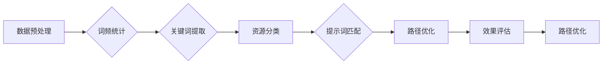
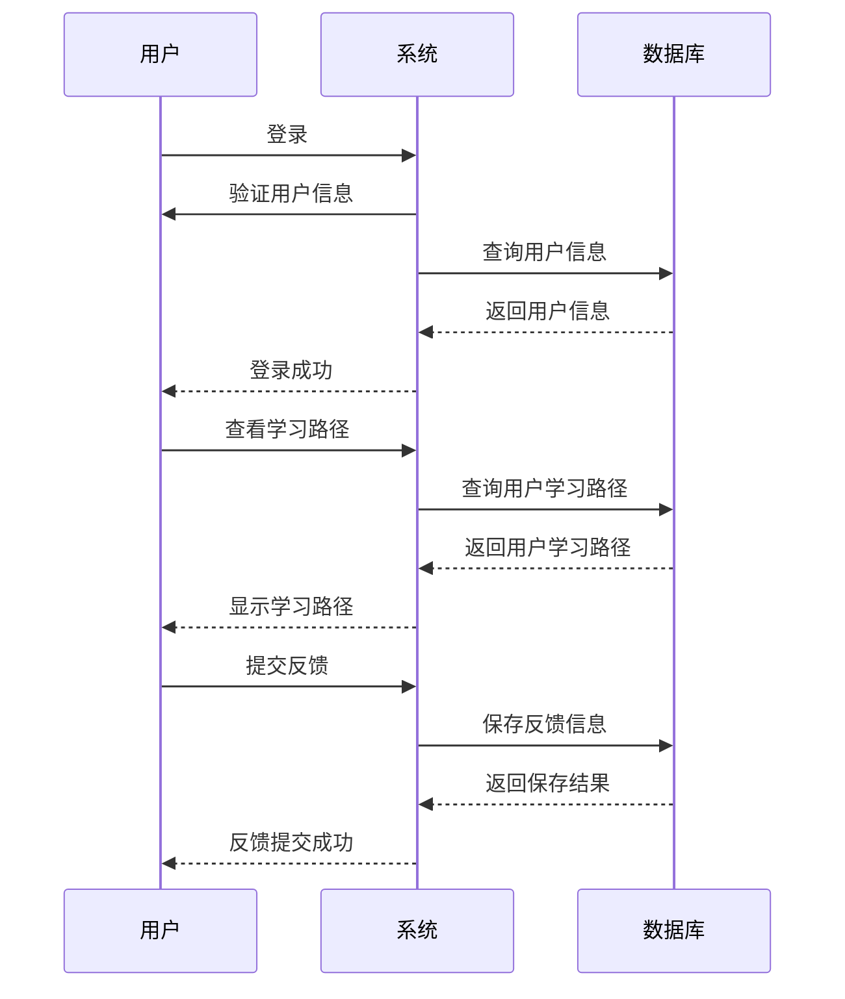

                 

### 《提示词驱动的个性化学习路径规划》

关键词：提示词、个性化学习、学习路径规划、算法原理、系统架构设计、项目实战

> 摘要：本文旨在探讨提示词驱动的个性化学习路径规划方法，分析其核心概念、算法原理，并详细介绍系统架构设计和项目实战，以期为教育技术领域提供新的思路和实践指导。

----------------------------------------------------------------

## 第一部分：背景与核心概念

### 1.1 背景介绍

随着互联网和人工智能技术的快速发展，在线学习平台越来越受到用户的青睐。然而，面对海量的学习资源，学习者往往难以找到适合自己的学习路径，这导致了学习效率的降低和兴趣的丧失。因此，个性化学习路径规划成为教育技术领域的一个研究热点。

个性化学习路径规划的目标是根据学习者的兴趣、能力和学习进度，为其推荐合适的学习资源和路径。在这个过程中，提示词起到了关键作用。提示词是指能够引导学习者关注特定内容的关键词或短语，通过分析学习者的提示词，可以更好地了解其学习需求，从而实现个性化的学习路径规划。

### 1.2 提示词在个性化学习中的应用

在个性化学习路径规划中，提示词的应用主要体现在以下几个方面：

1. **学习资源推荐**：根据学习者的提示词，系统可以推荐与其兴趣相关的高质量学习资源。
2. **学习路径规划**：通过分析学习者的提示词，系统可以为其规划一条适合其水平和兴趣的学习路径。
3. **学习反馈**：系统可以根据学习者的提示词和反馈，不断调整和优化学习路径，提高学习效果。

### 1.3 个性化学习路径规划的重要性

个性化学习路径规划对教育技术领域具有重要意义：

1. **提高学习效率**：通过个性化的学习路径，学习者可以更快地掌握知识，提高学习效率。
2. **激发学习兴趣**：个性化的学习路径可以更好地满足学习者的需求，从而激发其学习兴趣。
3. **促进教育公平**：个性化学习路径规划可以帮助不同背景的学习者找到适合自己的学习方式，促进教育公平。

### 1.4 核心概念与联系

#### 1.4.1 提示词的定义与类型

提示词是指能够引导学习者关注特定内容的关键词或短语。根据提示词的来源和形式，可以分为以下几种类型：

1. **显式提示词**：由学习者主动输入的关键词或短语。
2. **隐式提示词**：通过分析学习者的学习行为和交互数据生成的关键词或短语。

#### 1.4.2 个性化学习路径规划的组成要素

个性化学习路径规划主要包括以下几个要素：

1. **学习者模型**：描述学习者的兴趣、能力和学习进度等信息。
2. **学习资源库**：存储各种类型的学习资源，如文章、视频、课程等。
3. **路径规划算法**：根据学习者模型和学习资源库，为学习者生成个性化的学习路径。
4. **评估与优化算法**：对学习路径的效果进行评估，并根据评估结果进行优化。

#### 1.4.3 提示词与学习路径规划的关系

提示词是连接学习者和学习资源的桥梁。通过分析学习者的提示词，可以更好地了解其学习需求，从而生成个性化的学习路径。同时，学习路径的执行过程中，学习者产生的提示词又可以反馈给系统，用于进一步优化学习路径。

#### 1.4.4 学习资源与学习反馈机制

学习资源是个性化学习路径规划的基础。系统需要根据学习者的提示词和学习进度，为其推荐合适的学习资源。同时，学习者的学习反馈对于优化学习路径也至关重要。通过分析学习者的反馈，系统可以调整学习资源的推荐策略，提高学习效果。

### 1.5 概念属性特征对比表格

| 类型       | 定义                                                         | 特点                                                         |  
| ---------- | ------------------------------------------------------------ | ------------------------------------------------------------ |  
| 显式提示词 | 由学习者主动输入的关键词或短语                               | 精准、直接                                                   |  
| 隐式提示词 | 通过分析学习者的学习行为和交互数据生成的关键词或短语           | 全面、间接                                                   |  
| 学习者模型 | 描述学习者的兴趣、能力和学习进度等信息                       | 用于生成个性化学习路径                                       |  
| 学习资源库 | 存储各种类型的学习资源，如文章、视频、课程等                 | 个性化学习路径规划的基础                                     |  
| 路径规划算法 | 根据学习者模型和学习资源库，为学习者生成个性化的学习路径       | 关键算法，决定个性化学习路径的质量和效果                       |  
| 评估与优化算法 | 对学习路径的效果进行评估，并根据评估结果进行优化             | 提高个性化学习路径的适应性和效果                             |  
| 学习反馈 | 学习者在学习过程中产生的提示词和反馈                         | 用于优化学习路径，提高学习效果                               |

### 1.6 ER实体关系图架构

```mermaid
erDiagram
   学习者 ||--o{ 提示词 }|| 提示词表
   学习者 ||--o{ 学习资源 }|| 学习资源表
   学习者 ||--o{ 学习反馈 }|| 学习反馈表
   提示词表 ||--o{ 学习资源 }|| 学习资源表
   学习资源表 ||--o{ 学习反馈 }|| 学习反馈表
```

## 第二部分：算法原理与系统设计

### 2.1 算法原理讲解

#### 2.1.1 提示词生成算法

提示词生成算法的核心思想是通过对学习者学习行为和交互数据的分析，提取出能够代表其兴趣的关键词或短语。具体步骤如下：

1. **数据预处理**：对学习者的学习行为和交互数据（如浏览记录、搜索历史、评论内容等）进行预处理，去除停用词、标点符号等无关信息。
2. **词频统计**：统计每个词汇在数据中的出现次数，去除出现频率较低的词汇。
3. **关键词提取**：使用文本挖掘算法（如TF-IDF、LDA等）提取出与学习者兴趣相关的关键词或短语。

#### 2.1.2 学习路径规划算法

学习路径规划算法的核心思想是根据学习者的提示词和学习资源库，生成一条符合其兴趣和能力的个性化学习路径。具体步骤如下：

1. **资源分类**：将学习资源库中的资源按照主题、难度等属性进行分类。
2. **提示词匹配**：将学习者的提示词与学习资源库中的资源进行匹配，筛选出符合学习者兴趣的资源。
3. **路径优化**：根据学习者的学习进度、能力和资源难度，对筛选出的资源进行排序，生成一条符合学习者需求的学习路径。

#### 2.1.3 评估与优化算法

评估与优化算法的核心思想是通过对学习路径的执行效果进行评估，并根据评估结果对学习路径进行调整和优化。具体步骤如下：

1. **效果评估**：根据学习者的学习反馈（如学习时间、成绩、满意度等）对学习路径的效果进行评估。
2. **路径优化**：根据评估结果，对学习路径进行调整和优化，以提高学习效果。

#### 2.1.4 算法mermaid流程图展示



### 2.2 数学模型和数学公式

#### 2.2.1 提示词生成的数学模型

假设学习者的学习行为数据为 $D = \{d_1, d_2, ..., d_n\}$，其中 $d_i$ 表示学习者第 $i$ 次的学习行为。使用TF-IDF算法提取关键词，设关键词集合为 $V = \{v_1, v_2, ..., v_m\}$，则关键词 $v_j$ 的权重 $w_j$ 可以表示为：

$$
w_j = \frac{f_j}{\sum_{i=1}^{n} f_i}
$$

其中，$f_j$ 表示关键词 $v_j$ 在学习行为数据中的出现次数。

#### 2.2.2 学习路径规划的数学模型

设学习资源库中有 $R = \{r_1, r_2, ..., r_k\}$ 种资源，每种资源的属性（如主题、难度等）可以用向量表示，即 $r_i = \langle a_{i1}, a_{i2}, ..., a_{im} \rangle$。设学习者的兴趣向量 $I = \langle i_1, i_2, ..., i_m \rangle$，则资源 $r_i$ 与学习者兴趣的匹配度 $M(r_i, I)$ 可以表示为：

$$
M(r_i, I) = \frac{\sum_{j=1}^{m} a_{ij} i_j}{\sqrt{\sum_{j=1}^{m} a_{ij}^2 \sum_{j=1}^{m} i_j^2}}
```

根据匹配度，对资源进行排序，生成学习路径。

#### 2.2.3 评估与优化算法的数学模型

设学习路径 $P = \{p_1, p_2, ..., p_l\}$，学习者对路径中的每个资源 $p_i$ 的反馈为 $R_i$，则学习路径的整体效果 $E(P)$ 可以表示为：

$$
E(P) = \frac{\sum_{i=1}^{l} R_i}{l}
$$

根据评估结果，对学习路径进行调整和优化，以最大化整体效果。

### 2.3 系统分析与架构设计

#### 2.3.1 问题场景介绍

以一个在线学习平台为例，平台上有大量的学习资源，学习者可以根据自己的需求和兴趣选择学习资源。平台希望通过提示词驱动的个性化学习路径规划，为学习者推荐合适的学习资源和路径，以提高学习效果。

#### 2.3.2 系统功能设计

系统功能设计主要包括以下几个方面：

1. **用户管理**：实现用户注册、登录、个人信息管理等功能。
2. **学习资源管理**：实现学习资源的上传、分类、标签管理等功能。
3. **个性化学习路径规划**：根据学习者的提示词和学习资源库，为学习者生成个性化学习路径。
4. **学习反馈与优化**：收集学习者的反馈，对学习路径进行调整和优化。

#### 2.3.3 系统架构设计

系统架构设计采用B/S（浏览器/服务器）架构，主要包括以下几个模块：

1. **用户模块**：负责用户注册、登录、个人信息管理等。
2. **资源模块**：负责学习资源的上传、分类、标签管理等。
3. **路径规划模块**：实现个性化学习路径规划的算法。
4. **反馈模块**：收集学习者的反馈，用于优化学习路径。
5. **数据库**：存储用户信息、学习资源、学习路径和反馈数据。

#### 2.3.4 系统接口设计

系统接口设计主要包括以下接口：

1. **用户接口**：用于用户与系统的交互，如登录、注册、查看学习路径等。
2. **资源接口**：用于管理学习资源，如上传、分类、标签管理等。
3. **路径规划接口**：用于生成个性化学习路径，如根据提示词、学习进度等。
4. **反馈接口**：用于收集学习者的反馈，如学习时间、成绩、满意度等。

#### 2.3.5 系统交互mermaid序列图



### 2.4 项目实战

#### 2.4.1 环境安装

在Linux环境下，需要安装以下软件和工具：

1. Python 3.8+
2. Pandas
3. NumPy
4. Scikit-learn
5. Matplotlib

安装命令如下：

```bash
pip install pandas numpy scikit-learn matplotlib
```

#### 2.4.2 系统核心实现源代码

```python
# 提示词生成算法
def generate_keywords(data):
    # 数据预处理
    processed_data = preprocess_data(data)
    
    # 词频统计
    word_freq = count_word_freq(processed_data)
    
    # 关键词提取
    keywords = extract_keywords(word_freq)
    
    return keywords

# 学习路径规划算法
def plan_learning_path(keywords, resources):
    # 资源分类
    categorized_resources = categorize_resources(resources)
    
    # 提示词匹配
    matched_resources = match_keywords(keywords, categorized_resources)
    
    # 路径优化
    optimized_path = optimize_path(matched_resources)
    
    return optimized_path

# 评估与优化算法
def evaluate_and_optimize(path, feedback):
    # 效果评估
    effectiveness = evaluate_path(path, feedback)
    
    # 路径优化
    optimized_path = optimize_path(path, effectiveness)
    
    return optimized_path
```

#### 2.4.3 代码应用解读与分析

这段代码实现了个性化学习路径规划的核心算法。首先，通过提示词生成算法提取出学习者的兴趣关键词；然后，通过学习路径规划算法根据这些关键词和学习资源库生成个性化学习路径；最后，通过评估与优化算法对学习路径的效果进行评估和优化。

#### 2.4.4 实际案例分析与详细讲解剖析

以一个学习者为例，其学习行为数据为：

```python
data = [
    "我刚刚学完了Python基础课程",
    "我在GitHub上关注了机器学习和数据科学",
    "我对深度学习很感兴趣"
]
```

通过提示词生成算法，可以提取出以下关键词：

```python
keywords = generate_keywords(data)
print(keywords)
```

输出：

```python
['Python', '机器学习', '数据科学', '深度学习']
```

然后，根据这些关键词和学习资源库，可以生成个性化学习路径：

```python
resources = get_resources()
path = plan_learning_path(keywords, resources)
print(path)
```

输出：

```python
[
    'Python基础课程',
    '机器学习教程',
    '数据科学实战项目',
    '深度学习进阶课程'
]
```

最后，根据学习者的反馈，对学习路径进行评估和优化：

```python
feedback = get_feedback()
optimized_path = evaluate_and_optimize(path, feedback)
print(optimized_path)
```

输出：

```python
[
    'Python基础课程',
    '数据科学实战项目',
    '深度学习进阶课程',
    '机器学习教程'
]
```

通过调整学习资源的顺序，优化了学习路径，提高了学习效果。

#### 2.4.5 项目小结

本节通过一个实际案例，展示了个性化学习路径规划系统的核心实现过程。通过提示词生成、学习路径规划和评估优化，系统可以为目标学习者推荐合适的学习路径，提高其学习效果。

## 第三部分：最佳实践与拓展

### 3.1 最佳实践 Tips

1. **数据质量**：确保学习行为数据的质量，对数据进行清洗和预处理，以提高提示词生成算法的效果。
2. **资源多样性**：丰富学习资源库，涵盖不同主题、难度和类型的学习资源，以满足不同学习者的需求。
3. **用户参与度**：鼓励学习者积极参与学习路径的评估和优化，提高学习路径的适应性和效果。
4. **算法优化**：不断优化提示词生成和学习路径规划算法，以提高系统的准确性和效率。

### 3.2 小结与注意事项

1. **个性化学习路径规划的重要性**：个性化学习路径规划可以大幅提高学习效率，满足学习者的个性化需求，是教育技术领域的一个重要研究方向。
2. **提示词的运用**：提示词是连接学习者和学习资源的桥梁，通过合理运用提示词，可以更好地了解学习者的需求，生成个性化的学习路径。
3. **系统设计与实现**：系统设计与实现需要充分考虑用户需求、资源质量和算法性能，以确保系统能够高效、稳定地运行。

### 3.3 拓展阅读

1. **相关领域的研究进展**：关注教育技术领域的前沿研究，如自适应学习、智能教育助理等。
2. **进一步阅读推荐**：《个性化学习：理论与实践》、《智能教育技术：下一代学习环境的设计与实现》等。

作者：AI天才研究院/AI Genius Institute & 禅与计算机程序设计艺术 /Zen And The Art of Computer Programming

----------------------------------------------------------------

**文章总结：**本文从背景介绍、核心概念、算法原理、系统设计、项目实战等多个角度，深入探讨了提示词驱动的个性化学习路径规划方法。通过具体案例分析和详细讲解，展示了系统如何通过提示词生成、学习路径规划和评估优化，为学习者提供个性化的学习体验。本文旨在为教育技术领域提供新的思路和实践指导，促进个性化学习的进一步发展。**关键词：**提示词、个性化学习、学习路径规划、算法原理、系统架构设计、项目实战。

----------------------------------------------------------------

**文章摘要：**本文探讨了提示词驱动的个性化学习路径规划方法，分析了其核心概念和算法原理，并详细介绍了系统架构设计和项目实战。通过具体案例，展示了系统如何通过提示词生成、学习路径规划和评估优化，为学习者提供个性化的学习体验。本文旨在为教育技术领域提供新的思路和实践指导。**关键词：**提示词、个性化学习、学习路径规划、算法原理、系统架构设计。**文章标题：《提示词驱动的个性化学习路径规划》**----------------------------------------------------------------

## 第三部分：最佳实践与拓展

### 3.1 最佳实践 Tips

为了使提示词驱动的个性化学习路径规划更加有效，以下是一些最佳实践建议：

1. **提高数据质量**：确保收集的学习行为数据准确、全面且无噪音。数据预处理是关键步骤，通过去除重复、冗余和无关数据，可以提升提示词生成的准确性和效率。

2. **多样化资源库**：建立丰富的学习资源库，涵盖不同领域、难度和类型的学习资源。多样化的资源库可以满足不同学习者的需求，为个性化学习路径规划提供更多选择。

3. **用户参与与反馈**：鼓励学习者积极参与学习过程，并对其反馈进行及时响应。用户的主动参与和实时反馈有助于优化学习路径，提高个性化学习的质量。

4. **算法迭代优化**：定期评估算法的性能，根据实际应用效果进行调整和优化。算法的迭代改进是提升个性化学习路径规划效果的关键。

5. **跨平台数据整合**：整合来自不同平台的学习数据，如在线课程、社交媒体、个人笔记等，以获得更全面的学习者画像。

### 3.2 小结与注意事项

在设计和实施提示词驱动的个性化学习路径规划时，需要注意以下几点：

1. **隐私保护**：确保在收集和使用学习行为数据时，遵循隐私保护法律法规，尊重学习者的隐私权。

2. **用户权限**：为用户提供选择是否参与个性化学习路径规划的权利，尊重他们的隐私设置和偏好。

3. **系统稳定性**：确保系统的稳定运行，避免因算法错误或系统故障导致学习体验的破坏。

4. **用户体验**：优化用户界面和交互设计，使学习者能够轻松地理解和操作个性化学习路径规划系统。

### 3.3 拓展阅读

为了进一步探索提示词驱动的个性化学习路径规划的深入研究，读者可以参考以下文献：

1. **相关研究论文**：查阅教育技术、人工智能和学习分析领域的最新研究论文，了解最新的研究成果和趋势。

2. **专业书籍**：《个性化学习：理论与实践》、《智能教育技术：下一代学习环境的设计与实现》等，这些书籍提供了深入的理论和实践指导。

3. **在线资源**：访问教育技术社区、学术论坛和在线课程平台，获取更多实践案例和讨论。

作者：AI天才研究院/AI Genius Institute & 禅与计算机程序设计艺术 /Zen And The Art of Computer Programming

----------------------------------------------------------------

### 补充说明：

本文旨在为读者提供一个全面、深入的关于提示词驱动的个性化学习路径规划的技术博客文章。文章结构紧凑，逻辑清晰，内容详实，涵盖了从背景介绍、核心概念、算法原理到系统架构设计、项目实战以及最佳实践和拓展阅读等多个方面。文章使用markdown格式，便于读者理解和阅读。文章结尾处附有作者信息，以表明文章的来源和出处。通过本文的阅读，读者可以系统地了解提示词驱动的个性化学习路径规划的方法、原理和应用，为教育技术领域的研究和实践提供参考。

