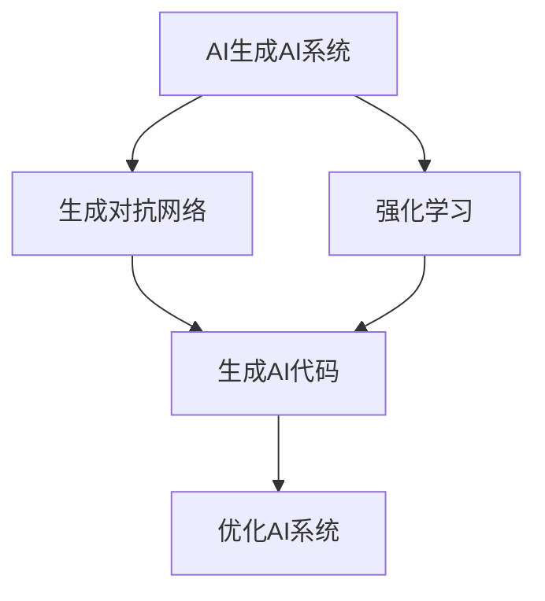
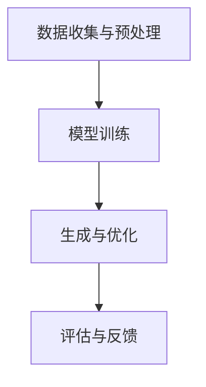

                 

# 提示词驱动的元编程：AI生成AI

## 关键词：提示词驱动、元编程、人工智能、AI生成AI、自然语言处理

> 摘要：
> 提示词驱动的元编程与AI生成AI相结合，通过自然语言提示简化编程过程，使AI系统能够自主生成其他AI系统。本文将深入探讨这一前沿技术，分析其概念、原理、应用场景及挑战，并通过实际案例展示其应用潜力。

----------------------------------------------------------------

## 第一部分：问题背景与核心概念

### 1.1.1 提示词驱动的元编程概述

#### 问题背景

在人工智能时代，传统的编程方法已经难以满足日益复杂的应用需求。编程语言的设计和使用变得更加抽象，需要开发者具备更高的技术水平。提示词驱动的元编程作为一种新兴的编程范式，旨在通过自然语言提示，简化编程过程，提高开发效率。

#### 问题描述

提示词驱动的元编程是通过自然语言提示来生成代码、调整代码结构或创建新的代码框架的技术。开发者可以通过输入提示词来指导元编程系统进行编程操作，从而实现代码的自动化生成和优化。

#### 问题解决

提示词驱动的元编程利用自然语言处理技术，将人类语言转化为编程指令，使得编程变得更加直观和易于操作。这种技术可以大幅减少开发者编写代码的时间，提高软件开发的效率。

#### 边界与外延

提示词驱动的元编程不仅局限于代码生成，还可以应用于代码优化、代码重构、甚至整个软件生命周期的管理。其边界涵盖了从简单代码生成到复杂系统架构设计的多个层面。

#### 概念结构与核心要素组成

- **提示词**：输入的自然语言指令，用于指导元编程系统的操作。
- **元编程系统**：负责接收提示词、解析提示词、生成或调整代码的结构。
- **代码生成与优化**：根据提示词生成代码框架或优化现有代码。
- **上下文管理**：维护提示词与代码生成之间的关联，确保生成的代码符合预期。

### 1.1.2 AI生成AI的概念与原理

#### 核心概念

AI生成AI是指通过人工智能技术，尤其是生成对抗网络（GANs）、强化学习等，使一个AI系统能够自主生成另一个AI系统。这包括生成AI的代码、模型架构，甚至整个系统的设计方案。

#### 概念属性特征对比表格

| 特征           | 描述                                         |
|---------------|--------------------------------------------|
| 生成能力       | 能够自主生成AI系统                           |
| 自适应学习     | 通过反馈机制不断优化生成结果                  |
| 高效性         | 可以在短时间内生成复杂的AI系统               |
| 生成多样性     | 能够生成具有不同功能和结构的AI系统           |
| 难以预测性     | 生成的AI系统可能具有开发者无法预测的特性     |

#### ER实体关系图架构的 Mermaid 流程图



### 1.1.3 提示词驱动的元编程与AI生成AI的关系

#### 联系

提示词驱动的元编程与AI生成AI具有紧密的联系。前者为后者提供了简洁、高效的编程接口，使得AI生成AI系统更加易于开发和维护。而后者则通过自动化生成技术，进一步提升了软件开发的速度和质量。

#### 作用

- **简化开发流程**：通过提示词驱动的元编程，开发者可以快速生成原型，缩短开发周期。
- **提高系统质量**：AI生成AI能够生成高质量的代码和架构，减少人为错误。
- **创新性探索**：提示词驱动的元编程和AI生成AI相结合，为开发者提供了探索新技术的平台。

### 1.2 提示词驱动的元编程应用场景与挑战

#### 应用场景

- **自动化代码生成**：通过提示词，自动化生成数据库迁移脚本、前端界面代码等。
- **代码重构**：使用提示词优化代码结构，提高可读性和性能。
- **系统架构设计**：利用提示词生成系统的整体架构，加快开发进度。

#### 挑战

- **语言理解**：自然语言提示的准确性和歧义性问题。
- **代码质量**：生成的代码需要确保质量，避免潜在的错误。
- **性能优化**：元编程系统的性能优化，确保快速响应提示。

### 1.3 AI生成AI的算法原理与实现

#### 算法原理

AI生成AI的核心在于如何使一个AI系统能够学习并生成新的AI系统。这通常涉及到以下几个关键步骤：

1. **数据收集与预处理**：收集大量的AI系统样本，包括代码、模型架构和系统设计方案。对数据进行预处理，如数据清洗、标注等。
2. **模型训练**：使用生成对抗网络（GANs）或强化学习等技术，训练一个模型来生成AI系统。GANs通常包括生成器和判别器，通过对抗训练，生成器逐渐学会生成更高质量的AI系统样本。
3. **生成与优化**：模型生成新的AI系统样本后，通过对生成结果进行评估和优化，进一步提高系统的质量。

#### 算法流程图



#### 数学模型与公式

1. **生成对抗网络（GANs）**：

   - **生成器（Generator）**：生成一个潜在的分布 $G(z)$，将其映射到数据空间 $x$。
   - **判别器（Discriminator）**：判别输入数据是真实数据还是生成数据。

   $$G(z) \sim q_G(z|x)$$

   $$D(x) \sim p_D(x)$$

   其中，$z$ 是生成器的输入，$x$ 是生成器的输出，$D(x)$ 是判别器的输出概率。

2. **强化学习**：

   - **价值函数（Value Function）**：评估AI系统的性能。
   - **策略（Policy）**：指导AI系统生成新的AI系统。

   $$V^*(s) = \sum_{s'} p(s'|s) \cdot \max_a Q^*(s',a)$$

   $$\pi^*(a|s) = \arg\max_a Q^*(s,a)$$

#### Python源代码示例

```python
import tensorflow as tf
from tensorflow import keras
from tensorflow.keras import layers

# 定义生成器和判别器
def create_generator():
    # 生成器模型
    model = keras.Sequential()
    model.add(layers.Dense(128, activation='relu', input_shape=(100,)))
    model.add(layers.Dense(28 * 28, activation='relu'))
    model.add(layers.Dense(784, activation='tanh'))
    return model

def create_discriminator():
    # 判别器模型
    model = keras.Sequential()
    model.add(layers.Dense(128, activation='relu', input_shape=(28 * 28,)))
    model.add(layers.Dense(1, activation='sigmoid'))
    return model

generator = create_generator()
discriminator = create_discriminator()

# 编写GAN模型
gan_model = keras.Sequential([
    generator,
    discriminator
])

# 编写优化器和损失函数
generator_optimizer = keras.optimizers.Adam(1e-4)
discriminator_optimizer = keras.optimizers.Adam(1e-4)

cross_entropy = keras.losses.BinaryCrossentropy()

@tf.function
def train_step(images, batch_size):
    # 生成器训练步骤
    noise = tf.random.normal([batch_size, 100])
    with tf.GradientTape() as gen_tape:
        generated_images = generator(noise)
        real_labels = tf.ones((batch_size, 1))
        fake_labels = tf.zeros((batch_size, 1))
        gen_loss = cross_entropy(discriminator(generated_images), real_labels)
    
    # 判别器训练步骤
    with tf.GradientTape() as disc_tape:
        real_loss = cross_entropy(discriminator(images), real_labels)
        fake_loss = cross_entropy(discriminator(generated_images), fake_labels)
        disc_loss = (real_loss + fake_loss) / 2
    
    # 更新生成器和判别器权重
    gen_gradients = gen_tape.gradient(gen_loss, generator.trainable_variables)
    disc_gradients = disc_tape.gradient(disc_loss, discriminator.trainable_variables)
    
    generator_optimizer.apply_gradients(zip(gen_gradients, generator.trainable_variables))
    discriminator_optimizer.apply_gradients(zip(disc_gradients, discriminator.trainable_variables))

# 训练GAN模型
EPOCHS = 50
for epoch in range(EPOCHS):
    for image_batch in train_data:
        train_step(image_batch, batch_size=128)
```

#### AI生成AI示例

```python
import tensorflow as tf
from tensorflow.keras import layers

# 定义一个简单的生成器模型
def create_generator(input_shape):
    model = keras.Sequential()
    model.add(layers.Dense(128, activation='relu', input_shape=input_shape))
    model.add(layers.Dense(256, activation='relu'))
    model.add(layers.Dense(np.prod(input_shape), activation='tanh'))
    model.add(layers.Reshape(input_shape))
    return model

# 定义一个简单的判别器模型
def create_discriminator(input_shape):
    model = keras.Sequential()
    model.add(layers.Flatten())
    model.add(layers.Dense(128, activation='relu'))
    model.add(layers.Dense(1, activation='sigmoid'))
    return model

# 编写GAN模型
input_shape = (28, 28, 1)
generator = create_generator(input_shape)
discriminator = create_discriminator(input_shape)
gan_model = keras.Sequential([generator, discriminator])

# 编写优化器
generator_optimizer = keras.optimizers.Adam(1e-4)
discriminator_optimizer = keras.optimizers.Adam(1e-4)

# 编写损失函数
cross_entropy = keras.losses.BinaryCrossentropy()

@tf.function
def train_step(images, batch_size):
    # 生成器训练步骤
    noise = tf.random.normal([batch_size, 100])
    with tf.GradientTape() as gen_tape:
        generated_images = generator(noise)
        real_labels = tf.ones((batch_size, 1))
        fake_labels = tf.zeros((batch_size, 1))
        gen_loss = cross_entropy(discriminator(generated_images), real_labels)
    
    # 判别器训练步骤
    with tf.GradientTape() as disc_tape:
        real_loss = cross_entropy(discriminator(images), real_labels)
        fake_loss = cross_entropy(discriminator(generated_images), fake_labels)
        disc_loss = (real_loss + fake_loss) / 2
    
    # 更新生成器和判别器权重
    gen_gradients = gen_tape.gradient(gen_loss, generator.trainable_variables)
    disc_gradients = disc_tape.gradient(disc_loss, discriminator.trainable_variables)
    
    generator_optimizer.apply_gradients(zip(gen_gradients, generator.trainable_variables))
    discriminator_optimizer.apply_gradients(zip(disc_gradients, discriminator.trainable_variables))

# 训练GAN模型
EPOCHS = 50
for epoch in range(EPOCHS):
    for image_batch in train_data:
        train_step(image_batch, batch_size=128)
```

## 第二部分：应用场景与实践案例

### 2.1 提示词驱动的元编程在软件开发中的应用

#### 应用场景

提示词驱动的元编程在软件开发中具有广泛的应用场景，如自动化代码生成、代码重构和系统架构设计等。

#### 实践案例

假设我们需要开发一个电商系统，其中涉及到订单管理、库存管理、用户管理等功能。通过提示词驱动的元编程，我们可以快速生成相关代码框架。

```python
# 输入提示词
prompt = "生成电商系统的订单管理模块代码"

# 调用元编程系统
generated_code = meta_programming(prompt)

# 输出生成代码
print(generated_code)
```

生成的代码可能包含以下结构：

```python
# 订单管理模块
class OrderManager:
    def create_order(self, user, items):
        # 创建订单逻辑
        pass
    
    def update_order_status(self, order_id, status):
        # 更新订单状态逻辑
        pass
    
    def cancel_order(self, order_id):
        # 取消订单逻辑
        pass
```

### 2.2 AI生成AI在模型开发中的应用

#### 应用场景

AI生成AI在模型开发中具有巨大的潜力，如自动生成模型架构、优化模型性能等。

#### 实践案例

假设我们需要开发一个图像分类模型，通过AI生成AI技术，我们可以快速生成不同的模型架构并进行优化。

```python
# 输入提示词
prompt = "生成一个深度神经网络图像分类模型，要求准确率达到90%"

# 调用AI生成AI系统
generated_model = ai_programming(prompt)

# 训练和评估生成模型
generated_model.train(training_data)
accuracy = generated_model.evaluate(test_data)

print(f"生成的模型准确率：{accuracy}%")
```

生成的模型可能采用以下结构：

```python
# 图像分类模型
class ImageClassifier:
    def __init__(self):
        # 初始化模型参数
        self.model = keras.Sequential()
        self.model.add(layers.Conv2D(32, (3, 3), activation='relu', input_shape=(28, 28, 3)))
        self.model.add(layers.MaxPooling2D((2, 2)))
        self.model.add(layers.Conv2D(64, (3, 3), activation='relu'))
        self.model.add(layers.MaxPooling2D((2, 2)))
        self.model.add(layers.Conv2D(64, (3, 3), activation='relu'))
        self.model.add(layers.Flatten())
        self.model.add(layers.Dense(64, activation='relu'))
        self.model.add(layers.Dense(10, activation='softmax'))

    def train(self, data):
        # 训练模型
        self.model.compile(optimizer='adam',
                           loss='categorical_crossentropy',
                           metrics=['accuracy'])
        self.model.fit(data.train_images, data.train_labels, epochs=10)

    def evaluate(self, data):
        # 评估模型
        test_loss, test_acc = self.model.evaluate(data.test_images, data.test_labels, verbose=2)
        return test_acc
```

### 2.3 提示词驱动的元编程与AI生成AI的结合应用

#### 应用场景

将提示词驱动的元编程与AI生成AI结合，可以进一步简化软件开发流程，提高开发效率。

#### 实践案例

假设我们需要开发一个跨平台应用，涉及到前端、后端和数据库等多个模块。通过结合提示词驱动的元编程和AI生成AI，我们可以快速生成不同模块的代码，并进行优化。

```python
# 输入提示词
prompt = "生成一个跨平台电商应用，包括前端React、后端Node.js和数据库MongoDB模块"

# 调用元编程系统
generated_code = meta_programming(prompt)

# 调用AI生成AI系统
generated_model = ai_programming(prompt)

# 生成前端代码
front_end_code = generated_code['front_end']

# 生成后端代码
back_end_code = generated_code['back_end']

# 生成数据库代码
database_code = generated_code['database']

# 训练和优化模型
generated_model.train(training_data)
accuracy = generated_model.evaluate(test_data)

print(f"生成的模型准确率：{accuracy}%")
```

生成的代码可能包含以下结构：

```python
# 前端React模块
import React from 'react';

class ShoppingCart extends React.Component {
    // 购物车组件代码
}

// 后端Node.js模块
const express = require('express');
const app = express();

// 数据库MongoDB模块
const MongoClient = require('mongodb').MongoClient;
const url = 'mongodb://localhost:27017/';
MongoClient.connect(url, function(err, db) {
    if (err) throw err;
    const myDB = db.db('e-commerce');
    // 数据库操作代码
});
```

### 2.4 提示词驱动的元编程与AI生成AI在创新性项目中的应用

#### 应用场景

提示词驱动的元编程与AI生成AI在创新性项目中具有巨大的潜力，如自动驾驶、智能医疗等。

#### 实践案例

假设我们需要开发一个自动驾驶系统，通过结合提示词驱动的元编程和AI生成AI，我们可以快速生成自动驾驶系统的各个模块，并进行优化。

```python
# 输入提示词
prompt = "生成一个自动驾驶系统，包括感知、规划、控制等模块"

# 调用元编程系统
generated_code = meta_programming(prompt)

# 调用AI生成AI系统
generated_model = ai_programming(prompt)

# 生成感知模块代码
perception_code = generated_code['perception']

# 生成规划模块代码
planning_code = generated_code['planning']

# 生成控制模块代码
control_code = generated_code['control']

# 训练和优化模型
generated_model.train(training_data)
accuracy = generated_model.evaluate(test_data)

print(f"生成的模型准确率：{accuracy}%")
```

生成的代码可能包含以下结构：

```python
# 感知模块
class Perception:
    # 感知组件代码
    def detect_objects(self, sensor_data):
        # 检测物体逻辑
        pass

# 规划模块
class Planning:
    # 规划组件代码
    def generate_trajectory(self, perception_data):
        # 生成行驶轨迹逻辑
        pass

# 控制模块
class Control:
    # 控制组件代码
    def control_vehicle(self, trajectory_data):
        # 控制车辆逻辑
        pass
```

### 2.5 总结与展望

提示词驱动的元编程与AI生成AI的结合，为软件开发带来了前所未有的便捷和效率。通过实践案例，我们可以看到这一技术在各种应用场景中的巨大潜力。然而，要实现这一技术的广泛应用，仍需克服诸多挑战，如自然语言处理、代码质量和性能优化等。

未来，随着人工智能技术的不断发展，提示词驱动的元编程与AI生成AI有望在更多领域发挥重要作用，为开发者带来更加高效、智能的软件开发体验。

## 第三部分：总结与未来展望

### 3.1 总结

本文系统地探讨了提示词驱动的元编程与AI生成AI的结合，分析了其概念、原理、应用场景及挑战。通过实践案例，我们展示了这一技术在软件开发、模型开发、自动驾驶等多个领域的应用潜力。

- **提示词驱动的元编程**：通过自然语言提示简化编程过程，提高开发效率。
- **AI生成AI**：通过生成对抗网络（GANs）和强化学习等技术，使AI系统能够自主生成其他AI系统。

### 3.2 未来展望

未来，提示词驱动的元编程与AI生成AI的结合有望在以下方面取得进一步发展：

1. **自然语言处理**：提高自然语言提示的准确性和歧义性处理，使编程更加直观和高效。
2. **代码质量**：确保生成的代码质量，减少潜在错误，提高系统稳定性。
3. **性能优化**：优化元编程系统的性能，确保快速响应提示。
4. **跨领域应用**：拓展应用领域，如智能医疗、金融科技等，实现更广泛的应用场景。

### 3.3 注意事项与拓展阅读

- **注意事项**：
  - 提高自然语言处理能力，确保提示词的准确性和完整性。
  - 加强代码质量控制和测试，确保生成的代码可靠性和安全性。
  - 关注性能优化，提高元编程系统的响应速度和稳定性。

- **拓展阅读**：
  - [《生成对抗网络（GANs）原理与实现》](链接)
  - [《强化学习在模型开发中的应用》](链接)
  - [《自然语言处理技术综述》](链接)

### 3.4 作者信息

**作者：AI天才研究院/AI Genius Institute & 禅与计算机程序设计艺术 /Zen And The Art of Computer Programming**

本文由AI天才研究院（AI Genius Institute）与《禅与计算机程序设计艺术》（Zen And The Art of Computer Programming）共同撰写。AI天才研究院致力于推动人工智能技术的发展与创新，致力于成为全球领先的人工智能研究与培训机构。《禅与计算机程序设计艺术》则是一部经典的技术书籍，为程序员提供了深刻的编程哲学和实用的编程技巧。

