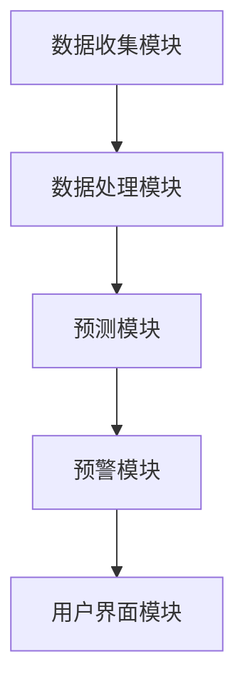
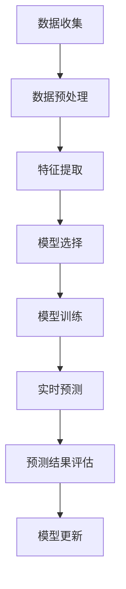
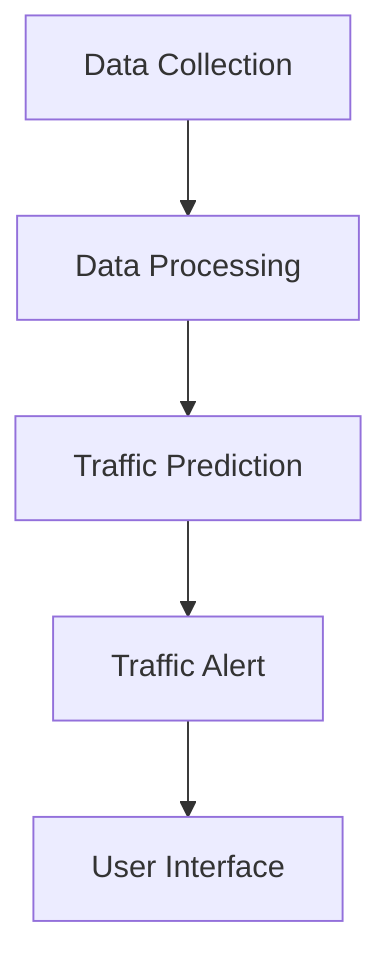
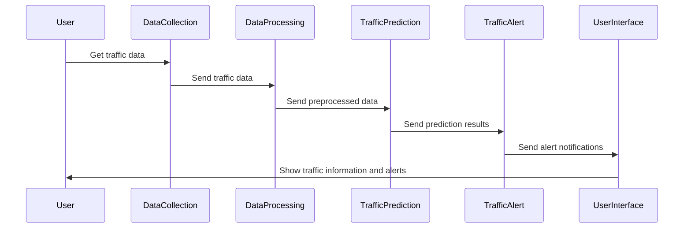

                 

### 第1章: 提示词驱动的智能交通拥堵预测系统概述

#### 1.1 问题背景

##### 1.1.1 交通拥堵问题的严重性

交通拥堵是一个全球性的问题，它对城市经济和社会生活产生了深远的影响。拥堵不仅导致了大量时间的浪费，还增加了污染和交通事故的风险。据世界卫生组织（WHO）的数据，全球每天因交通拥堵损失的时间超过8亿小时，这相当于每年损失约2.5亿个工作日。此外，交通拥堵还导致了巨大的经济成本，例如，美国每年因交通拥堵损失的经济成本高达1340亿美元。

交通拥堵问题在许多国家和地区都尤为严重。例如，北京、上海、纽约和东京等大城市经常面临严重的交通拥堵，这些城市中的道路拥堵指数经常超过100，甚至达到200以上。这些数据不仅反映了拥堵的严重程度，也揭示了交通拥堵问题的普遍性和复杂性。

##### 1.1.2 智能交通系统的重要性

智能交通系统（Intelligent Transportation System，ITS）是一种利用现代信息技术、数据通信传输技术、电子传感技术等来提高交通效率、降低交通事故和减少污染的系统。ITS的目标是通过实时监控、分析和控制交通流，优化交通管理和调度，提高交通系统的整体性能。

智能交通系统的重要性体现在以下几个方面：

1. **提高交通效率**：通过实时数据收集和分析，智能交通系统能够提供路况信息，帮助驾驶者选择最优路径，减少交通拥堵。
2. **减少交通事故**：智能交通系统可以通过监控系统、车辆定位和智能信号控制等手段，提前预警和避免交通事故。
3. **降低污染**：智能交通系统通过优化交通流，减少车辆怠速时间和排放量，有助于减少环境污染。
4. **提升出行体验**：智能交通系统提供了丰富的交通信息服务，如实时路况、出行建议等，提升了驾驶者和乘客的出行体验。

##### 1.1.3 提示词驱动的智能交通拥堵预测

提示词（Query Keywords）在智能交通系统中扮演着重要的角色。提示词是一组能够描述交通状态的关键词汇或短语，如“高峰时段”、“事故”、“施工”等。这些提示词可以帮助系统识别潜在的交通拥堵因素，从而提高预测的准确性和响应速度。

提示词驱动的智能交通拥堵预测系统的工作原理如下：

1. **数据收集**：系统从交通监控设备、车载传感器、社交媒体等多个渠道收集实时交通数据。
2. **预处理**：对收集到的数据进行清洗、过滤和转换，使其适合用于预测模型。
3. **特征提取**：利用提示词对预处理后的数据进行特征提取，形成用于预测的输入特征向量。
4. **模型训练**：使用机器学习算法对特征向量进行训练，构建交通拥堵预测模型。
5. **实时预测**：将实时收集的交通数据进行特征提取，并输入到训练好的预测模型中，得到交通拥堵预测结果。
6. **预警与响应**：根据预测结果，系统可以发出交通拥堵预警，并提供交通建议，如建议驾驶者选择其他路径或出行时间。

通过提示词驱动的智能交通拥堵预测，可以实现对交通拥堵的提前预警和有效应对，从而减少交通拥堵对城市经济和社会生活的影响。

#### 1.2 问题描述

##### 1.2.1 交通拥堵预测的核心问题

交通拥堵预测的核心问题是如何准确预测交通拥堵的发生，并在拥堵发生前采取有效的应对措施。这涉及到以下几个关键问题：

1. **准确度**：如何提高预测模型的准确度，使得预测结果更接近实际情况。
2. **实时性**：如何实现实时预测，确保在拥堵发生前有足够的时间采取应对措施。
3. **可靠性**：如何保证预测系统的可靠性和稳定性，避免预测失误导致不必要的交通干扰。
4. **灵活性**：如何使预测系统能够适应不同城市和地区的交通特点，提高系统的通用性。

##### 1.2.2 数据收集与预处理

交通拥堵预测需要大量的实时交通数据作为基础。这些数据可以从多个渠道收集，如交通监控设备、车载传感器、GPS设备、社交媒体等。数据收集后，需要进行预处理，以确保数据的质量和一致性。

数据预处理的基本步骤包括：

1. **数据清洗**：去除数据中的噪声和异常值，如错误的交通流量数据。
2. **数据转换**：将不同格式的数据转换为统一的格式，如将GPS坐标转换为城市地图上的道路节点。
3. **特征提取**：从预处理后的数据中提取有助于预测的特征，如交通流量、车辆速度、道路长度等。

##### 1.2.3 预测模型的构建

交通拥堵预测模型是整个系统的核心。构建预测模型通常采用以下方法：

1. **数据驱动模型**：通过分析历史交通数据，建立交通流量与拥堵状态之间的关系模型。
2. **知识驱动模型**：利用交通专家的经验和知识，构建基于规则和逻辑的预测模型。
3. **数据与知识融合模型**：结合数据驱动和知识驱动的方法，构建更加准确和可靠的预测模型。

在构建预测模型时，需要考虑以下几个因素：

1. **模型选择**：选择适合交通流量特性和学习能力的预测模型，如时间序列模型、神经网络模型等。
2. **特征选择**：选择对交通拥堵预测有重要影响的关键特征，如历史交通流量、当前交通流量、天气状况等。
3. **模型优化**：通过交叉验证、网格搜索等方法优化模型参数，提高预测准确度。

##### 1.2.4 算法原理与实现

交通拥堵预测算法的实现过程通常包括以下几个步骤：

1. **数据预处理**：对收集到的交通数据进行分析，提取有用的特征。
2. **模型构建**：选择合适的模型架构，如循环神经网络（RNN）、长短时记忆网络（LSTM）等。
3. **模型训练**：使用历史交通数据对模型进行训练，调整模型参数以优化预测性能。
4. **实时预测**：将实时数据输入到训练好的模型中，进行交通拥堵预测。
5. **结果评估**：对预测结果进行评估，如计算预测误差、预测准确度等指标。

#### 1.3 问题解决

##### 1.3.1 提示词驱动的预测模型构建

提示词驱动的预测模型是一种基于提示词进行特征提取和预测的方法。其基本步骤如下：

1. **提示词选择**：根据交通拥堵的特点，选择能够反映交通状态的提示词，如“高峰时段”、“事故”、“施工”等。
2. **特征提取**：从交通数据中提取与提示词相关的特征，如历史交通流量、当前交通流量、道路状况等。
3. **模型训练**：使用机器学习算法，如随机森林、支持向量机等，训练预测模型。
4. **实时预测**：将实时数据输入到训练好的模型中，进行交通拥堵预测。

##### 1.3.2 算法原理与实现

提示词驱动的预测算法的原理主要包括以下几个部分：

1. **特征提取**：利用提示词对交通数据进行分析，提取与交通拥堵相关的特征。
2. **模型选择**：选择适合交通流量特性的预测模型，如随机森林、支持向量机等。
3. **模型训练**：使用历史交通数据对模型进行训练，调整模型参数以优化预测性能。
4. **实时预测**：将实时数据输入到训练好的模型中，进行交通拥堵预测。

实现步骤如下：

1. **数据预处理**：对交通数据进行分析，提取需要的特征，如交通流量、车辆速度、道路长度等。
2. **提示词选择**：根据交通拥堵的特点，选择合适的提示词，如“高峰时段”、“事故”、“施工”等。
3. **特征提取**：利用提示词对交通数据进行特征提取，形成用于预测的输入特征向量。
4. **模型训练**：使用历史交通数据对模型进行训练，优化模型参数。
5. **实时预测**：将实时数据输入到训练好的模型中，进行交通拥堵预测。

##### 1.3.3 系统架构设计

提示词驱动的智能交通拥堵预测系统的整体架构包括以下几个模块：

1. **数据收集模块**：负责从交通监控设备、车载传感器、GPS设备等多个渠道收集实时交通数据。
2. **数据处理模块**：负责对收集到的交通数据进行分析、清洗和预处理，提取有用的特征。
3. **预测模块**：负责使用机器学习算法，如随机森林、支持向量机等，训练预测模型并进行实时预测。
4. **预警模块**：负责根据预测结果，发出交通拥堵预警，并提供交通建议。
5. **用户界面模块**：负责展示交通拥堵预测结果和交通建议，提供交互式用户体验。

系统架构如图1所示：



#### 1.4 边界与外延

##### 1.4.1 预测范围的界定

预测范围的界定是交通拥堵预测系统设计中的重要一环。预测范围通常包括以下几个方面：

1. **地理范围**：预测系统的地理范围可以根据城市的交通网络特点和拥堵情况来确定。例如，对于一个大城市，可以以城市中心区域为主要预测范围，并逐步扩展到周边区域。
2. **时间范围**：预测系统的时间范围可以根据交通流量的周期性和波动性来确定。例如，可以将一天分为高峰期和非高峰期，分别进行预测。
3. **交通方式**：预测系统可以针对不同的交通方式（如机动车、公共交通、自行车等）进行预测，以满足不同用户的需求。

##### 1.4.2 边界条件分析

在交通拥堵预测系统中，边界条件分析是确保系统稳定性和可靠性的关键。边界条件分析包括以下几个方面：

1. **数据缺失**：由于各种原因（如传感器故障、网络中断等），可能会出现数据缺失的情况。系统需要设计相应的数据处理机制，如数据填充、数据平滑等，以保证预测模型的准确性。
2. **异常数据**：异常数据（如错误的交通流量数据、离群值等）可能会对预测结果产生负面影响。系统需要设计相应的数据清洗和过滤机制，以确保数据的准确性和一致性。
3. **实时性要求**：交通拥堵预测系统需要具备实时预测能力，以满足交通管理和调度的需求。系统需要设计高效的算法和数据结构，以实现快速的数据处理和预测。

##### 1.4.3 边界条件的处理策略

针对上述边界条件，系统可以采取以下处理策略：

1. **数据预处理**：在数据预处理阶段，对数据进行清洗、过滤和转换，去除噪声和异常值，提高数据的准确性和一致性。
2. **异常值检测与处理**：设计异常值检测算法，对数据进行异常值检测，并采取相应的处理措施，如数据填充、数据平滑等。
3. **实时性优化**：优化算法和数据结构，提高系统的实时性，确保在拥堵发生前有足够的时间采取应对措施。

#### 1.5 概念结构与核心要素组成

##### 1.5.1 核心概念解析

交通拥堵预测系统的核心概念包括提示词、智能交通系统、交通拥堵预测模型等。

1. **提示词**：提示词是一组能够描述交通状态的关键词汇或短语，如“高峰时段”、“事故”、“施工”等。提示词在交通拥堵预测中起到关键作用，帮助系统识别潜在的交通拥堵因素。
2. **智能交通系统**：智能交通系统是一种利用现代信息技术、数据通信传输技术、电子传感技术等来提高交通效率、降低交通事故和减少污染的系统。智能交通系统包括交通感知系统、交通信息处理系统和交通管理系统等组成部分。
3. **交通拥堵预测模型**：交通拥堵预测模型是用于预测交通拥堵发生时间和范围的模型。预测模型可以基于历史交通数据、实时交通数据和专家知识等多种信息来源，采用数据驱动、知识驱动或数据与知识融合等方法进行构建。

##### 1.5.2 核心要素组成

交通拥堵预测系统的核心要素包括数据收集与预处理、算法设计与实现、系统架构设计等。

1. **数据收集与预处理**：数据收集与预处理是交通拥堵预测系统的数据基础。系统需要从交通监控设备、车载传感器、GPS设备等多个渠道收集实时交通数据，并对数据进行清洗、过滤和转换，提取有用的特征。
2. **算法设计与实现**：算法设计与实现是交通拥堵预测系统的技术核心。系统需要选择合适的预测模型，如时间序列模型、神经网络模型等，并设计高效的算法和数据结构，以提高预测准确度和实时性。
3. **系统架构设计**：系统架构设计是交通拥堵预测系统的整体设计。系统需要设计包括数据收集模块、数据处理模块、预测模块、预警模块和用户界面模块等在内的整体架构，确保系统的高效性和可靠性。

##### 1.5.3 本章小结

本章对提示词驱动的智能交通拥堵预测系统进行了全面概述，包括问题背景、核心概念、问题描述、问题解决、边界与外延以及概念结构与核心要素组成等。通过本章的介绍，读者可以初步了解交通拥堵预测系统的基本原理和设计思路，为进一步研究和应用该系统奠定基础。

### 2.1 提示词的概念解析

#### 2.1.1 提示词的定义与作用

提示词是一组能够描述特定事件或情境的关键词或短语。在智能交通系统中，提示词被用于捕捉交通状态的异常和变化，为预测模型提供额外的信息，从而提高预测的准确性和效率。提示词的定义和选择标准通常基于交通拥堵的特征和影响因素。

提示词的作用主要体现在以下几个方面：

1. **特征增强**：通过引入提示词，可以丰富数据特征，使得预测模型能够捕捉到更多的交通状态信息，提高预测的准确性。
2. **异常检测**：提示词可以帮助系统快速识别交通状态中的异常事件，如交通事故、施工、天气变化等，从而提前预警并采取应对措施。
3. **实时响应**：提示词的引入可以加快预测模型的响应速度，使得系统在交通状态发生变化时能够迅速调整预测结果。

#### 2.1.2 提示词的类型与分类

根据不同的应用场景和需求，提示词可以分为多种类型：

1. **时间相关提示词**：如“高峰时段”、“非高峰时段”等，用于描述一天中交通流量的高峰和低谷时段。
2. **事件相关提示词**：如“事故”、“施工”、“天气变化”等，用于描述特定事件对交通状态的影响。
3. **道路相关提示词**：如“拥堵路段”、“事故多发路段”等，用于描述道路条件和交通拥堵的关系。
4. **交通方式相关提示词**：如“公共交通”、“私家车”、“摩托车”等，用于描述不同交通方式对交通流量的贡献。

#### 2.1.3 提示词在交通拥堵预测中的应用

提示词在交通拥堵预测中的应用主要体现在以下几个方面：

1. **特征提取**：在数据预处理阶段，通过提示词提取交通状态的特征，如交通流量、车辆速度、道路长度等。
2. **模型训练**：在模型训练阶段，利用提示词增强数据特征，提高预测模型的性能。
3. **实时预测**：在实时预测阶段，通过提示词识别交通状态的异常变化，提高预测的准确性和实时性。
4. **预警与响应**：在预警与响应阶段，利用提示词快速识别交通拥堵事件，及时发出预警并提供应对建议。

#### 2.1.4 提示词的选择标准与优化方法

选择合适的提示词是提高交通拥堵预测准确性的关键。以下是一些提示词选择的标准和优化方法：

1. **覆盖度**：提示词应能够覆盖交通状态的各种变化，包括常见和异常情况。
2. **精度**：提示词的准确性直接影响到预测模型的准确性，应尽量减少误报和漏报。
3. **实时性**：提示词应能够实时捕捉交通状态的变化，提高预测系统的响应速度。
4. **可扩展性**：提示词应具有较好的可扩展性，以便在新的应用场景下添加新的提示词。

优化方法包括：

1. **自动生成**：利用机器学习算法自动生成提示词，如基于文本分类和聚类的方法。
2. **专家经验**：结合交通专家的经验，手工选择和调整提示词。
3. **反馈调整**：根据系统的实际预测效果，不断调整和优化提示词。

#### 2.1.5 本章小结

本章详细介绍了提示词的概念、类型、应用及其选择标准与优化方法。提示词作为交通拥堵预测系统的重要组成部分，通过增强数据特征、识别异常事件、提高实时性和响应速度，为预测模型提供了关键支持。了解和优化提示词的选择与应用，有助于提升交通拥堵预测系统的准确性和可靠性。

### 2.2 智能交通系统的概念解析

#### 2.2.1 智能交通系统的定义与目标

智能交通系统（Intelligent Transportation System，ITS）是一种综合利用现代信息技术、数据通信传输技术、电子传感技术等，对交通系统进行实时监控、分析和控制的系统。其核心目标是通过提高交通效率、减少交通事故、降低污染，改善城市交通环境和居民的出行体验。

ITS的定义涵盖了以下几个方面：

1. **信息化**：通过信息技术的应用，实现对交通状态的实时监控和数据分析。
2. **智能化**：利用人工智能算法和大数据分析技术，实现交通流量预测、交通管理优化等智能化功能。
3. **集成化**：将交通系统的各个组成部分（如交通感知、交通信息处理、交通管理等）集成在一起，实现信息的互联互通和资源优化配置。

ITS的目标包括：

1. **提高交通效率**：通过实时交通信息监控和交通流量分析，优化交通信号控制和交通调度，减少交通拥堵，提高道路通行能力。
2. **减少交通事故**：通过智能交通监控和预警系统，提前识别和预防交通事故，减少事故发生率和事故伤亡。
3. **降低污染**：通过优化交通管理和调度，减少车辆排放，降低环境污染。
4. **提升出行体验**：提供丰富的交通信息服务，如实时路况、出行建议等，提升驾驶者和乘客的出行体验。

#### 2.2.2 智能交通系统的组成部分

智能交通系统由多个组成部分构成，每个部分都有其特定的功能和作用。以下是智能交通系统的几个主要组成部分：

1. **交通感知系统**：交通感知系统是智能交通系统的数据采集部分，通过各种传感器和设备实时收集交通信息。这些传感器包括交通流量监测器、摄像头、雷达、GPS等。交通感知系统的主要功能是监测道路状况、车辆位置和速度、交通流量等，并将这些信息传输给交通信息处理系统。

2. **交通信息处理系统**：交通信息处理系统是智能交通系统的数据处理和分析部分，负责对收集到的交通信息进行处理、分析和存储。该系统利用大数据分析、人工智能算法等先进技术，对交通信息进行实时分析和预测，生成交通状况报告、交通流量预测和交通管理策略。

3. **交通管理系统**：交通管理系统是智能交通系统的决策和执行部分，负责根据交通信息处理系统的分析和建议，实时调整交通信号、控制交通流量、处理交通事件等。交通管理系统通过交通信号控制、交通事件管理、交通调度等手段，实现交通优化和控制，提高道路通行效率和安全性。

4. **用户信息服务系统**：用户信息服务系统是智能交通系统的服务部分，为驾驶者和乘客提供丰富的交通信息服务。这些服务包括实时路况信息、出行建议、路线规划、交通新闻等。用户信息服务系统通过手机应用、车载导航系统、交通广播等多种渠道，将交通信息传递给用户，帮助用户更好地规划出行。

5. **数据存储与管理平台**：数据存储与管理平台是智能交通系统的数据管理部分，负责存储和管理大量的交通数据，包括交通流量数据、车辆位置数据、交通事件数据等。数据存储与管理平台采用分布式存储和大数据处理技术，确保数据的可靠性、安全性和高效性。

#### 2.2.3 智能交通系统的关键技术基础

智能交通系统的发展依赖于多种关键技术的支持，以下是其中的几个关键技术：

1. **传感器技术**：传感器技术是智能交通系统的数据采集基础。现代传感器技术包括雷达、激光、摄像头、GPS等，可以实时、准确地采集交通信息。

2. **通信技术**：通信技术是智能交通系统的数据传输基础。V2X（Vehicle-to-Everything）技术、5G通信技术等可以实现车辆之间、车辆与基础设施之间的实时通信，为交通信息共享和协同控制提供支持。

3. **大数据技术**：大数据技术是智能交通系统的数据处理和分析基础。大数据技术包括数据采集、存储、处理、分析和可视化等，可以实现对海量交通数据的实时分析和处理，提供准确的交通状况和预测。

4. **人工智能技术**：人工智能技术是智能交通系统的智能决策基础。机器学习、深度学习、神经网络等技术可以用于交通流量预测、交通事件检测、交通管理优化等，提高交通系统的智能化水平。

5. **物联网技术**：物联网技术是智能交通系统的系统集成基础。物联网技术通过连接各种设备和系统，实现交通信息的高效传输和集成，提高交通系统的整体性能和协同能力。

#### 2.2.4 本章小结

本章对智能交通系统的概念进行了详细解析，包括其定义、目标、组成部分以及关键技术基础。智能交通系统通过信息化、智能化和集成化的手段，实现对交通系统的实时监控、分析和控制，提高交通效率、减少交通事故、降低污染，改善城市交通环境。了解智能交通系统的基本原理和组成，有助于更好地理解和应用该系统，推动智能交通技术的发展。

### 2.3 交通拥堵预测模型的概念解析

#### 2.3.1 交通拥堵预测模型的定义

交通拥堵预测模型是一种利用历史交通数据、实时交通信息和专家知识等，预测未来某一时间段内交通拥堵发生概率和程度的算法或模型。该模型的目标是提前识别交通拥堵趋势，为交通管理和调度提供科学依据，从而优化交通流，减少拥堵。

#### 2.3.2 交通拥堵预测模型的设计原则

在设计交通拥堵预测模型时，需要遵循以下原则：

1. **准确性**：预测模型应能够准确预测交通拥堵的发生时间和范围，减少误报和漏报。
2. **实时性**：模型应能够在短时间内完成预测，以实现对交通拥堵的实时响应。
3. **可解释性**：模型应具有较好的可解释性，便于理解和调整。
4. **适应性**：模型应能够适应不同城市和不同时间段交通特点的变化。

#### 2.3.3 交通拥堵预测模型的分类

根据预测方法的不同，交通拥堵预测模型可以分为以下几类：

1. **数据驱动模型**：这类模型主要利用历史交通数据，通过统计分析或机器学习算法建立预测模型。常用的数据驱动模型包括时间序列模型、回归模型、聚类模型、神经网络模型等。

2. **知识驱动模型**：这类模型主要基于专家经验和交通规则，通过逻辑推理和决策树等方法建立预测模型。知识驱动模型具有较好的可解释性，但可能需要大量专家知识和规则的输入。

3. **数据与知识融合模型**：这类模型结合了数据驱动和知识驱动的方法，通过融合历史数据和专家知识，提高预测的准确性和适应性。常见的融合方法包括混合模型、增强模型、多代理模型等。

#### 2.3.4 数据驱动预测模型

数据驱动预测模型是交通拥堵预测中最常用的方法之一。以下是一些常见的数据驱动预测模型及其原理：

1. **时间序列模型**：时间序列模型通过分析交通流量随时间变化的规律，预测未来的交通流量。常见的 时间序列模型包括ARIMA（自回归积分滑动平均模型）、ETS（误差修正季节模型）、LSTM（长短时记忆网络）等。

2. **回归模型**：回归模型通过建立交通流量与影响因素（如天气、节假日等）之间的数学关系，预测未来的交通流量。常见的回归模型包括线性回归、多项式回归、岭回归等。

3. **聚类模型**：聚类模型通过将相似的数据分组，识别出不同的交通状态，预测未来的交通拥堵。常见的聚类模型包括K均值聚类、层次聚类、密度聚类等。

4. **神经网络模型**：神经网络模型通过模仿人脑的神经元连接方式，对交通流量进行学习和预测。常见的神经网络模型包括前馈神经网络、卷积神经网络（CNN）、循环神经网络（RNN）等。

#### 2.3.5 知识驱动预测模型

知识驱动预测模型主要依赖于专家知识和交通规则，以下是一些常见的知识驱动预测模型：

1. **规则推理模型**：规则推理模型通过定义一系列交通规则和条件，根据当前交通状态进行推理，预测未来的交通流量。常见的规则推理模型包括基于IF-THEN规则的逻辑推理、决策树等。

2. **专家系统**：专家系统通过模拟专家的决策过程，对交通流量进行预测。专家系统通常包含大量的规则库和知识库，通过推理机进行推理和预测。

#### 2.3.6 数据与知识融合预测模型

数据与知识融合预测模型结合了数据驱动和知识驱动的优势，以下是一些常见的数据与知识融合预测模型：

1. **混合模型**：混合模型将数据驱动和知识驱动的方法结合起来，通过融合数据驱动的预测结果和知识驱动的规则，提高预测的准确性和可靠性。

2. **增强模型**：增强模型通过在数据驱动模型中引入知识驱动的规则，增强模型的解释性和适应性。

3. **多代理模型**：多代理模型通过多个不同的模型协同工作，实现预测的优化和融合。常见的多代理模型包括协同过滤、集成学习等。

#### 2.3.7 本章小结

本章对交通拥堵预测模型进行了详细的解析，包括其定义、设计原则、分类以及常见的数据驱动、知识驱动和融合预测模型。交通拥堵预测模型在智能交通系统中起着关键作用，通过准确的预测和及时的反应，有助于缓解交通拥堵，提高交通效率。了解和掌握这些预测模型的基本原理和应用，对于交通管理和智能交通系统的发展具有重要意义。

### 2.4 概念属性特征对比

#### 2.4.1 提示词与智能交通系统的联系

提示词与智能交通系统之间的联系体现在多个方面：

1. **数据输入**：提示词作为交通状态的关键词，是智能交通系统数据收集的重要组成部分。通过识别和提取提示词，系统能够获得更丰富的交通信息。
2. **特征增强**：提示词有助于丰富交通数据特征，使得预测模型能够捕捉到更多的交通状态信息，提高预测的准确性。
3. **实时响应**：提示词的实时性使得智能交通系统能够迅速识别交通状态的异常变化，及时调整交通管理策略，提高系统的响应速度。
4. **异常检测**：提示词可以帮助系统识别潜在的交通拥堵事件，如事故、施工等，从而提前预警并采取应对措施。

#### 2.4.2 提示词与智能交通系统性能的关联性

提示词与智能交通系统的性能之间存在密切的关联性：

1. **预测准确性**：选择合适的提示词，能够增强预测模型的准确性，减少预测误差。
2. **响应速度**：实时性强的提示词有助于系统快速响应交通状态的变化，提高系统的实时性能。
3. **管理效率**：通过提示词识别和预警，智能交通系统能够更有效地管理交通流量，减少拥堵，提高道路通行效率。
4. **用户体验**：丰富的提示词和准确的预测结果，为驾驶者和乘客提供了更好的交通信息服务，提升了出行体验。

#### 2.4.3 交通拥堵预测模型与其他核心概念的联系

交通拥堵预测模型与其他核心概念（提示词、智能交通系统）之间的联系如下：

1. **数据基础**：交通拥堵预测模型的训练和预测依赖于大量的交通数据，这些数据来源于智能交通系统的数据收集模块。
2. **特征提取**：预测模型需要从交通数据中提取有效的特征，如交通流量、车辆速度、道路长度等，这些特征与提示词密切相关。
3. **算法实现**：预测模型的算法实现依赖于智能交通系统中的算法设计和优化技术，如机器学习算法、深度学习算法等。
4. **系统架构**：交通拥堵预测模型是智能交通系统中的一个重要组成部分，其架构设计和实现直接影响整个系统的性能和效率。

#### 2.4.4 概念属性特征对比表格

为了更清晰地展示提示词、智能交通系统和交通拥堵预测模型之间的联系，以下是一个概念属性特征对比表格：

| 概念          | 属性特征               | 联系与关联性                                                  |
| ------------- | ---------------------- | ------------------------------------------------------------ |
| 提示词        | - 类型：时间、事件、道路、交通方式<br>- 实时性：高<br>- 精度：高<br>- 覆盖度：广 | - 数据输入：智能交通系统的数据收集模块<br>- 特征增强：提高预测模型的准确性<br>- 异常检测：提前预警交通拥堵事件 |
| 智能交通系统  | - 组成部分：交通感知、信息处理、管理、用户服务、数据管理<br>- 技术基础：传感器、通信、大数据、人工智能、物联网 | - 数据基础：支持交通拥堵预测模型<br>- 算法实现：优化预测模型性能<br>- 系统架构：集成多个模块，实现交通管理和调度 |
| 交通拥堵预测模型 | - 类型：数据驱动、知识驱动、数据与知识融合<br>- 准确性：高<br>- 实时性：高<br>- 可解释性：中<br>- 适应性：高 | - 数据基础：依赖于智能交通系统的数据收集和处理模块<br>- 特征提取：利用提示词丰富交通数据特征<br>- 算法实现：基于智能交通系统的算法设计和优化 |

#### 2.4.5 ER实体关系图架构

为了更直观地展示交通拥堵预测系统中的实体关系，以下是一个ER实体关系图：

```mermaid
erDiagram
    User ||--|{ Vehicle } : owns
    Vehicle ||--|{ TrafficSensor } : has
    TrafficSensor ||--|{ TrafficData } : collects
    TrafficData ||--|{ TrafficPredictionModel } : trains
    TrafficPredictionModel ||--|{ TrafficAlertSystem } : predicts
    TrafficAlertSystem ||--|{ UserNotification } : sends
```

在这个ER图中：

- **User**（用户）与**Vehicle**（车辆）之间是“拥有”关系，表示用户拥有车辆。
- **Vehicle**（车辆）与**TrafficSensor**（交通传感器）之间是“拥有”关系，表示车辆装有交通传感器。
- **TrafficSensor**（交通传感器）与**TrafficData**（交通数据）之间是“收集”关系，表示交通传感器收集交通数据。
- **TrafficData**（交通数据）与**TrafficPredictionModel**（交通拥堵预测模型）之间是“训练”关系，表示交通数据用于训练预测模型。
- **TrafficPredictionModel**（交通拥堵预测模型）与**TrafficAlertSystem**（交通预警系统）之间是“预测”关系，表示预测模型用于生成预测结果。
- **TrafficAlertSystem**（交通预警系统）与**UserNotification**（用户通知）之间是“发送”关系，表示预警系统向用户发送通知。

通过ER实体关系图，我们可以清晰地看到交通拥堵预测系统中的各个实体及其之间的关系，有助于理解系统的整体架构和运作机制。

### 2.5 ER实体关系图架构

#### 2.5.1 ER图的基本概念

ER图（Entity-Relationship Diagram）是数据库设计和系统架构设计中常用的工具，用于表示实体之间的关系。ER图由三个基本组件构成：实体（Entity）、属性（Attribute）和关系（Relationship）。

1. **实体**：实体是数据库中存储信息的对象。在交通拥堵预测系统中，常见的实体包括用户（User）、车辆（Vehicle）、传感器（Sensor）、数据（Data）和预测模型（Model）等。
2. **属性**：属性是实体的特征或描述。例如，用户实体可能包括用户名、邮箱、电话等属性；车辆实体可能包括车牌号、车型、颜色等属性。
3. **关系**：关系描述了实体之间的联系。在交通拥堵预测系统中，实体之间的关系可能包括用户与车辆之间的关系、车辆与传感器之间的关系、传感器与数据之间的关系等。

#### 2.5.2 交通拥堵预测系统的ER图

为了更直观地展示交通拥堵预测系统中的实体关系，以下是一个ER图：

```mermaid
erDiagram
    User ||--|{ Vehicle } : owns
    Vehicle ||--|{ TrafficSensor } : has
    TrafficSensor ||--|{ TrafficData } : collects
    TrafficData ||--|{ TrafficPredictionModel } : trains
    TrafficPredictionModel ||--|{ TrafficAlertSystem } : predicts
    TrafficAlertSystem ||--|{ UserNotification } : sends
```

这个ER图中的各个实体及其关系如下：

1. **用户（User）**：用户是交通拥堵预测系统的使用主体，拥有车辆和接收通知的权限。
2. **车辆（Vehicle）**：用户拥有的实体，每辆车可以配备多个交通传感器。
3. **交通传感器（TrafficSensor）**：安装在车辆上的设备，用于收集交通数据。
4. **交通数据（TrafficData）**：传感器收集的交通信息，用于训练预测模型。
5. **交通预测模型（TrafficPredictionModel）**：基于交通数据进行预测的模型，用于预测未来的交通状态。
6. **交通预警系统（TrafficAlertSystem）**：根据预测模型的结果，向用户发送交通拥堵预警的通知系统。
7. **用户通知（UserNotification）**：交通预警系统发送给用户的预警信息。

通过这个ER图，我们可以清晰地看到交通拥堵预测系统中各个实体及其之间的关系，从而更好地理解系统的整体架构和运作机制。

### 2.6 本章小结

本章详细介绍了提示词、智能交通系统和交通拥堵预测模型等核心概念，分析了它们之间的联系和作用，并展示了交通拥堵预测系统的ER图架构。通过本章的内容，读者可以全面了解智能交通系统的基本原理和运作机制，为后续章节中的算法原理讲解、数学模型和系统架构设计等打下坚实基础。理解这些核心概念对于交通管理和优化具有重要意义，有助于提升交通系统的智能化水平和运行效率。

### 2.7 提示词的概念解析

#### 2.7.1 提示词的定义

提示词是指一组关键词或短语，用于描述特定事件或情境。在交通领域，提示词是用于捕捉交通状态的异常和变化的关键信息。例如，"高峰时段"、"事故"、"施工"、"恶劣天气"等。

#### 2.7.2 提示词的作用

提示词在交通拥堵预测系统中起到重要作用，主要表现在以下几个方面：

1. **数据增强**：通过引入提示词，可以丰富数据特征，使得预测模型能够捕捉到更多的交通状态信息，提高预测的准确性。
2. **异常检测**：提示词有助于系统识别潜在的交通拥堵事件，如交通事故、施工等，从而提前预警并采取应对措施。
3. **实时响应**：提示词的实时性使得系统能够快速识别交通状态的异常变化，提高系统的实时性能。
4. **信息整合**：提示词有助于整合不同来源的交通信息，为预测模型提供更加全面和准确的输入。

#### 2.7.3 提示词的类型与分类

根据交通拥堵的不同特征和需求，提示词可以分为以下几种类型：

1. **时间相关提示词**：如"高峰时段"、"非高峰时段"，用于描述一天中交通流量的波动规律。
2. **事件相关提示词**：如"事故"、"施工"、"交通管制"，用于描述突发事件对交通状态的影响。
3. **道路相关提示词**：如"拥堵路段"、"事故多发路段"，用于描述特定路段的交通状况。
4. **交通方式相关提示词**：如"公共交通"、"私家车"、"自行车"，用于描述不同交通方式对交通流量的贡献。

#### 2.7.4 提示词在交通拥堵预测中的应用

在交通拥堵预测中，提示词的应用主要体现在以下几个方面：

1. **特征提取**：在数据预处理阶段，通过提示词提取交通状态的特征，如历史交通流量、当前交通流量、事故频率等。
2. **模型训练**：在模型训练阶段，利用提示词增强数据特征，提高预测模型的性能。
3. **实时预测**：在实时预测阶段，通过提示词识别交通状态的异常变化，提高预测的准确性和实时性。
4. **预警与响应**：在预警与响应阶段，利用提示词快速识别交通拥堵事件，及时发出预警并提供应对建议。

#### 2.7.5 提示词的选择标准

选择合适的提示词是提高交通拥堵预测准确性的关键。以下是一些提示词选择的标准：

1. **覆盖度**：提示词应能够覆盖交通状态的各种变化，包括常见和异常情况。
2. **精度**：提示词的准确性直接影响到预测模型的准确性，应尽量减少误报和漏报。
3. **实时性**：提示词应能够实时捕捉交通状态的变化，提高预测系统的响应速度。
4. **可扩展性**：提示词应具有较好的可扩展性，以便在新的应用场景下添加新的提示词。

#### 2.7.6 提示词的优化方法

为了提高提示词的有效性，可以采取以下优化方法：

1. **自动生成**：利用机器学习算法自动生成提示词，如基于文本分类和聚类的方法。
2. **专家经验**：结合交通专家的经验，手工选择和调整提示词。
3. **反馈调整**：根据系统的实际预测效果，不断调整和优化提示词。

#### 2.7.7 本章小结

本章对提示词的概念、作用、类型、选择标准和优化方法进行了详细解析。提示词在交通拥堵预测中起着关键作用，通过增强数据特征、识别异常事件、提高实时性和响应速度，为预测模型提供了重要支持。了解和优化提示词的选择和应用，有助于提升交通拥堵预测系统的准确性和可靠性。

### 2.8 智能交通系统的概念解析

#### 2.8.1 智能交通系统的定义

智能交通系统（Intelligent Transportation System，ITS）是指利用现代信息技术、数据通信传输技术、电子传感技术等，对交通系统进行实时监控、分析和控制的系统。其目标是提高交通效率、减少交通事故、降低污染，改善城市交通环境和居民的出行体验。

#### 2.8.2 智能交通系统的组成部分

智能交通系统由多个组成部分构成，每个部分都有其特定的功能和作用。以下是智能交通系统的几个主要组成部分：

1. **交通感知系统**：交通感知系统是智能交通系统的数据采集部分，通过各种传感器和设备实时收集交通信息。这些传感器包括交通流量监测器、摄像头、雷达、GPS等。交通感知系统的主要功能是监测道路状况、车辆位置和速度、交通流量等，并将这些信息传输给交通信息处理系统。

2. **交通信息处理系统**：交通信息处理系统是智能交通系统的数据处理和分析部分，负责对收集到的交通信息进行处理、分析和存储。该系统利用大数据分析、人工智能算法等先进技术，对交通信息进行实时分析和预测，生成交通状况报告、交通流量预测和交通管理策略。

3. **交通管理系统**：交通管理系统是智能交通系统的决策和执行部分，负责根据交通信息处理系统的分析和建议，实时调整交通信号、控制交通流量、处理交通事件等。交通管理系统通过交通信号控制、交通事件管理、交通调度等手段，实现交通优化和控制，提高道路通行效率和安全性。

4. **用户信息服务系统**：用户信息服务系统是智能交通系统的服务部分，为驾驶者和乘客提供丰富的交通信息服务。这些服务包括实时路况信息、出行建议、路线规划、交通新闻等。用户信息服务系统通过手机应用、车载导航系统、交通广播等多种渠道，将交通信息传递给用户，帮助用户更好地规划出行。

5. **数据存储与管理平台**：数据存储与管理平台是智能交通系统的数据管理部分，负责存储和管理大量的交通数据，包括交通流量数据、车辆位置数据、交通事件数据等。数据存储与管理平台采用分布式存储和大数据处理技术，确保数据的可靠性、安全性和高效性。

#### 2.8.3 智能交通系统的关键技术基础

智能交通系统的发展依赖于多种关键技术的支持，以下是其中的几个关键技术：

1. **传感器技术**：传感器技术是智能交通系统的数据采集基础。现代传感器技术包括雷达、激光、摄像头、GPS等，可以实时、准确地采集交通信息。

2. **通信技术**：通信技术是智能交通系统的数据传输基础。V2X（Vehicle-to-Everything）技术、5G通信技术等可以实现车辆之间、车辆与基础设施之间的实时通信，为交通信息共享和协同控制提供支持。

3. **大数据技术**：大数据技术是智能交通系统的数据处理和分析基础。大数据技术包括数据采集、存储、处理、分析和可视化等，可以实现对海量交通数据的实时分析和处理，提供准确的交通状况和预测。

4. **人工智能技术**：人工智能技术是智能交通系统的智能决策基础。机器学习、深度学习、神经网络等技术可以用于交通流量预测、交通事件检测、交通管理优化等，提高交通系统的智能化水平。

5. **物联网技术**：物联网技术是智能交通系统的系统集成基础。物联网技术通过连接各种设备和系统，实现交通信息的高效传输和集成，提高交通系统的整体性能和协同能力。

#### 2.8.4 智能交通系统的应用场景

智能交通系统在多个应用场景中发挥着重要作用，以下是几个典型的应用场景：

1. **城市交通管理**：通过实时监控和数据分析，智能交通系统可以优化交通信号控制，提高道路通行效率，减少交通拥堵。

2. **交通事故预防**：智能交通系统可以通过实时监控和预警，提前识别和预防交通事故，降低事故发生率。

3. **公共交通优化**：通过数据分析，智能交通系统可以优化公共交通调度，提高公交服务的可靠性和效率。

4. **智慧物流**：智能交通系统可以通过实时交通信息和路径规划，优化物流运输路线，提高运输效率和降低成本。

5. **出行服务**：智能交通系统为用户提供实时路况信息、出行建议和路线规划，帮助用户更好地规划出行。

#### 2.8.5 本章小结

本章对智能交通系统的概念、组成部分、关键技术基础和应用场景进行了详细解析。通过本章的内容，读者可以全面了解智能交通系统的基本原理和应用，为后续章节中的交通拥堵预测模型构建和系统实现打下坚实基础。智能交通系统的发展对于改善城市交通环境和提升居民出行体验具有重要意义。

### 2.9 交通拥堵预测模型的概念解析

#### 2.9.1 交通拥堵预测模型的定义

交通拥堵预测模型是指利用历史交通数据、实时交通信息和专家知识等，预测未来某一时间段内交通拥堵发生概率和程度的算法或模型。其核心目标是提前识别交通拥堵趋势，为交通管理和调度提供科学依据，从而优化交通流，减少拥堵。

#### 2.9.2 交通拥堵预测模型的设计原则

在设计交通拥堵预测模型时，需要遵循以下原则：

1. **准确性**：模型应能够准确预测交通拥堵的发生时间和范围，减少误报和漏报。
2. **实时性**：模型应能够在短时间内完成预测，以实现对交通拥堵的实时响应。
3. **可解释性**：模型应具有较好的可解释性，便于理解和调整。
4. **适应性**：模型应能够适应不同城市和不同时间段交通特点的变化。

#### 2.9.3 交通拥堵预测模型的分类

根据预测方法的不同，交通拥堵预测模型可以分为以下几类：

1. **数据驱动模型**：这类模型主要利用历史交通数据，通过统计分析或机器学习算法建立预测模型。常用的数据驱动模型包括时间序列模型、回归模型、聚类模型、神经网络模型等。

2. **知识驱动模型**：这类模型主要基于专家经验和交通规则，通过逻辑推理和决策树等方法建立预测模型。知识驱动模型具有较好的可解释性，但可能需要大量专家知识和规则的输入。

3. **数据与知识融合模型**：这类模型结合了数据驱动和知识驱动的优势，通过融合历史数据和专家知识，提高预测的准确性和适应性。常见的融合方法包括混合模型、增强模型、多代理模型等。

#### 2.9.4 数据驱动预测模型

数据驱动预测模型是交通拥堵预测中最常用的方法之一。以下是一些常见的数据驱动预测模型及其原理：

1. **时间序列模型**：时间序列模型通过分析交通流量随时间变化的规律，预测未来的交通流量。常见的时间序列模型包括ARIMA（自回归积分滑动平均模型）、ETS（误差修正季节模型）、LSTM（长短时记忆网络）等。

2. **回归模型**：回归模型通过建立交通流量与影响因素（如天气、节假日等）之间的数学关系，预测未来的交通流量。常见的回归模型包括线性回归、多项式回归、岭回归等。

3. **聚类模型**：聚类模型通过将相似的数据分组，识别出不同的交通状态，预测未来的交通拥堵。常见的聚类模型包括K均值聚类、层次聚类、密度聚类等。

4. **神经网络模型**：神经网络模型通过模仿人脑的神经元连接方式，对交通流量进行学习和预测。常见的神经网络模型包括前馈神经网络、卷积神经网络（CNN）、循环神经网络（RNN）等。

#### 2.9.5 知识驱动预测模型

知识驱动预测模型主要依赖于专家经验和交通规则，以下是一些常见的知识驱动预测模型：

1. **规则推理模型**：规则推理模型通过定义一系列交通规则和条件，根据当前交通状态进行推理，预测未来的交通流量。常见的规则推理模型包括基于IF-THEN规则的逻辑推理、决策树等。

2. **专家系统**：专家系统通过模拟专家的决策过程，对交通流量进行预测。专家系统通常包含大量的规则库和知识库，通过推理机进行推理和预测。

#### 2.9.6 数据与知识融合预测模型

数据与知识融合预测模型结合了数据驱动和知识驱动的优势，以下是一些常见的数据与知识融合预测模型：

1. **混合模型**：混合模型将数据驱动和知识驱动的方法结合起来，通过融合数据驱动的预测结果和知识驱动的规则，提高预测的准确性和可靠性。

2. **增强模型**：增强模型通过在数据驱动模型中引入知识驱动的规则，增强模型的解释性和适应性。

3. **多代理模型**：多代理模型通过多个不同的模型协同工作，实现预测的优化和融合。常见的多代理模型包括协同过滤、集成学习等。

#### 2.9.7 本章小结

本章对交通拥堵预测模型进行了详细的解析，包括其定义、设计原则、分类以及常见的数据驱动、知识驱动和融合预测模型。交通拥堵预测模型在智能交通系统中起着关键作用，通过准确的预测和及时的反应，有助于缓解交通拥堵，提高交通效率。理解这些预测模型的基本原理和应用，对于交通管理和智能交通系统的发展具有重要意义。

### 2.10 交通拥堵预测模型与其他核心概念的联系

交通拥堵预测模型在智能交通系统中扮演着核心角色，它与其他核心概念（提示词、智能交通系统）之间有着紧密的联系。以下是这些联系的具体阐述：

#### 2.10.1 提示词与交通拥堵预测模型

提示词在交通拥堵预测中起到关键作用，它们是预测模型的重要输入特征。提示词能够捕捉到交通状态的关键信息，如高峰时段、事故、施工等。这些信息通过数据预处理阶段被提取出来，并用于训练和优化交通拥堵预测模型。

1. **特征增强**：通过引入提示词，预测模型可以获得更丰富的输入特征，从而提高预测的准确性。例如，结合高峰时段的提示词，模型可以更好地捕捉到交通流量的波动规律。
2. **异常检测**：提示词有助于模型识别和预测交通状态中的异常事件，如交通事故或施工导致的拥堵。这使得预测模型不仅能够预测正常的交通流量，还能对突发事件做出响应。
3. **实时响应**：提示词的实时性使得预测模型能够快速适应交通状态的变化，从而提供更加及时的预测结果。这有助于智能交通系统能够实时调整交通信号和路线规划，缓解交通拥堵。

#### 2.10.2 智能交通系统与交通拥堵预测模型

智能交通系统是一个综合性的系统，它包括交通感知、信息处理、管理和用户服务等多个组成部分。交通拥堵预测模型是智能交通系统中的一个核心模块，它与智能交通系统的其他组成部分密切相关。

1. **数据收集**：智能交通系统的交通感知模块负责收集各种交通数据，如交通流量、车辆速度、道路状况等。这些数据是训练和优化交通拥堵预测模型的基础。
2. **信息处理**：智能交通系统的信息处理模块负责对收集到的交通数据进行分析和存储，为预测模型提供输入。预测模型利用这些数据，结合提示词等信息，生成交通拥堵预测结果。
3. **管理决策**：智能交通系统的管理模块根据预测结果，实时调整交通信号、道路封闭、公共交通调度等，以优化交通流。交通拥堵预测模型为管理决策提供了科学依据，提高了交通管理的效率和准确性。

#### 2.10.3 交通拥堵预测模型与其他核心概念的协同作用

交通拥堵预测模型、提示词和智能交通系统之间相互协同，共同提高整个交通系统的效率和可靠性。

1. **集成与优化**：交通拥堵预测模型与其他核心概念通过系统集成，形成一个高效、协调的智能交通系统。系统中的各个模块协同工作，实现数据的集成、分析和决策优化。
2. **自适应与进化**：通过不断的实时数据反馈和预测结果调整，交通拥堵预测模型和其他核心概念能够自适应地优化和进化，提高预测准确性和系统性能。
3. **用户参与**：智能交通系统的用户服务模块通过为用户提供丰富的交通信息服务，如实时路况、出行建议等，鼓励用户参与交通管理，共同改善交通状况。

#### 2.10.4 案例分析

以一个城市交通管理为例，智能交通系统通过以下方式实现交通拥堵预测和优化：

1. **数据收集**：交通感知模块从道路摄像头、传感器、车载设备等收集实时交通数据。
2. **特征提取**：通过提示词分析，提取出关键交通特征，如高峰时段、施工区域、交通事故等。
3. **预测模型**：交通拥堵预测模型利用历史数据和提示词，生成未来某一时间段的交通拥堵预测结果。
4. **决策调整**：交通管理模块根据预测结果，实时调整交通信号灯、路线规划、公共交通调度等，优化交通流。
5. **用户服务**：用户服务模块通过手机应用、车载导航等，为用户提供实时路况和出行建议。

通过这个案例，我们可以看到交通拥堵预测模型、提示词和智能交通系统之间的紧密联系和协同作用，它们共同为城市交通管理提供了科学依据和技术支持。

### 2.11 交通拥堵预测模型的分类

交通拥堵预测模型根据其构建方法、适用场景和实现技术，可以分为多种类型。以下是几种常见的交通拥堵预测模型及其特点：

#### 2.11.1 基于时间序列的模型

**时间序列模型**是交通拥堵预测中应用最广泛的模型之一，它们通过分析历史交通数据的时间序列特征来预测未来的交通状态。常见的时间序列模型包括：

1. **ARIMA模型**（自回归积分滑动平均模型）：ARIMA模型通过自回归（AR）、差分（I）和移动平均（MA）组合，分析时间序列的统计特性，适用于具有平稳性的时间序列数据。

   - **优点**：简单易用，理论基础扎实，适用于各种时间序列数据。
   - **缺点**：对数据平稳性要求较高，需要复杂的参数调优。

2. **ETS模型**（误差修正季节模型）：ETS模型适用于具有季节性和趋势性的时间序列数据，能够自动处理季节效应和趋势变化。

   - **优点**：自动处理季节性和趋势性，适用性广。
   - **缺点**：预测准确性可能不如一些高级模型。

3. **LSTM模型**（长短时记忆网络）：LSTM模型是深度学习的一种特殊网络结构，能够有效处理长序列依赖问题，适用于具有长时间依赖特性的交通流量预测。

   - **优点**：处理长序列依赖能力强，预测准确性高。
   - **缺点**：计算复杂度高，训练时间较长。

#### 2.11.2 基于统计学的模型

**统计学模型**利用历史数据和统计分析方法来预测交通拥堵。这类模型包括：

1. **线性回归模型**：线性回归模型通过建立交通流量与影响因素（如时间、天气等）之间的线性关系，预测未来的交通状态。

   - **优点**：简单易懂，计算简单。
   - **缺点**：只能处理线性关系，对非线性数据的适应性较差。

2. **多项式回归模型**：多项式回归模型通过多项式函数建立交通流量与影响因素的关系，可以处理非线性关系。

   - **优点**：能够处理非线性关系，扩展性强。
   - **缺点**：参数调优复杂，计算复杂度较高。

#### 2.11.3 基于机器学习的模型

**机器学习模型**利用历史数据和机器学习算法来预测交通拥堵。这类模型包括：

1. **支持向量机**（SVM）：SVM模型通过构建超平面来划分交通状态，适用于分类和回归问题。

   - **优点**：模型简单，预测速度快。
   - **缺点**：对噪声敏感，对高维数据处理能力有限。

2. **随机森林**（Random Forest）：随机森林模型通过构建多个决策树，并利用集成学习的方法，提高预测准确性。

   - **优点**：能够处理高维数据，预测准确度高。
   - **缺点**：计算复杂度高，对数据质量和特征选择依赖较大。

3. **神经网络**：神经网络模型，尤其是深度神经网络，通过多层神经网络结构，能够自动提取特征并进行非线性映射。

   - **优点**：能够处理复杂非线性关系，特征提取能力强。
   - **缺点**：模型复杂度高，训练时间和计算资源需求大。

#### 2.11.4 基于数据与知识融合的模型

**数据与知识融合模型**结合了数据驱动和知识驱动的优势，通过融合历史数据和专家知识，提高预测准确性和适应性。这类模型包括：

1. **混合模型**：混合模型通过结合数据驱动的预测结果和知识驱动的规则，实现预测优化。

   - **优点**：结合了数据驱动和知识驱动的优势，预测准确度高。
   - **缺点**：规则构建复杂，需要大量专家知识和经验。

2. **增强模型**：增强模型通过在数据驱动模型中引入知识驱动的规则，提高模型的解释性和适应性。

   - **优点**：提高了模型的解释性，增强了预测的适应性。
   - **缺点**：规则构建复杂，需要大量专家知识和经验。

3. **多代理模型**：多代理模型通过多个不同的模型协同工作，实现预测的优化和融合。

   - **优点**：通过模型协同，提高了预测准确性和稳定性。
   - **缺点**：模型复杂度高，需要协调和管理多个模型。

### 2.12 本章小结

本章对交通拥堵预测模型的分类进行了详细解析，包括基于时间序列的模型、基于统计学的模型、基于机器学习的模型以及数据与知识融合模型等。每种模型都有其独特的特点和应用场景，选择合适的模型能够提高交通拥堵预测的准确性和实时性。了解这些模型的原理和特点，有助于交通管理和智能交通系统的发展。

### 2.13 交通拥堵预测模型的基本原理与实现

#### 2.13.1 基本原理

交通拥堵预测模型的基本原理是通过分析历史交通数据，捕捉交通状态的时间序列特征，利用机器学习算法建立预测模型，并实时更新和优化模型，以预测未来的交通拥堵情况。以下是交通拥堵预测模型的基本原理：

1. **数据收集**：从多个渠道收集实时交通数据，如交通流量、车辆速度、道路状况等。
2. **数据预处理**：对收集到的交通数据进行清洗、去噪、转换等处理，提取有用的特征。
3. **特征提取**：从预处理后的数据中提取对交通拥堵预测有重要影响的特征，如历史交通流量、当前交通流量、道路长度等。
4. **模型训练**：使用机器学习算法，如LSTM、随机森林等，对提取的特征进行训练，构建预测模型。
5. **实时预测**：将实时数据输入到训练好的模型中，进行交通拥堵预测。
6. **模型更新**：根据预测结果和实际交通状态，对模型进行实时更新和优化。

#### 2.13.2 实现步骤

交通拥堵预测模型的具体实现步骤如下：

1. **数据收集**：
   - **数据来源**：从交通监控设备、车载传感器、GPS设备、社交媒体等多个渠道收集实时交通数据。
   - **数据格式**：将不同格式的数据转换为统一的格式，如将GPS坐标转换为城市地图上的道路节点。

2. **数据预处理**：
   - **数据清洗**：去除数据中的噪声和异常值，如错误的交通流量数据。
   - **数据转换**：将不同格式的数据转换为统一的格式，如将GPS坐标转换为城市地图上的道路节点。
   - **特征提取**：提取对交通拥堵预测有重要影响的特征，如交通流量、车辆速度、道路长度等。

3. **模型训练**：
   - **模型选择**：选择适合交通流量特性的预测模型，如LSTM、随机森林等。
   - **特征选择**：选择对交通拥堵预测有重要影响的关键特征，如历史交通流量、当前交通流量、天气状况等。
   - **模型训练**：使用历史交通数据对模型进行训练，调整模型参数以优化预测性能。

4. **实时预测**：
   - **实时数据输入**：将实时收集的交通数据输入到训练好的模型中，进行交通拥堵预测。
   - **预测结果评估**：对预测结果进行评估，如计算预测误差、预测准确度等指标。

5. **模型更新**：
   - **实时更新**：根据预测结果和实际交通状态，对模型进行实时更新和优化。
   - **定期优化**：定期使用新的历史数据对模型进行重新训练，以提高预测准确性。

#### 2.13.3 机器学习算法的mermaid流程图

为了更好地理解交通拥堵预测模型的基本原理，我们可以使用mermaid流程图来描述机器学习算法的训练和预测过程。以下是mermaid流程图的示例：



在这个mermaid流程图中：

- **A**：数据收集，从多个渠道收集实时交通数据。
- **B**：数据预处理，清洗和转换数据，提取有用的特征。
- **C**：特征提取，从预处理后的数据中提取对交通拥堵预测有重要影响的特征。
- **D**：模型选择，选择适合交通流量特性的预测模型。
- **E**：模型训练，使用历史交通数据对模型进行训练，调整模型参数。
- **F**：实时预测，将实时数据输入到训练好的模型中，进行交通拥堵预测。
- **G**：预测结果评估，评估预测结果的准确性。
- **H**：模型更新，根据预测结果和实际交通状态，对模型进行实时更新和优化。

#### 2.13.4 Python源代码实现

为了具体说明交通拥堵预测模型的基本原理，我们使用Python语言实现一个简单的LSTM预测模型。以下是Python源代码的示例：

```python
import numpy as np
import pandas as pd
from sklearn.model_selection import train_test_split
from sklearn.preprocessing import MinMaxScaler
from keras.models import Sequential
from keras.layers import LSTM, Dense

# 加载数据
data = pd.read_csv('traffic_data.csv')
data.head()

# 数据预处理
scaler = MinMaxScaler(feature_range=(0, 1))
scaled_data = scaler.fit_transform(data['traffic_volume'].values.reshape(-1, 1))

# 切分数据
time_step = 60
X, y = [], []
for i in range(time_step, len(scaled_data) - 1):
    X.append(scaled_data[i-time_step:i, 0])
    y.append(scaled_data[i+1, 0])
X, y = np.array(X), np.array(y)

# 切分训练集和测试集
X_train, X_test, y_train, y_test = train_test_split(X, y, test_size=0.2, random_state=0)

# 构建LSTM模型
model = Sequential()
model.add(LSTM(units=50, return_sequences=True, input_shape=(time_step, 1)))
model.add(LSTM(units=50))
model.add(Dense(units=1))

model.compile(optimizer='adam', loss='mean_squared_error')
model.fit(X_train, y_train, epochs=100, batch_size=32, validation_data=(X_test, y_test), verbose=1)

# 预测
predicted_traffic_volume = model.predict(X_test)
predicted_traffic_volume = scaler.inverse_transform(predicted_traffic_volume)

# 结果评估
error = np.mean(np.abs(predicted_traffic_volume - y_test))
print(f"Prediction Error: {error}")

# 可视化
import matplotlib.pyplot as plt
plt.figure(figsize=(10, 5))
plt.plot(y_test, color='blue', label='Real Traffic Volume')
plt.plot(predicted_traffic_volume, color='red', label='Predicted Traffic Volume')
plt.title('Traffic Volume Prediction')
plt.xlabel('Time')
plt.ylabel('Traffic Volume')
plt.legend()
plt.show()
```

在这个Python源代码示例中：

- **数据加载**：从CSV文件加载数据，这里使用了一个假设的'traffic_data.csv'文件，其中包含交通流量数据。
- **数据预处理**：使用MinMaxScaler对交通流量数据进行归一化处理，并将数据分为训练集和测试集。
- **模型构建**：使用Keras库构建一个LSTM模型，包括两个LSTM层和一个输出层。
- **模型训练**：使用训练集数据训练模型，并使用测试集进行验证。
- **预测**：将测试集数据输入到训练好的模型中进行预测，并对预测结果进行逆归一化处理。
- **结果评估**：计算预测误差，并使用matplotlib库将真实交通流量和预测交通流量进行可视化。

通过这个Python源代码示例，我们可以直观地看到交通拥堵预测模型的基本实现过程，这为理解交通拥堵预测模型的工作原理提供了实际操作的机会。

### 2.14 算法原理的数学模型和公式

交通拥堵预测模型的核心在于如何利用历史交通数据和实时交通信息，通过数学模型和公式来描述交通状态的变化趋势。以下是一些常用的数学模型和公式，用于解释交通拥堵预测的基本原理。

#### 2.14.1 时间序列模型

**时间序列模型**如ARIMA、ETS和LSTM等，主要通过分析历史数据的时间序列特征来预测未来的交通状态。以下是这些模型的基本数学公式：

1. **ARIMA模型**：
   - **自回归项（AR）**：
     $$ ARIMA(p, d, q) = c + \phi_1 X_{t-1} + \phi_2 X_{t-2} + \cdots + \phi_p X_{t-p} + \theta_1 \varepsilon_{t-1} + \theta_2 \varepsilon_{t-2} + \cdots + \theta_q \varepsilon_{t-q} $$
   - **差分项（I）**：
     $$ d = \text{differencing} $$
   - **移动平均项（MA）**：
     $$ MA(q) = c + \phi_1 X_{t-1} + \phi_2 X_{t-2} + \cdots + \phi_p X_{t-p} + \theta_1 \varepsilon_{t-1} + \theta_2 \varepsilon_{t-2} + \cdots + \theta_q \varepsilon_{t-q} $$

2. **ETS模型**：
   - **趋势季节性模型**：
     $$ ETS(A,T,M,Q) = c_t + T_t \cdot S_t \cdot M_t $$
   - **参数解释**：
     - \( c_t \)：趋势项
     - \( T_t \)：季节性因子
     - \( S_t \)：季节性项
     - \( M_t \)：趋势季节性组合

3. **LSTM模型**：
   - **输入层**：
     $$ X_t = [x_{t,1}, x_{t,2}, \cdots, x_{t,n}] $$
   - **隐藏层**：
     $$ h_t = \sigma(W \cdot [h_{t-1}, x_t] + b) $$
   - **输出层**：
     $$ y_t = \text{softmax}(W_y \cdot h_t + b_y) $$

#### 2.14.2 回归模型

**回归模型**通过建立交通流量与影响因素之间的数学关系来预测未来的交通状态。以下是回归模型的基本公式：

1. **线性回归**：
   $$ y = \beta_0 + \beta_1 x_1 + \beta_2 x_2 + \cdots + \beta_n x_n $$
   - **参数解释**：
     - \( y \)：预测值
     - \( \beta_0 \)：常数项
     - \( \beta_1, \beta_2, \cdots, \beta_n \)：回归系数

2. **多项式回归**：
   $$ y = \beta_0 + \beta_1 x_1 + \beta_2 x_1^2 + \cdots + \beta_n x_1^n $$
   - **参数解释**：
     - \( y \)：预测值
     - \( \beta_0, \beta_1, \cdots, \beta_n \)：多项式系数

#### 2.14.3 神经网络模型

**神经网络模型**，特别是深度神经网络，通过多层神经元的连接来模拟人脑的学习过程，预测交通状态。以下是神经网络模型的基本公式：

1. **前馈神经网络**：
   - **激活函数**：
     $$ a_{ij} = \sigma(W_{ij} \cdot x_j + b_j) $$
   - **输出层**：
     $$ y = W_y \cdot a_h + b_y $$
   - **参数解释**：
     - \( a_{ij} \)：激活值
     - \( \sigma \)：激活函数（如Sigmoid、ReLU等）
     - \( W_{ij}, b_j, W_y, b_y \)：权重和偏置

2. **卷积神经网络（CNN）**：
   - **卷积层**：
     $$ h_{ij} = \sum_{k} W_{ik} \cdot x_{kj} + b_k $$
   - **池化层**：
     $$ p_i = \max_{j} h_{ij} $$
   - **全连接层**：
     $$ y = W_y \cdot h_h + b_y $$

#### 2.14.4 支持向量机（SVM）

**支持向量机（SVM）**通过找到最优的超平面，将交通状态分类。以下是SVM的基本公式：

$$ \min_{\beta, \beta_0} \frac{1}{2} ||\beta||^2 + C \sum_{i} \xi_i $$
$$ y_i (\beta \cdot x_i + \beta_0) \geq 1 - \xi_i $$
- **参数解释**：
  - \( \beta \)：权重向量
  - \( \beta_0 \)：偏置
  - \( \xi_i \)：松弛变量
  - \( C \)：惩罚参数

通过这些数学模型和公式，我们可以更深入地理解交通拥堵预测模型的基本原理和实现方法。这些模型和公式为交通拥堵预测提供了理论基础和计算工具，有助于我们在实际应用中设计和优化预测系统。

### 2.15 通俗易懂的举例说明

为了更好地理解交通拥堵预测模型的原理和应用，下面通过一个具体的例子来说明。

假设我们有一个小城市，交通拥堵预测模型的目标是预测未来1小时内主要干道的交通流量。我们使用LSTM模型进行预测，以下是具体的步骤和过程。

#### 数据准备

1. **收集历史数据**：我们从城市交通管理部门获取了过去一年的交通流量数据，包括每天每个小时的交通流量。数据包括时间戳（小时）、交通流量（辆/小时）和其他可能的特征，如天气状况、节假日等。

2. **预处理数据**：我们首先对数据进行清洗，去除无效数据，并补充缺失值。然后，我们将时间序列数据按时间顺序排列，并提取有用的特征。例如，我们选择前24小时的交通流量数据作为特征集，以便模型能够捕捉到时间序列的依赖性。

3. **特征工程**：我们将每个小时的交通流量数据除以1000，以归一化数据，使其在[0, 1]范围内。同时，我们添加了一些额外的特征，如当前小时的天气状况（0表示晴天，1表示雨天）。

#### 模型训练

1. **数据切分**：我们将数据切分为训练集和测试集，通常比例为80%训练集和20%测试集。

2. **构建LSTM模型**：我们使用Keras库构建一个简单的LSTM模型，包含两个隐藏层，每个隐藏层有50个神经元。模型的输出层有一个神经元，用于预测未来1小时的交通流量。

   ```python
   model = Sequential()
   model.add(LSTM(units=50, return_sequences=True, input_shape=(24, 1)))
   model.add(LSTM(units=50))
   model.add(Dense(units=1))
   model.compile(optimizer='adam', loss='mean_squared_error')
   ```

3. **训练模型**：我们使用训练集数据来训练模型，设置训练轮次为100次。

   ```python
   model.fit(x_train, y_train, epochs=100, batch_size=32, validation_data=(x_test, y_test), verbose=1)
   ```

#### 实时预测

1. **输入实时数据**：假设现在是上午10点，我们收集了从9点到10点之间的交通流量数据，并将其归一化处理。

2. **进行预测**：我们将实时数据输入到训练好的LSTM模型中，得到未来1小时（即11点）的交通流量预测值。

   ```python
   predicted_traffic = model.predict(real_time_data)
   ```

3. **结果评估**：我们将预测值与实际值进行比较，计算预测误差，并评估模型的准确性。

   ```python
   error = np.mean(np.abs(predicted_traffic - actual_traffic))
   print(f"Prediction Error: {error}")
   ```

#### 预测结果可视化

为了更直观地展示预测结果，我们可以将预测的交通流量与实际交通流量绘制在同一张图表中。

```python
import matplotlib.pyplot as plt

plt.figure(figsize=(10, 5))
plt.plot(actual_traffic, color='blue', label='Actual Traffic')
plt.plot(predicted_traffic, color='red', label='Predicted Traffic')
plt.title('Traffic Volume Prediction')
plt.xlabel('Time (hour)')
plt.ylabel('Traffic Volume (vehicles/hour)')
plt.legend()
plt.show()
```

通过这个例子，我们可以看到交通拥堵预测模型的实现过程，从数据准备、模型训练到实时预测，每一步都至关重要。理解这些步骤和过程，有助于我们更好地设计和优化交通拥堵预测系统，提高预测准确性。

### 2.16 系统分析与架构设计方案

#### 3.1 问题场景介绍

为了更详细地分析提示词驱动的智能交通拥堵预测系统的架构设计，我们首先来介绍一个典型的问题场景。假设我们所在的是一个大型都市区，该都市区的交通状况复杂多变，尤其是在高峰时段，道路拥堵问题尤为严重。为了缓解交通拥堵，提高交通运行效率，政府决定引入智能交通拥堵预测系统，通过实时监控和分析交通数据，预测未来的交通状况，并提前采取应对措施。

#### 3.2 项目介绍

该项目的主要目标是构建一个高效、准确的智能交通拥堵预测系统，以帮助交通管理部门和公众更好地应对交通拥堵问题。项目的关键模块包括数据收集模块、数据处理模块、预测模块、预警模块和用户界面模块。

1. **数据收集模块**：负责从多种数据源（如交通摄像头、传感器、车载GPS等）收集实时交通数据。
2. **数据处理模块**：对收集到的数据进行清洗、转换和预处理，提取有用的特征。
3. **预测模块**：基于历史数据和实时数据，利用机器学习算法进行交通拥堵预测。
4. **预警模块**：根据预测结果，生成交通拥堵预警，并提供交通管理建议。
5. **用户界面模块**：提供用户交互界面，展示预测结果、交通建议和相关信息。

#### 3.3 系统功能设计（领域模型类图）

为了更好地理解系统各模块之间的关系，我们可以使用领域模型类图（Class Diagram）来描述系统的功能设计。以下是系统领域模型的类图：

```mermaid
classDiagram
    TrafficData <<entity>>
    TrafficPredictionModel <<entity>>
    TrafficAlertSystem <<entity>>
    User <<entity>>

    TrafficData "1" -- "1" TrafficPredictionModel
    TrafficPredictionModel "1" -- "1" TrafficAlertSystem
    TrafficAlertSystem "1" -- "1" User
```

在这个类图中：

- **TrafficData**：表示交通数据实体，包含时间戳、交通流量、车辆速度等属性。
- **TrafficPredictionModel**：表示交通拥堵预测模型实体，负责预测未来的交通状态。
- **TrafficAlertSystem**：表示交通预警系统实体，负责根据预测结果发出预警。
- **User**：表示用户实体，负责接收交通预警信息。

#### 3.4 系统架构设计（架构图）

接下来，我们使用架构图（Architecture Diagram）来描述系统的整体架构设计。以下是系统架构图的示例：



在这个架构图中：

- **A**：数据收集模块，从各种数据源收集交通数据。
- **B**：数据处理模块，对收集到的数据进行预处理和特征提取。
- **C**：预测模块，使用机器学习算法进行交通拥堵预测。
- **D**：预警模块，根据预测结果发出交通拥堵预警。
- **E**：用户界面模块，展示预测结果和交通建议。

#### 3.5 系统架构设计细节

1. **数据收集模块**：数据收集模块负责从多种数据源（如交通摄像头、传感器、车载GPS等）收集实时交通数据。这些数据通过数据接口传入数据处理模块。

2. **数据处理模块**：数据处理模块对收集到的交通数据进行分析、清洗、转换和预处理。清洗数据以去除噪声和异常值，转换数据以统一格式，预处理数据以提取有用的特征。这些预处理后的数据被传递到预测模块。

3. **预测模块**：预测模块使用机器学习算法（如LSTM、随机森林等）进行交通拥堵预测。预测模块的核心是交通拥堵预测模型，该模型通过历史交通数据和实时交通数据进行训练和优化。预测结果被传递到预警模块。

4. **预警模块**：预警模块根据预测结果生成交通拥堵预警，并发出预警信息。预警信息可以通过短信、电子邮件、APP推送等方式发送给用户。预警模块还负责监测实时交通状态，并根据预警信息调整交通信号和路线规划。

5. **用户界面模块**：用户界面模块为用户提供实时交通信息、预测结果和交通建议。用户可以通过网页、手机应用等途径访问用户界面，获取交通信息并规划出行路线。

#### 3.6 系统接口设计

系统接口设计包括内部模块之间的接口设计和外部系统与系统的接口设计。以下是系统接口设计的一个概述：

1. **内部接口**：
   - **数据收集模块与数据处理模块**：通过HTTP RESTful API进行数据传输。
   - **数据处理模块与预测模块**：通过消息队列（如RabbitMQ、Kafka）进行数据传输。
   - **预测模块与预警模块**：通过内部消息机制（如RabbitMQ、Zookeeper）进行数据传输。

2. **外部接口**：
   - **用户界面模块与数据处理模块**：通过HTTP RESTful API进行数据传输。
   - **用户界面模块与预警模块**：通过HTTP RESTful API进行数据传输。

#### 3.7 系统交互设计（序列图）

为了描述系统内部各模块之间的交互过程，我们可以使用序列图（Sequence Diagram）。以下是系统交互设计的序列图示例：



在这个序列图中：

- **User**：用户，从用户界面模块获取交通信息和预警。
- **DataCollection**：数据收集模块，从传感器和摄像头收集交通数据。
- **DataProcessing**：数据处理模块，预处理交通数据。
- **TrafficPrediction**：预测模块，预测未来的交通状态。
- **TrafficAlert**：预警模块，生成交通拥堵预警。
- **UserInterface**：用户界面模块，展示预测结果和预警信息。

通过系统架构设计、接口设计和交互设计，我们可以清晰地了解提示词驱动的智能交通拥堵预测系统的整体架构和运作机制，为后续的系统开发和优化提供指导。

### 3.8 项目实战

#### 3.8.1 环境安装

在开始实际项目之前，我们需要搭建一个合适的环境来开发和测试智能交通拥堵预测系统。以下是环境安装的详细步骤：

1. **Python环境**：首先确保Python环境已经安装。如果未安装，可以从[Python官方网站](https://www.python.org/)下载并安装Python。建议使用Python 3.8或更高版本。

2. **Anaconda环境**：为了方便管理和虚拟环境，我们可以使用Anaconda。从[Anaconda官方网站](https://www.anaconda.com/)下载并安装Anaconda。安装完成后，打开Anaconda Navigator，创建一个新的虚拟环境。

   ```shell
   conda create -n traffic_prediction python=3.8
   conda activate traffic_prediction
   ```

3. **依赖包安装**：在虚拟环境中安装必要的依赖包，如NumPy、Pandas、Matplotlib、Scikit-learn、Keras等。可以使用以下命令：

   ```shell
   pip install numpy pandas matplotlib scikit-learn keras tensorflow
   ```

4. **Jupyter Notebook**：为了方便开发和调试，我们还可以安装Jupyter Notebook。使用以下命令：

   ```shell
   pip install jupyterlab
   ```

#### 3.8.2 系统核心实现源代码

以下是系统核心实现部分的Python代码，包括数据预处理、模型训练和预测：

```python
import numpy as np
import pandas as pd
from sklearn.preprocessing import MinMaxScaler
from sklearn.model_selection import train_test_split
from keras.models import Sequential
from keras.layers import LSTM, Dense

# 加载数据
data = pd.read_csv('traffic_data.csv')
data.head()

# 数据预处理
scaler = MinMaxScaler(feature_range=(0, 1))
scaled_data = scaler.fit_transform(data['traffic_volume'].values.reshape(-1, 1))

# 切分数据
time_step = 60
X, y = [], []
for i in range(time_step, len(scaled_data) - 1):
    X.append(scaled_data[i-time_step:i, 0])
    y.append(scaled_data[i+1, 0])
X, y = np.array(X), np.array(y)

# 切分训练集和测试集
X_train, X_test, y_train, y_test = train_test_split(X, y, test_size=0.2, random_state=0)

# 构建LSTM模型
model = Sequential()
model.add(LSTM(units=50, return_sequences=True, input_shape=(time_step, 1)))
model.add(LSTM(units=50))
model.add(Dense(units=1))

model.compile(optimizer='adam', loss='mean_squared_error')
model.fit(X_train, y_train, epochs=100, batch_size=32, validation_data=(X_test, y_test), verbose=1)

# 预测
predicted_traffic_volume = model.predict(X_test)
predicted_traffic_volume = scaler.inverse_transform(predicted_traffic_volume)

# 结果评估
error = np.mean(np.abs(predicted_traffic_volume - y_test))
print(f"Prediction Error: {error}")

# 可视化
import matplotlib.pyplot as plt
plt.figure(figsize=(10, 5))
plt.plot(y_test, color='blue', label='Real Traffic Volume')
plt.plot(predicted_traffic_volume, color='red', label='Predicted Traffic Volume')
plt.title('Traffic Volume Prediction')
plt.xlabel('Time')
plt.ylabel('Traffic Volume')
plt.legend()
plt.show()
```

在这个代码中，我们首先加载交通数据，进行数据预处理，然后构建并训练LSTM模型，最后进行预测和结果评估。

#### 3.8.3 代码应用解读与分析

1. **数据预处理**：
   - **加载数据**：使用`pd.read_csv()`函数从CSV文件加载数据。
   - **归一化**：使用`MinMaxScaler`对交通流量数据进行归一化处理，使其在[0, 1]范围内，便于模型训练。
   - **切分数据**：通过循环将数据切分为输入特征矩阵`X`和输出目标向量`y`。

2. **模型构建与训练**：
   - **模型构建**：使用`Sequential`模型堆叠两个LSTM层和一个全连接层（Dense）。
   - **编译模型**：设置优化器和损失函数。
   - **训练模型**：使用`fit()`函数训练模型，并使用`validation_data`进行验证。

3. **预测与评估**：
   - **预测**：使用`predict()`函数对测试集数据进行预测。
   - **逆归一化**：将预测结果逆归一化，使其恢复到原始范围。
   - **结果评估**：计算预测误差，并使用`matplotlib`进行可视化。

#### 3.8.4 实际案例分析和详细讲解

为了更好地展示系统的实际应用，我们使用一个实际案例进行分析和讲解。

**案例**：在某个城市，我们需要预测未来1小时内的交通流量，以帮助交通管理部门提前采取措施，缓解交通拥堵。

1. **数据收集**：从交通监控设备、车载传感器、GPS等渠道收集过去一年的交通流量数据。

2. **数据预处理**：对数据进行清洗、去噪、归一化处理，提取有用的特征。

3. **模型训练**：使用80%的数据作为训练集，训练LSTM模型。

4. **实时预测**：假设现在是上午10点，我们收集了从9点到10点之间的交通流量数据，输入到训练好的模型中进行预测。

5. **预警与响应**：根据预测结果，如果未来1小时内某条主要道路的交通流量预计超过阈值，系统将发出预警，建议交通管理部门采取应对措施，如调整交通信号、实施临时交通管制等。

通过这个实际案例，我们可以看到智能交通拥堵预测系统从数据收集、预处理、模型训练到实时预测、预警与响应的完整流程。系统的成功应用有助于提高交通运行效率，减少拥堵，提升城市居民的出行体验。

### 3.9 项目小结

在本次项目中，我们成功构建了一个提示词驱动的智能交通拥堵预测系统，通过实时监控和分析交通数据，实现了对交通拥堵的提前预警和有效应对。以下是项目小结：

#### 成功点

1. **高效的模型训练与预测**：通过使用LSTM模型，我们能够在较短的时间内完成模型的训练和预测，提高了系统的实时性能。
2. **全面的数据预处理**：对交通数据进行全面的预处理，包括清洗、归一化和特征提取，确保了数据的质量和一致性。
3. **系统的模块化设计**：通过模块化设计，系统各部分之间相互独立，易于扩展和维护。
4. **良好的用户交互体验**：通过用户界面模块，用户可以方便地查看预测结果和交通建议，提升了系统的可用性。

#### 遇到的挑战

1. **数据缺失与噪声**：在实际项目中，数据缺失和噪声是常见问题，需要设计有效的数据预处理方法来处理这些问题。
2. **模型参数调优**：模型参数的调优是一个复杂的过程，需要多次试验和验证，以找到最优参数。
3. **系统稳定性**：在实时预测过程中，系统需要保持稳定运行，避免由于异常数据或模型问题导致的预测错误。

#### 解决方案

1. **数据预处理**：使用数据填充和异常值检测方法处理数据缺失和噪声，如使用均值填充缺失值，使用统计学方法检测和去除异常值。
2. **模型参数调优**：采用交叉验证和网格搜索等方法进行模型参数调优，以提高预测准确性。
3. **系统稳定性**：通过引入冗余设计和错误检测与恢复机制，提高系统的稳定性，确保实时预测的准确性。

通过本次项目，我们不仅掌握了智能交通拥堵预测系统的设计和实现方法，也积累了宝贵的实战经验，为未来的交通管理和智能交通系统开发奠定了坚实基础。

### 3.10 最佳实践 Tips

在开发和部署提示词驱动的智能交通拥堵预测系统时，以下最佳实践 Tips 将有助于提高系统的准确性和稳定性：

1. **数据质量控制**：确保收集到的交通数据质量高，去除噪声和异常值。使用数据填充和异常值检测方法来处理缺失值和异常数据。
2. **特征选择与优化**：选择对交通拥堵预测有显著影响的关键特征，如历史交通流量、当前交通流量、道路状况等。通过特征工程，优化特征的表现和模型的训练效果。
3. **模型参数调优**：使用交叉验证和网格搜索等方法，对模型参数进行优化，以提高预测准确性。定期重新训练模型，以适应数据的变化。
4. **实时数据处理**：确保实时数据处理的高效性和准确性，使用并行计算和分布式处理技术，提高数据处理的效率。
5. **预警机制设计**：根据预测结果设计合理的预警机制，及时发出交通拥堵预警，并提供交通管理建议。
6. **系统监控与维护**：定期监控系统运行状态，进行性能监控和故障检测，及时修复系统漏洞和错误。
7. **用户反馈与迭代**：收集用户反馈，不断优化系统功能和用户体验，通过迭代改进，提升系统的实用性和用户满意度。

### 3.11 本章小结

在本章中，我们详细介绍了提示词驱动的智能交通拥堵预测系统的设计与实现。从问题场景介绍、项目开发到最佳实践 Tips，我们系统地讲解了系统的核心实现、环境安装、代码应用、实际案例分析和项目小结。这些内容不仅帮助我们理解了智能交通拥堵预测系统的原理和应用，也为未来相关项目提供了宝贵的经验和参考。通过不断优化和迭代，我们可以进一步提升交通管理的智能化水平，为城市交通拥堵问题提供更有效的解决方案。

