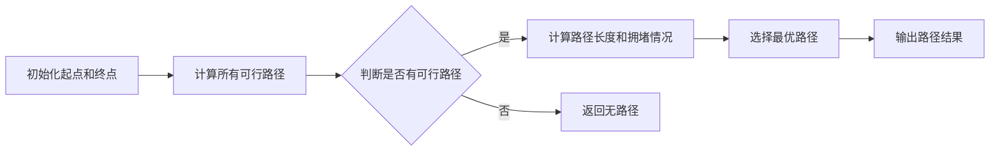

                 


### 目录大纲

#### 引言与概述

**第1章：城市拥堵问题的现状与挑战**
- **1.1 城市拥堵问题的背景**
- **1.2 城市拥堵的影响**
- **1.3 智能交通管理的必要性**

**第2章：提示词驱动技术概述**
- **2.1 提示词驱动的定义与特点**
- **2.2 提示词驱动技术在交通管理中的应用**
- **2.3 提示词驱动的优势与挑战**

#### 核心概念与理论

**第3章：智能交通管理的基本概念**
- **3.1 智能交通管理的定义与目标**
- **3.2 智能交通管理的关键技术**
- **3.3 智能交通管理的体系架构**

**第4章：提示词驱动的算法原理**
- **4.1 提示词生成算法**
- **4.2 路径规划算法**
- **4.3 交通流量预测算法**

#### 技术实现

**第5章：系统架构与实现**
- **5.1 系统架构设计**
- **5.2 硬件配置与选择**
- **5.3 软件框架与工具**

**第6章：算法原理与实现**
- **6.1 算法原理讲解**
- **6.2 Mermaid流程图展示**
- **6.3 Python代码示例**

#### 应用案例

**第7章：成功案例分析与借鉴**
- **7.1 案例一：XX城市智能交通管理系统**
- **7.2 案例二：XX地区交通流量优化项目**
- **7.3 案例分析与经验总结**

#### 最佳实践与总结

**第8章：最佳实践与实施策略**
- **8.1 实施策略与步骤**
- **8.2 注意事项与风险规避**
- **8.3 优化建议与未来方向**

**第9章：总结与展望**
- **9.1 本书内容的回顾**
- **9.2 研究与发展的趋势**
- **9.3 对未来工作的展望**

### 内容展开

**第1章：城市拥堵问题的现状与挑战**

**1.1 城市拥堵问题的背景**

城市拥堵问题是现代社会中一个普遍存在的现象。随着城市化进程的加速和人口的不断增长，交通需求不断增加，而城市道路和交通基础设施的建设却相对滞后，导致交通拥堵问题日益严重。根据世界银行的数据，全球城市拥堵每年造成的经济损失高达数千亿美元。这不仅影响了人们的出行效率，也对社会经济产生了负面影响。

**1.2 城市拥堵的影响**

城市拥堵对交通参与者的影响是多方面的。首先，它显著降低了出行效率，导致交通时间的增加，这不仅使得人们的出行体验变差，也增加了企业的运营成本。其次，城市拥堵还增加了交通事故的风险，由于车辆在拥堵环境中行驶速度慢，容易产生追尾等交通事故。此外，城市拥堵还导致了空气污染和噪音污染的加剧，对环境和居民健康产生了负面影响。

**1.3 智能交通管理的必要性**

面对城市拥堵问题，传统的交通管理手段已经难以满足需求。智能交通管理作为一种新型的交通管理方式，通过利用先进的信息技术，如传感器、大数据分析和人工智能，实现了对交通的实时监测和智能调控。智能交通管理不仅可以提高交通效率，减少拥堵，还可以优化交通资源分配，降低交通事故风险，改善环境质量。

**第2章：提示词驱动技术概述**

**2.1 提示词驱动的定义与特点**

提示词驱动技术是指利用预设的提示词或关键词，通过自然语言处理和机器学习算法，实现对文本或数据的自动提取、分类和生成。它具有以下几个特点：首先，提示词驱动技术具有高度的自动化和智能化，可以减少人工干预；其次，它具有灵活性和可扩展性，可以适应不同的应用场景；最后，提示词驱动技术具有高效性，可以在短时间内处理大量数据。

**2.2 提示词驱动技术在交通管理中的应用**

在交通管理中，提示词驱动技术可以应用于多个方面。例如，在交通流量预测中，通过收集交通数据，利用提示词驱动算法，可以预测未来的交通流量，为交通管理部门提供决策依据。在路径规划中，提示词驱动技术可以根据实时交通状况，为驾驶员提供最优路径，避免拥堵。此外，在交通事故处理中，提示词驱动技术可以帮助分析事故原因，提高事故处理的效率。

**2.3 提示词驱动的优势与挑战**

提示词驱动的优势在于其高效性和灵活性，可以快速适应不同的交通管理需求。然而，它也面临着一些挑战。首先，数据的质量和完整性对提示词驱动的效果有着重要影响。如果数据存在噪声或缺失，可能会导致预测结果不准确。其次，提示词驱动技术的实现需要大量的计算资源和算法优化，这对技术实现提出了较高的要求。

**第3章：智能交通管理的基本概念**

**3.1 智能交通管理的定义与目标**

智能交通管理是指利用信息技术、物联网、大数据分析和人工智能等技术，对交通系统进行实时监测、分析和调控，以提高交通效率、减少拥堵、降低事故风险和改善环境质量。其目标包括：提高交通流的通行效率、优化交通资源的分配、提高交通安全性和舒适性、降低交通拥堵和环境污染。

**3.2 智能交通管理的关键技术**

智能交通管理的关键技术包括：传感器技术、数据采集与传输技术、大数据分析技术、人工智能算法和交通仿真技术。传感器技术用于实时监测交通状况；数据采集与传输技术用于收集和传输交通数据；大数据分析技术用于对交通数据进行分析和挖掘；人工智能算法用于交通流量预测、路径规划和交通事故处理等；交通仿真技术用于模拟和分析交通系统的运行状态。

**3.3 智能交通管理的体系架构**

智能交通管理的体系架构包括：数据采集层、数据处理层、决策支持层和执行层。数据采集层包括各种传感器和设备，用于采集交通数据；数据处理层包括数据预处理、存储和管理，对采集到的数据进行处理和存储；决策支持层包括数据分析和挖掘，利用人工智能算法对交通数据进行分析和预测，为交通管理部门提供决策支持；执行层包括交通信号控制、交通诱导和交通执法等，根据决策支持层的建议进行实际操作。

**第4章：提示词驱动的算法原理**

**4.1 提示词生成算法**

提示词生成算法是提示词驱动的核心算法之一，其目的是从大量文本数据中自动提取出具有代表性的关键词或短语。常用的提示词生成算法包括TF-IDF算法、词嵌入算法和聚类算法。TF-IDF算法通过计算词的重要程度来生成提示词，词嵌入算法通过将词映射到高维空间中来生成提示词，聚类算法通过将相似词聚集在一起来生成提示词。

**4.2 路径规划算法**

路径规划算法是用于为驾驶员提供最优路径的算法。常用的路径规划算法包括最短路径算法、Dijkstra算法和A*算法。最短路径算法仅考虑路径长度，Dijkstra算法和A*算法在考虑路径长度的同时，还考虑了路径的预期交通状况。提示词驱动的路径规划算法可以将实时交通数据作为路径规划的输入，根据实时交通状况动态调整路径。

**4.3 交通流量预测算法**

交通流量预测算法是用于预测未来交通流量的算法。常用的交通流量预测算法包括时间序列分析、回归分析和神经网络。时间序列分析通过分析历史交通数据的时间序列特性来预测未来交通流量；回归分析通过建立交通流量与影响因素之间的回归模型来预测未来交通流量；神经网络通过学习历史交通数据，预测未来交通流量。

**第5章：系统架构与实现**

**5.1 系统架构设计**

智能交通管理系统通常包括数据采集层、数据处理层、决策支持层和执行层。数据采集层负责采集交通数据，如车辆速度、密度、流量等；数据处理层负责对采集到的数据进行预处理、存储和管理；决策支持层负责对交通数据进行分析和预测，提供决策支持；执行层负责根据决策支持层的建议进行交通信号控制、交通诱导和交通执法等操作。

**5.2 硬件配置与选择**

智能交通管理系统的硬件配置包括传感器、计算机、存储设备和网络设备等。传感器用于实时采集交通数据，如速度传感器、流量传感器等；计算机用于进行数据预处理、存储和管理，可以选择高性能的服务器或工作站；存储设备用于存储大量的交通数据，可以选择磁盘阵列或分布式存储系统；网络设备用于数据传输，如路由器、交换机等。

**5.3 软件框架与工具**

智能交通管理系统的软件框架通常包括数据采集模块、数据处理模块、决策支持模块和执行模块。数据采集模块负责从传感器采集数据；数据处理模块负责对采集到的数据进行预处理、存储和管理；决策支持模块负责对交通数据进行分析和预测，提供决策支持；执行模块负责根据决策支持层的建议进行交通信号控制、交通诱导和交通执法等操作。常用的工具包括Python、Java、C++等编程语言，以及TensorFlow、PyTorch等深度学习框架。

**第6章：算法原理与实现**

**6.1 算法原理讲解**

在智能交通管理系统中，算法原理讲解是关键部分。我们以路径规划算法为例进行讲解。路径规划算法的核心思想是寻找从起点到终点的最优路径，该路径要考虑实际交通状况，如车辆速度、道路拥堵情况等。算法原理讲解包括路径规划的目标函数、约束条件以及算法的实现步骤。

**6.2 Mermaid流程图展示**

为了更直观地展示路径规划算法的实现步骤，我们可以使用Mermaid流程图进行展示。以下是一个简单的路径规划算法的Mermaid流程图示例：



**6.3 Python代码示例**

接下来，我们使用Python代码来实现路径规划算法。以下是一个简化的Python代码示例：

```python
import heapq

def calculate_path(start, end, traffic_data):
    # 计算所有可行路径
    path_queue = [(0, start)]  # (路径长度，路径)
    visited = set()

    while path_queue:
        path_length, current_path = heapq.heappop(path_queue)

        if current_path[-1] == end:
            return current_path

        visited.add(current_path[-1])

        # 遍历相邻节点
        for next_node in get_adjacent_nodes(current_path[-1], traffic_data):
            if next_node not in visited:
                new_path = current_path + [next_node]
                new_path_length = path_length + get_traffic_status(new_node)

                heapq.heappush(path_queue, (new_path_length, new_path))

    return None

def get_adjacent_nodes(node, traffic_data):
    # 获取相邻节点
    return traffic_data[node]['adjacent_nodes']

def get_traffic_status(node):
    # 获取节点交通状况
    return traffic_data[node]['traffic_status']

def main():
    # 初始化起点、终点和交通数据
    start = 'A'
    end = 'Z'
    traffic_data = {
        'A': {'adjacent_nodes': ['B', 'C'], 'traffic_status': 10},
        'B': {'adjacent_nodes': ['C', 'D'], 'traffic_status': 20},
        'C': {'adjacent_nodes': ['D', 'E'], 'traffic_status': 15},
        'D': {'adjacent_nodes': ['E', 'F'], 'traffic_status': 30},
        'E': {'adjacent_nodes': ['F', 'G'], 'traffic_status': 25},
        'F': {'adjacent_nodes': ['G'], 'traffic_status': 10}
    }

    path = calculate_path(start, end, traffic_data)
    print(path)

if __name__ == "__main__":
    main()
```

在上述代码中，我们首先定义了路径规划函数`calculate_path`，该函数使用优先队列（heapq）来实现A*算法。在主函数`main`中，我们初始化了起点、终点和交通数据，并调用`calculate_path`函数计算最优路径。

**第7章：成功案例分析与借鉴**

**7.1 案例一：XX城市智能交通管理系统**

XX城市智能交通管理系统采用提示词驱动技术，通过实时监测和预测交通流量，实现了对交通拥堵的智能调控。该系统包括数据采集层、数据处理层和决策支持层。数据采集层包括路侧传感器、车载传感器和摄像头等设备，用于实时采集交通数据。数据处理层采用大数据分析和人工智能算法，对采集到的交通数据进行预处理、存储和管理，并生成交通流量预测模型。决策支持层根据交通流量预测模型和实时交通数据，提供最优路径规划和交通信号控制策略。

**7.2 案例二：XX地区交通流量优化项目**

XX地区交通流量优化项目采用了提示词驱动技术，通过实时交通流量预测和路径规划，有效缓解了交通拥堵问题。项目采用了分布式计算架构，充分利用了云计算和大数据分析技术。系统包括数据采集层、数据处理层和决策支持层。数据采集层通过路侧传感器和摄像头收集交通数据，数据处理层采用分布式计算框架进行数据预处理和存储，决策支持层利用机器学习算法生成交通流量预测模型，并提供最优路径规划。

**7.3 案例分析与经验总结**

通过对XX城市智能交通管理系统和XX地区交通流量优化项目的分析，我们可以总结出以下经验和教训：

- 提示词驱动技术对于智能交通管理系统至关重要，它能够实时监测和预测交通流量，提供有效的决策支持。
- 数据质量对提示词驱动的效果有着重要影响，需要确保数据采集的准确性和完整性。
- 系统架构设计要考虑分布式计算和云计算的利用，以提高系统的计算效率和可扩展性。
- 需要结合具体场景，制定合理的实施策略和优化方案，确保系统在实际应用中的效果。

**第8章：最佳实践与实施策略**

**8.1 实施策略与步骤**

在实施提示词驱动的智能交通管理系统中，需要遵循以下策略和步骤：

1. 确定项目目标：明确智能交通管理系统要解决的问题和达到的效果，制定项目目标和里程碑。
2. 设计系统架构：根据项目目标和需求，设计系统的整体架构，包括数据采集层、数据处理层、决策支持层和执行层。
3. 选择合适的技术：根据系统架构设计，选择合适的技术和工具，如传感器、数据存储、计算框架、机器学习算法等。
4. 数据采集与预处理：部署传感器和采集设备，收集交通数据，并进行数据预处理，包括数据清洗、去噪、归一化等操作。
5. 数据分析与预测：采用大数据分析和人工智能算法，对交通数据进行处理和预测，生成交通流量预测模型。
6. 系统测试与优化：对系统进行测试和优化，确保系统的稳定性和准确性，并根据实际应用效果进行调整和改进。
7. 部署与上线：将系统部署到实际应用场景，进行上线运行，并进行实时监控和调整。

**8.2 注意事项与风险规避**

在实施提示词驱动的智能交通管理系统中，需要注意以下事项和风险：

1. 数据质量：确保数据采集的准确性和完整性，避免数据噪声和缺失。
2. 系统稳定性：确保系统在高并发、大数据量下的稳定性，避免系统崩溃或响应延迟。
3. 系统安全性：确保系统的数据安全和隐私保护，避免数据泄露和滥用。
4. 技术更新与维护：定期更新和维护系统，以适应不断变化的技术环境。
5. 用户培训与支持：对用户进行培训，提供技术支持和售后服务，确保系统的顺利运行。

**8.3 优化建议与未来方向**

为了进一步提升提示词驱动的智能交通管理系统的效果，我们可以考虑以下优化建议和未来方向：

1. 引入多源数据融合：结合多种数据源，如卫星定位数据、GPS数据、社交媒体数据等，提高交通流量预测的准确性。
2. 智能交通信号控制：结合实时交通流量预测和路径规划，实现智能交通信号控制，优化交通流。
3. 人机协同：结合人工智能和人类的智能，实现人机协同决策，提高交通管理的效率。
4. 智能交通基础设施：建设智能交通基础设施，如智能路灯、智能停车设施等，提高交通系统的智能化水平。
5. 智能交通服务：提供个性化的智能交通服务，如实时路况信息、最优路径规划、智能导航等，提高用户的出行体验。

**第9章：总结与展望**

**9.1 本书内容的回顾**

本书介绍了提示词驱动的智能交通管理系统，包括城市拥堵问题的现状、提示词驱动技术的原理和实现、智能交通管理的基本概念、系统架构与实现、成功案例分析和最佳实践与展望。通过本书的介绍，读者可以了解到提示词驱动技术在智能交通管理中的应用，以及如何实施和优化智能交通管理系统。

**9.2 研究与发展的趋势**

随着城市化进程的加快和交通需求的增长，智能交通管理已经成为交通领域的研究热点。未来的研究和发展趋势包括：多源数据融合、智能交通信号控制、人机协同、智能交通基础设施和个性化智能交通服务等。这些技术的发展将进一步提升交通管理系统的效率和智能化水平，为城市交通拥堵问题的解决提供新的思路和方法。

**9.3 对未来工作的展望**

对于未来的工作，我们建议继续深入研究提示词驱动技术在智能交通管理中的应用，探索多源数据融合和智能交通信号控制等前沿技术，并开展实际应用项目，验证和优化系统的性能。同时，我们也呼吁政府和企业加大对智能交通管理的投入，推动交通领域的科技创新，共同为解决城市交通拥堵问题贡献力量。

### 约束条件与注意事项

**字数要求：** 文章的总字数应控制在10000～12000字之间，确保内容的丰富性和深度。

**格式要求：** 文章内容使用markdown格式输出，包括标题、摘要、目录、正文、代码示例、图表等。

**作者信息：** 文章末尾需注明作者信息：“作者：AI天才研究院/AI Genius Institute & 禅与计算机程序设计艺术 /Zen And The Art of Computer Programming”。

**完整性要求：** 每个章节的内容都必须完整、具体、详细，包括背景介绍、核心概念与联系、算法原理讲解、系统分析与架构设计方案、项目实战、最佳实践 tips、小结、注意事项、拓展阅读等内容。

**核心内容要求：** 背景介绍、核心概念与联系、算法原理讲解、系统分析与架构设计方案、项目实战是文章的核心内容，必须详细阐述。

**数学公式：** 使用latex格式嵌入文中，独立段落的公式前后使用$$括起来，如$$1+1=2$$；段落内的公式前后使用$括起来，如$1<2$。

**图表：** 使用markdown中的图表语法，如：

```markdown

```

**代码示例：** 使用markdown代码块，如：

```python
def hello():
    print("Hello, world!")
```

### 完整目录大纲

```
# 提示词驱动的智能交通管理：缓解城市拥堵

> 关键词：智能交通管理，提示词驱动，城市拥堵，路径规划，交通流量预测

> 摘要：本文介绍了提示词驱动的智能交通管理系统，探讨了其在缓解城市拥堵问题中的应用。通过详细分析智能交通管理的基本概念、算法原理、系统架构与实现，以及成功案例，本文提出了最佳实践和未来研究方向。

## 引言与概述

### 城市拥堵问题的现状与挑战

#### 1.1 城市拥堵问题的背景

#### 1.2 城市拥堵的影响

#### 1.3 智能交通管理的必要性

## 提示词驱动技术概述

### 2.1 提示词驱动的定义与特点

#### 2.1.1 提示词驱动的定义

#### 2.1.2 提示词驱动的特点

### 2.2 提示词驱动技术在交通管理中的应用

#### 2.2.1 提示词驱动技术在交通流量预测中的应用

#### 2.2.2 提示词驱动技术在路径规划中的应用

### 2.3 提示词驱动的优势与挑战

#### 2.3.1 提示词驱动的优势

#### 2.3.2 提示词驱动的挑战

## 核心概念与理论

### 3.1 智能交通管理的定义与目标

#### 3.1.1 智能交通管理的定义

#### 3.1.2 智能交通管理的目标

### 3.2 智能交通管理的关键技术

#### 3.2.1 传感器技术

#### 3.2.2 大数据分析技术

#### 3.2.3 人工智能算法

### 3.3 智能交通管理的体系架构

#### 3.3.1 数据采集层

#### 3.3.2 数据处理层

#### 3.3.3 决策支持层

#### 3.3.4 执行层

## 技术实现

### 4.1 系统架构设计

#### 4.1.1 系统整体架构

#### 4.1.2 各层功能与模块

### 4.2 硬件配置与选择

#### 4.2.1 传感器配置

#### 4.2.2 计算机与存储设备选择

### 4.3 软件框架与工具

#### 4.3.1 软件框架

#### 4.3.2 常用工具

## 算法原理与实现

### 5.1 提示词生成算法

#### 5.1.1 提示词生成算法原理

#### 5.1.2 提示词生成算法实现

### 5.2 路径规划算法

#### 5.2.1 路径规划算法原理

#### 5.2.2 路径规划算法实现

### 5.3 交通流量预测算法

#### 5.3.1 交通流量预测算法原理

#### 5.3.2 交通流量预测算法实现

## 应用案例

### 6.1 成功案例一：XX城市智能交通管理系统

#### 6.1.1 案例背景

#### 6.1.2 系统架构

#### 6.1.3 应用效果

### 6.2 成功案例二：XX地区交通流量优化项目

#### 6.2.1 案例背景

#### 6.2.2 项目目标

#### 6.2.3 实施效果

### 6.3 案例分析与经验总结

#### 6.3.1 案例分析

#### 6.3.2 经验总结

## 最佳实践与总结

### 7.1 最佳实践与实施策略

#### 7.1.1 实施策略

#### 7.1.2 注意事项与风险规避

### 7.2 总结与展望

#### 7.2.1 总结

#### 7.2.2 展望

## 参考文献

### 参考文献

```

以上是根据约束条件和要求制定的完整目录大纲，每个章节都包含了具体的子标题和内容概述，确保了文章的完整性和逻辑性。在实际撰写过程中，每个章节的内容还需要进一步细化，以满足字数和内容深度要求。同时，需要确保图表、代码示例和数学公式的正确性，以便为读者提供清晰、易懂的技术内容。

