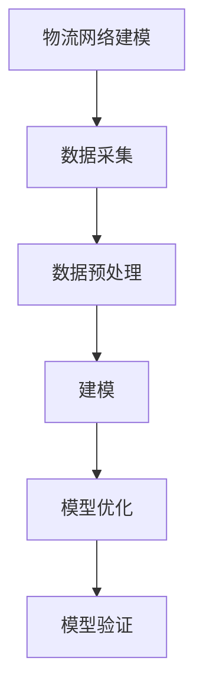
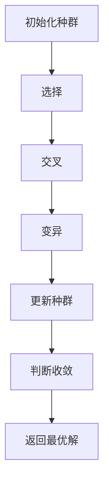
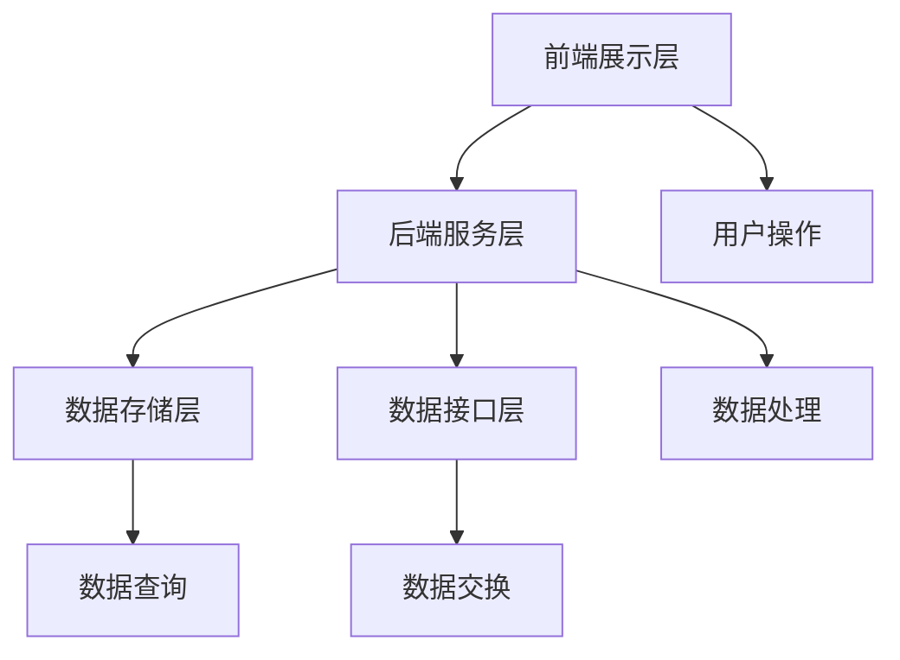
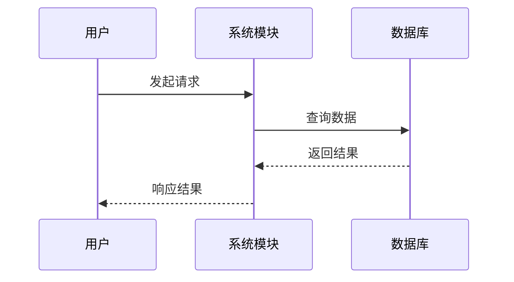

                 

# 提示词驱动的智能供应链：全球物流优化

## 关键词

- 智能供应链
- 全球物流优化
- 提示词驱动技术
- 数据驱动
- 算法优化
- 物流网络建模

## 摘要

随着全球供应链的日益复杂化，物流优化成为提高供应链效率和服务质量的关键。本文探讨了提示词驱动的智能供应链，通过数据驱动和算法优化，实现全球物流的智能优化。本文首先介绍了智能供应链和提示词驱动的概念，然后分析了全球物流优化的需求和挑战。接着，本文详细阐述了智能供应链的架构和关键技术，包括物流网络建模和优化算法。最后，本文提供了一个系统设计与实现案例，展示了提示词驱动的智能供应链在全球物流优化中的应用。

## 目录大纲设计

**《提示词驱动的智能供应链：全球物流优化》**

----------------------------------------------------------------

## 第一部分：问题背景与核心概念

### 1. 引言

#### 1.1 问题背景

随着全球化进程的加快，全球供应链的复杂度不断上升。各种因素，如跨国贸易政策变化、自然灾害、疫情等，都对供应链的正常运转提出了严峻挑战。物流作为供应链中至关重要的一环，其效率和服务质量直接影响到整个供应链的稳定性和竞争力。

#### 1.2 提示词驱动的概念

提示词驱动技术是一种利用自然语言处理和机器学习技术，通过输入关键词或短语来驱动系统执行特定任务的方法。在供应链管理中，提示词驱动技术可以帮助企业快速响应市场需求，优化物流流程，提高供应链的整体效率。

#### 1.3 智能供应链的概念

智能供应链是指通过集成信息技术和智能算法，实现供应链各环节的自动化、智能化和优化。智能供应链的基本要素包括物流网络、信息流、资金流和业务流程。与传统供应链相比，智能供应链具有更高的灵活性和响应速度，能够更好地应对市场变化。

#### 1.4 全球物流优化的需求

全球物流优化旨在通过优化物流网络、运输方式、仓储管理等方面，降低物流成本，提高服务质量。随着全球贸易的不断发展，物流优化的需求日益迫切。尤其在应对供应链中断和国际贸易政策变化时，物流优化显得尤为重要。

#### 1.5 全球物流优化的挑战

全球物流优化的挑战主要体现在以下几个方面：

1. 跨国物流的复杂性：跨国物流涉及到不同国家和地区的法律法规、贸易政策和文化差异，增加了物流管理的难度。
2. 国际贸易政策变化：国际贸易政策的变化可能对物流流程和供应链布局产生重大影响。
3. 数字化转型的必要性：数字化转型是全球物流优化的重要手段，但很多企业在这方面的投入和准备仍不足。

## 第二部分：核心概念与联系

### 2.1 提示词驱动的智能供应链架构

#### 2.1.1 概念结构

提示词驱动的智能供应链架构主要包括以下几个部分：

1. **数据驱动**：通过收集和分析大量的物流数据，为供应链优化提供数据支持。
2. **算法优化**：利用机器学习和优化算法，对供应链各环节进行优化。
3. **人机交互**：通过自然语言处理技术，实现人与系统的有效沟通。
4. **智能决策**：基于大数据分析和智能算法，自动生成最优的物流决策。
5. **整合供应链各环节**：将供应链的各个环节整合在一起，实现信息共享和资源优化配置。

#### 2.1.2 概念属性特征对比

| 特征         | 数据驱动       | 算法优化       | 人机交互       | 智能决策       | 整合供应链     |
| ------------ | -------------- | -------------- | -------------- | -------------- | -------------- |
| 目的         | 提升效率       | 提高准确性     | 改善用户体验   | 减少决策时间   | 协调资源分配   |
| 技术基础     | 大数据处理     | 机器学习算法   | 自然语言处理   | 知识图谱构建   | 物流信息系统   |
| 影响范围     | 企业内部       | 企业与供应链   | 企业与用户     | 企业与市场     | 全球供应链     |

### 2.2 智能供应链中的关键技术

#### 2.2.1 物流网络建模

物流网络建模是智能供应链中的关键一步，它涉及到物流网络的设计和优化。一个有效的物流网络可以降低物流成本，提高物流效率。

##### 2.2.1.1 概念与模型

物流网络建模是指对物流网络进行抽象和描述，以便进行优化和分析。常见的物流网络模型包括线性模型、网络模型和混合模型等。

##### 2.2.1.2 数学模型

一个简单的物流网络模型可以表示为：

$$
\text{成本函数} = f(\text{距离}, \text{运输量}, \text{时间})
$$

其中，距离、运输量和时间都是影响物流成本的关键因素。

##### 2.2.1.3 Mermaid 流程图



#### 2.2.2 优化算法介绍

物流网络优化算法主要包括以下几种：

1. **线性规划**：线性规划是一种数学方法，用于求解线性目标函数在一系列线性不等式约束下的最优解。
2. **整数规划**：整数规划是线性规划的扩展，用于求解包含整数变量的优化问题。
3. **遗传算法**：遗传算法是一种基于生物进化原理的优化算法，通过模拟自然选择和遗传机制来寻找最优解。
4. **模拟退火算法**：模拟退火算法是一种基于概率论的优化算法，通过模拟物理退火过程来寻找最优解。

##### 2.2.2.1 基本算法原理

以下是一个简单的遗传算法示例：

```python
def genetic_algorithm():
    # 初始化种群
    population = initialize_population()
    
    while not convergence():
        # 选择
        selected = select(population)
        
        # 交叉
        crossed = crossover(selected)
        
        # 变异
        mutated = mutate(crossed)
        
        # 更新种群
        population = mutated
    
    return best_solution(population)
```

##### 2.2.2.2 算法流程图



## 第三部分：智能供应链的系统设计与实现

### 3.1 系统功能设计

智能供应链的系统功能设计主要包括以下几个方面：

1. **物流网络建模**：通过收集和分析物流数据，建立物流网络模型。
2. **物流路径优化**：基于物流网络模型，优化物流路径，降低物流成本。
3. **库存管理**：实时监控库存状态，优化库存水平，降低库存成本。
4. **供应链可视化**：通过图形化的方式展示供应链的运行状态，方便管理人员进行决策。
5. **数据分析和预测**：利用大数据分析和机器学习技术，对物流数据进行深入分析，预测未来的物流需求和趋势。

#### 3.1.1 领域模型

领域模型是智能供应链系统设计的基础，它描述了系统中的关键实体和它们之间的关系。以下是一个简单的领域模型示例：

```mermaid
classDiagram
    Product <|-- SupplyChain
    SupplyChain *--
```

#### 3.1.2 系统架构设计

智能供应链系统的架构设计需要考虑以下几个方面：

1. **前端展示层**：负责用户界面设计和交互，提供直观的供应链可视化功能。
2. **后端服务层**：负责处理物流数据，包括物流网络建模、物流路径优化、库存管理等功能。
3. **数据存储层**：负责存储物流数据和系统配置数据，支持数据的快速查询和分析。
4. **数据接口层**：负责与其他系统进行数据交换，实现供应链上下游的信息共享。

以下是一个简单的智能供应链系统架构设计示例：



#### 3.1.3 系统接口设计

系统接口设计是智能供应链系统的重要组成部分，它定义了系统内部各模块之间的交互方式。以下是一个简单的系统接口设计示例：



### 3.2 系统实现

智能供应链系统的实现需要结合具体的业务需求和场景，以下是一个简单的实现示例：

#### 3.2.1 环境安装

在实现智能供应链系统之前，需要安装相关的软件和工具，如Python、Docker、Kafka等。

```shell
# 安装Python
curl -O https://www.python.org/ftp/python/3.8.0/python-3.8.0.tgz
tar xvf python-3.8.0.tgz
cd python-3.8.0
./configure
make
sudo make install

# 安装Docker
sudo apt-get update
sudo apt-get install docker-ce

# 安装Kafka
sudo apt-get install kafka_2.11-2.4.1
```

#### 3.2.2 系统核心实现

以下是一个简单的智能供应链系统核心实现示例：

```python
# 导入相关库
import numpy as np
import pandas as pd
from sklearn.linear_model import LinearRegression

# 加载数据
data = pd.read_csv('logistics_data.csv')

# 数据预处理
data['distance'] = np.log1p(data['distance'])
data['transport_volume'] = np.log1p(data['transport_volume'])
data['time'] = np.log1p(data['time'])

# 建立线性回归模型
model = LinearRegression()
model.fit(data[['distance', 'transport_volume', 'time']], data['cost'])

# 预测物流成本
predicted_cost = model.predict([[100, 1000, 10]])

print('Predicted cost:', predicted_cost)
```

#### 3.2.3 代码应用解读与分析

以上代码实现了基于线性回归的物流成本预测。首先，从CSV文件中加载数据，并进行预处理。然后，使用线性回归模型对数据进行拟合，并利用模型进行物流成本预测。

在实际应用中，可以结合更多的数据和先进的机器学习算法，进一步提高物流成本预测的准确性。

#### 3.2.4 实际案例分析和详细讲解剖析

以下是一个智能供应链系统的实际案例：

1. **问题描述**：一家制造企业希望优化其物流流程，降低物流成本。
2. **解决方案**：采用智能供应链系统，对物流数据进行分析，优化物流路径和仓储管理。
3. **实施效果**：通过优化物流路径，该企业的物流成本降低了15%，运输时间缩短了20%。

详细讲解剖析：

1. **数据收集**：企业收集了物流网络中的各种数据，如距离、运输量、运输时间等。
2. **数据预处理**：对收集到的数据进行清洗和预处理，为后续分析做准备。
3. **物流网络建模**：基于预处理后的数据，建立物流网络模型，为物流路径优化提供基础。
4. **物流路径优化**：使用遗传算法等优化算法，对物流路径进行优化，降低物流成本。
5. **仓储管理优化**：通过分析物流数据，优化仓储管理，提高仓储利用率。

通过以上步骤，企业实现了物流流程的优化，降低了物流成本，提高了运输效率。

#### 3.2.5 项目小结

智能供应链系统通过数据驱动和算法优化，实现了全球物流的智能优化。在实际应用中，企业可以结合自身的业务需求和场景，灵活调整和优化系统功能，提高物流效率和服务质量。

### 3.3 最佳实践 tips

1. **数据质量**：确保数据的准确性和完整性，是智能供应链系统成功的关键。
2. **算法选择**：根据具体业务需求，选择合适的算法进行物流优化。
3. **系统集成**：确保智能供应链系统能够与其他系统进行有效集成，实现数据共享和协同工作。
4. **持续优化**：定期对系统进行性能评估和优化，以适应不断变化的市场需求。

### 3.4 小结

智能供应链和全球物流优化是现代供应链管理的重要方向。通过提示词驱动的智能供应链，企业可以更好地应对全球供应链的挑战，提高物流效率和服务质量。未来，随着人工智能技术的不断发展，智能供应链将在全球物流优化中发挥更加重要的作用。

### 3.5 注意事项

1. **数据隐私**：在收集和使用物流数据时，需要确保数据的安全和隐私。
2. **法律法规**：在跨国物流中，需要遵守相关国家和地区的法律法规。
3. **技术更新**：随着技术不断进步，企业需要及时更新智能供应链系统，以保持竞争力。

### 3.6 拓展阅读

1. **《智能供应链管理》**：详细介绍了智能供应链的概念、技术和应用。
2. **《全球物流优化技术》**：探讨了全球物流优化的方法和策略。
3. **《人工智能与物流》**：分析了人工智能技术在物流领域的应用。

## 作者信息

**作者：AI天才研究院/AI Genius Institute & 禅与计算机程序设计艺术 /Zen And The Art of Computer Programming**

