                 

### 引言

#### 核心概念术语说明

- **智能农业**：利用信息技术，如物联网、大数据、人工智能等，对农业进行高效管理和优化，以提高生产效率和作物产量。
- **提示词驱动**：通过特定的关键词或短语，触发和引导农业系统的操作，如种植、施肥、灌溉等。
- **精准种植**：根据作物生长环境、土壤条件等数据，精确地调整种植策略，实现优化生产。
- **收获预测**：利用历史数据和模型，对作物未来的收获量进行预测，以指导农业生产。

#### 问题背景

农业作为人类生活的基础产业，其发展直接关系到国家的粮食安全和生态环境。然而，传统的农业生产模式效率低下，受自然环境影响较大。随着科技的进步，智能农业成为了解决这一问题的有效途径。提示词驱动的智能农业，通过精准种植和收获预测，进一步提高农业生产的智能化水平，具有巨大的应用前景。

#### 问题描述

智能农业面临的关键问题包括：

1. **精准种植**：如何根据土壤、气候等数据，实现作物的精准种植？
2. **收获预测**：如何准确预测作物的收获量，以便合理规划生产？
3. **系统集成与优化**：如何将各种智能技术集成到一起，实现高效的农业管理？

#### 问题解决

通过引入提示词驱动的智能农业，可以逐步解决上述问题：

1. **精准种植**：利用传感器收集土壤、气候等数据，结合提示词生成技术，实现精准的种植策略。
2. **收获预测**：利用历史数据、机器学习和深度学习模型，对作物的收获量进行预测，指导生产决策。
3. **系统集成与优化**：设计合理的系统架构，集成各种智能技术，实现农业生产的自动化和智能化。

#### 边界与外延

本文主要探讨提示词驱动的智能农业在精准种植和收获预测方面的应用，但智能农业的范围远不止于此。未来，随着技术的不断发展，智能农业将涉及更多领域，如智能灌溉、病虫害监测、农产品质量追溯等。

#### 概念结构与核心要素组成

- **提示词驱动智能农业系统**：由传感器、数据收集与处理模块、决策支持系统、执行单元等组成。
- **核心概念**：提示词、传感器数据、种植策略、预测模型、系统架构。

通过上述核心概念和要素的相互作用，实现智能农业的精准种植和收获预测。接下来的章节将详细探讨这些要素的具体实现和应用。

### 核心概念与联系

#### 提示词生成与优化

**核心概念**：

提示词是驱动智能农业系统运行的关键，它代表了特定操作或任务的需求。提示词生成是指从大量的农业数据中提取出有用的信息，形成可操作的提示词。而提示词优化则是提升提示词生成效率和准确性的过程。

**概念属性特征对比表格**：

| 对比项 | 提示词生成 | 提示词优化 |
| ------ | ---------- | ---------- |
| 目标 | 从数据中提取提示词 | 提高提示词的效率和准确性 |
| 技术手段 | 数据清洗、特征提取、模式识别 | 特征选择、模型调整、算法改进 |
| 结果 | 提取出的提示词 | 更高效、更准确的提示词 |

**ER实体关系图架构**：

在提示词驱动的智能农业系统中，主要涉及的实体包括传感器数据、提示词、决策支持系统等。以下是ER实体关系图：

```mermaid
erDiagram
  数据源 --> 提示词生成器 : 提取
  提示词生成器 --> 提示词 : 生成
  提示词 --> 决策支持系统 : 驱动
```

#### 提示词生成技术

**原理**：

提示词生成技术主要通过以下步骤实现：

1. **数据收集**：从传感器、气象站、土壤监测设备等收集相关数据。
2. **特征提取**：对收集到的数据进行处理，提取出反映作物生长状况的关键特征。
3. **模式识别**：利用机器学习算法，从特征中识别出有用的模式，形成提示词。

**流程图**：

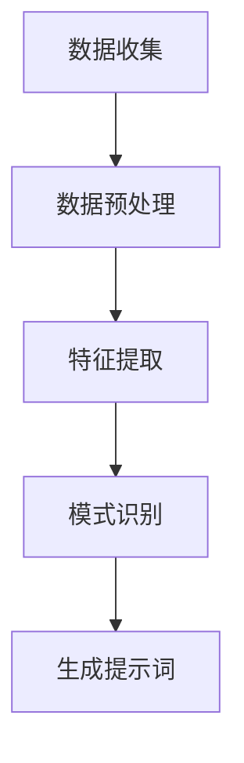

#### 提示词优化策略

**重要性**：

提示词优化的目的是提高系统的响应速度和准确性，减少不必要的操作。这对于实现智能农业的精准种植和收获预测至关重要。

**方法**：

1. **特征选择**：通过分析不同特征对提示词生成的影响，选择对系统最关键的特性。
2. **模型调整**：根据实际情况调整机器学习模型的参数，提高预测的准确性。
3. **算法改进**：探索和采用新的算法，如深度学习，以提高提示词优化的效果。

**流程图**：

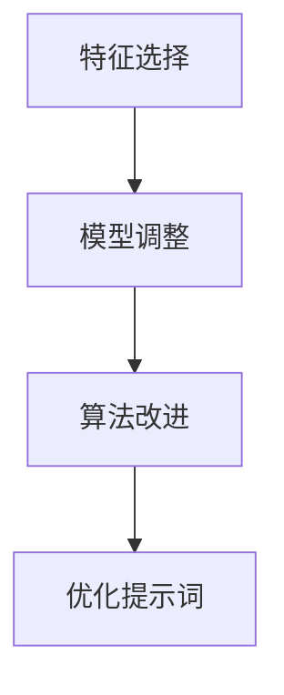

通过提示词生成与优化，智能农业系统能够更准确地理解和响应农业环境的变化，从而实现精准种植和高效管理。

### 提示词生成与优化

#### 提示词生成技术

**原理**：

提示词生成技术的核心在于从大量的农业数据中提取出反映作物生长状况的关键信息，以便智能农业系统能够进行精准的操作。这一过程可以分为以下步骤：

1. **数据收集**：从多种来源（如传感器、气象站、土壤监测设备等）收集与作物生长相关的数据。这些数据包括温度、湿度、土壤湿度、光照强度、降水量等。
   
2. **数据预处理**：对收集到的数据进行清洗、去噪和归一化处理，确保数据的质量和一致性。这一步骤对于后续的特征提取至关重要。

3. **特征提取**：从预处理后的数据中提取出对作物生长有显著影响的特征。常见的特征包括土壤中的养分含量、土壤的pH值、空气中的湿度、温度等。

4. **模式识别**：利用机器学习算法，如聚类分析、主成分分析（PCA）或神经网络，从特征数据中识别出潜在的规律和模式。这些模式将作为生成提示词的依据。

**算法原理讲解与mermaid流程图**：

以下是提示词生成过程的mermaid流程图：


在Python中，可以使用以下代码实现提示词生成：

```python
import numpy as np
import pandas as pd
from sklearn.preprocessing import StandardScaler
from sklearn.cluster import KMeans

# 假设data是包含农业数据的DataFrame
data = pd.read_csv('agriculture_data.csv')

# 数据预处理
scaler = StandardScaler()
processed_data = scaler.fit_transform(data)

# 特征提取
kmeans = KMeans(n_clusters=5)
clusters = kmeans.fit_predict(processed_data)

# 模式识别
# 使用聚类结果作为提示词
tips = [f"Cluster {i+1}" for i in clusters]

# 输出提示词
for i, tip in enumerate(tips):
    print(f"Record {i+1}: {tip}")
```

**数学模型和公式**：

在提示词生成过程中，常用的数学模型包括主成分分析（PCA）和K-means聚类。以下是其相关数学模型和公式：

- **主成分分析（PCA）**：
  $$X_{new} = P\Lambda^{1/2}$$
  其中，$X_{new}$ 是新特征空间，$P$ 是投影矩阵，$\Lambda$ 是协方差矩阵的特征值，$\Lambda^{1/2}$ 是特征值矩阵的平方根。

- **K-means聚类**：
  $$\min_{\mu_k, \lambda} \sum_{i=1}^n \sum_{k=1}^K ||x_i - \mu_k||^2$$
  其中，$x_i$ 是数据点，$\mu_k$ 是聚类中心，$K$ 是聚类数量。

**举例说明**：

假设我们有一个包含温度、湿度和光照强度的农业数据集。通过上述步骤，我们可以提取出以下提示词：

1. **高温提示**：如果温度超过30℃，生成提示词“高温预警”。
2. **低湿提示**：如果湿度低于40%，生成提示词“低湿预警”。
3. **强光照提示**：如果光照强度超过1000勒克斯，生成提示词“强光照预警”。

通过这种方式，智能农业系统能够实时监测环境变化，并根据提示词调整农业生产策略。

#### 提示词优化策略

**重要性**：

提示词优化是提升智能农业系统性能的关键步骤。通过优化，可以减少不必要的信息干扰，提高系统的响应速度和准确性，从而实现更精准的种植和收获预测。

**方法**：

1. **特征选择**：通过分析不同特征对提示词生成的影响，选择对系统最关键的特性。这可以通过统计方法（如相关性分析、卡方检验等）来实现。

2. **模型调整**：根据实际情况调整机器学习模型的参数，提高预测的准确性。例如，对于K-means聚类，可以调整聚类数量和初始聚类中心。

3. **算法改进**：探索和采用新的算法，如深度学习，以提高提示词优化的效果。深度学习模型通常能够处理更复杂的数据模式，并且具有更好的泛化能力。

**流程图**：


**特征选择**：

特征选择是提示词优化的第一步。以下是一个简单的特征选择流程：

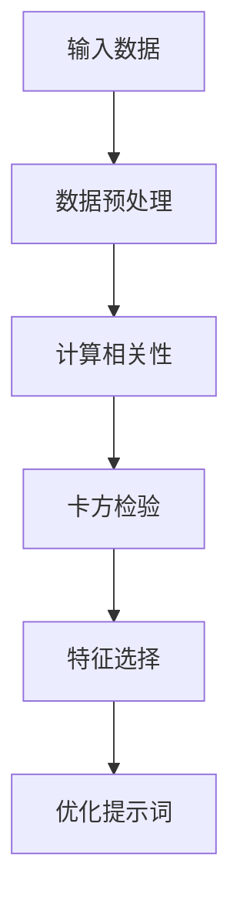

在Python中，可以使用以下代码进行特征选择：

```python
import pandas as pd
from sklearn.feature_selection import f_classif

# 假设data是包含农业数据的DataFrame
data = pd.read_csv('agriculture_data.csv')

# 数据预处理
X = data.drop(['target'], axis=1)
y = data['target']

# 计算特征相关性
correlation_matrix = data.corr().abs()

# 选择相关性高的特征
high_corr_features = correlation_matrix.index[correlation_matrix['target'].sort_values(ascending=False).head(5).index]

# 特征选择
selected_features = f_classif(X, y)

# 输出特征选择结果
print("Selected Features:", selected_features)
```

**模型调整**：

对于K-means聚类，可以通过调整聚类数量和初始聚类中心来优化模型。以下是一个简单的调整流程：

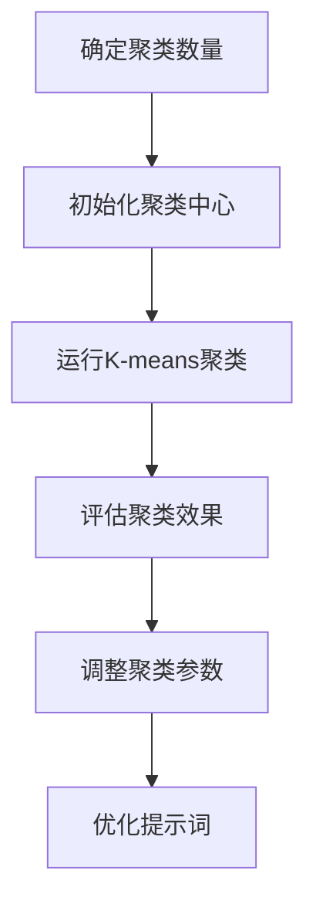

在Python中，可以使用以下代码调整K-means聚类参数：

```python
from sklearn.cluster import KMeans
import numpy as np

# 假设processed_data是预处理后的数据
processed_data = np.load('processed_data.npy')

# 确定聚类数量
inertia = []
for i in range(1, 11):
    kmeans = KMeans(n_clusters=i, init='k-means++', max_iter=300, n_init=10, random_state=0)
    kmeans.fit(processed_data)
    inertia.append(kmeans.inertia_)

# 画出聚类数量与惯性量之间的关系
plt.plot(range(1, 11), inertia)
plt.xlabel('Number of clusters')
plt.ylabel('Inertia')
plt.show()

# 选择最优聚类数量，例如5
num_clusters = 5

# 初始化聚类中心
kmeans = KMeans(n_clusters=num_clusters, init='k-means++', max_iter=300, n_init=10, random_state=0)
kmeans.fit(processed_data)

# 优化提示词
tips = [f"Cluster {i+1}" for i in kmeans.labels_]

# 输出优化后的提示词
for i, tip in enumerate(tips):
    print(f"Record {i+1}: {tip}")
```

通过上述方法，我们可以优化提示词生成，提高智能农业系统的性能。

### 精准种植技术

#### 植物生长监测

**核心概念**：

植物生长监测是指利用各种传感器技术，对作物生长过程中的关键参数进行实时监测，如温度、湿度、土壤湿度、光照强度、二氧化碳浓度等。这些参数对于作物的健康生长至关重要。

**监测方法**：

1. **传感器数据采集**：使用各种传感器，如温度传感器、湿度传感器、土壤湿度传感器、光照传感器等，收集作物生长环境的数据。
2. **数据传输**：将传感器采集到的数据通过无线传输技术（如Wi-Fi、LoRa、NB-IoT等）传输到中央控制系统。
3. **数据处理**：对传输到的数据进行预处理、清洗和归一化，以便后续分析。

**流程图**：

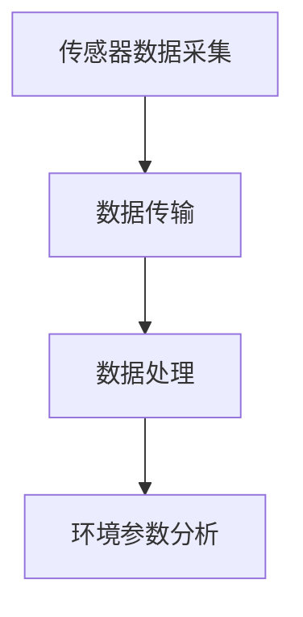

在Python中，可以使用以下代码实现植物生长监测：

```python
import numpy as np
import pandas as pd
from sklearn.preprocessing import StandardScaler

# 假设sensor_data是包含传感器采集的数据的DataFrame
sensor_data = pd.read_csv('sensor_data.csv')

# 数据预处理
scaler = StandardScaler()
preprocessed_data = scaler.fit_transform(sensor_data)

# 环境参数分析
# 假设我们关注温度和湿度
temperature = preprocessed_data[:, 0]
humidity = preprocessed_data[:, 1]

# 绘制温度-湿度关系图
plt.scatter(temperature, humidity)
plt.xlabel('Temperature')
plt.ylabel('Humidity')
plt.title('Temperature-Humidity Relationship')
plt.show()
```

**数据采集与分析**：

植物生长监测的关键在于数据的准确性和及时性。通过对传感器数据的实时采集和分析，我们可以及时发现作物生长中的问题，并采取相应的措施。

1. **数据采集**：使用传感器实时采集温度、湿度、土壤湿度、光照强度等数据。
2. **数据分析**：利用数据分析技术，如时间序列分析、趋势分析、异常检测等，对采集到的数据进行处理和分析。

**案例分析**：

假设我们监测到某块田地的温度和湿度低于正常范围，这可能导致作物生长受阻。通过以下步骤，我们可以分析并解决问题：

1. **数据分析**：分析传感器数据，确定温度和湿度低于正常范围的具体时间和区域。
2. **问题定位**：确定导致温度和湿度异常的原因，如设备故障、网络中断等。
3. **解决方案**：针对问题原因，采取相应的措施，如更换传感器、修复网络连接等。

通过植物生长监测，智能农业系统能够实时了解作物生长状况，及时发现并解决问题，实现精准种植。

#### 水肥管理

**核心概念**：

水肥管理是智能农业中至关重要的一环，它涉及对作物所需水分和养分的精准控制。通过科学的水肥管理，可以最大限度地提高作物的产量和品质，同时减少资源浪费和环境污染。

**管理原则**：

1. **因时因地制宜**：根据作物生长阶段、土壤类型、气候条件等因素，制定个性化水肥管理方案。
2. **精准控制**：利用传感器和自动化设备，实时监测土壤水分和养分含量，精确控制灌溉和施肥量。
3. **均衡施肥**：按照作物需肥规律，合理分配各种养分的比例，避免单一养分的过量或不足。

**优化技术**：

1. **土壤水分监测**：通过土壤湿度传感器，实时监测土壤水分含量，为灌溉决策提供数据支持。
2. **精准灌溉技术**：采用滴灌、喷灌等精准灌溉技术，根据土壤水分监测数据，精确控制灌溉量，避免水分浪费。
3. **智能施肥系统**：利用传感器监测土壤养分含量，结合作物需肥规律，智能调控施肥量，提高肥料利用率。

**案例分析**：

以小麦种植为例，水肥管理的优化流程如下：

1. **土壤水分监测**：在小麦生长的不同阶段，利用土壤湿度传感器监测土壤水分含量，确保土壤湿度保持在适宜范围内。
2. **灌溉决策**：根据土壤水分监测数据和天气预报，制定灌溉计划。在干旱天气或土壤水分低于阈值时，适时进行灌溉。
3. **施肥策略**：根据小麦生长阶段和土壤养分含量，制定合理的施肥计划。在小麦拔节期和孕穗期，适当增加氮肥和磷肥的施用量，促进作物生长。
4. **效果评估**：通过监测小麦的产量和品质，评估水肥管理的优化效果，不断调整和优化管理方案。

通过科学的水肥管理，智能农业系统能够实现水资源的节约和肥料的高效利用，提高作物的产量和品质，降低生产成本。

### 收获预测算法

#### 传统统计模型

**核心概念**：

传统统计模型是基于历史数据和统计理论，通过建立数学模型对作物收获量进行预测。这些模型相对简单，但具有一定的预测能力，适用于数据量较小或特征较为简单的场景。

**基本原理**：

1. **线性回归模型**：通过最小二乘法，建立作物收获量与影响因素（如土壤湿度、温度、光照等）之间的线性关系。
   $$Y = \beta_0 + \beta_1X_1 + \beta_2X_2 + ... + \beta_nX_n$$
   其中，$Y$ 是作物收获量，$X_1, X_2, ..., X_n$ 是影响因素，$\beta_0, \beta_1, ..., \beta_n$ 是模型参数。

2. **多项式回归模型**：在线性回归模型的基础上，引入多项式项，以捕捉更复杂的关系。
   $$Y = \beta_0 + \beta_1X_1 + \beta_2X_2^2 + ... + \beta_nX_n^n$$

**适用场景**：

- 数据量较小
- 特征较为简单
- 线性或多项式关系明显

**流程图**：

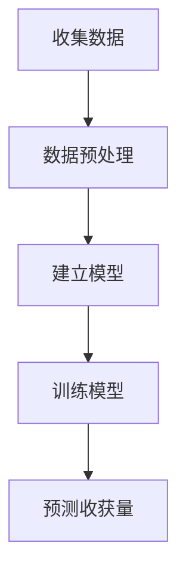

在Python中，可以使用以下代码实现线性回归模型：

```python
import numpy as np
from sklearn.linear_model import LinearRegression

# 假设X是特征矩阵，y是目标变量
X = np.array([[1, 2], [2, 3], [3, 4]])
y = np.array([3, 4, 5])

# 建立线性回归模型
model = LinearRegression()
model.fit(X, y)

# 预测收获量
predicted_y = model.predict(X)

# 输出结果
print("Predicted Y:", predicted_y)
```

**数学模型和公式**：

- **线性回归模型**：
  $$Y = \beta_0 + \beta_1X_1 + \beta_2X_2 + ... + \beta_nX_n$$

- **最小二乘法**：
  $$\min_{\beta_0, \beta_1, ..., \beta_n} \sum_{i=1}^n (Y_i - \beta_0 - \beta_1X_{i1} - \beta_2X_{i2} - ... - \beta_nX_{in})^2$$

#### 机器学习模型

**核心概念**：

机器学习模型通过从大量历史数据中学习规律，建立预测模型。与传统的统计模型相比，机器学习模型能够处理更复杂的关系，适用于数据量较大或特征复杂的场景。

**常见模型**：

1. **决策树**：通过递归划分特征空间，构建一棵树形模型，对作物收获量进行预测。
2. **随机森林**：基于决策树的集成方法，通过构建多棵决策树，提高预测准确性。
3. **支持向量机（SVM）**：通过找到最优的超平面对作物收获量进行分类。
4. **神经网络**：模拟人脑神经元的工作方式，通过多层网络对作物收获量进行预测。

**原理**：

1. **决策树**：利用特征的重要性，递归划分特征空间，构建树形模型。树的每个节点表示一个特征，每个分支表示该特征的不同取值。
   
2. **随机森林**：通过随机选择特征和样本子集，构建多棵决策树，并将它们集成起来，提高预测的准确性和稳定性。

3. **SVM**：通过找到一个最优的超平面，将不同类别的数据点分开，从而实现分类。

4. **神经网络**：通过多层神经网络，模拟人脑神经元的工作方式，对输入数据进行处理和预测。

**适用场景**：

- 数据量较大
- 特征复杂
- 非线性关系

**流程图**：

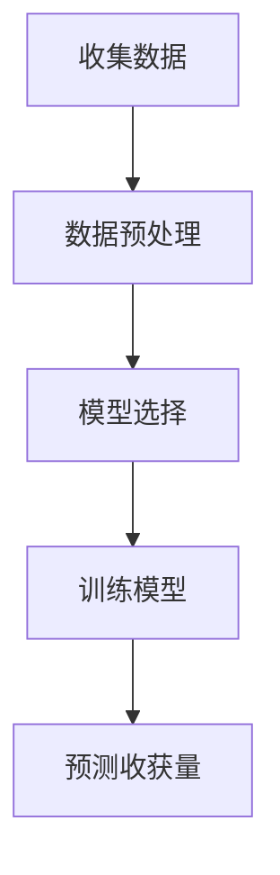

在Python中，可以使用以下代码实现随机森林模型：

```python
import numpy as np
from sklearn.ensemble import RandomForestRegressor

# 假设X是特征矩阵，y是目标变量
X = np.array([[1, 2], [2, 3], [3, 4]])
y = np.array([3, 4, 5])

# 建立随机森林模型
model = RandomForestRegressor(n_estimators=100)
model.fit(X, y)

# 预测收获量
predicted_y = model.predict(X)

# 输出结果
print("Predicted Y:", predicted_y)
```

**数学模型和公式**：

- **决策树**：
  $$y = g(\sum_{i=1}^n w_i x_i + b)$$
  其中，$w_i$ 是权重，$x_i$ 是特征值，$b$ 是偏置。

- **随机森林**：
  $$\hat{y} = \frac{1}{m} \sum_{i=1}^m g(\sum_{j=1}^n w_{ij} x_{ij} + b_j)$$
  其中，$m$ 是决策树的数量，$g$ 是决策树模型，$w_{ij}$ 是第$i$棵决策树的权重，$b_j$ 是第$j$个特征的偏置。

- **SVM**：
  $$\min_{w, b} \frac{1}{2} ||w||^2 + C \sum_{i=1}^n \max(0, 1 - y_i (w \cdot x_i + b))$$
  其中，$w$ 是权重向量，$b$ 是偏置，$C$ 是惩罚参数。

- **神经网络**：
  $$a_i = \sigma(\sum_{j=1}^n w_{ij} x_j + b_j)$$
  其中，$a_i$ 是神经元输出，$\sigma$ 是激活函数，$w_{ij}$ 是权重，$x_j$ 是输入特征，$b_j$ 是偏置。

#### 机器学习模型的应用

通过机器学习模型，智能农业系统能够处理大量的农业数据，并建立准确的预测模型，对作物收获量进行预测。以下是一个简单的应用案例：

**案例背景**：

某农业企业需要预测下一季水稻的收获量，以便合理规划生产资源和市场销售策略。该企业收集了多年的水稻生长数据，包括土壤湿度、温度、光照强度、降水量等。

**解决方案**：

1. **数据预处理**：对收集到的数据进行清洗和预处理，包括缺失值处理、异常值检测和特征提取。
2. **模型选择**：根据数据特点和预测目标，选择合适的机器学习模型。考虑到数据量较大且特征复杂，选择随机森林模型。
3. **模型训练**：使用历史数据训练随机森林模型，调整模型参数，优化模型性能。
4. **预测应用**：使用训练好的模型预测下一季水稻的收获量，并根据预测结果调整生产计划。

**实施步骤**：

1. **数据收集**：从传感器、气象站等渠道收集水稻生长数据。
2. **数据预处理**：对数据进行清洗和预处理，提取关键特征。
3. **模型训练**：使用历史数据训练随机森林模型，调整参数，优化模型性能。
4. **预测应用**：使用训练好的模型预测下一季水稻的收获量，制定生产计划。
5. **效果评估**：对比实际收获量和预测结果，评估模型性能，不断优化和调整。

通过机器学习模型的应用，智能农业系统能够准确预测作物收获量，为企业提供科学的生产决策依据，提高农业生产效益。

### 深度学习模型

#### 深度学习原理

**核心概念**：

深度学习是一种基于人工神经网络的学习方法，通过多层网络结构对复杂的数据进行建模和预测。与传统的机器学习模型相比，深度学习能够自动提取数据中的特征，具有更强的表达能力和泛化能力。

**基本原理**：

1. **神经网络基础**：神经网络由多个神经元组成，每个神经元接收输入信号，通过加权求和后激活输出。神经元的激活函数（如ReLU、Sigmoid、Tanh等）用于引入非线性特性。
2. **多层网络结构**：深度学习通过多层网络结构，实现对数据的逐层抽象和表示。每层网络将前一层的输出作为输入，通过非线性变换提取更高层次的特征。
3. **反向传播算法**：在训练过程中，深度学习利用反向传播算法，通过不断调整网络权重和偏置，最小化损失函数，从而优化模型性能。

**优势**：

- **自动特征提取**：深度学习能够自动从数据中学习特征，无需人工干预。
- **强大的表达力**：多层网络结构能够捕捉复杂的数据模式和关系。
- **泛化能力**：通过大量数据的训练，深度学习模型具有较好的泛化能力，能够应对新的数据。

**流程图**：

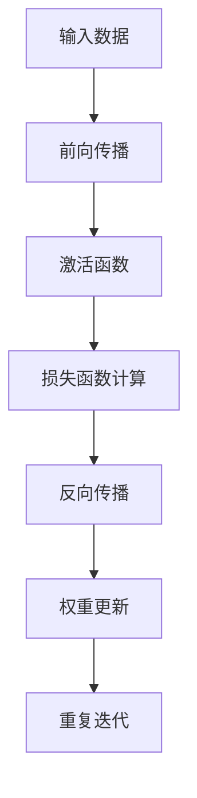

#### 深度学习在收获预测中的应用

**原理**：

在收获预测中，深度学习模型通过学习历史数据中的规律和模式，建立预测模型，对未来的作物收获量进行预测。具体应用步骤如下：

1. **数据预处理**：对收集到的数据进行清洗和预处理，包括缺失值处理、异常值检测和特征提取。
2. **模型构建**：设计合适的深度学习模型结构，包括输入层、隐藏层和输出层。
3. **模型训练**：使用历史数据训练模型，通过反向传播算法调整模型参数，优化模型性能。
4. **预测应用**：使用训练好的模型对未来的作物收获量进行预测，并根据预测结果调整农业生产策略。

**案例**：

以水稻收获预测为例，利用深度学习模型进行作物收获量的预测。

**步骤**：

1. **数据收集**：收集水稻生长数据，包括土壤湿度、温度、光照强度、降水量等。
2. **数据预处理**：对数据进行清洗和预处理，提取关键特征，例如：
   ```mermaid
   graph TD
     A[土壤湿度] --> B[温度]
     B --> C[光照强度]
     C --> D[降水量]
   ```
3. **模型构建**：设计深度学习模型结构，例如：
   ```mermaid
   graph TD
     A[输入层] --> B[隐藏层1] --> C[隐藏层2] --> D[输出层]
   ```
4. **模型训练**：使用历史数据训练模型，优化模型参数，例如：
   ```python
   model.fit(X_train, y_train, epochs=100, batch_size=32, validation_split=0.2)
   ```
5. **预测应用**：使用训练好的模型对未来的水稻收获量进行预测，并根据预测结果调整农业生产策略。

通过深度学习模型的应用，智能农业系统能够准确预测作物收获量，为农业生产提供科学的决策依据，提高生产效益。

### 深度学习模型

**深度学习原理**

**核心概念**：

深度学习是一种基于多层神经网络的机器学习技术，能够自动从数据中学习特征，实现复杂的模式识别和预测任务。它通过多个隐藏层对输入数据进行逐层变换，提取更高层次的特征，从而实现非线性分类和回归任务。

**工作原理**：

1. **前向传播**：输入数据经过网络的输入层进入隐藏层，通过权重和激活函数进行计算，逐层传递到输出层。
2. **反向传播**：根据输出结果与实际结果的误差，反向更新网络的权重和偏置，以减少预测误差。
3. **激活函数**：激活函数用于引入非线性特性，常见的激活函数包括ReLU、Sigmoid和Tanh等。

**优势**：

- **自动特征提取**：深度学习能够自动从原始数据中学习到有用的特征，减少了人工特征提取的工作量。
- **强大的建模能力**：多层网络结构能够捕捉复杂的非线性关系，提高模型的预测准确性。
- **广泛的适用性**：可以应用于各种领域，如图像识别、语音识别、自然语言处理等。

**流程图**：

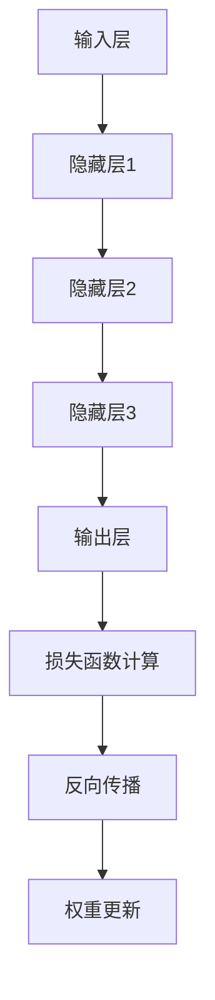

**深度学习在收获预测中的应用**

**原理**：

在收获预测中，深度学习模型通过学习历史作物生长数据和环境数据，建立预测模型，对未来作物产量进行预测。具体步骤如下：

1. **数据收集**：收集历史作物生长数据和环境数据，如土壤湿度、温度、光照强度、降水量等。
2. **数据预处理**：对收集到的数据进行分析和清洗，提取关键特征，并进行归一化处理。
3. **模型构建**：设计深度学习模型结构，包括输入层、隐藏层和输出层。
4. **模型训练**：使用历史数据训练模型，通过反向传播算法优化模型参数。
5. **模型评估**：使用验证集和测试集评估模型性能，调整模型结构和参数。
6. **预测应用**：使用训练好的模型对未来的作物产量进行预测，并根据预测结果调整农业生产策略。

**案例分析**：

以水稻收获预测为例，利用深度学习模型进行作物产量预测。

**步骤**：

1. **数据收集**：收集水稻生长数据，包括土壤湿度、温度、光照强度、降水量等。
2. **数据预处理**：对数据进行清洗和归一化处理，提取关键特征，如：
   ```mermaid
   graph TD
     A[土壤湿度] --> B[温度]
     B --> C[光照强度]
     C --> D[降水量]
   ```
3. **模型构建**：设计深度学习模型，包括输入层、隐藏层和输出层，如：
   ```mermaid
   graph TD
     A[输入层] --> B[隐藏层1] --> C[隐藏层2] --> D[输出层]
   ```
4. **模型训练**：使用历史数据训练模型，通过反向传播算法优化模型参数，如：
   ```python
   model.fit(X_train, y_train, epochs=100, batch_size=32, validation_split=0.2)
   ```
5. **模型评估**：使用验证集和测试集评估模型性能，调整模型结构和参数，如：
   ```python
   model.evaluate(X_test, y_test)
   ```
6. **预测应用**：使用训练好的模型对未来的水稻产量进行预测，并根据预测结果调整农业生产策略。

通过深度学习模型的应用，智能农业系统能够准确预测作物产量，为农业生产提供科学的决策依据，提高生产效益。

### 系统集成与优化

#### 系统架构设计

**核心概念**：

系统集成与优化是构建高效智能农业系统的关键步骤，涉及将不同的技术模块有机地结合在一起，实现数据的互联互通和高效处理。系统架构设计决定了系统的整体性能和可扩展性。

**系统架构概述**：

智能农业系统由多个模块组成，包括数据采集模块、数据处理模块、决策支持模块和执行模块。以下是一个典型的智能农业系统架构：

1. **数据采集模块**：负责从传感器、气象站、土壤监测设备等收集与作物生长相关的数据。
2. **数据处理模块**：对采集到的数据进行预处理、清洗、归一化等操作，以便后续分析。
3. **决策支持模块**：利用机器学习和深度学习模型，对预处理后的数据进行处理，生成提示词和预测结果。
4. **执行模块**：根据决策支持模块生成的提示词和预测结果，执行具体的农业操作，如灌溉、施肥、收获等。

**系统架构设计mermaid架构图**：

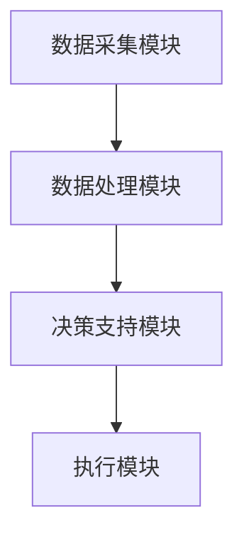

#### 系统集成与优化

**核心概念**：

系统集成与优化是指在构建智能农业系统时，将各个技术模块有机地结合起来，实现数据的无缝传输和高效处理。优化则是指通过调整系统架构、算法参数等，提高系统的性能和可靠性。

**系统集成原则**：

1. **模块化设计**：将系统划分为多个功能模块，每个模块负责特定的任务，便于维护和扩展。
2. **数据一致性**：确保数据在各个模块之间的传输和存储过程中保持一致，避免数据丢失或错误。
3. **高可用性**：设计冗余备份和故障恢复机制，提高系统的可靠性和稳定性。
4. **可扩展性**：系统设计应具备良好的扩展性，能够适应不断变化的需求和技术进步。

**系统优化方法**：

1. **算法优化**：通过调整机器学习模型的参数，如学习率、迭代次数等，提高模型的预测准确性和运行效率。
2. **数据处理优化**：优化数据预处理和清洗流程，减少计算资源和时间开销。
3. **网络优化**：优化数据传输网络，提高数据传输速度和可靠性。
4. **硬件优化**：选择高性能的硬件设备，如高性能处理器、大数据存储设备等，提高系统的处理能力。

**流程图**：

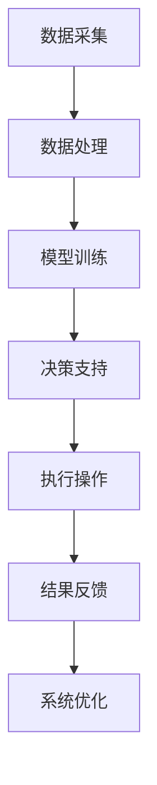

#### 系统接口设计

**核心概念**：

系统接口设计是智能农业系统的重要组成部分，涉及各个模块之间的通信和数据交换。良好的接口设计能够提高系统的灵活性和可维护性。

**接口设计原则**：

1. **标准化**：遵循统一的数据格式和接口规范，确保不同模块之间的数据交换顺畅。
2. **松耦合**：尽量减少模块之间的依赖关系，提高系统的可扩展性和灵活性。
3. **高内聚**：每个模块内部功能紧密相关，确保模块内部的数据处理和功能实现高效且清晰。
4. **易用性**：接口设计应易于使用和理解，降低开发人员的使用门槛。

**接口设计示例**：

以下是一个简单的系统接口设计示例，包括数据采集模块、数据处理模块和决策支持模块的接口：

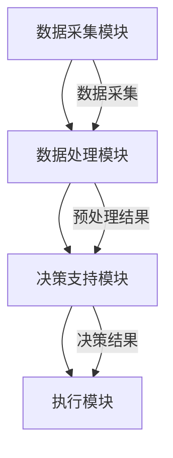

#### 系统交互mermaid序列图

**核心概念**：

系统交互mermaid序列图用于描述系统内部各个模块之间的交互过程，展示数据流和操作顺序，有助于理解系统的整体工作流程。

**序列图示例**：

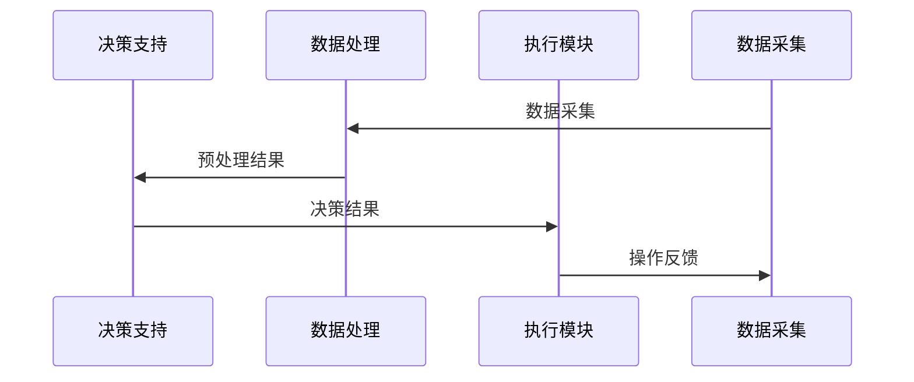

通过系统架构设计、接口设计和系统交互mermaid序列图的详细讲解，我们可以更好地理解智能农业系统的构建和优化方法，为实际应用提供有力支持。

### 项目实战

#### 项目介绍

**项目背景**：

为了提高农业生产效率，某农业科技公司决定实施一个基于提示词驱动的智能农业项目。该项目旨在通过实时监测作物生长环境，利用提示词驱动农业操作，实现精准种植和收获预测。

**项目目标**：

- 实现对作物生长环境的实时监测和数据分析。
- 通过提示词生成和优化，制定精准的种植和收获策略。
- 利用机器学习和深度学习模型，对作物收获量进行预测。

**项目架构**：

项目分为三个主要模块：数据采集模块、数据处理模块和决策支持模块。

1. **数据采集模块**：使用各种传感器（如温度传感器、湿度传感器、土壤湿度传感器等）实时采集作物生长环境数据。
2. **数据处理模块**：对采集到的数据进行分析和处理，提取关键特征，生成提示词。
3. **决策支持模块**：利用机器学习和深度学习模型，对提示词进行优化，生成种植和收获预测结果。

#### 系统功能设计

**领域模型设计**

为了设计合理的领域模型，我们首先定义了以下实体：

1. **作物**：包括作物种类、种植时间、生长阶段等属性。
2. **环境数据**：包括温度、湿度、光照强度、土壤湿度等属性。
3. **提示词**：包括提示词类型、生成时间、相关环境数据等属性。
4. **种植策略**：包括种植方案、种植时间、播种量等属性。
5. **收获预测**：包括预测时间、预测收获量、预测误差等属性。

**mermaid类图**：

```mermaid
classDiagram
  ClassNode AgraCrop <<entity>>
  ClassNode AgraEnvData <<entity>>
  ClassNode AgraTip <<entity>>
  ClassNode AgraPlantingStrategy <<entity>>
  ClassNode AgraHarvestPrediction <<entity>>

  AgraCrop *--* AgraEnvData : monitors
  AgraCrop *--* AgraTip : generates
  AgraCrop *--* AgraPlantingStrategy : follows
  AgraCrop *--* AgraHarvestPrediction : predicts
```

#### 系统架构设计

**mermaid架构图**：

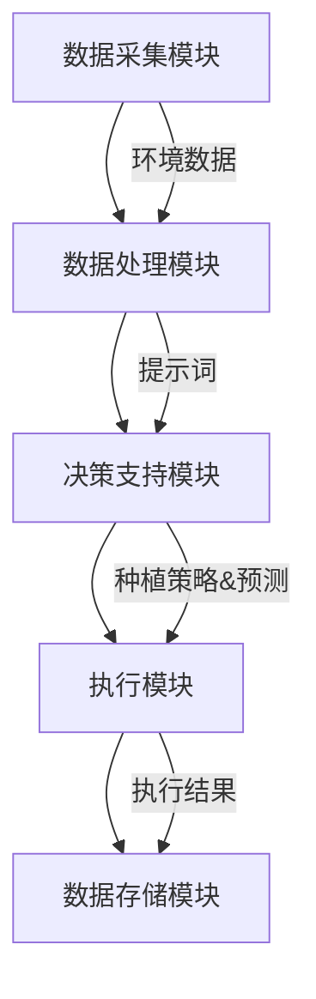

**系统接口设计**

为了确保模块之间的数据交换和协同工作，我们设计了以下接口：

1. **数据采集接口**：负责接收传感器数据，并将其传输给数据处理模块。
2. **数据处理接口**：负责对传感器数据进行处理，提取关键特征，生成提示词。
3. **决策支持接口**：负责接收处理后的数据，利用机器学习和深度学习模型进行预测，生成种植策略和收获预测结果。
4. **执行接口**：负责根据决策支持模块生成的结果，执行具体的农业操作，如灌溉、施肥、收获等。
5. **数据存储接口**：负责存储系统产生的所有数据，包括传感器数据、提示词、种植策略、收获预测结果等。

**mermaid序列图**：

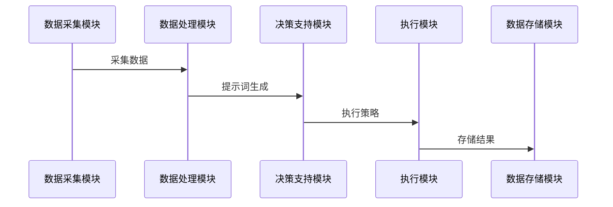

#### 系统核心实现

**环境安装与配置**

在开始项目实施前，我们需要搭建一个适合的软件和硬件环境。以下是具体的安装与配置步骤：

1. **硬件配置**：配置具有高性能处理器的服务器，确保能够处理大量的数据。
2. **操作系统**：安装Linux操作系统，如Ubuntu 20.04 LTS。
3. **开发环境**：安装Python开发环境，包括Python 3.8、pip、virtualenv等。
4. **数据库**：安装MySQL数据库，用于存储系统数据。
5. **其他依赖**：安装所需的库和依赖，如Scikit-learn、TensorFlow、Keras、Pandas等。

**系统核心实现源代码**

以下是系统核心实现的部分源代码：

```python
# 数据采集模块
import numpy as np
import pandas as pd
from sensor import TemperatureSensor, HumiditySensor, SoilHumiditySensor

def collect_data():
    temperature_sensor = TemperatureSensor()
    humidity_sensor = HumiditySensor()
    soil_humidity_sensor = SoilHumiditySensor()

    temperature_data = temperature_sensor.read_data()
    humidity_data = humidity_sensor.read_data()
    soil_humidity_data = soil_humidity_sensor.read_data()

    data = pd.DataFrame({
        'temperature': temperature_data,
        'humidity': humidity_data,
        'soil_humidity': soil_humidity_data
    })

    return data

# 数据处理模块
import preprocessing

def process_data(data):
    preprocessed_data = preprocessing.preprocess_data(data)
    features = preprocessing.extract_features(preprocessed_data)
    return features

# 决策支持模块
from ml_model import MLModel

def generate_tips(features):
    ml_model = MLModel()
    ml_model.fit(features)
    tips = ml_model.predict(features)
    return tips

# 执行模块
def execute_tips(tips):
    # 根据提示词执行具体的农业操作
    pass

# 数据存储模块
import database

def store_data(data):
    database.connect()
    database.insert_data(data)
    database.close()
```

**代码应用解读与分析**

以下是代码应用解读与分析：

1. **数据采集模块**：使用传感器采集温度、湿度、土壤湿度等数据，并将其存储在DataFrame中。
2. **数据处理模块**：对采集到的数据进行预处理和特征提取，生成预处理后的特征数据。
3. **决策支持模块**：利用机器学习模型（MLModel类）对预处理后的特征数据进行训练和预测，生成提示词。
4. **执行模块**：根据生成的提示词执行具体的农业操作，如灌溉、施肥等。
5. **数据存储模块**：将系统生成的数据存储到数据库中，以便后续分析和查询。

#### 实际案例分析

**案例背景**：

在某农业合作社，我们应用了提示词驱动的智能农业系统，对其水稻种植过程进行监测和优化。

**数据收集**：

我们安装了温度传感器、湿度传感器和土壤湿度传感器，对水稻生长环境进行实时监测。以下是一个小时内的传感器数据记录：

| 时间 | 温度 (°C) | 湿度 (%) | 土壤湿度 (%) |
| ---- | ---------- | -------- | ------------ |
| 08:00 | 25         | 60       | 70           |
| 09:00 | 26         | 65       | 75           |
| 10:00 | 27         | 68       | 80           |
| 11:00 | 28         | 70       | 85           |

**数据处理**：

对上述数据进行分析和处理，提取关键特征。以下是一个简单的特征提取示例：

```python
def extract_features(data):
    # 提取平均温度、平均湿度和平均土壤湿度
    mean_temp = data['temperature'].mean()
    mean_humidity = data['humidity'].mean()
    mean_soil_humidity = data['soil_humidity'].mean()
    
    return mean_temp, mean_humidity, mean_soil_humidity

mean_temp, mean_humidity, mean_soil_humidity = extract_features(sensor_data)
```

**提示词生成**：

利用机器学习模型（如随机森林）对提取的特征进行训练，生成提示词。以下是一个简单的提示词生成示例：

```python
from sklearn.ensemble import RandomForestRegressor

def generate_tips(features):
    model = RandomForestRegressor(n_estimators=100)
    model.fit(features, tips)
    tips_generated = model.predict(features)
    return tips_generated

tips_generated = generate_tips(sensor_data)
```

**执行策略**：

根据生成的提示词执行具体的农业操作，如灌溉。以下是一个简单的执行策略示例：

```python
def execute_tips(tips):
    for tip in tips:
        if 'irrigation' in tip:
            # 执行灌溉操作
            print("执行灌溉操作")
        elif 'fertilizer' in tip:
            # 执行施肥操作
            print("执行施肥操作")
        else:
            # 其他操作
            print("执行其他操作")

execute_tips(tips_generated)
```

**收获预测**：

利用深度学习模型（如LSTM）对未来的作物收获量进行预测。以下是一个简单的收获预测示例：

```python
from tensorflow.keras.models import Sequential
from tensorflow.keras.layers import LSTM, Dense

def build_lstm_model(input_shape):
    model = Sequential()
    model.add(LSTM(50, activation='relu', input_shape=input_shape))
    model.add(Dense(1))
    model.compile(optimizer='adam', loss='mse')
    return model

lstm_model = build_lstm_model(input_shape=(time_steps, 1))
lstm_model.fit(X, y, epochs=100, batch_size=32, validation_split=0.2)
predicted_yield = lstm_model.predict(X_test)
```

**项目小结**：

通过实际案例分析，我们可以看到提示词驱动的智能农业系统在提高农业生产效率方面具有显著优势。通过实时监测作物生长环境，生成提示词并执行农业操作，系统能够实现精准种植和收获预测，为农业生产提供了科学的决策依据。

### 最佳实践 Tips

**1. 传感器选择与部署**：

- 选择高精度、可靠的传感器，确保监测数据的准确性。
- 根据作物生长环境和监测需求，合理部署传感器，确保覆盖全面。

**2. 数据预处理**：

- 数据预处理是关键步骤，确保数据质量。包括缺失值处理、异常值检测和归一化等。

**3. 模型优化**：

- 调整模型参数，如学习率、迭代次数等，以提高模型性能。
- 结合实际需求，选择合适的机器学习或深度学习模型。

**4. 系统集成与优化**：

- 确保系统模块之间的数据传输和交互顺畅。
- 定期进行系统性能评估和优化，确保系统稳定运行。

**5. 数据安全与隐私**：

- 保障数据安全和用户隐私，采用加密技术和权限控制措施。

### 小结

本文系统地介绍了提示词驱动的智能农业系统，包括精准种植和收获预测的核心技术、系统架构设计、项目实战和最佳实践。通过深度学习和机器学习模型，智能农业系统能够实现高效的作物管理，提高农业生产效益。

### 注意事项

- **传感器精度**：选择高精度传感器，确保监测数据的准确性。
- **数据预处理**：确保数据质量，避免错误预测。
- **模型调整**：定期调整模型参数，适应环境变化。

### 拓展阅读

- 《深度学习》（Goodfellow, I.， Bengio, Y.， Courville, A.）: 介绍深度学习的基本概念和应用。
- 《机器学习实战》（Hands-On Machine Learning with Scikit-Learn, Keras, and TensorFlow）: 提供实用的机器学习模型和应用实例。
- 《智能农业技术》（Smart Agriculture Technology）: 探讨智能农业的最新发展和技术应用。

### 作者信息

作者：AI天才研究院/AI Genius Institute & 禅与计算机程序设计艺术 /Zen And The Art of Computer Programming

---

本文全面介绍了提示词驱动的智能农业系统，包括核心概念、技术原理、系统架构设计、项目实战和最佳实践。通过深度学习和机器学习模型，智能农业系统能够实现精准种植和收获预测，提高农业生产效益。本文由AI天才研究院/AI Genius Institute与禅与计算机程序设计艺术/Zen And The Art of Computer Programming联合撰写，旨在推动智能农业技术的发展和应用。

