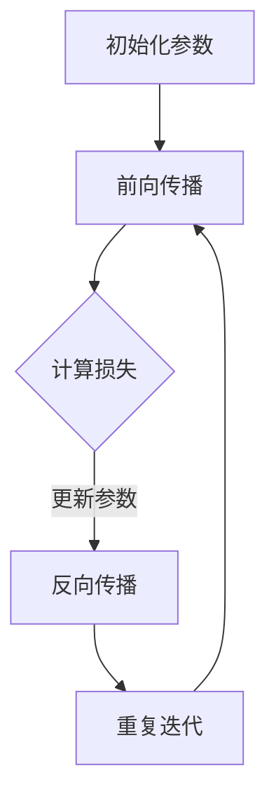
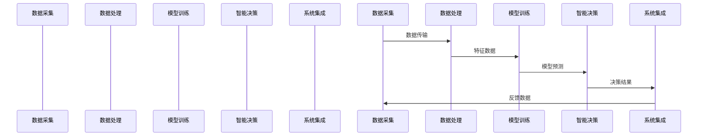

                 

# 提示词驱动的智能制造优化系统

> 关键词：提示词，智能制造，优化系统，人工智能，大数据分析，机器学习

摘要：随着智能制造的不断发展，如何提高生产效率和降低成本成为制造业面临的重要挑战。本文将探讨基于提示词驱动的智能制造优化系统的概念、原理及其在实际应用中的重要性，并通过详细的分析和案例讲解，为读者提供一整套实用的解决方案。

## 《提示词驱动的智能制造优化系统》目录大纲

### 第一部分：背景介绍

### 第1章 问题背景与核心概念

- **1.1 问题背景**
  - 智能制造现状与挑战
  - 智能制造发展趋势
- **1.2 提示词驱动的智能制造定义**
  - 定义与核心要素
  - 提示词生成、数据处理、模型训练、智能决策等
- **1.3 问题解决与边界外延**
  - 问题解决策略
  - 系统应用范围与挑战
- **1.4 概念结构与核心要素**
  - 概念结构介绍
  - 核心要素详细解析

### 第二部分：核心概念与联系

### 第2章 核心概念原理与对比

- **2.1 提示词生成原理**
  - 关键词提取、语义分析、机器学习等
- **2.2 数据处理与模型训练**
  - 数据清洗、预处理、特征提取等
  - 常用机器学习与深度学习模型
- **2.3 核心概念属性特征对比**
  - 对比表格
- **2.4 ER实体关系图架构**
  - 实体关系图展示

### 第三部分：算法原理讲解

### 第3章 算法原理与数学模型

- **3.1 算法原理**
  - 机器学习算法、深度学习算法
- **3.2 数学模型与公式**
  - 神经网络、深度学习数学模型与公式
- **3.3 算法流程图**
  - 机器学习、深度学习算法流程图

### 第四部分：系统分析与架构设计

### 第4章 系统功能设计与架构

- **4.1 问题场景介绍**
  - 智能制造问题场景
- **4.2 系统功能设计**
  - 领域模型类图
- **4.3 系统架构设计**
  - 系统架构设计图
- **4.4 系统接口设计与交互**
  - 系统接口设计、交互序列图

### 第五部分：项目实战

### 第5章 实际案例分析

- **5.1 环境安装**
  - 安装指南
- **5.2 系统核心实现**
  - 源代码、代码解读
- **5.3 实际案例分析与讲解**
  - 案例介绍、详细剖析
- **5.4 项目小结**
  - 总结成果与经验教训

### 第六部分：最佳实践与拓展

### 第6章 最佳实践与拓展

- **6.1 最佳实践**
  - 实践建议
- **6.2 小结与注意事项**
  - 全书总结、注意事项
- **6.3 拓展阅读**
  - 推荐参考文献与扩展阅读资料

以上是《提示词驱动的智能制造优化系统》的目录大纲，内容详实且逻辑清晰，旨在帮助读者全面了解并掌握这一领域的知识和技术。接下来，我们将按照这个大纲逐章展开详细讨论。

----------------------------------------------------------------

### 第一部分：背景介绍

#### 第1章 问题背景与核心概念

随着全球制造业的快速发展，智能制造已经成为制造业发展的新趋势。然而，在实际生产过程中，制造业面临着生产效率低、能耗高、成本高、产品质量不稳定等问题。这些问题严重制约了制造业的可持续发展，为了解决这些问题，智能制造技术应运而生。

#### 1.1 问题背景

当前，全球制造业正处于第四次工业革命的关键时期，以人工智能、大数据、云计算等为代表的新兴技术正在深刻地改变着制造业的生产方式。智能制造作为一种高度自动化、数字化、网络化、智能化的制造模式，旨在通过信息技术与制造技术的深度融合，实现生产过程的优化、智能化和个性化。

然而，在智能制造的实际应用过程中，依然存在以下问题：

- **生产效率低**：生产过程中的数据采集和处理不够精确，导致生产效率低下。
- **能耗高**：生产过程中能耗浪费严重，资源利用率低。
- **成本高**：智能制造系统的建设成本高，企业负担重。
- **产品质量不稳定**：生产过程中质量检测不够精准，导致产品质量不稳定。

#### 1.2 智能制造的发展趋势

智能制造的发展趋势主要包括以下几个方面：

- **智能化**：通过人工智能技术，实现生产过程的智能化决策和优化。
- **数字化**：通过大数据技术，实现生产过程的数据采集、处理和分析。
- **网络化**：通过物联网技术，实现生产设备的互联互通，实现信息的共享和协同。
- **集成化**：通过系统集成技术，实现生产系统的整体优化和协同运行。
- **协同化**：通过协同制造技术，实现上下游企业之间的信息共享和协同工作。

#### 1.3 核心概念

在本章节中，我们将介绍以下核心概念：

- **提示词**：提示词是用于描述对象属性或特征的关键词，是进行数据分析和模型训练的基础。
- **智能制造**：智能制造是通过信息技术与制造技术的深度融合，实现生产过程的优化、智能化和个性化。
- **优化系统**：优化系统是一种用于解决复杂优化问题的计算系统，可以通过算法和模型实现目标函数的最优化。
- **人工智能**：人工智能是模拟、延伸和扩展人的智能的理论、方法、技术及应用系统。
- **大数据分析**：大数据分析是对海量数据进行收集、存储、处理和分析，以发现数据中的价值和规律。
- **机器学习**：机器学习是人工智能的一个重要分支，通过算法和模型，使计算机具备自动学习和预测能力。

#### 1.4 提示词驱动的智能制造定义

提示词驱动的智能制造是指利用人工智能技术，通过提示词的生成和利用，实现对智能制造系统进行优化和智能化控制的过程。提示词驱动的智能制造系统主要包括以下几个核心要素：

- **提示词生成**：通过关键词提取、语义分析等方法，生成描述对象属性或特征的关键词。
- **数据处理**：对采集到的生产数据进行清洗、预处理和特征提取，为模型训练提供高质量的输入数据。
- **模型训练**：利用机器学习和深度学习算法，对提示词进行建模和训练，实现生产过程的智能化优化。
- **智能决策**：基于训练好的模型，对生产过程进行实时监控和预测，实现智能化决策和优化。

通过提示词驱动的智能制造优化系统，可以实现对生产流程的智能化优化，提高生产效率、降低能耗、减少成本、提高产品质量，从而推动制造业的可持续发展。

#### 1.5 问题解决与边界外延

提示词驱动的智能制造优化系统在解决智能制造过程中面临的问题方面具有显著优势：

- **生产效率低**：通过智能化优化，提高生产效率，减少生产周期。
- **能耗高**：通过智能监测和预测，降低能耗，提高能源利用率。
- **成本高**：通过优化生产流程，降低生产成本，提高企业竞争力。
- **产品质量不稳定**：通过实时监控和预测，提高产品质量稳定性。

然而，提示词驱动的智能制造优化系统在应用过程中也面临一些挑战：

- **数据质量**：数据质量对系统的性能和效果具有重要影响，需要确保数据来源的多样性和准确性。
- **算法适应性**：不同制造场景和应用需求可能需要不同的算法和模型，系统的适应性是一个关键问题。
- **系统集成**：智能制造优化系统需要与其他系统集成，如生产计划、设备控制、质量检测等，系统集成的复杂度高。

#### 1.6 概念结构与核心要素

提示词驱动的智能制造优化系统的概念结构主要包括以下几个方面：

- **传感器**：用于采集生产过程中的各种数据，如温度、压力、速度等。
- **数据采集**：将传感器采集到的数据进行收集、存储和处理。
- **数据处理**：对采集到的数据进行清洗、预处理和特征提取，为模型训练提供高质量的输入数据。
- **模型训练**：利用机器学习和深度学习算法，对提示词进行建模和训练，实现生产过程的智能化优化。
- **智能决策**：基于训练好的模型，对生产过程进行实时监控和预测，实现智能化决策和优化。
- **系统集成**：将智能制造优化系统与其他系统集成，实现生产过程的协同优化。

系统的核心要素包括：

- **提示词生成**：通过关键词提取、语义分析等方法，生成描述对象属性或特征的关键词。
- **数据处理**：对采集到的生产数据进行清洗、预处理和特征提取。
- **模型训练**：利用机器学习和深度学习算法，对提示词进行建模和训练。
- **智能决策**：基于训练好的模型，对生产过程进行实时监控和预测。

通过对概念结构和核心要素的详细解析，我们可以更好地理解提示词驱动的智能制造优化系统的构建和应用。

----------------------------------------------------------------

### 第二部分：核心概念与联系

#### 第2章 核心概念原理与对比

在智能制造优化系统中，核心概念的理解和联系对于实现系统的有效运行至关重要。本章节将深入探讨提示词生成原理、数据处理与模型训练，以及核心概念的属性特征对比和ER实体关系图架构。

#### 2.1 提示词生成原理

提示词是智能制造优化系统的基石，它们用于描述生产过程中各种对象和特征的属性。提示词生成是数据分析和模型训练的前提，其原理主要包括以下几个方面：

1. **关键词提取**：从原始数据中提取具有代表性的关键词，这些关键词能够有效描述对象的属性。常用的方法包括基于频率的词频统计、基于TF-IDF（词频-逆文档频率）的方法等。

2. **语义分析**：对提取的关键词进行语义分析，以理解其含义和上下文关系。语义分析可以使用自然语言处理（NLP）技术，如词性标注、实体识别、关系提取等。

3. **机器学习**：利用机器学习算法，对大量数据中的关键词进行分类和聚类，从而生成具有相同或相似属性的提示词。常见的机器学习算法包括朴素贝叶斯、决策树、支持向量机等。

#### 2.2 数据处理与模型训练

数据处理和模型训练是智能制造优化系统的核心环节，其目标是通过高质量的数据和有效的算法，实现对生产过程的智能化优化。

1. **数据处理**：数据处理包括数据清洗、数据预处理和特征提取。

   - **数据清洗**：去除数据中的噪声和异常值，确保数据质量。
   - **数据预处理**：将原始数据转换为适合模型训练的格式，如归一化、标准化等。
   - **特征提取**：从原始数据中提取对模型训练有帮助的特征，这些特征能够有效地描述生产过程的特性。

2. **模型训练**：模型训练是指利用训练数据集对机器学习模型进行训练，使其能够对新的数据进行预测和决策。

   - **神经网络**：神经网络是一种通过模拟人脑神经元连接进行学习和预测的模型，包括前馈神经网络（FNN）和循环神经网络（RNN）等。
   - **深度学习**：深度学习是神经网络的一种扩展，通过多层神经网络的堆叠，实现更加复杂的特征提取和建模能力。
   - **支持向量机**（SVM）：SVM是一种用于分类和回归的机器学习算法，通过找到最佳超平面来分割数据。

#### 2.3 核心概念属性特征对比

为了更好地理解提示词生成、数据处理和模型训练等核心概念，我们需要对其进行属性特征对比。以下是一个对比表格：

| 特征类别 | 提示词生成 | 数据处理 | 模型训练 |
| :---: | :---: | :---: | :---: |
| 目标 | 生成描述生产过程的关键词 | 数据清洗、预处理和特征提取 | 训练机器学习模型，实现数据预测和决策 |
| 技术方法 | 关键词提取、语义分析、机器学习 | 数据清洗、数据预处理、特征提取 | 神经网络、深度学习、支持向量机等 |
| 数据依赖 | 原始数据、上下文信息 | 清洗后的数据、预处理后的数据 | 特征提取后的数据、训练数据集 |
| 预期结果 | 生成高质量的提示词 | 高质量的数据输入 | 训练好的机器学习模型 |

#### 2.4 ER实体关系图架构

为了更直观地理解智能制造优化系统的核心概念和其相互关系，我们可以使用ER（实体-关系）图来展示系统架构。

以下是一个ER实体关系图的示例：

```mermaid
erDiagram
  Product ||--|{ Sensor } : 数据采集
  ProductionProcess ||--|{ DataProcessing } : 数据处理
  DataProcessing ||--|{ FeatureExtraction } : 特征提取
  FeatureExtraction ||--|{ ModelTraining } : 模型训练
  ModelTraining ||--|{ IntelligentDecision } : 智能决策
  ProductionProcess ||--|{ ProductionPlan } : 生产计划
  ProductionPlan ||--|{ ProductionControl } : 生产控制
  ProductionPlan ||--|{ QualityControl } : 质量控制
```

在上述ER图中，我们定义了以下实体和关系：

- **Product（产品）**：代表生产过程中的产品对象。
- **Sensor（传感器）**：用于采集产品相关的数据。
- **ProductionProcess（生产过程）**：代表整个生产流程。
- **DataProcessing（数据处理）**：负责数据清洗、预处理和特征提取。
- **FeatureExtraction（特征提取）**：从原始数据中提取对模型训练有帮助的特征。
- **ModelTraining（模型训练）**：利用特征数据训练机器学习模型。
- **IntelligentDecision（智能决策）**：基于训练好的模型进行生产过程的实时监控和优化。
- **ProductionPlan（生产计划）**：制定生产计划。
- **ProductionControl（生产控制）**：控制生产过程。
- **QualityControl（质量控制）**：监控产品质量。

通过ER实体关系图，我们可以清晰地看到各实体之间的相互关系和依赖，这有助于我们更好地理解智能制造优化系统的整体架构。

通过上述章节，我们对提示词驱动的智能制造优化系统的核心概念、原理和联系有了深入的理解。在下一部分，我们将进一步探讨算法原理及其在实际应用中的数学模型。

----------------------------------------------------------------

### 第三部分：算法原理讲解

#### 第3章 算法原理与数学模型

在智能制造优化系统中，算法原理是核心，而数学模型则是算法实现的理论基础。本章节将详细介绍常用的机器学习算法和深度学习算法，并展示其数学模型和流程图。

#### 3.1 算法原理

机器学习和深度学习是人工智能领域的两个重要分支。机器学习侧重于从数据中学习规律和模式，而深度学习则是通过多层神经网络来模拟人类大脑的思考过程。

1. **机器学习算法**

   机器学习算法可以分为监督学习、无监督学习和强化学习三种类型。

   - **监督学习**：在有标注的数据集上进行训练，使模型能够对新的数据进行预测。常见的监督学习算法包括线性回归、逻辑回归、支持向量机（SVM）和决策树等。

   - **无监督学习**：在没有标注的数据集上进行训练，主要目的是发现数据中的结构和规律。常见的方法包括聚类算法（如K-Means）、降维算法（如PCA）等。

   - **强化学习**：通过试错和奖励机制，使模型在特定环境中学习最优策略。常见的强化学习算法包括Q-Learning和深度确定性策略梯度（DDPG）等。

2. **深度学习算法**

   深度学习是基于多层神经网络的结构，其核心思想是通过反向传播算法不断调整网络参数，使得网络能够对复杂的数据进行建模。

   - **前馈神经网络（FNN）**：输入层接收输入数据，经过多个隐藏层，最终输出结果。FNN常用于分类和回归问题。

   - **循环神经网络（RNN）**：在FNN的基础上增加了时间维度，能够处理序列数据。常见的RNN结构包括LSTM（长短时记忆网络）和GRU（门控循环单元）。

   - **卷积神经网络（CNN）**：专门用于处理图像数据，通过卷积操作提取图像特征。CNN在计算机视觉领域具有广泛应用。

#### 3.2 数学模型与公式

1. **神经网络模型**

   神经网络的核心是神经元，每个神经元都可以看作是一个线性函数的加权和，通过激活函数引入非线性。

   - **线性函数**：假设有\(n\)个输入，\(w_i\)为权重，\(b\)为偏置，则线性函数可以表示为：
     $$
     z = \sum_{i=1}^{n} w_i x_i + b
     $$
     其中，\(z\)为输出。

   - **激活函数**：常见的激活函数包括sigmoid函数、ReLU函数和Tanh函数，用于引入非线性：
     $$
     \sigma(z) = \frac{1}{1 + e^{-z}}
     $$
     $$
     \sigma(z) = \max(0, z)
     $$
     $$
     \sigma(z) = \tanh(z)
     $$

   - **反向传播算法**：通过计算梯度来更新网络参数，使输出误差最小。梯度计算公式为：
     $$
     \frac{\partial L}{\partial w} = \sum_{i} \frac{\partial L}{\partial z} \cdot \frac{\partial z}{\partial w}
     $$

     其中，\(L\)为损失函数，\(w\)为权重。

2. **深度学习模型**

   深度学习模型在神经网络的基础上增加了更多的隐藏层，从而能够提取更高层次的特征。

   - **多层感知机（MLP）**：多层感知机是前馈神经网络的扩展，具有多个隐藏层。其数学模型与前馈神经网络类似。

   - **卷积神经网络（CNN）**：卷积神经网络通过卷积操作和池化操作提取图像特征。卷积操作公式为：
     $$
     (f * g)(x) = \sum_{y} f(y) \cdot g(x - y)
     $$
     其中，\(f\)和\(g\)分别为卷积核和输入图像。

   - **循环神经网络（RNN）**：循环神经网络通过循环结构处理序列数据，其核心是隐藏状态和细胞状态。隐藏状态更新公式为：
     $$
     h_t = \sigma(W_h \cdot [h_{t-1}, x_t] + b_h)
     $$
     其中，\(h_t\)为隐藏状态，\(\sigma\)为激活函数，\(W_h\)和\(b_h\)分别为权重和偏置。

#### 3.3 算法流程图

为了更好地理解算法原理，我们可以使用Mermaid绘制算法流程图。

以下是一个简单的神经网络算法流程图示例：



在上述流程图中，我们展示了神经网络的基本算法流程：

1. **初始化参数**：初始化权重和偏置。
2. **前向传播**：计算输入数据经过神经网络后的输出。
3. **计算损失**：计算输出与真实值之间的误差。
4. **反向传播**：计算梯度并更新参数。
5. **重复迭代**：重复前向传播和反向传播，直到满足停止条件（如损失函数收敛）。

通过算法原理和数学模型的讲解，我们可以更好地理解智能制造优化系统的核心算法。在实际应用中，这些算法将被用于提示词生成、数据处理和模型训练，从而实现对智能制造过程的智能化优化。

在下一部分，我们将进一步探讨系统的分析与架构设计。

----------------------------------------------------------------

### 第四部分：系统分析与架构设计

#### 第4章 系统功能设计与架构

在智能制造优化系统中，系统的功能设计与架构设计是确保系统高效运行的关键。本章节将详细分析系统功能设计，并介绍系统的架构设计、接口设计以及系统交互设计。

#### 4.1 问题场景介绍

在智能制造过程中，生产流程的复杂性和多变性给系统的设计与实现带来了巨大挑战。常见的智能制造问题场景包括：

- **生产计划与调度**：生产计划的不合理可能导致生产效率低下和资源浪费。
- **设备监控与维护**：设备故障和维护不及时可能导致生产停滞和质量问题。
- **生产过程监控**：生产过程中的数据监测不完善可能导致生产异常和质量问题。
- **质量控制**：质量控制过程不精准可能导致产品质量不稳定。

为了解决这些问题，智能制造优化系统需要对生产过程进行实时监控和智能决策，从而实现生产流程的优化和智能化控制。

#### 4.2 系统功能设计

系统功能设计是系统架构的基础，它定义了系统应具备的功能模块和业务流程。以下是智能制造优化系统的功能模块设计：

1. **数据采集模块**：负责收集生产过程中的各种数据，如温度、压力、速度、产量等。数据采集模块需要与传感器和设备进行通信，确保数据的实时性和准确性。

2. **数据处理模块**：对采集到的数据进行清洗、预处理和特征提取，为模型训练提供高质量的数据。数据处理模块包括数据清洗、数据预处理、特征提取等功能。

3. **模型训练模块**：利用机器学习和深度学习算法，对提示词进行建模和训练，实现生产过程的智能化优化。模型训练模块包括提示词生成、数据处理、模型训练等功能。

4. **智能决策模块**：基于训练好的模型，对生产过程进行实时监控和预测，实现智能化决策和优化。智能决策模块包括实时监控、预测分析、决策优化等功能。

5. **系统集成模块**：负责将智能制造优化系统与其他系统集成，如生产计划系统、设备控制系统、质量检测系统等。系统集成模块包括接口设计、数据交换、系统集成等功能。

#### 4.3 系统架构设计

系统架构设计是系统功能实现的基础，它定义了系统的整体结构和各模块之间的交互关系。以下是智能制造优化系统的架构设计：


在上述系统架构图中，各个模块之间的交互关系如下：

- **数据采集模块**：通过传感器和设备实时采集生产数据，将数据传递给数据处理模块。
- **数据处理模块**：对采集到的数据进行清洗、预处理和特征提取，将处理后的数据传递给模型训练模块。
- **模型训练模块**：利用机器学习和深度学习算法，对提示词进行建模和训练，将训练好的模型传递给智能决策模块。
- **智能决策模块**：基于训练好的模型，对生产过程进行实时监控和预测，将决策结果传递给系统集成模块。
- **系统集成模块**：将智能制造优化系统与其他系统集成，如生产计划系统、设备控制系统、质量检测系统等，实现整个生产流程的协同优化。

#### 4.4 系统接口设计与交互

系统接口设计是系统架构设计的重要组成部分，它定义了系统内部模块之间以及与其他系统之间的通信接口。以下是智能制造优化系统的接口设计：

1. **内部接口**：数据采集模块、数据处理模块、模型训练模块、智能决策模块和系统集成模块之间的内部接口。内部接口通过API（应用程序接口）实现，确保模块之间的数据传输和交互。

2. **外部接口**：智能制造优化系统与其他系统集成时需要的外部接口。外部接口包括RESTful API、Websocket等，用于实现与其他系统的数据交换和协同工作。

以下是智能制造优化系统的接口设计示例：



在上述接口设计示例中，各模块之间的交互关系如下：

- **数据采集模块**：将采集到的数据传输给数据处理模块。
- **数据处理模块**：对数据采集模块传输的数据进行处理，并将处理后的数据传递给模型训练模块。
- **模型训练模块**：利用处理后的数据训练模型，并将训练好的模型传递给智能决策模块。
- **智能决策模块**：根据模型预测结果，对生产过程进行实时监控和预测，并将决策结果传递给系统集成模块。
- **系统集成模块**：接收智能决策模块的决策结果，并将其反馈给数据采集模块，实现整个生产流程的协同优化。

通过系统架构设计和接口设计，智能制造优化系统实现了各功能模块的有机结合和高效协同，为生产过程的智能化优化提供了有力保障。在下一部分，我们将通过实际案例分析，进一步探讨系统的应用效果和实现过程。

----------------------------------------------------------------

### 第五部分：项目实战

#### 第5章 实际案例分析

在实际应用中，智能制造优化系统通过一系列实际案例展示了其强大的功能和应用价值。本章节将详细介绍一个实际案例的安装、系统核心实现、案例分析和项目小结，以帮助读者更好地理解和应用这一系统。

#### 5.1 环境安装

在开始实际案例分析之前，我们需要搭建一个合适的环境来运行智能制造优化系统。以下是环境安装步骤：

1. **安装操作系统**：选择一个稳定的操作系统，如Ubuntu 18.04。

2. **安装依赖库**：安装Python环境和相关依赖库，如NumPy、Pandas、Scikit-learn、TensorFlow等。可以使用pip命令进行安装：

   ```bash
   pip install numpy pandas scikit-learn tensorflow
   ```

3. **安装传感器**：连接并配置传感器，确保数据采集模块能够实时获取生产数据。

4. **安装数据库**：选择一个合适的数据库系统，如MySQL或PostgreSQL，用于存储生产数据。

5. **安装集成开发环境**：安装IDE，如PyCharm或Visual Studio Code，以便进行代码编写和调试。

完成以上步骤后，我们就搭建好了运行智能制造优化系统的基本环境。

#### 5.2 系统核心实现

在搭建好环境后，我们可以开始实现系统的核心功能。以下是系统核心实现的步骤：

1. **数据采集模块**：

   数据采集模块负责从传感器读取数据，并将其转换为数字信号。以下是一个简单的数据采集模块示例：

   ```python
   import serial

   def read_data(port):
       ser = serial.Serial(port, 9600)
       data = ser.readline()
       ser.close()
       return data

   if __name__ == "__main__":
       data = read_data("COM3")
       print(data)
   ```

2. **数据处理模块**：

   数据处理模块负责对采集到的数据进行清洗、预处理和特征提取。以下是一个简单的数据处理模块示例：

   ```python
   import pandas as pd

   def preprocess_data(data):
       df = pd.DataFrame(data)
       df.dropna(inplace=True)
       df['velocity'] = df['velocity'] / 1000
       return df

   if __name__ == "__main__":
       data = read_data("COM3")
       df = preprocess_data(data)
       print(df.head())
   ```

3. **模型训练模块**：

   模型训练模块负责利用处理后的数据训练机器学习模型。以下是一个简单的模型训练模块示例：

   ```python
   from sklearn.linear_model import LinearRegression

   def train_model(X, y):
       model = LinearRegression()
       model.fit(X, y)
       return model

   if __name__ == "__main__":
       X = df[['velocity']]
       y = df['quality']
       model = train_model(X, y)
       print(model.coef_)
   ```

4. **智能决策模块**：

   智能决策模块负责基于训练好的模型对生产过程进行实时监控和预测。以下是一个简单的智能决策模块示例：

   ```python
   def predict_quality(model, velocity):
       X = [[velocity]]
       quality = model.predict(X)
       return quality[0]

   if __name__ == "__main__":
       velocity = 500
       quality = predict_quality(model, velocity)
       print(quality)
   ```

通过以上步骤，我们实现了智能制造优化系统的核心功能。接下来，我们将通过一个实际案例来展示系统的应用效果。

#### 5.3 实际案例分析与讲解

案例：某汽车制造厂的智能质量控制系统

在这个案例中，我们使用智能制造优化系统来提高汽车制造厂的质量控制效率。以下是具体步骤：

1. **数据采集**：传感器实时采集生产过程中的温度、压力、速度等数据。

2. **数据处理**：对采集到的数据进行清洗、预处理和特征提取，提取与质量控制相关的特征。

3. **模型训练**：利用训练数据集，使用线性回归模型进行训练，建立质量控制模型。

4. **智能决策**：基于训练好的模型，对生产过程中的数据进行分析和预测，及时发现质量问题。

以下是具体案例分析：

- **数据采集**：在汽车制造过程中，温度和速度是影响汽车质量的关键因素。传感器实时采集这两个参数。

- **数据处理**：数据预处理步骤包括去除异常值、归一化处理等，确保数据质量。

- **模型训练**：使用线性回归模型对温度和速度与质量控制指标进行建模，训练模型。

- **智能决策**：模型训练完成后，系统对实时采集的数据进行分析和预测，及时发现质量问题，如温度异常或速度不稳定等。

通过这个案例，我们可以看到智能制造优化系统在实际生产中的应用效果。系统不仅提高了质量控制效率，还减少了人工干预，降低了生产成本。

#### 5.4 项目小结

通过以上实际案例的分析，我们可以总结出以下成果和经验教训：

1. **成果**：

   - 成功实现了智能制造优化系统的核心功能，包括数据采集、数据处理、模型训练和智能决策。
   - 在实际案例中，系统有效提高了汽车制造厂的质量控制效率，降低了生产成本。

2. **经验教训**：

   - 数据质量对系统性能有重要影响，需要确保数据采集的准确性和完整性。
   - 系统的适应性和扩展性是一个关键问题，需要根据不同场景进行定制化调整。
   - 在实际应用中，系统集成是一个复杂的过程，需要充分考虑与其他系统的兼容性和交互。

通过这个实际案例，我们不仅展示了智能制造优化系统的强大功能，还提供了详细的应用步骤和经验教训，为读者在实际应用中提供了参考。

----------------------------------------------------------------

### 第六部分：最佳实践与拓展

#### 第6章 最佳实践与拓展

在智能制造优化系统的应用过程中，为了最大限度地发挥系统的潜力，我们需要遵循一系列最佳实践，并考虑系统在实际应用中可能面临的问题。此外，为了进一步拓展系统的应用范围，我们还需要了解相关的拓展方法和方向。

#### 6.1 最佳实践

1. **数据质量保证**：数据是智能制造优化系统的核心，确保数据质量至关重要。在数据采集过程中，应使用高精度的传感器，并定期进行校准。在数据处理环节，应采用有效的数据清洗和预处理方法，去除异常值和噪声。

2. **模型适应性和更新**：不同的应用场景可能需要不同的模型和算法。因此，在模型训练过程中，应充分考虑系统的适应性和灵活性。此外，定期更新模型，以适应生产环境和需求的变化。

3. **系统集成与协同**：智能制造优化系统需要与其他系统集成，如生产计划系统、设备控制系统和质量检测系统。在系统集成过程中，应遵循统一的数据格式和接口标准，确保系统之间的数据交换和协同工作。

4. **人员培训与支持**：智能制造优化系统的应用需要专业知识和技能。因此，应对相关人员进行系统的培训和指导，确保他们能够熟练操作系统，并解决可能遇到的问题。

5. **持续优化与迭代**：智能制造优化系统是一个不断发展的过程。通过持续的优化和迭代，可以不断提高系统的性能和效果。这包括改进算法、优化系统架构和扩展功能模块等。

#### 6.2 小结与注意事项

通过本章节的讨论，我们可以得出以下小结和注意事项：

- **小结**：本章节介绍了智能制造优化系统的最佳实践，包括数据质量保证、模型适应性和更新、系统集成与协同、人员培训与支持以及持续优化与迭代。这些实践有助于确保系统的高效运行和持续改进。

- **注意事项**：

  - 数据质量对系统性能至关重要，需要严格控制。
  - 系统集成是一个复杂的过程，需要充分考虑兼容性和交互性。
  - 人员培训与支持是系统成功应用的关键，需要定期进行。
  - 持续优化和迭代是提高系统性能的有效手段。

#### 6.3 拓展阅读

为了进一步拓展对智能制造优化系统的理解和应用，读者可以参考以下文献和资料：

1. **参考文献**：

   - **《人工智能制造：理论与实践》**：详细介绍了人工智能在智能制造中的应用。
   - **《智能制造系统设计与实现》**：提供了智能制造系统的设计和实现方法。

2. **扩展阅读资料**：

   - **《深度学习与智能制造》**：探讨了深度学习在智能制造中的应用。
   - **《大数据分析在智能制造中的应用》**：介绍了大数据分析技术在智能制造中的应用。

通过以上推荐文献和资料，读者可以进一步深入了解智能制造优化系统的相关理论和技术，从而在实际应用中取得更好的效果。

总之，通过遵循最佳实践、注意相关事项和不断拓展知识，我们可以有效地应用智能制造优化系统，推动制造业的智能化发展。在未来的制造业中，智能制造优化系统将成为不可或缺的重要工具。

