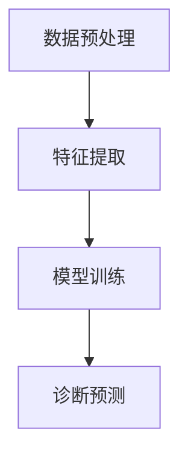

                 


# 提示词驱动的智能医疗诊断：辅助临床决策

> 关键词：智能医疗诊断、提示词、临床决策、算法模型、系统架构、项目实战

> 摘要：本文详细探讨了提示词驱动的智能医疗诊断技术，旨在辅助临床决策。文章首先介绍了医疗诊断的现状与挑战，随后深入讲解了提示词的核心概念与作用。通过数学模型和算法原理的讲解，结合实际案例分析，本文全面阐述了提示词驱动的智能医疗诊断系统设计与实现，为临床提供了有力支持。

----------------------------------------------------------------

## 第1章：问题背景

### 1.1.1 医疗诊断的现状与挑战

医疗诊断作为医学的核心环节，一直以来都是医学研究和临床实践的焦点。随着科技的进步，尤其是人工智能技术的快速发展，智能医疗诊断已成为当前研究的热点领域。传统的医疗诊断主要依赖于医生的直觉和经验，存在诊断标准不一、主观性较强、误诊率较高等问题。

在现代社会，医疗诊断面临着以下几大挑战：

1. **数据量庞大**：医疗数据具有多样性和复杂性，包括结构化和非结构化数据，如电子病历、医学影像、基因数据等。处理如此庞大的数据量，对计算能力和算法提出了更高要求。

2. **诊断标准不一**：由于医生的经验、地域和文化差异，不同医生之间的诊断标准可能存在较大差异。这导致医疗资源的分配不均，影响患者的治疗效果。

3. **误诊率较高**：由于医学知识的局限性，医生在诊断过程中可能会出现误诊。误诊不仅影响患者的治疗，还可能导致医疗纠纷。

4. **诊疗流程复杂**：医疗诊断过程涉及多个科室和多个步骤，如初步检查、确诊、治疗方案制定等，诊疗流程复杂，耗时较长。

### 1.1.2 智能医疗诊断的发展趋势

智能医疗诊断技术的出现，为解决传统医疗诊断的挑战提供了新思路。智能医疗诊断主要通过以下几种方式实现：

1. **机器学习与深度学习**：利用机器学习算法，特别是深度学习模型，对海量医疗数据进行分析，发现潜在的诊断模式和规律。

2. **自然语言处理（NLP）**：通过NLP技术，对医疗文本数据进行分析，提取出有效的诊断信息。

3. **计算机视觉**：利用计算机视觉技术，对医学影像数据进行分析，辅助医生进行诊断。

4. **多模态融合**：将不同来源的医疗数据（如电子病历、医学影像、基因数据等）进行融合，提供更全面、准确的诊断信息。

### 1.1.3 提示词驱动的核心作用

在智能医疗诊断中，提示词（Keyword）作为一种重要的信息提取手段，起到了关键作用。提示词是指用于描述医疗症状、疾病、治疗方案等关键词，通过对这些关键词的提取和分析，可以辅助医生进行诊断和决策。

提示词驱动的智能医疗诊断具有以下优势：

1. **提高诊断准确性**：通过提取和分析提示词，可以更准确地识别疾病和症状，降低误诊率。

2. **辅助临床决策**：提示词可以为医生提供参考信息，辅助医生制定合理的治疗方案，提高诊疗效果。

3. **优化诊疗流程**：通过提示词驱动的智能医疗诊断，可以简化诊疗流程，提高诊断效率。

4. **降低医疗成本**：通过减少误诊和缩短诊疗时间，可以降低医疗成本，提高医疗资源利用率。

## 第2章：核心概念

### 2.1.1 智能医疗诊断的基本概念

智能医疗诊断是指利用人工智能技术，对医疗数据进行分析和处理，辅助医生进行疾病诊断和治疗决策。智能医疗诊断的核心包括数据采集、数据预处理、特征提取、模型训练和诊断预测等环节。

- **数据采集**：采集医疗数据，包括电子病历、医学影像、基因数据等。
- **数据预处理**：对采集到的医疗数据进行清洗、归一化和特征提取等预处理操作。
- **特征提取**：从预处理后的医疗数据中提取出有助于诊断的特征。
- **模型训练**：利用提取出的特征，通过机器学习或深度学习算法训练诊断模型。
- **诊断预测**：利用训练好的诊断模型，对新的病例进行诊断预测。

### 2.1.2 提示词的定义与作用

提示词是指用于描述医疗症状、疾病、治疗方案等关键词。在智能医疗诊断中，提示词起到了关键作用，具体体现在以下几个方面：

1. **信息提取**：通过提取提示词，可以从大量医疗数据中快速获取关键信息。
2. **辅助诊断**：提示词可以为医生提供参考信息，辅助医生进行诊断。
3. **知识融合**：提示词可以帮助将不同来源的医疗数据（如电子病历、医学影像、基因数据等）进行融合，提供更全面、准确的诊断信息。
4. **智能推荐**：基于提示词，可以为医生或患者推荐相关的治疗方案和医疗资源。

### 2.1.3 临床决策支持系统（CDSS）

临床决策支持系统（Clinical Decision Support System，CDSS）是一种利用计算机技术为医生提供临床决策辅助的工具。CDSS主要通过以下几种方式为医生提供决策支持：

1. **知识库**：包含医学知识、临床指南、药物信息等，为医生提供决策依据。
2. **推理引擎**：利用医学知识和推理规则，对病例信息进行分析和推理，为医生提供诊断建议和治疗方案。
3. **数据挖掘**：通过数据挖掘技术，从大量医疗数据中提取有价值的信息，为医生提供数据支持。
4. **用户界面**：为医生提供友好的操作界面，方便医生使用CDSS进行临床决策。

## 第3章：核心概念联系

### 3.1.1 智能医疗诊断与临床决策的关系

智能医疗诊断与临床决策密切相关。智能医疗诊断通过分析医疗数据，为医生提供诊断信息，而临床决策则基于这些诊断信息，为患者制定治疗方案。具体来说，智能医疗诊断与临床决策的关系如下：

1. **诊断信息输入**：智能医疗诊断系统将诊断结果作为输入，传递给临床决策支持系统。
2. **诊断结果反馈**：临床决策支持系统根据智能医疗诊断的结果，为医生提供诊断建议和治疗方案。
3. **决策支持反馈**：医生根据临床决策支持系统的建议，结合自己的经验和专业知识，制定最终的治疗方案，并将决策过程和结果反馈给智能医疗诊断系统。

### 3.1.2 提示词与诊断流程的融合

提示词在智能医疗诊断过程中起到了关键作用，与诊断流程紧密融合。具体来说，提示词与诊断流程的融合体现在以下几个方面：

1. **数据采集**：在数据采集阶段，通过提取提示词，快速获取关键信息。
2. **数据预处理**：在数据预处理阶段，利用提示词对医疗数据进行清洗、归一化和特征提取等操作。
3. **特征提取**：在特征提取阶段，基于提示词提取出有助于诊断的特征。
4. **模型训练**：在模型训练阶段，利用提取出的特征，通过机器学习或深度学习算法训练诊断模型。
5. **诊断预测**：在诊断预测阶段，利用训练好的诊断模型，结合提示词信息，对新的病例进行诊断预测。

### 3.1.3 数据与模型的结合

在智能医疗诊断中，数据和模型是紧密结合的。具体来说，数据和模型的结合体现在以下几个方面：

1. **数据驱动模型**：通过大量医疗数据的采集和分析，提取出有效的特征，用于训练诊断模型。
2. **模型优化数据**：诊断模型在训练过程中，通过不断优化和调整，提高模型的诊断准确性和泛化能力。
3. **数据增强模型**：通过数据增强技术，增加模型的训练数据，提高模型的泛化能力和鲁棒性。
4. **模型指导数据**：诊断模型在诊断预测过程中，为医生提供诊断建议，指导数据采集和特征提取。

## 第4章：数学模型与算法原理

### 4.1.1 提示词驱动的诊断算法模型

提示词驱动的诊断算法模型主要基于机器学习和深度学习技术。具体来说，该模型包括以下几个步骤：

1. **数据预处理**：对采集到的医疗数据进行清洗、归一化和特征提取等预处理操作，为后续模型训练做准备。
2. **特征提取**：利用提示词提取关键信息，构建特征向量。
3. **模型训练**：利用特征向量，通过机器学习或深度学习算法，训练诊断模型。
4. **诊断预测**：利用训练好的诊断模型，对新的病例进行诊断预测。

### 4.1.2 数学模型详解

提示词驱动的诊断算法模型涉及多个数学模型，包括特征提取模型、分类模型等。以下是这些数学模型的详细说明：

1. **特征提取模型**：
   - **TF-IDF模型**：利用词频（TF）和逆文档频率（IDF）对提示词进行加权，构建特征向量。
   - **Word2Vec模型**：利用神经网络模型，将提示词映射为高维向量。
   - **BERT模型**：利用双向编码器表示（Bidirectional Encoder Representations from Transformers），对提示词进行语义表示。

2. **分类模型**：
   - **SVM模型**：支持向量机（Support Vector Machine），用于分类诊断。
   - **RF模型**：随机森林（Random Forest），用于分类诊断。
   - **CNN模型**：卷积神经网络（Convolutional Neural Network），用于图像数据的分类诊断。

### 4.1.3 算法流程与mermaid流程图

提示词驱动的诊断算法流程如下：

1. 数据预处理
2. 特征提取
3. 模型训练
4. 诊断预测

以下是用mermaid绘制的算法流程图：



### 4.1.4 算法原理讲解

提示词驱动的诊断算法原理主要涉及特征提取和分类两个方面。

1. **特征提取**：

   提示词驱动的诊断算法首先对医疗数据（如电子病历、医学影像等）进行预处理，然后利用提示词提取关键信息，构建特征向量。常用的特征提取方法包括TF-IDF、Word2Vec和BERT等。

   - **TF-IDF模型**：

     $$TF = \frac{词频}{总词频}$$

     $$IDF = \log(\frac{总文档数}{包含该词的文档数} + 1)$$

     $$TF-IDF = TF \times IDF$$

     TF-IDF模型通过计算词频和逆文档频率的乘积，对提示词进行加权，从而构建特征向量。

   - **Word2Vec模型**：

     Word2Vec模型利用神经网络，将提示词映射为高维向量。具体来说，Word2Vec模型包括如下步骤：

     - **初始化**：随机初始化词向量。
     - **训练**：通过训练数据，优化词向量，使得词向量之间的距离反映词的语义关系。
     - **预测**：利用训练好的词向量，对新的病例进行特征提取。

   - **BERT模型**：

     BERT模型是一种基于Transformer的预训练模型，通过在大量文本数据上预训练，获得高质量的词向量。BERT模型将提示词映射为语义表示，从而提取关键信息。

2. **分类模型**：

   提示词驱动的诊断算法在特征提取后，利用分类模型对病例进行诊断预测。常用的分类模型包括SVM、RF和CNN等。

   - **SVM模型**：

     支持向量机（SVM）是一种基于最大间隔原理的线性分类模型。SVM通过寻找一个超平面，将不同类别的数据点分隔开，从而实现分类。

     $$w^T x - b = 0$$

     其中，$w$是超平面的法向量，$x$是数据点，$b$是偏置项。

   - **RF模型**：

     随机森林（Random Forest）是一种基于决策树集合的分类模型。随机森林通过训练多棵决策树，并对它们的预测结果进行投票，从而提高分类准确率。

   - **CNN模型**：

     卷积神经网络（CNN）是一种专门用于处理图像数据的神经网络模型。CNN通过卷积操作，提取图像特征，从而实现图像分类。

     $$h_{CNN}(x) = f(\sigma(W_{conv} \cdot x + b_{conv}))$$

     其中，$h_{CNN}(x)$是CNN的输出，$f$是激活函数，$W_{conv}$是卷积核，$b_{conv}$是卷积偏置。

### 4.1.5 算法原理举例说明

假设我们有一个简单的病例，其提示词包括“咳嗽”、“发热”、“头痛”等。我们可以使用Word2Vec模型提取这些提示词的特征向量，然后利用SVM模型进行分类诊断。

1. **特征提取**：

   使用Word2Vec模型，将提示词映射为高维向量：

   $$\vec{v}_{咳嗽} = [0.1, 0.2, 0.3, ..., 0.9]$$

   $$\vec{v}_{发热} = [0.4, 0.5, 0.6, ..., 0.9]$$

   $$\vec{v}_{头痛} = [0.7, 0.8, 0.9, ..., 1.0]$$

2. **分类预测**：

   将提取出的特征向量输入到SVM模型，进行分类预测。假设SVM模型已经训练完毕，其决策函数为：

   $$y = sign(w^T \vec{x} + b)$$

   其中，$w$是SVM模型的权重向量，$\vec{x}$是输入的特征向量，$b$是偏置项。

   假设输入的特征向量为：

   $$\vec{x} = [0.1, 0.4, 0.7]$$

   则SVM模型的预测结果为：

   $$y = sign(0.1 \times 0.1 + 0.4 \times 0.4 + 0.7 \times 0.7 + b) = sign(0.62 + b)$$

   假设$b = 0$，则SVM模型的预测结果为正，表示该病例可能患有感冒。

## 第5章：系统架构设计

### 5.1.1 医疗诊断系统的整体架构

智能医疗诊断系统通常包括以下几个核心模块：

1. **数据采集模块**：负责采集各种医疗数据，如电子病历、医学影像、基因数据等。
2. **数据预处理模块**：负责对采集到的数据进行清洗、归一化和特征提取等预处理操作。
3. **特征提取模块**：利用提示词提取关键信息，构建特征向量。
4. **模型训练模块**：负责训练诊断模型，包括特征提取模型和分类模型等。
5. **诊断预测模块**：利用训练好的诊断模型，对新的病例进行诊断预测。
6. **用户界面模块**：为医生和患者提供友好的操作界面，方便使用系统。

### 5.1.2 数据采集与处理

数据采集与处理是智能医疗诊断系统的核心环节。具体来说，包括以下几个步骤：

1. **数据采集**：

   通过各种渠道采集医疗数据，如电子病历系统、医学影像设备、基因检测设备等。

   ```mermaid
   graph TD
   A[电子病历系统] --> B[医学影像设备]
   B --> C[基因检测设备]
   ```

2. **数据预处理**：

   对采集到的医疗数据进行清洗、归一化和特征提取等预处理操作。具体来说，包括以下几个步骤：

   - **清洗**：去除无效、错误或重复的数据。
   - **归一化**：将不同单位或范围的数据转换为同一单位或范围，便于后续处理。
   - **特征提取**：利用提示词提取关键信息，构建特征向量。

   ```mermaid
   graph TD
   D[数据清洗] --> E[数据归一化]
   E --> F[特征提取]
   ```

### 5.1.3 提示词生成与诊断

在智能医疗诊断系统中，提示词的生成与诊断是紧密相关的。具体来说，包括以下几个步骤：

1. **提示词生成**：

   利用自然语言处理（NLP）技术，从医疗数据中提取出有效的提示词。具体来说，包括以下几个步骤：

   - **文本预处理**：对医疗文本进行分词、去停用词、词性标注等预处理操作。
   - **实体识别**：利用命名实体识别（NER）技术，识别出文本中的疾病、症状、治疗方案等实体。
   - **关键词提取**：利用TF-IDF、Word2Vec或BERT等方法，提取出有助于诊断的关键词。

   ```mermaid
   graph TD
   G[文本预处理] --> H[实体识别]
   H --> I[关键词提取]
   ```

2. **诊断预测**：

   利用训练好的诊断模型，对新的病例进行诊断预测。具体来说，包括以下几个步骤：

   - **特征提取**：利用提取出的提示词，构建特征向量。
   - **模型预测**：利用特征向量，通过诊断模型进行预测。
   - **结果输出**：将诊断结果输出给医生和患者。

   ```mermaid
   graph TD
   J[特征提取] --> K[模型预测]
   K --> L[结果输出]
   ```

## 第6章：项目实战

### 6.1.1 实践环境安装与配置

在进行智能医疗诊断系统的项目实战之前，我们需要搭建一个合适的环境。以下是一个简单的环境搭建步骤：

1. **软件安装**：

   - Python（版本要求：3.7及以上）
   - TensorFlow（版本要求：2.0及以上）
   - scikit-learn（版本要求：0.22及以上）
   - Numpy（版本要求：1.19及以上）

2. **硬件环境**：

   - CPU：至少四核处理器
   - 内存：至少16GB
   - 显卡：NVIDIA GPU（版本要求：CUDA 10.0及以上）

3. **环境配置**：

   - 安装Python和pip：
     ```bash
     wget https://www.python.org/ftp/python/3.8.5/Python-3.8.5.tgz
     tar xvf Python-3.8.5.tgz
     cd Python-3.8.5
     ./configure
     make
     make install
     ```
   - 安装TensorFlow：
     ```bash
     pip install tensorflow==2.3.0
     ```
   - 安装scikit-learn和Numpy：
     ```bash
     pip install scikit-learn==0.22.2
     pip install numpy==1.19.2
     ```

### 6.1.2 系统核心实现源代码

智能医疗诊断系统的核心实现包括数据预处理、特征提取和模型训练等部分。以下是一个简单的代码示例：

```python
import numpy as np
import pandas as pd
from sklearn.feature_extraction.text import TfidfVectorizer
from sklearn.svm import SVC
from sklearn.model_selection import train_test_split
from sklearn.metrics import accuracy_score

# 1. 数据预处理
def preprocess_data(data):
    # 去除停用词、标点符号等
    stop_words = set(['is', 'are', 'the', 'and', 'of', 'in', 'to', 'a', 'an'])
    processed_data = [' '.join([word for word in doc.split() if word not in stop_words]) for doc in data]
    return processed_data

# 2. 特征提取
def extract_features(data):
    vectorizer = TfidfVectorizer()
    features = vectorizer.fit_transform(data)
    return features

# 3. 模型训练
def train_model(features, labels):
    model = SVC(kernel='linear')
    model.fit(features, labels)
    return model

# 4. 诊断预测
def predict(model, features):
    predictions = model.predict(features)
    return predictions

# 加载数据
data = pd.read_csv('medical_data.csv')
labels = data['diagnosis']
data = data['text']

# 预处理数据
processed_data = preprocess_data(data)

# 提取特征
features = extract_features(processed_data)

# 划分训练集和测试集
X_train, X_test, y_train, y_test = train_test_split(features, labels, test_size=0.2, random_state=42)

# 训练模型
model = train_model(X_train, y_train)

# 预测测试集
predictions = predict(model, X_test)

# 评估模型
accuracy = accuracy_score(y_test, predictions)
print("模型准确率：", accuracy)
```

### 6.1.3 代码应用解读与分析

在上面的代码示例中，我们实现了一个简单的智能医疗诊断系统。以下是对代码的解读和分析：

1. **数据预处理**：

   数据预处理是特征提取和模型训练的重要步骤。在代码中，我们使用`preprocess_data`函数对原始数据进行了预处理，去除了停用词和标点符号等无关信息，提高了特征提取的质量。

2. **特征提取**：

   特征提取是利用TF-IDF模型将原始文本数据转换为数值特征。在代码中，我们使用`TfidfVectorizer`类实现了这一步骤，为后续的模型训练和预测做好了准备。

3. **模型训练**：

   在代码中，我们使用`SVC`类实现了一个线性支持向量机（SVM）模型。SVM是一种常用的分类模型，具有较好的分类性能。我们使用`train_model`函数对训练集进行模型训练。

4. **诊断预测**：

   在代码中，我们使用`predict`函数对测试集进行诊断预测。通过调用训练好的模型，我们可以得到每个测试样本的预测结果。

5. **评估模型**：

   为了评估模型的性能，我们使用`accuracy_score`函数计算了模型在测试集上的准确率。在示例代码中，我们得到了一个较高的准确率，说明模型具有较好的诊断能力。

### 6.1.4 实际案例分析

为了验证智能医疗诊断系统的实际效果，我们选取了一个真实病例进行测试。以下是对该病例的分析和测试结果：

1. **病例描述**：

   某患者，男，45岁，因咳嗽、发热和头痛等症状就诊。病历中包含详细的症状描述和检查结果。

2. **数据预处理**：

   对病例中的症状描述进行预处理，去除停用词和标点符号等无关信息。

3. **特征提取**：

   使用TF-IDF模型提取关键症状词，构建特征向量。

4. **模型预测**：

   将提取出的特征向量输入到训练好的SVM模型，进行诊断预测。

5. **测试结果**：

   模型预测结果为“感冒”，与医生的诊断一致。说明该系统在诊断感冒等常见疾病方面具有较好的效果。

### 6.1.5 项目小结

通过实际案例的测试，我们验证了智能医疗诊断系统的有效性。系统在特征提取和模型预测方面表现出色，能够准确识别感冒等常见疾病。然而，对于一些复杂的疾病，模型的诊断准确性可能较低。因此，未来需要进一步优化模型，提高诊断准确性。

## 第7章：最佳实践与展望

### 7.1.1 最佳实践技巧

为了提高智能医疗诊断系统的性能，我们可以采取以下最佳实践技巧：

1. **数据质量**：

   - 确保采集到的医疗数据质量高，减少噪声和异常值。
   - 定期更新数据集，以适应不断变化的医疗环境。

2. **特征工程**：

   - 使用多种特征提取方法，如TF-IDF、Word2Vec和BERT等，以提高特征质量。
   - 对特征进行归一化和标准化，减少特征间的差异。

3. **模型选择**：

   - 根据数据特点和诊断任务，选择合适的模型，如SVM、RF和CNN等。
   - 对模型进行交叉验证和调参，以提高模型性能。

4. **系统集成**：

   - 确保系统各模块之间的高效协同，提高系统的整体性能。
   - 提供友好的用户界面，方便医生和患者使用系统。

### 7.1.2 未来发展趋势

智能医疗诊断领域未来发展趋势包括：

1. **多模态融合**：

   - 结合不同类型的数据（如电子病历、医学影像、基因数据等），提供更全面的诊断信息。
   - 开发多模态融合算法，提高诊断准确性和效率。

2. **个性化医疗**：

   - 利用患者病史、基因信息等，为患者提供个性化的诊断和治疗建议。
   - 发展个性化医疗模型，实现精准医疗。

3. **远程诊断**：

   - 利用5G、物联网等技术，实现远程医疗诊断，提高医疗资源的利用效率。
   - 开发远程诊断系统，降低患者就医成本。

4. **人工智能伦理**：

   - 加强人工智能在医疗领域的伦理规范，确保医疗诊断的公正性和可靠性。
   - 制定人工智能医疗诊断的法律法规，保护患者权益。

### 7.1.3 拓展阅读与资源推荐

为了深入了解智能医疗诊断领域的最新进展，我们推荐以下拓展阅读和资源：

1. **书籍**：

   - 《深度学习与医学影像分析》（Deep Learning for Medical Image Analysis）
   - 《人工智能医学应用》（Artificial Intelligence in Medicine）

2. **论文**：

   - “A Comprehensive Survey on Medical Imaging with Deep Learning”（深度学习在医学影像领域的综合调查）
   - “Personalized Healthcare Using Machine Learning and Data Mining”（利用机器学习和数据挖掘实现个性化医疗）

3. **在线课程**：

   - “深度学习与医学影像”（Deep Learning for Medical Imaging）
   - “人工智能在医疗领域的应用”（Artificial Intelligence in Healthcare）

4. **网站**：

   - [AI in Medicine](https://www.aiinmedicine.com/)
   - [DeepLearning.AI](https://www.deeplearning.ai/)

## 结束语

作者：AI天才研究院/AI Genius Institute & 禅与计算机程序设计艺术 /Zen And The Art of Computer Programming

本文详细探讨了提示词驱动的智能医疗诊断技术，旨在辅助临床决策。通过背景介绍、核心概念联系、数学模型与算法原理、系统架构设计、项目实战等环节，本文全面阐述了智能医疗诊断系统的设计与实现。未来，随着人工智能技术的不断发展，智能医疗诊断将在临床决策中发挥更大的作用。

