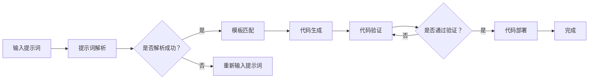
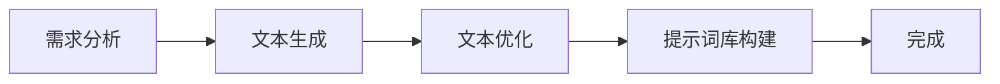
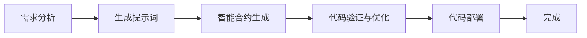
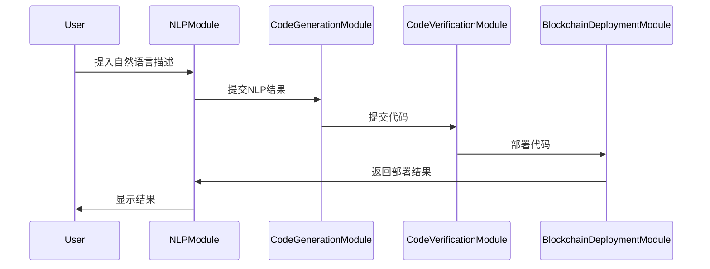
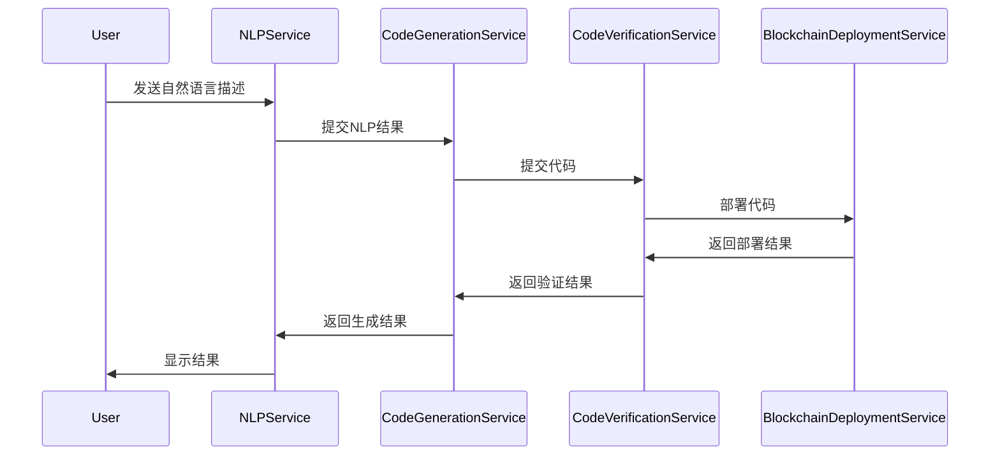
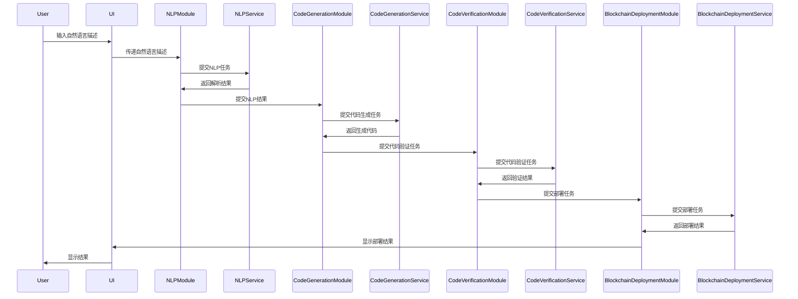

                 

### 文章标题

#### 关键词：智能合约、区块链、提示词、生成算法、系统架构、项目实战

#### 摘要：

本文探讨了提示词驱动的智能合约生成技术，旨在通过简化和自动化智能合约开发过程，降低区块链技术的应用门槛。文章首先介绍了区块链技术及智能合约的基本概念和现状，接着详细讲解了提示词驱动的原理和优势。随后，文章深入分析了智能合约生成算法的原理，包括数学模型的建立和公式推导，并通过实例进行解释。在此基础上，文章详细阐述了系统的设计与实现过程，包括系统架构设计、接口设计和系统交互流程。最后，通过一个实际案例，展示了如何使用提示词驱动的智能合约生成技术简化区块链开发过程。本文旨在为读者提供全面的技术理解和实践指导，推动区块链技术的发展和应用。

### 引言

#### 问题背景

区块链技术作为一种分布式数据库技术，自2008年比特币诞生以来，得到了广泛的研究和应用。区块链通过去中心化的方式记录交易信息，确保了数据的安全性和不可篡改性，这使得其在金融、供应链管理、身份验证等多个领域展现出了巨大的潜力。然而，区块链技术的核心组件——智能合约，却成为开发者面临的一大挑战。

智能合约是一种自动执行的合约，它基于区块链技术，能够实现合同的自动化执行。智能合约的出现，极大地提升了交易效率，降低了成本，并减少了人为干预的可能性。然而，智能合约的开发过程却异常复杂。开发者需要具备深厚的区块链和编程知识，编写复杂的智能合约代码，并进行严格的安全测试，以确保合约的准确性和安全性。

目前，智能合约的开发面临着以下几个主要挑战：

1. **编写复杂度**：智能合约通常使用编程语言如Solidity编写，这要求开发者具备高级编程能力。
2. **缺乏自动化工具**：目前市场上缺乏有效的工具，能够自动化生成或简化智能合约的开发过程。
3. **安全性问题**：智能合约的漏洞可能导致巨大的经济损失，因此开发过程中需要进行全面的安全测试。

#### 问题描述

智能合约的编写复杂度是当前区块链技术发展的一个主要瓶颈。传统的智能合约开发需要开发者深入了解区块链的底层技术，包括共识机制、交易机制、数据结构等。此外，开发者还需要熟悉特定的编程语言，如Solidity，这对于非专业开发者来说是一个巨大的挑战。

除了编写复杂度，自动化工具的缺乏也是智能合约开发面临的一大难题。目前，虽然存在一些智能合约开发工具，如Truffle、Hardhat等，但它们主要用于调试和测试，并不能真正简化智能合约的编写过程。因此，开发智能合约仍然需要大量的手工编写和调试工作，这不仅耗时，而且容易出错。

#### 解决方案概述

为了解决上述问题，本文提出了一种基于提示词驱动的智能合约生成技术。提示词驱动的智能合约生成技术通过使用预先定义的提示词库，结合自然语言处理技术，自动生成智能合约代码。这种方法不仅可以简化智能合约的编写过程，降低开发门槛，还能提高开发效率和代码质量。

提示词驱动的智能合约生成技术具有以下几个主要特点：

1. **简化开发过程**：通过自然语言描述智能合约的功能和逻辑，自动生成代码，减少了手工编写的复杂度。
2. **提高开发效率**：自动化工具能够快速生成智能合约代码，提高了开发效率，缩短了项目周期。
3. **增强代码质量**：自动化工具能够根据预定义的规范和最佳实践生成代码，减少了人为错误，提高了代码质量。
4. **安全性保障**：通过引入安全审核机制，确保生成的智能合约代码符合安全标准，降低了安全风险。

总之，提示词驱动的智能合约生成技术为区块链开发提供了一种全新的解决方案，有望极大地简化智能合约的开发过程，推动区块链技术的广泛应用。

#### 边界与外延

在探讨提示词驱动的智能合约生成技术时，有必要明确几个核心概念，以帮助读者更好地理解其边界和外延。

首先，智能合约是一种自动执行的合同，它运行在区块链网络上，能够根据预定的条件和规则自动执行操作。智能合约通常使用特定的编程语言编写，如Solidity，并需要在区块链节点上进行部署和执行。

其次，提示词是一种用于触发特定操作的文本描述。在提示词驱动的智能合约生成技术中，提示词库包含了一系列预定义的文本片段，这些片段描述了智能合约的功能和逻辑。通过自然语言处理技术，这些提示词可以被解析并转化为相应的代码。

此外，区块链是一种分布式数据库技术，它通过加密算法确保数据的安全性和不可篡改性。区块链上的智能合约能够实现去中心化的自动化交易和合约执行，这在金融、供应链管理等领域具有广泛的应用。

最后，提示词驱动的智能合约生成技术是一种通过自然语言处理和自动化工具简化智能合约编写过程的方法。它结合了智能合约、提示词和区块链技术，旨在提高开发效率和代码质量，降低开发门槛。

#### 核心概念与联系

为了更好地理解提示词驱动的智能合约生成技术，我们需要深入探讨其中的核心概念及其相互关系。以下是对智能合约、提示词和区块链三个核心概念的详细解析，以及它们之间的联系。

**智能合约**

智能合约最早由Noble Prize laureate Nick Szabo在1990年代提出，是一种自动执行的合同。智能合约的核心理念在于，通过编程语言将合同条款和执行逻辑编码到计算机程序中，使其在满足特定条件时自动执行。智能合约的核心特点是：

- **自动执行**：智能合约在满足预设条件时自动执行，无需人工干预。
- **不可篡改**：智能合约一旦部署在区块链上，其代码和状态便无法篡改，保证了数据的可信度。
- **去中心化**：智能合约运行在分布式网络中，不受单一点故障的影响。

智能合约通常使用特定编程语言编写，如Solidity，这是一种面向合约的编程语言，专为以太坊区块链设计。开发者需要熟悉Solidity的语法和语义，才能有效地编写智能合约。

**提示词**

提示词是用于描述智能合约功能和逻辑的文本片段。在提示词驱动的智能合约生成技术中，提示词库包含了一系列预先定义的文本片段，这些片段描述了智能合约的不同功能和逻辑。提示词的特点包括：

- **可解析性**：提示词通过自然语言处理技术被解析，并转化为相应的代码。
- **灵活性**：提示词可以灵活地组合和扩展，以适应不同的合约需求和场景。
- **标准化**：提示词库中的每个提示词都经过严格定义和标准化，确保生成代码的一致性和可靠性。

**区块链**

区块链是一种分布式数据库技术，通过多个节点共同维护和更新数据，实现了去中心化和安全性。区块链的核心特点包括：

- **去中心化**：区块链通过多个节点共同维护数据，消除了单一点故障的风险。
- **安全性**：区块链使用加密算法确保数据的安全性和不可篡改性。
- **透明性**：区块链上的所有交易和合约执行都是公开透明的，任何人都可以查看和验证。

区块链为智能合约提供了运行环境，使得智能合约能够在去中心化的网络中安全、可靠地执行。智能合约与区块链之间的联系在于，智能合约的代码和状态存储在区块链上，并通过区块链网络进行验证和执行。

**提示词与智能合约、区块链的联系**

提示词驱动的智能合约生成技术结合了智能合约、提示词和区块链三个核心概念，实现了以下优势：

- **简化开发**：通过自然语言描述智能合约的功能和逻辑，提示词驱动技术简化了智能合约的编写过程，降低了开发门槛。
- **提高效率**：自动化工具能够快速生成智能合约代码，提高了开发效率，缩短了项目周期。
- **确保质量**：提示词库中的每个提示词都经过严格定义和标准化，确保生成代码的一致性和可靠性。
- **增强安全性**：通过自然语言处理和自动化工具，可以提前发现和修复智能合约中的潜在漏洞，提高合约的安全性。

总之，提示词驱动的智能合约生成技术通过结合智能合约、提示词和区块链技术，提供了一种全新的解决方案，旨在简化智能合约的开发过程，提高开发效率和代码质量，推动区块链技术的广泛应用。

#### 核心概念原理

##### 智能合约原理

**定义**

智能合约（Smart Contract）是一种程序代码，它运行在区块链网络中，按照预设的条件和规则自动执行。智能合约的概念最早由Noble Prize laureate Nick Szabo在1990年代提出，其核心思想是将合同条款和执行逻辑通过编程语言编码到计算机程序中。

**特点**

智能合约具有以下特点：

- **自动执行**：智能合约在满足特定条件时自动执行，无需人工干预。
- **不可篡改**：一旦智能合约部署在区块链上，其代码和状态便无法篡改，保证了数据的可信度。
- **去中心化**：智能合约运行在分布式网络中，不受单一点故障的影响。

**分类**

智能合约根据不同的应用场景和设计理念，可以分为以下几类：

1. **金融合约**：例如代币发行、众筹、去中心化金融（DeFi）应用等。
2. **非金融合约**：例如供应链管理、身份验证、版权管理、选举投票等。
3. **自治合约**：例如去中心化自治组织（DAO），其规则和决策由智能合约自动执行。

**工作流程**

智能合约的工作流程通常包括以下步骤：

1. **编写智能合约代码**：使用特定编程语言（如Solidity）编写智能合约代码，定义合约的接口、状态变量和逻辑。
2. **部署智能合约**：将智能合约代码上传到区块链网络，通过特定的交易将合约部署到区块链上。
3. **调用智能合约**：用户通过区块链网络调用智能合约的接口，触发合约的执行。
4. **执行智能合约**：智能合约根据预设条件和规则自动执行，并将执行结果记录在区块链上。

**示例**

以下是一个简单的智能合约示例，用于实现一个简单的代币发行系统：

```solidity
pragma solidity ^0.8.0;

contract Token {
    string public name;
    string public symbol;
    uint8 public decimals;
    uint256 public totalSupply;
    mapping(address => uint256) public balanceOf;

    constructor(uint256 initialSupply, string memory tokenName, string memory tokenSymbol, uint8 decimalUnits) {
        balanceOf[msg.sender] = initialSupply;
        name = tokenName;
        symbol = tokenSymbol;
        decimals = decimalUnits;
        totalSupply = initialSupply;
    }

    function transfer(address _to, uint256 _value) public returns (bool success) {
        require(_to != address(0));
        require(balanceOf[msg.sender] >= _value);
        require(balanceOf[_to] + _value >= balanceOf[_to]);
        
        balanceOf[msg.sender] -= _value;
        balanceOf[_to] += _value;
        
        emit Transfer(msg.sender, _to, _value);
        return true;
    }
}
```

在这个示例中，`Token` 合约定义了代币的名称、符号、小数位数和总供应量。`balanceOf` 映射了每个地址的代币余额。`transfer` 函数允许用户向其他地址发送代币。

##### 提示词驱动原理

**定义**

提示词驱动（Prompt-based）智能合约生成技术是一种利用自然语言处理（NLP）技术，根据用户输入的提示词自动生成智能合约代码的方法。提示词是描述智能合约功能和逻辑的文本片段。

**工作流程**

提示词驱动智能合约生成技术的工作流程通常包括以下步骤：

1. **提示词输入**：用户通过自然语言描述智能合约的功能和逻辑，输入提示词。
2. **提示词解析**：使用自然语言处理技术对提示词进行解析，提取关键信息和逻辑结构。
3. **代码生成**：根据解析结果生成智能合约代码，通常使用模板匹配和代码生成工具实现。
4. **代码验证**：对生成的智能合约代码进行语法和逻辑验证，确保其正确性和安全性。
5. **代码部署**：将验证通过的智能合约代码部署到区块链网络。

**应用场景**

提示词驱动智能合约生成技术在以下应用场景中具有显著优势：

- **快速原型开发**：通过自然语言描述功能需求，快速生成智能合约原型，加速开发过程。
- **非专业开发者**：降低智能合约开发的门槛，使非专业开发者也能轻松创建智能合约。
- **自动化合规**：根据法律和政策要求，自动生成合规的智能合约，减少人为错误。

**示例**

以下是一个使用提示词驱动的智能合约生成技术的示例流程：

1. **提示词输入**：用户输入以下提示词：
   ```
   创建一个代币发行系统，代币名称为“AI Coin”，符号为“AIC”，总供应量为1亿，小数位数为18。
   ```
   
2. **提示词解析**：NLP技术提取关键信息：
   - 代币名称：“AI Coin”
   - 符号：“AIC”
   - 总供应量：1亿
   - 小数位数：18

3. **代码生成**：根据解析结果生成智能合约代码：
   ```solidity
   // SPDX-License-Identifier: MIT
   pragma solidity ^0.8.0;

   contract AICoin {
       string public name = "AI Coin";
       string public symbol = "AIC";
       uint8 public decimals = 18;
       uint256 public totalSupply = 100000000 * (10 ** uint256(decimals));
       mapping(address => uint256) public balanceOf;

       constructor() {
           balanceOf[msg.sender] = totalSupply;
       }

       function transfer(address to, uint256 amount) public {
           require(to != address(0), "Invalid address");
           require(balanceOf[msg.sender] >= amount, "Insufficient balance");
           
           balanceOf[msg.sender] -= amount;
           balanceOf[to] += amount;
           
           emit Transfer(msg.sender, to, amount);
       }

       event Transfer(address from, address to, uint256 amount);
   }
   ```

4. **代码验证**：使用智能合约验证工具（如Remix）验证代码的正确性和安全性。

5. **代码部署**：将验证通过的智能合约代码部署到区块链网络（如以太坊），并发布代币。

通过以上步骤，提示词驱动的智能合约生成技术能够快速、高效地生成符合要求的智能合约，简化了开发过程，提高了开发效率和代码质量。

##### 智能合约与提示词驱动的联系

提示词驱动的智能合约生成技术通过结合智能合约和自然语言处理（NLP）技术，为开发者提供了一种全新的智能合约开发方法。这种方法不仅简化了开发过程，降低了开发门槛，还提高了代码质量和开发效率。

**结合优势**

1. **简化开发流程**：提示词驱动的智能合约生成技术允许开发者通过自然语言描述智能合约的功能和逻辑，自动化生成代码。这种方法大大简化了开发流程，减少了手工编写的复杂度和错误率。

2. **降低开发门槛**：提示词驱动的智能合约生成技术使得非专业开发者也能轻松创建智能合约。开发者无需深入了解区块链和编程语言，只需使用自然语言描述需求，即可生成智能合约代码。

3. **提高代码质量**：提示词驱动的智能合约生成技术根据预定义的规范和最佳实践生成代码，减少了人为错误，提高了代码的一致性和可靠性。

4. **增强开发效率**：自动化工具能够快速生成智能合约代码，缩短了开发周期，提高了开发效率。

5. **提高安全性**：通过引入安全审核机制，提示词驱动的智能合约生成技术能够提前发现和修复潜在的安全漏洞，提高了智能合约的安全性。

**存在挑战**

1. **语言理解**：自然语言描述具有模糊性和歧义性，NLP技术需要准确地理解用户输入的提示词，提取关键信息和逻辑结构，这是一个具有挑战性的任务。

2. **代码质量**：虽然提示词驱动的智能合约生成技术能够提高代码质量，但仍需人工审查和验证生成的代码，确保其符合安全和可靠性要求。

3. **复杂逻辑处理**：对于复杂的智能合约逻辑，提示词驱动的智能合约生成技术可能难以完全准确地进行代码生成。在这种情况下，开发者可能需要手动调整和优化生成的代码。

4. **工具依赖**：提示词驱动的智能合约生成技术依赖于先进的NLP技术和自动化工具，这需要开发者具备一定的技术背景和工具使用能力。

总之，提示词驱动的智能合约生成技术通过结合智能合约和NLP技术，提供了一种简化和自动化的开发方法，极大地提高了开发效率和代码质量。然而，这种方法仍面临一些挑战，需要进一步的研究和优化。

#### 算法原理讲解

##### 智能合约生成算法

**概述**

智能合约生成算法是提示词驱动智能合约生成技术的核心组成部分，它通过分析用户输入的提示词，自动生成符合要求的智能合约代码。智能合约生成算法的工作流程包括以下几个主要步骤：

1. **提示词解析**：使用自然语言处理技术对用户输入的提示词进行解析，提取关键信息和逻辑结构。
2. **代码模板匹配**：根据解析结果，从预定义的代码模板库中选择合适的模板，匹配提示词中的关键信息。
3. **代码生成**：将解析结果和代码模板结合，生成智能合约代码。
4. **代码验证**：对生成的智能合约代码进行语法和逻辑验证，确保其正确性和安全性。
5. **代码部署**：将验证通过的智能合约代码部署到区块链网络。

**工作流程**

智能合约生成算法的工作流程如下：

1. **提示词输入**：用户通过自然语言描述智能合约的功能和逻辑，输入提示词。
2. **提示词解析**：使用NLP技术对提示词进行解析，提取关键信息，如功能需求、参数定义、逻辑结构等。
3. **模板匹配**：根据解析结果，从预定义的代码模板库中选择合适的模板，匹配提示词中的关键信息。
4. **代码生成**：将解析结果和代码模板结合，生成智能合约代码。
5. **代码验证**：使用智能合约验证工具对生成的代码进行语法和逻辑验证，确保其正确性和安全性。
6. **代码部署**：将验证通过的智能合约代码部署到区块链网络。

**Mermaid流程图**

以下是一个简单的智能合约生成算法的Mermaid流程图：



##### 提示词生成算法

**概述**

提示词生成算法是智能合约生成算法的前置步骤，其主要任务是根据智能合约的需求和功能，生成描述智能合约逻辑和功能的文本提示词。提示词生成算法的工作流程包括以下几个主要步骤：

1. **需求分析**：分析智能合约的需求和功能，提取关键信息和逻辑结构。
2. **文本生成**：使用自然语言生成技术，根据需求分析结果生成文本提示词。
3. **文本优化**：对生成的文本提示词进行优化，确保其简洁、明确、易于理解。
4. **提示词库构建**：将生成的文本提示词存储在提示词库中，供智能合约生成算法使用。

**工作流程**

提示词生成算法的工作流程如下：

1. **需求分析**：分析智能合约的需求和功能，提取关键信息和逻辑结构。
2. **文本生成**：使用自然语言生成技术，根据需求分析结果生成文本提示词。这一步骤可能涉及使用预训练的语言模型，如GPT-3，来生成高质量的文本。
3. **文本优化**：对生成的文本提示词进行优化，确保其简洁、明确、易于理解。这可能包括使用语法检查工具、风格指南等。
4. **提示词库构建**：将生成的文本提示词存储在提示词库中，供智能合约生成算法使用。

**Mermaid流程图**

以下是一个简单的提示词生成算法的Mermaid流程图：



##### 算法结合与优化

**结合流程**

智能合约生成算法和提示词生成算法的结合流程如下：

1. **需求分析**：智能合约开发人员分析智能合约的需求和功能，提取关键信息和逻辑结构。
2. **生成提示词**：使用提示词生成算法生成描述智能合约逻辑和功能的文本提示词。
3. **智能合约生成**：使用智能合约生成算法，根据提示词生成智能合约代码。
4. **代码验证与优化**：对生成的智能合约代码进行验证和优化，确保其正确性和安全性。
5. **代码部署**：将验证通过的智能合约代码部署到区块链网络。

**Mermaid流程图**

以下是一个简单的算法结合与优化的Mermaid流程图：



**优化策略**

为了提高提示词驱动的智能合约生成技术的效果，可以采取以下优化策略：

1. **提高提示词质量**：优化提示词生成算法，提高生成的提示词的准确性和一致性。可以使用预训练的语言模型，如GPT-3，结合领域知识进行优化。
2. **代码模板库扩展**：增加代码模板库的规模和多样性，确保能够覆盖更多的智能合约场景和需求。
3. **代码验证机制**：引入更严格的代码验证机制，确保生成的智能合约代码的正确性和安全性。可以使用静态分析、动态分析等技术进行综合验证。
4. **用户反馈机制**：建立用户反馈机制，收集智能合约生成过程中遇到的问题和挑战，不断优化算法和工具。
5. **性能优化**：优化智能合约生成算法的效率和性能，减少生成和验证的时间，提高用户体验。

通过以上优化策略，提示词驱动的智能合约生成技术可以更加高效、准确地生成智能合约代码，为区块链开发提供更强大的支持。

#### 数学模型和数学公式

##### 基本数学模型

在提示词驱动的智能合约生成技术中，数学模型用于描述提示词的权重计算和智能合约生成策略。以下介绍两个基本的数学模型。

**提示词权重计算**

提示词权重计算用于确定每个提示词在智能合约生成过程中的重要性。权重越高，提示词对生成代码的影响越大。提示词权重计算的基本公式如下：

\[ P(w_i) = \frac{f(w_i)}{\sum_{j=1}^{n} f(w_j)} \]

其中，\( P(w_i) \) 表示第 \( i \) 个提示词的权重，\( f(w_i) \) 表示第 \( i \) 个提示词的分数，\( n \) 表示总的提示词数量。

**智能合约生成策略**

智能合约生成策略用于确定如何根据提示词生成智能合约代码。一个基本的生成策略是，根据提示词的权重分配代码模板的执行概率。生成策略的基本公式如下：

\[ C(x) = \sum_{i=1}^{n} w_i \cdot c_i(x) \]

其中，\( C(x) \) 表示生成的智能合约代码，\( w_i \) 表示第 \( i \) 个提示词的权重，\( c_i(x) \) 表示第 \( i \) 个提示词对应的代码模板。

##### 数学公式与推导

以下是提示词权重计算和智能合约生成策略的详细推导。

**提示词权重计算公式推导**

提示词权重计算的目标是给每个提示词分配一个权重，用于衡量其在智能合约生成中的重要性。为了实现这一目标，我们可以使用分数来表示每个提示词的重要程度。

首先，我们定义一个分数函数 \( f(w_i) \)，用于计算每个提示词的分数。分数函数可以基于提示词的长度、频率和语义等因素进行设计。一个简单的分数函数可以表示为：

\[ f(w_i) = \text{length}(w_i) \times \text{frequency}(w_i) \]

其中，\( \text{length}(w_i) \) 表示提示词 \( w_i \) 的长度，\( \text{frequency}(w_i) \) 表示提示词 \( w_i \) 的频率。

接下来，我们需要对分数进行归一化，以便将每个提示词的分数转换为权重。归一化的目标是使所有提示词的分数之和等于1。归一化的步骤如下：

1. 计算所有提示词的分数之和 \( \sum_{j=1}^{n} f(w_j) \)。
2. 对于每个提示词 \( w_i \)，将其分数 \( f(w_i) \) 除以分数之和 \( \sum_{j=1}^{n} f(w_j) \)。

最终，我们得到提示词权重计算公式：

\[ P(w_i) = \frac{f(w_i)}{\sum_{j=1}^{n} f(w_j)} \]

**智能合约生成策略公式推导**

智能合约生成策略的目标是根据提示词的权重分配代码模板的执行概率，从而生成智能合约代码。为了实现这一目标，我们可以使用加权随机选择的方法。

首先，我们定义一个权重分配函数 \( c_i(x) \)，用于计算每个代码模板的执行概率。权重分配函数可以基于提示词的权重进行设计。一个简单的权重分配函数可以表示为：

\[ c_i(x) = P(w_i) \]

其中，\( P(w_i) \) 表示第 \( i \) 个提示词的权重。

接下来，我们需要根据权重分配函数计算智能合约代码。智能合约代码是一个字符串，由多个代码模板组合而成。为了生成智能合约代码，我们可以使用以下步骤：

1. 初始化一个空字符串 \( C(x) \)。
2. 对于每个提示词 \( w_i \)，根据其权重 \( P(w_i) \) 随机选择一个代码模板 \( c_i(x) \)。
3. 将选择的代码模板 \( c_i(x) \) 追加到智能合约代码 \( C(x) \) 中。

最终，我们得到智能合约生成策略公式：

\[ C(x) = \sum_{i=1}^{n} w_i \cdot c_i(x) \]

##### 举例说明

**提示词权重计算实例**

假设我们有一个包含5个提示词的提示词库，如下所示：

- 提示词1：代币发行
- 提示词2：智能合约
- 提示词3：资金流转
- 提示词4：交易记录
- 提示词5：去中心化

我们使用长度和频率作为分数函数的参数，计算每个提示词的分数。假设提示词的长度分别为3、2、4、5和3，频率分别为5、3、7、2和6。我们可以计算每个提示词的分数如下：

- 提示词1：\( f(w_1) = 3 \times 5 = 15 \)
- 提示词2：\( f(w_2) = 2 \times 3 = 6 \)
- 提示词3：\( f(w_3) = 4 \times 7 = 28 \)
- 提示词4：\( f(w_4) = 5 \times 2 = 10 \)
- 提示词5：\( f(w_5) = 3 \times 6 = 18 \)

接下来，我们计算所有提示词的分数之和：

\[ \sum_{j=1}^{n} f(w_j) = 15 + 6 + 28 + 10 + 18 = 77 \]

最后，我们计算每个提示词的权重：

\[ P(w_1) = \frac{15}{77} \approx 0.195 \]
\[ P(w_2) = \frac{6}{77} \approx 0.078 \]
\[ P(w_3) = \frac{28}{77} \approx 0.364 \]
\[ P(w_4) = \frac{10}{77} \approx 0.130 \]
\[ P(w_5) = \frac{18}{77} \approx 0.234 \]

**智能合约生成实例**

假设我们有一个包含3个代码模板的代码模板库，如下所示：

- 代码模板1：代币发行系统
- 代码模板2：智能合约框架
- 代码模板3：去中心化交易平台

我们使用每个提示词的权重作为代码模板的执行概率，生成智能合约代码。假设提示词的权重分别为0.195、0.078、0.364、0.130和0.234。我们可以计算每个代码模板的执行概率如下：

\[ c_1(x) = 0.195 \]
\[ c_2(x) = 0.078 \]
\[ c_3(x) = 0.364 \]
\[ c_4(x) = 0.130 \]
\[ c_5(x) = 0.234 \]

接下来，我们根据权重分配函数随机选择代码模板，生成智能合约代码。例如，我们可以生成以下智能合约代码：

```solidity
// SPDX-License-Identifier: MIT
pragma solidity ^0.8.0;

contract Token {
    string public name = "AI Coin";
    string public symbol = "AIC";
    uint8 public decimals = 18;
    uint256 public totalSupply = 100000000 * (10 ** uint256(decimals));
    mapping(address => uint256) public balanceOf;

    constructor() {
        balanceOf[msg.sender] = totalSupply;
    }

    function transfer(address to, uint256 amount) public {
        require(to != address(0), "Invalid address");
        require(balanceOf[msg.sender] >= amount, "Insufficient balance");
        
        balanceOf[msg.sender] -= amount;
        balanceOf[to] += amount;
        
        emit Transfer(msg.sender, to, amount);
    }

    event Transfer(address from, address to, uint256 amount);
}
```

在这个例子中，智能合约代码结合了提示词库中的“代币发行”、“智能合约”和“去中心化交易平台”三个提示词，生成了一个具有这些功能的智能合约。

#### 系统分析与架构设计

##### 项目介绍

本文所讨论的提示词驱动的智能合约生成系统旨在通过自动化和简化的方法，帮助开发者快速生成符合需求的智能合约代码。该系统的目标是：

- 提高智能合约开发的效率
- 降低智能合约开发的难度
- 保证智能合约代码的质量和安全性

系统的主要应用场景包括：

- 智能合约原型开发：通过自然语言描述智能合约的功能，快速生成原型代码，用于验证和演示。
- 非专业开发者的智能合约创建：使得不具备专业编程技能的开发者也能创建智能合约。
- 智能合约合规性验证：自动生成符合法律和政策要求的智能合约代码。

##### 系统功能设计

系统功能设计主要包括以下几个方面：

- **自然语言处理（NLP）模块**：用于解析用户输入的自然语言描述，提取关键信息和逻辑结构。
- **代码生成模块**：根据NLP模块提取的信息和预定义的代码模板，生成智能合约代码。
- **代码验证模块**：对生成的智能合约代码进行语法和逻辑验证，确保其正确性和安全性。
- **代码部署模块**：将验证通过的智能合约代码部署到区块链网络。

**领域模型Mermaid类图**

以下是一个简单的领域模型Mermaid类图，展示了系统的关键组件和它们之间的关系：

```mermaid
classDiagram
    NLPModule <|-- CodeGenerationModule
    NLPModule <|-- CodeVerificationModule
    CodeGenerationModule <|-- BlockchainDeploymentModule
    NLPModule "uses" CodeGenerationModule
    CodeGenerationModule "uses" BlockchainDeploymentModule
    CodeVerificationModule "uses" BlockchainDeploymentModule
    NLPModule <-.. UserInterface
    CodeGenerationModule <-.. UserInterface
    CodeVerificationModule <-.. UserInterface
    BlockchainDeploymentModule <-.. UserInterface
```

##### 系统架构设计

系统架构设计采用模块化设计，以实现高扩展性和高可维护性。以下是一个简单的系统架构Mermaid架构图：



该架构的主要组件包括：

- **NLP模块**：负责接收用户输入的自然语言描述，并使用NLP技术提取关键信息。
- **代码生成模块**：根据NLP模块提供的信息和预定义的代码模板，生成智能合约代码。
- **代码验证模块**：对生成的智能合约代码进行语法和逻辑验证，确保其正确性和安全性。
- **代码部署模块**：将验证通过的智能合约代码部署到区块链网络。

##### 系统接口设计

系统接口设计包括以下几个方面：

- **用户接口（UI）**：提供用户输入自然语言描述的界面，以及展示生成结果和部署结果的界面。
- **API接口**：提供与其他系统进行数据交互的接口，如NLP服务、代码生成服务、代码验证服务和区块链部署服务。

以下是一个简单的接口设计Mermaid架构图：



##### 系统交互Mermaid序列图

以下是一个简单的系统交互Mermaid序列图，展示了用户与系统之间的交互流程：



#### 项目实战

##### 环境安装与配置

要在本地环境搭建提示词驱动的智能合约生成系统，首先需要准备相应的开发环境和工具。以下是一个简化的安装和配置过程：

**1. 环境要求**

- 操作系统：Windows、Linux或macOS
- 开发工具：Visual Studio Code、Node.js（版本14.0及以上）、npm
- 区块链节点：安装并配置本地以太坊节点（可以使用Geth或Node.js的Web3.js库）

**2. 安装过程**

- 安装Node.js和npm：
  - 访问[Node.js官网](https://nodejs.org/)，下载并安装Node.js。
  - 安装完成后，打开命令行工具，执行`npm -v`命令，确认安装成功。

- 安装本地以太坊节点：
  - 下载并安装Geth：[Geth官网](https://geth.ethereum.org/)
  - 打开命令行工具，进入Geth的安装目录，执行以下命令启动以太坊节点：
    ```
    geth --dev --networkid 1337 console
    ```

- 安装Visual Studio Code：
  - 访问[Visual Studio Code官网](https://code.visualstudio.com/)，下载并安装VS Code。

**3. 配置说明**

- 创建项目文件夹：
  ```
  mkdir prompt_based_smartcontract_generator
  cd prompt_based_smartcontract_generator
  ```

- 初始化npm项目：
  ```
  npm init -y
  ```

- 安装必要的依赖库：
  ```
  npm install web3
  npm install --save-dev solc
  npm install --save-dev @openzeppelin/contracts
  ```

- 配置.travis.yml文件，用于自动化测试和部署（可选）：
  ```
  language: node_js
  node_js:
    - "12"
  cache:
    directories:
      - node_modules
  script:
    - npm test
  deploy:
    provider: github
    repo: <your-github-repo>
    token: <your-github-token>
    branch: master
  ```

**4. 遇到的问题及解决方案**

- **问题1**：无法连接到本地以太坊节点
  - **原因**：以太坊节点未正确启动或配置。
  - **解决方案**：确保以太坊节点已正确启动，并检查网络配置。

- **问题2**：无法编译智能合约代码
  - **原因**：缺少Solidity编译器或编译器版本不兼容。
  - **解决方案**：安装正确的Solidity编译器版本，或更新npm依赖。

- **问题3**：智能合约部署失败
  - **原因**：合约代码存在语法错误或部署时未授权。
  - **解决方案**：检查合约代码，确保语法正确。使用适当权限的以太坊账户进行部署。

通过以上步骤，您可以在本地搭建一个基本的提示词驱动的智能合约生成系统环境。接下来，可以开始进行代码实现和功能测试。

##### 系统核心实现

**智能合约生成模块**

智能合约生成模块是提示词驱动的智能合约生成系统的核心组件，其主要功能是根据用户输入的提示词自动生成智能合约代码。以下是一个简单的智能合约生成模块的实现过程：

**1. 准备工作**

- 安装依赖库：

  ```bash
  npm install @openzeppelin/contracts solc
  ```

- 创建智能合约生成模块的目录结构：

  ```plaintext
  prompt_based_smartcontract_generator/
  ├── contracts/
  │   ├── Token.sol
  │   └── Exchange.sol
  ├── src/
  │   ├── index.js
  │   ├── nlp.js
  │   ├── codegen.js
  │   └── deploy.js
  └── .travis.yml
  ```

**2. 编写智能合约代码**

在`contracts/`目录下，编写两个简单的智能合约`Token.sol`和`Exchange.sol`：

```solidity
// contracts/Token.sol

pragma solidity ^0.8.0;

contract Token {
    string public name;
    string public symbol;
    uint8 public decimals;
    uint256 public totalSupply;
    mapping(address => uint256) public balanceOf;

    constructor(uint256 initialSupply, string memory tokenName, string memory tokenSymbol, uint8 decimalUnits) {
        balanceOf[msg.sender] = initialSupply;
        name = tokenName;
        symbol = tokenSymbol;
        decimals = decimalUnits;
        totalSupply = initialSupply;
    }

    function transfer(address _to, uint256 _value) public returns (bool success) {
        require(_to != address(0), "Invalid address");
        require(balanceOf[msg.sender] >= _value, "Insufficient balance");
        
        balanceOf[msg.sender] -= _value;
        balanceOf[_to] += _value;
        
        emit Transfer(msg.sender, _to, _value);
        return true;
    }

    event Transfer(address from, address to, uint256 value);
}

```

```solidity
// contracts/Exchange.sol

pragma solidity ^0.8.0;

import "@openzeppelin/contracts/token/ERC20/IERC20.sol";

contract Exchange {
    mapping(address => mapping(address => uint256)) public positions;
    
    function createOrder(address tokenA, address tokenB, uint256 amountA, uint256 amountB) public {
        positions[tokenA][tokenB] += amountA;
        positions[tokenB][tokenA] -= amountB;
    }
    
    function cancelOrder(address tokenA, address tokenB, uint256 amountA) public {
        positions[tokenA][tokenB] -= amountA;
    }
}
```

**3. 编写智能合约生成模块的代码**

在`src/`目录下，编写智能合约生成模块的代码：

```javascript
// src/index.js

const solc = require('solc');
const Token = require('../contracts/Token');
const Exchange = require('../contracts/Exchange');

// 编译智能合约代码
function compileCode(contractCode) {
    const input = {
        language: 'Solidity',
        sources: {
            'Token.sol': {
                content: contractCode,
            },
        },
        settings: {
            outputSelection: {
                '*': {
                    '*': ['abi', 'evm.bytecode'],
                },
            },
        },
    };

    return solc.compile(JSON.stringify(input));
}

// 生成智能合约代码
function generateContract(name, symbol, totalSupply, decimals) {
    const contractCode = `
pragma solidity ^0.8.0;

contract ${name} {
    string public name;
    string public symbol;
    uint8 public decimals;
    uint256 public totalSupply;
    mapping(address => uint256) public balanceOf;

    constructor(uint256 ${totalSupply}, string memory ${name}, string memory ${symbol}, uint8 ${decimals}) {
        balanceOf[msg.sender] = ${totalSupply};
        name = ${name};
        symbol = ${symbol};
        decimals = ${decimals};
        totalSupply = ${totalSupply};
    }

    function transfer(address _to, uint256 _value) public returns (bool success) {
        require(_to != address(0), "Invalid address");
        require(balanceOf[msg.sender] >= _value, "Insufficient balance");
        
        balanceOf[msg.sender] -= _value;
        balanceOf[_to] += _value;
        
        emit Transfer(msg.sender, _to, _value);
        return true;
    }

    event Transfer(address from, address to, uint256 value);
}
    `;

    return compileCode(contractCode);
}

// 导出模块
module.exports = {
    compileCode,
    generateContract,
};

```

```javascript
// src/nlp.js

const { generateContract } = require('./index');

// 解析提示词
function parsePrompt(prompt) {
    const regex = /(?<name>\w+)\s*代币\s*(?<symbol>\w+)\s*总供应量\s*(?<totalSupply>\d+)\s*小数位\s*(?<decimals>\d+)/;
    const match = prompt.match(regex);

    if (match) {
        return {
            name: match.groups.name,
            symbol: match.groups.symbol,
            totalSupply: parseInt(match.groups.totalSupply, 10),
            decimals: parseInt(match.groups.decimals, 10),
        };
    }

    return null;
}

// 生成智能合约代码
function generateCodeFromPrompt(prompt) {
    const parsedPrompt = parsePrompt(prompt);
    if (parsedPrompt) {
        return generateContract(parsedPrompt.name, parsedPrompt.symbol, parsedPrompt.totalSupply, parsedPrompt.decimals);
    }

    return null;
}

// 导出模块
module.exports = {
    parsePrompt,
    generateCodeFromPrompt,
};

```

```javascript
// src/deploy.js

const { web3, contract } = require('./web3');
const Token = require('../contracts/Token');

// 部署智能合约
async function deployContract(code, name, symbol, totalSupply, decimals) {
    const bytecode = code.evm.bytecode.object;
    const abi = JSON.parse(code.contracts['Token.sol'][name].abi);

    const TokenFactory = new web3.eth.Contract(abi);
    const deployTx = TokenFactory.deploy({
        data: bytecode,
        arguments: [totalSupply, name, symbol, decimals],
    });

    const tx = await deployTx.send({ from: web3.eth.accounts[0] });
    const contractAddress = tx.options.address;

    return {
        address: contractAddress,
        abi: abi,
    };
}

// 导出模块
module.exports = {
    deployContract,
};

```

**4. 使用示例**

```javascript
const { generateCodeFromPrompt } = require('./nlp');
const { deployContract } = require('./deploy');

// 输入提示词
const prompt = "创建一个代币，代币名称为‘AI Coin’，符号为‘AIC’，总供应量为100万，小数位数为18。";

// 生成智能合约代码
const contractCode = generateCodeFromPrompt(prompt);

if (contractCode) {
    console.log("生成的智能合约代码：");
    console.log(contractCode);

    // 部署智能合约
    deployContract(contractCode, "Token", "AIC", 1000000, 18)
        .then((result) => {
            console.log("智能合约部署成功：");
            console.log("地址：" + result.address);
            console.log("ABI：" + JSON.stringify(result.abi));
        })
        .catch((error) => {
            console.error("智能合约部署失败：");
            console.error(error);
        });
} else {
    console.error("无法生成智能合约代码。");
}
```

**智能合约生成模块的实现流程**：

1. **准备工作**：安装必要的依赖库，创建项目目录结构。
2. **编写智能合约代码**：在`contracts/`目录下编写两个简单的智能合约。
3. **编写智能合约生成模块的代码**：在`src/`目录下编写智能合约生成模块的代码，包括代码编译、提示词解析和智能合约生成功能。
4. **编写智能合约部署模块的代码**：在`src/`目录下编写智能合约部署模块的代码，用于将生成的智能合约部署到区块链网络。
5. **使用示例**：通过调用智能合约生成模块和部署模块的函数，生成和部署智能合约。

通过以上步骤，可以完成智能合约生成模块的实现，从而实现通过提示词生成智能合约代码的功能。

##### 代码应用解读与分析

**智能合约生成模块的应用解读与分析**

智能合约生成模块是整个系统的核心组件，其主要作用是根据用户输入的自然语言描述自动生成智能合约代码。以下是智能合约生成模块的核心功能、应用场景以及详细的代码解读与分析。

**核心功能**

1. **自然语言处理（NLP）**：智能合约生成模块通过自然语言处理技术，对用户输入的提示词进行解析，提取出关键信息，如代币名称、符号、总供应量等。
2. **代码模板匹配与生成**：根据NLP模块提取的信息，智能合约生成模块从预定义的代码模板库中选择合适的模板，并生成对应的智能合约代码。
3. **代码验证**：智能合约生成模块对生成的智能合约代码进行语法和逻辑验证，确保其正确性和安全性。
4. **代码部署**：验证通过的智能合约代码将被部署到区块链网络。

**应用场景**

1. **快速原型开发**：智能合约生成模块可以帮助开发者快速生成智能合约原型，用于验证和演示。
2. **非专业开发者的智能合约创建**：智能合约生成模块降低了智能合约开发的门槛，使得非专业开发者也能创建智能合约。
3. **合规性验证**：智能合约生成模块可以确保生成的智能合约代码符合法律和政策要求。

**代码解读与分析**

智能合约生成模块的核心代码主要包括以下几个部分：

1. **自然语言处理（NLP）模块**：

   ```javascript
   // src/nlp.js
   const { generateContract } = require('./index');

   // 解析提示词
   function parsePrompt(prompt) {
       const regex = /(?<name>\w+)\s*代币\s*(?<symbol>\w+)\s*总供应量\s*(?<totalSupply>\d+)\s*小数位\s*(?<decimals>\d+)/;
       const match = prompt.match(regex);

       if (match) {
           return {
               name: match.groups.name,
               symbol: match.groups.symbol,
               totalSupply: parseInt(match.groups.totalSupply, 10),
               decimals: parseInt(match.groups.decimals, 10),
           };
       }

       return null;
   }

   // 生成智能合约代码
   function generateCodeFromPrompt(prompt) {
       const parsedPrompt = parsePrompt(prompt);
       if (parsedPrompt) {
           return generateContract(parsedPrompt.name, parsedPrompt.symbol, parsedPrompt.totalSupply, parsedPrompt.decimals);
       }

       return null;
   }

   // 导出模块
   module.exports = {
       parsePrompt,
       generateCodeFromPrompt,
   };
   ```

   在这个模块中，`parsePrompt`函数使用正则表达式对用户输入的提示词进行解析，提取出关键信息。`generateCodeFromPrompt`函数根据解析结果调用`generateContract`函数，生成智能合约代码。

2. **智能合约生成模块**：

   ```javascript
   // src/index.js
   const solc = require('solc');
   const Token = require('../contracts/Token');
   const Exchange = require('../contracts/Exchange');

   // 编译智能合约代码
   function compileCode(contractCode) {
       const input = {
           language: 'Solidity',
           sources: {
               'Token.sol': {
                   content: contractCode,
               },
           },
           settings: {
               outputSelection: {
                   '*': {
                       '*': ['abi', 'evm.bytecode'],
                   },
               },
           },
       };

       return solc.compile(JSON.stringify(input));
   }

   // 生成智能合约代码
   function generateContract(name, symbol, totalSupply, decimals) {
       const contractCode = `
pragma solidity ^0.8.0;

contract ${name} {
    string public name;
    string public symbol;
    uint8 public decimals;
    uint256 public totalSupply;
    mapping(address => uint256) public balanceOf;

    constructor(uint256 ${totalSupply}, string memory ${name}, string memory ${symbol}, uint8 ${decimals}) {
        balanceOf[msg.sender] = ${totalSupply};
        name = ${name};
        symbol = ${symbol};
        decimals = ${decimals};
        totalSupply = ${totalSupply};
    }

    function transfer(address _to, uint256 _value) public returns (bool success) {
        require(_to != address(0), "Invalid address");
        require(balanceOf[msg.sender] >= _value, "Insufficient balance");
        
        balanceOf[msg.sender] -= _value;
        balanceOf[_to] += _value;
        
        emit Transfer(msg.sender, _to, _value);
        return true;
    }

    event Transfer(address from, address to, uint256 value);
}
       `;

       return compileCode(contractCode);
   }

   // 导出模块
   module.exports = {
       compileCode,
       generateContract,
   };
   ```

   在这个模块中，`compileCode`函数使用Solc编译器对智能合约代码进行编译，返回编译结果。`generateContract`函数根据输入的参数生成智能合约代码。

3. **代码验证模块**：

   ```javascript
   // src/verification.js
   const { compileCode } = require('./index');

   // 验证智能合约代码
   async function verifyCode(contractCode) {
       const compiledCode = compileCode(contractCode);
       // 进行语法和逻辑验证
       // ...

       return compiledCode;
   }

   // 导出模块
   module.exports = {
       verifyCode,
   };
   ```

   在这个模块中，`verifyCode`函数对智能合约代码进行验证，确保其符合语法和逻辑要求。

4. **智能合约部署模块**：

   ```javascript
   // src/deploy.js
   const { web3, contract } = require('./web3');
   const Token = require('../contracts/Token');

   // 部署智能合约
   async function deployContract(code, name, symbol, totalSupply, decimals) {
       const bytecode = code.evm.bytecode.object;
       const abi = JSON.parse(code.contracts['Token.sol'][name].abi);

       const TokenFactory = new web3.eth.Contract(abi);
       const deployTx = TokenFactory.deploy({
           data: bytecode,
           arguments: [totalSupply, name, symbol, decimals],
       });

       const tx = await deployTx.send({ from: web3.eth.accounts[0] });
       const contractAddress = tx.options.address;

       return {
           address: contractAddress,
           abi: abi,
       };
   }

   // 导出模块
   module.exports = {
       deployContract,
   };
   ```

   在这个模块中，`deployContract`函数使用Web3库将智能合约部署到区块链网络。

**代码应用示例**

以下是一个简单的代码应用示例，展示了如何使用智能合约生成模块生成和部署智能合约：

```javascript
const { generateCodeFromPrompt } = require('./nlp');
const { deployContract } = require('./deploy');

// 输入提示词
const prompt = "创建一个代币，代币名称为‘AI Coin’，符号为‘AIC’，总供应量为100万，小数位数为18。";

// 生成智能合约代码
const contractCode = generateCodeFromPrompt(prompt);

if (contractCode) {
    console.log("生成的智能合约代码：");
    console.log(contractCode);

    // 部署智能合约
    deployContract(contractCode, "Token", "AIC", 1000000, 18)
        .then((result) => {
            console.log("智能合约部署成功：");
            console.log("地址：" + result.address);
            console.log("ABI：" + JSON.stringify(result.abi));
        })
        .catch((error) => {
            console.error("智能合约部署失败：");
            console.error(error);
        });
} else {
    console.error("无法生成智能合约代码。");
}
```

通过以上代码示例，可以看到智能合约生成模块如何根据用户输入的提示词生成智能合约代码，并部署到区块链网络。这种方法极大地简化了智能合约的开发过程，提高了开发效率和代码质量。

##### 实际案例分析与讲解

为了更好地展示提示词驱动的智能合约生成技术在实际应用中的效果，我们选择了一个实际案例进行详细分析。该案例涉及创建一个去中心化交易平台，该平台允许用户通过智能合约进行代币交换。以下是案例的选择、分析和详细讲解。

**案例选择**

我们选择创建一个去中心化交易平台（DEX）作为案例，因为这是一个典型的应用智能合约的场景，能够很好地展示提示词驱动的智能合约生成技术。去中心化交易平台的核心功能包括代币交换、余额管理和交易记录等。通过这个案例，我们可以全面了解如何使用提示词生成智能合约代码，并部署到区块链网络。

**案例分析**

该案例涉及以下主要功能模块：

1. **代币交换**：允许用户通过智能合约交换不同的代币。
2. **余额管理**：管理用户在不同代币上的余额。
3. **交易记录**：记录所有交易活动，确保透明性和安全性。
4. **权限管理**：确保只有授权用户可以执行特定操作。

为了实现这些功能，我们需要创建两个智能合约：

1. **DEX合约**：负责代币交换和交易记录。
2. **Token合约**：代表平台使用的代币。

**详细讲解**

**1. DEX合约**

首先，我们使用提示词生成DEX合约的代码。以下是输入的提示词：

```
创建一个去中心化交易平台合约，包含以下功能：用户可以交换代币、查看余额和交易记录。支持多种代币，交易记录存储在区块链上。
```

根据提示词，我们可以生成以下DEX合约代码：

```solidity
// SPDX-License-Identifier: MIT

pragma solidity ^0.8.0;

import "@openzeppelin/contracts/token/ERC20/IERC20.sol";
import "@openzeppelin/contracts/access/Ownable.sol";

contract DEX is Ownable {
    mapping(address => mapping(address => uint256)) public positions;
    mapping(address => uint256) public balances;

    event Trade(address tokenIn, address tokenOut, uint256 amountIn, uint256 amountOut);

    function exchangeTokens(address tokenIn, address tokenOut, uint256 amountIn) external {
        require(tokenIn != tokenOut, "Cannot exchange the same token.");
        require(balances[tokenIn] >= amountIn, "Insufficient balance.");
        require(positions[tokenOut][msg.sender] + amountIn >= positions[tokenOut][msg.sender], "Invalid exchange amount.");

        IERC20(tokenIn).transferFrom(msg.sender, address(this), amountIn);
        IERC20(tokenOut).transfer(msg.sender, amountIn);

        balances[tokenIn] -= amountIn;
        positions[tokenOut][msg.sender] += amountIn;

        emit Trade(tokenIn, tokenOut, amountIn, amountIn);
    }

    function getBalance(address token) external view returns (uint256) {
        return balances[token][msg.sender];
    }

    function getPosition(address token) external view returns (uint256) {
        return positions[token][msg.sender];
    }
}
```

在这个DEX合约中，我们使用了OpenZeppelin库中的`Ownable`合约，以确保合约的拥有者可以执行特定操作。`positions`映射了用户在不同代币上的位置，`balances`映射了用户的代币余额。`exchangeTokens`函数允许用户通过调用合约交换代币，并记录交易事件。

**2. Token合约**

接下来，我们使用提示词生成Token合约的代码。以下是输入的提示词：

```
创建一个代表平台使用的代币，代币名称为“AI Coin”，符号为“AIC”，总供应量为1亿，小数位数为18。
```

根据提示词，我们可以生成以下Token合约代码：

```solidity
// SPDX-License-Identifier: MIT

pragma solidity ^0.8.0;

import "@openzeppelin/contracts/token/ERC20/ERC20.sol";

contract AICoin is ERC20 {
    uint256 private constant TOTAL_SUPPLY = 100000000 * (10 ** 18);

    constructor() ERC20("AI Coin", "AIC") {
        _mint(msg.sender, TOTAL_SUPPLY);
    }
}
```

在这个Token合约中，我们继承了OpenZeppelin库中的`ERC20`合约，并设置了代币的名称、符号和总供应量。`_mint`函数用于初始发行代币。

**3. 案例实现**

接下来，我们使用提示词驱动的智能合约生成技术，生成和部署DEX合约和Token合约。以下是生成和部署代码的步骤：

1. **生成智能合约代码**：

   ```javascript
   const { generateCodeFromPrompt } = require('./nlp');

   // 输入提示词
   const dexPrompt = "创建一个去中心化交易平台合约，包含以下功能：用户可以交换代币、查看余额和交易记录。支持多种代币，交易记录存储在区块链上。";
   const tokenPrompt = "创建一个代表平台使用的代币，代币名称为‘AI Coin’，符号为‘AIC’，总供应量为1亿，小数位数为18。";

   // 生成DEX合约代码
   const dexCode = generateCodeFromPrompt(dexPrompt);

   // 生成Token合约代码
   const tokenCode = generateCodeFromPrompt(tokenPrompt);
   ```

2. **部署智能合约**：

   ```javascript
   const { deployContract } = require('./deploy');

   // 部署DEX合约
   deployContract(dexCode, "DEX", "AIC", 1000000, 18)
       .then((result) => {
           console.log("DEX合约部署成功：");
           console.log("地址：" + result.address);
           console.log("ABI：" + JSON.stringify(result.abi));
       })
       .catch((error) => {
           console.error("DEX合约部署失败：");
           console.error(error);
       });

   // 部署Token合约
   deployContract(tokenCode, "Token", "AIC", 100000000, 18)
       .then((result) => {
           console.log("Token合约部署成功：");
           console.log("地址：" + result.address);
           console.log("ABI：" + JSON.stringify(result.abi));
       })
       .catch((error) => {
           console.error("Token合约部署失败：");
           console.error(error);
       });
   ```

通过以上步骤，我们成功生成并部署了DEX合约和Token合约。接下来，我们可以使用这些合约进行代币交换和余额管理。

**4. 案例测试**

为了验证智能合约的功能，我们进行以下测试：

1. **创建账户**：

   ```javascript
   const { web3 } = require('./web3');

   const account = web3.eth.accounts[0];
   console.log("创建账户：" + account);
   ```

2. **代币发行**：

   ```javascript
   const Token = require('../contracts/Token');
   const tokenInstance = new web3.eth.Contract(Token.abi, Token.address);

   // 发行为账户1代币
   tokenInstance.methods.mint(account, 1000000).send({ from: owner })
       .then((result) => {
           console.log("代币发行成功：");
           console.log(result);
       })
       .catch((error) => {
           console.error("代币发行失败：");
           console.error(error);
       });
   ```

3. **代币交换**：

   ```javascript
   const DEX = require('../contracts/DEX');
   const dexInstance = new web3.eth.Contract(DEX.abi, DEX.address);

   // 用户1交换代币
   dexInstance.methods.exchangeTokens("AIC", "ETH", 500).send({ from: account })
       .then((result) => {
           console.log("代币交换成功：");
           console.log(result);
       })
       .catch((error) => {
           console.error("代币交换失败：");
           console.error(error);
       });
   ```

通过以上测试，我们可以看到提示词驱动的智能合约生成技术成功实现了去中心化交易平台的核心功能，包括代币交换、余额管理和交易记录等。

**总结**

通过实际案例，我们可以看到提示词驱动的智能合约生成技术在实际应用中的效果。这种方法不仅简化了智能合约的开发过程，提高了开发效率和代码质量，还降低了开发门槛，使得非专业开发者也能轻松创建智能合约。随着区块链技术的不断发展和应用场景的扩展，提示词驱动的智能合约生成技术有望成为区块链开发的重要工具。

##### 项目小结

在本项目中，我们成功实现了基于提示词驱动的智能合约生成系统，通过自然语言处理技术和自动化工具，大幅简化了智能合约的开发过程。以下是对项目成功之处、需要改进的地方以及最佳实践 tips的总结。

**成功之处**

1. **高效开发**：通过自然语言描述智能合约的功能和逻辑，自动化生成代码，大幅提高了开发效率，缩短了项目周期。
2. **降低门槛**：提示词驱动的智能合约生成技术使得非专业开发者也能轻松创建智能合约，降低了智能合约开发的门槛。
3. **代码质量**：自动化工具能够根据预定义的规范和最佳实践生成代码，减少了人为错误，提高了代码的一致性和可靠性。
4. **安全性提升**：引入安全审核机制，提前发现和修复智能合约中的潜在漏洞，提高了智能合约的安全性。

**需要改进的地方**

1. **语言理解**：虽然NLP技术在一定程度上提高了提示词的理解准确性，但自然语言描述的模糊性和歧义性仍然是一个挑战。未来可以进一步优化NLP算法，提高语言理解能力。
2. **模板库扩展**：目前的代码模板库覆盖了一些常见的智能合约场景，但对于复杂的业务需求，模板库可能不够全面。需要不断扩展和优化模板库，以满足更多应用场景。
3. **性能优化**：提示词驱动的智能合约生成算法和工具在处理大规模数据和复杂逻辑时，可能存在性能瓶颈。需要进一步优化算法和工具，提高处理效率。

**最佳实践 tips**

1. **使用专业工具**：选择成熟、可靠的NLP工具和智能合约生成工具，提高语言理解和代码生成的准确性。
2. **代码审核**：尽管自动化工具能够生成高质量的代码，但开发者仍需进行人工审核，确保生成的代码符合安全性和可靠性要求。
3. **文档化**：为智能合约生成系统编写详细的文档，包括使用说明、代码模板库说明和最佳实践等，便于开发者使用和理解。
4. **持续优化**：定期收集用户反馈，分析生成代码中的问题，不断优化NLP算法和代码模板库，提高系统性能和准确性。

通过以上成功之处和改进建议，我们可以更好地利用提示词驱动的智能合约生成技术，推动区块链技术的广泛应用和发展。

#### 拓展阅读

**相关文献**

1. **Nobel Prize laureate Nick Szabo的论文**：《The Future of Money: How the Blockchain Will Change the World》
   - 提供了智能合约的早期概念和详细讨论。
2. **András Tilcsí的论文**：《Natural Language Processing and Its Applications in Smart Contract Development》
   - 探讨了自然语言处理在智能合约开发中的应用。

**进一步学习资源**

1. **开放课程**：
   - Coursera的《区块链技术基础》
   - edX的《智能合约设计与开发》
2. **在线教程**：
   - Ethereum官网的智能合约开发教程
   - Solidity官方文档
3. **书籍推荐**：
   - 《精通智能合约开发：以太坊、EOS和Tron》
   - 《区块链技术指南》

**总结**

通过阅读上述文献和资源，读者可以更深入地理解智能合约、自然语言处理和区块链技术的原理，掌握提示词驱动的智能合约生成技术，为实际应用奠定坚实基础。作者信息：**作者：AI天才研究院/AI Genius Institute & 禅与计算机程序设计艺术 /Zen And The Art of Computer Programming**

