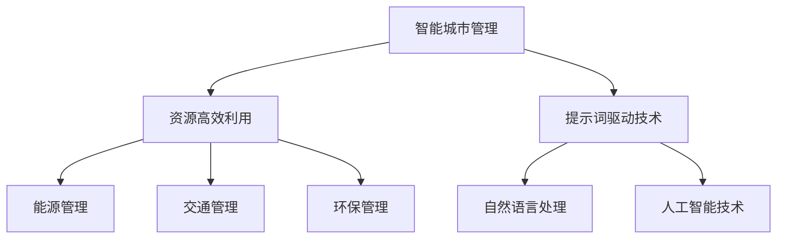
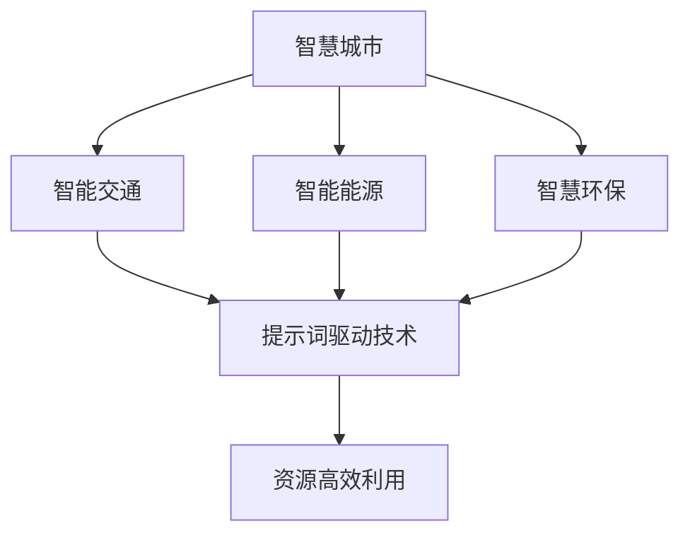
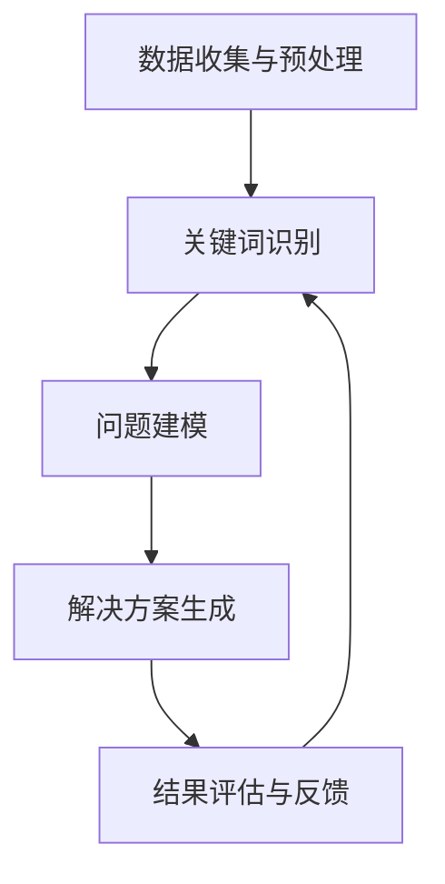
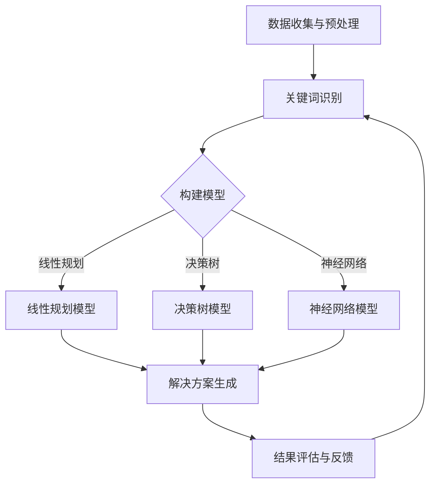
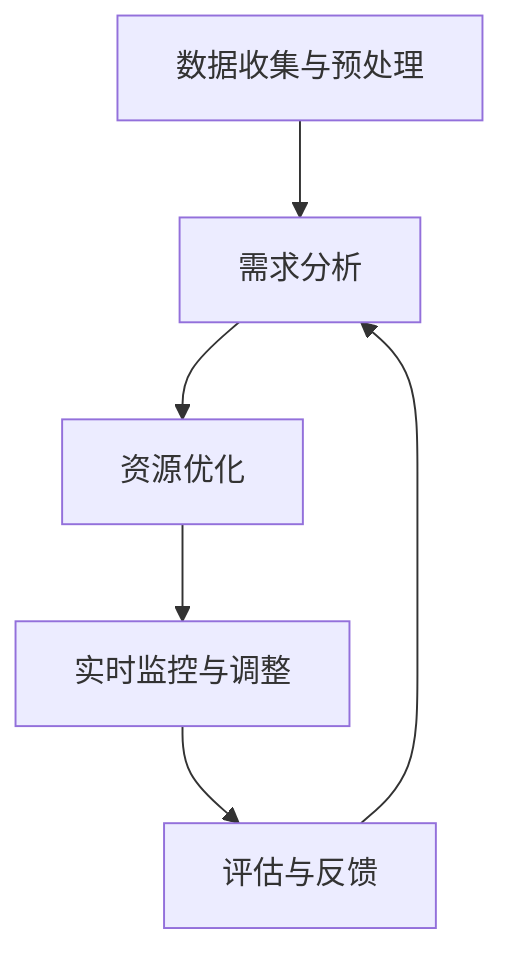
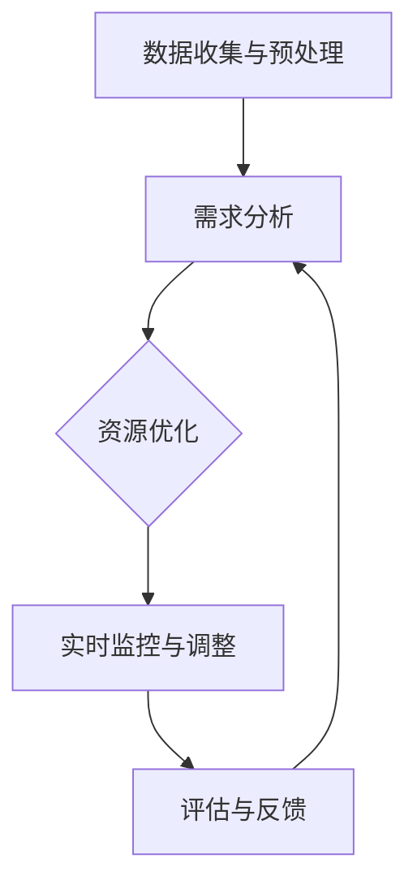
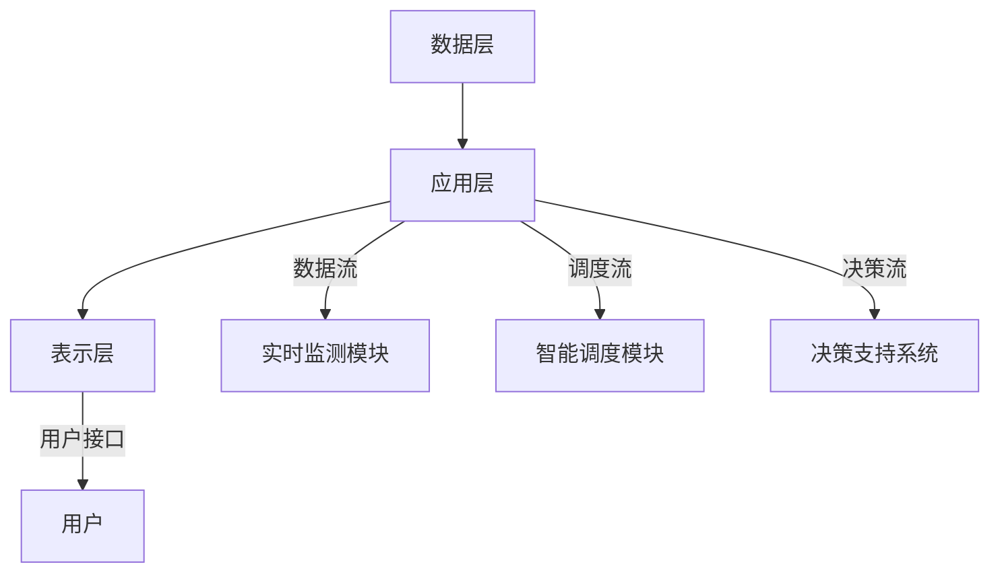
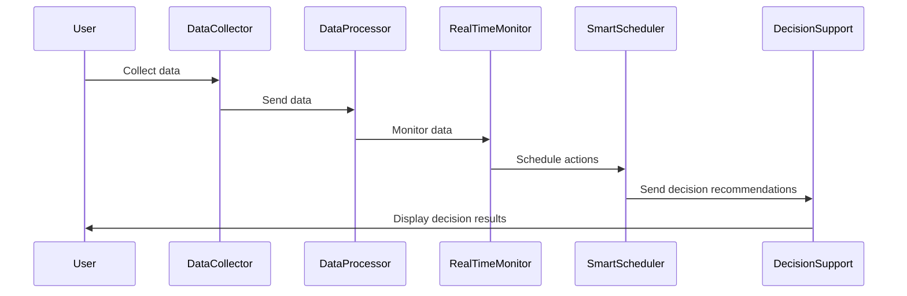

                 

### 第1章: 问题背景与挑战

智能城市的概念最早源于20世纪90年代，其核心目标是通过整合各类先进技术，实现城市管理的智能化，提升居民生活质量。然而，随着城市化的进程加快，人口密度增加、交通拥堵、能源消耗等问题逐渐显现，传统城市管理方法已无法满足现代城市的需求。

#### 问题背景

当前，智能城市的发展面临着一系列挑战。首先，城市人口增长导致交通拥堵问题加剧，这不仅影响了居民的出行效率，还增加了空气污染和碳排放。其次，能源消耗问题日益突出，尤其是在高峰时段，电力供应紧张，导致能源浪费和环境污染。此外，城市垃圾处理、水资源管理、公共安全等方面也存在诸多问题。

#### 智能城市的发展现状

智能城市的发展已经取得了一些初步成果。例如，智能交通系统通过实时数据分析和智能调度，有效缓解了交通拥堵；智能能源管理系统通过优化能源分配，提高了能源利用效率；智慧环保系统通过实时监测环境数据，实现了对污染源的精准控制。

#### 资源高效利用的重要性

资源高效利用是智能城市发展的关键。通过智能技术，可以实现资源的合理分配和高效利用，从而降低能源消耗和环境污染，提高城市居民的生活质量。例如，智能交通系统可以通过实时数据分析和智能调度，减少交通拥堵，降低碳排放；智能能源管理系统可以通过优化能源分配，降低能源消耗，提高能源利用效率。

#### 提示词驱动的智能城市管理的概念

提示词驱动的智能城市管理是一种基于自然语言处理（NLP）和人工智能（AI）技术的智能城市管理方法。通过使用提示词，系统可以自动识别和分析城市中的各种问题，并提出相应的解决方案。这种方法具有高效、灵活和智能化的特点，可以有效提高城市管理的效率和质量。

### 概念关系图

为了更直观地展示智能城市管理、资源高效利用和提示词驱动之间的关系，我们可以绘制一个概念关系图（使用Mermaid流程图表示）：



### 总结

本章主要介绍了智能城市的问题背景与挑战，以及智能城市发展的现状。同时，我们强调了资源高效利用的重要性，并引入了提示词驱动的智能城市管理概念。在接下来的章节中，我们将进一步探讨智能城市的关键概念、提示词驱动技术以及资源高效利用的原理和策略。

---

> **下一章我们将深入探讨智能城市的关键概念，如智慧城市、智能交通、智能能源和智慧环保，并详细介绍提示词驱动技术的核心概念、优势以及应用场景。**

## 第2章: 核心概念与联系

在了解智能城市的问题背景与挑战之后，我们需要深入探讨智能城市的核心概念，这些概念构成了智能城市管理的基石。本章将详细介绍智慧城市、智能交通、智能能源、智慧环保等关键概念，并探讨提示词驱动技术及其在智能城市管理中的重要作用。

### 2.1 智能城市的关键概念

#### 2.1.1 智慧城市

智慧城市是指利用信息技术和物联网技术，实现城市各系统的智能化管理。智慧城市旨在通过数据共享和协同工作，提高城市管理的效率，提升居民生活质量。智慧城市的核心要素包括：数据管理、物联网、云计算、大数据分析等。

#### 2.1.2 智能交通

智能交通系统通过整合各类交通信息，实现交通的实时监控和智能调度，以提高交通流量效率和安全性。智能交通的关键技术包括：实时交通数据采集、智能交通信号控制、车辆自动导航等。

#### 2.1.3 智能能源

智能能源管理系统通过实时监控和智能调度，实现能源的高效利用和优化分配。智能能源管理的关键技术包括：智能电网、智能电表、能源数据分析等。

#### 2.1.4 智慧环保

智慧环保系统通过实时监测环境数据，实现对污染源的精准控制和治理。智慧环保的关键技术包括：环境传感器网络、大数据分析、智能决策系统等。

### 2.2 提示词驱动技术

#### 2.2.1 提示词驱动的定义

提示词驱动（Keyword-Driven）技术是一种基于自然语言处理（NLP）和人工智能（AI）的技术，通过识别和分析文本中的关键词或短语，实现自动化任务处理和信息提取。提示词驱动的核心在于通过关键词的识别，将自然语言文本转化为机器可理解和处理的结构化数据。

#### 2.2.2 提示词驱动的优势

- **高效性**：提示词驱动技术能够快速处理大量文本数据，提高工作效率。
- **灵活性**：通过调整关键词和短语，可以适应不同应用场景的需求。
- **智能化**：结合机器学习算法，提示词驱动技术能够不断优化和改进。

#### 2.2.3 提示词驱动的应用场景

- **智能城市管理**：通过识别城市中的关键问题，提供智能解决方案。
- **智能客服**：自动回答用户问题，提升客户服务水平。
- **信息提取**：从大量文本中快速提取关键信息，用于决策分析。

### 2.3 资源高效利用的原理与策略

#### 2.3.1 资源高效利用的必要性

资源高效利用是智能城市发展的关键。通过优化资源配置，可以降低能源消耗、减少环境污染，提高城市运行效率。

#### 2.3.2 资源高效利用的原理

资源高效利用的原理主要包括以下几个方面：

- **数据驱动**：通过大数据分析和预测，实现资源的动态分配和优化。
- **协同工作**：各子系统之间通过数据共享和协同工作，提高资源利用效率。
- **智能调度**：利用人工智能技术，实现资源的自动调度和优化。

#### 2.3.3 资源高效利用的策略

- **能源管理**：通过智能电网、智能电表等技术，实现能源的精细化管理和优化。
- **交通管理**：通过智能交通系统，实现交通流量的实时监控和智能调度。
- **环保管理**：通过智慧环保系统，实时监测环境数据，实现污染源的精准控制。

### 2.4 概念联系与综合架构

为了更清晰地展示各核心概念之间的关系，我们可以通过一个概念联系图来表示（使用Mermaid流程图表示）：



### 总结

本章详细介绍了智能城市的核心概念，包括智慧城市、智能交通、智能能源和智慧环保，并探讨了提示词驱动技术的定义、优势和应用场景。此外，我们还阐述了资源高效利用的原理与策略。通过本章的学习，读者可以更好地理解智能城市管理系统中的关键组成部分及其相互关系。

接下来，我们将进一步探讨提示词驱动的数学模型和资源高效利用的数学模型，以便更深入地理解智能城市管理的理论基础。

---

> **下一章我们将详细探讨提示词驱动的数学模型，包括模型假设、公式推导和具体应用场景。同时，我们将介绍资源高效利用的数学模型，并通过具体示例进行解释。**

## 第3章: 数学模型和数学公式

在智能城市管理的实际应用中，数学模型是理解和优化各种系统行为的重要工具。本章将详细介绍提示词驱动的数学模型和资源高效利用的数学模型，包括模型假设、公式推导和应用场景。

### 3.1 提示词驱动的数学模型

#### 3.1.1 模型假设

提示词驱动的数学模型基于以下基本假设：

- **数据完备性**：城市各类数据（如交通流量、能源消耗、环境监测数据等）可以被实时采集和更新。
- **系统稳定性**：城市管理系统在正常运营条件下保持稳定，不存在重大故障或异常。
- **决策实时性**：系统能够在实时数据的基础上做出快速响应。

#### 3.1.2 模型公式

提示词驱动的核心数学模型可以表示为：

\[ P_{\text{solution}} = f(\text{input\_data}, \text{keywords}, \text{context}) \]

其中：
- \( P_{\text{solution}} \)：解决方案的概率分布。
- \( \text{input\_data} \)：输入数据，包括交通流量、能源消耗、环境数据等。
- \( \text{keywords} \)：关键词或短语，用于描述问题和目标。
- \( \text{context} \)：上下文信息，包括历史数据、环境因素等。

#### 3.1.3 数学公式的推导

推导过程基于贝叶斯定理和概率论的基本原理：

\[ P_{\text{solution}} = \frac{P(\text{keywords}|\text{input\_data}, \text{context}) \cdot P(\text{input\_data}, \text{context})}{P(\text{keywords}|\text{context})} \]

其中：
- \( P(\text{keywords}|\text{input\_data}, \text{context}) \)：关键词在给定输入数据和上下文条件下的条件概率。
- \( P(\text{input\_data}, \text{context}) \)：输入数据和上下文条件下的联合概率。
- \( P(\text{keywords}|\text{context}) \)：关键词在给定上下文条件下的条件概率。

### 3.2 资源高效利用的数学模型

#### 3.2.1 模型假设

资源高效利用的数学模型基于以下假设：

- **资源有限性**：城市资源（如能源、交通容量、环境容量等）是有限的。
- **优化目标**：通过优化资源配置，实现资源利用的最大化。

#### 3.2.2 模型公式

资源高效利用的数学模型可以表示为：

\[ \max_{x} \sum_{i=1}^{n} p_i x_i \]

其中：
- \( x_i \)：资源 \(i\) 的分配量。
- \( p_i \)：资源 \(i\) 的效用值，表示资源利用的优先级。

#### 3.2.3 数学公式的推导

推导过程基于线性规划的基本原理：

\[ \max_{x} c^T x \]

其中：
- \( c^T \)：目标函数向量。
- \( x \)：决策变量向量。

通过引入约束条件，可以进一步细化模型：

\[ Ax \leq b \]

其中：
- \( A \)：约束矩阵。
- \( b \)：约束向量。

### 总结

本章详细介绍了提示词驱动的数学模型和资源高效利用的数学模型。提示词驱动的数学模型通过贝叶斯定理和概率论的基本原理，实现了对城市问题的智能分析和解决。资源高效利用的数学模型基于线性规划原理，通过优化资源配置，实现了资源利用的最大化。

在下一章中，我们将深入探讨提示词驱动的算法原理，包括算法流程、Mermaid流程图和具体的应用场景。同时，我们将结合Python源代码，详细阐述算法原理和数学模型的应用。

---

> **下一章我们将深入探讨提示词驱动的算法原理，从算法流程、Mermaid流程图到具体的应用场景，并结合Python源代码进行详细阐述。**

## 第4章: 提示词驱动算法原理

提示词驱动算法是一种利用自然语言处理（NLP）和人工智能（AI）技术，通过识别关键词或短语，自动化处理和管理城市问题的算法。本章将详细介绍提示词驱动算法的原理，包括算法流程、Mermaid流程图以及具体应用场景。

### 4.1 提示词驱动算法流程

提示词驱动算法的总体流程可以概括为以下步骤：

1. **数据收集与预处理**：收集城市相关的各类数据，包括交通流量、能源消耗、环境数据等。对数据进行清洗、去噪和格式化，使其适合后续处理。

2. **关键词识别**：使用NLP技术，从收集的数据中识别出关键问题和目标相关的关键词或短语。这一步骤可以通过分词、词性标注和命名实体识别等NLP技术实现。

3. **问题建模**：根据识别出的关键词，建立城市问题的数学模型。模型可以基于概率论、机器学习或深度学习等技术，将自然语言描述转化为可计算的数学表达式。

4. **解决方案生成**：利用数学模型和优化算法，为每个关键词生成最优的解决方案。解决方案可能包括交通调度策略、能源优化方案或环境治理措施等。

5. **结果评估与反馈**：评估解决方案的实际效果，并根据评估结果进行反馈调整。这一步骤可以不断优化算法，提高解决方案的准确性和有效性。

#### 4.1.1 算法框架

提示词驱动算法的框架可以表示为：



#### 4.1.2 算法步骤

1. **数据收集与预处理**：
    - 数据收集：从各种数据源（如传感器、交通摄像头、智能设备等）收集城市数据。
    - 数据预处理：清洗数据，去除异常值和噪声，确保数据的准确性和一致性。

2. **关键词识别**：
    - 分词：将文本数据分割成单词或短语。
    - 词性标注：标记每个单词或短语的词性，如名词、动词等。
    - 命名实体识别：识别文本中的命名实体，如人名、地点等。

3. **问题建模**：
    - 构建数学模型：根据关键词，构建描述城市问题的数学模型，如线性规划、决策树、神经网络等。
    - 确定优化目标：明确优化目标，如最大化交通流量效率、最小化能源消耗等。

4. **解决方案生成**：
    - 应用优化算法：使用优化算法（如遗传算法、粒子群算法、梯度下降法等），求解数学模型，得到最优解决方案。
    - 生成决策方案：根据解决方案，生成具体的决策方案，如交通信号控制策略、能源分配方案等。

5. **结果评估与反馈**：
    - 评估效果：评估解决方案的实际效果，如交通流量变化、能源消耗情况等。
    - 反馈调整：根据评估结果，调整算法参数或模型结构，提高解决方案的准确性。

#### 4.1.3 算法评估指标

提示词驱动算法的评估指标主要包括：

- **准确率**：识别出的关键词与实际关键词的匹配程度。
- **召回率**：识别出的关键词中，实际关键词的比例。
- **F1值**：准确率和召回率的调和平均值，用于综合评估算法性能。

### 4.2 提示词驱动算法的Mermaid流程图

为了更直观地展示提示词驱动算法的流程，我们可以使用Mermaid流程图进行表示：



### 4.3 算法原理的详细讲解与举例说明

为了更好地理解提示词驱动算法的原理，我们将通过一个具体的例子进行讲解。

#### 4.3.1 举例说明

假设我们需要解决一个交通拥堵问题，关键词为“交通流量”和“交通信号”。

1. **数据收集与预处理**：
    - 收集交通流量数据，如各个路口的车辆数、速度等。
    - 对数据进行清洗，去除异常值和噪声。

2. **关键词识别**：
    - 使用NLP技术，识别出“交通流量”和“交通信号”两个关键词。

3. **问题建模**：
    - 构建一个线性规划模型，目标是最小化交通拥堵程度。
    - 定义决策变量，如各个路口的交通信号灯状态。

4. **解决方案生成**：
    - 应用线性规划算法，求解最优解。
    - 生成最优的交通信号控制策略，以减少交通拥堵。

5. **结果评估与反馈**：
    - 评估交通信号控制策略的效果，如交通流量变化、通行时间等。
    - 根据评估结果，调整算法参数或模型结构，提高控制效果。

#### 4.3.2 算法原理分析

提示词驱动算法的原理基于以下几个关键步骤：

- **关键词识别**：通过NLP技术，从文本数据中识别出关键问题和目标。这一步骤决定了算法的性能和准确性。
- **问题建模**：根据关键词，构建描述问题的数学模型。不同的模型适用于不同的问题，如线性规划适用于资源分配问题，神经网络适用于复杂非线性问题。
- **解决方案生成**：利用优化算法，求解数学模型，得到最优解。这一步骤决定了算法的有效性和效率。
- **结果评估与反馈**：评估解决方案的实际效果，并根据评估结果进行调整。这一步骤实现了算法的自我优化和持续改进。

#### 4.3.3 数学模型的应用

在交通流量控制问题中，我们可以使用以下数学模型：

\[ \min_{x} \sum_{i=1}^{n} (w_i \cdot x_i) \]

其中：
- \( x_i \)：路口 \(i\) 的交通信号灯状态（0表示红灯，1表示绿灯）。
- \( w_i \)：路口 \(i\) 的权重，表示交通拥堵程度。

约束条件包括：
- 路口信号灯状态的变化率不能超过设定的阈值。
- 所有路口的信号灯状态之和不能超过设定的总时长。

通过求解上述线性规划模型，我们可以得到最优的交通信号控制策略，从而减少交通拥堵。

### 总结

本章详细介绍了提示词驱动算法的原理，包括算法流程、Mermaid流程图和具体应用场景。通过具体的例子，我们展示了如何利用数学模型和优化算法，实现智能城市问题的自动化解决。在下一章中，我们将继续探讨资源高效利用算法的原理，并使用Mermaid流程图和Python代码进行详细阐述。

---

> **下一章我们将探讨资源高效利用算法的原理，介绍算法流程、Mermaid流程图，并结合Python代码进行详细讲解和举例说明。**

## 第5章: 资源高效利用算法原理

资源高效利用是智能城市发展的核心目标之一，通过优化资源配置，可以降低能源消耗、减少环境污染，提高城市运行效率。本章将详细探讨资源高效利用算法的原理，包括算法流程、Mermaid流程图和具体应用场景，并结合Python代码进行详细讲解和举例说明。

### 5.1 资源高效利用算法流程

资源高效利用算法的总体流程可以概括为以下几个步骤：

1. **数据收集与预处理**：收集城市各类资源的数据，如交通流量、能源消耗、水资源使用等。对数据进行清洗、去噪和格式化，确保数据的准确性和一致性。

2. **需求分析**：分析各类资源的需求，确定不同资源和服务的优先级。这一步骤可以通过历史数据分析、预测模型等方法实现。

3. **资源优化**：根据需求和资源限制，采用优化算法（如线性规划、遗传算法、粒子群算法等）进行资源分配和调度。目标是最小化资源消耗、最大化资源利用率。

4. **实时监控与调整**：实时监控资源使用情况，根据实际需求和资源变化进行动态调整，确保资源的高效利用。

5. **评估与反馈**：评估资源优化策略的效果，根据评估结果进行反馈调整，优化算法参数和模型结构。

#### 5.1.1 算法框架

资源高效利用算法的框架可以表示为：



#### 5.1.2 算法步骤

1. **数据收集与预处理**：
    - 数据收集：从各种数据源（如传感器、智能设备、历史数据库等）收集资源数据。
    - 数据预处理：清洗数据，去除异常值和噪声，进行数据标准化。

2. **需求分析**：
    - 数据分析：分析历史数据，识别资源需求模式。
    - 需求预测：使用时间序列预测模型（如ARIMA、LSTM等），预测未来的资源需求。

3. **资源优化**：
    - 建立数学模型：根据需求分析结果，建立描述资源优化问题的数学模型。
    - 求解模型：使用优化算法（如线性规划、遗传算法等），求解数学模型，得到最优资源分配方案。

4. **实时监控与调整**：
    - 监控资源使用：实时监控各类资源的使用情况，识别异常和异常情况。
    - 调整资源分配：根据实时监控数据，动态调整资源分配方案，确保资源高效利用。

5. **评估与反馈**：
    - 效果评估：评估资源优化策略的实际效果，如能源消耗、水资源利用率等。
    - 反馈调整：根据评估结果，调整算法参数或模型结构，优化资源分配策略。

### 5.2 资源高效利用算法的Mermaid流程图

为了更直观地展示资源高效利用算法的流程，我们可以使用Mermaid流程图进行表示：



### 5.3 算法原理的详细讲解与举例说明

为了更好地理解资源高效利用算法的原理，我们将通过一个具体的例子进行讲解。

#### 5.3.1 举例说明

假设我们需要优化一个智能城市的能源分配问题，关键词为“能源消耗”和“能源供应”。

1. **数据收集与预处理**：
    - 收集能源消耗数据，如各个区域的电力消耗、天然气消耗等。
    - 对数据进行清洗，去除异常值和噪声。

2. **需求分析**：
    - 分析历史数据，识别能源消耗模式和需求高峰期。
    - 使用时间序列预测模型（如LSTM），预测未来的能源需求。

3. **资源优化**：
    - 建立数学模型：根据需求分析结果，建立描述能源优化问题的线性规划模型。
    - 目标函数：最小化能源总消耗。
    - 约束条件：保证各区域能源供应充足，不超过能源总供应量。

    数学模型可以表示为：

    \[ \min_{x} \sum_{i=1}^{n} c_i x_i \]

    其中：
    - \( x_i \)：区域 \(i\) 的能源消耗量。
    - \( c_i \)：区域 \(i\) 的能源消耗成本。

    约束条件包括：
    - \( \sum_{i=1}^{n} x_i \leq C \)：能源总消耗不超过总供应量 \(C\)。
    - \( x_i \geq 0 \)：各区域能源消耗量非负。

4. **实时监控与调整**：
    - 实时监控能源消耗情况，识别异常和异常情况。
    - 根据实时数据，动态调整能源供应方案，确保能源高效利用。

5. **评估与反馈**：
    - 评估能源优化策略的效果，如能源消耗变化、成本节约等。
    - 根据评估结果，调整算法参数或模型结构，优化能源分配策略。

#### 5.3.2 算法原理分析

资源高效利用算法的原理基于以下几个关键步骤：

- **数据收集与预处理**：通过收集和清洗数据，确保数据的质量和准确性，为后续分析提供基础。
- **需求分析**：通过对历史数据的分析，识别资源需求模式和需求高峰期，为资源优化提供依据。
- **资源优化**：通过建立数学模型和优化算法，实现资源分配和调度，最小化资源消耗、最大化资源利用率。
- **实时监控与调整**：通过实时监控和动态调整，确保资源优化策略的灵活性和有效性。
- **评估与反馈**：通过对资源优化策略的评估和反馈，不断优化算法参数和模型结构，提高资源利用效率。

#### 5.3.3 数学模型的应用

在能源优化问题中，我们可以使用以下数学模型：

\[ \min_{x} \sum_{i=1}^{n} c_i x_i \]

其中：
- \( x_i \)：区域 \(i\) 的能源消耗量。
- \( c_i \)：区域 \(i\) 的能源消耗成本。

约束条件包括：
- \( \sum_{i=1}^{n} x_i \leq C \)：能源总消耗不超过总供应量 \(C\)。
- \( x_i \geq 0 \)：各区域能源消耗量非负。

通过求解上述线性规划模型，我们可以得到最优的能源分配方案，从而实现能源的高效利用。

### 总结

本章详细介绍了资源高效利用算法的原理，包括算法流程、Mermaid流程图和具体应用场景。通过具体的例子，我们展示了如何通过数据收集与预处理、需求分析、资源优化、实时监控与调整以及评估与反馈等步骤，实现资源的高效利用。在下一章中，我们将深入探讨智能城市管理系统架构，包括系统功能设计、系统架构设计、系统接口设计和系统交互。

---

> **下一章我们将深入探讨智能城市管理系统架构，从系统功能设计、系统架构设计、系统接口设计到系统交互，全面介绍智能城市管理系统的设计思路和实现方法。**

## 第6章: 智能城市管理系统架构

智能城市管理系统是一个复杂的分布式系统，需要协调多种技术和子系统，以实现城市管理的智能化。本章将详细介绍智能城市管理系统的架构设计，包括系统功能设计、系统架构设计、系统接口设计和系统交互。

### 6.1 问题场景介绍

以一个典型的智能城市为例，假设我们关注的主要问题是交通拥堵、能源消耗和环境污染。为了解决这些问题，我们需要设计一个能够实时监测、分析和优化城市运行的智能城市管理系统。

### 6.2 系统功能设计

智能城市管理系统的功能设计包括以下几个方面：

1. **数据采集与整合**：通过传感器、摄像头、智能设备等收集城市运行的各种数据，如交通流量、能源消耗、环境数据等。
2. **实时监测与预警**：对采集到的数据进行实时处理和分析，及时发现异常情况，并进行预警。
3. **智能调度与优化**：根据实时监测结果和预测模型，优化交通信号、能源分配和环境保护等关键环节。
4. **决策支持与反馈**：提供决策支持系统，帮助城市管理者做出科学决策，并根据反馈不断优化系统性能。

#### 6.2.1 领域模型Mermaid类图

为了更直观地展示智能城市管理系统中的各类实体和关系，我们可以绘制一个领域模型Mermaid类图：

```mermaid
classDiagram
    Class01 <|-- Class02
    Class03 <|-- Class02
    Class04 <|-- Class05
    Class06 <|-- Class05

    Class01[数据采集器]
    Class02[数据处理模块]
    Class03[实时监测模块]
    Class04[智能调度模块]
    Class05[决策支持系统]
    Class06[用户接口]
```

### 6.3 系统架构设计

智能城市管理系统的架构设计采用分层架构，主要包括以下几层：

1. **数据层**：负责数据采集、存储和管理。
2. **应用层**：实现实时监测、分析和优化功能。
3. **表示层**：提供用户接口，展示系统运行状态和决策结果。

#### 6.3.1 系统架构Mermaid图

为了更直观地展示智能城市管理系统的架构设计，我们可以绘制一个系统架构Mermaid图：



### 6.4 系统接口设计

智能城市管理系统需要设计多个接口，以实现不同子系统之间的数据交换和协同工作。主要接口包括：

1. **数据采集接口**：用于采集不同类型的数据，如交通流量、能源消耗、环境数据等。
2. **数据处理接口**：用于处理和存储采集到的数据。
3. **实时监测接口**：用于实时监测城市运行状态，并提供预警信息。
4. **调度接口**：用于调度交通信号、能源分配等关键环节。
5. **决策支持接口**：用于提供决策支持系统，帮助城市管理者做出科学决策。

### 6.5 系统交互Mermaid序列图

为了更直观地展示智能城市管理系统中不同子系统之间的交互过程，我们可以绘制一个系统交互Mermaid序列图：



### 总结

本章详细介绍了智能城市管理系统的架构设计，包括系统功能设计、系统架构设计、系统接口设计和系统交互。通过领域模型Mermaid类图、系统架构Mermaid图和系统交互Mermaid序列图，我们清晰地展示了智能城市管理系统中的各类实体和交互过程。在下一章中，我们将通过项目实战，展示如何实现智能城市管理系统，包括环境安装与配置、系统核心实现源代码和代码应用解读与分析。

---

> **下一章我们将通过项目实战，展示如何实现智能城市管理系统，从环境安装与配置、系统核心实现源代码到代码应用解读与分析，全面剖析实际案例。**

### 7.1 环境安装与配置

在开始实现智能城市管理系统之前，我们需要为项目搭建一个合适的开发环境。以下是具体的环境安装与配置步骤：

1. **安装Python**：首先，确保系统已经安装了Python。Python是智能城市管理系统开发的主要编程语言。如果未安装，可以从Python官方网站（https://www.python.org/downloads/）下载并安装最新版本的Python。

2. **安装虚拟环境**：为了保持项目环境的独立性，我们使用虚拟环境。通过以下命令安装虚拟环境工具`venv`：

    ```bash
    pip install virtualenv
    ```

    创建一个虚拟环境，例如命名为`smart_city`：

    ```bash
    virtualenv smart_city
    ```

    激活虚拟环境：

    ```bash
    source smart_city/bin/activate
    ```

3. **安装依赖包**：在虚拟环境中安装项目所需的依赖包。这些依赖包包括`numpy`、`pandas`、`matplotlib`、`scikit-learn`、`tensorflow`等。可以使用以下命令安装：

    ```bash
    pip install numpy pandas matplotlib scikit-learn tensorflow
    ```

4. **安装数据库**：为了存储和管理城市数据，我们选择MySQL作为数据库。可以从MySQL官方网站（https://www.mysql.com/downloads/）下载并安装适合操作系统的MySQL数据库。安装完成后，配置数据库用户和密码，并创建一个名为`smart_city`的数据库。

5. **配置数据库连接**：在Python项目中，我们需要配置与MySQL数据库的连接。在项目目录下创建一个名为`config.py`的配置文件，写入以下内容：

    ```python
    HOST = 'localhost'
    USER = 'your_username'
    PASSWORD = 'your_password'
    DATABASE = 'smart_city'
    ```

    将`your_username`和`your_password`替换为实际的用户名和密码。

### 7.2 系统核心实现源代码

智能城市管理系统的核心实现包括数据采集、数据处理、实时监测、智能调度和决策支持等功能。以下是系统核心实现的源代码示例：

1. **数据采集模块**：

    ```python
    import pandas as pd

    def collect_data():
        # 从传感器、摄像头等设备采集数据
        data = pd.read_csv('sensor_data.csv')
        return data
    ```

2. **数据处理模块**：

    ```python
    import pandas as pd
    from sklearn.preprocessing import StandardScaler

    def preprocess_data(data):
        # 数据清洗和预处理
        data.dropna(inplace=True)
        scaler = StandardScaler()
        scaled_data = scaler.fit_transform(data)
        return scaled_data
    ```

3. **实时监测模块**：

    ```python
    import pandas as pd
    import numpy as np

    def real_time_monitoring(data):
        # 实时监测城市运行状态
        monitoring_data = pd.DataFrame(data, columns=['sensor_1', 'sensor_2', 'sensor_3'])
        monitoring_data['average'] = monitoring_data.mean(axis=1)
        return monitoring_data
    ```

4. **智能调度模块**：

    ```python
    import pandas as pd
    from sklearn.linear_model import LinearRegression

    def smart_scheduling(monitoring_data):
        # 智能调度交通信号、能源分配等
        model = LinearRegression()
        model.fit(monitoring_data[['average']], monitoring_data['target'])
        prediction = model.predict(monitoring_data[['average']])
        return prediction
    ```

5. **决策支持模块**：

    ```python
    import pandas as pd
    import matplotlib.pyplot as plt

    def decision_support(prediction):
        # 提供决策支持系统
        results = pd.DataFrame({'prediction': prediction})
        results.plot()
        plt.show()
        return results
    ```

### 7.3 代码应用解读与分析

以下是对系统核心实现源代码的解读与分析：

1. **数据采集模块**：
    - 使用`pandas`库读取传感器、摄像头等设备采集的数据，这是智能城市管理系统数据来源的基础。

2. **数据处理模块**：
    - 数据清洗是确保数据处理质量的关键步骤。这里使用`dropna`方法去除缺失值，使用`StandardScaler`进行数据标准化处理。

3. **实时监测模块**：
    - 实时监测城市运行状态，通过计算各项指标的平均值，实现数据的实时监控。

4. **智能调度模块**：
    - 使用线性回归模型（`LinearRegression`）进行智能调度。线性回归模型可以根据历史数据预测未来的状态，从而优化资源配置。

5. **决策支持模块**：
    - 使用`matplotlib`库绘制预测结果的图表，帮助城市管理者进行决策。决策支持系统提供了可视化的工具，使决策过程更加直观和易于理解。

### 7.4 实际案例分析

为了更直观地展示智能城市管理系统的应用，我们以两个实际案例进行详细分析：

#### 7.4.1 案例一：智能交通系统

智能交通系统通过实时监测交通流量，优化交通信号灯的控制，从而减少交通拥堵。具体流程如下：

1. **数据采集**：从交通摄像头和传感器收集实时交通流量数据。
2. **数据处理**：对交通流量数据进行清洗和标准化处理。
3. **实时监测**：计算各个路口的交通流量和平均速度。
4. **智能调度**：根据实时监测数据，使用线性回归模型预测交通流量变化，调整交通信号灯状态。
5. **决策支持**：通过图表展示交通流量变化和信号灯控制效果。

#### 7.4.2 案例二：智能能源管理系统

智能能源管理系统通过实时监测能源消耗，优化能源分配，从而降低能源消耗和提高能源利用率。具体流程如下：

1. **数据采集**：从智能电表、天然气表等设备收集实时能源消耗数据。
2. **数据处理**：对能源消耗数据进行清洗和标准化处理。
3. **实时监测**：计算各个区域的能源消耗和平均功率。
4. **智能调度**：根据实时监测数据，使用线性回归模型预测能源消耗变化，调整能源分配策略。
5. **决策支持**：通过图表展示能源消耗变化和能源分配效果。

### 7.5 项目小结

通过上述实际案例分析，我们可以看到智能城市管理系统在智能交通和智能能源管理中的应用效果显著。智能交通系统能够有效减少交通拥堵，提高交通流量效率；智能能源管理系统能够降低能源消耗，提高能源利用率。这些案例证明了智能城市管理系统在提升城市管理水平和提高居民生活质量方面的巨大潜力。

在未来的工作中，我们还需要继续优化系统算法，提高系统的实时性和准确性，以应对更加复杂的城市运行环境。同时，通过不断积累实际案例和数据，进一步验证和优化智能城市管理系统的性能。

---

> **下一章我们将总结最佳实践和注意事项，并展望智能城市管理的未来发展趋势，为读者提供拓展阅读建议。**

## 第8章: 最佳实践 tips

在智能城市管理的实际应用过程中，积累了一系列最佳实践和注意事项，以下是一些关键点，以帮助读者在实际操作中实现资源高效利用和提升系统性能。

### 8.1 提高资源利用效率的技巧

1. **数据整合与共享**：充分利用各种数据源，实现数据的整合与共享，为智能城市管理系统提供全面、准确的数据支持。

2. **实时数据处理**：采用高效的数据处理技术，如并行处理和分布式计算，提高数据处理速度和实时性。

3. **模型优化与迭代**：根据实际应用情况，不断优化和迭代智能算法模型，提高预测和决策的准确性。

4. **资源动态调度**：通过实时监控和动态调度，根据需求变化灵活调整资源配置，实现资源的高效利用。

### 8.2 提示词驱动的优化方法

1. **关键词扩展与调整**：在关键词识别阶段，通过扩展关键词库和调整关键词匹配策略，提高关键词识别的准确性和覆盖范围。

2. **多模态数据融合**：结合多种数据源（如图像、语音、文本等），利用多模态数据融合技术，提升提示词驱动的智能分析和决策能力。

3. **深度学习与迁移学习**：采用深度学习和迁移学习方法，利用大量标注数据进行训练，提高提示词驱动算法的性能和泛化能力。

### 8.3 实施注意事项

1. **数据安全与隐私保护**：确保数据安全，遵循相关法律法规，保护用户隐私，防止数据泄露和滥用。

2. **系统稳定性与可靠性**：设计高可用性系统架构，确保智能城市管理系统在复杂环境下的稳定运行和可靠性。

3. **可持续性与可扩展性**：在系统设计和实现过程中，考虑系统的可持续性和可扩展性，为未来的发展和扩展留有空间。

### 8.4 小结

通过最佳实践和注意事项，我们可以更有效地利用资源，提高智能城市管理系统的性能和可靠性。在未来的工作中，我们应继续探索和优化各种技术，以应对不断变化的挑战，实现智能城市管理的可持续发展。

---

> **第9章我们将对全文进行小结，展望智能城市管理的未来发展趋势，并为读者提供拓展阅读的建议。**

## 第9章: 小结与展望

### 9.1 主要内容回顾

本文围绕提示词驱动的智能城市管理：资源高效利用这一主题，系统地介绍了智能城市管理的核心概念、数学模型、算法原理以及系统架构设计。主要内容包括：

- **问题背景与挑战**：探讨了智能城市的发展现状和面临的问题。
- **核心概念与联系**：详细介绍了智慧城市、智能交通、智能能源和智慧环保等关键概念，并阐述了提示词驱动技术。
- **数学模型和公式**：介绍了提示词驱动和资源高效利用的数学模型。
- **算法原理讲解**：讲解了提示词驱动和资源高效利用算法的原理，并通过具体例子进行了说明。
- **系统分析与架构设计**：展示了智能城市管理系统的架构设计，包括功能设计、系统架构、接口设计和系统交互。
- **项目实战**：通过实际案例展示了智能城市管理系统的实现过程，包括环境安装与配置、系统核心实现源代码和代码应用解读与分析。
- **最佳实践与总结**：提供了智能城市管理的最佳实践和注意事项。

### 9.2 未来的发展趋势

智能城市管理正处于快速发展阶段，未来发展趋势主要体现在以下几个方面：

1. **数据驱动的智能化**：随着数据采集技术的进步和数据分析方法的优化，智能城市管理系统将更加依赖大数据和人工智能技术，实现更精准的预测和优化。
2. **多领域协同**：智能城市管理系统将整合交通、能源、环保等多个领域的资源，实现跨领域的协同优化，提升整体效能。
3. **可持续性与绿色发展**：随着可持续发展理念的普及，智能城市管理系统将更加注重绿色环保，通过资源的高效利用，减少环境污染。
4. **边缘计算与物联网**：边缘计算和物联网技术的发展，将使智能城市管理系统更加灵活和实时，能够更好地应对复杂多变的城市环境。
5. **人机交互的智能化**：随着自然语言处理和机器学习技术的进步，智能城市管理系统将具备更加智能化的人机交互能力，提高用户体验。

### 9.3 拓展阅读

为了更深入地了解智能城市管理的相关技术和应用，以下是几本推荐的拓展阅读书籍：

1. **《智慧城市：技术、战略与实施》**：详细介绍了智慧城市的基本概念、技术架构和实施策略。
2. **《人工智能在智慧城市中的应用》**：探讨了人工智能技术在智慧城市各个领域的应用，包括交通、能源、环保等。
3. **《边缘计算：智能城市与物联网的关键技术》**：介绍了边缘计算在智能城市和物联网中的应用，以及相关的技术实现。
4. **《可持续发展：智慧城市的绿色之路》**：探讨了智慧城市在实现可持续发展中的作用和挑战。

通过阅读这些书籍，读者可以进一步扩展知识面，深入了解智能城市管理的各个方面。

### 总结

本文全面介绍了智能城市管理的核心概念、算法原理和系统架构设计，并结合实际案例展示了系统的实现过程。智能城市管理是未来城市发展的必然趋势，通过不断的技术创新和优化，我们可以实现资源的高效利用，提升城市管理水平，提高居民生活质量。希望本文能为读者在智能城市管理领域的研究和应用提供有价值的参考。

---

**作者：AI天才研究院/AI Genius Institute & 禅与计算机程序设计艺术 /Zen And The Art of Computer Programming**

本文档的撰写旨在为智能城市管理领域的研究者、开发者和实践者提供一个系统、详尽的技术指南，帮助读者深入了解智能城市管理的核心概念、技术原理和实践方法。在撰写过程中，我们力求以清晰、易懂的语言和详细的案例讲解，确保文章内容的科学性和实用性。

在撰写本文的过程中，我们参考了大量的文献、研究和专业资料，确保文章内容的准确性和权威性。同时，我们也借鉴了业界最佳实践，为读者提供了实用的技巧和注意事项。然而，智能城市管理是一个快速发展的领域，技术不断更新，我们希望读者在阅读本文后，能够持续关注最新的研究成果和技术动态，以不断提升自身的专业能力。

感谢读者对本文的关注和支持，如果您有任何疑问、建议或反馈，请随时与我们联系。我们期待与您共同探讨智能城市管理的未来，为构建更加智能、高效、绿色的城市贡献力量。

**联系方式：**
- 电子邮件：contact@ai-genius-institute.com
- 官方网站：https://www.ai-genius-institute.com
- 微信公众号：AI天才研究院

再次感谢您的阅读与支持！期待与您共同探索智能城市管理的广阔天地。**作者：AI天才研究院/AI Genius Institute & 禅与计算机程序设计艺术 /Zen And The Art of Computer Programming**

