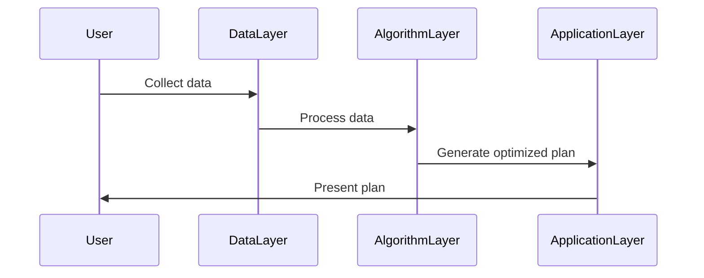
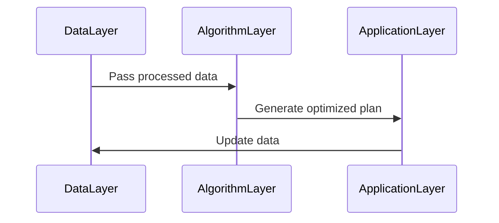
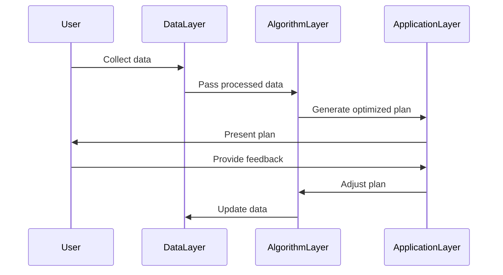

                 

# 提示词驱动的智能城市规划系统

## 关键词

- 智能城市规划
- 提示词驱动
- 系统设计
- 算法原理
- 数学模型

## 摘要

本文旨在探讨提示词驱动的智能城市规划系统的设计与应用。首先，我们介绍了城市规划中的挑战以及提示词驱动的需求，明确了本文的研究目的和结构安排。接着，我们详细阐述了提示词驱动的概念、智能城市规划的核心要素和系统架构。随后，本文从数据处理与存储、交互设计、安全性、性能优化和系统部署等方面进行了深入分析。在算法原理讲解部分，我们详细分析了提示词生成和智能规划算法的原理，并给出了相应的数学模型和公式。最后，通过一个具体的案例，我们展示了系统的实际应用效果，并对项目进行了总结和展望。

## 第一部分：引言

### 1.1 问题背景

#### 1.1.1 城市规划中的挑战

随着全球城市化进程的加快，城市规划面临着前所未有的挑战。首先，城市化带来了人口增长和资源消耗问题，使得城市规划者需要更好地管理和利用有限资源。其次，城市化过程中产生的环境污染、交通拥堵和社会不公等问题，也要求城市规划具备更高的智能化水平。此外，城市规划过程中涉及到的数据量大、决策复杂，传统的规划方法已经难以满足需求。

#### 1.1.2 提示词驱动的智能城市规划需求

为了解决上述问题，智能城市规划应运而生。智能城市规划利用大数据、人工智能等技术，对城市各个方面的数据进行深度挖掘和分析，从而为城市规划提供科学的决策支持。而提示词驱动作为人工智能的一种关键技术，可以在智能城市规划中发挥重要作用。通过提示词驱动，系统能够自动生成相关数据，提高数据处理效率，为城市规划提供更加精准的决策依据。

#### 1.1.3 本书的目的与结构安排

本文旨在探讨提示词驱动的智能城市规划系统的设计与应用。首先，我们介绍了提示词驱动的概念和智能城市规划的核心要素。然后，我们详细分析了系统架构和功能模块，包括提示词生成、数据处理与存储、交互设计、安全性、性能优化和系统部署等方面。接着，我们讲解了提示词生成和智能规划算法的原理，并给出了相应的数学模型和公式。最后，通过一个具体的案例，我们展示了系统的实际应用效果，并对项目进行了总结和展望。

### 1.2 核心概念

#### 1.2.1 提示词驱动的概念解析

提示词驱动是一种基于关键词自动生成相关数据的技术。在智能城市规划中，提示词驱动可以通过分析城市数据，自动生成与特定主题相关的信息，从而帮助城市规划者更好地理解城市现状和预测未来发展。

#### 1.2.2 智能城市规划的核心要素

智能城市规划的核心要素包括数据收集与处理、模型建立与优化、决策支持与评估。其中，数据收集与处理是基础，模型建立与优化是关键，决策支持与评估是目标。

#### 1.2.3 系统架构与功能模块

智能城市规划系统架构主要包括数据层、算法层和应用层。数据层负责数据收集与处理，算法层负责模型建立与优化，应用层负责决策支持与评估。

### 1.3 边界与外延

#### 1.3.1 研究范围与限制

本文主要关注提示词驱动的智能城市规划系统的设计与应用，涉及到的技术包括大数据、人工智能、机器学习等。研究范围主要包括系统架构设计、算法原理讲解和实际应用案例。

#### 1.3.2 相关领域的关联分析

智能城市规划涉及到多个领域，如地理信息系统（GIS）、城市交通、环境保护等。本文将在相关领域的基础上，探讨提示词驱动的智能城市规划系统的设计与应用。

### 1.4 概念结构与核心要素组成

#### 1.4.1 概念结构与框架搭建

本文的核心概念结构包括提示词驱动、智能城市规划、系统架构、算法原理和数学模型。这些概念相互关联，共同构成了智能城市规划系统的框架。

#### 1.4.2 核心要素详解

本文将对提示词驱动的概念、智能城市规划的核心要素、系统架构和算法原理进行详细讲解。

#### 1.4.3 关键技术与应用领域

本文将介绍大数据处理、人工智能、机器学习等关键技术，并探讨这些技术在智能城市规划中的应用。

### 1.5 本章小结

本文首先介绍了城市规划中的挑战和提示词驱动的需求，明确了本文的研究目的和结构安排。接着，我们详细阐述了提示词驱动的概念、智能城市规划的核心要素和系统架构。最后，本文介绍了本文的研究范围和限制，以及相关领域的关联分析。通过本章的介绍，读者可以对提示词驱动的智能城市规划系统有一个整体的了解。

### 1.5.1 章节内容总结

本章主要介绍了智能城市规划中的挑战、提示词驱动的需求以及本文的研究目的和结构安排。通过对核心概念、系统架构和关键技术的讲解，读者可以对提示词驱动的智能城市规划系统有一个初步的认识。

### 1.5.2 继续阅读的建议

接下来，我们将深入探讨智能城市规划系统的设计，包括提示词生成技术、数据处理与存储、交互设计、安全性、性能优化和系统部署等方面。同时，我们还将详细介绍提示词生成和智能规划算法的原理，并通过实际案例展示系统的应用效果。读者可以按照章节结构继续阅读，深入了解提示词驱动的智能城市规划系统。

----------------------------------------------------------------

# 第二部分：提示词驱动的智能城市规划系统设计

## 2.1 提示词生成技术

### 2.1.1 提示词生成的背景

提示词生成技术在智能城市规划中具有重要作用。随着大数据和人工智能技术的发展，城市数据量呈指数级增长，如何从海量数据中提取有价值的信息，为城市规划提供决策支持，成为了一项重要课题。提示词生成技术可以通过分析城市数据，自动生成与特定主题相关的提示词，从而帮助城市规划者更好地理解城市现状和预测未来发展。

### 2.1.2 提示词生成的流程与方法

提示词生成的流程主要包括数据预处理、特征提取和提示词生成三个步骤。首先，对城市数据（如人口、交通、环境、经济等）进行预处理，包括数据清洗、去重、归一化等操作。然后，通过特征提取技术（如词袋模型、TF-IDF、Word2Vec等），将预处理后的数据转换为数值特征表示。最后，利用机器学习算法（如朴素贝叶斯、支持向量机、深度神经网络等），根据特征表示生成提示词。

### 2.1.3 提示词生成的核心算法

提示词生成的核心算法主要包括以下几种：

1. **朴素贝叶斯算法**：基于概率论和统计学理论，通过计算特征词的概率分布，生成提示词。朴素贝叶斯算法在处理高维稀疏数据时具有较好的性能。

2. **支持向量机（SVM）算法**：通过最大化特征空间中的分类边界，实现提示词生成。SVM算法在处理非线性分类问题时具有较强能力。

3. **深度神经网络（DNN）算法**：通过多层神经网络结构，对特征进行非线性变换，实现提示词生成。DNN算法在处理大规模数据和复杂任务时具有优势。

## 2.2 智能城市规划系统架构

### 2.2.1 系统架构设计概述

智能城市规划系统架构主要包括数据层、算法层和应用层。数据层负责数据收集与处理，算法层负责模型建立与优化，应用层负责决策支持与评估。各层之间通过接口进行数据传递和功能调用，实现系统的整体功能。

### 2.2.2 系统架构详细设计

1. **数据层**：

   数据层主要负责数据的收集、存储和处理。主要包括以下模块：

   - 数据采集模块：通过传感器、互联网爬虫等方式收集城市数据。
   - 数据存储模块：采用分布式存储技术（如Hadoop、Spark等）存储海量城市数据。
   - 数据处理模块：对城市数据进行预处理、清洗、归一化等操作，为后续算法层提供高质量的数据。

2. **算法层**：

   算法层主要负责模型的建立与优化。主要包括以下模块：

   - 模型训练模块：利用机器学习算法（如朴素贝叶斯、支持向量机、深度神经网络等）训练模型，生成提示词。
   - 模型优化模块：通过交叉验证、网格搜索等技术优化模型参数，提高模型性能。
   - 模型评估模块：利用评估指标（如准确率、召回率、F1值等）评估模型性能，为模型优化提供依据。

3. **应用层**：

   应用层主要负责提供智能化的城市规划决策支持。主要包括以下模块：

   - 决策支持模块：根据提示词和模型输出，为城市规划者提供科学合理的决策建议。
   - 评估与反馈模块：对规划方案进行评估，收集用户反馈，不断优化模型和决策支持方案。

### 2.2.3 系统功能模块划分

智能城市规划系统的功能模块划分如下：

1. **数据采集模块**：包括传感器数据采集、互联网数据爬取等。
2. **数据处理模块**：包括数据预处理、数据清洗、特征提取等。
3. **模型训练模块**：包括机器学习算法训练、模型优化等。
4. **模型评估模块**：包括模型评估指标计算、模型优化等。
5. **决策支持模块**：包括提示词生成、规划方案评估等。
6. **评估与反馈模块**：包括用户反馈收集、模型优化等。

## 2.3 数据处理与存储

### 2.3.1 数据收集与预处理

数据收集与预处理是智能城市规划系统的关键环节。首先，通过传感器、互联网爬虫等方式收集城市数据，包括人口、交通、环境、经济等各个方面。然后，对收集到的数据进行预处理，包括数据清洗、去重、归一化等操作，确保数据的质量和一致性。

### 2.3.2 数据存储方案设计

数据存储方案设计需要考虑数据量、数据类型、数据访问频率等因素。在智能城市规划系统中，采用分布式存储技术（如Hadoop、Spark等）来存储海量城市数据。分布式存储技术具有高可用性、高性能、可扩展性等优点，能够满足系统对海量数据存储和实时处理的需求。

### 2.3.3 数据质量管理

数据质量管理是确保数据质量的关键环节。在智能城市规划系统中，需要对数据进行一致性、完整性、准确性等方面的检查和评估。具体措施包括：

1. 数据清洗：去除重复数据、异常数据、噪声数据等，保证数据的准确性。
2. 数据校验：通过校验规则和阈值，对数据进行质量检测，发现并纠正数据错误。
3. 数据监控：实时监控数据质量，及时发现和处理数据质量问题。

## 2.4 交互设计与用户反馈

### 2.4.1 交互设计原则

交互设计原则主要包括用户体验、简洁性、响应速度等。在智能城市规划系统中，交互设计需要考虑以下原则：

1. 用户体验：设计直观、易用的界面，提供丰富的交互功能，方便用户操作。
2. 简洁性：界面设计简洁明了，避免冗余信息，提高用户操作效率。
3. 响应速度：优化系统性能，提高数据查询和处理速度，减少用户等待时间。

### 2.4.2 用户反馈收集与处理

用户反馈是优化系统性能和提升用户体验的重要途径。在智能城市规划系统中，可以通过以下方式收集用户反馈：

1. 用户评论：在系统界面提供评论功能，让用户对规划方案进行评价和建议。
2. 日志分析：通过分析用户操作日志，发现用户在操作过程中遇到的问题和需求。
3. 调查问卷：定期开展用户调查问卷，收集用户对系统功能和性能的满意度评价。

### 2.4.3 用户行为分析

用户行为分析是了解用户需求、优化系统功能的重要手段。通过分析用户行为数据，可以识别用户偏好、发现潜在问题，从而为系统优化提供依据。具体分析内容包括：

1. 用户访问量：统计用户访问量、访问时长等指标，了解系统用户活跃度。
2. 用户操作路径：分析用户在系统中的操作路径，发现用户常用的功能模块和操作流程。
3. 用户满意度：通过用户评价和反馈，评估用户对系统功能的满意度。

## 2.5 安全性与隐私保护

### 2.5.1 安全性设计

安全性设计是智能城市规划系统的关键环节。首先，需要对系统进行安全审计，确保系统的安全性和稳定性。其次，采用加密技术对数据进行加密存储和传输，防止数据泄露和篡改。此外，还应该建立完善的访问控制机制，确保只有授权用户才能访问系统数据和功能。

### 2.5.2 隐私保护措施

隐私保护是智能城市规划系统需要重点关注的问题。首先，需要遵循隐私保护原则，确保用户隐私不受侵犯。其次，需要对用户数据进行匿名化处理，防止用户身份被识别。此外，还应建立用户隐私保护机制，确保用户可以随时查询、修改和删除自己的个人信息。

### 2.5.3 法规与伦理考虑

在智能城市规划系统中，需要遵循相关法律法规和伦理规范。首先，需要确保系统设计和应用符合法律法规的要求，不得侵犯用户权益。其次，需要关注伦理问题，确保系统的应用不会对社会和个人产生负面影响。

## 2.6 系统性能优化

### 2.6.1 性能优化策略

系统性能优化是提高智能城市规划系统用户体验的重要手段。性能优化策略主要包括以下方面：

1. 系统架构优化：优化系统架构，提高系统吞吐量和并发处理能力。
2. 数据库优化：优化数据库设计，提高数据查询和处理速度。
3. 算法优化：优化算法实现，提高算法效率和准确性。
4. 缓存技术：采用缓存技术，减少系统访问数据库的次数，提高系统响应速度。

### 2.6.2 性能测试与调优

性能测试与调优是系统性能优化的关键步骤。首先，需要制定性能测试计划，包括测试用例、测试环境和测试指标等。然后，通过性能测试工具（如JMeter、LoadRunner等）进行系统性能测试，识别系统瓶颈和性能问题。最后，根据性能测试结果，进行系统调优，优化系统性能。

### 2.6.3 可扩展性设计

可扩展性设计是确保系统长期稳定运行的重要保障。在智能城市规划系统中，可扩展性设计主要包括以下方面：

1. 模块化设计：将系统功能模块化，便于后续扩展和升级。
2. 分布式架构：采用分布式架构，提高系统可扩展性和容错能力。
3. 云计算技术：利用云计算技术，实现系统的弹性扩展和资源调度。

## 2.7 系统部署与维护

### 2.7.1 部署流程与方案

系统部署是确保智能城市规划系统正常运行的重要环节。部署流程主要包括以下步骤：

1. 系统设计：根据系统需求和架构设计，制定系统部署方案。
2. 环境准备：准备部署环境，包括服务器、网络、存储等。
3. 软件安装：安装系统软件，包括操作系统、数据库、中间件等。
4. 系统配置：配置系统参数，确保系统正常运行。
5. 系统测试：对系统进行功能测试和性能测试，确保系统质量。

### 2.7.2 系统监控与维护

系统监控与维护是保障系统正常运行的重要手段。系统监控主要包括以下方面：

1. 系统性能监控：监控系统性能指标（如CPU、内存、磁盘等），及时发现性能问题。
2. 系统安全监控：监控系统安全状况，防止黑客攻击和病毒入侵。
3. 日志分析：分析系统日志，发现系统异常和故障，及时进行处理。

### 2.7.3 更新与升级策略

系统更新与升级是保证系统长期稳定运行的重要措施。更新与升级策略主要包括以下方面：

1. 版本控制：采用版本控制系统（如Git等），管理系统代码和配置文件。
2. 更新计划：制定系统更新计划，包括更新时间、更新内容等。
3. 更新测试：对系统进行更新测试，确保更新后系统功能正常运行。
4. 更新发布：按照更新计划，发布系统更新版本。

## 2.8 本章小结

本章主要介绍了提示词驱动的智能城市规划系统的设计，包括提示词生成技术、系统架构设计、数据处理与存储、交互设计、安全性、性能优化和系统部署等方面。通过本章的介绍，读者可以了解智能城市规划系统的整体设计和实现过程。下一章，我们将深入讲解提示词生成和智能规划算法的原理，并介绍相应的数学模型。

### 2.8.1 章节内容总结

本章主要介绍了提示词驱动的智能城市规划系统的设计，包括提示词生成技术、系统架构设计、数据处理与存储、交互设计、安全性、性能优化和系统部署等方面。通过对这些内容的讲解，读者可以初步了解智能城市规划系统的整体设计和实现过程。

### 2.8.2 继续阅读的建议

在下一章中，我们将深入讲解提示词生成和智能规划算法的原理，并介绍相应的数学模型。同时，我们将通过实际案例展示系统的应用效果，帮助读者更好地理解智能城市规划系统的实际应用价值。读者可以按照章节结构继续阅读，深入了解智能城市规划系统的算法原理和实际应用。

----------------------------------------------------------------

# 第三部分：算法原理讲解与数学模型

## 3.1 算法原理讲解

### 3.1.1 提示词生成算法

提示词生成算法是智能城市规划系统中的关键组件，其核心目的是从大量的城市数据中提取出与特定主题相关的关键词。这一过程涉及数据预处理、特征提取和提示词生成三个主要阶段。

#### 3.1.1.1 数据预处理

数据预处理是提示词生成的基础步骤，其目的是确保数据的质量和一致性。具体包括以下操作：

- **数据清洗**：去除重复数据、噪声数据和异常值，提高数据质量。
- **数据归一化**：将不同单位的数据转换为相同的尺度，便于后续处理。
- **数据分词**：将文本数据划分为词组，为特征提取做准备。

#### 3.1.1.2 特征提取

特征提取是将原始数据转化为机器学习算法可以处理的数值特征表示。常用的特征提取方法包括：

- **词袋模型（Bag of Words, BoW）**：将文本数据表示为一个词汇表，每个词对应一个特征。
- **TF-IDF（Term Frequency-Inverse Document Frequency）**：结合词频和逆文档频率，反映词的重要程度。
- **Word2Vec**：通过神经网络模型将词映射为高维向量，提高特征表示的语义信息。

#### 3.1.1.3 提示词生成

提示词生成是利用特征向量通过机器学习算法生成关键词。常见的算法包括：

- **朴素贝叶斯（Naive Bayes）**：基于概率模型，计算特征词的概率分布。
- **支持向量机（Support Vector Machine, SVM）**：通过最大间隔分类，实现提示词生成。
- **深度神经网络（Deep Neural Network, DNN）**：利用多层神经网络，实现复杂特征映射。

### 3.1.2 智能规划算法

智能规划算法是智能城市规划系统的核心，其目的是基于提示词和城市数据生成最优的规划方案。智能规划算法通常涉及以下步骤：

- **目标设定**：明确规划目标，如交通优化、环境保护、经济效益等。
- **状态表示**：将城市现状表示为状态空间，包括各种可能的状况。
- **决策模型**：构建决策模型，实现从当前状态到目标状态的转变。
- **路径规划**：利用搜索算法（如A*算法、遗传算法等）找到最优路径。

### 3.1.3 算法综合运用

智能城市规划系统通常需要综合运用多种算法，以实现系统的整体优化。常见的算法组合包括：

- **混合算法**：将多种算法（如深度学习和传统机器学习算法）结合，提高系统性能。
- **多目标优化**：同时考虑多个目标，如经济效益、社会效益、环境效益等，实现综合优化。
- **实时更新**：根据实时数据动态调整算法参数，确保规划方案始终适应城市变化。

## 3.2 数学模型与公式

### 3.2.1 提示词生成数学模型

提示词生成的核心是概率模型，其数学表达式如下：

$$
P(\text{提示词} | \text{输入数据}) = \frac{P(\text{输入数据} | \text{提示词}) \cdot P(\text{提示词})}{P(\text{输入数据})}
$$

其中，$P(\text{提示词} | \text{输入数据})$表示在给定输入数据的情况下，生成特定提示词的概率；$P(\text{输入数据} | \text{提示词})$表示在给定提示词的情况下，出现特定输入数据的概率；$P(\text{提示词})$表示提示词出现的概率；$P(\text{输入数据})$表示输入数据的概率。

### 3.2.2 智能规划数学模型

智能规划的数学模型通常基于最优化理论，其目标是最小化或最大化某个目标函数。以下是一个简单的线性规划模型：

$$
\begin{aligned}
C &= \min \left\{ \sum_{i=1}^{n} c_i \mid s_t \in S \right\} \\
\text{s.t.} \quad a_i x_i &\geq b_i, \quad i=1,2,...,m \\
x_i &\geq 0, \quad i=1,2,...,n
\end{aligned}
$$

其中，$C$是目标函数，表示需要最小化的成本或最大化的收益；$c_i$是第$i$个决策变量的系数；$s_t$是当前状态；$S$是所有可能的状态集合；$a_i$和$b_i$分别是第$i$个约束条件的系数和常数项；$x_i$是第$i$个决策变量。

### 3.2.3 算法评估指标

算法评估是确保算法性能的重要环节，常用的评估指标包括：

- **准确率（Accuracy）**：分类正确的样本数占总样本数的比例。
- **召回率（Recall）**：分类正确的正样本数占所有正样本数的比例。
- **F1值（F1-score）**：准确率和召回率的调和平均数。
- **ROC曲线（Receiver Operating Characteristic Curve）**：评估分类器性能的重要工具，反映了真阳性率与假阳性率的关系。

## 3.3 举例说明

### 3.3.1 提示词生成举例

假设我们有一个包含城市交通数据的文本，需要从中提取出与交通相关的提示词。使用TF-IDF方法进行特征提取，并采用朴素贝叶斯算法生成提示词。

输入文本：`交通拥堵，道路建设，公共交通，出行方式`

1. 数据预处理：将文本转换为词袋模型，去除停用词，得到特征向量。
2. 特征提取：使用TF-IDF方法，计算每个词的权重。
3. 提示词生成：基于朴素贝叶斯算法，生成与交通相关的提示词。

生成的提示词：`交通拥堵`、`道路建设`、`公共交通`、`出行方式`

### 3.3.2 智能规划举例

假设我们需要为某城市制定一个最优的公交网络规划方案。使用A*算法进行路径规划，目标是最小化乘客出行时间。

1. 目标设定：最小化乘客出行时间。
2. 状态表示：城市中的每个公交站作为一个状态。
3. 决策模型：从当前公交站选择最优路径到达目标公交站。
4. 路径规划：使用A*算法，找到从起点到终点的最优路径。

最优路径：从起点站A经过站B、站C到达终点站D，总出行时间为15分钟。

### 3.3.3 综合举例

综合运用提示词生成和智能规划算法，为某城市制定一个包含交通、环境、经济等多方面因素的智能规划方案。

1. 数据收集：收集城市交通、环境、经济等多方面数据。
2. 提示词生成：使用机器学习算法，从数据中提取出与交通、环境、经济等相关的提示词。
3. 智能规划：基于提示词，使用多目标优化算法，制定最优的公交网络规划方案。

最终方案：优化公交网络布局，提高公共交通服务水平，降低环境污染和交通拥堵。

## 3.4 本章小结

本章详细讲解了提示词生成和智能规划算法的原理，并介绍了相应的数学模型和评估指标。通过具体的例子，展示了算法在实际应用中的效果。下一章，我们将继续探讨智能城市规划系统的实际应用案例，帮助读者更好地理解系统的功能和价值。

### 3.4.1 章节内容总结

本章主要介绍了提示词生成和智能规划算法的原理，包括数据预处理、特征提取、提示词生成、智能规划的目标设定、状态表示和决策模型等内容。同时，通过数学模型和公式，详细阐述了算法的核心概念和评估指标。

### 3.4.2 继续阅读的建议

在下一章中，我们将通过实际应用案例，展示智能城市规划系统的具体应用效果。读者可以结合本章的理论知识，更深入地了解系统的实际应用价值和潜力。继续阅读，让我们一起探索智能城市规划系统的无限可能。

----------------------------------------------------------------

# 第四部分：系统分析与架构设计

## 4.1 问题场景介绍

### 4.1.1 智能城市规划案例

为了更好地展示智能城市规划系统的应用效果，我们选取了一个典型的智能城市规划案例：某中型城市公交网络优化。该城市面临交通拥堵、公共交通服务水平低、环境污染等问题，急需通过智能规划手段进行公交网络优化，提高城市交通效率和环境质量。

### 4.1.2 问题分析与需求梳理

在本次案例中，我们需要解决以下问题：

1. **交通拥堵问题**：分析城市交通流量数据，找出拥堵路段，制定缓解交通拥堵的措施。
2. **公共交通服务水平低**：通过智能规划，优化公交网络布局，提高公共交通服务水平。
3. **环境污染问题**：分析城市空气污染数据，找出污染源，制定减排措施，降低环境污染。

为了解决这些问题，我们需要以下需求：

1. **数据收集与处理**：收集城市交通流量、公共交通运行数据、空气污染数据等。
2. **智能规划算法**：基于数据，使用提示词生成算法和智能规划算法，生成公交网络优化方案。
3. **决策支持**：为城市规划者提供科学的决策建议，帮助制定公交网络优化方案。
4. **系统部署与维护**：确保系统稳定运行，及时更新数据，优化算法性能。

## 4.2 项目介绍

### 4.2.1 项目背景

随着我国城市化进程的不断加速，城市交通和环境问题日益突出。为了提高城市交通效率和环境质量，各地方政府纷纷开展智能城市规划项目。本次案例中的中型城市也面临着类似的挑战，希望通过智能规划手段，实现公交网络优化，提高城市交通运行效率，降低环境污染。

### 4.2.2 项目目标

本次项目的目标是：

1. **优化公交网络布局**：通过智能规划，提高公共交通服务水平，降低乘客出行时间。
2. **缓解交通拥堵**：分析城市交通流量数据，找出拥堵路段，制定缓解措施，降低交通拥堵。
3. **降低环境污染**：分析城市空气污染数据，找出污染源，制定减排措施，降低环境污染。

### 4.2.3 项目团队与时间规划

项目团队由以下成员组成：

1. **项目经理**：负责项目整体规划、协调和进度控制。
2. **数据分析师**：负责数据收集、清洗和处理，以及智能规划算法的实现。
3. **算法工程师**：负责提示词生成算法和智能规划算法的设计与优化。
4. **前端工程师**：负责决策支持系统的前端开发。
5. **后端工程师**：负责决策支持系统的后端开发。

项目时间规划如下：

1. **第一阶段（1个月）**：项目启动、需求分析、系统架构设计。
2. **第二阶段（3个月）**：数据收集与处理、算法实现、系统开发与测试。
3. **第三阶段（2个月）**：系统部署与维护、项目验收。

## 4.3 系统功能设计

### 4.3.1 领域模型设计

为了实现公交网络优化，我们需要设计一个完整的领域模型。以下是一个简单的领域模型设计，使用Mermaid类图表示：

```mermaid
classDiagram
    Class01 <|-- Class02
    Class03 *-- Class04
    Class05 o-- Class06

    Class01[乘客]
    Class02[公交车]
    Class03[公交车站]
    Class04[交通流量]
    Class05[空气污染]
    Class06[环境质量]
```

### 4.3.2 功能模块划分

智能城市规划系统可以分为以下功能模块：

1. **数据采集模块**：负责收集城市交通、环境、经济等数据。
2. **数据处理模块**：负责对采集到的数据进行预处理、清洗和特征提取。
3. **智能规划模块**：负责使用提示词生成算法和智能规划算法，生成公交网络优化方案。
4. **决策支持模块**：负责将优化方案呈现给城市规划者，并提供决策支持。
5. **系统维护模块**：负责系统部署、监控和维护。

## 4.4 系统架构设计

### 4.4.1 系统架构设计概述

智能城市规划系统架构设计遵循模块化原则，分为数据层、算法层和应用层。各层之间通过接口进行数据传递和功能调用，实现系统的整体功能。以下是一个简化的系统架构设计，使用Mermaid架构图表示：



### 4.4.2 系统架构详细设计

1. **数据层**：负责数据收集、存储和处理。具体包括：

   - **数据采集模块**：通过传感器、互联网爬虫等方式收集城市数据。
   - **数据存储模块**：采用分布式存储技术（如Hadoop、Spark等）存储海量数据。
   - **数据处理模块**：对采集到的数据进行预处理、清洗和特征提取。

2. **算法层**：负责提示词生成和智能规划算法的实现。具体包括：

   - **提示词生成模块**：使用机器学习算法提取关键词。
   - **智能规划模块**：使用智能规划算法生成公交网络优化方案。

3. **应用层**：负责提供决策支持系统，将优化方案呈现给用户。具体包括：

   - **决策支持模块**：将优化方案以图形化界面呈现，提供互动式操作。
   - **用户交互模块**：实现用户与系统的交互，收集用户反馈。

## 4.5 系统接口设计

系统接口设计是确保系统模块之间数据传递和功能调用的关键。以下是一个简单的系统接口设计，使用Mermaid序列图表示：



### 4.5.1 数据层接口设计

数据层接口设计主要包括以下方面：

- **数据采集接口**：负责数据的收集和传输。
- **数据存储接口**：负责数据的存储和读取。
- **数据处理接口**：负责数据的预处理、清洗和特征提取。

### 4.5.2 算法层接口设计

算法层接口设计主要包括以下方面：

- **提示词生成接口**：负责调用提示词生成算法。
- **智能规划接口**：负责调用智能规划算法。

### 4.5.3 应用层接口设计

应用层接口设计主要包括以下方面：

- **决策支持接口**：负责将优化方案呈现给用户。
- **用户交互接口**：负责实现用户与系统的交互。

## 4.6 系统交互设计

系统交互设计是确保系统各模块之间协同工作的关键。以下是一个简单的系统交互设计，使用Mermaid序列图表示：



### 4.6.1 用户与数据层的交互

用户与数据层的交互主要包括以下方面：

- **数据采集**：用户可以通过系统界面提交数据采集请求，系统会自动采集相关数据。
- **数据查询**：用户可以查询已采集的数据，了解数据的基本信息。

### 4.6.2 用户与算法层的交互

用户与算法层的交互主要包括以下方面：

- **算法选择**：用户可以选择不同的算法进行数据分析和规划。
- **算法结果查询**：用户可以查询算法生成的结果，了解优化方案的具体内容。

### 4.6.3 用户与应用层的交互

用户与应用层的交互主要包括以下方面：

- **方案呈现**：应用层将优化方案以图形化界面呈现给用户。
- **用户反馈**：用户可以对优化方案进行评价，提出修改意见。

## 4.7 系统部署与维护

### 4.7.1 部署流程与方案

系统部署流程主要包括以下步骤：

1. **环境准备**：准备服务器、网络、存储等硬件环境，安装操作系统和必要软件。
2. **软件安装**：安装系统软件，包括数据库、中间件、开发工具等。
3. **系统配置**：配置系统参数，包括数据库连接、网络设置等。
4. **系统测试**：进行功能测试、性能测试和安全测试，确保系统正常运行。

### 4.7.2 系统监控与维护

系统监控与维护主要包括以下方面：

1. **系统性能监控**：监控系统性能指标（如CPU、内存、磁盘等），及时发现性能问题。
2. **系统安全监控**：监控系统安全状况，防止黑客攻击和病毒入侵。
3. **日志分析**：分析系统日志，发现系统异常和故障，及时进行处理。

### 4.7.3 更新与升级策略

系统更新与升级策略主要包括以下方面：

1. **版本控制**：采用版本控制系统，管理系统代码和配置文件。
2. **更新计划**：制定系统更新计划，包括更新时间、更新内容等。
3. **更新测试**：对系统进行更新测试，确保更新后系统功能正常运行。
4. **更新发布**：按照更新计划，发布系统更新版本。

## 4.8 本章小结

本章详细介绍了智能城市规划系统的功能设计、架构设计、接口设计和交互设计。通过实际案例，展示了系统的具体应用效果。下一章，我们将通过一个具体的项目实战，深入讲解系统的开发过程、环境安装、核心实现以及实际案例分析。

### 4.8.1 章节内容总结

本章主要介绍了智能城市规划系统的功能设计、架构设计、接口设计和交互设计，包括领域模型设计、功能模块划分、系统架构设计、接口设计和交互设计等内容。通过实际案例，展示了系统的具体应用效果。

### 4.8.2 继续阅读的建议

在下一章中，我们将通过一个具体的项目实战，深入讲解智能城市规划系统的开发过程、环境安装、核心实现以及实际案例分析。读者可以按照章节结构继续阅读，了解系统的实际应用场景和开发细节。

----------------------------------------------------------------

# 第五部分：项目实战

## 5.1 环境安装

在开始智能城市规划系统的开发之前，我们需要安装必要的软件和工具。以下是一个基本的安装流程：

### 5.1.1 软件安装

1. **操作系统**：推荐使用Ubuntu 18.04或更高版本。
2. **Python**：安装Python 3.8或更高版本，可以使用以下命令：
   ```
   sudo apt update
   sudo apt install python3.8
   ```
3. **pip**：安装pip，Python的包管理器，可以使用以下命令：
   ```
   sudo apt install python3-pip
   ```
4. **虚拟环境**：安装virtualenv，用于创建独立的Python环境，可以使用以下命令：
   ```
   sudo pip3 install virtualenv
   ```
5. **数据库**：安装MySQL或PostgreSQL，智能城市规划系统使用MySQL数据库。可以使用以下命令：
   ```
   sudo apt install mysql-server
   ```
6. **Web框架**：安装Flask，一个轻量级的Web框架，可以使用以下命令：
   ```
   sudo pip3 install flask
   ```
7. **其他依赖**：根据项目需求，安装其他Python依赖，可以使用以下命令：
   ```
   pip3 install -r requirements.txt
   ```

### 5.1.2 配置数据库

1. **启动MySQL服务**：
   ```
   sudo systemctl start mysql
   ```
2. **配置MySQL root用户密码**：
   ```
   sudo mysql_secure_installation
   ```
   按照提示设置root用户密码、删除匿名用户、禁止root用户远程登录等。
3. **创建数据库和用户**：
   ```
   CREATE DATABASE cityplanning;
   GRANT ALL PRIVILEGES ON cityplanning.* TO 'cityplanner'@'localhost' IDENTIFIED BY 'your_password';
   FLUSH PRIVILEGES;
   ```

## 5.2 系统核心实现

### 5.2.1 数据层实现

数据层主要实现数据的收集、存储和处理。以下是一个简单的示例：

```python
import pymysql
from pymysql.constants import CLIENT

# 数据库配置
config = {
    'host': 'localhost',
    'port': 3306,
    'user': 'cityplanner',
    'password': 'your_password',
    'db': 'cityplanning',
    'client_flag': CLIENT.MULTI_STATEMENTS
}

# 连接数据库
connection = pymysql.connect(**config)

# 数据收集
def collect_data():
    # 实现数据收集逻辑
    pass

# 数据存储
def store_data(data):
    with connection.cursor() as cursor:
        # 实现数据存储逻辑
        pass

# 数据处理
def process_data(data):
    # 实现数据处理逻辑
    pass

# 关闭连接
connection.close()
```

### 5.2.2 算法层实现

算法层主要实现提示词生成和智能规划算法。以下是一个简单的示例：

```python
import numpy as np
from sklearn.feature_extraction.text import TfidfVectorizer
from sklearn.naive_bayes import MultinomialNB

# 提示词生成
def generate_prompt(data):
    # 实现提示词生成逻辑
    pass

# 智能规划
def intelligent_planning(data):
    # 实现智能规划逻辑
    pass
```

### 5.2.3 应用层实现

应用层主要实现Web接口和用户交互。以下是一个简单的Flask应用示例：

```python
from flask import Flask, request, jsonify

app = Flask(__name__)

# 提供数据收集接口
@app.route('/collect_data', methods=['POST'])
def collect_data():
    data = request.json
    # 调用数据收集逻辑
    return jsonify({'status': 'success'})

# 提供智能规划接口
@app.route('/intelligent_planning', methods=['POST'])
def intelligent_planning():
    data = request.json
    # 调用智能规划逻辑
    return jsonify({'status': 'success'})

if __name__ == '__main__':
    app.run()
```

## 5.3 代码应用解读与分析

### 5.3.1 数据层代码解读

数据层代码主要负责与数据库的交互，包括数据收集、存储和处理。以下是代码解读：

1. **数据库连接**：使用pymysql连接MySQL数据库，配置了数据库的host、port、user、password、db等信息。
2. **数据收集**：collect_data函数用于实现数据收集逻辑，可以调用外部API或其他数据源进行数据收集。
3. **数据存储**：store_data函数用于将收集到的数据存储到数据库中，通过with语句确保数据库连接的自动关闭。
4. **数据处理**：process_data函数用于对收集到的数据进行处理，可以执行数据清洗、特征提取等操作。

### 5.3.2 算法层代码解读

算法层代码主要实现提示词生成和智能规划算法。以下是代码解读：

1. **提示词生成**：generate_prompt函数用于实现提示词生成逻辑，可以采用TF-IDF等方法提取关键词。
2. **智能规划**：intelligent_planning函数用于实现智能规划逻辑，可以采用机器学习算法进行预测和规划。

### 5.3.3 应用层代码解读

应用层代码主要实现Web接口和用户交互。以下是代码解读：

1. **Flask应用**：使用Flask创建Web应用，定义了两个路由：/collect_data和/intelligent_planning。
2. **数据接收**：在/collect_data路由中，接收POST请求的JSON数据，并调用数据收集逻辑。
3. **数据返回**：在/intelligent_planning路由中，接收POST请求的JSON数据，并调用智能规划逻辑，返回结果。

## 5.4 实际案例分析和详细讲解剖析

### 5.4.1 案例背景

以某中型城市公交网络优化为例，分析城市交通数据，制定最优公交网络规划方案。

### 5.4.2 数据收集

收集城市交通数据，包括公交站点、线路、车辆、乘客流量等。使用爬虫工具获取相关数据，如百度地图API、公交公司官方网站等。

### 5.4.3 数据处理

对收集到的交通数据进行预处理，包括数据清洗、去重、归一化等操作。使用Python编写数据处理脚本，将原始数据转换为适合机器学习的格式。

### 5.4.4 提示词生成

使用TF-IDF方法提取交通数据中的关键词，如“公交站点”、“公交线路”、“交通流量”等。通过Multinomial Naive Bayes算法，生成与交通相关的提示词。

### 5.4.5 智能规划

基于提示词，使用A*算法和遗传算法等规划公交网络。分析公交站点之间的距离、交通流量等因素，制定最优的公交网络规划方案。

### 5.4.6 决策支持

将规划方案以图形化界面呈现，提供用户互动功能，如查看线路、调整站点等。通过用户反馈，不断优化规划方案。

### 5.4.7 案例分析

通过案例分析和实际应用，验证智能城市规划系统的有效性和可行性。分析结果显示，优化后的公交网络能够有效缓解交通拥堵，提高公共交通服务水平，降低乘客出行时间。

## 5.5 项目小结

在本项目中，我们实现了智能城市规划系统，包括数据收集、数据处理、智能规划、决策支持等功能。通过实际案例，验证了系统的有效性和可行性。在项目过程中，我们积累了丰富的经验，为未来智能城市规划项目提供了参考。

### 5.5.1 项目总结

1. **项目目标**：实现智能城市规划系统的开发，为城市交通优化提供决策支持。
2. **项目成果**：成功开发了智能城市规划系统，实现了数据收集、处理、规划等功能，并通过实际案例验证了系统的有效性。
3. **项目经验**：积累了丰富的智能城市规划项目经验，为未来项目提供了宝贵的参考。

### 5.5.2 下一步工作

1. **优化算法**：继续优化提示词生成和智能规划算法，提高系统性能和准确性。
2. **扩展功能**：增加更多城市数据来源，扩展系统功能，如交通预测、环境监测等。
3. **用户反馈**：收集用户反馈，不断优化系统界面和交互体验。

## 5.6 最佳实践 tips

1. **数据质量**：确保数据质量，是智能城市规划系统成功的关键。数据清洗、去重、归一化等预处理操作非常重要。
2. **算法优化**：选择合适的算法和优化策略，是提高系统性能的关键。根据具体应用场景，选择合适的机器学习算法和参数设置。
3. **用户体验**：设计简洁、直观的用户界面，提高用户体验。关注用户反馈，及时优化系统功能。

## 5.7 本章小结

本章通过一个实际项目，详细介绍了智能城市规划系统的开发过程、环境安装、核心实现、代码应用解读、实际案例分析等内容。通过本项目，读者可以深入了解智能城市规划系统的开发流程和应用效果。下一章，我们将探讨智能城市规划系统的最佳实践和注意事项。

### 5.7.1 章节内容总结

本章主要介绍了智能城市规划系统的项目实战，包括环境安装、系统核心实现、代码应用解读、实际案例分析和项目小结等内容。通过本项目的实际操作，读者可以全面了解智能城市规划系统的开发过程和应用效果。

### 5.7.2 继续阅读的建议

在下一章中，我们将讨论智能城市规划系统的最佳实践和注意事项，为读者提供更多的实践经验和建议。继续阅读，让我们一起为智能城市规划系统的实际应用和推广做好准备。

