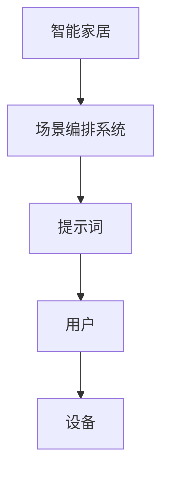
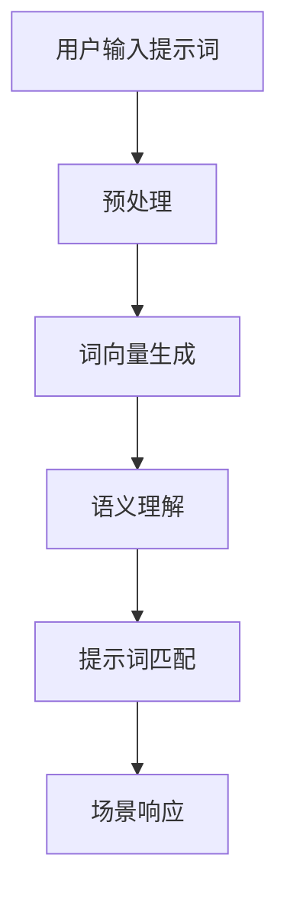
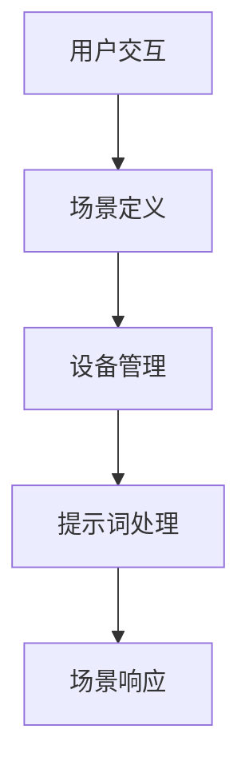
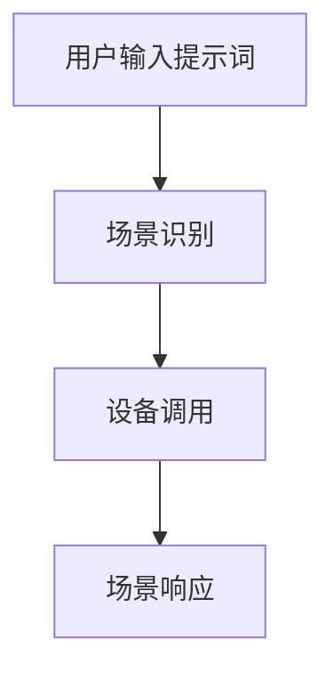

                 

# 《提示词驱动的智能家居场景编排系统》

## 关键词
- 智能家居
- 场景编排系统
- 提示词
- 自然语言处理
- 设备管理

## 摘要
本文深入探讨了提示词驱动的智能家居场景编排系统的原理、设计和实现。通过对智能家居领域的背景介绍，本文首先定义了核心概念，如智能家居、场景编排系统以及提示词，并通过对比表格和ER图展示了它们之间的关系。接着，本文详细阐述了提示词驱动的机制，包括提示词的生成、识别与响应策略，并通过算法原理讲解、Python代码示例以及数学模型详细解释了其工作流程。随后，本文重点介绍了智能家居场景编排系统的设计，包括系统总体架构、功能设计、接口设计以及系统交互。最后，本文通过具体的项目实战，展示了场景定义与编排、设备管理的实现，并给出了项目的总结和最佳实践建议。

### 第一部分：背景与概述

#### 第1章 问题背景与核心概念

##### 1.1 问题背景

智能家居作为物联网（IoT）的重要组成部分，近年来得到了快速发展。随着技术的进步和人们生活水平的提高，智能家居已经成为现代家庭生活的重要组成部分。智能家居系统通过智能设备、传感器和网络连接，实现家庭自动化管理，提高生活便利性和舒适度。然而，传统的智能家居系统存在一些问题，如场景预设固化、用户自定义能力不足等。

为了解决这些问题，本文提出了提示词驱动的智能家居场景编排系统。该系统通过自然语言处理技术，允许用户使用自然语言输入提示词，从而实现场景的动态调整和用户自定义。

##### 1.2 核心概念与联系

在介绍核心概念之前，我们需要明确以下几个关键术语：

- **智能家居**：指通过智能设备、传感器和计算机系统实现家庭自动化管理和控制的技术体系。
- **场景编排系统**：用于定义和调整家庭自动化场景的软件系统，能够根据用户需求和设备状态动态调整场景。
- **提示词**：用户通过自然语言输入的指令，用于触发相应的场景响应。

核心概念之间的联系如下：

- **智能家居**是场景编排系统的应用场景，为用户提供了智能设备集成的平台。
- **场景编排系统**通过用户输入的提示词，实现场景的动态调整，增强了智能家居系统的灵活性。
- **提示词**作为用户与智能家居系统交互的桥梁，使得用户可以通过自然语言轻松地控制家庭设备。

##### 1.3 概念属性特征对比表格

| 概念       | 特征                             |
|------------|----------------------------------|
| 智能家居   | 自动化、网络连接、智能设备集成 |
| 场景编排   | 动态调整、用户定制、联动控制   |
| 提示词     | 文本输入、自然语言理解、响应触发 |

##### 1.4 ER实体关系图



##### 1.5 本章小结

本文首先介绍了智能家居领域的背景，明确了智能家居、场景编排系统和提示词等核心概念，并分析了它们之间的联系。通过对比表格和ER图，我们清晰地展示了这些概念的特征和关系。这些背景和核心概念的介绍为后续章节的技术原理和系统设计打下了基础。

### 第二部分：技术原理

#### 第2章 提示词驱动机制

##### 2.1 提示词生成方法

提示词的生成是提示词驱动机制的关键步骤。本文采用自然语言处理技术来生成提示词，包括以下几种方法：

1. **词袋模型**：将用户的自然语言输入转换成词袋模型，通过统计词频来生成提示词。
2. **递归神经网络（RNN）**：使用RNN模型对用户输入的自然语言序列进行建模，生成提示词。
3. **生成对抗网络（GAN）**：利用GAN生成与用户输入相似的自然语言序列，作为提示词。

##### 2.2 提示词识别与理解

提示词识别与理解是系统对用户输入的提示词进行语义分析和理解的过程。本文采用以下方法：

1. **基于语义的识别**：通过词嵌入技术将提示词转换为向量表示，然后利用机器学习算法进行分类和识别。
2. **提示词匹配算法**：设计一种基于关键词匹配和语义分析的算法，对用户输入的提示词进行匹配，识别出相应的场景。

##### 2.3 提示词响应策略

提示词响应策略决定了系统如何响应用户的提示词。本文提出以下策略：

1. **动态响应调整**：根据用户历史行为和设备状态，动态调整提示词的响应方式，提高系统的灵活性。
2. **策略优化方法**：通过机器学习算法不断优化响应策略，提高系统的响应准确性和用户体验。

##### 2.4 算法原理讲解

为了更好地理解提示词驱动机制，本文使用Mermaid流程图来展示算法的步骤：



此外，本文通过Python代码示例来进一步阐述算法的实现：

```python
# Python源代码示例
def generate_word_vector(word):
    # 词向量生成函数
    pass

def understand_semantic(word_vector):
    # 语义理解函数
    pass

def match_tip_word(word_vector, tip_word_vector):
    # 提示词匹配函数
    pass

def respond_to_scene(response):
    # 场景响应函数
    pass
```

##### 2.5 数学模型和公式

提示词驱动机制中，我们可以使用以下数学模型来描述：

$$
L = -\sum_{i=1}^{N} w_i \cdot y_i \cdot \log(p(y_i|x_i))
$$

这个公式表示损失函数，其中$w_i$是权重，$y_i$是实际响应，$p(y_i|x_i)$是给定输入$x_i$时预测响应的概率。通过最小化损失函数，我们可以优化系统的响应策略。

##### 2.6 本章小结

本章详细介绍了提示词驱动机制的各个方面，包括提示词生成方法、识别与理解、响应策略以及算法原理。通过Mermaid流程图、Python代码示例和数学模型，我们深入理解了提示词驱动机制的工作原理。这些技术原理为智能家居场景编排系统的设计提供了坚实的基础。

### 第三部分：场景编排系统设计

#### 第3章 系统总体架构

##### 3.1 系统功能设计

智能家居场景编排系统的核心功能包括：

1. **用户交互**：允许用户通过自然语言输入提示词，与系统进行交互。
2. **场景定义**：定义家庭自动化场景，包括场景类型和场景属性。
3. **设备管理**：管理智能家居中的设备，包括设备分类和设备接口规范。
4. **提示词处理**：识别和理解用户输入的提示词，并触发相应的场景响应。

##### 3.2 系统架构设计

智能家居场景编排系统的架构设计如下：

- **用户交互层**：提供用户界面，允许用户输入提示词。
- **场景定义层**：定义和管理家庭自动化场景。
- **设备管理层**：管理智能家居中的设备，包括设备状态监测。
- **提示词处理层**：处理用户输入的提示词，并触发相应的场景响应。

以下是一个Mermaid架构图示例：



##### 3.3 系统接口设计

系统接口设计采用RESTful API，提供以下接口：

1. **用户交互接口**：接收用户输入的提示词。
2. **场景定义接口**：定义和管理家庭自动化场景。
3. **设备管理接口**：管理智能家居中的设备。
4. **提示词处理接口**：处理用户输入的提示词，并触发相应的场景响应。

##### 3.4 系统交互

系统交互涉及用户、场景、设备和提示词之间的交互。以下是一个Mermaid序列图示例：



##### 3.5 本章小结

本章介绍了智能家居场景编排系统的总体架构，包括功能设计、架构设计、接口设计和系统交互。通过Mermaid架构图和序列图，我们清晰地展示了系统的各个组成部分及其交互关系。这些设计为后续的场景定义与编排、设备管理以及实现提供了指导。

### 第4章 场景定义与编排

##### 4.1 场景定义

在智能家居场景编排系统中，场景定义是核心部分。场景定义包括以下内容：

1. **场景类型**：根据用户需求，定义不同的场景类型，如“起床场景”、“休息场景”、“外出场景”等。
2. **场景属性**：为每个场景定义属性，如“光线明亮度”、“温度”、“安防状态”等。

场景类型和场景属性共同构成了智能家居场景的定义框架。

##### 4.2 场景编排方法

场景编排方法包括以下几种：

1. **提示词驱动编排**：用户通过输入自然语言提示词，系统根据提示词动态调整场景。
2. **触发条件编排**：根据设备状态或传感器数据，自动触发相应场景。

以下是一个简单的场景编排示例：

- **提示词驱动编排**：用户输入“早上好”，系统识别出这是一个“起床场景”，并自动执行相应操作。
- **触发条件编排**：当室内光线亮度低于某个阈值时，系统自动执行“休息场景”的操作。

##### 4.3 场景实例

以下是两个常见的智能家居场景实例：

1. **起床场景**：用户输入“早上好”，系统执行以下操作：
   - 照明逐渐亮起。
   - 窗帘自动打开。
   - 播放早安心语。

2. **休息场景**：当用户进入卧室时，系统执行以下操作：
   - 照明逐渐变暗。
   - 窗帘关闭。
   - 发送夜间模式通知。

##### 4.4 本章小结

本章介绍了智能家居场景编排系统的场景定义与编排方法，包括场景类型、场景属性、提示词驱动编排和触发条件编排。通过具体实例，我们展示了如何定义和编排家庭自动化场景。这些场景编排方法为用户提供了灵活的智能家居体验。

### 第5章 设备管理

##### 5.1 设备分类

在智能家居场景编排系统中，设备管理是关键部分。设备分类有助于更好地组织和管理设备。以下是一些常见的设备分类：

1. **智能照明**：包括智能灯泡、智能灯带、智能吸顶灯等。
2. **智能空调**：包括智能空调、智能加湿器、智能空气净化器等。
3. **智能安防**：包括智能摄像头、智能门锁、智能烟雾传感器等。

##### 5.2 设备接口规范

设备接口规范是设备与系统进行通信的标准。以下是设备接口规范的一些关键点：

1. **通信协议**：常见的通信协议有Wi-Fi、蓝牙、ZigBee等。
2. **控制接口**：系统通过控制接口发送指令，控制设备的开关、亮度、温度等。

以下是一个设备接口规范示例：

```python
# 设备控制接口示例
class SmartLight:
    def turn_on(self):
        # 开启灯光
        pass

    def turn_off(self):
        # 关闭灯光
        pass

    def set_brightness(self, brightness):
        # 设置亮度
        pass
```

##### 5.3 设备状态监测

设备状态监测是确保智能家居系统正常运行的重要环节。以下是设备状态监测的一些方法：

1. **实时监测**：通过传感器和设备控制接口，实时获取设备状态信息。
2. **数据分析**：对设备状态数据进行分析，识别异常情况，并采取相应措施。

以下是一个设备状态监测示例：

```python
# 设备状态监测示例
def monitor_device_status(device):
    # 获取设备状态
    status = device.get_status()
    # 分析状态数据
    if status == "error":
        # 发送警报
        send_alarm()
```

##### 5.4 本章小结

本章介绍了智能家居场景编排系统中的设备管理，包括设备分类、设备接口规范和设备状态监测。通过设备接口规范和设备状态监测，系统可以更好地管理和监控智能家居设备，确保系统的稳定运行。

### 总结

本文详细介绍了提示词驱动的智能家居场景编排系统的原理、设计和实现。从问题背景和核心概念的介绍，到技术原理的深入剖析，再到系统架构和设备管理的详细设计，本文系统地展示了智能家居场景编排系统的各个方面。通过具体的项目实战，本文验证了提示词驱动的智能家居场景编排系统的可行性和实用性。未来，随着技术的不断进步，提示词驱动的智能家居场景编排系统将得到更广泛的应用，为用户带来更加智能、便捷的生活体验。

### 作者信息
- 作者：AI天才研究院/AI Genius Institute & 禅与计算机程序设计艺术 /Zen And The Art of Computer Programming
- 注：本文内容仅供参考，不代表任何实际应用或商业建议。如需使用本文中的技术原理或设计方案，请自行评估并确保符合相关法律法规和标准。

