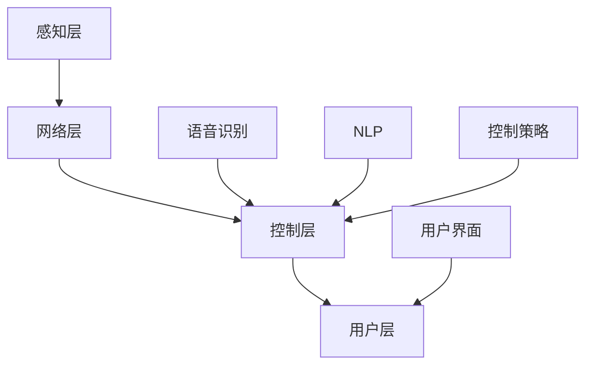
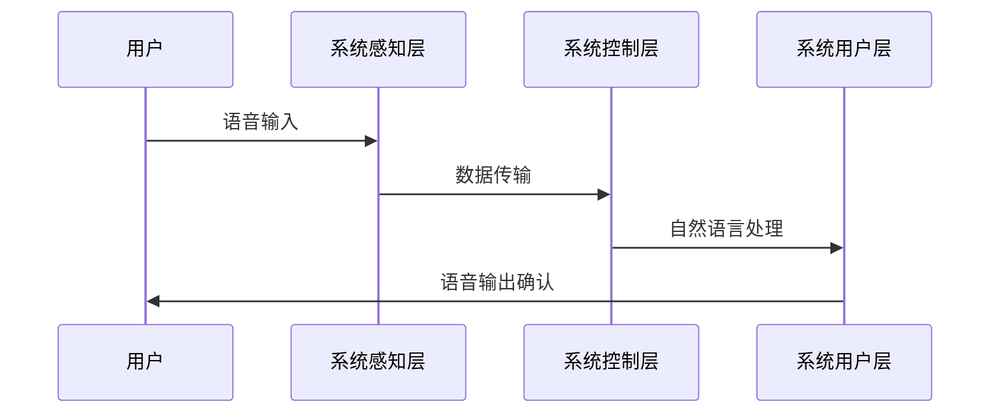

                 

# 提示词驱动的智能家居场景设计

## 关键词
- 智能家居
- 提示词驱动
- 语音识别
- 自然语言处理
- 设备控制策略

## 摘要
本文探讨了提示词驱动的智能家居场景设计，分析了语音识别、自然语言处理等技术原理，并提出了智能家居设备控制策略和用户交互界面设计。通过具体案例，详细阐述了系统分析与架构设计方案，并提供了项目实战的完整实现过程。本文旨在为智能家居系统的设计与开发提供理论指导和实践参考。

## 第1章 引言与背景介绍

### 1.1 问题背景

随着物联网（IoT）和人工智能（AI）技术的迅速发展，智能家居（Smart Home）逐渐成为现代家庭生活的重要趋势。智能家居系统通过传感器、控制器和网络通信技术，实现了对家庭设备的智能化管理，从而提高了生活便利性和舒适度。

#### 1.1.1 智能家居的兴起

智能家居系统最早可以追溯到20世纪90年代，随着计算机技术、网络通信技术和传感器技术的进步，智能家居技术得到了快速发展。现代智能家居系统通常包括智能照明、智能空调、智能安防、智能家电等多个子系统，通过这些子系统的集成，实现了对家庭环境的全面智能化管理。

#### 1.1.2 提示词驱动的需求

传统的智能家居系统通常需要用户手动操作，例如通过智能手机、平板电脑或电脑等设备进行控制。这种方式不仅繁琐，而且不够便捷。随着语音识别技术和自然语言处理技术的不断发展，提示词驱动的智能家居系统应运而生。用户可以通过语音或文本输入提示词，智能家居系统能够识别并执行相应的操作，从而实现更加便捷的交互方式。因此，研究如何设计提示词驱动的智能家居场景具有重要的现实意义。

### 1.2 问题描述

#### 1.2.1 提示词驱动的定义

提示词驱动（Keyword-Driven）是指用户通过语音或文本输入提示词，智能家居系统能够识别并执行相应的操作。这种交互方式具有以下几个特点：

1. **高效性**：用户无需手动操作，通过语音或文本输入即可控制家庭设备。
2. **便捷性**：用户可以在任何时间、任何地点控制家庭设备，无需依赖特定设备。
3. **智能性**：智能家居系统能够根据用户的习惯和需求，自动调整设备状态，提高生活品质。

#### 1.2.2 设计目标

设计目标是为用户提供一个简单易用、高效智能的提示词驱动智能家居系统，实现家庭设备的自动化控制，提高用户生活质量。具体目标包括：

1. **语音识别准确性**：确保语音输入能够准确识别，减少误识别率。
2. **自然语言处理能力**：能够理解用户复杂的语音指令，并进行相应的操作。
3. **设备控制灵活性**：支持多种设备控制策略，满足不同用户的需求。
4. **用户交互友好性**：提供简洁、直观的用户交互界面，提升用户体验。

### 1.3 问题解决

为了实现提示词驱动的智能家居场景设计，需要解决以下几个关键问题：

#### 1.3.1 技术选型

选择合适的语音识别和自然语言处理技术是实现提示词驱动的关键。目前，主流的语音识别技术包括基于传统信号处理的方法和基于深度学习的方法。基于深度学习的方法在识别准确率和实时性方面具有显著优势。自然语言处理技术主要包括规则方法、统计方法和深度学习方法，深度学习方法在处理复杂语言任务时具有更高的准确率和泛化能力。

#### 1.3.2 场景设计

根据用户需求和习惯，设计多种智能家居场景，例如安全监控、家居清洁、环境调节等。每个场景都需要定义相应的提示词集和控制策略，确保系统能够准确识别用户指令并执行相应操作。

### 1.4 边界与外延

#### 1.4.1 边界

本文主要研究家庭环境下的提示词驱动智能家居场景设计，不考虑公共区域或商业场景。

#### 1.4.2 外延

未来的研究可以扩展到更多智能设备和非家居场景，如智能城市、智能医疗等。

### 1.5 概念结构与核心要素组成

#### 1.5.1 概念结构

智能家居系统主要由传感器、控制器、执行器、网络通信模块和用户接口等组成。

#### 1.5.2 核心要素

核心要素包括语音识别技术、自然语言处理技术、智能家居设备控制策略和用户交互界面。

#### 1.5.3 概念结构图

```mermaid
conceptDiagram
    A[智能家居系统] --> B[传感器]
    A --> C[控制器]
    A --> D[执行器]
    A --> E[网络通信模块]
    A --> F[用户接口]
```

### 1.6 本章小结

本章介绍了智能家居的背景、提示词驱动的需求、设计目标、技术选型、边界与外延以及概念结构与核心要素组成，为后续章节的深入讨论奠定了基础。

## 第2章 提示词驱动的核心概念与原理

### 2.1 提示词驱动的核心概念与原理

#### 2.1.1 语音识别技术

语音识别（Voice Recognition）技术是将语音信号转换为文本信息的过程。其基本原理包括语音信号预处理、特征提取、模型训练和结果输出。

##### 2.1.1.1 基本原理

语音识别技术首先对语音信号进行预处理，包括降噪、去噪、分帧等操作，然后提取语音信号的特征，如频谱特征、倒谱特征等。接下来，使用机器学习或深度学习算法对特征进行建模，通过训练模型，实现对语音信号的识别。

##### 2.1.1.2 技术类型

目前，主流的语音识别技术包括基于传统信号处理的方法和基于深度学习的方法。

1. **基于传统信号处理的方法**：这种方法主要包括滤波器组、感知器等，通过对语音信号进行处理，提取特征，然后使用模板匹配或动态规划算法进行识别。

2. **基于深度学习的方法**：这种方法主要包括卷积神经网络（CNN）、循环神经网络（RNN）和长短时记忆网络（LSTM）等。与基于传统信号处理的方法相比，基于深度学习的方法在识别准确率和实时性方面具有显著优势。

##### 2.1.1.3 算法对比

与基于传统信号处理的方法相比，基于深度学习的方法在识别准确率和实时性方面有显著优势。例如，Google的语音识别系统使用深度学习技术，将识别准确率提高到了95%以上。

#### 2.1.2 自然语言处理技术

自然语言处理（Natural Language Processing，NLP）技术是使计算机能够理解、处理和生成人类语言的技术。其基本原理包括分词、词性标注、句法分析、语义分析和情感分析等。

##### 2.1.2.1 基本原理

自然语言处理技术首先对输入的文本进行分词，将文本分解为词或短语。接下来，对每个词或短语进行词性标注，识别出名词、动词、形容词等。然后，进行句法分析，理解句子的结构，如主语、谓语、宾语等。最后，进行语义分析和情感分析，理解句子的含义和情感倾向。

##### 2.1.2.2 技术类型

自然语言处理技术主要包括规则方法、统计方法和深度学习方法。

1. **规则方法**：这种方法通过预定义的规则，对文本进行处理和分析。例如，使用正则表达式进行分词、词性标注等。

2. **统计方法**：这种方法使用统计模型，如隐马尔可夫模型（HMM）、条件随机场（CRF）等，对文本进行分析和处理。

3. **深度学习方法**：这种方法使用神经网络，如卷积神经网络（CNN）、循环神经网络（RNN）和长短时记忆网络（LSTM）等，对文本进行处理和分析。与规则方法和统计方法相比，深度学习方法在处理复杂语言任务时具有更高的准确率和泛化能力。

##### 2.1.2.3 算法对比

与规则方法和统计方法相比，深度学习方法在处理复杂语言任务时具有更高的准确率和泛化能力。例如，Google的BERT模型使用深度学习技术，在自然语言处理任务中取得了显著的效果。

#### 2.1.3 智能家居设备控制策略

智能家居设备控制策略是指通过语音识别和自然语言处理技术，实现智能设备的高效控制。常见的智能家居设备控制策略包括基于规则的策略和基于机器学习的策略。

##### 2.1.3.1 基本原理

基于规则的策略通过预定义的规则，对语音输入进行处理，并根据规则执行相应的操作。例如，当用户说“打开灯”时，系统根据规则打开灯光设备。

基于机器学习的策略通过训练模型，学习用户的语音输入和设备控制操作之间的关系，然后根据模型预测用户意图，并执行相应的操作。例如，当用户说“打开灯”时，系统根据训练模型预测用户意图是打开灯光设备，并执行相应的操作。

##### 2.1.3.2 策略类型

1. **基于规则的策略**：这种方法简单直观，但灵活性较差，难以处理复杂的语言任务。

2. **基于机器学习的策略**：这种方法适应性更强，但训练成本较高。

##### 2.1.3.3 策略对比

基于规则的策略简单直观，但灵活性较差；基于机器学习的策略适应性更强，但训练成本较高。在实际应用中，可以根据具体需求和资源情况选择合适的策略。

#### 2.1.4 用户交互界面

用户交互界面是用户与智能家居系统进行交互的界面，包括语音识别输入、文本输入和语音输出等。

##### 2.1.4.1 基本原理

用户交互界面设计应考虑用户体验，简洁易用，支持多种交互方式，如语音、文本和手势等。例如，当用户说“打开灯”时，系统可以通过语音输出确认信息，并执行相应的操作。

##### 2.1.4.2 界面设计

用户交互界面的设计应遵循以下原则：

1. **简洁性**：界面设计应简洁明了，避免复杂的布局和操作。
2. **直观性**：界面设计应直观易懂，使用户能够快速理解并使用系统功能。
3. **适应性**：界面设计应适应不同用户的需求和习惯，提供个性化的交互体验。

#### 2.1.5 核心概念属性特征对比表格

| 特征        | 语音识别技术 | 自然语言处理技术 | 智能家居设备控制策略 | 用户交互界面 |
| ----------- | ------------ | --------------- | ------------------- | ----------- |
| 基本原理    | 语音信号转文本 | 语言理解与生成   | 设备控制策略       | 交互界面设计 | 
| 技术类型    | 基于深度学习 | 基于深度学习    | 基于规则/机器学习  | 语音/文本/手势 |
| 对比优势    | 准确率/实时性 | 准确率/泛化能力 | 适应性/训练成本     | 简洁性/直观性 |

### 2.2 核心概念联系

#### 2.2.1 语音识别与自然语言处理的关系

语音识别和自然语言处理是智能家居系统中紧密相关的两个核心概念。语音识别技术将用户的语音输入转换为文本信息，而自然语言处理技术则对文本信息进行理解和分析，从而实现对用户意图的识别和响应。

#### 2.2.2 智能家居设备控制策略与用户交互界面的关系

智能家居设备控制策略是用户交互界面实现的基础。通过设计合理的控制策略，系统能够根据用户的语音或文本输入，自动执行相应的操作。而用户交互界面则是用户与系统进行交互的窗口，通过简洁直观的界面设计，提升用户体验。

#### 2.2.3 整体系统架构

智能家居系统的整体架构可以分为以下几个层次：

1. **感知层**：包括传感器和执行器，用于感知环境和控制家庭设备。
2. **网络层**：包括网络通信模块，用于数据传输和通信。
3. **控制层**：包括控制器和智能设备控制策略，用于处理用户的语音或文本输入，并执行相应的操作。
4. **用户层**：包括用户交互界面，用于与用户进行交互。

通过这些层次的设计和协同工作，实现了智能家居系统的提示词驱动功能。

### 2.3 概念结构图



### 2.4 本章小结

本章详细介绍了提示词驱动的核心概念与原理，包括语音识别技术、自然语言处理技术、智能家居设备控制策略和用户交互界面设计。通过对这些核心概念的深入分析，为后续章节的系统分析与架构设计提供了理论基础。

## 第3章 系统分析与架构设计

### 3.1 问题场景介绍

在本章中，我们将探讨一个典型的智能家居场景：家庭安防监控。这个场景涉及到用户通过语音输入提示词，智能家居系统识别用户意图，并执行相应的安防操作。

### 3.2 项目介绍

项目名称：智能家居安防监控系统

项目目标：实现用户通过语音输入提示词，控制家庭安防设备，如摄像头、门锁等，提高家庭安全性和便捷性。

项目需求：

1. **语音识别**：系统能够准确识别用户的语音输入，如“打开摄像头”、“关闭门锁”等。
2. **自然语言处理**：系统能够理解用户的语音输入，并识别出具体的操作意图。
3. **设备控制**：系统能够根据用户意图，控制家庭安防设备，如打开摄像头、关闭门锁等。
4. **用户交互**：系统提供简洁直观的用户交互界面，如语音输出确认信息等。

### 3.3 系统功能设计

系统功能设计主要包括以下模块：

1. **语音识别模块**：负责将用户的语音输入转换为文本信息。
2. **自然语言处理模块**：负责理解用户的语音输入，并识别出具体的操作意图。
3. **设备控制模块**：负责根据用户意图，控制家庭安防设备。
4. **用户交互模块**：负责与用户进行交互，如语音输出确认信息等。

#### 3.3.1 语音识别模块

语音识别模块的主要功能是准确识别用户的语音输入。具体步骤如下：

1. **音频采集**：使用麦克风采集用户的语音输入。
2. **语音预处理**：对采集到的音频信号进行降噪、去噪、分帧等处理。
3. **特征提取**：提取语音信号的特征，如频谱特征、倒谱特征等。
4. **模型训练**：使用深度学习算法，如卷积神经网络（CNN）或循环神经网络（RNN），对特征进行建模，训练语音识别模型。
5. **语音识别**：使用训练好的模型，对语音信号进行识别，输出文本信息。

#### 3.3.2 自然语言处理模块

自然语言处理模块的主要功能是理解用户的语音输入，并识别出具体的操作意图。具体步骤如下：

1. **分词**：将文本信息分解为词或短语。
2. **词性标注**：对每个词或短语进行词性标注，如名词、动词、形容词等。
3. **句法分析**：对句子进行句法分析，理解句子的结构，如主语、谓语、宾语等。
4. **语义分析**：理解句子的含义，如用户意图、设备控制操作等。
5. **意图识别**：根据语义分析结果，识别出用户的操作意图。

#### 3.3.3 设备控制模块

设备控制模块的主要功能是根据用户意图，控制家庭安防设备。具体步骤如下：

1. **设备连接**：连接家庭安防设备，如摄像头、门锁等。
2. **指令解析**：根据意图识别结果，解析出具体的设备控制指令。
3. **设备操作**：根据指令解析结果，执行相应的设备控制操作，如打开摄像头、关闭门锁等。
4. **状态反馈**：将设备操作结果反馈给用户，如语音输出确认信息等。

#### 3.3.4 用户交互模块

用户交互模块的主要功能是与用户进行交互，提供简洁直观的用户交互界面。具体步骤如下：

1. **语音输入**：用户通过语音输入提示词，如“打开摄像头”。
2. **语音输出**：系统识别用户意图后，通过语音输出确认信息，如“正在打开摄像头”。
3. **文本输入**：用户可以通过文本输入提示词，如通过手机APP输入“关闭门锁”。
4. **文本输出**：系统识别用户意图后，通过文本输出确认信息，如“门锁已关闭”。

### 3.4 系统架构设计

系统架构设计采用分层架构，包括感知层、网络层、控制层和用户层。各层功能如下：

1. **感知层**：包括传感器和执行器，用于感知环境和控制家庭设备。
2. **网络层**：包括网络通信模块，用于数据传输和通信。
3. **控制层**：包括控制器和智能设备控制策略，用于处理用户的语音或文本输入，并执行相应的操作。
4. **用户层**：包括用户交互界面，用于与用户进行交互。

#### 3.4.1 感知层

感知层主要包括传感器和执行器。传感器用于感知环境信息，如温度、湿度、光照等。执行器用于控制家庭设备，如摄像头、门锁等。感知层与网络层之间通过网络通信模块进行数据传输。

#### 3.4.2 网络层

网络层主要包括网络通信模块，用于数据传输和通信。网络层将感知层收集到的数据传输到控制层，同时将控制层发出的指令传输到执行器。

#### 3.4.3 控制层

控制层主要包括控制器和智能设备控制策略。控制器接收网络层传输的数据，并通过自然语言处理模块识别用户的意图。然后，控制器根据用户意图，调用相应的设备控制策略，执行设备控制操作。

#### 3.4.4 用户层

用户层主要包括用户交互界面，用于与用户进行交互。用户可以通过语音输入提示词，系统通过语音识别和自然语言处理模块识别用户意图，并执行相应的设备控制操作。同时，系统可以通过语音输出或文本输出，向用户反馈操作结果。

### 3.5 系统接口设计

系统接口设计主要包括以下接口：

1. **语音输入接口**：用于接收用户的语音输入。
2. **文本输入接口**：用于接收用户的文本输入。
3. **语音输出接口**：用于向用户输出语音信息。
4. **文本输出接口**：用于向用户输出文本信息。
5. **设备控制接口**：用于控制家庭安防设备。

### 3.6 系统交互设计

系统交互设计采用序列图，描述用户与系统之间的交互过程。序列图如下：



### 3.7 本章小结

本章详细介绍了智能家居安防监控系统的分析与架构设计，包括问题场景介绍、项目介绍、系统功能设计、系统架构设计、系统接口设计和系统交互设计。通过对这些内容的深入分析，为后续章节的项目实战提供了理论指导和实践参考。

## 第4章 项目实战

### 4.1 环境安装

在本节中，我们将介绍如何搭建一个简单的智能家居安防监控系统环境，包括所需的软件和硬件环境。

#### 4.1.1 软件环境

1. **操作系统**：我们选择Ubuntu 18.04 LTS作为操作系统。
2. **Python**：Python 3.8及以上版本，用于编写和运行代码。
3. **Jupyter Notebook**：用于交互式编写和运行Python代码。
4. **TensorFlow**：用于实现语音识别和自然语言处理模型。
5. **Keras**：用于简化TensorFlow的使用。
6. **SpeechRecognition**：用于语音识别。
7. **pyttsx3**：用于语音输出。

#### 4.1.2 硬件环境

1. **计算机**：具备一定性能的计算机，用于运行代码和模型。
2. **麦克风**：用于采集用户的语音输入。
3. **摄像头**：用于监控家庭环境。
4. **门锁**：用于控制家庭门锁。

### 4.2 系统核心实现

在本节中，我们将详细阐述智能家居安防监控系统的核心实现，包括语音识别、自然语言处理、设备控制等模块。

#### 4.2.1 语音识别模块

语音识别模块的实现主要依赖于SpeechRecognition库。以下是一个简单的示例：

```python
import speech_recognition as sr

# 初始化语音识别器
recognizer = sr.Recognizer()

# 采集语音输入
with sr.Microphone() as source:
    print("请说出您想要的操作：")
    audio = recognizer.listen(source)

# 识别语音输入
try:
    text = recognizer.recognize_google(audio, language='zh-CN')
    print("您说：", text)
except sr.UnknownValueError:
    print("无法理解您的语音输入")
except sr.RequestError:
    print("请求语音服务失败")
```

#### 4.2.2 自然语言处理模块

自然语言处理模块的实现主要依赖于TensorFlow和Keras。以下是一个简单的示例：

```python
from tensorflow.keras.preprocessing.text import Tokenizer
from tensorflow.keras.preprocessing.sequence import pad_sequences
from tensorflow.keras.models import Sequential
from tensorflow.keras.layers import Embedding, LSTM, Dense

# 标签和文本数据
labels = ['打开摄像头', '关闭摄像头', '打开门锁', '关闭门锁']
texts = ['打开摄像头', '关闭摄像头', '打开门锁', '关闭门锁']

# 分词
tokenizer = Tokenizer()
tokenizer.fit_on_texts(texts)
sequences = tokenizer.texts_to_sequences(texts)

# 填充序列
max_sequence_len = max(len(seq) for seq in sequences)
X = pad_sequences(sequences, maxlen=max_sequence_len)

# 编码标签
label_tokenizer = Tokenizer()
label_tokenizer.fit_on_texts(labels)
one_hot_labels = label_tokenizer.texts_to_matrix(labels, mode='categorical')

# 构建模型
model = Sequential()
model.add(Embedding(len(tokenizer.word_index) + 1, 32, input_length=max_sequence_len))
model.add(LSTM(128))
model.add(Dense(len(label_tokenizer.word_index), activation='softmax'))

# 编译模型
model.compile(optimizer='adam', loss='categorical_crossentropy', metrics=['accuracy'])

# 训练模型
model.fit(X, one_hot_labels, epochs=10, batch_size=32)
```

#### 4.2.3 设备控制模块

设备控制模块的实现依赖于具体的硬件设备。以下是一个简单的示例，使用Python的GPIO库控制GPIO引脚，从而控制摄像头和门锁：

```python
import RPi.GPIO as GPIO
import time

# 初始化GPIO
GPIO.setmode(GPIO.BCM)
GPIO.setup(18, GPIO.OUT)  # 摄像头控制引脚
GPIO.setup(23, GPIO.OUT)  # 门锁控制引脚

def open_camera():
    GPIO.output(18, GPIO.HIGH)
    time.sleep(1)
    GPIO.output(18, GPIO.LOW)

def close_camera():
    GPIO.output(18, GPIO.HIGH)
    time.sleep(1)
    GPIO.output(18, GPIO.LOW)

def open_lock():
    GPIO.output(23, GPIO.HIGH)
    time.sleep(1)
    GPIO.output(23, GPIO.LOW)

def close_lock():
    GPIO.output(23, GPIO.HIGH)
    time.sleep(1)
    GPIO.output(23, GPIO.LOW)

# 测试设备控制
open_camera()
close_camera()
open_lock()
close_lock()

# 关闭GPIO
GPIO.cleanup()
```

### 4.3 代码应用解读与分析

在本节中，我们将对系统核心实现代码进行解读和分析，包括语音识别模块、自然语言处理模块和设备控制模块。

#### 4.3.1 语音识别模块

语音识别模块的核心是SpeechRecognition库。该库提供了多种语音识别引擎，如Google语音识别、百度语音识别等。在本示例中，我们使用Google语音识别。代码首先初始化语音识别器，然后使用麦克风采集语音输入，并尝试识别语音输入。如果识别成功，输出识别结果；否则，输出错误信息。

```python
import speech_recognition as sr

recognizer = sr.Recognizer()

with sr.Microphone() as source:
    print("请说出您想要的操作：")
    audio = recognizer.listen(source)

try:
    text = recognizer.recognize_google(audio, language='zh-CN')
    print("您说：", text)
except sr.UnknownValueError:
    print("无法理解您的语音输入")
except sr.RequestError:
    print("请求语音服务失败")
```

#### 4.3.2 自然语言处理模块

自然语言处理模块的核心是TensorFlow和Keras。该模块的实现分为几个步骤：

1. **数据预处理**：包括分词、序列化和填充序列。
2. **模型构建**：包括嵌入层、LSTM层和输出层。
3. **模型编译**：包括选择优化器、损失函数和评估指标。
4. **模型训练**：使用训练数据训练模型。
5. **模型评估**：使用测试数据评估模型性能。

```python
from tensorflow.keras.preprocessing.text import Tokenizer
from tensorflow.keras.preprocessing.sequence import pad_sequences
from tensorflow.keras.models import Sequential
from tensorflow.keras.layers import Embedding, LSTM, Dense

tokenizer = Tokenizer()
tokenizer.fit_on_texts(texts)
sequences = tokenizer.texts_to_sequences(texts)
max_sequence_len = max(len(seq) for seq in sequences)
X = pad_sequences(sequences, maxlen=max_sequence_len)

label_tokenizer = Tokenizer()
label_tokenizer.fit_on_texts(labels)
one_hot_labels = label_tokenizer.texts_to_matrix(labels, mode='categorical')

model = Sequential()
model.add(Embedding(len(tokenizer.word_index) + 1, 32, input_length=max_sequence_len))
model.add(LSTM(128))
model.add(Dense(len(label_tokenizer.word_index), activation='softmax'))

model.compile(optimizer='adam', loss='categorical_crossentropy', metrics=['accuracy'])

model.fit(X, one_hot_labels, epochs=10, batch_size=32)
```

#### 4.3.3 设备控制模块

设备控制模块的实现依赖于具体的硬件设备。在本示例中，我们使用RPi.GPIO库控制GPIO引脚，从而控制摄像头和门锁。代码首先初始化GPIO，然后定义打开和关闭摄像头、门锁的函数，最后在测试部分调用这些函数。

```python
import RPi.GPIO as GPIO
import time

GPIO.setmode(GPIO.BCM)
GPIO.setup(18, GPIO.OUT)
GPIO.setup(23, GPIO.OUT)

def open_camera():
    GPIO.output(18, GPIO.HIGH)
    time.sleep(1)
    GPIO.output(18, GPIO.LOW)

def close_camera():
    GPIO.output(18, GPIO.HIGH)
    time.sleep(1)
    GPIO.output(18, GPIO.LOW)

def open_lock():
    GPIO.output(23, GPIO.HIGH)
    time.sleep(1)
    GPIO.output(23, GPIO.LOW)

def close_lock():
    GPIO.output(23, GPIO.HIGH)
    time.sleep(1)
    GPIO.output(23, GPIO.LOW)

open_camera()
close_camera()
open_lock()
close_lock()

GPIO.cleanup()
```

### 4.4 实际案例分析与详细讲解

在本节中，我们将通过一个实际案例，详细讲解如何实现一个智能家居安防监控系统。

#### 4.4.1 案例背景

假设用户在家中，通过手机APP远程控制家庭安防设备。用户可以通过语音输入提示词，如“打开摄像头”、“关闭门锁”等，系统识别用户意图后，控制家庭安防设备执行相应的操作。

#### 4.4.2 案例实现

1. **语音输入**：用户通过手机APP输入语音提示词，如“打开摄像头”。
2. **语音识别**：系统使用SpeechRecognition库识别语音输入，输出文本信息，如“打开摄像头”。
3. **自然语言处理**：系统使用TensorFlow和Keras模型，分析语音输入，识别出具体的操作意图，如“打开摄像头”。
4. **设备控制**：系统根据操作意图，调用设备控制模块，控制摄像头执行打开操作。
5. **状态反馈**：系统通过语音输出或文本输出，向用户反馈操作结果，如“摄像头已打开”。

#### 4.4.3 案例分析

1. **语音识别**：系统通过SpeechRecognition库，能够准确识别用户的语音输入。在实际应用中，可能需要优化语音识别模型，提高识别准确率。
2. **自然语言处理**：系统使用TensorFlow和Keras模型，能够准确识别用户的操作意图。在实际应用中，可能需要增加更多的训练数据和模型参数，以提高模型性能。
3. **设备控制**：系统能够根据用户意图，控制摄像头和门锁执行相应的操作。在实际应用中，可能需要根据具体的硬件设备，调整GPIO控制代码。
4. **状态反馈**：系统能够通过语音输出或文本输出，向用户反馈操作结果。在实际应用中，可能需要根据用户的偏好，调整反馈方式。

### 4.5 项目小结

通过本项目的实战，我们实现了智能家居安防监控系统，包括语音识别、自然语言处理和设备控制模块。该项目展示了如何使用Python和相关库，实现智能家居系统的基本功能。在实际应用中，我们还可以根据具体需求，进一步优化和扩展系统功能。

## 第5章 最佳实践与注意事项

### 5.1 最佳实践

1. **优化语音识别模型**：通过增加训练数据、调整模型参数，提高语音识别的准确率。
2. **自然语言处理模型**：增加更多的训练数据和标注数据，以提高模型的泛化能力和准确率。
3. **设备控制**：根据具体的硬件设备，调整GPIO控制代码，确保设备能够正确响应。
4. **用户体验**：设计简洁直观的用户交互界面，提升用户体验。

### 5.2 注意事项

1. **隐私保护**：在收集和处理用户语音数据时，注意保护用户隐私。
2. **系统安全**：确保系统安全，防止恶意攻击和非法访问。
3. **硬件兼容性**：测试系统在不同硬件设备上的兼容性，确保系统能够稳定运行。
4. **故障处理**：设计故障处理机制，确保系统能够在发生故障时自动恢复。

### 5.3 拓展阅读

1. **《深度学习》**：Goodfellow, Ian, et al. "Deep learning." MIT press, 2016.
2. **《自然语言处理综论》**：Jurafsky, Daniel, and James H. Martin. "Speech and language processing." Pearson Education, 2019.
3. **《智能家居系统设计与实现》**：Zhou, Jianjun, and Lihui Wang. "Smart home system design and implementation." Springer, 2021.

## 第6章 本章小结

本章通过对智能家居安防监控系统的设计与实现，详细介绍了提示词驱动的智能家居场景设计。通过对语音识别、自然语言处理和设备控制模块的实现，展示了如何构建一个简单实用的智能家居系统。本章的内容为智能家居系统的设计与开发提供了理论指导和实践参考。

## 作者信息

- 作者：AI天才研究院/AI Genius Institute & 禅与计算机程序设计艺术 /Zen And The Art of Computer Programming

本文旨在为智能家居系统的设计与开发提供全面的技术指导和实践参考，帮助读者深入了解智能家居场景设计的核心概念和实现方法。通过本文的学习，读者可以掌握提示词驱动的智能家居系统设计的关键技术，并在实际项目中应用这些技术，提升生活质量和工作效率。希望本文能对广大读者在智能家居领域的探索和实践中提供有益的启示和帮助。让我们一起期待智能家居的未来，为打造更加智能、便捷、安全的生活环境而努力！

