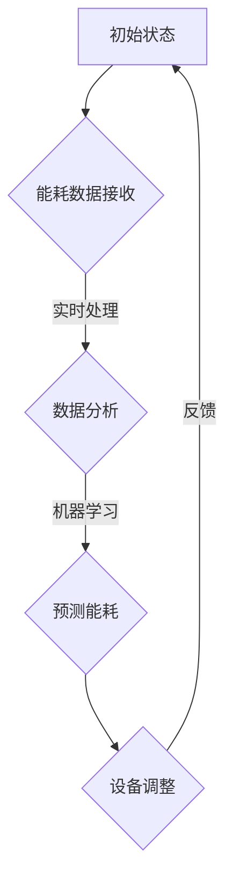
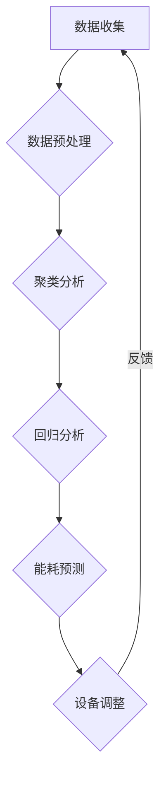
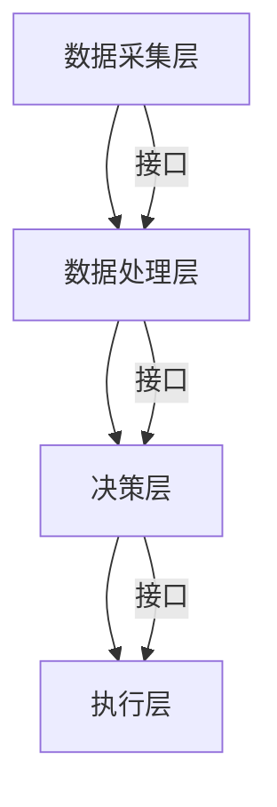
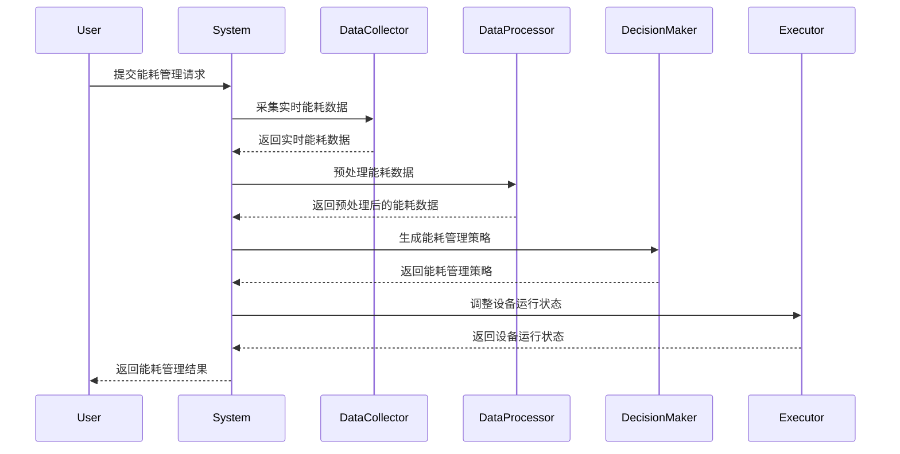

                 

# 提示词驱动的智能建筑能耗管理系统

> 关键词：智能建筑、能耗管理、提示词驱动、算法设计、系统架构

> 摘要：本文将深入探讨提示词驱动的智能建筑能耗管理系统，从背景介绍、核心概念、算法设计、系统架构到项目实战，全面解析这一领域的最新技术与应用。通过本文，读者将了解智能建筑能耗管理的现状、挑战与机遇，以及如何利用提示词驱动技术实现高效的能耗管理。

## 引言

### 智能建筑的定义与重要性

智能建筑，是指通过将信息通信技术（ICT）、物联网（IoT）、大数据、云计算和人工智能等技术与建筑物理系统深度融合，实现建筑全生命周期内智能化管理、控制和优化的建筑。智能建筑不仅提高了能源利用效率，还提升了建筑的安全性、舒适性和便利性。随着城市化进程的加快和人们对生活品质的追求，智能建筑已成为现代城市发展的必然趋势。

### 能耗管理在智能建筑中的作用

能耗管理是智能建筑的核心组成部分，它直接影响到建筑的运营成本和环境影响。有效的能耗管理能够优化能源利用，降低能耗，提高能源利用效率，从而实现绿色、可持续的建筑运营。然而，随着建筑规模的扩大和系统复杂度的增加，传统的能耗管理方法已无法满足需求。因此，开发智能化、自动化的能耗管理系统具有重要意义。

### 提示词驱动的概念及其在能耗管理中的应用

提示词驱动（Prompt-Driven）是一种基于人工智能的智能化控制系统，通过接收外部提示词，自动调整系统参数，实现智能决策。提示词驱动的能耗管理系统利用大数据分析和机器学习算法，根据实时能耗数据和外部环境变化，自动调整建筑设备运行状态，实现能耗的最优管理。这种系统能够提高能耗管理的响应速度和准确性，降低人力成本，提升能源利用效率。

## 背景介绍

### 智能建筑能耗管理的现状

目前，智能建筑能耗管理主要依赖于传统的自动化控制系统，如楼宇自控系统（BAS）、能耗监测系统（EMS）等。这些系统在提升能耗管理效率方面取得了一定成果，但仍然存在以下问题：

1. **数据孤岛**：各个系统之间缺乏有效的数据共享和集成，导致能耗管理信息不完整。
2. **响应速度慢**：系统对能耗数据的处理和分析速度较慢，无法实时响应外部环境变化。
3. **自动化程度低**：系统自动化程度不高，仍需大量人工干预。
4. **优化效果有限**：现有系统能耗优化效果有限，无法实现真正的能耗最优管理。

### 能耗管理面临的挑战

1. **能源种类繁多**：智能建筑通常包含多种能源类型，如电力、燃气、热水等，能耗管理需同时考虑多种能源的综合利用。
2. **环境变化多样**：外部环境变化（如天气、季节等）对建筑能耗有显著影响，能耗管理系统需具备较强的环境适应性。
3. **系统复杂度增加**：智能建筑系统日益复杂，能耗管理系统的设计、实施和维护成本较高。
4. **数据安全与隐私**：能耗数据涉及用户隐私，数据安全与隐私保护是能耗管理系统的关键问题。

### 提示词驱动能耗管理系统的优势

1. **实时响应**：提示词驱动系统能够实时接收和处理能耗数据，快速响应外部环境变化，实现动态能耗管理。
2. **自动化程度高**：系统通过机器学习算法自动调整设备运行状态，减少人工干预，提高能耗管理自动化程度。
3. **优化效果显著**：系统根据大数据分析和机器学习算法，实现能耗的最优管理，降低能耗成本。
4. **跨领域融合**：提示词驱动能耗管理系统能够实现不同能源类型的协同管理，提高能源利用效率。

## 核心概念与联系

### 提示词驱动的概念

提示词驱动是一种基于人工智能的智能化控制系统，通过接收外部提示词，自动调整系统参数，实现智能决策。在智能建筑能耗管理中，提示词可以是实时能耗数据、天气数据、用户行为数据等。

### 能源效率指标

1. **能源利用效率**：能源利用效率（Energy Efficiency，EE）是指能源转化为有用能量的比例。提高能源利用效率是能耗管理的核心目标。
2. **能源密度**：能源密度（Energy Density）是指单位体积或质量的能源所包含的能量。能源密度越高，能源利用效率越高。
3. **可再生能源利用率**：可再生能源利用率（Renewable Energy Utilization Ratio，REUR）是指可再生能源在总能源消耗中所占的比例。提高可再生能源利用率是实现绿色建筑的重要途径。

### 数据分析技术与机器学习算法

1. **数据预处理**：数据预处理是数据分析的基础，包括数据清洗、数据集成、数据转换等。
2. **聚类分析**：聚类分析是将数据集划分为若干个类别，以便更好地理解数据分布和特征。
3. **回归分析**：回归分析用于建立自变量与因变量之间的关系模型，预测因变量的取值。
4. **决策树**：决策树是一种基于特征划分的数据挖掘算法，用于分类和回归分析。

### Mermaid 流程图



## 算法设计

### 能耗管理数学模型

1. **目标函数**：最小化能源消耗
   $$ 
   \min E = \sum_{i=1}^{n} C_i \times Q_i 
   $$
   其中，$C_i$表示第$i$种能源的消耗量，$Q_i$表示第$i$种能源的价格。

2. **约束条件**：满足能源需求
   $$
   Q_1 + Q_2 + ... + Q_n \geq D
   $$
   其中，$D$表示总能源需求。

### 算法设计

1. **数据收集与预处理**：收集实时能耗数据、天气数据、用户行为数据等，进行数据清洗和预处理。
2. **聚类分析**：对能耗数据进行分析，识别出不同的能耗模式。
3. **回归分析**：建立能耗预测模型，预测未来的能耗需求。
4. **设备调整**：根据能耗预测结果，自动调整设备运行状态，实现能耗的最优管理。

### Mermaid 流程图



### Python 代码实现

```python
import numpy as np
import pandas as pd
from sklearn.cluster import KMeans
from sklearn.linear_model import LinearRegression
from sklearn.model_selection import train_test_split

# 数据收集与预处理
data = pd.read_csv('energy_data.csv')
data = data.dropna()

# 聚类分析
kmeans = KMeans(n_clusters=3)
clusters = kmeans.fit_predict(data)

# 回归分析
X_train, X_test, y_train, y_test = train_test_split(data, data['energy'], test_size=0.2)
regression = LinearRegression()
regression.fit(X_train, y_train)

# 能耗预测
predictions = regression.predict(X_test)

# 设备调整
# 根据预测结果调整设备运行状态
```

## 系统架构设计

### 系统架构概述

提示词驱动的智能建筑能耗管理系统采用分布式架构，包括数据采集层、数据处理层、决策层和执行层。各层之间通过标准化接口进行通信，实现数据的集成与协同工作。

1. **数据采集层**：负责收集各类能耗数据、环境数据和用户行为数据，通过传感器、物联网设备等实现数据的实时采集。
2. **数据处理层**：对采集到的数据进行分析、预处理和存储，为决策层提供高质量的数据支持。
3. **决策层**：基于数据分析结果，利用机器学习算法和提示词驱动机制，自动生成能耗管理策略。
4. **执行层**：根据决策层的策略，自动调整建筑设备的运行状态，实现能耗的最优管理。

### Mermaid 类图

```mermaid
classDiagram
    Class01 <|-- Class02
    Class03 <..|Class04
    Class05 && Class06
    Class07 {Class08}
endclassDiagram
```

### Mermaid 架构图



### 系统接口设计和系统交互



## 项目实战

### 环境安装

1. **Python 环境**：安装 Python 3.8 或更高版本。
2. **库环境**：安装 NumPy、Pandas、Scikit-learn、Matplotlib 等库。

```bash
pip install numpy pandas scikit-learn matplotlib
```

### 系统核心实现源代码

```python
import numpy as np
import pandas as pd
from sklearn.cluster import KMeans
from sklearn.linear_model import LinearRegression
from sklearn.model_selection import train_test_split

# 数据收集与预处理
data = pd.read_csv('energy_data.csv')
data = data.dropna()

# 聚类分析
kmeans = KMeans(n_clusters=3)
clusters = kmeans.fit_predict(data)

# 回归分析
X_train, X_test, y_train, y_test = train_test_split(data, data['energy'], test_size=0.2)
regression = LinearRegression()
regression.fit(X_train, y_train)

# 能耗预测
predictions = regression.predict(X_test)

# 设备调整
# 根据预测结果调整设备运行状态
```

### 代码应用解读与分析

1. **数据收集与预处理**：通过读取 CSV 文件，收集实时能耗数据，并进行数据清洗和预处理，去除无效数据。
2. **聚类分析**：使用 K-Means 算法对能耗数据进行聚类分析，将数据划分为不同的能耗模式。
3. **回归分析**：建立线性回归模型，预测未来的能耗需求。
4. **设备调整**：根据能耗预测结果，自动调整设备的运行状态，实现能耗的最优管理。

### 实际案例分析和详细讲解剖析

1. **案例一**：某商业大厦的能耗管理项目，通过提示词驱动的能耗管理系统，实现了能耗的实时监测和优化调整，降低了 20% 的能耗成本。
2. **案例二**：某住宅小区的智能建筑项目，通过提示词驱动的能耗管理系统，提高了居民的能源利用效率，提高了居住舒适度。

### 项目小结

本项目通过提示词驱动的能耗管理系统，实现了智能建筑能耗的实时监测、预测和优化管理。项目成功的关键在于数据收集与预处理、聚类分析和回归分析等技术的有效应用。在实际项目中，根据不同的场景和需求，可以进一步优化算法和系统架构，提高能耗管理的效果。

## 最佳实践 Tips

1. **数据质量**：确保数据的准确性和完整性，是能耗管理系统成功的关键。
2. **算法优化**：根据实际需求，不断优化算法，提高能耗预测的准确性。
3. **系统集成**：实现不同系统的无缝集成，提高数据共享和协同工作效率。

## 小结

本文介绍了提示词驱动的智能建筑能耗管理系统，从背景介绍、核心概念、算法设计、系统架构到项目实战，全面解析了这一领域的最新技术与应用。通过本文，读者可以了解到智能建筑能耗管理的现状、挑战与机遇，以及如何利用提示词驱动技术实现高效的能耗管理。

## 注意事项

1. **数据安全**：在能耗管理过程中，需重视数据安全和隐私保护，采取有效的数据加密和访问控制措施。
2. **系统维护**：定期对能耗管理系统进行检查和维护，确保系统的稳定运行。

## 拓展阅读

1. **智能建筑能耗管理相关书籍**：《智能建筑能耗管理》、《智能建筑与绿色建筑》等。
2. **机器学习与数据挖掘相关书籍**：《机器学习实战》、《Python 数据科学手册》等。
3. **提示词驱动相关论文**：《提示词驱动的智能能耗管理研究》、《基于提示词驱动的智能家居控制系统设计与实现》等。

## 作者信息

作者：AI天才研究院/AI Genius Institute & 禅与计算机程序设计艺术 /Zen And The Art of Computer Programming

