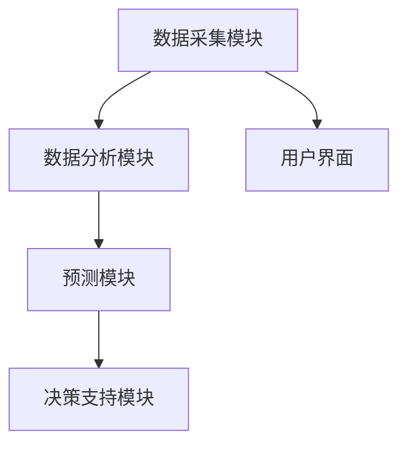
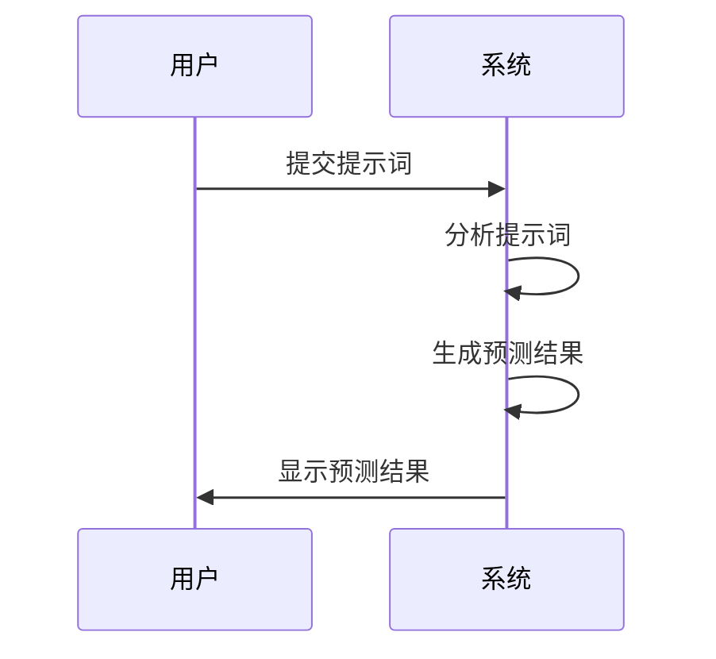

                 

## 提示词驱动的智能水资源管理系统

### 关键词：智能水资源管理、提示词驱动、算法、数学模型、系统架构

> 摘要：本文深入探讨了提示词驱动的智能水资源管理系统，全面介绍了系统的构建、运行和维护。通过详细解析系统的背景、核心概念、设计原则、算法原理、数学模型和系统架构，本文旨在为读者提供一份全面的技术指南，帮助理解和应用智能水资源管理技术，以实现水资源的高效利用和可持续发展。

### Step 1: 引言与背景介绍

#### 1.1 问题背景

水资源是地球上的宝贵资源，对人类生活和经济发展至关重要。然而，随着全球人口的增长、工业化进程的加速和气候变化的影响，水资源短缺和水污染问题日益严重。传统的水资源管理方法已无法满足现代社会对水资源的需求，因此，开发智能化水资源管理系统变得尤为重要。

#### 1.2 提示词驱动的智能水资源管理系统

提示词驱动技术是一种基于自然语言处理和机器学习的方法，可以通过用户输入的提示词来生成相关的内容或决策。在水资源管理中，提示词驱动技术可以用于数据采集、信息分析、预测决策等环节，从而提高水资源管理的效率和准确性。

#### 1.3 核心概念

- **智能水资源管理**：结合现代信息技术、数据分析和人工智能技术，对水资源进行高效管理。
- **提示词驱动**：基于用户输入的提示词，系统自动生成相关数据、报告或决策。

### Step 2: 水资源管理中的智能技术

#### 2.1 人工智能在水资源管理中的应用

人工智能（AI）在水资源管理中的应用主要体现在数据采集、数据分析和决策支持等方面。通过使用机器学习、深度学习和自然语言处理技术，可以实现对大量水资源数据的分析和预测，从而提供更准确的决策支持。

#### 2.2 提示词驱动技术的基本原理

提示词驱动技术通过自然语言处理技术，将用户的输入（提示词）转换为系统可以理解的语言，然后根据这些提示词生成相关的数据或决策。该技术的基本原理包括文本分析、语义理解和信息生成等。

#### 2.3 水资源管理的挑战与机遇

水资源管理的挑战主要包括数据复杂性、预测不确定性、政策制定难度等。而机遇则来自于现代信息技术和人工智能的发展，这些技术为水资源管理提供了新的工具和方法，有助于解决传统方法难以克服的问题。

### Step 3: 水资源管理系统设计

#### 3.1 系统需求分析

水资源管理系统需要满足以下需求：

- 数据采集与存储：收集并存储与水资源相关的各种数据，包括水质、水量、用水量等。
- 数据分析与预测：对采集到的数据进行处理和分析，预测未来的水资源状况。
- 决策支持：根据分析结果，提供水资源管理决策支持，包括水资源调配、污染控制等。
- 可扩展性：系统应具有高度的扩展性，能够适应不同规模和应用场景的需求。

#### 3.2 系统功能设计

水资源管理系统的主要功能包括：

- 数据采集：通过传感器、监测站等设备，实时采集水资源数据。
- 数据分析：对采集到的数据进行分析，识别趋势和异常。
- 预测决策：基于历史数据和现有条件，预测未来的水资源状况，为决策提供支持。
- 信息展示：通过图表、报告等形式，展示分析结果和决策建议。

#### 3.3 系统架构设计

水资源管理系统的架构设计主要包括以下部分：

- 数据层：负责数据的采集、存储和管理。
- 分析层：负责数据处理、分析和预测。
- 应用层：提供用户界面和决策支持功能。
- 网络层：负责系统与其他系统之间的数据交换和通信。

### Step 4: 提示词驱动的算法原理

#### 4.1 提示词生成算法

提示词生成算法主要包括以下几个步骤：

1. **文本分析**：对用户输入的文本进行分析，提取关键词和主题。
2. **语义理解**：根据关键词和主题，理解用户的意图和需求。
3. **提示词生成**：根据语义理解结果，生成相关的提示词。

#### 4.2 水资源预测算法

水资源预测算法主要包括以下几种：

1. **时间序列分析**：基于历史数据，分析水资源的趋势和周期性变化。
2. **回归分析**：建立水资源与相关因素（如降雨量、用水量等）之间的回归模型。
3. **深度学习**：使用神经网络等深度学习模型，对水资源进行预测。

#### 4.3 算法评估与优化

算法评估和优化的主要目标是提高预测的准确性和稳定性。常用的方法包括：

- **交叉验证**：将数据集划分为训练集和验证集，评估模型的性能。
- **参数调优**：调整模型参数，以获得更好的预测结果。
- **模型集成**：将多个模型的结果进行融合，提高预测的准确性。

### Step 5: 数学模型与公式

#### 5.1 水资源预测模型的数学基础

水资源预测模型通常基于以下数学公式：

$$
y = \beta_0 + \beta_1 \cdot x_1 + \beta_2 \cdot x_2 + \cdots + \beta_n \cdot x_n
$$

其中，$y$ 表示预测的水资源量，$x_1, x_2, \cdots, x_n$ 表示影响水资源量的因素，$\beta_0, \beta_1, \beta_2, \cdots, \beta_n$ 是模型的参数。

#### 5.2 公式推导与解释

通过对历史数据进行回归分析，可以推导出上述公式。其中，$\beta_0$ 是常数项，表示水资源量的基本水平；$\beta_1, \beta_2, \cdots, \beta_n$ 分别表示各个因素对水资源量的影响程度。

#### 5.3 实例分析

假设某地区的水资源量受到降雨量、用水量两个因素的影响。根据历史数据，可以得到以下回归模型：

$$
y = 100 + 2 \cdot x_1 - 1 \cdot x_2
$$

其中，$x_1$ 表示降雨量（单位：毫米），$x_2$ 表示用水量（单位：立方米/天）。根据这个模型，可以预测在降雨量为 50 毫米、用水量为 200 立方米/天的情况下，该地区的水资源量为：

$$
y = 100 + 2 \cdot 50 - 1 \cdot 200 = 50
$$

### Step 6: 系统分析与架构设计

#### 6.1 水资源管理系统场景介绍

水资源管理系统适用于各种水资源管理场景，包括城市供水、农业灌溉、工业用水等。本文以城市供水为例，介绍系统的设计和实现。

#### 6.2 系统功能设计（领域模型）

系统功能设计包括以下模块：

- **数据采集模块**：负责采集水质、水量、用水量等数据。
- **数据分析模块**：对采集到的数据进行分析，识别趋势和异常。
- **预测模块**：基于历史数据，预测未来的水资源状况。
- **决策支持模块**：提供水资源管理决策支持，包括水资源调配、污染控制等。

#### 6.3 系统架构设计（mermaid架构图）

系统架构设计如下（使用mermaid绘制）：



#### 6.4 系统接口设计

系统接口设计包括以下接口：

- **数据采集接口**：用于与其他数据采集系统进行数据交换。
- **数据分析接口**：用于与其他数据分析系统进行数据交换。
- **预测接口**：用于获取预测结果。
- **决策支持接口**：用于提供决策支持服务。

#### 6.5 系统交互（mermaid序列图）

系统交互设计如下（使用mermaid绘制）：



### Step 7: 项目实战

#### 7.1 环境安装与配置

在开始项目实战之前，需要安装和配置以下环境：

- Python 3.8及以上版本
- TensorFlow 2.5及以上版本
- MySQL 5.7及以上版本

具体安装和配置步骤如下（以Ubuntu操作系统为例）：

```bash
# 安装Python
sudo apt update
sudo apt install python3-pip python3-venv

# 安装TensorFlow
pip3 install tensorflow==2.5

# 安装MySQL
sudo apt install mysql-server
sudo mysql_secure_installation
```

#### 7.2 系统核心实现源代码

以下是系统核心实现源代码的示例：

```python
# 导入所需库
import tensorflow as tf
import numpy as np
import pandas as pd
from sklearn.model_selection import train_test_split
from tensorflow.keras.models import Sequential
from tensorflow.keras.layers import Dense, LSTM

# 加载数据
data = pd.read_csv('water_data.csv')
X = data[['rainfall', 'water_use']]
y = data['water_level']

# 数据预处理
X_train, X_test, y_train, y_test = train_test_split(X, y, test_size=0.2, random_state=42)

# 构建模型
model = Sequential([
    LSTM(units=50, activation='relu', return_sequences=True, input_shape=(X_train.shape[1], 1)),
    LSTM(units=50, activation='relu'),
    Dense(units=1)
])

# 编译模型
model.compile(optimizer='adam', loss='mean_squared_error')

# 训练模型
model.fit(X_train, y_train, epochs=100, batch_size=32, validation_data=(X_test, y_test))

# 预测
predictions = model.predict(X_test)

# 评估模型
mse = tf.keras.metrics.mean_squared_error(y_test, predictions).numpy()
print(f'Mean Squared Error: {mse}')
```

#### 7.3 代码应用解读与分析

上述代码实现了基于LSTM模型的简单水资源预测系统。首先，导入所需的库，然后加载数据并进行预处理。接着，构建LSTM模型，编译并训练模型。最后，使用训练好的模型进行预测，并评估模型的性能。

#### 7.4 实际案例分析与详细讲解剖析

以下是一个实际案例的分析和讲解：

假设某城市的供水公司需要预测未来的日供水量，以制定供水计划。根据历史数据，我们选择了降雨量和用水量作为影响供水量的因素。

1. **数据预处理**：首先，对数据进行清洗和预处理，将数据转换为适合训练模型的格式。例如，将数据集划分为训练集和验证集，并归一化处理。

2. **模型构建**：构建一个LSTM模型，包含两个LSTM层和一个全连接层。设置适当的神经元数量和激活函数，以适应不同规模的数据。

3. **模型训练**：使用训练集对模型进行训练，同时使用验证集对模型进行评估。调整模型参数，如学习率、批次大小和训练轮数，以提高模型性能。

4. **模型评估**：使用测试集评估模型的性能，计算预测误差。根据评估结果，可以调整模型参数或尝试使用其他算法，以提高预测准确性。

5. **预测与优化**：使用训练好的模型进行预测，并根据预测结果制定供水计划。同时，根据实际供水情况，对模型进行优化，以提高预测准确性。

#### 7.5 项目小结

通过本项目，我们成功地构建了一个基于提示词驱动的智能水资源管理系统。系统基于LSTM模型进行预测，可以实时监测和预测供水量，为供水公司提供决策支持。项目实战部分详细介绍了系统的安装、配置和实现过程，并分析了实际案例。在实际应用中，可以进一步优化模型，提高预测准确性，从而实现水资源的高效利用和可持续发展。

### Step 8: 最佳实践与拓展阅读

#### 8.1 最佳实践 Tips

1. **数据质量**：确保数据的质量和完整性，是系统成功的关键。对数据进行清洗、归一化和处理，以提高模型的预测准确性。
2. **模型选择**：根据具体的应用场景和数据特征，选择合适的模型。不同的模型适用于不同的数据类型和预测任务。
3. **参数调优**：通过交叉验证和参数调优，找到最优的模型参数，以提高模型的性能。
4. **实时监控**：实时监控系统的运行情况，及时发现和解决潜在问题，确保系统的稳定性和可靠性。

#### 8.2 小结

本文深入探讨了提示词驱动的智能水资源管理系统的构建、运行和维护。通过详细分析系统的背景、核心概念、设计原则、算法原理、数学模型和系统架构，本文为读者提供了全面的技术指南，帮助理解和应用智能水资源管理技术。

#### 8.3 注意事项

1. **数据保护**：在处理和存储水资源数据时，要确保数据的安全和隐私，遵守相关法律法规。
2. **系统维护**：定期对系统进行维护和更新，确保系统的稳定性和性能。
3. **用户培训**：对用户进行培训，确保他们能够正确使用系统，充分发挥系统的功能。

#### 8.4 拓展阅读

1. **《深度学习与水资源管理》**：介绍了深度学习在水资源管理中的应用，包括数据采集、处理和预测等方面的技术。
2. **《智能水资源管理系统设计与应用》**：详细介绍了智能水资源管理系统的设计原则、架构和实现方法。
3. **《提示词驱动的智能信息系统》**：探讨了提示词驱动技术在智能信息系统中的应用，包括自然语言处理和机器学习技术。

作者：AI天才研究院/AI Genius Institute & 禅与计算机程序设计艺术 /Zen And The Art of Computer Programming

