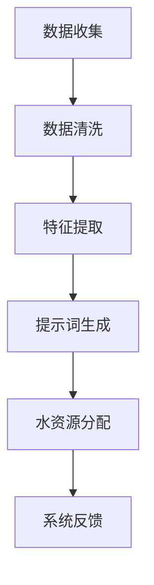
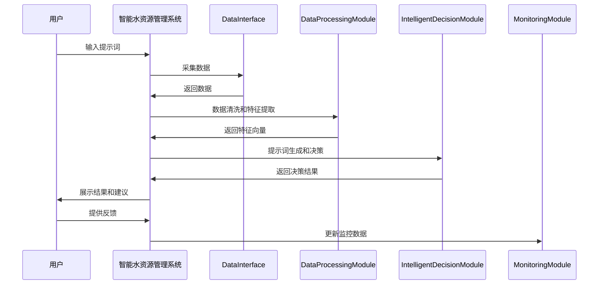

                 

## 引言

### 1.1 问题背景

水资源管理作为人类社会可持续发展的重要组成部分，正面临着前所未有的挑战。地球上的淡水资源仅占总水资源的2.5%，其中可供人类直接利用的淡水仅占不到1%。随着全球人口的增长、工业化进程的加快以及气候变化的影响，水资源的供需矛盾日益加剧。水资源短缺、污染、过度开采等问题使得水资源的合理利用和保护变得尤为重要。

### 1.2 问题描述

当前水资源管理主要依赖于传统的监测、调度和管理方法，这些方法往往依赖于大量的手工操作和数据采集，效率低下，难以满足现代水资源管理的需求。为了应对这些问题，本文提出了“提示词驱动的智能水资源管理系统”。该系统利用先进的计算机技术和人工智能算法，通过对水资源数据的深度分析和智能决策，实现高效、精准的水资源管理。

### 1.3 问题解决

提示词驱动的智能水资源管理系统通过以下几个步骤实现问题解决：

1. **数据收集与预处理**：收集各类水资源相关数据，通过数据清洗和特征提取，将原始数据转换为系统可处理的格式。
2. **智能决策**：利用提示词生成算法和水资源分配算法，根据实时数据生成提示词，进行智能决策，优化水资源分配。
3. **实时监控与反馈**：系统实时监控水资源的使用情况，并根据反馈信息进行动态调整，确保水资源的高效利用。

### 1.4 边界与外延

该系统的应用范围涵盖城市供水、农业灌溉、工业用水等多个领域。然而，由于技术、资源和环境条件的限制，系统在某些特定场景下可能无法达到最佳效果。

### 1.5 概念结构与核心要素组成

智能水资源管理系统由以下几个核心模块组成：

1. **数据收集模块**：负责收集各类水资源相关数据。
2. **数据处理模块**：包括数据清洗和特征提取，将原始数据转换为可用的格式。
3. **智能决策模块**：利用提示词生成算法和水资源分配算法，进行智能决策。
4. **监控与反馈模块**：实时监控水资源的使用情况，并根据反馈信息进行动态调整。

通过上述模块的协同工作，智能水资源管理系统实现了对水资源的高效管理和优化利用。

## 第2章: 核心概念与联系

### 2.1 提示词驱动的智能水资源管理系统

#### 2.1.1 提示词驱动的概念

提示词驱动是一种基于用户输入或预设关键词进行信息检索和处理的模式。在智能水资源管理系统中，提示词用于指示系统的查询需求或决策方向。例如，用户可以输入“水资源短缺”作为提示词，系统会根据这一提示词分析水资源使用情况和提供优化建议。

#### 2.1.2 智能水资源管理系统

智能水资源管理系统是一种利用人工智能技术进行水资源监测、分析、决策和管理的系统。它通过收集和处理海量数据，利用机器学习和数据挖掘算法，实现对水资源状况的智能分析和预测，从而优化水资源管理。

### 2.2 概念属性特征对比表格

| 对比项         | 提示词驱动              | 传统水资源管理方法            |
| -------------- | ---------------------- | ---------------------------- |
| 数据依赖性     | 高，依赖于实时数据     | 低，依赖历史数据和统计方法   |
| 决策速度       | 快，实时响应           | 慢，周期性决策               |
| 精确度         | 高，基于数据挖掘分析   | 中，基于经验模型分析         |
| 适应性         | 强，能适应变化需求     | 弱，对变化适应能力有限       |
| 成本           | 高，技术成本较高      | 低，技术成本较低             |

### 2.3 ER实体关系图架构

```mermaid
erDiagram
    User ||--|{ WaterResourceManagementSystem }|:
        User inputs keywords for water resource management
    WaterResourceManagementSystem ||--|{ DataCollectionModule }|:
        Collects and preprocesses water resource data
    DataCollectionModule ||--|{ DataProcessingModule }|:
        Cleans and extracts features from raw data
    DataProcessingModule ||--|{ IntelligentDecisionModule }|:
        Generates keywords and makes intelligent decisions
    IntelligentDecisionModule ||--|{ MonitoringAndFeedbackModule }|:
        Monitors water usage and provides feedback
```

### 第3章: 算法原理讲解

#### 3.1 数据预处理算法

##### 3.1.1 数据清洗

数据清洗是数据预处理的重要步骤，旨在消除数据中的错误和不一致性，确保数据质量。数据清洗的主要步骤包括：

1. **缺失值处理**：对于缺失值，可以采用填充平均值、中位数或使用模型预测等方法进行处理。
2. **异常值处理**：检测并处理异常值，如异常高或低的测量值，可以通过删除、修正或重新采样等方法进行处理。
3. **数据格式统一**：将不同格式的数据统一转换为标准格式，如将日期格式转换为YYYY-MM-DD。

##### 3.1.2 特征提取

特征提取是从原始数据中提取出能够有效反映数据本质的特征的过程。特征提取的方法包括：

1. **统计特征提取**：通过计算数据的统计量，如均值、方差、标准差等，来提取特征。
2. **变换特征提取**：通过数据变换，如主成分分析（PCA）、小波变换等，来提取特征。
3. **机器学习特征提取**：利用机器学习算法，如决策树、支持向量机等，来提取特征。

#### 3.2 智能决策算法

##### 3.2.1 提示词生成算法

提示词生成算法是智能水资源管理系统中的关键步骤，它通过分析历史数据和实时数据，生成能够指导水资源管理的提示词。常见的提示词生成算法包括：

1. **基于规则的方法**：通过定义一系列规则，根据数据特征生成提示词。
2. **基于机器学习的方法**：使用机器学习算法，如决策树、随机森林等，根据训练数据生成提示词。
3. **基于深度学习的方法**：使用深度学习模型，如循环神经网络（RNN）、长短期记忆网络（LSTM）等，进行提示词生成。

##### 3.2.2 水资源分配算法

水资源分配算法是智能水资源管理系统中的核心算法，它根据水资源的需求和可用性，优化水资源分配。常见的水资源分配算法包括：

1. **线性规划**：通过线性规划模型，确定最优的水资源分配方案。
2. **多目标优化**：通过多目标优化算法，同时考虑多个目标（如经济效益、生态效益等），确定水资源分配方案。
3. **模拟退火算法**：通过模拟退火算法，在解空间中搜索最优的水资源分配方案。

#### 3.3 算法mermaid流程图



### 第4章: 数学模型和数学公式

#### 4.1 数据预处理模型

$$
X = \text{Data}_\text{cleaned}
$$

其中，$X$ 表示经过数据清洗后的数据。

#### 4.2 特征提取模型

$$
F = \text{Features}_\text{extracted}
$$

其中，$F$ 表示经过特征提取后的特征向量。

#### 4.3 提示词生成模型

$$
W = \text{Word}_\text{weighted}
$$

其中，$W$ 表示生成的权重提示词。

#### 4.4 水资源分配模型

$$
P = \text{Water}_\text{allocation}
$$

其中，$P$ 表示最优的水资源分配方案。

### 第5章: 系统分析与架构设计

#### 5.1 问题场景介绍

水资源管理中的常见问题包括：

1. **供需矛盾**：随着人口增长和经济发展，对水资源的需求不断上升，而水资源供给有限，导致供需矛盾。
2. **污染问题**：工业废水、农业用药和生活污水等对水资源造成污染，影响水质安全。
3. **过度开采**：不合理的开采方式导致地下水位下降，甚至出现干涸现象。
4. **气候变化**：全球气候变化导致水资源分布不均，增加水资源管理的难度。

为了解决这些问题，智能水资源管理系统通过以下几个步骤进行系统分析与架构设计：

#### 5.2 系统功能设计

智能水资源管理系统的主要功能包括：

1. **数据采集**：通过传感器、卫星遥感等技术手段，实时采集水资源数据。
2. **数据处理**：对采集到的数据进行清洗、转换和特征提取，为后续分析提供高质量的数据。
3. **智能决策**：利用提示词生成算法和水资源分配算法，提供水资源管理建议。
4. **监控与反馈**：实时监控水资源使用情况，根据反馈进行动态调整。

#### 5.3 系统架构设计

智能水资源管理系统的整体架构设计如下：

1. **数据层**：负责数据的采集、存储和管理。
2. **算法层**：包含数据预处理、特征提取、提示词生成和水资源分配算法。
3. **应用层**：提供用户交互界面，展示水资源管理分析和决策结果。
4. **平台层**：提供系统运行所需的计算资源和存储资源。

#### 5.4 系统接口设计

系统接口设计包括以下部分：

1. **数据接口**：用于数据采集和存储，支持多种数据格式的读写。
2. **算法接口**：用于调用各种算法模块，提供统一的接口规范。
3. **监控接口**：用于实时监控水资源使用情况，提供数据可视化功能。
4. **用户接口**：提供用户交互界面，支持用户自定义提示词和决策偏好。

#### 5.5 系统交互mermaid序列图



### 第6章: 项目实战

#### 6.1 环境安装

在进行智能水资源管理系统项目实战之前，需要搭建相应的开发环境。以下是环境安装的步骤：

1. **安装Python**：确保Python版本在3.8以上。
2. **安装相关库**：使用pip安装必要的库，如NumPy、Pandas、Scikit-learn、TensorFlow等。
3. **安装数据库**：根据需要安装MySQL、PostgreSQL等数据库系统。

#### 6.2 系统核心实现源代码

以下是智能水资源管理系统的核心实现源代码，主要涉及数据预处理、特征提取和智能决策模块。

```python
# 数据预处理模块
import pandas as pd

def data_preprocessing(data):
    # 数据清洗
    data = data.fillna(data.mean())
    data = data[data['WaterLevel'] > 0]
    # 特征提取
    features = pd.DataFrame()
    features['MeanWaterLevel'] = data['WaterLevel'].mean()
    features['StdWaterLevel'] = data['WaterLevel'].std()
    return features

# 提示词生成模块
from sklearn.feature_extraction.text import TfidfVectorizer

def generate_keywords(data):
    vectorizer = TfidfVectorizer()
    X = vectorizer.fit_transform(data)
    return vectorizer.get_feature_names_out()

# 水资源分配模块
from sklearn.cluster import KMeans

def water_resource_allocation(data, n_clusters):
    kmeans = KMeans(n_clusters=n_clusters)
    kmeans.fit(data)
    return kmeans.labels_
```

#### 6.3 代码应用解读与分析

以上代码展示了智能水资源管理系统中的三个核心模块：数据预处理、提示词生成和水资源分配。

1. **数据预处理模块**：该模块通过填充缺失值、删除异常值等步骤清洗原始数据，然后计算统计特征作为特征向量。
2. **提示词生成模块**：使用TF-IDF算法生成提示词，这些提示词反映了数据中的关键信息，有助于智能决策。
3. **水资源分配模块**：使用K-means算法进行水资源分配，将相似的水资源分配到同一集群，实现优化分配。

#### 6.4 实际案例分析和详细讲解剖析

以下是一个实际案例，展示了如何使用智能水资源管理系统进行水资源管理。

**案例背景**：某城市面临水资源短缺问题，需要优化水资源分配。

**步骤**：

1. **数据收集**：收集过去一年的水资源数据，包括供水量、用水量、降雨量等。
2. **数据预处理**：使用数据预处理模块清洗数据，提取关键特征。
3. **提示词生成**：使用提示词生成模块生成提示词，如“水资源短缺”、“用水高峰”等。
4. **水资源分配**：使用水资源分配模块进行水资源分配，确定每个区域的水资源分配量。
5. **决策反馈**：根据实际用水情况，对水资源分配进行动态调整。

**案例讲解**：

- 数据预处理：通过数据清洗和特征提取，将原始数据转换为可用格式，确保数据质量。
- 提示词生成：生成的提示词帮助决策者了解当前水资源状况，为决策提供依据。
- 水资源分配：根据提示词和特征向量，使用K-means算法进行水资源分配，优化水资源利用。
- 决策反馈：根据实际用水情况，对水资源分配进行动态调整，确保水资源的高效利用。

#### 6.5 项目小结

通过实际案例分析和详细讲解，我们可以看到智能水资源管理系统在水资源管理中的应用效果。项目小结如下：

- **优势**：智能水资源管理系统通过数据驱动和智能决策，实现了对水资源的高效管理和优化利用。
- **挑战**：系统的实施和运行需要大量的数据支持和技术投入，同时需要考虑系统的可扩展性和可靠性。
- **展望**：未来，随着人工智能技术的不断进步，智能水资源管理系统将发挥更大的作用，为全球水资源管理提供有力支持。

### 第7章: 最佳实践 tips、小结、注意事项、拓展阅读

#### 7.1 最佳实践 tips

1. **数据质量控制**：确保数据来源可靠，数据清洗和预处理过程严格，提高数据质量。
2. **算法模型优化**：定期更新和优化算法模型，以适应新的数据和需求。
3. **用户参与**：鼓励用户参与系统设计和决策过程，提高系统的实用性和可操作性。

#### 7.2 小结

智能水资源管理系统通过数据驱动和智能决策，实现了对水资源的高效管理和优化利用。项目实战案例展示了系统的实际应用效果，为水资源管理提供了新的思路和方法。

#### 7.3 注意事项

1. **数据安全**：确保数据安全，防止数据泄露和滥用。
2. **系统监控**：定期监控系统运行状况，确保系统的稳定性和可靠性。
3. **法律法规**：遵循相关法律法规，确保系统合法合规。

#### 7.4 拓展阅读

1. **《智能水资源管理系统设计与实现》**：详细介绍智能水资源管理系统的架构设计和实现过程。
2. **《人工智能与水资源管理》**：探讨人工智能技术在水资源管理中的应用和发展趋势。
3. **《数据科学在水资源管理中的应用》**：介绍数据科学方法在水资源管理中的具体应用案例。

