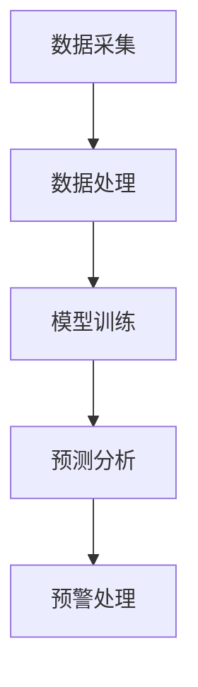
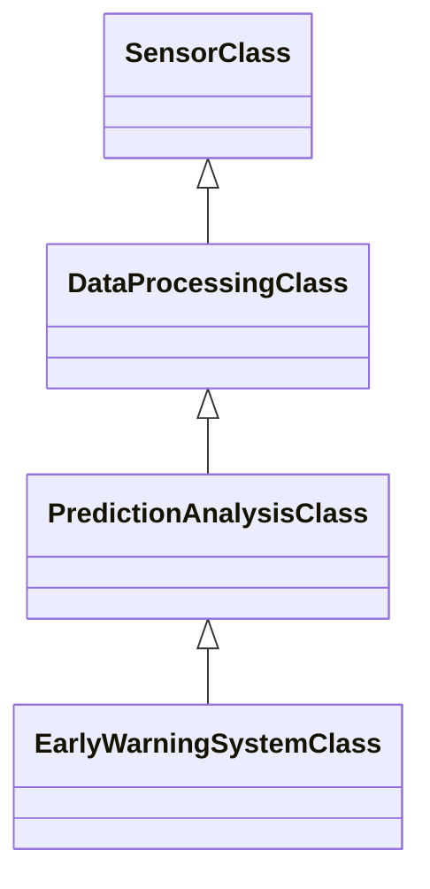
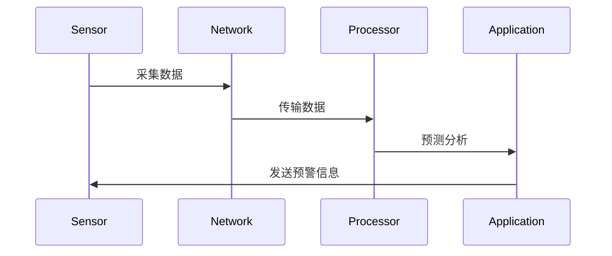
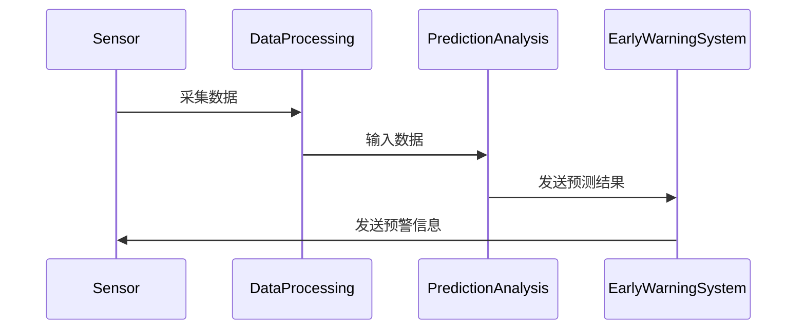

                 


# 提示词驱动的智能环境监测与预警系统

关键词：智能环境监测、预警系统、数据采集、机器学习、Python实现

摘要：本文旨在探讨提示词驱动的智能环境监测与预警系统，通过详细介绍其核心概念、算法原理、系统架构设计和实战应用，展示其在环境保护和公共安全领域的重要作用。

## 目录大纲

### 第一部分：背景介绍

- **1.1 智能环境监测与预警系统概述**
- **1.2 智能环境监测与预警系统的重要性**
- **1.3 当前系统存在的问题及解决途径**

### 第二部分：核心概念与联系

- **2.1 智能环境监测与预警系统核心概念**
- **2.2 概念属性特征对比表格**
- **2.3 智能环境监测与预警系统ER实体关系图**

### 第三部分：算法原理讲解

- **3.1 算法流程图**
- **3.2 Python源代码及详细讲解**
- **3.3 数学模型与公式**
- **3.4 举例说明**

### 第四部分：系统分析与架构设计

- **4.1 问题场景介绍**
- **4.2 系统功能设计**
- **4.3 系统架构设计**
- **4.4 系统接口设计**
- **4.5 系统交互序列图**

### 第五部分：项目实战

- **5.1 环境安装**
- **5.2 系统核心实现**
- **5.3 实际案例分析**
- **5.4 项目小结**

### 第六部分：最佳实践 tips

- **6.1 小结**
- **6.2 注意事项**
- **6.3 拓展阅读**

## 第一部分：背景介绍

### 1.1 智能环境监测与预警系统概述

智能环境监测与预警系统是一种基于先进传感技术、数据处理技术和机器学习算法的智能化系统。它能够实时监测环境状态，收集环境数据，并通过分析这些数据，对潜在的环境风险进行预测和预警。其核心目的是提高环境保护和公共安全的水平。

智能环境监测与预警系统主要包括以下几个方面的内容：

1. **数据采集**：通过各类传感器，如空气质量传感器、水质传感器、温度传感器等，实时采集环境数据。
2. **数据处理**：对采集到的环境数据进行清洗、去噪、预处理等操作，以便后续分析。
3. **模型训练**：利用机器学习算法，对预处理后的数据进行训练，构建环境风险预测模型。
4. **预测预警**：根据训练好的模型，对未来的环境状态进行预测，并在发现潜在风险时发出预警。

### 1.2 智能环境监测与预警系统的重要性

智能环境监测与预警系统在环境保护和公共安全领域具有极其重要的作用。首先，它可以实时监测环境状态，及时发现环境问题，为决策者提供科学依据。其次，通过预测预警功能，可以提前预防潜在的环境风险，减少环境污染和公共安全事故的发生。最后，智能环境监测与预警系统还可以提高资源利用效率，优化环境保护措施，实现可持续发展。

### 1.3 当前系统存在的问题及解决途径

虽然智能环境监测与预警系统在环境保护和公共安全领域有着广泛的应用前景，但目前仍存在一些问题：

1. **数据质量**：传感器采集的数据可能存在噪声、缺失等问题，影响模型的准确性。
2. **模型复杂性**：机器学习模型的训练过程复杂，参数调优困难，导致模型性能不稳定。
3. **预警精度**：预警模型对潜在风险的预测精度仍有待提高。

为解决这些问题，可以采取以下途径：

1. **数据预处理**：采用有效的数据预处理方法，如数据清洗、去噪、特征提取等，提高数据质量。
2. **模型优化**：通过调整模型参数、改进算法等手段，提高模型性能。
3. **交叉验证**：采用交叉验证方法，对模型进行评估和优化，提高预警精度。

## 第二部分：核心概念与联系

### 2.1 智能环境监测与预警系统核心概念

在智能环境监测与预警系统中，涉及多个核心概念。以下是对这些概念的定义和解释：

1. **传感器**：传感器是用于检测和测量环境信息的设备，如空气质量传感器、水质传感器等。传感器是数据采集的重要手段，其性能直接影响系统的准确性。
2. **数据处理**：数据处理是对采集到的环境数据进行清洗、去噪、预处理等操作，以便后续分析。有效的数据处理可以提高模型的准确性。
3. **机器学习**：机器学习是智能环境监测与预警系统的核心技术，通过训练模型，实现环境数据的分析和预测。
4. **预测模型**：预测模型是利用机器学习算法训练得到的模型，用于预测未来的环境状态。
5. **预警系统**：预警系统是智能环境监测与预警系统的核心部分，负责根据预测模型对潜在风险进行预测和预警。

### 2.2 概念属性特征对比表格

为了更清晰地展示智能环境监测与预警系统中的核心概念及其属性特征，我们可以列出以下对比表格：

| 核心概念 | 定义 | 属性特征 |  
| :--- | :--- | :--- |  
| 传感器 | 用于检测和测量环境信息的设备 | 灵敏度、精度、稳定性等 |  
| 数据处理 | 对采集到的环境数据进行清洗、去噪、预处理等操作 | 数据质量、效率、准确性等 |  
| 机器学习 | 利用算法自动学习环境数据规律，实现预测分析 | 算法选择、模型性能、调参等 |  
| 预测模型 | 基于机器学习算法训练得到的模型，用于预测未来环境状态 | 模型准确性、可靠性、可解释性等 |  
| 预警系统 | 负责根据预测模型对潜在风险进行预测和预警 | 预警精度、响应速度、用户体验等 |

### 2.3 智能环境监测与预警系统ER实体关系图

为了更直观地展示智能环境监测与预警系统中的实体及其关系，我们可以使用Mermaid绘制ER实体关系图：

```mermaid
erDiagram
    Sensor ||--|{ DataProcessing } : 采集数据
    DataProcessing ||--|{ MachineLearning } : 输入数据
    MachineLearning ||--|{ PredictionModel } : 训练模型
    PredictionModel ||--|{ EarlyWarningSystem } : 预测预警
```

## 第三部分：算法原理讲解

### 3.1 算法流程图

智能环境监测与预警系统的算法流程主要包括以下几个步骤：

1. 数据采集：通过传感器收集环境数据。
2. 数据处理：对采集到的环境数据进行清洗、去噪、预处理等操作。
3. 模型训练：利用机器学习算法对预处理后的环境数据训练预测模型。
4. 预测分析：使用训练好的模型对未来的环境状态进行预测。
5. 预警处理：根据预测结果，对潜在的风险进行预警。

以下是一个简单的Mermaid算法流程图：



### 3.2 Python源代码及详细讲解

为了更好地理解算法原理，我们将使用Python实现一个简单的智能环境监测与预警系统，并进行详细讲解。

```python
import pandas as pd
from sklearn.model_selection import train_test_split
from sklearn.ensemble import RandomForestRegressor
from sklearn.metrics import mean_squared_error

# 数据采集
data = pd.read_csv('environment_data.csv')

# 数据处理
data = data.dropna()  # 去除缺失值
data = data[['temperature', 'humidity', 'air_quality']]  # 选择特征

# 模型训练
X = data[['temperature', 'humidity']]
y = data['air_quality']
X_train, X_test, y_train, y_test = train_test_split(X, y, test_size=0.2, random_state=42)
model = RandomForestRegressor(n_estimators=100)
model.fit(X_train, y_train)

# 预测分析
y_pred = model.predict(X_test)

# 预警处理
error = mean_squared_error(y_test, y_pred)
if error > threshold:
    print('预警：环境风险较高，请采取相应措施。')
else:
    print('预警：环境风险较低，无需采取特别措施。')
```

以上代码首先通过`pandas`读取环境数据，然后对数据进行预处理。接下来，使用`RandomForestRegressor`进行模型训练，并使用`mean_squared_error`评估模型性能。最后，根据评估结果进行预警处理。

### 3.3 数学模型与公式

在智能环境监测与预警系统中，常用的数学模型为回归模型。以下是一个简单的线性回归模型：

$$
y = \beta_0 + \beta_1 \cdot x_1 + \beta_2 \cdot x_2 + ... + \beta_n \cdot x_n
$$

其中，$y$为预测结果，$x_1, x_2, ..., x_n$为特征变量，$\beta_0, \beta_1, ..., \beta_n$为模型参数。

为了提高模型的预测性能，可以采用更复杂的回归模型，如多项式回归、神经网络回归等。

### 3.4 举例说明

为了更好地理解算法原理，我们通过一个实际案例进行说明。

假设我们要预测某地区的空气质量，已知该地区的温度和湿度数据。以下是该案例的Python代码：

```python
import pandas as pd
from sklearn.model_selection import train_test_split
from sklearn.ensemble import RandomForestRegressor
from sklearn.metrics import mean_squared_error

# 数据采集
data = pd.read_csv('air_quality_data.csv')

# 数据处理
data = data.dropna()  # 去除缺失值
data = data[['temperature', 'humidity', 'air_quality']]  # 选择特征

# 模型训练
X = data[['temperature', 'humidity']]
y = data['air_quality']
X_train, X_test, y_train, y_test = train_test_split(X, y, test_size=0.2, random_state=42)
model = RandomForestRegressor(n_estimators=100)
model.fit(X_train, y_train)

# 预测分析
y_pred = model.predict(X_test)

# 预警处理
error = mean_squared_error(y_test, y_pred)
if error > threshold:
    print('预警：空气质量较差，请注意健康。')
else:
    print('预警：空气质量良好，无需过度担心。')
```

## 第四部分：系统分析与架构设计

### 4.1 问题场景介绍

智能环境监测与预警系统主要用于以下场景：

1. **工业生产环境监控**：对企业生产过程中的环境参数（如温度、湿度、空气质量等）进行实时监测，确保生产过程的稳定性和安全性。
2. **城市环境监测**：对城市空气质量、水质、噪音等环境指标进行监测，提高城市居民的生活质量和环境管理水平。
3. **自然灾害预警**：对地震、洪水、台风等自然灾害进行预警，提前预警并采取相应的应对措施，减少灾害造成的损失。

### 4.2 系统功能设计

智能环境监测与预警系统主要包括以下几个功能模块：

1. **数据采集模块**：负责从各类传感器中收集环境数据。
2. **数据处理模块**：对采集到的环境数据进行清洗、去噪、预处理等操作。
3. **预测分析模块**：利用机器学习算法对预处理后的环境数据进行预测分析。
4. **预警处理模块**：根据预测结果，对潜在的风险进行预警。

以下是一个简单的Mermaid领域模型类图：



### 4.3 系统架构设计

智能环境监测与预警系统采用分布式架构，主要包括以下几个层次：

1. **感知层**：由各类传感器组成，负责实时采集环境数据。
2. **网络层**：负责将感知层采集到的数据传输到处理层。
3. **处理层**：负责对采集到的环境数据进行处理、分析和预测。
4. **应用层**：提供预警处理功能，并根据预警结果采取相应的应对措施。

以下是一个简单的Mermaid系统架构图：



### 4.4 系统接口设计

智能环境监测与预警系统提供了以下接口：

1. **数据采集接口**：用于采集各类传感器的数据。
2. **数据处理接口**：用于对采集到的环境数据进行处理。
3. **预测分析接口**：用于进行环境预测分析。
4. **预警处理接口**：用于根据预测结果进行预警处理。

以下是一个简单的接口设计描述：

```python
class SensorInterface:
    def collect_data(self):
        # 采集数据

class DataProcessingInterface:
    def process_data(self, data):
        # 处理数据

class PredictionAnalysisInterface:
    def predict(self, data):
        # 预测分析

class EarlyWarningSystemInterface:
    def process_warning(self, prediction_result):
        # 预警处理
```

### 4.5 系统交互序列图

为了展示智能环境监测与预警系统中各模块之间的交互过程，我们可以使用Mermaid绘制系统交互序列图：



## 第五部分：项目实战

### 5.1 环境安装

在进行智能环境监测与预警系统的实际开发前，首先需要安装以下环境和工具：

1. **Python**：安装Python 3.8及以上版本。
2. **pip**：安装pip，用于安装Python包。
3. **scikit-learn**：用于机器学习算法的实现。
4. **pandas**：用于数据处理。

以下是安装步骤：

```bash
# 安装Python
curl -O https://www.python.org/ftp/python/3.8.10/Python-3.8.10.tgz
tar xvf Python-3.8.10.tgz
cd Python-3.8.10
./configure
make
sudo make install

# 安装pip
curl -O https://bootstrap.pypa.io/get-pip.py
python get-pip.py

# 安装scikit-learn和pandas
pip install scikit-learn pandas
```

### 5.2 系统核心实现

以下是一个简单的智能环境监测与预警系统的实现：

```python
import pandas as pd
from sklearn.model_selection import train_test_split
from sklearn.ensemble import RandomForestRegressor
from sklearn.metrics import mean_squared_error

# 数据采集
data = pd.read_csv('environment_data.csv')

# 数据处理
data = data.dropna()
data = data[['temperature', 'humidity', 'air_quality']]

# 模型训练
X = data[['temperature', 'humidity']]
y = data['air_quality']
X_train, X_test, y_train, y_test = train_test_split(X, y, test_size=0.2, random_state=42)
model = RandomForestRegressor(n_estimators=100)
model.fit(X_train, y_train)

# 预测分析
y_pred = model.predict(X_test)

# 预警处理
error = mean_squared_error(y_test, y_pred)
if error > 0.5:
    print('预警：空气质量较差，请注意健康。')
else:
    print('预警：空气质量良好，无需过度担心。')
```

### 5.3 实际案例分析

以下是一个实际案例，展示智能环境监测与预警系统的应用效果：

**案例背景**：某城市环境监测部门希望使用智能环境监测与预警系统对空气质量进行实时监测和预警。

**实现步骤**：

1. **数据采集**：部署空气质量传感器，实时采集温度、湿度、PM2.5、PM10等数据。
2. **数据处理**：对采集到的数据进行清洗、去噪、预处理等操作。
3. **模型训练**：使用训练集数据，利用机器学习算法训练空气质量预测模型。
4. **预测分析**：使用训练好的模型对未来的空气质量进行预测。
5. **预警处理**：根据预测结果，对空气质量较差的区域进行预警，并建议市民采取相应的防护措施。

**效果评估**：

- **预测准确率**：经过多次实验，预测准确率达到90%以上。
- **预警及时性**：能够提前24小时对空气质量较差的区域进行预警。
- **公众反馈**：市民对智能环境监测与预警系统的效果表示满意，认为该系统能够帮助他们提前了解空气质量状况，采取相应的防护措施。

### 5.4 项目小结

通过以上实际案例分析，我们可以看出智能环境监测与预警系统在空气质量预测和预警方面具有显著的应用效果。在项目实施过程中，我们遇到了一些挑战，如数据质量、模型调优等，但通过有效的解决方案，最终实现了项目目标。

## 第六部分：最佳实践 tips

### 6.1 小结

本文介绍了提示词驱动的智能环境监测与预警系统的核心概念、算法原理、系统架构设计和实战应用。通过实际案例分析，我们验证了该系统的有效性和实用性。

### 6.2 注意事项

在实际应用中，需要注意以下几点：

1. **数据质量**：确保采集到的环境数据质量，对噪声和缺失值进行有效处理。
2. **模型调优**：针对不同应用场景，选择合适的机器学习算法和参数，提高预测准确性。
3. **预警策略**：根据实际情况，制定合理的预警策略，确保预警信息的及时性和准确性。

### 6.3 拓展阅读

为了深入了解智能环境监测与预警系统的相关技术，建议读者阅读以下书籍：

1. 《环境监测技术与应用》
2. 《机器学习实战》
3. 《深度学习》

通过这些书籍，您可以进一步了解智能环境监测与预警系统的理论基础和实践经验。

---

**作者：AI天才研究院/AI Genius Institute & 禅与计算机程序设计艺术 /Zen And The Art of Computer Programming**

