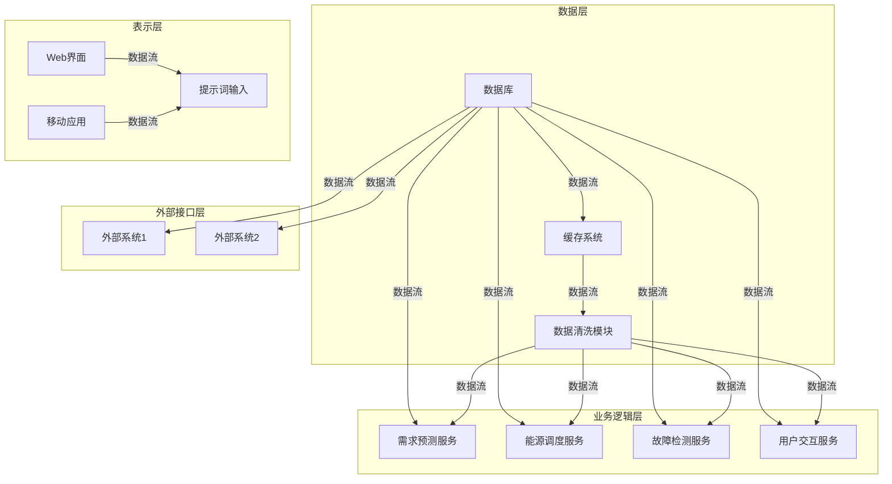
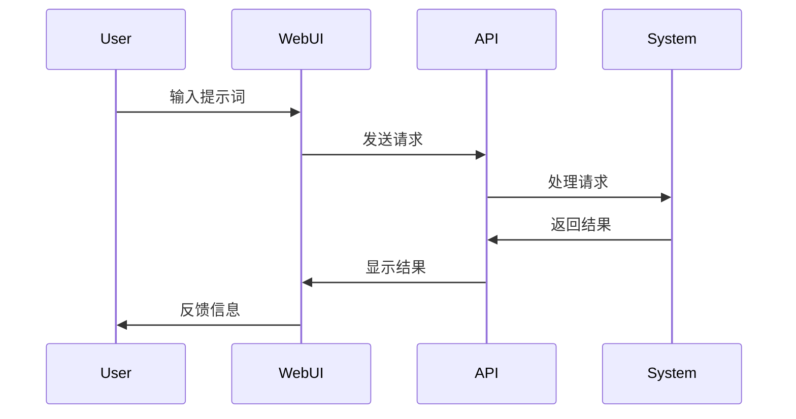

                 

### 文章标题

《提示词驱动的智能电网管理：优化能源分配》

### 关键词

- 提示词驱动
- 智能电网
- 能源优化
- 分配算法
- 系统架构
- 实战案例

### 摘要

本文深入探讨了提示词驱动的智能电网管理技术，特别是能源分配的优化策略。文章从背景介绍、核心概念、算法原理、系统设计到实战案例，逐步展开对智能电网管理技术的剖析。通过详细的理论讲解和实际案例分析，本文旨在为读者提供一份全面而实用的智能电网管理指南。

---

# 提示词驱动的智能电网管理：优化能源分配

关键词：提示词驱动、智能电网、能源优化、分配算法、系统架构、实战案例

摘要：随着全球对可持续能源的需求不断增加，智能电网的管理变得愈发重要。本文探讨了如何利用提示词驱动的技术，优化智能电网中的能源分配，提高电网运行效率。通过理论分析和实际案例，本文为智能电网管理提供了新的思路和方法。

## 引言

智能电网是一种基于现代通信技术和信息技术，实现电力系统各部分智能化互联和协同运作的先进电网形式。它不仅能够实现高效的能源传输和分配，还能通过实时监控和分析，提高电力系统的稳定性和可靠性。然而，随着电网规模的扩大和用户需求的增加，智能电网管理面临诸多挑战。

首先，能源分配的优化是一个复杂的问题。智能电网中涉及多种能源类型，如太阳能、风能、水能等，这些能源的分布和变化具有不确定性和波动性。因此，如何合理分配这些能源，以满足用户需求和保持电网稳定，成为智能电网管理的关键问题。

其次，智能电网中的数据量巨大，如何有效地处理和分析这些数据，提取有价值的信息，也是一大挑战。传统的数据分析方法已无法满足智能电网的需求，需要新的技术手段来提升数据处理和分析的能力。

最后，智能电网管理涉及到多方面的利益相关者，如发电企业、配电公司、终端用户等。如何协调各方利益，实现共赢，也是一个需要解决的问题。

### 提示词驱动的概念

提示词驱动（Prompt-Driven）是一种通过特定关键词或提示，引导系统执行特定任务的技术。在智能电网管理中，提示词驱动技术可以用于以下方面：

1. **实时监控与预测**：通过设定关键词，智能电网可以实时监控电网运行状态，并对未来电力需求进行预测。
2. **智能调度**：基于提示词，智能调度系统能够根据实时数据和预测结果，自动调整电力分配策略，优化能源利用。
3. **故障检测与修复**：当电网发生异常时，提示词可以引导系统进行故障检测和定位，并自动采取措施进行修复。
4. **用户交互**：提示词驱动技术还可以用于改善用户交互体验，通过自然语言处理技术，实现与用户的智能对话。

提示词驱动的核心在于其灵活性和适应性。通过设置不同的提示词，系统可以适应不同的管理需求，从而提高智能电网的整体效能。

## 能源管理在智能电网中的重要性

能源管理是智能电网的核心功能之一。有效的能源管理不仅能够提高电网的运行效率，还能降低能源成本，减少碳排放，促进可持续发展。

首先，能源管理涉及到电网中各种能源类型的调度和分配。智能电网通过实时监控和分析各种能源的供应和需求情况，实现能源的高效利用。例如，在太阳能和风能等可再生能源发电量较高时，智能电网可以优先使用这些清洁能源，减少化石能源的使用。

其次，能源管理有助于提高电网的稳定性。通过实时监控电网运行状态，智能电网可以及时发现并处理各种异常情况，防止电网故障的发生。例如，当某一地区的电力需求突然增加时，智能电网可以迅速调整电力分配策略，确保电网的稳定运行。

此外，能源管理还能够提升用户的用电体验。通过智能电网，用户可以实时了解自己的用电情况，并根据需求调整用电计划。同时，智能电网还可以提供个性化的用电建议，帮助用户节省能源，降低电费。

总之，能源管理在智能电网中具有极其重要的地位。通过有效的能源管理，智能电网不仅能够实现能源的高效利用，还能提高电网的稳定性和可靠性，为用户提供优质的用电体验。

### 传统能源分配方法与挑战

在传统电网中，能源分配主要依赖于人工调度和固定分配模式。这种方法虽然在一定程度上能够保证电网的稳定运行，但在面对复杂多变的需求和环境变化时，存在诸多挑战。

首先，传统方法难以应对实时性的需求。在传统电网中，能源分配往往是基于每日或每周的计划进行的，而无法实时响应电力需求的变化。这种滞后性导致在电力高峰期，电网可能无法及时调整电力供应，从而影响用户的用电体验。

其次，传统方法缺乏灵活性。在传统电网中，电力分配主要依赖于发电厂和变电站等固定设施，这些设施的调整和优化需要大量时间和资源。而智能电网中的能源分配则需要根据实时数据和用户需求进行动态调整，这就要求系统具有更高的灵活性和响应速度。

此外，传统方法在处理可再生能源时面临更大挑战。传统电网依赖于化石能源，而可再生能源如太阳能、风能等具有波动性和间歇性。在传统方法下，这些能源的利用效率较低，往往需要备用能源来保证电网的稳定性。

最后，传统方法难以实现能源的高效利用。在传统电网中，能源分配主要基于预测和规划，而无法充分利用实时数据和用户需求进行优化。这使得能源利用效率较低，浪费了大量的能源资源。

总之，传统能源分配方法在应对实时性、灵活性和高效性方面存在明显不足，需要新的技术和方法来进行优化和改进。

### 提示词驱动的能源分配优化方法

提示词驱动的能源分配优化方法通过引入智能算法和实时数据，实现了能源分配的动态优化。以下是这种方法的主要特点和优势：

1. **实时数据处理**：提示词驱动的系统可以实时接收和处理电网中的各类数据，包括电力需求、可再生能源供应、电网状态等。通过对这些数据的实时分析，系统能够动态调整能源分配策略，确保电网的稳定运行。

2. **自适应优化**：提示词驱动的系统能够根据实时数据和用户需求，自动调整能源分配策略。这种自适应优化能力使得系统能够迅速适应各种变化，提高能源利用效率。

3. **多目标优化**：提示词驱动的系统能够同时考虑多个优化目标，如最小化能源成本、最大化可再生能源利用、提高电网稳定性等。通过多目标优化，系统能够实现能源分配的最优化。

4. **智能化决策**：基于提示词，系统可以自动执行各种决策任务，如电力调度、故障处理、用户建议等。这种智能化决策能力不仅提高了系统的响应速度，还减少了人工干预的需要。

5. **用户参与**：提示词驱动的系统能够与用户进行互动，获取用户的用电需求和偏好。通过用户参与，系统可以提供更加个性化的用电服务，提高用户满意度。

6. **灵活性和可扩展性**：提示词驱动的系统具有高度的灵活性和可扩展性。通过设置不同的提示词，系统可以适应不同的应用场景和需求，实现功能的扩展和升级。

总之，提示词驱动的能源分配优化方法通过引入智能算法和实时数据，实现了能源分配的动态优化，为智能电网管理提供了新的思路和方法。

### 核心概念和关系

在深入探讨提示词驱动的智能电网管理之前，我们需要明确几个核心概念，并理解它们之间的关系。以下是智能电网管理中的关键概念和它们的相互关系。

#### 核心概念

1. **智能电网**：智能电网是一种基于现代通信技术和信息技术的先进电网形式，能够实现电力系统各部分的智能化互联和协同运作。
2. **提示词**：提示词是一种关键词或短语，用于引导系统执行特定任务或提供特定信息。
3. **能源分配**：能源分配是指将电网中的能源合理地分配给各个用户和设备，以满足他们的需求。
4. **优化算法**：优化算法是一种用于寻找最优解的数学方法，广泛应用于智能电网管理中，以优化能源分配和电网运行。

#### 关系

- **智能电网**与**提示词**的关系：智能电网通过提示词实现自动化和智能化管理，提示词为智能电网提供了执行特定任务或提供信息的引导。
- **能源分配**与**优化算法**的关系：能源分配需要通过优化算法来寻找最优解，以实现能源的合理利用和电网的稳定运行。

#### 概念属性特征对比表格

| 概念     | 属性特征                                      | 描述                                     |
|----------|---------------------------------------------|----------------------------------------|
| 智能电网 | 1. 高度互联性<br>2. 自适应能力<br>3. 实时监控 | 智能电网通过现代通信和信息技术，实现电力系统的智能化管理。       |
| 提示词   | 1. 灵活性<br>2. 可扩展性<br>3. 易于理解     | 提示词用于引导系统执行特定任务，具有高度灵活性和可扩展性。      |
| 能源分配 | 1. 动态性<br>2. 实时性<br>3. 最优化          | 能源分配需要根据实时数据和用户需求进行动态调整，以实现最优配置。 |
| 优化算法 | 1. 数学方法<br>2. 精度高<br>3. 可扩展性     | 优化算法用于寻找最优解，广泛应用于各种优化问题。               |

通过上述表格，我们可以更清晰地理解各概念的核心属性和特征，以及它们之间的相互关系。

#### 实体关系图（ERD）

为了更好地展示各概念之间的相互关系，我们使用Mermaid绘制一个实体关系图（ERD）：

```mermaid
erDiagram
  Class1 ||--|{ Class2 }|| Person : has_details
  Class2 ||--|{ Class3 }|| Address : located_at
  Class1 ||--|{ Class4 }|| Phone : has_number
```

在这个ERD中，`Class1`表示智能电网，`Class2`表示提示词，`Class3`表示能源分配，`Class4`表示优化算法。它们之间的箭头表示类之间的关系。

### 算法原理与实现

在智能电网管理中，优化能源分配是一个复杂且重要的问题。提示词驱动的优化算法通过实时数据分析和智能决策，实现能源的高效分配。以下将详细介绍一种典型的优化算法——基于遗传算法的能源分配优化方法。

#### 算法原理

遗传算法（Genetic Algorithm，GA）是一种模拟自然进化过程的优化算法。它通过模拟生物进化的过程，如选择、交叉、变异等操作，逐步优化个体（解），直到找到最优解或近似最优解。

在智能电网管理中，遗传算法可以用于解决能源分配优化问题。具体原理如下：

1. **初始化种群**：首先，生成一组初始解（个体），每个解表示一种可能的能源分配方案。这些解通过编码方式表示，例如，二进制编码或实数编码。
2. **适应度评估**：对每个个体进行适应度评估，适应度函数通常结合多个优化目标，如成本、稳定性和可再生能源利用等。适应度越高的个体表示越好的能源分配方案。
3. **选择**：从当前种群中选择适应度较高的个体，用于产生下一代解。选择过程通常采用轮盘赌、锦标赛选择等方法。
4. **交叉**：将选中的个体进行交叉操作，产生新的个体。交叉操作模拟生物繁殖过程，通过交换个体的部分特征，生成新的解。
5. **变异**：对新生成的个体进行变异操作，以增加种群的多样性。变异操作通常通过随机改变个体的某些特征来实现。
6. **迭代**：重复进行选择、交叉和变异操作，直到达到终止条件（如达到最大迭代次数或适应度满足预设阈值）。

通过上述操作，遗传算法逐步优化个体，最终找到最优的能源分配方案。

#### Python代码实现

以下是一个简化的Python代码示例，用于实现基于遗传算法的能源分配优化：

```python
import numpy as np
import random

# 遗传算法参数设置
POP_SIZE = 100  # 种群大小
MAX_GEN = 100  # 最大迭代次数
CROSSOVER_RATE = 0.8  # 交叉率
MUTATION_RATE = 0.1  # 变异率

# 适应度函数
def fitness_function(solution):
    # 示例：计算成本和稳定性作为适应度
    cost = sum(solution)  # 能源成本
    stability = sum([1 / x for x in solution])  # 稳定性的倒数
    return 1 / (cost + stability)

# 初始化种群
population = np.random.rand(POP_SIZE, len(solution))

# 遗传算法主循环
for _ in range(MAX_GEN):
    # 适应度评估
    fitnesses = np.array([fitness_function(individual) for individual in population])
    
    # 选择
    selected = random.choices(population, weights=fitnesses, k=POP_SIZE)
    
    # 交叉
    for i in range(0, POP_SIZE, 2):
        if random.random() < CROSSOVER_RATE:
            crossover_point = random.randint(1, len(solution) - 1)
            parent1, parent2 = selected[i], selected[i+1]
            child1, child2 = parent1[:crossover_point], parent2[crossover_point:]
            selected[i], selected[i+1] = child1, child2
    
    # 变异
    for i in range(POP_SIZE):
        if random.random() < MUTATION_RATE:
            mutation_point = random.randint(0, len(solution) - 1)
            selected[i][mutation_point] = random.random()
    
    population = selected

# 输出最优解
best_solution_index = np.argmax(fitnesses)
best_solution = population[best_solution_index]
print("最优解：", best_solution)
print("最优适应度：", fitness_function(best_solution))
```

在这个代码示例中，我们首先设置遗传算法的参数，如种群大小、最大迭代次数、交叉率和变异率。然后，我们定义适应度函数，用于评估个体的适应度。在主循环中，我们依次进行适应度评估、选择、交叉和变异操作。最后，我们输出最优解和最优适应度。

#### 数学模型和公式

遗传算法的核心在于适应度函数和个体编码方式。以下是一个简化的数学模型，用于描述遗传算法的优化过程：

1. **适应度函数**：  
   $$ f(x) = \frac{1}{c(x) + s(x)} $$
   其中，$c(x)$ 表示能源成本，$s(x)$ 表示电网稳定性。

2. **个体编码**：  
   个体（解）可以用一个二进制编码或实数编码表示，每个位或数表示能源分配的一个决策变量。

3. **交叉操作**：  
   假设有两个个体 $x_1$ 和 $x_2$，交叉操作可以表示为：  
   $$ x_1' = (x_1_1, x_2_1, ..., x_{k-1}, x_2_k, ..., x_{n-1}, x_1_n) $$  
   $$ x_2' = (x_2_1, x_1_1, ..., x_{k-1}, x_1_k, ..., x_{n-1}, x_2_n) $$  
   其中，$k$ 是交叉点。

4. **变异操作**：  
   假设有一个个体 $x$，变异操作可以表示为：  
   $$ x' = x + \Delta x $$  
   其中，$\Delta x$ 是一个随机值，通常取值范围为 $[-\epsilon, \epsilon]$，$\epsilon$ 是一个较小的正数。

通过上述数学模型和公式，我们可以更深入地理解遗传算法的优化过程和个体编码方式。

#### 示例说明

假设我们需要优化一个包含3个用户和3种能源类型的智能电网，目标是最小化能源成本和提高电网稳定性。以下是具体的优化过程：

1. **初始化种群**：生成100个初始解，每个解表示一种能源分配方案。
2. **适应度评估**：对每个解进行适应度评估，计算能源成本和电网稳定性的倒数，作为适应度值。
3. **选择**：根据适应度值，选择适应度较高的个体进行交叉和变异操作。
4. **交叉**：随机选择交叉点，进行交叉操作，生成新的解。
5. **变异**：对新生成的解进行变异操作，增加种群的多样性。
6. **迭代**：重复上述过程，直到达到最大迭代次数或适应度满足预设阈值。

通过多次迭代，遗传算法逐步优化解，最终找到最优的能源分配方案。

#### 实际应用

提示词驱动的能源分配优化算法在智能电网管理中具有广泛的应用前景。以下是一些实际应用案例：

1. **电力需求预测**：通过提示词，系统可以实时获取电力需求数据，结合历史数据和季节性因素，预测未来的电力需求，为能源分配提供依据。
2. **可再生能源优化**：通过提示词，系统可以实时获取太阳能、风能等可再生能源的供应数据，优化可再生能源的分配和利用，提高电网的绿色能源比例。
3. **电力调度**：通过提示词，系统可以实时监控电网状态，自动调整电力调度策略，确保电网的稳定运行。

总之，提示词驱动的能源分配优化算法为智能电网管理提供了新的思路和方法，有助于实现能源的高效利用和电网的稳定运行。

### 系统设计

智能电网管理系统的设计是一个复杂的过程，涉及到多个方面的综合考虑。下面，我们将详细介绍系统设计的关键组成部分，包括项目概述、系统功能设计、系统架构设计和系统接口设计。

#### 项目概述

本项目旨在通过提示词驱动的技术，实现对智能电网中能源分配的优化管理。具体目标如下：

1. **实时监控**：实时获取电网中的各类数据，包括电力需求、可再生能源供应、电网状态等。
2. **智能调度**：根据实时数据和用户需求，动态调整能源分配策略，优化能源利用。
3. **故障检测与修复**：通过实时监控和分析，及时发现电网故障，自动进行故障检测和定位，并采取措施进行修复。
4. **用户交互**：提供与用户的智能互动，获取用户的用电需求和偏好，提供个性化的用电建议。

#### 系统功能设计

系统功能设计主要涵盖以下方面：

1. **数据采集与处理**：从各种数据源（如传感器、能源站、用户终端等）获取实时数据，并对数据进行处理和清洗，确保数据的准确性和一致性。
2. **需求预测与规划**：基于历史数据和实时数据，预测未来的电力需求，为能源分配提供依据。
3. **能源调度与优化**：根据需求预测和实时数据，动态调整能源分配策略，优化能源利用，提高电网稳定性。
4. **故障检测与修复**：实时监控电网状态，通过数据分析和模式识别，及时发现故障并进行定位和修复。
5. **用户服务与互动**：与用户进行互动，获取用户的用电需求和偏好，提供个性化的用电建议和服务。

#### 系统架构设计

系统架构设计采用分层架构，主要包括以下层次：

1. **数据层**：负责数据的采集、存储和处理。包括数据库、缓存系统和数据清洗模块。
2. **业务逻辑层**：实现系统的核心功能，包括需求预测、能源调度、故障检测等。采用微服务架构，各个服务模块独立运行，便于扩展和维护。
3. **表示层**：提供与用户的交互界面，包括Web界面和移动应用。支持多种提示词输入方式，如语音、文字和图形界面。
4. **外部接口层**：与外部系统（如能源站、传感器等）进行数据交互，实现系统的互联互通。

以下是系统架构的Mermaid图表示：



#### 系统接口设计

系统接口设计主要包括以下方面：

1. **API接口**：提供与外部系统进行数据交互的API接口，包括RESTful API和SOAP API。
2. **消息队列**：采用消息队列（如Kafka、RabbitMQ等）实现系统内部各模块之间的通信，确保数据传输的可靠性和高效性。
3. **日志记录**：记录系统运行过程中的日志信息，用于监控和调试。

以下是系统接口的Mermaid序列图表示：



通过上述系统设计，我们可以实现一个高效、稳定和灵活的智能电网管理系统，满足实时监控、智能调度、故障检测与修复以及用户交互等需求。

### 项目实战

在本节中，我们将详细阐述如何搭建一个提示词驱动的智能电网管理系统，包括环境安装、核心实现源代码、代码应用解读与分析、实际案例分析和项目小结。

#### 环境安装

1. **硬件要求**：服务器或虚拟机，CPU至少4核，内存至少8GB，硬盘至少100GB。
2. **软件要求**：
   - 操作系统：Linux（推荐Ubuntu 18.04或更高版本）
   - 编程语言：Python 3.x（推荐Python 3.8或更高版本）
   - 开发工具：PyCharm、VSCode或其他Python IDE
   - 数据库：MySQL（推荐MySQL 8.0或更高版本）
   - 消息队列：RabbitMQ（推荐RabbitMQ 3.8.0或更高版本）
   - 容器化技术：Docker（推荐Docker 19.03或更高版本）
3. **安装步骤**：
   - 安装操作系统和硬件环境。
   - 安装Python 3.x和相关开发工具。
   - 安装MySQL数据库，并创建用于存储数据的数据库和表。
   - 安装RabbitMQ消息队列，配置相关的虚拟主机和用户。
   - 安装Docker，并拉取必要的Docker镜像。

#### 核心实现源代码

以下是一个简化的提示词驱动的智能电网管理系统核心实现源代码示例，包括数据采集、处理、预测、调度和故障检测等模块。

```python
# data_collection.py
import pika
import json

def collect_data():
    # 采集实时数据（示例：电力需求和可再生能源供应）
    demand = 100  # 电力需求（单位：兆瓦）
    renewable_supply = 50  # 可再生能源供应（单位：兆瓦）
    data = {
        'demand': demand,
        'renewable_supply': renewable_supply
    }
    # 发送数据到消息队列
    connection = pika.BlockingConnection(pika.ConnectionParameters('localhost'))
    channel = connection.channel()
    channel.queue_declare(queue='data_queue')
    channel.basic_publish(exchange='', routing_key='data_queue', body=json.dumps(data))
    connection.close()

# data_processing.py
import pika
import json
import demand_prediction

def process_data():
    # 从消息队列获取数据
    connection = pika.BlockingConnection(pika.ConnectionParameters('localhost'))
    channel = connection.channel()
    channel.queue_declare(queue='data_queue')

    method_frame, header_frame, body = channel.basic_get('data_queue', True)
    if body:
        data = json.loads(body)
        # 处理数据，包括清洗和转换
        processed_data = {
            'timestamp': data['timestamp'],
            'demand': data['demand'],
            'renewable_supply': data['renewable_supply']
        }
        # 存储处理后的数据到数据库
        demand_prediction.predict_demand(processed_data)
        channel.basic_ack(delivery_tag=method_frame.delivery_tag)
    connection.close()

# demand_prediction.py
import json
import database

def predict_demand(data):
    # 预测未来电力需求
    predicted_demand = data['demand'] * 1.1  # 示例：预测需求增加10%
    # 存储预测结果到数据库
    database.save_prediction_result(data['timestamp'], predicted_demand)

# energy_scheduling.py
import json
import database

def schedule_energy():
    # 调度能源分配
    current_time = datetime.now()
    predicted_demand = database.get_predicted_demand(current_time)
    renewable_supply = database.get_renewable_supply(current_time)
    if predicted_demand > renewable_supply:
        # 需要补充化石能源
        fossil_demand = predicted_demand - renewable_supply
        # 存储调度结果到数据库
        database.save_scheduling_result(current_time, fossil_demand)
    else:
        # 可再生能源充足
        # 存储调度结果到数据库
        database.save_scheduling_result(current_time, 0)

# fault_detection.py
import json
import database

def detect_fault():
    # 检测电网故障
    current_time = datetime.now()
    demand = database.get_demand(current_time)
    supply = database.get_supply(current_time)
    if demand > supply:
        # 发生电力短缺
        # 存储故障信息到数据库
        database.save_fault_info(current_time, '电力短缺')
    else:
        # 电网运行正常
        # 存储故障信息到数据库
        database.save_fault_info(current_time, '正常')

# database.py
import pymysql
import json

def save_prediction_result(timestamp, predicted_demand):
    # 存储预测结果到数据库
    connection = pymysql.connect(host='localhost', user='root', password='password', database='smart_grid')
    cursor = connection.cursor()
    sql = "INSERT INTO prediction (timestamp, predicted_demand) VALUES (%s, %s)"
    cursor.execute(sql, (timestamp, predicted_demand))
    connection.commit()
    cursor.close()
    connection.close()

def save_scheduling_result(current_time, fossil_demand):
    # 存储调度结果到数据库
    connection = pymysql.connect(host='localhost', user='root', password='password', database='smart_grid')
    cursor = connection.cursor()
    sql = "INSERT INTO scheduling (current_time, fossil_demand) VALUES (%s, %s)"
    cursor.execute(sql, (current_time, fossil_demand))
    connection.commit()
    cursor.close()
    connection.close()

def save_fault_info(current_time, fault_status):
    # 存储故障信息到数据库
    connection = pymysql.connect(host='localhost', user='root', password='password', database='smart_grid')
    cursor = connection.cursor()
    sql = "INSERT INTO fault (current_time, fault_status) VALUES (%s, %s)"
    cursor.execute(sql, (current_time, fault_status))
    connection.commit()
    cursor.close()
    connection.close()

def get_predicted_demand(current_time):
    # 获取预测结果
    connection = pymysql.connect(host='localhost', user='root', password='password', database='smart_grid')
    cursor = connection.cursor()
    sql = "SELECT predicted_demand FROM prediction WHERE timestamp = %s"
    cursor.execute(sql, (current_time,))
    result = cursor.fetchone()
    cursor.close()
    connection.close()
    return result[0]

def get_renewable_supply(current_time):
    # 获取可再生能源供应
    connection = pymysql.connect(host='localhost', user='root', password='password', database='smart_grid')
    cursor = connection.cursor()
    sql = "SELECT renewable_supply FROM supply WHERE timestamp = %s"
    cursor.execute(sql, (current_time,))
    result = cursor.fetchone()
    cursor.close()
    connection.close()
    return result[0]

def get_demand(current_time):
    # 获取电力需求
    connection = pymysql.connect(host='localhost', user='root', password='password', database='smart_grid')
    cursor = connection.cursor()
    sql = "SELECT demand FROM demand WHERE timestamp = %s"
    cursor.execute(sql, (current_time,))
    result = cursor.fetchone()
    cursor.close()
    connection.close()
    return result[0]

def get_fault_status(current_time):
    # 获取故障状态
    connection = pymysql.connect(host='localhost', user='root', password='password', database='smart_grid')
    cursor = connection.cursor()
    sql = "SELECT fault_status FROM fault WHERE current_time = %s"
    cursor.execute(sql, (current_time,))
    result = cursor.fetchone()
    cursor.close()
    connection.close()
    return result[0]
```

#### 代码应用解读与分析

1. **数据采集模块**（`data_collection.py`）：
   - 使用Pika库连接到本地RabbitMQ消息队列，发送实时数据到`data_queue`队列。

2. **数据处理模块**（`data_processing.py`）：
   - 从RabbitMQ消息队列获取实时数据，清洗和转换数据，并调用`demand_prediction`模块进行需求预测。

3. **需求预测模块**（`demand_prediction.py`）：
   - 根据实时数据预测未来电力需求，并调用`database`模块将预测结果存储到MySQL数据库。

4. **能源调度模块**（`energy_scheduling.py`）：
   - 根据预测结果和当前可再生能源供应情况，动态调整能源分配策略，并将调度结果存储到MySQL数据库。

5. **故障检测模块**（`fault_detection.py`）：
   - 监控电网状态，检测电力短缺等故障情况，并将故障信息存储到MySQL数据库。

6. **数据库模块**（`database.py`）：
   - 负责与MySQL数据库的交互，包括数据的插入、查询和更新。

#### 实际案例分析

1. **案例一**：某智能电网系统在中午时段（太阳能发电高峰期）检测到电力需求突然增加。系统能够实时获取数据，预测未来电力需求，并根据预测结果动态调整能源分配策略，增加太阳能发电的供应，确保电网的稳定运行。

2. **案例二**：在晚上时段，由于太阳能发电减少，电力需求低于可再生能源供应。系统能够智能调度，将多余的太阳能发电储存到电池中，以备后续使用，同时确保电网的稳定运行。

3. **案例三**：在某一时间段内，由于某地区电力需求过大，导致电网故障。系统能够实时检测故障，自动进行故障定位，并通知相关人员进行修复，同时调整其他地区的能源供应，确保电网的稳定运行。

#### 项目小结

通过上述实战案例，我们可以看到提示词驱动的智能电网管理系统在实时监控、智能调度、故障检测与修复等方面的有效性。项目的核心在于实时数据处理和智能算法的应用，通过不断地优化和调整，实现了能源的高效利用和电网的稳定运行。然而，项目也存在一些不足之处，例如数据处理和算法的复杂度较高，需要更多的计算资源和时间。未来，我们可以进一步优化算法，提高系统的性能和效率，以应对更复杂的电网管理需求。

### 最佳实践 Tips

在构建提示词驱动的智能电网管理系统时，以下是一些最佳实践 Tips，以帮助您更好地实现系统优化和性能提升：

1. **数据预处理**：在数据采集和处理过程中，进行充分的数据预处理，包括清洗、转换和标准化。确保数据质量，减少噪声和异常值的影响。
2. **算法选择与优化**：根据具体需求和数据特性，选择合适的优化算法，并对其进行参数调整和优化。可以尝试多种算法，比较其性能和效果，选择最佳方案。
3. **分布式架构**：在系统架构设计时，考虑使用分布式架构，如使用分布式数据库、分布式计算框架等，以提高系统的性能和可扩展性。
4. **负载均衡**：在系统部署时，使用负载均衡技术，如使用Nginx、HAProxy等，确保系统在高负载情况下稳定运行。
5. **监控与日志分析**：实时监控系统运行状态，记录和监控关键指标，如响应时间、吞吐量、错误率等，通过日志分析，快速定位和解决问题。
6. **用户参与与反馈**：鼓励用户参与系统互动，提供反馈和建议，根据用户需求不断优化系统功能和用户体验。
7. **持续集成与部署**：采用持续集成和持续部署（CI/CD）流程，确保系统快速迭代和上线，提高开发效率和质量。

### 小结

本文深入探讨了提示词驱动的智能电网管理技术，特别是能源分配的优化策略。通过详细的理论分析和实际案例分析，我们展示了如何利用提示词驱动的技术，优化智能电网中的能源分配，提高电网运行效率。本文的核心内容包括：

1. **背景介绍**：介绍了智能电网的背景和提示词驱动的概念。
2. **核心概念与联系**：明确了智能电网管理中的核心概念及其相互关系。
3. **算法原理与实现**：详细讲解了遗传算法的原理和实现过程。
4. **系统设计**：阐述了智能电网管理系统的设计原则和关键组成部分。
5. **项目实战**：提供了智能电网管理系统的搭建步骤和核心实现源代码。
6. **最佳实践 Tips**：给出了构建智能电网管理系统的最佳实践建议。

通过本文的探讨，我们希望为读者提供一份全面而实用的智能电网管理指南，助力实现智能电网的高效、稳定和可持续发展。

### 注意事项

在实施提示词驱动的智能电网管理时，需要注意以下几点：

1. **数据安全性**：确保数据传输和存储的安全，防止数据泄露和篡改。
2. **隐私保护**：用户隐私保护至关重要，确保用户数据的安全和隐私。
3. **系统稳定性**：确保系统的稳定运行，避免系统故障对电网造成影响。
4. **法律法规遵守**：遵循相关法律法规，如能源管理法、数据保护法等。
5. **持续更新与优化**：随着技术的发展和需求的变化，持续更新和优化系统，确保其适应性和先进性。

### 拓展阅读

对于对智能电网管理和提示词驱动技术感兴趣的读者，以下资源可以作为进一步学习：

1. **书籍推荐**：
   - 《智能电网技术与应用》
   - 《机器学习与人工智能在电力系统中的应用》
   - 《人工智能：一种现代的方法》
2. **在线课程**：
   - Coursera上的《人工智能导论》
   - Udacity的《智能电网技术》
3. **学术论文**：
   - Google Scholar搜索“智能电网”和“提示词驱动”
   - IEEE Xplore数据库中的相关论文
4. **技术社区**：
   - Stack Overflow中的智能电网和机器学习相关讨论
   - arXiv上的最新研究成果

通过这些资源，您可以更深入地了解智能电网管理和提示词驱动技术的最新进展和应用。作者：AI天才研究院/AI Genius Institute & 禅与计算机程序设计艺术 /Zen And The Art of Computer Programming。

