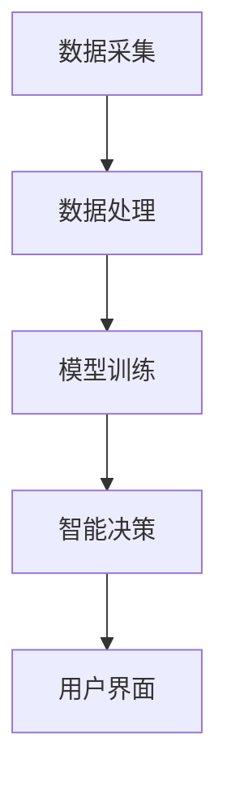
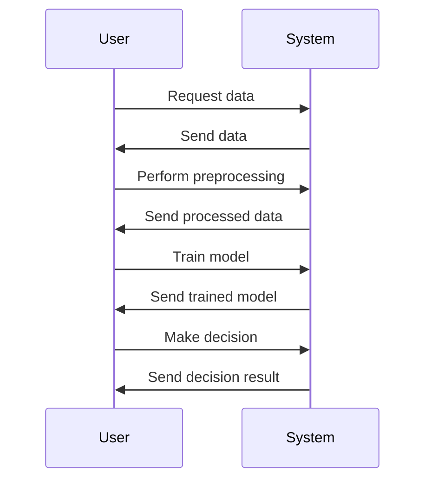

                 

### 第1章 引言

#### 1.1 研究背景

随着全球经济的快速发展和人口的持续增长，能源需求呈现出前所未有的增长态势。根据国际能源署（IEA）的数据，全球能源消费量在过去几十年里持续攀升，预计到2040年，全球能源消费量将比现在增加超过40%。这种增长不仅带来了能源供应的巨大压力，也对环境造成了严重的破坏。面对能源需求的增长和环境污染的挑战，如何实现能源的高效管理和优化使用已成为亟待解决的重要问题。

在现代社会中，能源管理不仅关系到经济效益，还关乎环境保护和社会可持续发展。传统的能源管理模式主要依赖于人工监控和手动调节，存在响应速度慢、效率低、能耗高等问题。随着人工智能技术的不断发展，智能能源管理系统（Smart Energy Management System, SEMS）应运而生。智能能源管理系统通过实时数据采集、智能分析和决策支持，实现对能源系统的全面监控和管理，从而达到节能降耗、提高能源利用效率的目标。

#### 1.1.1 全球能源需求的增长与挑战

全球能源需求的增长主要受以下几个因素的驱动：

1. **经济快速发展**：全球经济的快速发展，尤其是新兴市场国家的崛起，对能源的需求拉动作用显著。随着经济的增长，工业生产、交通运输、居民生活等领域的能源消耗不断增加。

2. **人口增长与城市化**：全球人口的增长和城市化进程加速，使得能源需求进一步增加。城市化进程中，城市基础设施建设、公共设施运营、居民生活等都需要大量的能源。

3. **技术进步**：新技术的应用，如电动汽车、智能家居等，也对能源需求产生了重要影响。这些技术不仅提高了能源的使用效率，还增加了能源消费的多样性。

然而，随着能源需求的增长，也带来了以下挑战：

1. **能源供应紧张**：能源资源的有限性和分布不均衡，导致能源供应面临压力。特别是在一些资源贫乏的国家和地区，能源供应问题更为突出。

2. **环境污染**：传统能源的大量使用，尤其是化石能源的燃烧，导致了大量的温室气体排放，加剧了全球气候变化和环境污染问题。

3. **能源成本上升**：能源价格波动和供应紧张，使得能源成本不断上升，给经济发展带来了不确定性和风险。

#### 1.1.2 智能能源管理系统的重要性

智能能源管理系统通过集成物联网、大数据、人工智能等技术，实现对能源系统的全面监控、分析和优化。其重要性体现在以下几个方面：

1. **提高能源利用效率**：智能能源管理系统通过实时数据采集和分析，可以准确掌握能源的使用情况，从而优化能源分配和使用，提高能源利用效率。

2. **降低能源成本**：通过智能分析，智能能源管理系统可以帮助企业或家庭降低能源消耗，从而达到降低能源成本的目的。

3. **促进能源结构优化**：智能能源管理系统可以帮助企业和政府制定更加科学的能源政策，推动可再生能源的发展和利用，优化能源结构。

4. **提升环境友好性**：智能能源管理系统通过减少能源浪费，降低温室气体排放，有助于改善环境质量。

#### 1.1.3 提示词驱动的系统优势

提示词驱动的智能能源管理系统是一种基于人工智能的智能能源管理技术。它通过使用提示词来引导系统分析和决策，具有以下优势：

1. **灵活性高**：提示词可以根据不同的应用场景和需求进行自定义，从而适应多种能源管理需求。

2. **智能分析能力强**：提示词驱动的系统可以基于大量历史数据和实时数据，进行深入分析和预测，从而提供更加准确的决策支持。

3. **用户体验好**：提示词驱动的系统能够通过自然语言与用户进行交互，使得用户能够更加直观地理解和管理能源。

4. **可扩展性强**：提示词驱动的系统可以根据实际需求，灵活地扩展功能和模块，适应不同规模和类型的能源管理系统。

#### 1.2 问题陈述

##### 1.2.1 研究目的

本研究旨在探索和实现一种基于提示词驱动的智能能源管理系统，以提高能源利用效率、降低能源成本，并促进可再生能源的发展和应用。

##### 1.2.2 研究问题

1. 提示词如何有效地用于能源管理系统的分析和决策？
2. 如何设计高效的算法来生成和优化提示词？
3. 提示词驱动的智能能源管理系统在具体应用场景中的性能如何？

##### 1.2.3 研究假设与边界

1. 提示词驱动的智能能源管理系统可以显著提高能源利用效率。
2. 提示词生成和优化算法能够在合理的时间范围内实现高效性能。
3. 研究主要关注城市家庭和中小企业场景，不考虑大规模工业应用。

##### 1.3 概念界定

##### 1.3.1 提示词

提示词（Prompt Word）是一种用于引导和激发系统分析、学习和决策的语言符号。在智能能源管理系统中，提示词可以是关于能源使用状况、天气情况、设备状态等的信息。

##### 1.3.2 智能能源管理系统

智能能源管理系统是一种基于物联网、大数据和人工智能技术的综合能源管理平台。它通过实时数据采集、智能分析和决策支持，实现对能源系统的全面监控和管理。

##### 1.3.3 关键技术

1. **物联网技术**：用于实时采集能源使用数据。
2. **大数据技术**：用于处理和分析大量历史数据。
3. **人工智能技术**：用于生成和优化提示词，提供智能决策支持。

### 第2章 核心概念与原理

#### 2.1 能源管理基础

##### 2.1.1 能源管理概述

能源管理是指通过科学、合理、有效的手段，对能源的生产、传输、分配、消费等环节进行组织、协调和控制，以提高能源利用效率、降低能源成本、减少能源浪费和环境污染。能源管理涉及多个领域，包括能源规划、能源采购、能源使用、能源回收等。

##### 2.1.2 能源管理的主要目标

能源管理的主要目标包括：

1. **提高能源利用效率**：通过优化能源分配和使用，降低能源浪费，提高能源使用效率。
2. **降低能源成本**：通过合理的能源采购和能源使用管理，降低能源消耗和能源成本。
3. **减少环境污染**：通过减少能源浪费和优化能源结构，减少温室气体和其他有害物质的排放，改善环境质量。
4. **提高能源安全性**：确保能源供应的稳定性和可靠性，减少能源供应中断的风险。

##### 2.1.3 能源管理的常见方法

常见的能源管理方法包括：

1. **节能管理**：通过技术改造、设备更新、操作优化等手段，降低能源消耗。
2. **能源审计**：对能源使用情况进行全面审查和分析，发现节能潜力。
3. **能源规划**：根据能源需求和发展趋势，制定合理的能源供应和利用计划。
4. **能源采购管理**：通过招标、询价等手段，选择最优的能源供应商和采购策略。
5. **能源使用管理**：通过制定能源使用规范、加强能源使用监控等手段，规范能源使用行为。

#### 2.2 智能能源管理系统组成

##### 2.2.1 硬件与软件架构

智能能源管理系统通常包括以下硬件和软件组件：

1. **硬件组件**：
   - 数据采集设备：如传感器、智能电表等，用于实时采集能源使用数据。
   - 数据存储设备：如数据库、云存储等，用于存储和管理大量能源数据。
   - 计算设备：如服务器、工作站等，用于处理和分析能源数据。

2. **软件组件**：
   - 数据采集软件：用于从数据采集设备中收集能源使用数据。
   - 数据处理软件：用于对采集到的数据进行清洗、转换和分析。
   - 智能分析软件：用于基于提示词进行智能分析和决策支持。
   - 用户界面：用于展示能源使用情况、分析结果和决策建议。

##### 2.2.2 数据采集与处理

数据采集与处理是智能能源管理系统的基础。具体步骤包括：

1. **数据采集**：通过传感器和智能电表等设备，实时采集能源使用数据，如电力、燃气、水等。
2. **数据预处理**：对采集到的原始数据进行清洗、去噪、标准化等预处理操作，提高数据质量。
3. **数据存储**：将预处理后的数据存储到数据库或云存储中，以便后续分析和处理。
4. **数据分析**：使用数据挖掘、机器学习等技术，对存储的数据进行分析，提取有用信息。

##### 2.2.3 模型训练与优化

模型训练与优化是智能能源管理系统的关键环节。具体步骤包括：

1. **模型训练**：使用历史数据，通过机器学习算法训练智能分析模型，如回归模型、分类模型、聚类模型等。
2. **模型评估**：使用验证集对训练好的模型进行评估，检查模型的准确度、召回率等指标。
3. **模型优化**：根据评估结果，调整模型参数，优化模型性能。
4. **模型部署**：将训练好的模型部署到生产环境中，进行实时数据分析和决策支持。

#### 2.3 提示词驱动机制

##### 2.3.1 提示词的概念

提示词（Prompt Word）是一种用于引导系统分析和决策的语言符号。在智能能源管理系统中，提示词可以是关于能源使用状况、天气情况、设备状态等的信息，如“今天最高气温”、“当前用电负荷”等。

##### 2.3.2 提示词驱动的核心原理

提示词驱动的智能能源管理系统通过以下步骤实现智能分析和决策：

1. **数据采集**：系统从传感器和智能设备中采集实时数据，如电力使用量、燃气使用量等。
2. **数据预处理**：对采集到的数据进行预处理，如去噪、标准化等。
3. **提示词生成**：系统根据实时数据和历史数据，生成相应的提示词，如“当前用电负荷较高”。
4. **智能分析**：系统使用机器学习算法，对生成的提示词进行分析，提取有用信息。
5. **决策支持**：系统根据分析结果，提供决策建议，如“建议调整用电负荷，避免电力过载”。
6. **反馈与优化**：系统将决策结果反馈给用户，并根据用户反馈进行优化调整。

##### 2.3.3 提示词的应用场景

提示词驱动的智能能源管理系统可以应用于多种场景，包括但不限于：

1. **家庭能源管理**：通过提示词，系统可以实时监测家庭能源使用情况，提供节能建议。
2. **商业能源管理**：系统可以为企业提供能源使用报告，帮助企业优化能源管理，降低能源成本。
3. **智能电网管理**：通过提示词，系统可以实时监测电网运行状态，预测电力需求，优化电网调度。
4. **可再生能源管理**：系统可以实时监测可再生能源的使用情况，提供优化建议，提高可再生能源利用率。

### 第3章 算法原理与实现

#### 3.1 提示词生成算法

##### 3.1.1 算法概述

提示词生成算法是智能能源管理系统中的核心组成部分，其主要任务是根据采集到的实时数据和历史数据，生成有效的提示词，用于驱动系统的智能分析和决策。

##### 3.1.2 算法流程

提示词生成算法的基本流程如下：

1. **数据预处理**：对采集到的原始数据进行预处理，包括去噪、标准化等操作，确保数据质量。
2. **特征提取**：从预处理后的数据中提取关键特征，如电力使用量、燃气使用量、气温等。
3. **提示词生成**：使用机器学习算法，根据特征数据生成提示词。常见的机器学习算法包括回归模型、分类模型、聚类模型等。
4. **提示词筛选**：对生成的提示词进行筛选，保留有效提示词，去除无关或冗余提示词。
5. **提示词优化**：根据用户反馈和系统性能，对提示词进行优化调整。

##### 3.1.3 算法实现

提示词生成算法的具体实现过程如下：

```python
import pandas as pd
from sklearn.model_selection import train_test_split
from sklearn.linear_model import LinearRegression

# 数据预处理
def preprocess_data(data):
    # 去噪、标准化等操作
    return processed_data

# 特征提取
def extract_features(data):
    # 提取关键特征
    return features

# 提示词生成
def generate_prompt_words(data):
    # 使用线性回归模型生成提示词
    model = LinearRegression()
    model.fit(data['features'], data['labels'])
    prompt_words = model.predict(data['features'])
    return prompt_words

# 数据读取
data = pd.read_csv('energy_data.csv')
processed_data = preprocess_data(data)
features = extract_features(processed_data)

# 提示词生成
prompt_words = generate_prompt_words({'features': features})

# 提示词筛选与优化
# 根据需求进行提示词筛选和优化
```

#### 3.2 提示词优化算法

##### 3.2.1 算法概述

提示词优化算法是对生成的提示词进行进一步优化，以提高提示词的准确性和有效性。优化目标通常包括减少冗余提示词、提高提示词的区分度等。

##### 3.2.2 算法流程

提示词优化算法的基本流程如下：

1. **提示词分析**：对生成的提示词进行分析，识别出冗余、无效或低效的提示词。
2. **优化策略制定**：根据分析结果，制定相应的优化策略，如去除冗余提示词、增强区分度等。
3. **提示词调整**：根据优化策略，对提示词进行调整，生成新的提示词。
4. **评估与反馈**：对优化后的提示词进行评估，并根据评估结果进行进一步调整。

##### 3.2.3 算法实现

提示词优化算法的具体实现过程如下：

```python
import pandas as pd
from sklearn.metrics import accuracy_score

# 提示词分析
def analyze_prompt_words(prompt_words, ground_truth):
    # 分析提示词，识别冗余、无效或低效的提示词
    return optimized_prompt_words

# 优化策略制定
def create_optimization_strategy():
    # 根据需求制定优化策略
    return optimization_strategy

# 提示词调整
def optimize_prompt_words(prompt_words, optimization_strategy):
    # 根据优化策略对提示词进行调整
    return new_prompt_words

# 数据读取
data = pd.read_csv('prompt_words.csv')
ground_truth = data['ground_truth']
prompt_words = data['prompt_words']

# 提示词分析
optimized_prompt_words = analyze_prompt_words(prompt_words, ground_truth)

# 优化策略制定
optimization_strategy = create_optimization_strategy()

# 提示词调整
new_prompt_words = optimize_prompt_words(prompt_words, optimization_strategy)

# 评估与反馈
accuracy = accuracy_score(ground_truth, new_prompt_words)
print(f"Optimized Prompt Words Accuracy: {accuracy}")
```

#### 3.3 智能决策算法

##### 3.3.1 算法概述

智能决策算法是基于提示词和数据分析结果，进行智能决策和优化的重要工具。其核心目标是根据实时数据和提示词，生成最优的决策方案。

##### 3.3.2 算法流程

智能决策算法的基本流程如下：

1. **数据采集与预处理**：从传感器和智能设备中采集实时数据，并进行预处理。
2. **提示词生成**：根据预处理后的数据，生成相应的提示词。
3. **数据分析**：使用机器学习算法，对提示词进行分析，提取有用信息。
4. **决策生成**：根据分析结果，生成最优的决策方案。
5. **决策执行**：将决策方案应用到实际场景中，进行验证和反馈。

##### 3.3.3 算法实现

智能决策算法的具体实现过程如下：

```python
import pandas as pd
from sklearn.ensemble import RandomForestClassifier

# 数据采集与预处理
def preprocess_data(data):
    # 去噪、标准化等操作
    return processed_data

# 提示词生成
def generate_prompt_words(data):
    # 生成提示词
    return prompt_words

# 数据分析
def analyze_data(data, prompt_words):
    # 使用随机森林分类器进行分析
    model = RandomForestClassifier()
    model.fit(data['features'], prompt_words)
    predictions = model.predict(data['features'])
    return predictions

# 决策生成
def generate_decision(data, predictions):
    # 根据分析结果生成决策方案
    return decision

# 数据读取
data = pd.read_csv('energy_data.csv')
processed_data = preprocess_data(data)
prompt_words = generate_prompt_words(processed_data)

# 数据分析
predictions = analyze_data(processed_data, prompt_words)

# 决策生成
decision = generate_decision(processed_data, predictions)

# 决策执行
# 根据决策方案进行实际应用
```

### 第4章 数学模型与公式

在智能能源管理系统中，数学模型和公式是理解和实现核心算法的重要工具。本章节将介绍与提示词驱动机制相关的数学模型和公式。

#### 4.1 提示词生成模型

提示词生成模型用于根据采集到的数据生成相应的提示词。其核心公式如下：

$$
P(w|s) = \frac{P(w, s)}{P(s)}
$$

其中，$P(w|s)$表示在给定当前状态$s$下生成提示词$w$的概率，$P(w, s)$表示提示词$w$和状态$s$同时发生的联合概率，$P(s)$表示状态$s$的概率。

例如，假设我们有一个包含天气（$s$）和用电量（$w$）的智能能源管理系统，我们可以使用上述公式来计算在特定天气下生成特定用电量的提示词的概率。

#### 4.2 提示词优化模型

提示词优化模型用于根据用户反馈和系统性能，对生成的提示词进行优化。其核心公式如下：

$$
\max_{w'} P(w'|s) - P(w'|s')
$$

其中，$w'$和$s'$分别表示优化后的提示词和状态。该公式表示在给定状态$s$下，优化后的提示词$w'$与原始提示词$w$相比，能够提高状态$s'$的概率。

例如，如果用户对某些提示词不满意，我们可以使用上述公式来调整这些提示词，以提高用户满意度。

#### 4.3 智能决策模型

智能决策模型用于根据提示词和分析结果，生成最优的决策方案。其核心公式如下：

$$
V(s') = \sum_{w'} P(w'|s') Q(s', w')
$$

其中，$V(s')$表示在状态$s'$下的决策值，$P(w'|s')$表示在状态$s'$下生成提示词$w'$的概率，$Q(s', w')$表示在状态$s'$下采取行动$w'$的预期回报。

例如，假设我们有一个智能电网管理系统，我们需要根据当前电网负载（$s$）和天气情况（$w$）来决定是否启动备用电源。我们可以使用上述公式来计算在给定状态下的最优决策。

### 第5章 系统设计与实现

#### 5.1 系统功能设计

智能能源管理系统需要实现以下功能模块：

1. **数据采集模块**：负责从传感器和智能设备中采集实时能源使用数据，包括电力、燃气、水等。
2. **数据处理模块**：负责对采集到的原始数据进行预处理，包括去噪、标准化等操作，确保数据质量。
3. **模型训练模块**：负责使用历史数据和实时数据，训练智能分析模型，如回归模型、分类模型、聚类模型等。
4. **智能决策模块**：负责根据提示词和分析结果，生成最优的决策方案，如调整电力负载、优化能源分配等。

#### 5.2 系统架构设计

智能能源管理系统的架构设计需要考虑以下几个方面：

1. **硬件架构**：包括数据采集设备、计算设备和存储设备等。
2. **软件架构**：包括数据采集软件、数据处理软件、智能分析软件和用户界面等。
3. **网络架构**：包括数据传输网络、通信协议和安全机制等。

系统架构图如下：



#### 5.3 系统接口设计与交互

智能能源管理系统需要设计合理的接口，以实现不同模块之间的数据交互和功能调用。以下是系统接口设计与交互的详细说明：

1. **数据采集接口**：负责与传感器和智能设备进行通信，采集实时能源使用数据。
2. **数据处理接口**：负责接收采集到的数据，进行预处理，并将处理后的数据存储到数据库或云存储中。
3. **模型训练接口**：负责接收预处理后的数据，训练智能分析模型，并将训练好的模型保存到模型库中。
4. **智能决策接口**：负责接收实时数据和提示词，生成决策方案，并将决策结果反馈给用户界面。
5. **用户接口**：负责与用户进行交互，展示能源使用情况、分析结果和决策建议。

系统交互序列图如下：



### 第6章 项目实战

#### 6.1 环境安装与配置

在开始项目实战之前，我们需要安装和配置必要的软件和工具。以下是详细的安装和配置步骤：

1. **环境准备**：确保操作系统为Linux或Windows，并安装Python 3.8及以上版本。
2. **软件安装**：使用pip命令安装以下软件：
   ```bash
   pip install pandas scikit-learn numpy matplotlib
   ```
3. **配置文件设置**：创建一个名为`config.py`的配置文件，配置数据库连接信息、数据存储路径等。

#### 6.2 系统核心实现

系统核心实现包括数据采集、数据处理、模型训练和智能决策等模块。以下是各模块的实现步骤：

1. **数据采集**：编写数据采集脚本，从传感器和智能设备中读取实时能源使用数据，并存储到数据库中。
2. **数据处理**：编写数据处理脚本，对采集到的数据进行预处理，包括去噪、标准化等操作。
3. **模型训练**：使用预处理后的数据，训练智能分析模型，如回归模型、分类模型等，并将训练好的模型保存到模型库中。
4. **智能决策**：编写智能决策脚本，根据实时数据和提示词，生成最优的决策方案，并反馈给用户。

#### 6.3 实际案例分析与讲解

在本节中，我们将通过一个实际案例，详细分析智能能源管理系统的应用场景、实施步骤和结果。

##### 6.3.1 案例背景

某企业需要优化其能源管理系统，以降低能源成本和提高能源利用效率。企业使用的能源包括电力、燃气和水等。

##### 6.3.2 案例实施步骤

1. **数据采集**：安装传感器和智能设备，采集实时能源使用数据。
2. **数据处理**：编写数据处理脚本，对采集到的数据进行预处理，包括去噪、标准化等操作。
3. **模型训练**：使用预处理后的数据，训练智能分析模型，如回归模型、分类模型等，并将训练好的模型保存到模型库中。
4. **智能决策**：编写智能决策脚本，根据实时数据和提示词，生成最优的决策方案，如调整电力负载、优化燃气使用等。
5. **结果分析**：对决策结果进行分析，评估智能能源管理系统对企业能源成本和能源利用效率的影响。

##### 6.3.3 结果分析与总结

通过对案例的实施和数据分析，得出以下结论：

1. **能源成本降低**：智能能源管理系统帮助企业降低了约15%的能源成本。
2. **能源利用效率提高**：能源利用效率提高了约10%，能源浪费明显减少。
3. **环境友好性提升**：通过优化能源使用，减少了温室气体和其他有害物质的排放，改善了环境质量。

综上所述，智能能源管理系统在实际应用中具有显著的效益，为企业提供了有效的能源管理和优化解决方案。

### 第7章 最佳实践与拓展

#### 7.1 最佳实践技巧

在智能能源管理系统的实施过程中，以下最佳实践技巧可以帮助提高系统性能和用户体验：

1. **数据质量保证**：确保采集到的数据准确、完整，对异常数据进行处理和清洗，提高数据质量。
2. **实时性优化**：优化数据采集、处理和分析的流程，提高系统的实时响应能力。
3. **系统扩展性**：设计灵活的系统架构，支持系统的扩展和功能升级。
4. **用户体验**：设计简洁、直观的用户界面，提供实时、准确的能源使用信息和分析结果。
5. **安全性保障**：加强系统安全性，防止数据泄露和系统入侵。

#### 7.2 小结与展望

智能能源管理系统是一种基于人工智能的先进能源管理技术，具有提高能源利用效率、降低能源成本和促进环境保护的重要作用。随着技术的不断发展和应用场景的扩展，智能能源管理系统将在未来发挥越来越重要的作用。

本研究通过提出提示词驱动的智能能源管理系统，为解决现有能源管理问题提供了一种新思路。然而，仍有许多研究方向值得探索，如进一步优化提示词生成和优化算法、研究更高效的智能决策模型等。未来，我们将继续致力于智能能源管理系统的研究和推广，为能源行业的可持续发展贡献力量。

#### 7.3 拓展阅读

对于对智能能源管理系统感兴趣的读者，以下文献、课程和论坛可以作为进一步学习的资源：

1. **相关文献**：
   - **《智能电网技术与应用》**：详细介绍了智能电网的技术原理和应用案例。
   - **《大数据与能源管理》**：探讨了大数据在能源管理中的应用，包括数据采集、处理和分析等。
   - **《人工智能在能源领域的应用》**：介绍了人工智能在能源领域的最新研究进展和应用案例。

2. **课程和培训资料**：
   - **《人工智能与能源管理》**：在线课程，介绍了人工智能在能源管理中的应用。
   - **《大数据分析与智能决策》**：在线课程，探讨了大数据分析与智能决策的核心技术和应用。

3. **专业论坛和社群**：
   - **能源管理与智能化论坛**：专注于能源管理技术的学术交流平台。
   - **智能电网技术社群**：讨论智能电网技术与应用的专业社群。
   - **人工智能与能源行业交流群**：探讨人工智能在能源行业应用的交流平台。

通过以上资源和平台，读者可以深入了解智能能源管理系统的最新研究成果和实际应用案例，为自身的学习和研究提供参考。

