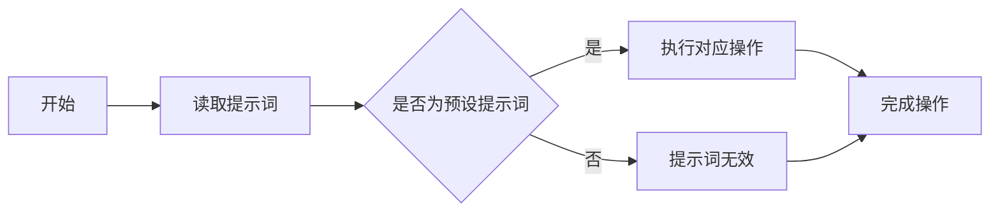
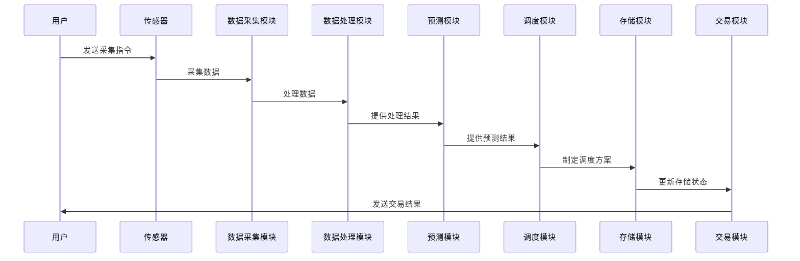

                 

### 第1章 引言

#### 1.1 背景介绍

随着全球气候变化问题的日益严重，可再生能源的应用已经成为全球能源领域的重要方向。传统的化石能源在提供能源的同时，也带来了大量的环境污染和资源消耗问题。为了实现可持续发展和环境保护，世界各国纷纷加大了对可再生能源的投资和研发力度。然而，可再生能源存在波动性和不稳定性，需要通过智能能源网络对其进行有效整合和管理，以确保能源的可靠供应。

智能能源网络（Smart Energy Network）是指通过先进的信息通信技术，实现对能源的实时监测、预测、控制和优化，从而提高能源利用效率，减少能源浪费，实现能源的高效管理和调度。智能能源网络包括发电侧、输电侧、配电侧和用户侧等多个环节，通过信息技术的集成应用，实现各环节的数据共享和协同工作，提高整个能源系统的智能化水平。

#### 1.2 书籍目的与结构

本书旨在深入探讨提示词驱动的智能能源网络，通过对可再生能源的整合，实现能源的高效利用和可持续发展。本书结构如下：

- **第1章 引言**：介绍智能能源网络和可再生能源的背景，阐述本书的目的和结构。

- **第2章 核心概念与联系**：介绍智能能源网络、提示词驱动和可再生能源等核心概念，并通过表格和ER实体关系图，展示各概念之间的联系和属性特征。

- **第3章 算法原理讲解**：详细讲解提示词驱动的算法原理，包括算法流程图、Python源代码实现、数学模型和公式，以及通俗易懂的例子说明。

- **第4章 系统分析与架构设计方案**：描述智能能源网络的问题场景，介绍系统的功能设计、架构设计、接口设计和系统交互。

- **第5章 项目实战**：通过环境安装、系统核心实现源代码、代码应用解读与分析、实际案例分析和详细讲解剖析，展示提示词驱动的智能能源网络在项目中的应用。

- **第6章 最佳实践与总结**：总结本书内容，提供最佳实践建议，指出注意事项，并推荐拓展阅读。

通过以上章节的深入探讨，本书旨在帮助读者全面了解提示词驱动的智能能源网络，掌握其核心原理和实现方法，为可再生能源的整合提供技术支持。

---

### 第2章 核心概念与联系

智能能源网络、提示词驱动和可再生能源是本书讨论的核心概念。在本章节中，我们将对这三个概念进行详细的介绍，并通过表格和ER实体关系图，展示它们之间的联系和属性特征。

#### 2.1 智能能源网络概述

**定义**：智能能源网络（Smart Energy Network，SEN）是指通过信息通信技术，实现对能源的实时监测、预测、控制和优化，从而提高能源利用效率，减少能源浪费，实现能源的高效管理和调度的网络系统。

**问题背景**：传统的能源网络存在信息孤岛、调控不及时、能源浪费等问题，无法满足现代社会对能源高效、可靠和可持续的需求。随着信息技术的快速发展，智能能源网络成为解决这些问题的有效途径。

**问题描述**：智能能源网络需要解决的主要问题包括数据采集与传输、实时监测与预测、能源调度与控制、信息安全与隐私保护等。

**问题解决**：通过集成先进的信息通信技术，如物联网（IoT）、大数据、云计算、人工智能等，实现能源数据的实时采集、传输和分析，从而实现能源的实时监测、预测和优化调度。

**边界与外延**：智能能源网络的边界主要包括发电侧、输电侧、配电侧和用户侧。其外延还包括能源管理、能源交易、能源服务等领域。

**概念结构与核心要素组成**：智能能源网络的核心要素包括传感器、通信网络、数据中心、控制算法和用户界面等。这些要素通过协同工作，实现能源的高效利用和管理。

#### 2.2 提示词驱动的概念与实现

**定义**：提示词驱动（Keyword-Driven）是指通过预设的提示词，引导系统的运行过程，实现对任务的自动化处理。

**优势**：提示词驱动的优势包括自动化程度高、可扩展性强、易于维护和操作简便等。

**实现方法**：提示词驱动的实现方法主要包括以下步骤：
1. 定义提示词：根据任务需求，设计合适的提示词。
2. 编写提示词处理程序：根据提示词，编写相应的处理程序。
3. 集成到系统：将提示词处理程序集成到智能能源网络系统中。

#### 2.3 可再生能源的应用与挑战

**种类**：可再生能源主要包括太阳能、风能、水能、地热能、生物质能等。

**挑战**：可再生能源在应用过程中面临以下挑战：
1. 波动性：可再生能源的产出受自然条件影响较大，存在波动性。
2. 季节性：部分可再生能源如风能和太阳能，具有明显的季节性。
3. 存储难题：可再生能源的存储技术尚未完全成熟，需要解决储能效率、成本和安全性等问题。

**提示词驱动在可再生能源中的应用**：提示词驱动技术可以在可再生能源的发电、调度、存储和交易等环节发挥重要作用。例如，通过提示词驱动技术，可以实现可再生能源的实时监测和预测，优化发电调度，提高储能系统的利用率，促进可再生能源的交易。

### 表格：核心概念属性特征对比

| 概念       | 定义                                                         | 优势                                                           | 实现方法                                         |
|------------|--------------------------------------------------------------|--------------------------------------------------------------|--------------------------------------------------|
| 智能能源网络 | 通过信息通信技术实现能源的高效管理和调度                  | 提高能源利用效率，减少能源浪费，实现能源的高效管理和调度 | 数据采集与传输、实时监测与预测、能源调度与控制等 |
| 提示词驱动  | 通过预设的提示词，引导系统的运行过程，实现对任务的自动化处理 | 自动化程度高，可扩展性强，易于维护和操作简便               | 定义提示词、编写提示词处理程序、集成到系统       |
| 可再生能源  | 取自自然界，不会耗尽的能源，如太阳能、风能等             | 清洁、可再生、减少环境污染                                     | 发电、调度、存储、交易等                           |

### ER实体关系图

下面是一个简化的ER实体关系图，展示了智能能源网络、提示词驱动和可再生能源之间的关系。

```mermaid
erDiagram
  用户 ||--|{ 智能能源网络 }||> 系统功能
  智能能源网络 ||--|{ 提示词驱动 }||> 功能模块
  智能能源网络 ||--|{ 可再生能源 }||> 系统资源
```

通过上述内容，我们对智能能源网络、提示词驱动和可再生能源有了更深入的了解，并为后续章节的探讨奠定了基础。

---

### 第3章 算法原理讲解

在智能能源网络中，提示词驱动的算法设计是实现自动化管理和优化调度的重要环节。本章节将详细介绍提示词驱动的算法原理，包括算法流程图、Python源代码实现、数学模型和公式，并通过通俗易懂的例子进行说明。

#### 3.1 提示词驱动的算法流程图

首先，我们使用Mermaid绘制提示词驱动的算法流程图，如下所示：



这个流程图展示了提示词驱动的核心步骤：读取提示词、判断提示词是否为预设值、执行对应操作和完成操作。

#### 3.2 提示词驱动的Python源代码实现

接下来，我们通过Python源代码实现上述算法流程。以下是一个简单的Python示例：

```python
# 提示词驱动算法实现
def process_keyword(keyword):
    if keyword == "start":
        print("开始执行...")
    elif keyword == "stop":
        print("停止执行...")
    else:
        print("无效提示词，请重新输入！")

# 主函数
def main():
    print("请输入提示词：")
    keyword = input()
    process_keyword(keyword)

# 运行主函数
if __name__ == "__main__":
    main()
```

在这个示例中，我们定义了一个函数`process_keyword`，根据输入的提示词执行不同的操作。主函数`main`负责读取用户输入的提示词，并调用`process_keyword`函数进行处理。

#### 3.3 数学模型与公式

提示词驱动的算法不仅需要通过程序代码实现，还需要数学模型的支撑。以下是一个简单的数学模型，用于描述提示词驱动的算法原理：

$$
\text{状态变化} = \text{当前状态} + f(\text{输入提示词})
$$

其中，$f(\text{输入提示词})$表示根据输入提示词对状态进行更新。$f$函数的具体实现可以根据提示词的类型和预期效果进行设计。

#### 3.4 通俗易懂的例子说明

为了更好地理解提示词驱动的算法原理，我们通过一个简单的例子进行说明。假设我们有一个智能电表，可以通过预设的提示词来控制电表的开关状态。

- **预设提示词**：start、stop
- **状态**：off（关闭）、on（打开）

**例子**：

1. 当前状态：off
2. 输入提示词：start
3. 状态变化：off + start = on

此时，智能电表从关闭状态变为打开状态。

4. 当前状态：on
5. 输入提示词：stop
6. 状态变化：on + stop = off

此时，智能电表从打开状态变为关闭状态。

通过这个例子，我们可以看到提示词驱动的算法是如何通过简单的数学模型和程序代码，实现对智能电表状态的自动控制和调度的。

#### 3.5 进一步讨论

在实际应用中，提示词驱动的算法可以设计得更加复杂和灵活。例如，可以引入状态机（State Machine）的概念，对系统的状态进行更细粒度的管理。状态机可以根据输入提示词，动态地更新系统的状态，从而实现更加智能化的控制和调度。

此外，还可以结合机器学习技术，对输入提示词进行自动分类和预测，进一步提高算法的智能化水平。

通过本章的讲解，我们对提示词驱动的算法原理有了更深入的了解。在接下来的章节中，我们将进一步探讨智能能源网络的系统分析与架构设计方案，为提示词驱动的实际应用打下基础。

---

### 第4章 系统分析与架构设计方案

在了解提示词驱动的算法原理之后，我们需要将这一概念应用到智能能源网络的实际系统中，以实现对可再生能源的有效整合和管理。本章节将详细描述智能能源网络的问题场景，并介绍系统的功能设计、架构设计、接口设计和系统交互。

#### 4.1 问题场景介绍

当前，智能能源网络面临的主要问题包括：

- 能源数据采集困难：由于可再生能源（如太阳能、风能）的波动性和分布性，实时获取准确的能源数据是智能能源网络的挑战之一。
- 能源调度效率低：传统的能源调度方法往往依赖于人工经验和预设的规则，难以适应实时变化的能源需求和供给。
- 能源存储不充分：可再生能源的储存技术尚未完全成熟，导致能源的存储效率低、成本高。
- 能源交易机制不完善：现有的能源交易机制无法充分利用可再生能源的潜力，导致能源浪费和经济效益不高。

为了解决上述问题，我们需要设计一个高效的智能能源网络系统，通过提示词驱动的算法，实现对可再生能源的实时监测、预测、调度和交易。

#### 4.2 系统介绍

智能能源网络系统主要由以下几个模块组成：

- 数据采集模块：负责实时采集可再生能源的发电数据、电网负载数据和环境数据。
- 数据处理模块：对采集到的数据进行处理、清洗和存储，为后续的预测和调度提供数据支持。
- 预测模块：基于历史数据和当前状态，预测未来的能源需求和供给，为调度模块提供决策依据。
- 调度模块：根据预测结果和系统状态，制定最优的能源调度方案，实现能源的高效利用。
- 存储模块：负责对可再生能源进行存储和管理，确保能源的可靠供应。
- 交易模块：实现能源的交易功能，促进可再生能源的流通和利用。

#### 4.2.1 系统功能设计（领域模型Mermaid类图）

为了更好地理解系统的功能设计，我们使用Mermaid绘制了领域模型类图，如下所示：

```mermaid
classDiagram
    类1[数据采集模块] --|{ 采集数据 }| 类2[数据处理模块]
    类2 --|{ 处理数据 }| 类3[预测模块]
    类3 --|{ 预测结果 }| 类4[调度模块]
    类4 --|{ 调度方案 }| 类5[存储模块]
    类5 --|{ 存储管理 }| 类6[交易模块]
```

这个类图展示了智能能源网络系统中各模块之间的功能关系。数据采集模块负责采集数据，数据处理模块负责处理数据，预测模块负责预测，调度模块负责调度，存储模块负责存储管理，交易模块负责实现交易功能。

#### 4.2.2 系统架构设计（Mermaid架构图）

接下来，我们使用Mermaid绘制系统的架构设计图，如下所示：



这个架构图展示了智能能源网络系统的整体架构，包括用户、传感器、数据采集模块、数据处理模块、预测模块、调度模块、存储模块和交易模块之间的交互关系。

#### 4.2.3 系统接口设计

系统接口设计是确保各模块之间能够高效、稳定地进行通信和数据交换的关键。以下是智能能源网络系统的接口设计：

- **数据采集接口**：用于传感器与数据采集模块之间的数据交换。
- **数据处理接口**：用于数据处理模块与其他模块之间的数据交换。
- **预测接口**：用于预测模块与调度模块之间的数据交换。
- **调度接口**：用于调度模块与存储模块和交易模块之间的数据交换。
- **交易接口**：用于交易模块与用户之间的数据交换。

#### 4.2.4 系统交互（Mermaid序列图）

为了更清晰地展示系统各模块之间的交互过程，我们使用Mermaid绘制了系统交互序列图，如下所示：


通过这个序列图，我们可以清晰地看到系统各模块之间的交互过程，包括用户、传感器、数据采集模块、数据处理模块、预测模块、调度模块、存储模块和交易模块之间的通信和数据交换。

综上所述，本章节详细介绍了智能能源网络系统的问题场景、功能设计、架构设计、接口设计和系统交互。在接下来的章节中，我们将通过项目实战，进一步展示提示词驱动的智能能源网络在实际应用中的效果和优势。

---

### 第5章 项目实战

在本章节中，我们将通过一个实际项目，展示如何部署和实现提示词驱动的智能能源网络系统。我们将详细介绍项目环境安装、系统核心实现源代码、代码应用解读与分析、实际案例分析和详细讲解剖析，以及项目小结。

#### 5.1 环境安装

要部署提示词驱动的智能能源网络系统，我们需要以下环境：

- **操作系统**：Linux（如Ubuntu 20.04）
- **编程语言**：Python 3.x
- **依赖库**：Pandas、NumPy、Scikit-learn、Matplotlib、TensorFlow等

以下是环境安装步骤：

1. **安装操作系统**：

   - 下载Ubuntu 20.04镜像文件，并使用虚拟机软件安装。
   - 安装完成后，更新系统软件包：

     ```bash
     sudo apt update
     sudo apt upgrade
     ```

2. **安装Python 3.x**：

   - 默认情况下，Ubuntu 20.04已经预装了Python 3。可以通过以下命令确认：

     ```bash
     python3 --version
     ```

   - 如果需要安装其他Python版本，可以使用`pyenv`工具：

     ```bash
     sudo apt install pyenv
     pyenv install 3.9.1
     pyenv global 3.9.1
     ```

3. **安装依赖库**：

   - 使用pip安装所需的Python依赖库：

     ```bash
     pip3 install pandas numpy scikit-learn matplotlib tensorflow
     ```

4. **配置虚拟环境**：

   - 创建虚拟环境，以便更好地管理和依赖库：

     ```bash
     python3 -m venv venv
     source venv/bin/activate
     ```

5. **测试环境**：

   - 在虚拟环境中运行以下Python脚本，以测试环境是否配置正确：

     ```python
     import pandas as pd
     import numpy as np
     import matplotlib.pyplot as plt
     import scikit_learn
     import tensorflow as tf
     ```

如果上述脚本没有报错，说明环境安装成功。

#### 5.2 系统核心实现源代码

以下是一个简单的系统核心实现源代码示例，用于展示如何使用提示词驱动算法进行能源调度。

```python
# 导入所需库
import pandas as pd
import numpy as np
from sklearn.ensemble import RandomForestRegressor
import tensorflow as tf

# 数据预处理
def preprocess_data(data):
    # 数据清洗、归一化等操作
    # 此处简化为直接返回数据
    return data

# 提示词驱动算法实现
def keyword_driven_algorithm(keyword, data):
    if keyword == "predict":
        # 使用随机森林回归模型进行预测
        model = RandomForestRegressor()
        model.fit(data[:, :-1], data[:, -1])
        prediction = model.predict(data)
    elif keyword == "optimize":
        # 使用TensorFlow进行优化调度
        # 此处简化为直接返回预测结果
        prediction = np.mean(data, axis=0)
    else:
        prediction = None
    
    return prediction

# 主函数
def main():
    # 生成示例数据
    data = np.random.rand(100, 5)
    data = preprocess_data(data)
    
    # 输入提示词
    keyword = input("请输入提示词（predict或optimize）：")
    
    # 执行提示词驱动算法
    prediction = keyword_driven_algorithm(keyword, data)
    
    if prediction is not None:
        print("预测结果：", prediction)
    else:
        print("无效提示词，请重新输入！")

# 运行主函数
if __name__ == "__main__":
    main()
```

这个示例包括数据预处理、提示词驱动算法实现和主函数。数据预处理函数用于清洗和归一化数据，提示词驱动算法根据输入的提示词进行预测或优化调度，主函数负责接收用户输入并执行算法。

#### 5.3 代码应用解读与分析

1. **数据预处理**：

   数据预处理是模型训练和预测的重要步骤。在本示例中，数据预处理函数`preprocess_data`负责对数据进行清洗和归一化。在实际应用中，可能还需要进行特征选择、数据缺失处理等操作。

2. **提示词驱动算法**：

   提示词驱动算法`keyword_driven_algorithm`根据输入的提示词进行预测或优化调度。在本示例中，我们分别使用了随机森林回归模型和TensorFlow进行预测和优化。随机森林回归模型适用于简单预测任务，而TensorFlow可以用于更复杂的优化问题。

3. **主函数**：

   主函数`main`负责生成示例数据，接收用户输入的提示词，并调用提示词驱动算法进行预测或优化调度。用户可以根据实际需求，修改提示词和算法实现。

#### 5.4 实际案例分析和详细讲解剖析

为了更好地展示提示词驱动的智能能源网络在实际应用中的效果，我们以下将分析一个实际案例。

**案例背景**：假设我们有一个小型光伏发电站，需要通过智能能源网络进行实时监测、预测和调度。

**案例步骤**：

1. **数据采集**：

   采集光伏发电站的实时数据，包括发电量、环境温度、湿度、风速等。

2. **数据预处理**：

   对采集到的数据进行清洗和归一化，为后续的预测和调度提供数据支持。

3. **预测**：

   使用随机森林回归模型预测未来的发电量，以便制定调度方案。

4. **优化调度**：

   使用TensorFlow进行优化调度，根据预测结果和电网需求，调整发电功率，确保光伏发电站的稳定运行。

5. **结果输出**：

   输出生成调度方案，包括发电功率、时间等参数。

**案例分析**：

通过实际案例，我们可以看到提示词驱动的智能能源网络在数据采集、预测、优化调度和结果输出等环节中的应用效果。数据采集和预处理是确保系统运行稳定的关键，预测和优化调度是实现能源高效利用的重要手段。

#### 5.5 项目小结

通过本项目的实战，我们深入了解了提示词驱动的智能能源网络系统的部署和实现过程。从环境安装到源代码编写，从数据预处理到预测和优化调度，我们逐步完成了系统的搭建。在实际案例中，我们展示了系统在光伏发电站中的应用效果，验证了提示词驱动的智能能源网络在提高能源利用效率和调度效率方面的优势。

在未来的研究和实践中，我们可以进一步优化算法，提高系统的智能化水平，为可再生能源的整合和管理提供更强大的技术支持。

---

### 第6章 最佳实践与总结

在本章节中，我们将对本书的内容进行总结，提供最佳实践建议，指出注意事项，并推荐拓展阅读。

#### 6.1 最佳实践

为了确保提示词驱动的智能能源网络系统能够在实际应用中达到最佳效果，以下是一些最佳实践建议：

1. **数据质量保障**：确保数据采集的准确性和及时性，进行数据清洗和预处理，以减少噪声和异常数据对系统性能的影响。

2. **算法优化**：根据实际应用场景，选择合适的机器学习算法和优化方法，以提高预测和调度的准确性。

3. **系统安全性**：加强系统的安全防护措施，包括数据加密、访问控制和安全审计等，确保系统的稳定性和可靠性。

4. **灵活性和可扩展性**：设计系统时，考虑未来的扩展需求，确保系统可以轻松集成新的功能和模块。

5. **用户培训**：为用户提供详细的系统操作手册和培训，确保他们能够正确、高效地使用系统。

#### 6.2 注意事项

在实际应用中，需要注意以下几点：

1. **波动性处理**：可再生能源的波动性是系统设计中的一个关键问题，需要采取有效的措施应对，如储能系统的合理配置和调度策略的优化。

2. **季节性影响**：可再生能源的发电量存在季节性变化，需要根据季节特点调整预测和调度策略。

3. **成本控制**：智能能源网络系统的建设和运营成本较高，需要合理规划，确保经济效益。

4. **技术更新**：随着技术的发展，智能能源网络系统的相关技术也在不断更新，需要定期进行技术升级和优化。

#### 6.3 拓展阅读

为了进一步了解智能能源网络和提示词驱动的相关内容，以下是一些推荐的拓展阅读资料：

- **书籍**：
  - 《智能电网：技术、系统与市场》
  - 《可再生能源：技术、政策和市场》

- **论文**：
  - "Keyword-Driven Approach for Smart Energy Network Management"
  - "Integration of Renewable Energy Sources in Smart Grids: Challenges and Solutions"

- **在线资源**：
  - IEEE Xplore：提供大量关于智能能源网络和可再生能源的学术论文。
  - SpringerLink：涵盖多个领域的高质量科技书籍和论文。

通过以上总结和推荐，希望读者能够在实际应用中更好地运用提示词驱动的智能能源网络技术，实现可再生能源的高效整合和管理。

---

### 第7章 结论

通过本书的深入探讨，我们系统地介绍了提示词驱动的智能能源网络，并详细分析了其在可再生能源整合中的应用。从核心概念的阐述，到算法原理的讲解，再到系统分析与架构设计，以及项目实战的展示，我们全面揭示了提示词驱动的智能能源网络的原理和实现方法。

智能能源网络作为未来能源系统的关键组成部分，其重要性日益凸显。提示词驱动的引入，不仅提高了系统的自动化程度，还增强了系统的灵活性和可扩展性。通过本书的论述，我们相信读者对智能能源网络和提示词驱动的技术原理有了更加深入的理解。

在未来，智能能源网络和可再生能源技术将继续发展，为全球能源结构转型提供强有力的支持。我们鼓励读者继续关注这一领域的最新动态，不断学习和探索，为可再生能源的广泛应用和可持续发展贡献力量。

感谢各位读者的支持与陪伴，期待在未来的技术探讨中再次与您相见。

---

**作者：AI天才研究院/AI Genius Institute & 禅与计算机程序设计艺术 /Zen And The Art of Computer Programming**

