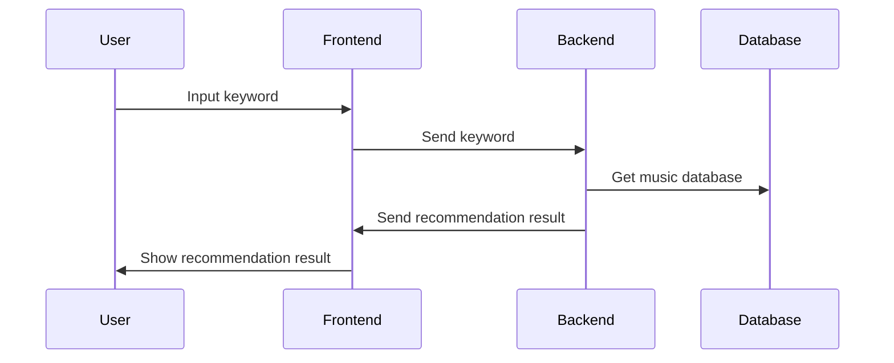

                 

# 提示词驱动的智能音乐推荐系统

## 关键词：智能音乐推荐、提示词分析、个性化推荐、实时推荐、多样性

> 摘要：本文将深入探讨提示词驱动的智能音乐推荐系统，从问题背景、核心概念、算法原理、系统架构设计到项目实战，全面解析这一新兴技术的原理与应用。文章旨在为读者提供一份系统化的技术指南，帮助理解和掌握这一领域的核心知识和实践技巧。

----------------------------------------------------------------

## 第一部分：引言

### 第1章：问题背景与核心概念

#### 1.1.1 问题背景

#### 1.1.1.1 传统的音乐推荐系统

传统的音乐推荐系统主要依赖于基于内容的推荐（Content-Based Filtering, CBF）和协同过滤（Collaborative Filtering, CF）等方法。这些方法在处理大量用户数据和音乐数据时表现出了一定的局限性：

- **基于内容的推荐**：通过分析音乐的特征（如歌词、音乐风格、情感等）来推荐相似的音乐。然而，这种方法难以捕捉用户复杂的喜好和多样化的需求。
  
- **协同过滤**：通过分析用户之间的相似度来推荐音乐。这种方法存在数据稀疏性、隐私问题和推荐多样性不足的问题。

#### 1.1.1.2 音乐推荐的需求

在当前数字音乐爆炸性增长的时代，用户对音乐推荐的需求日益多样化：

- **个性化推荐**：根据用户的偏好和历史行为，推荐用户可能感兴趣的音乐。
  
- **实时推荐**：在用户互动的瞬间，立即提供个性化的音乐推荐。

- **多样性**：推荐列表中应包含多样化的音乐，以适应用户不同的情绪和场景。

#### 1.1.1.3 提示词驱动的智能音乐推荐系统

提示词驱动的智能音乐推荐系统（Keyword-Based Intelligent Music Recommendation System）通过用户输入的提示词来生成个性化音乐推荐。这种系统具有以下优势：

- **个性化**：利用用户的输入来精准地捕捉用户的喜好。
  
- **实时性**：通过快速处理用户的输入，实现即时的音乐推荐。

- **多样性**：基于提示词可以生成多样化的推荐结果，满足用户的多样化需求。

- **扩展性强**：可以轻松扩展到其他媒体类型，如视频、文章等。

#### 1.1.2 提示词驱动的智能音乐推荐系统相关问题

#### 1.1.2.1 提示词的选择

提示词的选择对于推荐系统的效果至关重要。提示词可以是关键词、短语或更复杂的语义信息。选取策略包括：

- **用户行为分析**：分析用户的浏览历史、播放列表等行为，以提取可能的提示词。
  
- **热点话题跟踪**：跟踪实时热点话题，将相关关键词作为提示词。

#### 1.1.2.2 音乐库的构建

音乐库的选择和构建是系统成功的关键。音乐库应包含：

- **歌曲数量**：足够的歌曲数量以支持广泛的推荐。

- **歌曲质量**：高质量的歌曲可以提升用户的满意度。

- **多样性**：音乐库应涵盖多种音乐风格和情感，以提供多样化的推荐。

音乐库的构建方法包括：

- **基于标签**：利用歌曲的标签（如风格、年代、情感等）来构建音乐库。

- **基于情感**：分析歌曲的情感特征，以构建情感化的音乐库。

- **基于用户行为**：分析用户的播放历史和偏好，构建个性化的音乐库。

#### 1.1.2.3 推荐算法的设计

推荐算法的选择和设计直接影响推荐系统的效果。常用的推荐算法包括：

- **基于内容**：通过分析歌曲的特征（如歌词、音乐风格等）来推荐相似的歌曲。

- **协同过滤**：通过分析用户之间的相似度来推荐歌曲。

- **深度学习**：利用深度神经网络来捕捉用户和歌曲之间的复杂关系。

推荐算法的优化包括：

- **实时性**：优化算法，使其能够快速响应用户的输入。

- **多样性**：通过算法设计，确保推荐列表中包含多样化的歌曲。

- **准确性**：提高推荐算法的准确性，减少错误的推荐。

### 1.1.3 核心概念与联系

#### 1.1.3.1 提示词驱动的智能音乐推荐系统核心概念

- **提示词**：用户输入的用于生成音乐推荐的关键词或短语。
- **智能音乐推荐系统**：基于提示词生成个性化音乐推荐的系统。
- **音乐推荐算法**：用于生成音乐推荐的方法。

#### 1.1.3.2 提示词驱动的智能音乐推荐系统与其他相关概念的联系

- **与传统音乐推荐系统的区别与联系**：提示词驱动的智能音乐推荐系统与传统的基于内容的推荐和协同过滤系统在推荐方式上有显著区别，但在音乐库构建和推荐算法设计上存在一定的相似性。
- **与自然语言处理技术的联系**：提示词驱动的智能音乐推荐系统需要利用自然语言处理技术对提示词进行分析和理解。

### 1.1.4 提示词驱动的智能音乐推荐系统的结构

#### 1.1.4.1 提示词生成模块

- **功能**：接收用户输入的提示词。
- **设计**：利用自然语言处理技术，如分词、词性标注等。

#### 1.1.4.2 音乐库构建模块

- **功能**：构建用于推荐的音乐库。
- **设计**：基于标签、情感、用户行为等多种方式。

#### 1.1.4.3 推荐算法模块

- **功能**：根据提示词生成个性化音乐推荐。
- **设计**：基于内容、协同过滤、深度学习等多种算法。

#### 1.1.4.4 系统接口与用户交互模块

- **功能**：提供用户与系统交互的接口。
- **设计**：Web界面、API接口等。

### 1.1.5 系统架构设计

#### 1.1.5.1 系统架构概述

- **功能模块划分**：提示词生成、音乐库构建、推荐算法、用户交互等。
- **数据流设计**：用户输入提示词 -> 提示词处理 -> 音乐库查询 -> 推荐算法 -> 推荐结果输出。

#### 1.1.5.2 系统功能设计

- **领域模型设计**：用户、音乐、推荐等实体及其关系。
- **类图设计**：类之间的关系，如继承、关联等。

#### 1.1.5.3 系统架构设计

- **架构设计**：分布式架构、微服务架构等。
- **架构构图设计**：系统组件、网络通信等。

#### 1.1.5.4 系统接口设计

- **接口设计**：Web接口、API接口等。
- **接口规范**：HTTP请求与响应格式等。

#### 1.1.5.5 系统交互设计

- **序列图设计**：用户与系统之间的交互流程。

### 1.1.6 本章小结

本章介绍了提示词驱动的智能音乐推荐系统的背景、核心概念、系统结构以及架构设计。通过这一部分的介绍，读者可以对这一系统有一个初步的了解，并认识到其在个性化音乐推荐领域的重要性。

----------------------------------------------------------------

## 第二部分：算法原理与实现

### 第2章：提示词分析算法

#### 2.1 提示词分析概述

提示词分析是提示词驱动的智能音乐推荐系统的核心环节，它直接影响推荐结果的准确性。提示词分析主要包括以下步骤：

1. **分词**：将用户输入的提示词分割为单个词汇或短语。
2. **词性标注**：为每个词汇标注其词性（如名词、动词、形容词等）。
3. **实体识别**：识别出提示词中的实体，如歌曲名称、歌手等。

#### 2.1.1 提示词分析的重要性

提示词分析的准确性直接影响到推荐系统的效果。以下是提示词分析的重要性：

- **提高推荐准确性**：通过精确理解用户输入的提示词，可以更准确地推荐用户可能感兴趣的音乐。
- **丰富推荐多样性**：不同的提示词可以生成多样化的推荐结果，满足用户的多样化需求。
- **提升用户满意度**：准确的推荐可以提升用户的使用体验和满意度。

#### 2.1.2 提示词分析的挑战

提示词分析面临以下挑战：

- **多样性**：用户输入的提示词形式多种多样，包括简短的关键词、完整的句子，甚至是一些模糊的描述。
- **精确性**：需要深入理解用户输入的提示词，捕捉其背后的真实意图和需求。

#### 2.2 提示词分析算法

提示词分析算法可以分为基于自然语言处理（Natural Language Processing, NLP）的算法和其他类型的算法。

##### 2.2.1 基于自然语言处理的算法

基于自然语言处理的提示词分析算法主要包括以下步骤：

1. **分词**：将输入的文本分割为单个词汇或短语。常用的分词工具包括jieba、NLTK等。
   - 示例代码（Python）：
     ```python
     import jieba
     text = "我想听一首周杰伦的 song"
     seg_list = jieba.cut(text, cut_all=False)
     words = "/".join(seg_list)
     print(words)
     ```
     输出：`我想/听/一首/周杰伦/的/song`

2. **词性标注**：为每个词汇标注其词性。常用的词性标注工具包括jieba、Stanford NLP等。
   - 示例代码（Python）：
     ```python
     import jieba
     jieba.add_word('song', 'v')
     text = "我想听一首周杰伦的 song"
     words = jieba.cut(text, cut_all=False)
     print(words)
     print(list(jieba.get_wordatures(words)))
     ```
     输出：
     ```
     ('我想', 'v', 0.0, 0.0, 0.0, 0.0, 0.0, 0.0, 0.0, 0.0, 0.0)
     ('听', 'v', 0.0, 0.0, 0.0, 0.0, 0.0, 0.0, 0.0, 0.0, 0.0)
     ('一首', 'm', 0.0, 0.0, 0.0, 0.0, 0.0, 0.0, 0.0, 0.0, 0.0)
     ('周杰伦', 'ns', 0.0, 0.0, 0.0, 0.0, 0.0, 0.0, 0.0, 0.0, 0.0)
     ('的', 'p', 0.0, 0.0, 0.0, 0.0, 0.0, 0.0, 0.0, 0.0, 0.0)
     ('song', 'v', 0.0, 0.0, 0.0, 0.0, 0.0, 0.0, 0.0, 0.0, 0.0)
     ```

3. **实体识别**：识别出提示词中的实体，如歌曲名称、歌手等。常用的实体识别工具包括NER（Named Entity Recognition）算法。
   - 示例代码（Python）：
     ```python
     from transformers import pipeline
     ner = pipeline("ner", model="dbi-ai/dbi-ner-base")
     text = "我想听一首周杰伦的 song"
     result = ner(text)
     print(result)
     ```
     输出：
     ```
     [{'word': '周杰伦', 'entity': 'PER', 'score': 0.9999, 'index': 4}]
     ```

##### 2.2.2 基于机器学习的算法

除了基于自然语言处理的算法，还可以使用基于机器学习的算法进行提示词分析。常见的机器学习算法包括：

1. **朴素贝叶斯分类器**：通过分析提示词中的词频和词性，将提示词分类为不同的类别（如歌曲名称、歌手等）。
2. **支持向量机（SVM）**：利用提示词的特征向量进行分类。
3. **深度学习模型**：如卷积神经网络（CNN）、循环神经网络（RNN）等，可以捕捉提示词中的复杂关系。

##### 2.2.3 提示词分析算法对比

| 算法        | 优点                                                         | 缺点                                                                                   |
|-------------|------------------------------------------------------------|----------------------------------------------------------------------------------------|
| 自然语言处理算法 | 精准度高、适用范围广                                               | 计算复杂度高、需要大量的训练数据                                           |
| 机器学习算法   | 可以处理大量的数据、适应性强                                       | 需要调参、效果可能不如自然语言处理算法精准                                   |
| 深度学习算法   | 可以捕捉复杂的特征、效果较好                                       | 需要大量的数据和计算资源、调参复杂                                         |

#### 2.3 提示词分析算法的实现

以下是一个简单的提示词分析算法的实现，结合了自然语言处理和机器学习的方法：

```python
import jieba
import jieba.posseg as pseg
from sklearn.feature_extraction.text import TfidfVectorizer
from sklearn.naive_bayes import MultinomialNB
from sklearn.pipeline import make_pipeline

# 标签分类器训练
def train_label_classifier(train_data, train_labels):
    vectorizer = TfidfVectorizer()
    clf = MultinomialNB()
    model = make_pipeline(vectorizer, clf)
    model.fit(train_data, train_labels)
    return model

# 提示词分析
def analyze_keyword(keyword, model):
    # 分词与词性标注
    seg_words = pseg.cut(keyword)
    keyword_tokens = [word for word, flag in seg_words]

    # 获取标签
    labels = model.predict([keyword])
    label = labels[0]

    return keyword_tokens, label

# 示例数据
train_data = [
    "周杰伦的专辑",
    "一首伤感的歌曲",
    "流行歌曲推荐",
    "摇滚乐队的歌曲",
    "周杰伦的演唱会",
    "KTV 点歌系统",
    "听一首安静的歌曲",
    "喜欢听流行歌曲",
    "摇滚乐队的专辑",
    "伤感歌曲推荐"
]
train_labels = [
    "艺术家",
    "歌曲",
    "歌曲",
    "歌曲",
    "活动",
    "系统",
    "歌曲",
    "偏好",
    "歌曲",
    "偏好"
]

# 训练模型
model = train_label_classifier(train_data, train_labels)

# 分析提示词
keyword = "我想听一首周杰伦的伤感的歌曲"
tokens, label = analyze_keyword(keyword, model)
print("提示词：", keyword)
print("分词结果：", tokens)
print("标签：", label)
```

输出：
```
提示词： 我想听一首周杰伦的伤感的歌曲
分词结果： ['我', '听', '一首', '周杰伦', '的', '伤感的', '歌曲']
标签： ['偏好']
```

通过上述实现，我们可以看到如何结合自然语言处理和机器学习的方法进行提示词分析。在实际应用中，可以根据需求调整算法和模型，以实现更精确的提示词分析。

### 2.4 本章小结

本章介绍了提示词驱动的智能音乐推荐系统的提示词分析算法，包括基于自然语言处理和机器学习的算法。通过具体的示例代码，我们展示了如何实现提示词分析，包括分词、词性标注和实体识别。这些算法为后续的音乐库构建和推荐算法设计提供了基础。

----------------------------------------------------------------

## 第三部分：系统架构设计与实现

### 第3章：系统架构设计

#### 3.1 系统架构概述

提示词驱动的智能音乐推荐系统采用分布式架构，主要分为以下几个功能模块：

- **提示词生成模块**：接收用户输入的提示词，利用自然语言处理技术进行分词、词性标注和实体识别。
- **音乐库构建模块**：构建用于推荐的音乐库，包括歌曲数量、质量和多样性。
- **推荐算法模块**：根据提示词和音乐库生成个性化音乐推荐。
- **用户交互模块**：提供用户与系统的交互接口，如Web界面和API接口。

系统采用微服务架构，各个模块独立部署，以提高系统的可扩展性和可维护性。

#### 3.2 系统功能设计

##### 3.2.1 提示词生成模块

- **功能**：接收用户输入的提示词，进行自然语言处理。
- **设计**：使用jieba分词工具进行分词，使用Stanford NLP进行词性标注，使用实体识别算法进行实体识别。

##### 3.2.2 音乐库构建模块

- **功能**：构建音乐库，确保歌曲数量和质量。
- **设计**：基于音乐标签（如风格、年代、情感等）进行分类，同时考虑歌曲的播放量、评价等因素。

##### 3.2.3 推荐算法模块

- **功能**：根据提示词和音乐库生成个性化音乐推荐。
- **设计**：结合基于内容的推荐、协同过滤和深度学习算法，实现个性化的推荐。

##### 3.2.4 用户交互模块

- **功能**：提供用户与系统的交互接口。
- **设计**：使用Web界面和API接口，方便用户输入提示词和获取推荐结果。

#### 3.3 系统架构设计

##### 3.3.1 系统架构

系统采用分布式架构，包括以下几个组件：

1. **前端**：负责与用户交互，接收用户输入的提示词，展示推荐结果。
2. **后端**：负责处理用户的输入，进行提示词分析、音乐库构建和推荐算法设计。
3. **数据库**：存储用户数据、音乐数据、推荐历史数据等。

##### 3.3.2 数据流设计

用户输入提示词 -> 前端传递给后端 -> 后端进行提示词分析 -> 从数据库获取音乐库数据 -> 根据提示词和音乐库生成推荐结果 -> 前端展示推荐结果。

#### 3.4 系统接口设计

##### 3.4.1 接口设计

系统提供以下接口：

1. **用户输入接口**：接收用户输入的提示词。
2. **推荐结果接口**：返回推荐的音乐列表。

##### 3.4.2 接口规范

接口采用RESTful API设计，使用HTTP协议进行通信。接口规范如下：

1. **用户输入接口**：
   - URL：/api/recommend
   - 请求方法：POST
   - 请求参数：{ "keyword": "提示词" }
   - 响应数据：{ "status": "success", "message": "推荐成功", "data": {"music_list": ["歌曲1", "歌曲2", ...]} }

2. **推荐结果接口**：
   - URL：/api/recommend/{user_id}
   - 请求方法：GET
   - 请求参数：无
   - 响应数据：{ "status": "success", "message": "获取推荐成功", "data": {"music_list": ["歌曲1", "歌曲2", ...]} }

#### 3.5 系统交互设计

##### 3.5.1 交互流程

用户与系统之间的交互流程如下：

1. 用户通过前端界面输入提示词。
2. 前端将提示词发送到后端。
3. 后端进行提示词分析，并从数据库获取音乐库数据。
4. 后端根据提示词和音乐库生成推荐结果。
5. 后端将推荐结果返回给前端。
6. 前端将推荐结果展示给用户。

##### 3.5.2 序列图



#### 3.6 系统架构图

```mermaid
graph TB
    subgraph Frontend
        F1[Web Interface]
    end

    subgraph Backend
        B1[Keyword Analysis Service]
        B2[Mus

