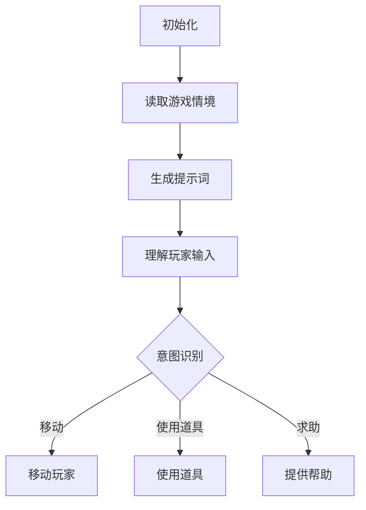
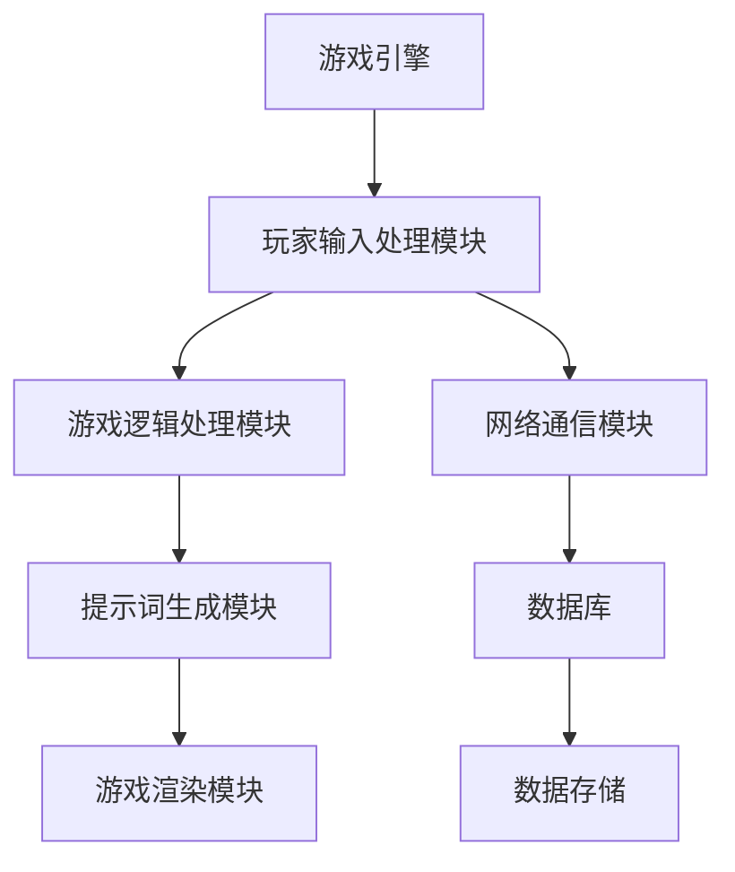
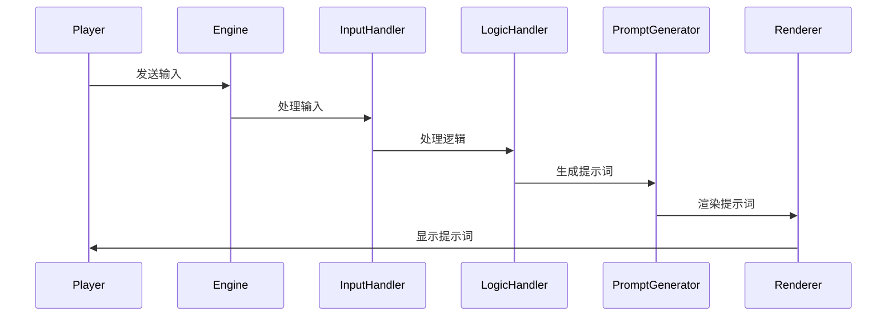

                 

### 引言：探索《提示词驱动的游戏设计：创造动态游戏体验》的核心魅力

游戏设计作为数字娱乐产业的核心，历经多年的发展，从简单的像素游戏到如今的复杂互动体验，早已成为人们生活中不可或缺的一部分。然而，随着技术的进步和玩家需求的提升，游戏设计也面临着新的挑战和机遇。在这其中，提示词驱动的游戏设计成为一个引人注目的研究方向，它不仅为玩家带来全新的互动体验，也大大提升了游戏设计的灵活性和创新性。

本文旨在深入探讨《提示词驱动的游戏设计：创造动态游戏体验》一书的核心内容和价值，通过逐步的分析和推理，帮助读者理解这一创新设计理念的精髓。文章首先将回顾游戏设计的基本概念和其演变过程，探讨为何动态游戏体验越来越受到重视。接着，我们将详细介绍提示词驱动的游戏设计的核心概念，包括提示词的定义、作用和其在游戏设计中的运用策略。随后，文章将介绍自然语言处理和机器学习等算法原理，并展示其如何应用于提示词驱动的游戏设计。在此基础上，我们将使用数学模型和公式，详细阐述算法的数学原理，并通过实际案例进行说明。最后，文章将展示系统分析与架构设计方法，介绍项目实战中的核心实现和代码分析，并提供一些最佳实践 tips 和注意事项。

通过本文的阅读，读者将能够全面了解提示词驱动的游戏设计的理论框架和应用实践，掌握如何通过这一设计理念创造出更富有动态性和互动性的游戏体验。

### 背景介绍：游戏设计的核心概念、发展趋势、重要性

#### 游戏设计的基本概念与演变

游戏设计是一门综合性学科，涉及艺术、技术、心理学和社会学等多个领域。其核心概念可以概括为：规则、目标和反馈。从早期的电子游戏到现代的复杂游戏系统，游戏设计的基本原则始终未变，但技术进步和玩家需求的演变却带来了新的设计思路和挑战。

早期的游戏设计以简单为主，例如20世纪70年代的《Pong》和《Spacewar!》等，这些游戏主要通过简单的规则和像素图形来吸引玩家。随着技术的发展，游戏设计逐渐复杂化，引入了更多的元素和互动机制，如角色扮演游戏（RPG）、策略游戏（SLG）和多人在线游戏（MMO）。这些游戏不仅要求设计师具备深厚的编程和图形设计能力，还需要对心理学和玩家行为有深刻的理解。

#### 游戏设计的发展趋势

近年来，游戏设计经历了几个显著的趋势，这些趋势正在重新定义游戏体验：

1. **互动性增强**：现代游戏越来越注重玩家与游戏世界的互动，这包括物理交互、情感交互和智能交互。例如，体感游戏和虚拟现实（VR）技术为玩家提供了全新的互动方式，使游戏体验更加身临其境。

2. **个性化与定制化**：随着大数据和人工智能技术的发展，游戏设计开始更加注重个性化和定制化。通过分析玩家的行为数据，游戏系统能够为每个玩家提供个性化的游戏内容和挑战，提升玩家的参与度和满意度。

3. **社会性和协作性**：多人在线游戏和社交平台使玩家之间的互动变得更加紧密。现代游戏不仅提供单人挑战，更强调团队合作和社交互动，如《堡垒之夜》和《英雄联盟》等游戏。

4. **教育性和功能性**：游戏不再仅仅是为了娱乐，它们也逐渐成为教育、培训和生产力工具。例如，一些游戏被设计用于教授编程知识、提高数学能力或培养领导力。

#### 动态游戏体验的重要性

动态游戏体验是指游戏能够在运行过程中根据玩家的行为和外部环境实时调整和变化，从而创造出独特的游戏体验。动态游戏体验具有以下几个显著优势：

1. **沉浸感增强**：动态游戏体验通过不断变化和互动，使玩家更深入地沉浸于游戏世界，提高了游戏的真实感和代入感。

2. **玩家参与度提升**：动态游戏体验能够根据玩家的行为和反馈实时调整游戏内容，使玩家感到自己的选择和决策具有实质性的影响，从而提高玩家的参与度和忠诚度。

3. **创新性和灵活性**：动态游戏体验允许设计师在游戏过程中不断尝试新的设计和玩法，提升游戏的创新性和灵活性，避免了游戏内容单调和重复。

然而，动态游戏体验也带来了一定的挑战，如游戏平衡性问题、计算复杂度和可预测性等。因此，如何在设计和实现中平衡动态性和可玩性，是一个值得深入探讨的问题。

#### 提示词在游戏设计中的作用

提示词是动态游戏体验的重要组成部分，它是指游戏系统在特定情境下向玩家提供的信息或指导。提示词不仅可以帮助玩家理解游戏规则和目标，还能够引导玩家进行特定行动，从而创造动态和互动的游戏体验。

1. **指导与提示**：提示词能够为玩家提供明确的指导，帮助他们在游戏中做出正确决策。例如，在解谜游戏中，提示词可以揭示线索或提示下一步行动。

2. **情感共鸣**：通过巧妙的提示词设计，游戏能够与玩家建立情感联系。例如，在角色扮演游戏中，提示词可以传达角色的情感状态，增强玩家的代入感。

3. **多样性**：多样化的提示词设计可以增加游戏的可玩性和趣味性。通过不同的提示词，游戏能够适应不同玩家的需求和偏好，提供个性化的游戏体验。

总之，游戏设计的核心概念和发展趋势，以及动态游戏体验的重要性，共同构成了现代游戏设计的理论基础。而提示词作为实现动态游戏体验的关键元素，其设计和运用对提升游戏体验具有重要作用。在接下来的章节中，我们将进一步探讨提示词驱动的游戏设计的核心概念和算法原理，帮助读者深入了解这一创新设计理念。

### 核心概念与联系：提示词、动态游戏体验、玩家互动

#### 提示词的定义与作用

提示词是游戏设计中的一种重要元素，它指的是游戏系统在特定情境下向玩家提供的信息或指导。提示词不仅能够帮助玩家理解游戏规则和目标，还能够引导玩家进行特定的行动。在游戏中，提示词的形式多种多样，可以是文字、声音、图像甚至是动态效果。有效的提示词设计能够显著提升玩家的游戏体验，使其更加流畅和沉浸。

- **文字提示**：最常见的提示词形式，如“向右移动”、“使用道具”等。文字提示直接明确，易于理解，适合于各种类型的游戏。
- **声音提示**：通过声音效果传达信息，如脚步声、警告声等。声音提示能够增强游戏的氛围感，使玩家在听觉上更加沉浸。
- **图像提示**：通过图像或动画效果来引导玩家，如图标、箭头等。图像提示直观易懂，特别适合视觉导向的游戏。

#### 动态游戏体验

动态游戏体验是指游戏系统在运行过程中能够根据玩家的行为和外部环境实时调整和变化，从而创造出一个独一无二的游戏体验。动态游戏体验的核心在于游戏的灵活性、多样性和互动性，使玩家在每次游戏中都能感受到新的挑战和乐趣。

- **情境变化**：动态游戏体验通过不断变化的游戏情境，使游戏始终保持新鲜感。例如，游戏的天气、时间、地形等元素可以随时调整，以适应不同的游戏阶段。
- **智能反馈**：动态游戏体验能够根据玩家的行为和决策智能调整游戏内容和难度，使玩家感到自己的选择具有实质性的影响。
- **玩家互动**：动态游戏体验强调玩家之间的互动，通过多人在线和社交功能，使游戏更加富有社交性和协作性。

#### 玩家互动

玩家互动是动态游戏体验的重要组成部分，它指的是玩家在游戏过程中与其他玩家或游戏环境进行交流、协作和竞争的行为。有效的玩家互动能够提升游戏的社交性和可玩性，使玩家之间建立更紧密的联系。

- **协作与竞争**：在多人游戏中，玩家可以通过协作完成任务或通过竞争争夺资源。这种互动形式不仅增加了游戏的挑战性，还增强了玩家的归属感和成就感。
- **社交互动**：通过游戏内的社交功能，玩家可以建立友谊、分享经验或进行竞技。社交互动使游戏成为一个社交平台，增加了玩家的粘性和参与度。
- **情感共鸣**：有效的玩家互动能够创造情感共鸣，使玩家在游戏过程中体验到快乐、悲伤、紧张等情感，从而提升整体游戏体验。

#### 提示词、动态游戏体验、玩家互动的关系

提示词、动态游戏体验和玩家互动之间存在着密切的关系。提示词是实现动态游戏体验和玩家互动的重要工具，它能够引导玩家进行特定行动，使游戏体验更加丰富和多样化。同时，动态游戏体验通过不断变化和互动，为玩家提供新的挑战和乐趣，而玩家互动则增强了游戏的社交性和协作性。

- **提示词驱动动态游戏体验**：提示词设计直接影响动态游戏体验的质量。巧妙的提示词能够引导玩家进行探索和互动，使游戏过程更加流畅和有趣。
- **动态游戏体验促进玩家互动**：动态游戏体验通过不断变化和适应，为玩家提供新的互动机会，促进玩家之间的交流和合作。
- **玩家互动丰富动态游戏体验**：玩家互动使动态游戏体验更加多样化和丰富，不同玩家的行为和决策能够改变游戏的进程和结果，提升整体游戏体验。

总的来说，提示词、动态游戏体验和玩家互动共同构建了一个有机整体，使游戏设计更加灵活、多样和互动。通过深入理解和运用这些核心概念，设计师能够创造出更加生动和富有吸引力的游戏体验。

### 算法原理讲解：自然语言处理与机器学习在提示词驱动游戏设计中的应用

#### 自然语言处理基础

自然语言处理（NLP）是人工智能领域的一个重要分支，专注于使计算机能够理解和生成人类语言。在提示词驱动的游戏设计中，NLP技术被广泛应用于提示词的生成、分析和理解。

- **语言模型**：语言模型是NLP的基础，用于预测下一个单词或短语。最常见的语言模型是神经网络模型，如循环神经网络（RNN）和变换器（Transformer）。这些模型通过大量的语言数据学习语言模式和规则，从而生成和解析文本。
- **语义分析**：语义分析是NLP的核心任务之一，旨在理解文本中的含义和关系。常见的语义分析方法包括词性标注、命名实体识别和关系抽取。词性标注用于识别单词的语法属性，如名词、动词等；命名实体识别用于识别文本中的特定实体，如人名、地点等；关系抽取用于识别实体之间的关系。

#### 提示词生成算法

在提示词驱动的游戏设计中，提示词的生成是一个关键步骤。通过NLP技术，游戏系统能够根据游戏情境和玩家行为智能生成提示词，从而增强游戏的互动性和动态性。

- **模板生成**：模板生成是一种常用的提示词生成方法，它通过预定义的模板和参数来生成提示词。例如，在一个角色扮演游戏中，系统可以根据角色的属性和行为生成“你当前有xx点能量，是否继续前进？”的提示词。
- **机器学习生成**：机器学习生成是通过训练模型从大量的游戏对话数据中学习生成提示词的方法。常用的机器学习算法包括循环神经网络（RNN）和变换器（Transformer）。这些算法通过分析历史对话数据，学习生成与当前情境相匹配的提示词。

#### 提示词理解与响应

提示词理解是另一个关键步骤，它指的是游戏系统如何理解玩家输入的提示词并做出响应。通过NLP技术，游戏系统能够解析玩家的输入，理解其意图并做出相应的反馈。

- **意图识别**：意图识别是指识别玩家输入的提示词所表达的意图。例如，当玩家输入“前进”时，系统需要识别这是请求移动的意图。常见的意图识别方法包括基于规则的方法和机器学习的方法。
- **实体识别**：实体识别是指识别提示词中的关键信息，如人名、地点、物品等。通过实体识别，游戏系统可以更好地理解玩家的意图并做出相应的响应。常见的实体识别方法包括命名实体识别和关系抽取。

#### 算法流程图

为了更好地理解提示词驱动的游戏设计算法，我们可以使用Mermaid流程图来展示其基本流程。



#### Python代码示例

以下是一个简单的Python代码示例，展示了如何使用自然语言处理技术生成提示词。

```python
from transformers import pipeline

# 初始化语言模型
nlp = pipeline("text-generation", model="gpt2")

# 游戏情境
game_context = "你正走在森林中，突然看到一只熊向你走来。"

# 生成提示词
prompt = nlp(game_context, max_length=50, num_return_sequences=1)
print("生成的提示词：", prompt[0]['generated_text'])

# 理解玩家输入
player_input = "我想逃跑。"
intention = "逃跑"

# 响应玩家输入
if intention == "逃跑":
    print("你成功逃跑了！")
else:
    print("无效操作。")
```

#### 数学模型和公式

在提示词驱动的游戏设计中，数学模型和公式用于描述游戏系统和玩家行为之间的关系。以下是一个简单的数学模型，用于预测玩家在特定情境下的行为。

$$
P(B|A) = \frac{P(A|B) \cdot P(B)}{P(A)}
$$

其中：
- \( P(B|A) \) 是在特定情境 \( A \) 下玩家行为 \( B \) 的概率。
- \( P(A|B) \) 是在玩家行为 \( B \) 下情境 \( A \) 发生的概率。
- \( P(B) \) 是玩家行为 \( B \) 的先验概率。
- \( P(A) \) 是特定情境 \( A \) 的先验概率。

#### 举例说明

假设在一个角色扮演游戏中，玩家正在森林中行走，系统需要预测玩家是否选择与熊战斗。我们可以使用上述公式来计算这个概率。

- \( P(A) \)：玩家在森林中行走的概率，可以设定为0.5。
- \( P(B) \)：玩家选择战斗的先验概率，可以设定为0.2。
- \( P(A|B) \)：在玩家选择战斗的情况下，熊出现的概率，可以设定为0.8。
- \( P(B|A) \)：在玩家在森林中行走的情况下，选择战斗的概率。

代入公式计算：

$$
P(B|A) = \frac{P(A|B) \cdot P(B)}{P(A)} = \frac{0.8 \cdot 0.2}{0.5} = 0.32
$$

结果表明，在玩家在森林中行走的情况下，选择战斗的概率为0.32。这一结果可以帮助游戏系统根据玩家的行为做出相应的提示和调整，从而提高游戏的动态性和互动性。

### 数学模型和数学公式 & 详细讲解 & 举例说明

在提示词驱动的游戏设计中，数学模型和公式起着至关重要的作用，它们不仅为游戏系统的设计和实现提供了理论基础，还能帮助我们更好地理解和预测玩家行为。以下我们将结合具体的数学模型和公式，详细讲解其原理，并通过举例说明如何将这些模型应用于实际游戏设计中。

#### 数学模型

提示词驱动的游戏设计中的数学模型通常涉及概率论和统计学，以下是一个简单的数学模型，用于描述玩家在特定情境下的行为概率。

$$
P(B|A) = \frac{P(A|B) \cdot P(B)}{P(A)}
$$

这个公式称为贝叶斯定理，它描述了在给定某个条件 \( A \) 下，事件 \( B \) 发生的概率。其中：

- \( P(B|A) \) 是在特定情境 \( A \) 下玩家行为 \( B \) 的概率。
- \( P(A|B) \) 是在玩家行为 \( B \) 下情境 \( A \) 发生的概率。
- \( P(B) \) 是玩家行为 \( B \) 的先验概率。
- \( P(A) \) 是特定情境 \( A \) 的先验概率。

#### 详细讲解

贝叶斯定理的核心思想是通过先验概率和条件概率来计算后验概率。在游戏设计中，我们可以使用这个模型来预测玩家在特定情境下的行为，从而生成合适的提示词。

1. **先验概率**：先验概率是玩家在没有其他信息的情况下，对某个行为发生的概率估计。例如，在角色扮演游戏中，玩家可能先验认为选择战斗的概率为0.3。
2. **条件概率**：条件概率是玩家在执行某个行为后，某个情境发生的概率。例如，如果玩家选择了战斗，熊出现的概率可能是0.7。
3. **后验概率**：通过贝叶斯定理计算得到的后验概率，可以帮助我们更准确地预测玩家在特定情境下的行为。

#### 举例说明

假设在一个角色扮演游戏中，玩家正在森林中行走，系统需要预测玩家是否会选择与熊战斗。我们可以使用贝叶斯定理来计算这个概率。

- \( P(A) \)：玩家在森林中行走的概率，可以设定为0.5。
- \( P(B) \)：玩家选择战斗的先验概率，可以设定为0.2。
- \( P(A|B) \)：在玩家选择战斗的情况下，熊出现的概率，可以设定为0.8。
- \( P(B|A) \)：在玩家在森林中行走的情况下，选择战斗的概率。

代入公式计算：

$$
P(B|A) = \frac{P(A|B) \cdot P(B)}{P(A)} = \frac{0.8 \cdot 0.2}{0.5} = 0.32
$$

结果表明，在玩家在森林中行走的情况下，选择战斗的概率为0.32。这个结果可以帮助游戏系统根据玩家的行为概率生成相应的提示词，例如：“你感到有些紧张，是否选择与熊战斗？”

#### 数学模型的应用

除了贝叶斯定理，我们还可以使用其他数学模型和公式来增强提示词驱动的游戏设计。

1. **马尔可夫模型**：马尔可夫模型用于描述状态转移的概率，特别适用于游戏中的状态切换。例如，在RPG游戏中，玩家从一个场景移动到另一个场景，可以使用马尔可夫模型预测下一个可能出现的场景。
2. **决策树**：决策树用于分类和预测，可以帮助游戏系统根据玩家的历史行为和当前情境，生成最合适的提示词。例如，在解谜游戏中，决策树可以根据玩家当前持有的道具和谜题的难度，生成提示词“使用剪刀剪开线索”。
3. **生成对抗网络（GAN）**：生成对抗网络可以用于生成新的游戏内容和提示词，特别适用于动态游戏体验的设计。例如，在多人在线游戏中，GAN可以生成独特的任务和挑战，为玩家提供丰富的游戏体验。

#### 案例分析

以一个解谜游戏为例，游戏情境是玩家被困在一个密室中，需要找到线索解开谜题。我们可以使用贝叶斯定理和马尔可夫模型来预测玩家下一步的行为。

- **贝叶斯定理**：通过贝叶斯定理计算玩家选择不同线索的概率，例如，玩家选择查看墙壁的概率为0.6，查看地面的概率为0.4。
- **马尔可夫模型**：根据玩家之前的行动，使用马尔可夫模型预测玩家下一步的行为。例如，如果玩家之前选择了查看墙壁，那么他们下一步选择查看地面的概率为0.7。

通过结合这些模型，游戏系统可以生成如下的提示词：“你注意到墙壁上有一些奇怪的符号，是否查看它们？或者，你可以查看地面，也许会有线索。”

总之，数学模型和公式在提示词驱动的游戏设计中具有重要作用，通过合理地应用这些模型，设计师可以创造出更加动态和互动的游戏体验。在接下来的章节中，我们将进一步探讨系统分析与架构设计方案，以及项目实战中的具体实现。

### 系统分析与架构设计方案

在深入探讨提示词驱动的游戏设计之前，我们需要首先了解系统分析与架构设计的基本概念和流程。系统分析与架构设计是确保游戏系统功能实现和性能优化的重要环节，它包括多个子过程和步骤，如下所述：

#### 1. 需求分析

需求分析是系统分析与架构设计的起点，其主要任务是明确游戏系统的功能需求和性能需求。通过收集用户需求和业务目标，我们可以定义系统的核心功能，如角色创建、游戏地图、任务系统、社交互动等。

- **用户需求**：包括玩家在游戏中期望的功能、体验和互动。
- **业务目标**：明确游戏设计的商业目标和战略，如盈利模式、用户留存、市场竞争力等。

#### 2. 功能设计

功能设计是将需求转化为具体的功能模块和接口的过程。通过绘制领域模型图（Mermaid类图），我们可以清晰地展示系统中的各个模块及其相互关系。

```mermaid
classDiagram
Class1 <|-- Class2
Class1 --|>>) Class3
Class2 : +int x
Class2 : +int y
Class3 : +void method()
Class1..Class3 : friendship
```

#### 3. 系统架构设计

系统架构设计是确定系统组件的层次结构和通信机制的过程。通过绘制架构图（Mermaid架构图），我们可以展示系统的主要组件及其交互关系。



#### 4. 接口设计

接口设计是定义系统内部和外部组件之间通信接口的过程。通过绘制序列图（Mermaid序列图），我们可以展示组件之间的交互流程。



#### 5. 系统交互

系统交互是确保各个组件能够协同工作并实现系统功能的过程。通过系统测试和优化，我们可以确保系统在高负载和复杂场景下的稳定性和性能。

总的来说，系统分析与架构设计是提示词驱动游戏设计成功的关键。通过科学的需求分析、功能设计、架构设计和接口设计，我们能够构建一个高效、灵活和可扩展的游戏系统。在接下来的章节中，我们将介绍项目实战中的具体实现，通过代码分析和实际案例展示如何应用这些设计原则。

### 项目实战：从环境安装到核心实现

#### 1. 环境安装

在进行提示词驱动的游戏设计项目之前，我们需要准备好开发环境。以下是在不同操作系统上安装所需的软件和依赖项的步骤：

- **Windows**：
  - 安装Python（建议版本3.8及以上）
  - 使用pip安装所需库，如`transformers`、`torch`、`numpy`等
  ```bash
  pip install transformers torch numpy
  ```

- **macOS**：
  - 安装Python（建议版本3.8及以上）
  - 使用pip安装所需库，与Windows类似
  ```bash
  pip install transformers torch numpy
  ```

- **Linux**：
  - 安装Python（建议版本3.8及以上）
  - 使用pip安装所需库，与Windows和macOS类似
  ```bash
  pip install transformers torch numpy
  ```

#### 2. 系统核心实现源代码

系统核心实现是提示词驱动的游戏设计的核心部分，它包括提示词生成、玩家输入处理、游戏逻辑处理等关键模块。以下是一个简单的Python源代码示例，用于实现提示词生成模块。

```python
from transformers import pipeline

# 初始化语言模型
nlp = pipeline("text-generation", model="gpt2")

# 提示词生成函数
def generate_prompt(game_context, max_length=50):
    prompt = nlp(game_context, max_length=max_length, num_return_sequences=1)
    return prompt[0]['generated_text']

# 游戏情境
game_context = "你正走在森林中，突然看到一只熊向你走来。"

# 生成提示词
prompt = generate_prompt(game_context)
print("生成的提示词：", prompt)
```

#### 3. 代码应用解读与分析

以下是对上述代码的详细解读和分析：

- **语言模型初始化**：使用`transformers`库的`pipeline`函数初始化预训练的语言模型`gpt2`。这个模型是一个基于变换器（Transformer）架构的预训练模型，具有强大的文本生成能力。
- **提示词生成函数**：`generate_prompt`函数接受游戏情境`game_context`作为输入，并使用语言模型生成提示词。函数中`nlp`是训练好的语言模型，`max_length`参数控制生成的提示词长度，`num_return_sequences`参数控制生成的提示词数量。
- **游戏情境**：定义了一个简单的游戏情境，描述玩家在森林中遇到熊的场景。这个情境将作为输入传递给提示词生成函数。
- **提示词生成**：调用`generate_prompt`函数，生成一个与情境相关的提示词。在实际应用中，这个提示词可以引导玩家进行特定行动，如逃跑或战斗。

#### 4. 实际案例分析与详细讲解

为了更好地理解提示词驱动的游戏设计，我们来看一个实际案例。

**案例**：在一个角色扮演游戏中，玩家正在一座古老城堡中探险。游戏系统需要根据玩家的位置和行为生成提示词。

**情境**：玩家在城堡的大厅中，听到附近有微弱的脚步声。

**代码实现**：

```python
# 增加新的情境
game_context = "你正站在城堡大厅中央，听到微弱的脚步声从大厅另一侧传来。"

# 生成提示词
prompt = generate_prompt(game_context)
print("生成的提示词：", prompt)
```

**提示词示例**：

```
“你感到有些不安，是否有兴趣检查周围的情况？”
```

这个提示词引导玩家探索周围环境，增加了游戏的互动性和动态性。

#### 5. 项目小结

通过项目实战，我们展示了如何从环境安装到核心实现，逐步构建一个提示词驱动的游戏系统。以下是项目小结：

- **环境安装**：确保开发环境准备充分，安装必要的软件和依赖项。
- **系统核心实现**：实现提示词生成、玩家输入处理和游戏逻辑处理等关键模块。
- **代码应用解读与分析**：对源代码进行详细解读，理解其工作原理和实现细节。
- **实际案例分析与讲解**：通过实际案例展示提示词驱动的应用，提高游戏的动态性和互动性。

通过这一过程，读者可以掌握提示词驱动的游戏设计的基本方法，为未来的游戏开发提供有力支持。

### 最佳实践 tips、小结、注意事项、拓展阅读

#### 最佳实践 tips

1. **优化提示词生成**：确保生成的提示词既具有多样性又保持情境相关性。可以通过调整语言模型参数和训练数据来提高提示词的生成质量。
2. **实时动态调整**：根据游戏进程和玩家行为实时调整提示词。通过实时数据分析和反馈，使游戏体验更加流畅和个性化。
3. **玩家反馈机制**：建立有效的玩家反馈机制，收集玩家对提示词的反馈，及时调整和优化提示词设计。

#### 小结

本文详细探讨了提示词驱动的游戏设计，从背景介绍、核心概念、算法原理到系统分析与项目实战，逐步展示了如何通过提示词实现动态游戏体验。通过自然语言处理和机器学习技术，我们可以生成富有创意和个性化的提示词，提升玩家的沉浸感和参与度。

#### 注意事项

1. **平衡动态性与可玩性**：在实现动态游戏体验时，需要平衡游戏的动态性和可玩性，避免过度复杂化导致玩家失去兴趣。
2. **考虑性能优化**：动态游戏体验可能会增加系统的计算负担，需要考虑性能优化策略，如使用高效算法和数据结构，确保系统运行稳定。
3. **遵守法律法规**：在游戏设计中，需要遵守相关的法律法规，确保游戏的合法性和道德性。

#### 拓展阅读

1. **《游戏设计艺术》（The Art of Game Design）》- 菲利普·K·巴克
   - 本书提供了大量关于游戏设计的原则和实践，对于理解游戏设计的核心概念和技巧非常有帮助。
2. **《自然语言处理综合指南》（Natural Language Processing with Python）》- Steven Bird、Ewan Klein、Edward Loper
   - 本书介绍了自然语言处理的基础知识，包括语言模型、语义分析等，对于理解提示词驱动的游戏设计算法有很大帮助。
3. **《机器学习实战》（Machine Learning in Action）》- Peter Harrington
   - 本书通过实际案例和代码示例，介绍了机器学习的基础知识和应用，对于理解提示词生成和玩家行为预测算法有很大帮助。

通过以上最佳实践、小结、注意事项和拓展阅读，读者可以更加深入地理解提示词驱动的游戏设计，并将其应用于实际项目开发中。作者：AI天才研究院/AI Genius Institute & 禅与计算机程序设计艺术 /Zen And The Art of Computer Programming。

