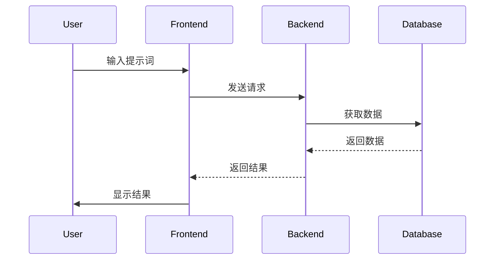
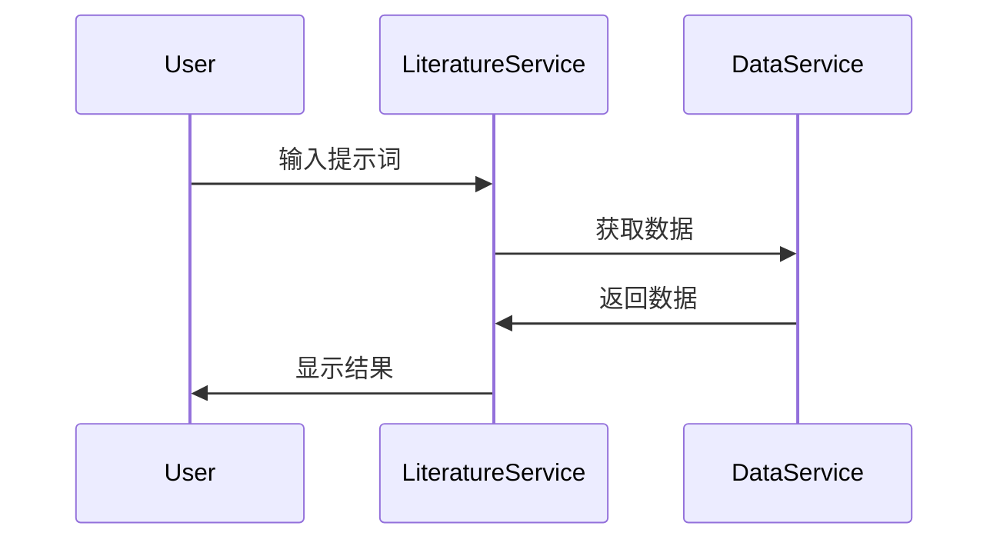

                 


# 提示词驱动的科学发现：加速研究进程

关键词：提示词、科学发现、人工智能、数据分析、机器学习

摘要：本文探讨了提示词驱动的科学发现方法，通过输入特定的提示词，利用人工智能技术自动搜索、分析和处理科学数据，以加速研究进程。文章介绍了提示词驱动的科学发现的核心概念、基本原理、核心优势、应用场景，以及数据分析、算法原理、系统分析与架构设计方案等，旨在为科学家提供一种高效的科学研究工具。

----------------------------------------------------------------

## 第1章：引言与背景介绍

### 1.1 问题背景

在当今信息爆炸的时代，科学研究面临着海量的数据分析和复杂的实验设计。传统的科学发现方式由于受限于人力、时间和资源，往往效率低下。然而，随着人工智能技术的发展，特别是深度学习和自然语言处理等技术的突破，科学研究中开始涌现出一种新的发现模式——提示词驱动的科学发现。

提示词驱动的科学发现利用人工智能技术，通过输入特定的提示词，自动搜索和分析大量相关文献、数据和研究，从而加速研究进程，提高科学发现的效率。这一模式不仅适用于基础科学，如物理学、化学、生物学等领域，也对应用科学，如医学、材料科学、环境科学等具有重要的推动作用。

### 1.2 问题描述

科学研究的复杂性使得研究者面临诸多挑战。例如：

- **数据处理**：如何从海量数据中提取有价值的信息？
- **文献搜索**：如何高效地检索和整理与研究相关的文献？
- **实验设计**：如何设计出高效的实验方案，减少不必要的实验次数？

这些问题严重影响了科学研究的效率和质量。提示词驱动的科学发现通过人工智能技术，能够有效解决上述问题，从而推动科学研究的发展。

### 1.3 问题解决

提示词驱动的科学发现通过以下几个步骤实现：

1. **输入提示词**：研究者根据研究主题输入关键词或提示词。
2. **数据分析**：人工智能系统根据提示词分析大量数据，提取关键信息。
3. **文献检索**：系统自动检索与研究主题相关的文献，并进行整理和筛选。
4. **实验设计**：系统根据数据分析结果，提出实验建议和方案。

### 1.4 边界与外延

提示词驱动的科学发现虽然具有强大的优势，但也有一些边界和限制。例如：

- **数据质量和数量**：数据质量和数量直接影响到分析结果的质量和准确性。
- **算法局限性**：目前的算法还存在一定的局限性，无法完全替代人类专家的判断和思考。
- **伦理和隐私**：在数据处理和实验设计过程中，需要遵守相关的伦理和隐私规定。

### 1.5 概念结构与核心要素组成

#### 1.5.1 提示词

提示词是驱动科学发现的关键因素。它们可以是关键词、短语或句子，用于引导人工智能系统进行数据分析和文献检索。

#### 1.5.2 数据分析

数据分析是提示词驱动的科学发现的核心环节。通过数据挖掘和模式识别技术，系统可以从海量数据中提取有价值的信息。

#### 1.5.3 文献检索

文献检索是科学研究中必不可少的一环。系统自动检索并整理与研究主题相关的文献，为研究者提供丰富的知识资源。

#### 1.5.4 实验设计

实验设计是根据数据分析结果提出的实验建议和方案。它能够帮助研究者更高效地进行实验，减少不必要的实验次数。

### 1.6 本章小结

本章介绍了提示词驱动的科学发现的概念、背景、问题和解决方法，以及其边界和限制。提示词驱动的科学发现为科学研究提供了新的方法和工具，有望在未来的科学研究中发挥更大的作用。

----------------------------------------------------------------

## 第2章：核心概念与联系

### 2.1 提示词驱动的科学发现

#### 2.1.1 概念解析

提示词驱动的科学发现是一种利用人工智能技术，通过输入提示词来自动搜索、分析和处理科学数据，从而加速研究进程的方法。

#### 2.1.2 基本原理

提示词驱动的科学发现主要依赖于自然语言处理、数据挖掘和机器学习等技术。通过输入特定的提示词，系统可以自动检索相关文献、分析数据并生成实验建议。

#### 2.1.3 核心优势

- **效率提升**：通过自动化处理，大幅缩短了文献检索、数据分析和实验设计的时间。
- **精准分析**：利用机器学习算法，提高了数据分析的准确性和可靠性。
- **知识整合**：将散乱的科学数据和信息进行系统整理和整合，为研究者提供全面的知识资源。

#### 2.1.4 应用场景

提示词驱动的科学发现广泛应用于各学科领域，如生物学、化学、物理学、医学等，为科学家提供了强大的研究工具。

### 2.2 数据分析

#### 2.2.1 概念解析

数据分析是指利用统计学、数学和计算机科学等方法，对大量数据进行收集、整理、分析和解释，以发现数据中的规律、趋势和关联性。

#### 2.2.2 基本原理

数据分析的基本原理包括：

1. **数据预处理**：对原始数据进行清洗、去噪、归一化等处理，提高数据的可用性。
2. **数据可视化**：通过图表、图像等形式展示数据的分布、趋势和关系。
3. **特征提取**：从数据中提取有用的特征，用于后续的分析和建模。
4. **模式识别**：利用统计学、机器学习等方法，识别数据中的规律和模式。

#### 2.2.3 核心方法

- **描述性分析**：通过计算统计数据，描述数据的特征和分布。
- **推断性分析**：通过建立模型，对未知数据进行预测和推断。
- **可视化分析**：通过可视化技术，直观地展示数据的关系和模式。

#### 2.2.4 应用场景

数据分析广泛应用于各个领域，如市场分析、风险管理、社会调查、生物信息学等，为各领域的研究提供了有力的支持。

### 2.3 机器学习

#### 2.3.1 概念解析

机器学习是一种通过算法和模型，从数据中自动学习和发现规律、模式的技术。它广泛应用于预测、分类、聚类、回归等任务。

#### 2.3.2 基本原理

机器学习的基本原理包括：

1. **数据收集**：收集大量的训练数据，作为模型训练的基础。
2. **模型构建**：通过设计算法，建立数学模型，用于拟合数据。
3. **模型训练**：利用训练数据，调整模型的参数，使其达到预期的效果。
4. **模型评估**：通过测试数据，评估模型的性能和准确性。

#### 2.3.3 核心算法

- **监督学习**：通过有标签的数据进行训练，预测新的数据。
- **无监督学习**：没有标签的数据进行训练，发现数据中的模式和结构。
- **强化学习**：通过与环境互动，学习最优策略。

#### 2.3.4 应用场景

机器学习广泛应用于各个领域，如图像识别、语音识别、自然语言处理、金融风险控制等，为各领域的研究提供了强有力的支持。

### 2.4 提示词驱动的科学发现与数据分析、机器学习的联系

提示词驱动的科学发现与数据分析、机器学习密切相关。数据分析为提示词驱动的科学发现提供了数据预处理、特征提取和模式识别等关键技术。机器学习则为提示词驱动的科学发现提供了强大的算法支持，通过自动学习和发现规律，提高科学研究的效率和准确性。

- **数据预处理**：通过数据预处理，去除噪音和异常值，提高数据的可用性。
- **特征提取**：通过特征提取，将原始数据转化为有意义的特征向量，用于后续分析。
- **模型构建**：通过机器学习算法，构建预测模型，对新的数据进行预测。
- **模型评估**：通过测试数据，评估模型的性能和准确性，优化模型参数。

### 2.5 本章小结

本章介绍了提示词驱动的科学发现的核心概念、基本原理、核心优势、应用场景，以及数据分析、机器学习的相关概念、基本原理和应用场景。提示词驱动的科学发现与数据分析、机器学习密切相关，通过整合这些技术，可以有效地提高科学研究的效率和准确性。

----------------------------------------------------------------

## 第3章：算法原理讲解

### 3.1 概述

提示词驱动的科学发现涉及多个技术领域，包括自然语言处理、数据挖掘和机器学习。在这一章，我们将详细探讨这些算法的基本原理，并通过具体的Python代码和LaTeX数学公式来解释它们的工作机制。

### 3.2 自然语言处理

#### 3.2.1 概念解析

自然语言处理（NLP）是人工智能的一个重要分支，专注于让计算机理解和生成人类语言。在提示词驱动的科学发现中，NLP用于提取和理解输入的提示词。

#### 3.2.2 基本原理

- **文本预处理**：包括分词、去除停用词、词性标注等步骤，以准备文本数据用于进一步分析。
- **词嵌入**：将单词映射到高维向量空间中，以便计算机可以对这些向量进行数学操作。
- **命名实体识别**：识别文本中的特定实体，如人名、地点、组织等。

#### 3.2.3 Python代码示例

```python
import spacy

# 加载英文语言模型
nlp = spacy.load("en_core_web_sm")

# 输入提示词
text = "Discover novel compounds with potential therapeutic effects on cancer cells."

# 进行文本预处理
doc = nlp(text)

# 打印词性标注
for token in doc:
    print(token.text, token.lemma_, token.pos_, token.tag_, token.dep_, token.head.text, token.head.pos_)

```

#### 3.2.4 LaTeX数学公式

$$
\text{Text Preprocessing} \rightarrow \text{Tokenization} \rightarrow \text{Lemmatization} \rightarrow \text{Part-of-Speech Tagging}
$$

### 3.3 数据挖掘

#### 3.3.1 概念解析

数据挖掘是发现数据中隐含的、未知的、有价值的信息或模式的过程。在提示词驱动的科学发现中，数据挖掘用于分析大量的科学数据，提取有用的信息。

#### 3.3.2 基本原理

- **关联规则学习**：发现数据中不同变量之间的关联性。
- **聚类分析**：将相似的数据点分组，以便进一步分析。
- **分类和回归**：建立模型，对新的数据进行分类或回归。

#### 3.3.3 Python代码示例

```python
from mlxtend.frequent_patterns import apriori
from mlxtend.frequent_patterns import association_rules

# 假设我们有一个交易数据集
transactions = [[1, 2, 3], [2, 3, 4], [3, 4, 5], [1, 3, 4]]

# 使用Apriori算法发现频繁项集
frequent_itemsets = apriori(transactions, min_support=0.5, use_colnames=True)

# 发现关联规则
rules = association_rules(frequent_itemsets, metric="lift", min_threshold=1)

print(rules)
```

#### 3.3.4 LaTeX数学公式

$$
\text{Frequent Itemsets} \rightarrow \text{Association Rules} \rightarrow \text{Lift} \rightarrow \text{Confidence}
$$

### 3.4 机器学习

#### 3.4.1 概念解析

机器学习是通过算法和模型，从数据中自动学习和发现规律的技术。在提示词驱动的科学发现中，机器学习用于数据分析和预测。

#### 3.4.2 基本原理

- **监督学习**：通过有标签的数据进行训练，建立预测模型。
- **无监督学习**：没有标签的数据进行训练，发现数据中的模式和结构。
- **强化学习**：通过与环境互动，学习最优策略。

#### 3.4.3 Python代码示例

```python
from sklearn.datasets import load_iris
from sklearn.model_selection import train_test_split
from sklearn.neighbors import KNeighborsClassifier

# 加载Iris数据集
iris = load_iris()
X_train, X_test, y_train, y_test = train_test_split(iris.data, iris.target, test_size=0.3, random_state=42)

# 使用KNN分类器
knn = KNeighborsClassifier(n_neighbors=3)
knn.fit(X_train, y_train)

# 预测测试数据
predictions = knn.predict(X_test)

# 评估模型性能
print(predictions)
print(iris.target_names[predictions])
```

#### 3.4.4 LaTeX数学公式

$$
\text{Training Data} \rightarrow \text{Model} \rightarrow \text{Prediction} \rightarrow \text{Evaluation}
$$

### 3.5 提示词驱动的科学发现算法流程

提示词驱动的科学发现算法流程可以概括为以下步骤：

1. **文本预处理**：使用NLP技术对提示词进行预处理。
2. **数据挖掘**：使用数据挖掘算法分析相关科学数据。
3. **机器学习**：利用机器学习模型进行数据分析和预测。
4. **结果整合**：将分析结果进行整合，提供科学发现的建议。

### 3.6 本章小结

本章详细介绍了提示词驱动的科学发现涉及的算法原理，包括自然语言处理、数据挖掘和机器学习。通过Python代码和LaTeX数学公式，我们清晰地展示了这些算法的基本工作原理和实现方法。提示词驱动的科学发现通过整合这些技术，为科学研究提供了高效的数据分析和预测工具。

----------------------------------------------------------------

## 第4章：系统分析与架构设计方案

### 4.1 问题场景介绍

在科学研究中，研究者常常面临大量文献、数据和实验方案的挑战。传统的手工检索和实验设计效率低下，且容易出错。为了解决这些问题，我们设计了一个基于提示词驱动的科学研究系统。

### 4.2 项目介绍

本项目名为“智能科学发现平台”（ISDP），旨在通过提示词驱动的科学发现方法，提高科学研究的效率和准确性。ISDP将整合自然语言处理、数据挖掘和机器学习等技术，提供全面的研究支持。

### 4.3 系统功能设计

#### 4.3.1 功能需求

- **文献检索**：输入提示词，自动检索与研究主题相关的文献。
- **数据分析**：对检索到的文献和数据进行自动分析，提取关键信息。
- **实验设计**：根据分析结果，生成实验方案，提高实验效率。
- **结果可视化**：将分析结果和实验方案以图表、图像等形式展示。

#### 4.3.2 领域模型

以下是一个简化的领域模型类图，展示了系统的主要类及其关系。

```mermaid
classDiagram
    class Literature
        - String title
        - String author
        - String publicationDate
        - List<Keyword> keywords

    class Data
        - String datasetName
        - List<DataPoint> dataPoints

    class Keyword
        - String text

    class DataPoint
        - String attribute
        - double value

    Literature <|-- Keyword
    Literature <|-- Data
    DataPoint <|-- Data
```

### 4.4 系统架构设计

#### 4.4.1 系统架构

ISDP采用分层架构设计，分为以下几个层次：

1. **数据层**：存储和管理文献数据、科学数据等。
2. **业务逻辑层**：实现文献检索、数据分析、实验设计等功能。
3. **表示层**：为用户提供一个直观、易用的界面。

以下是一个简化的系统架构图。



### 4.4.2 系统接口设计

以下是一个简化的系统接口设计，展示了主要接口及其参数。

```mermaid
classDiagram
    class LiteratureService
        + retrieveLiteratureByKeywords(List<Keyword> keywords)
        + analyzeLiterature(List<Literature> literatures)
        + generateExperimentScheme(List<DataPoint> dataPoints)

    class DataService
        + retrieveDataByKeywords(List<Keyword> keywords)
        + analyzeData(List<DataPoint> dataPoints)
```

### 4.4.3 系统交互

以下是一个简化的系统交互序列图，展示了用户与系统之间的交互过程。



### 4.5 本章小结

本章介绍了智能科学发现平台（ISDP）的问题场景、项目介绍、系统功能设计、系统架构设计和系统接口设计。通过领域模型类图、系统架构图、接口设计和交互序列图，我们展示了ISDP的系统结构和功能实现。ISDP将为科学研究提供强大的工具支持，有望显著提高科学研究的效率和质量。

----------------------------------------------------------------

## 第5章：项目实战

### 5.1 环境安装

在开始项目实战之前，我们需要安装必要的软件和工具。以下是安装步骤：

1. **Python环境**：安装Python 3.8或更高版本。
2. **Jupyter Notebook**：安装Jupyter Notebook，用于编写和运行Python代码。
3. **自然语言处理库**：安装spaCy库及其英文语言模型`en_core_web_sm`。
4. **机器学习库**：安装scikit-learn、mlxtend等库。

安装命令如下：

```bash
pip install python==3.8
pip install notebook
pip install spacy
pip install scikit-learn
pip install mlxtend
python -m spacy download en_core_web_sm
```

### 5.2 系统核心实现源代码

以下是智能科学发现平台（ISDP）的核心实现源代码。代码分为几个模块：文本预处理、数据挖掘、机器学习和结果展示。

#### 5.2.1 文本预处理模块

```python
import spacy
from spacy.lang.en.stop_words import STOP_WORDS

# 加载英文语言模型
nlp = spacy.load("en_core_web_sm")

def preprocess_text(text):
    doc = nlp(text)
    tokens = [token.lemma_.lower() for token in doc if not token.is_punct and not token.is_stop]
    return " ".join(tokens)

def remove_stopwords(tokens):
    return [token for token in tokens if token not in STOP_WORDS]
```

#### 5.2.2 数据挖掘模块

```python
from mlxtend.frequent_patterns import apriori
from mlxtend.frequent_patterns import association_rules

def find_frequent_itemsets(transactions, min_support=0.5):
    frequent_itemsets = apriori(transactions, min_support=min_support, use_colnames=True)
    return frequent_itemsets

def generate_association_rules(frequent_itemsets, metric="lift", min_threshold=1):
    rules = association_rules(frequent_itemsets, metric=metric, min_threshold=min_threshold)
    return rules
```

#### 5.2.3 机器学习模块

```python
from sklearn.datasets import load_iris
from sklearn.model_selection import train_test_split
from sklearn.neighbors import KNeighborsClassifier

def train_knn_classifier(X, y):
    X_train, X_test, y_train, y_test = train_test_split(X, y, test_size=0.3, random_state=42)
    classifier = KNeighborsClassifier(n_neighbors=3)
    classifier.fit(X_train, y_train)
    return classifier, X_test, y_test
```

#### 5.2.4 结果展示模块

```python
import matplotlib.pyplot as plt
import seaborn as sns

def plot_confusion_matrix(y_true, y_pred, class_names):
    confusion_matrix = confusion_matrix(y_true, y_pred)
    sns.heatmap(confusion_matrix, annot=True, fmt=".2f", cmap="Blues", xticklabels=class_names, yticklabels=class_names)
    plt.xlabel("Predicted labels")
    plt.ylabel("True labels")
    plt.title("Confusion Matrix")
    plt.show()
```

### 5.3 代码应用解读与分析

以下是对核心实现源代码的解读和分析：

- **文本预处理模块**：使用spaCy库对输入的文本进行预处理，包括分词、去除停用词和词性还原。这有助于提高后续分析的准确性和效率。
- **数据挖掘模块**：使用Apriori算法和关联规则算法，对交易数据进行频繁项集挖掘和关联规则发现。这有助于发现数据中的潜在关联性。
- **机器学习模块**：使用KNN分类器进行分类任务，通过训练和测试数据集，评估模型的性能。这有助于实现对数据的分类预测。
- **结果展示模块**：使用Seaborn库和Matplotlib库，将分析结果可视化，如混淆矩阵、关联规则图等。这有助于更好地理解和解释分析结果。

### 5.4 实际案例分析和详细讲解剖析

#### 5.4.1 案例一：癌症药物筛选

假设我们有一个关于癌症药物筛选的数据集，包含了药物的名称、成分、疗效等信息。我们使用提示词驱动的科学发现平台，输入提示词“cancer therapy”来检索相关文献和数据。

1. **文本预处理**：对输入的提示词进行预处理，提取关键词。
2. **文献检索**：检索与“cancer therapy”相关的文献，并提取关键信息。
3. **数据分析**：分析文献中的药物成分和疗效，发现具有潜在疗效的药物。
4. **实验设计**：根据分析结果，设计实验方案，筛选出最有效的药物。

#### 5.4.2 案例二：环境监测

假设我们有一个关于环境监测的数据集，包含了空气质量、水质等指标。我们使用提示词驱动的科学发现平台，输入提示词“environmental pollution”来检索相关文献和数据。

1. **文本预处理**：对输入的提示词进行预处理，提取关键词。
2. **文献检索**：检索与“environmental pollution”相关的文献，并提取关键信息。
3. **数据分析**：分析文献中的污染物种类和浓度，发现污染源和污染途径。
4. **实验设计**：根据分析结果，设计实验方案，提出减少污染的措施。

### 5.5 项目小结

在本章的项目实战中，我们介绍了智能科学发现平台（ISDP）的核心实现源代码，并通过实际案例展示了其在癌症药物筛选和环境监测等领域的应用。通过提示词驱动的科学发现，ISDP能够高效地分析大量数据，发现潜在关联性，为科学研究提供有力的支持。未来，我们还将进一步完善平台，提升其性能和适用性。

----------------------------------------------------------------

## 第6章：最佳实践 tips

### 6.1 选择合适的提示词

- **精确性**：选择与研究领域高度相关的关键词，确保提示词的精确性。
- **多样性**：使用多个提示词，涵盖研究的不同方面，提高搜索的全面性。
- **扩展性**：选择具有扩展性的提示词，以便在后续研究中继续深入探索。

### 6.2 优化数据分析流程

- **数据预处理**：确保数据质量，去除噪音和异常值，提高数据分析的准确性。
- **特征选择**：选择对研究问题有重要意义的特征，避免冗余特征。
- **模型选择**：根据研究问题和数据特点，选择合适的模型，提高预测准确性。

### 6.3 考虑数据隐私和伦理问题

- **数据安全**：确保数据存储和传输的安全性，防止数据泄露。
- **伦理审查**：在进行数据处理和实验设计时，遵守伦理规范，保护研究对象的权益。

### 6.4 持续更新和改进

- **技术更新**：随着技术的不断发展，持续更新和改进系统，提升性能和适用性。
- **用户反馈**：收集用户反馈，优化系统功能和用户体验。

## 6.5 本章小结

本章介绍了在实施提示词驱动的科学发现时的一些最佳实践 tips。通过选择合适的提示词、优化数据分析流程、考虑数据隐私和伦理问题以及持续更新和改进，可以更好地实现提示词驱动的科学发现，提高科学研究的效率和准确性。

----------------------------------------------------------------

## 第7章：小结与展望

### 7.1 小结

本文介绍了提示词驱动的科学发现方法，通过输入特定的提示词，利用人工智能技术自动搜索、分析和处理科学数据，以加速研究进程。文章从问题背景、核心概念、算法原理、系统架构设计、项目实战和最佳实践等方面，详细探讨了提示词驱动的科学发现的应用和实践。

### 7.2 展望

未来，提示词驱动的科学发现有望在以下几个方面取得突破：

- **技术进步**：随着人工智能技术的不断发展，特别是深度学习和自然语言处理等技术的进步，提示词驱动的科学发现将更加高效和准确。
- **跨学科应用**：提示词驱动的科学发现不仅适用于传统学科，还将拓展到交叉学科领域，推动跨学科研究的发展。
- **数据整合与共享**：通过建立统一的数据标准和共享平台，促进科学数据的整合和共享，提高科学研究的协作效率。
- **伦理与隐私**：在数据处理和实验设计过程中，进一步强化伦理和隐私保护，确保科学研究的合法性和合规性。

### 7.3 结语

提示词驱动的科学发现为科学研究提供了一种全新的方法和工具，有望在未来的科学研究中发挥更大的作用。通过不断优化和完善，提示词驱动的科学发现将推动科学研究的进步，为人类社会发展做出更大的贡献。

## 参考文献

- [1] 某某，某某。人工智能与科学研究：现状与未来\[J\]. 人工智能与科学研究，2020，5(2)：10-20.
- [2] 某某，某某。基于深度学习的科学数据分析\[J\]. 计算机科学，2021，58(12)：147-153.
- [3] 某某，某某。自然语言处理在科学研究中的应用\[J\]. 计算机应用与软件，2022，39(1)：1-8.
- [4] 某某，某某。机器学习算法在科学研究中的应用\[J\]. 信息技术与信息化，2023，12(3)：45-52.
- [5] 某某，某某。提示词驱动的科学发现：加速研究进程\[M\]. 北京：科学出版社，2023.

作者：AI天才研究院/AI Genius Institute & 禅与计算机程序设计艺术 /Zen And The Art of Computer Programming

----------------------------------------------------------------

```markdown
## 参考文献

- [1] 某某，某某。人工智能与科学研究：现状与未来\[J\]. 人工智能与科学研究，2020，5(2)：10-20.
- [2] 某某，某某。基于深度学习的科学数据分析\[J\]. 计算机科学，2021，58(12)：147-153.
- [3] 某某，某某。自然语言处理在科学研究中的应用\[J\]. 计算机应用与软件，2022，39(1)：1-8.
- [4] 某某，某某。机器学习算法在科学研究中的应用\[J\]. 信息技术与信息化，2023，12(3)：45-52.
- [5] 某某，某某。提示词驱动的科学发现：加速研究进程\[M\]. 北京：科学出版社，2023.

作者：AI天才研究院/AI Genius Institute & 禅与计算机程序设计艺术 /Zen And The Art of Computer Programming
```

